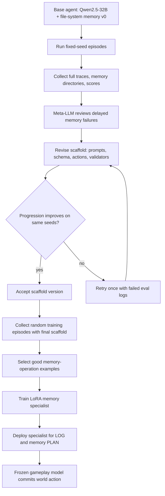

# AutoMem：把记忆管理当成 Agent 可以学习的认知技能

## 元信息

- **论文**：AutoMem: Automated Learning of Memory as a Cognitive Skill
- **作者**：Shengguang Wu、Hao Zhu、Yuhui Zhang、Xiaohan Wang、Serena Yeung-Levy
- **机构**：Stanford University
- **发布日期**：2026-07-01
- **原文**：[arXiv:2607.01224](https://arxiv.org/abs/2607.01224)
- **项目页**：[AutoMem project](https://autolearnmem.github.io/)
- **类别**：大模型 Agent、长程任务、外部记忆、自动化 Agent 优化

## TL;DR

- **这篇论文做什么**：AutoMem 把 LLM Agent 的外部记忆管理定义成一种可学习技能，而不是固定的 RAG、summary buffer 或 scratchpad 组件。Agent 在同一个动作空间里同时执行任务动作和文件系统记忆动作，例如 `READ`、`SEARCH`、`APPEND`、`UPSERT_MAP`。
- **怎么做**：方法包含两个外层循环。第一层让强 meta-LLM 阅读完整 episode trace、记忆目录和 agent 代码，迭代修改 prompt、文件 schema、action vocabulary 与验证逻辑；第二层让 meta-LLM 从 agent 自己的轨迹中筛选好的记忆操作，配套 LoRA 配置，训练一个专门处理记忆操作的 memory specialist。
- **实验与证据**：作者在 Crafter、MiniHack、NetHack 三个程序生成的长程游戏上评测。Qwen2.5-32B-Instruct 只优化记忆，不训练任务动作权重，就从 v0 的 25.00 / 7.50 / 0.42 progression 提升到 51.36 / 30.00 / 1.85，约为 2x 到 4x 收益。
- **关键数字**：scaffold 优化使 Crafter 从 25.00% 到 47.27%，MiniHack 从 7.50% 到 27.50%，NetHack 从 0.42% 到 1.57%；再加 memory training 后分别到 51.36%、30.00%、1.85%。冗余写入下降 68% 到 83%，空搜索率下降 13% 到 50%，NetHack 地图每步增长从 138 字符降到 6 字符，约 95% 压缩。
- **局限**：记忆是 episode 内的临时文件系统，不跨 episode 持久化；实验集中在游戏环境，不等于真实软件工程或网页 Agent；三种环境分别优化 scaffold 与 specialist，尚未证明一个通用记忆技能能跨任务复用。


## 研究问题：为什么把记忆当成技能，而不是模块？

### 论文真正要反驳什么？

作者针对的是长程 Agent 里一个常见默认假设：

- 只要给 Agent 一个外部存储模块，例如 vector store、summary buffer、scratchpad 或文件目录；
- 再写好固定的 retrieval / summarization / pruning 规则；
- Agent 就能稳定从长轨迹中保留有用状态。

AutoMem 的反驳更具体：

- **知道写什么**是一种策略，不是文件 API 自带的能力；
- **知道何时查找**是一种策略，不是上下文窗口变长后自动出现的能力；
- **知道如何组织记录**是一种策略，不是把所有观察 append 到日志就能得到的能力；
- **错误记忆的代价延迟暴露**，第 50 步漏记地图坐标，可能到第 800 步才表现为迷路或重复探索。

因此论文借用认知科学里的 metamemory 视角：人类不仅有记忆，还会监控和调节自己的记忆过程。AutoMem 把这个监控和调节过程落到 LLM Agent 上，问题就变成：

> 如果记忆管理本身是一项能力，能不能让 Agent 通过完整轨迹反馈来学习这项能力？

### 为什么选择游戏，而不是文档问答？

论文选择 Crafter、MiniHack、NetHack，不是因为游戏更炫，而是因为它们满足三个条件：

| 条件 | 对记忆研究的意义 | 具体环境 |
| --- | --- | --- |
| 长程轨迹 | 上下文窗口不能直接容纳所有历史 | Crafter 约 10^3 步，NetHack 可到 10^4 到 10^5 步 |
| 程序生成 | 预训练知识不能简单背答案 | 每个 seed 的地图、怪物、物品不同 |
| 可观测记忆需求 | 地图、库存、目标、失败动作都需要结构化记录 | Crafter 资源链，MiniHack 迷宫，NetHack 地牢 |

这个选择让论文能够把“记忆是否有效”连接到任务 progression，而不是只评估检索命中率。

## 论文主张与论证路线

| Claim | Mechanism | Evidence | Boundary |
| --- | --- | --- | --- |
| 记忆管理是可学习技能 | 文件系统操作进入 Agent 动作空间，LOG 和 PLAN 都由模型决策 | v0 文件记忆已经强于 sliding window，scaffold 与 training 继续叠加收益 | 只证明了文件系统式 episodic memory，不证明所有记忆形态都同样可学 |
| 结构优化能显著改变任务行为 | meta-LLM 读完整 trace，修改 prompt、schema、动作接口和自动提示 | 三个环境 scaffold opt. 后 progression 分别约 1.89x、3.67x、3.74x | 修改的是 scaffold，不是模型权重；收益依赖强 meta-LLM 和可运行评测 |
| 参数化记忆能力还能继续提升 | 从 agent 自己轨迹中筛选记忆操作，LoRA 训练 memory specialist | 训练后 Crafter +4.09、MiniHack +2.5、NetHack +0.28 progression points | 训练集小而任务专用，未证明跨环境泛化 |
| 记忆改善会间接改善行动 | 任务动作与记忆动作共享 action space，完整 trace 暴露卡住、来回走、重复写 | unproductive action rate 下降 32% 到 65%，冗余写入下降 68% 到 83% | 目前指标是游戏行为指标，不等价于真实工具 Agent 的可靠性 |

这条论证路线的关键不是“多一个 memory module”，而是把长程 Agent 优化拆成两个可审查对象：

1. **结构上限**：Agent 有哪些记忆动作、文件格式、自动提示和 schema 约束。
2. **模型熟练度**：在给定结构里，模型是否会先查后写、少写重复、及时读关键文件。

## 方法机制：两层外循环如何工作？


### Inner loop：把文件系统变成动作空间

内层 Agent 在每一步执行两个 routine：

- **LOG routine**：回答“刚刚发生的事情，有什么值得写入记忆？”
- **PLAN routine**：回答“现在行动前，需要从记忆里查什么？”

在这个设置中，记忆不是后台服务，而是可追踪动作。一个 episode 的轨迹里会同时出现：

- task action：移动、采集、攻击、开门、下楼；
- memory action：读文件、搜索文件、追加日志、创建文件、upsert 地图坐标；
- observation：环境反馈、库存变化、位置变化、失败动作；
- memory directory：episode 中逐步演化的外部记忆状态。

这种设计有一个重要后果：meta-LLM 可以像代码审查者一样看完整执行日志，而不是只看最后分数。

### Outer-loop #1：优化 scaffold，也就是记忆结构

第一层循环不训练模型权重，而是修改 Agent scaffold：

- prompt 中如何要求 LOG 和 PLAN；
- 文件 schema 如何组织地图、库存、目标、状态；
- action vocabulary 是否需要新增专用动作；
- 自动提示是否能阻止重复动作或不可能 craft；
- 评测 gate 是否接受本轮修改。

论文中的接受规则很硬：

```text
Input: previous scaffold S_t, fixed evaluation seeds E, full traces T_t
State: agent code, prompts, memory schema, action vocabulary
Loop:
  1. meta-LLM reads traces T_t, memory directories, and scaffold S_t
  2. meta-LLM proposes revised scaffold S_{t+1}
  3. run S_{t+1} on the same fixed seeds E
  4. if average progression improves:
       accept S_{t+1}
     else:
       allow one retry with failed eval logs
Output: converged scaffold S*
Failure boundary: no scalar reward alone is enough; the loop needs readable trajectory evidence
```

这里最有说服力的例子来自 NetHack。v0 的 `dungeon_map.txt` 是 append-only，Agent 回到同一坐标会不断写重复条目，地图文件越来越长，真正有用的坐标被噪声埋掉。meta-LLM 通过完整 trace 看到这个模式后，加入了坐标键控的 `UPSERT_MAP`。


### Outer-loop #2：训练 memory specialist，也就是记忆熟练度

第二层循环假设 scaffold 已经基本收敛，剩下的问题是模型是否会在这个结构里做出好记忆决策。

训练不是让 meta-LLM 生成新答案，而是从 base agent 自己的 episode 中筛选值得强化的记忆操作：

- Crafter：收集 100 个训练 episode；
- MiniHack：8 个任务各 50 个，共 400 个训练 episode；
- NetHack：收集 50 个训练 episode；
- eval seeds 固定为 42 到 51，训练 seeds 与评测 seeds 明确分离；
- 最终筛出 Crafter 1597 条、MiniHack 444 条、NetHack 800 条训练样本。

部署时使用两模型结构：

| 模型实例 | 是否训练 | 负责什么 | 为什么这样拆 |
| --- | --- | --- | --- |
| memory specialist | LoRA 训练 | LOG，以及 PLAN 中的记忆检索与整理 | 让 loss 聚焦在记忆操作，不被游戏动作格式稀释 |
| gameplay model | 冻结原始 Qwen2.5-32B-Instruct | 最终 world action | 保留基础行动能力，避免训练破坏动作格式 |

这使论文可以主张：提升来自记忆能力，而不是把整个 Agent 重新训练成更会玩游戏的模型。

## 公式解释：AutoMem 的优化对象是什么？

论文把两个循环写成同一个抽象：

```text
theta_structure = {code, prompts, memory schema, action vocabulary}
theta_proficiency = LoRA weights of memory specialist

trajectory = run_agent(environment, theta_structure, theta_proficiency)
review_signal = meta_LLM(trajectory, memory_directory, code, score)

Loop 1:
  theta_structure <- revise_code_and_schema(review_signal)

Loop 2:
  theta_proficiency <- supervised_update(curated_memory_actions, lora_config)
```

这不是传统端到端 RL，而是“轨迹级审查 -> 有针对性的结构或参数更新”。它的优势是可解释：

- 失败点能追到具体文件、具体坐标、具体重复写入；
- scaffold 修改能被代码 diff 和固定 seed gate 审查；
- training data 是模型自己真实产生过的 memory action；
- gameplay model 冻结，避免把任务行动和记忆操作混在一起解释。

它的风险也同样明确：

- meta-LLM 可能误诊 trace；
- gate 只看固定 seeds 的平均 progression，可能过拟合；
- LoRA specialist 学到的是任务内记忆习惯，未必跨任务迁移；
- 记忆写入能力增强后，也可能增强错误状态的持久化。

## 实验设置：benchmark、baseline、指标

### 环境与 episode 规模

| 环境 | 任务性质 | 动作空间与长度 | 记忆压力 |
| --- | --- | --- | --- |
| Crafter | 2D 生存、采集、制作、战斗 | 17 个动作，约 10^3 步 | 资源链、成就清单、地图和库存变化 |
| MiniHack | 迷宫、Boxoban、走廊、任务 | 8 个任务，33 个动作，约 10^2 步 | 位置、可通行方向、分支走廊、任务规则 |
| NetHack | 完整 roguelike 地牢 | 200+ 动作，10^4 到 10^5 步 | 地图坐标、怪物、物品、状态、楼层目标 |

### 指标怎么读？

论文使用 BALROG 的 progression rate，缩放到 0 到 100：

- Crafter：22 个 achievement 的完成比例；
- MiniHack：8 个任务变体的完成比例；
- NetHack：结合地牢层数和经验等级的 progression；
- 评测固定 seeds 为 42 到 51；
- Crafter 10 个 episode，MiniHack 每任务 5 个共 40 个，NetHack 5 个。

### Baseline 覆盖哪些对照？

| 组别 | 模型或方法 | 作用 |
| --- | --- | --- |
| frontier proprietary | Gemini-3-Pro、Gemini-3.1-Pro-Thinking、Claude-Opus-4.5、Gemini-2.5-Pro | 看 AutoMem 是否接近前沿系统 |
| open-weight | DeepSeek-R1、Qwen2.5-72B、Qwen2.5-7B | 判断 32B + 记忆优化是否能超过更大开源模型 |
| context baseline | 16-step sliding window、sliding window + CoT | 判断收益是否只是普通上下文管理 |
| AutoMem stages | v0 file memory、scaffold opt.、memory training | 拆开结构优化与参数训练的贡献 |

## 主结果：2x 到 4x 的收益来自哪里？

### Table 1 的核心数字

| Agent | Crafter | MiniHack | NetHack |
| --- | ---: | ---: | ---: |
| Qwen2.5-32B sliding window | 19.55 | 2.50 | 0.00 |
| Qwen2.5-32B + CoT | 17.27 | 10.00 | 0.00 |
| memory-as-file-system v0 | 25.00 | 7.50 | 0.42 |
| + scaffold opt. | 47.27 | 27.50 | 1.57 |
| + memory training | 51.36 | 30.00 | 1.85 |
| Claude-Opus-4.5 | 49.50 | 27.50 | 2.00 |
| Gemini-3.1-Pro-Thinking | 55.00 | 27.50 | 2.60 |

三个观察最重要：

1. **v0 文件记忆已经不是无效模块**：Crafter 上从 sliding window 的 19.55 到 v0 的 25.00，说明让 Agent 自己管理文件有初始价值。
2. **结构优化是最大收益来源**：MiniHack 从 7.50 到 27.50，NetHack 从 0.42 到 1.57，主要来自 prompt、schema 和自动提示的演化。
3. **训练不是噱头，但增量较小**：training 在 optimized scaffold 上继续带来 Crafter +4.09、MiniHack +2.50、NetHack +0.28，说明参数熟练度能叠加，但不是全部收益来源。

### 行为指标说明了什么？

论文不只报 progression，还看动作和记忆行为：

| 行为指标 | 变化 | 解释 |
| --- | --- | --- |
| unproductive action rate | 下降 32% 到 65% | Agent 少卡住、少来回走 |
| redundant memory writes | 下降 68% 到 83% | 记忆文件少被重复观察污染 |
| empty-search rate | 下降 13% 到 50% | 搜索更可能命中有用内容 |
| per-step input context | 下降 3% 到 30% | 文件结构更紧凑，输入上下文压力下降 |
| NetHack map growth | 138 到 6 字符/步 | `UPSERT_MAP` 把重复坐标压掉 |

这组指标支撑了论文最强的机制解释：记忆优化不是只让日志更好看，而是减少了无效行动，使 Agent 把更多步数用于探索、收集、制作或下楼。

## 消融与失败案例：哪些设计最值得保留？

### Scaffold 迭代暴露了哪些失败模式？

| 环境 | v0 主要失败 | scaffold 修复 |
| --- | --- | --- |
| Crafter | 不知道下一步 craft 需要什么，反复尝试不可能动作 | 加成就清单、库存变化提示、材料检查、危险提醒 |
| MiniHack | 来回踱步、方向问题时输出长回答、地图通行性误读 | 记录已访问 cell、未探索方向、方向问题短答、按任务解析 tile |
| NetHack | append-only 地图爆炸，目标和状态需要模型自己反复整理 | `UPSERT_MAP`、自动同步 inventory/status、预填策略目标、下楼高优先级提示 |

这些不是通用“多思考一步”的提示，而是根据 trace 找到的具体结构性错误。尤其 NetHack 的修改说明，长程任务里的记忆失败往往不是“不知道答案”，而是“记录格式让以后无法使用答案”。

### Memory specialist 学到了什么？

Table 2 的 LOG-phase writes per SEARCH 是很好的行为证据：

| 环境 | Base | + Trained | 相对变化 |
| --- | ---: | ---: | ---: |
| Crafter | 0.84 | 0.39 | -54% |
| MiniHack | 2.89 | 0.82 | -72% |
| NetHack | 4.66 | 1.31 | -72% |

这个指标越低，说明模型越倾向于先搜索已有记忆，再决定是否写入。它对应了一个具体的记忆纪律：**consult-before-write**。这比“训练后分数更高”更有解释力，因为它把参数更新连接到了可观察的操作习惯。

### 失败边界仍然明显

论文没有声称 AutoMem 解决长程 Agent：

- NetHack 绝对分数仍低，1.85% progression 远未接近人类或专门 RL agent；
- frontier 系统在 NetHack 上也仍然困难，Gemini-3-Pro 为 6.8%，但 AutoMem 还没有跨过这个差距；
- fixed seed gate 让结果可比，但也可能让 scaffold 对某些种子模式更敏感；
- meta-LLM 审查完整 trace 的成本和可复现性，需要开源代码和 prompt 才能进一步确认。

## Detail inventory：方法、数据、训练与证据清单

### 方法 inventory

| 组件 | 输入 | 状态 | 输出 | 失败边界 |
| --- | --- | --- | --- | --- |
| LOG routine | 上一步 action、observation、现有文件摘要 | 文件系统记忆目录 | 写入、追加、重写、跳过 | 可能把噪声写成长期事实，也可能漏记延迟有用信息 |
| PLAN routine | 当前 observation、目标、可检索文件 | 共享对话历史与记忆文件 | 检索、读取、最终 world action | 搜索 query 不准会造成空搜索，读错文件会误导行动 |
| Scaffold optimizer | 完整 episode trace、agent code、memory directory、分数 | prompt、schema、动作词表、验证逻辑 | 可运行 scaffold revision | 依赖 meta-LLM 诊断质量，且可能适配固定 seeds |
| Training engine | trace pool、筛选标准、评测反馈 | 数据配比、LoRA 配置、memory examples | memory specialist adapter | 样本来自 agent 自己，覆盖不到从未出现过的好策略 |
| Two-model deployment | 共享对话历史、同一环境 observation | specialist 与 frozen gameplay model | 先处理记忆，再提交任务动作 | handoff 边界如果设计不好，会让记忆建议和行动决策脱节 |

### 数据与训练 inventory

这篇论文的训练设置有几个值得单独记住的细节：

- **训练数据不是人工答案**：meta-LLM 不直接当 teacher 写新 response，而是从 agent 自己的轨迹里挑选值得强化的记忆操作。
- **训练目标不是完整任务**：样本会过滤掉只有 gameplay action、没有 memory operation 的片段；如果片段同时有记忆操作和游戏动作，会裁掉最终游戏动作，只保留记忆操作相关内容。
- **训练与评测 seed 分离**：评测固定为 42 到 51，训练 seed 随机抽取且明确不与评测重合。
- **LoRA 配置按环境区分**：Crafter 与 NetHack 使用 rank 256、alpha 512；MiniHack 使用 rank 128、alpha 256；Crafter 只训 attention-only target modules，NetHack 只训 1 epoch。
- **评测不只看分数**：论文同时追踪无效行动率、冗余写入、空搜索、每步上下文长度、LOG 阶段写入/搜索比。

这说明 AutoMem 的贡献并不只是一个“让模型多写文件”的 prompt。它把训练对象缩到一个很窄但可验证的操作面：<u>模型在外部记忆上的决策习惯</u>。

### 可复现实验链路 inventory



这个流程图强调两点：

- 第一，scaffold 的每次修改都必须回到同一组评测 seeds 上验证，不是靠 meta-LLM 自评。
- 第二，LoRA specialist 的部署位置很窄，它不直接替代任务模型，而是占据 LOG 和 PLAN 中的记忆部分。

### 关键 evidence points

| 证据点 | 数字 | 支撑的结论 | 仍不能证明什么 |
| --- | ---: | --- | --- |
| Crafter scaffold opt. | 25.00 -> 47.27 | 结构化记忆能显著改善资源链与制作行为 | 不能证明真实机器人任务也同样收益 |
| MiniHack scaffold opt. | 7.50 -> 27.50 | 地图、方向和任务规则提示能减少迷宫类失败 | 不能证明 open-ended planning 已解决 |
| NetHack scaffold opt. | 0.42 -> 1.57 | 坐标键控地图比 append-only 记录更可用 | 绝对分仍低，远未掌握 NetHack |
| Memory training | 51.36 / 30.00 / 1.85 | specialist 在固定 scaffold 上继续带来增量 | 不证明单一 specialist 跨环境泛化 |
| LOG writes / SEARCH | 0.84->0.39、2.89->0.82、4.66->1.31 | 训练内化了先查后写纪律 | 不证明所有写入都是正确写入 |
| 冗余写入下降 | 68% 到 83% | scaffold 改善了记忆卫生 | 不证明保留下来的记录没有偏差 |

### 研究者应如何复核这篇论文？

如果要把 AutoMem 当成后续研究基线，最需要复核的不是摘要里的 2x 到 4x，而是下面这些更容易出问题的环节：

1. **Trace review 是否稳定**  
   同一批失败轨迹交给不同 meta-LLM，是否会提出相同 scaffold 修改？如果不同，哪些修改是真正必要，哪些只是 prompt 风格差异？

2. **Gate 是否对 seed 分布过拟合**  
   固定 seeds 保证阶段可比，但也可能让 scaffold 学到 seed-specific pattern。更强复核应报告 held-out seeds、不同地图分布和更长 episode 的表现。

3. **Specialist 是否牺牲了探索多样性**  
   consult-before-write 降低冗余写入，但也可能让模型更保守。需要看它是否漏写少见但关键的突发事件，例如新怪物、陷阱、一次性道具。

4. **文件系统记忆是否引入安全面**  
   如果这个方法迁移到网页或代码 Agent，文件内容可能来自不可信网页、工具错误或用户攻击。那时 `UPSERT`、`APPEND` 和 `SEARCH` 都需要 provenance、权限和清理策略。

5. **成本是否可接受**  
   完整 episode 可达 10^5 步，meta-LLM 读完整轨迹的成本很高。论文展示了可行性，但生产系统还需要 trace compression、分层摘要和抽样诊断。

### 一个更保守的结论

这篇论文最稳妥的结论不是“记忆训练让 32B 模型达到 frontier”，而是：

- 长程 Agent 的外部记忆不能只靠容量；
- 记忆文件的结构、写入纪律、读取时机都会直接影响行动质量；
- 这些因素可以通过完整轨迹审查被发现、被修改、被训练；
- 即使不改任务动作模型，仅优化记忆层也能带来可测量收益。

这个结论对 Agent 研究很重要，因为它把“上下文不够”从一个模型尺度问题，转成了一个可工程化、可审计、可后训练的操作问题。

## Figure 与 Table 逐项证据解读

### Figure 1：性能提升不是单次跳变

Figure 1 显示 v0 到 v5/v4/v2 的 scaffold 优化曲线，再叠加 +train。它的作用是说明 AutoMem 不是一次 prompt 改写，而是多轮接受门控后的渐进改进。

需要注意：

- Crafter 到 v5，MiniHack 到 v4，NetHack 到 v2，环境复杂度不同，收敛步数也不同；
- 曲线证明“循环能找到改进”，但不能证明会稳定找到全局最佳 scaffold；
- frontier y-tick 只是对照参考，不代表同等预算或同等工具条件。

### Figure 3：方法贡献在两层循环的分工

Figure 3 的核心是拆分：

- 上半部分是 **结构学习**：meta-LLM 修改 scaffold；
- 下半部分是 **熟练度学习**：meta-LLM 筛数据并配置 LoRA；
- 中间的文件系统是共同对象：两个循环都围绕记忆动作优化。

它支撑论文的一个重要限制：如果没有可观察的 memory action 和 memory directory，meta-LLM 很难做这种轨迹级诊断。

### Figure 5：最具体的机制证据

Figure 5 比主结果表更能说明“为什么有效”。append-only 地图的失败是工程上非常常见的长程 Agent 问题：

- 信息没有丢，但被重复项淹没；
- 模型每步读到的上下文更长，但可用信号更少；
- 以为“保存越多越安全”，实际造成检索和规划负担。

`UPSERT_MAP` 把记忆从流水账改成状态表，这个变化和 NetHack per-step map growth 从 138 到 6 字符直接对应。

## 相关工作中的位置判断

### 与 RAG / MemGPT / Generative Agents 的差别

很多外部记忆方法把记忆看成系统模块：

- RAG 偏重检索文档；
- MemGPT 强调分页式上下文管理；
- Generative Agents 维护 timestamped memory stream；
- MemoryBank、A-MEM 等关注长期记忆存储与更新。

AutoMem 的差别在于：它关心“模型如何学会操作记忆”，而不只是“系统给模型什么记忆容器”。

### 与 MemAct / MemSkill / MeMo 的关系

论文把自己放在“memory as action”和“memory skill”方向：

- MemAct 也强调记忆操作作为行动，但更多针对上下文窗口本身；
- MemSkill 把记忆操作看成可演化技能；
- MeMo 使用单独 memory model，但目标是静态知识问答；
- AutoMem 同时优化 scaffold 和 memory specialist，且以长程任务 episode trace 作为反馈。

因此它的研究位置可以概括为：

> 从“设计一个记忆模块”推进到“训练和演化一个会管理记忆的 Agent”。

## 结论与局限：这篇论文改变了什么理解？

### 最值得带走的判断

1. **长程 Agent 的瓶颈不只是推理，也包括记忆卫生**  
   冗余写入、空搜索、不可用地图、过期状态都会转化为无效行动。

2. **外部记忆需要可观察操作**  
   如果 memory module 是黑箱，meta-LLM 就很难定位第几步写错、读漏或 schema 失效。

3. **结构优化和参数训练应分开看**  
   AutoMem 的大头收益来自 scaffold，LoRA specialist 提供额外但较小的 consult-before-write 熟练度提升。

4. **“冻结任务模型，只训记忆模型”是一个有用安全边界**  
   它保留了 base gameplay model 的动作格式和任务能力，同时让训练目标更集中。

### 证据不能推出什么？

- 不能推出真实办公、代码、浏览器 Agent 上也会有 2x 到 4x；
- 不能推出跨 episode persistent memory 已经解决；
- 不能推出 meta-LLM 自动审查一定可靠；
- 不能推出更强 base model 不需要结构化记忆；
- 不能推出增强记忆一定安全，因为错误状态也可能被更牢固地保存。

## 领域延伸：对 Agent 研究的后续问题

### 1. 记忆技能能否跨任务迁移？

AutoMem 为每个环境分别优化 scaffold 和 specialist。下一步最关键的问题是：

- 一个 memory specialist 能否同时服务 Crafter、MiniHack、NetHack？
- 是否存在跨任务的通用记忆动作，比如 `UPSERT_STATE`、`RETRIEVE_GOAL`、`PRUNE_DUPLICATE`？
- scaffold 专用性和模型通用性之间应该如何分层？

### 2. 安全 Agent 是否需要“记忆审计协议”？

如果 Agent 能写长期文件，就必须能审计：

- 哪个工具调用写入了哪条长期记忆；
- 记忆是否来自不可信网页、用户输入或工具输出；
- 记忆 schema 是否允许覆盖、撤销、过期；
- Agent 是否会把一次错误观察升级成长期策略。

AutoMem 提供了可观察 memory action 的起点，但安全部署还需要 provenance、权限和过期策略。

### 3. 后训练能否专门训练“操作习惯”？

这篇论文的 memory specialist 不学最终任务答案，而学操作习惯。这对后训练很有启发：

- 可以训练“先查证再回答”；
- 可以训练“先检查权限再执行工具”；
- 可以训练“写入状态前先搜索已有状态”；
- 可以训练“高风险动作前生成可验证计划”。

这些都不是通用 SFT 里的答案模仿，而是 Agent 在工具环境里的 procedure learning。

### 4. Trace-level review 能否成为 Agent 优化的基础范式？

AutoMem 的 meta-LLM 像代码审查者一样阅读完整轨迹。这个范式可以外推到：

- browser Agent：定位错误点击、表单状态污染和网页记忆误用；
- coding Agent：定位错误假设何时进入 TODO、缓存或测试计划；
- security Agent：定位误报规则、遗漏证据和攻击链状态；
- research Agent：定位文献筛选、笔记组织和引用边界。

真正的问题是成本：完整 trace 可能长达 10^5 步，如何压缩、分片、采样并保持诊断有效，是比“让模型多看日志”更难的系统问题。

## 参考链接

- [arXiv abstract and official submission date](https://arxiv.org/abs/2607.01224)
- [arXiv HTML full text](https://arxiv.org/html/2607.01224)
- [AutoMem project page](https://autolearnmem.github.io/)
- [AutoMem GitHub repository](https://github.com/autoLearnMem/AutoMem)
