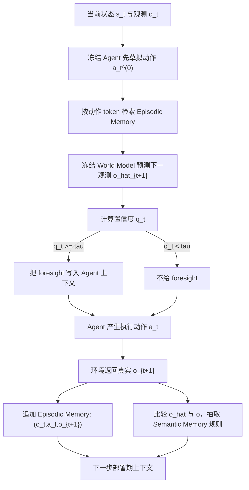

# Self-Evolving World Models for LLM Agent Planning：让 Agent 的世界模型在部署期“记住自己错在哪里”

### 元信息

| 字段 | 内容 |
|---|---|
| 论文 | Self-Evolving World Models for LLM Agent Planning |
| 作者 | Xuan Zhang, Wenxuan Zhang, See-Kiong Ng, Yang Deng |
| 链接 | https://arxiv.org/abs/2606.30639 |
| arXiv | 2606.30639v1，2026-06-29 17:58:43 UTC |
| 类型 | 大模型 Agent / 世界模型 / 长程规划 |
| 评测 | Word2World、ALFWorld、ScienceWorld、AgentBoard |
| 方法名 | WorldEvolver |

### TL;DR

- 这篇论文研究一个很具体的问题：长程 LLM Agent 在执行动作前，如果让一个世界模型预测“下一步会发生什么”，这种 foresight 什么时候会帮忙，什么时候会误导。
- 作者提出 **WorldEvolver**：不更新 Agent 参数，不更新世界模型参数，而是在部署期更新外部上下文记忆，让世界模型从真实转移和预测错误中修正自己。
- WorldEvolver 有三个模块：**Episodic Memory** 记录真实 `(observation, action, next observation)` 转移；**Semantic Memory** 把预测-观测不一致抽成可复用规则；**Selective Foresight** 用 token 概率置信度过滤低可信预测。
- 论文先用一个 oracle 诊断说明风险：在 ALFWorld 上，无 foresight 的动作准确率是 **0.385**，噪声 foresight 降到 **0.344**，完美 foresight 升到 **0.493**；在 ScienceWorld 上，对应为 **0.271 / 0.251 / 0.281**。
- 在 Word2World 预测任务上，WorldEvolver 在三个 backbone、两个环境中都拿到最高预测精度；例如 Gemma-4-31B 在 ScienceWorld 的 Exact Match 从 RAWM-ϕ 的 **32.84** 提到 **62.03**。
- 在 AgentBoard 规划任务上，WorldEvolver 是最强 world-model 方法；带 Selective Foresight 后，Gemma-4-26B-A4B 的 ScienceWorld ReAct 成功率从无世界模型的 **44.44** 提到 **52.22**。
- 消融结论很清楚：Episodic Memory 是主增益来源；Semantic Memory 在 ScienceWorld 这种动态更复杂的环境里补充明显；Selective Foresight 的价值是避免“预测得越多，错得越有害”。
- 局限也同样明确：实验只覆盖 ALFWorld 和 ScienceWorld 这类文本环境；置信度过滤依赖可获得 token logprob；论文还没有证明该框架能直接迁移到 Web、代码生成、机器人或多模态 Agent。

### 研究问题：为什么 Agent 需要会“自我修正”的世界模型？

- 传统 LLM Agent 常用两类补强方式：
  - **记忆型补强**：复用过去反馈、轨迹、技能库或长期上下文。
  - **世界模型型补强**：在执行动作前预测后果，让 Agent 先看一眼可能的未来。

- 这篇论文关心的是第二类，但它没有把世界模型当成一个静态 oracle。

- 作者指出，部署期会出现三个冲突：

| 冲突 | 具体含义 | 为什么重要 |
|---|---|---|
| 预测有用但不稳定 | 真实环境和新任务会让离线世界模型分布外 | 长程 Agent 的动作后果依赖上下文细节 |
| 在线微调代价太高 | 每次 mismatch 都更新大模型参数不现实 | 容易过编辑、遗忘，也增加部署成本 |
| 错误预测会改变动作 | foresight 一旦进入 Agent 上下文，就会影响下一步 action | 噪声预测可能比不给预测更糟 |

- 因此，论文真正提出的问题不是“能不能训练一个更强世界模型”，而是：

> 在 Agent 和世界模型参数都冻结时，能否只通过部署期上下文记忆，让世界模型逐步吸收真实环境反馈，并只在预测足够可信时才把 foresight 暴露给 Agent？

### 论文主张与论证路线

| Claim | Mechanism | Evidence | Boundary |
|---|---|---|---|
| 世界模型 foresight 对长程规划有潜力，但噪声会伤害决策 | 先用 no / noisy / perfect foresight 做 oracle 诊断 | Figure 2：ALFWorld 噪声 foresight 低于 no foresight，perfect foresight 明显更高 | 诊断只用固定 backbone 和 Word2World teacher action，不等价于完整任务成功率 |
| 部署期修正不必更新参数 | 把真实转移写入 Episodic Memory，把 mismatch 写入 Semantic Memory | Algorithm 1：执行后追加真实转移，并基于预测-观测差异更新规则 | 规则质量依赖 LLM critic 和 factorization 是否可靠 |
| 具体轨迹记忆比静态检索更有效 | 用 action-token Jaccard 检索相似过去动作转移 | Table 1：w/o Semantic Memory 仍显著强于 RAWM-ϕ，多数场景提升很大 | 检索键设计可能是主要原因，不代表所有静态检索都弱 |
| 抽象规则能弥补单纯 episodic replay 的不足 | mismatch 经 factorized tuples 和 critic 变成规则 | Table 1：Gemma 系列在 ScienceWorld 加 Semantic Memory 后提升尤其大 | Qwen3.5-9B 上增益较小，说明 backbone 预测能力仍是瓶颈 |
| 低置信预测应该被过滤 | 用平均 token logprob 的指数作为 confidence `q_t`，低于阈值则不给 Agent | Table 2：Selective Foresight 在所有设置中改善或持平 no-filter 版本 | 需要 backend 暴露 token probability；闭源 API 未必支持 |

### 方法机制：WorldEvolver 到底更新了什么？

- WorldEvolver 的核心设计是：**更新上下文，不更新权重**。



### Episodic Memory：把真实转移作为“可检索模拟案例”

- Episodic Memory 存储的是具体交互经验：

```text
M_E^t = { (o_i, a_i, o_{i+1}) }_{i < t}
```

- 当世界模型要预测候选动作 `a_t` 的后果时，它不是从全部历史里随便拼上下文，而是按动作 token 的 Jaccard 相似度选 top-k：

```text
M_E,k(a_t) = TopK_{(o_i,a_i,o_{i+1}) in M_E^t} sim(a_t, a_i)

sim(a_t, a_i) = Jaccard(action_token_set(a_t), action_token_set(a_i))
```

- 这个设计的意义：
  - 它把“预测下一状态”变成一种 retrieval-based simulation。
  - 它避免 RAWM-ϕ 那种长状态文本检索被重复环境描述稀释。
  - 它保证严格在线：第 `t` 步只能检索第 `t` 步之前发生过的转移。

- 论文里最有力的证据来自 Table 1：
  - 只去掉 Semantic Memory、保留 Episodic Memory 的版本已经很强。
  - 例如 Gemma-4-26B-A4B 在 ALFWorld Exact Match 上，RAWM-ϕ 是 **20.06**，WorldEvolver w/o `M_S` 是 **47.16**。
  - 在 ScienceWorld 上，同一对比是 **14.93** 到 **34.65**。

### Semantic Memory：把预测错误压缩成规则，而不是只存失败样本

- Semantic Memory 处理的问题是：具体案例有用，但不一定能覆盖新的状态组合。

- 作者把预测和真实观测先映射成 factorized tuples：

```text
predicted observation:  o_hat_{t+1}
real observation:       o_{t+1}

z_hat_{t+1} = g(o_hat_{t+1})
z_{t+1}     = g(o_{t+1})
```

- 其中 `g` 把自然语言观测转成对象、关系、动作元组。

- 论文给出的直觉例子是：

```text
"The fridge 1 is open. In the fridge 1, you see an apple 1."

可转成：
("fridge 1", "is", "open")
("apple 1", "in", "fridge 1")
```

- 当 `z_hat_{t+1}` 和 `z_{t+1}` 不一致时，LLM critic 不直接改参数，而是生成规则：

```text
(s_t, a_t) --W_theta--> o_hat_{t+1}
(o_hat_{t+1}, o_{t+1}) --g--> (z_hat_{t+1}, z_{t+1})
(z_hat_{t+1}, z_{t+1}) --LLM critic--> rule r_i
```

- Semantic Memory 存的是：

```text
M_S^t = { (r_i, e_i) }
```

- `r_i` 是启发式规则，`e_i` 是证据分数。

- 规则更新逻辑：
  - 新规则初始证据分数为 1。
  - 后续观测支持该规则，则增加证据。
  - 后续观测反驳该规则，则减少证据。
  - 只有 `e_i > 0` 的规则才进入世界模型上下文。

- 这个设计比“把所有错误都塞进 prompt”更谨慎：
  - 它有 factorization，避免只比较表面措辞。
  - 它有 evidence score，避免早期错误规则永久污染上下文。
  - 它可批处理 `k_MS` 个 mismatch，再统一抽规则。

### Selective Foresight：为什么预测不应该总是给 Agent 看？

- Figure 2 的初步实验已经说明：

| 环境 | No foresight | Noisy foresight | Perfect foresight |
|---|---:|---:|---:|
| ALFWorld | 0.385 | 0.344 | 0.493 |
| ScienceWorld | 0.271 | 0.251 | 0.281 |

- 这个表的含义不是“只要预测就一定好”，而是：
  - 完美预测确实有用。
  - 噪声预测会让 Agent 采取更差动作。
  - 世界模型必须具备 abstention 能力。

- Selective Foresight 使用平均 token log probability：

```text
l_t = (1 / n) * sum_{i=1..n} log p_theta(y_i | y_<i, s_t, a_t, M_t)
q_t = exp(l_t)
```

- `q_t` 是预测序列 token 概率的几何平均。

- 最终暴露给 Agent 的 foresight 是：

```text
F_t = o_hat_{t+1}, if q_t >= tau
F_t = empty,       if q_t <  tau
```

- 这相当于：
  - 世界模型可以说“我不知道”。
  - Agent 不必被每个模拟结果影响。
  - 系统把“生成预测”和“使用预测”分成两个决策。

### Algorithm 1：一次闭环更新如何发生？

```text
Input:
  state s_t
  observation o_t
  frozen agent policy pi_theta
  frozen world model W_theta
  episodic memory M_E^t
  semantic memory M_S^t
  retrieval size k_ME
  semantic batch size k_MS
  confidence threshold tau

State:
  memories are external context, not trainable parameters

Loop for one step:
  1. Agent samples draft action a_t^(0) from pi_theta(. | s_t)
  2. Retrieve top-k episodic transitions similar to a_t^(0)
  3. World model predicts o_hat_{t+1} and confidence q_t
  4. If q_t >= tau, expose o_hat_{t+1} as foresight F_t
     else expose empty foresight
  5. Agent samples final action a_t from pi_theta(. | s_t, F_t)
  6. If final action differs from draft action,
     re-query world model for the executed action
  7. Execute a_t in environment and observe o_{t+1}
  8. Append (o_t, a_t, o_{t+1}) to Episodic Memory
  9. Compare prediction and observation after factorization
  10. Update Semantic Memory rules from mismatch evidence

Output:
  executed action a_t
  updated M_E^{t+1}, M_S^{t+1}
```

- 第 6 步很关键：
  - Agent 最终执行的动作可能不是初始草稿动作。
  - 如果仍用草稿动作对应的预测去更新 Semantic Memory，就会把错误归因到错误动作。
  - 作者因此对执行动作重新预测，保证 mismatch 对齐真实执行动作。

### 实验设置：作者如何隔离世界模型的作用？

| 维度 | 设置 |
|---|---|
| 世界模型预测评测 | Word2World benchmark |
| 环境 | ALFWorld 与 ScienceWorld |
| 预测任务规模 | 每个环境 195 条测试轨迹 |
| Agent 规划评测 | AgentBoard |
| 规划任务规模 | 134 个 ALFWorld 任务，90 个 ScienceWorld 任务 |
| 每任务尝试 | best-of-5，每次最多 30 步 |
| Agent 类型 | ReAct 与 ReflAct |
| 预测指标 | Exact Match、Token F1、Qwen3-Embedding-8B Cosine Similarity |
| 规划指标 | Success Rate |
| 对比方法 | Zero-Shot、RAWM-ϕ、ITP-I、WorldEvolver variants |

- 实验设计的好处：
  - 固定 Agent 与 backbone，只改变 world-model foresight。
  - 分开看“预测准不准”和“规划是否更成功”。
  - 同时用 ReAct 与 ReflAct 检查不同推理风格是否受益。

- 实验设计的代价：
  - 文本环境更可控，但和 Web、代码、机器人、多模态任务存在距离。
  - Success Rate 是任务完成指标，不直接解释每一步决策质量。
  - best-of-5 会放大可迭代 replanning 的价值，但也更接近长程 Agent 的实际使用形态。

### Table 1：世界模型预测结果说明什么？

| Backbone | 环境 | RAWM-ϕ Exact Match | WorldEvolver Exact Match | 关键差距 |
|---|---|---:|---:|---:|
| Gemma-4-26B-A4B | ALFWorld | 20.06 | 52.88 | +32.82 |
| Gemma-4-26B-A4B | ScienceWorld | 14.93 | 51.55 | +36.62 |
| Qwen3.5-9B | ALFWorld | 14.41 | 37.04 | +22.63 |
| Qwen3.5-9B | ScienceWorld | 2.76 | 29.82 | +27.06 |
| Gemma-4-31B | ALFWorld | 34.33 | 56.41 | +22.08 |
| Gemma-4-31B | ScienceWorld | 32.84 | 62.03 | +29.19 |

- 这些数字支持三个判断：
  - 静态检索基线 RAWM-ϕ 已经强于 Zero-Shot，但不够。
  - ITP-I 在这组任务上经常低于 Zero-Shot，说明想象式 rollout 容易过生成细节。
  - WorldEvolver 的优势不是单一 backbone 偶然现象，三个 backbone、两个环境都成立。

- 消融更能解释机制：

| 版本 | 被移除部分 | 现象 | 解释 |
|---|---|---|---|
| w/o `M_E` | 去掉 Episodic Memory | 只剩 Semantic Memory，提升较小 | 抽象规则没有具体转移案例支撑，预测 grounding 不够 |
| w/o `M_S` | 去掉 Semantic Memory | 大幅超过 RAWM-ϕ，但低于完整版 | 真实转移检索是主力，规则负责补充泛化 |
| Full WorldEvolver | 两种记忆都保留 | 各项最高 | 具体案例与抽象规则互补 |

- 一个值得注意的细节：
  - RAWM-ϕ 可以从固定检索库中拿 transition。
  - WorldEvolver 的 Episodic Memory 是在线逐步积累。
  - 即便如此，WorldEvolver w/o `M_S` 仍显著领先。

- 这说明作者的论证重点不是“检索一定有用”，而是：
  - 检索对象应围绕动作转移。
  - 检索记忆应贴合部署期分布。
  - 具体经历应能被后续步骤复用。

### Table 2：预测准了，Agent 规划一定更好吗？

- 不一定。

- 论文把预测和规划分开评测，是因为 foresight 会进入 Agent 上下文并改变 action。

| Agent / 环境 | 无世界模型 | RAWM-ϕ | ITP-I | WorldEvolver w/o Ft | WorldEvolver w/ Ft |
|---|---:|---:|---:|---:|---:|
| ReAct / ALFWorld / Gemma | 23.88 | 22.39 | 25.37 | 24.63 | 26.12 |
| ReAct / ScienceWorld / Gemma | 44.44 | 43.33 | 34.44 | 46.67 | 52.22 |
| ReflAct / ALFWorld / Gemma | 26.12 | 20.15 | 23.13 | 24.63 | 27.61 |
| ReflAct / ScienceWorld / Gemma | 42.22 | 41.11 | 37.78 | 48.89 | 50.00 |
| ReAct / ALFWorld / GPT-5.4-mini | 49.25 | 41.79 | 38.81 | 43.28 | 50.75 |
| ReAct / ScienceWorld / GPT-5.4-mini | 65.56 | 57.78 | 60.00 | 62.22 | 63.33 |
| ReflAct / ALFWorld / GPT-5.4-mini | 50.00 | 42.54 | 30.60 | 44.78 | 47.01 |
| ReflAct / ScienceWorld / GPT-5.4-mini | 60.00 | 58.89 | 58.89 | 62.22 | 63.33 |

- 规划结果有四个层次：
  - RAWM-ϕ 和 ITP-I 经常低于无世界模型，说明静态或不可靠 foresight 会伤害动作选择。
  - WorldEvolver w/o Ft 已是最强 world-model 方法之一，但仍不总是超过无世界模型。
  - 加 Selective Foresight 后，Gemma-4-26B-A4B 四个设置全部超过无世界模型。
  - GPT-5.4-mini 本身更强，留下的增益空间更小，结果更混合。

- 这部分最重要的不是某个单点分数，而是：
  - 预测质量提升不自动等于规划提升。
  - 是否把预测暴露给 Agent，是独立且关键的控制变量。
  - 弱一些的 planner 更依赖可靠 foresight；强 planner 更可能已经能自己补足部分环境推理。

### 从“预测指标”到“规划指标”：中间缺了哪一层？

- 这篇论文最值得细读的地方，是它没有把 Table 1 的高分直接包装成最终结论。

- 在 Agent 系统里，世界模型输出要经历一条较长的因果链：

```text
world-model context
  -> predicted observation
  -> confidence filtering
  -> agent-visible foresight
  -> changed reasoning trace
  -> changed action
  -> environment transition
  -> task-level success or failure
```

- 这条链的每一段都会损失信息。

| 链路 | 可能损失 | 论文中的对应控制 |
|---|---|---|
| context -> prediction | 检索到无关转移，规则过时，world model 误读状态 | Episodic + Semantic Memory |
| prediction -> foresight | 预测文本看似合理但置信度低 | Selective Foresight |
| foresight -> action | Agent 忽略预测，或过度依赖预测 | ReAct / ReflAct 双 Agent 测试 |
| action -> success | 单步动作正确不保证整局任务成功 | AgentBoard best-of-5 Success Rate |
| success -> generality | 文本环境成功不保证开放域迁移 | Limitations 明确排除 Web、代码、机器人 |

- 因此，Table 1 和 Table 2 的关系应该这样读：
  - Table 1 证明 WorldEvolver 让世界模型更像环境。
  - Table 2 检查这种更像环境的预测是否真的能改变任务完成率。
  - 两张表之间的差距就是 Agent research 里最难处理的“预测有用性”问题。

- 这也解释了为什么 RAWM-ϕ 会出现一个反直觉现象：
  - 它在 Table 1 里通常比 Zero-Shot 预测更准。
  - 但在 Table 2 里经常比无世界模型规划更差。
  - 原因可能不是 RAWM-ϕ 完全无效，而是它的 foresight 一旦错在关键处，就会以自然语言形式强行进入 Agent 推理链。

- 这给后续研究一个很强的提醒：
  - “预测准确率”应该报告。
  - “被 Agent 使用后的任务收益”也必须报告。
  - 只报告前者，容易高估世界模型对 Agent 的真实贡献。

### 可复现性细节：哪些设置最值得复查？

- 如果要复现或扩展这篇论文，我会优先复查四类设置。

| 设置 | 论文选择 | 为什么敏感 |
|---|---|---|
| 记忆初始化 | `M_E` 和 `M_S` 均为空 | 决定是否存在冷启动劣势，也影响前几个 trial 的结果 |
| Episodic 检索键 | action-token Jaccard | 简单、可解释，但未必适合复杂自然语言动作 |
| Semantic 更新 | factorized tuple + LLM critic | critic prompt 和 tuple 粒度会影响规则质量 |
| 置信阈值 `tau` | 按 Agent / 环境设定 | 阈值调参可能贡献部分规划收益 |

- 其中 `tau` 最容易被忽略。

- 论文的 Selective Foresight 不是一个完全免调参模块：
  - 它需要决定何时相信世界模型。
  - Table 3 给出不同设置下使用的阈值。
  - Figure 6 和 Figure 11 说明置信度与准确率相关，但这不是跨环境恒定规律。

- 这意味着，迁移到新任务时不能直接照搬阈值。

- 一个更稳的复现实验应包含：
  - 固定 `tau` 的版本，检查是否仍有收益。
  - 自适应 `tau` 的版本，检查能否减少人工校准。
  - 无 logprob 条件下的替代 confidence，例如多次采样一致性。
  - 按任务难度分层报告，避免 easy split 饱和掩盖差异。

### 为什么 ScienceWorld 上的结论更有信息量？

- ALFWorld 和 ScienceWorld 都是文本环境，但它们给 WorldEvolver 的压力不同。

- 从论文结果看，ScienceWorld 往往更能放大 WorldEvolver 的差异：
  - Table 1 中，Semantic Memory 对 Gemma 系列在 ScienceWorld 的补充更明显。
  - Figure 4 中，ScienceWorld + Gemma-4-26B-A4B 的 best-of-L 曲线分离更清楚。
  - Figure 8 到 Figure 10 的任务类型分析也显示，动态跟踪要求更强的任务族更受益。

- 一个合理解释是：
  - ALFWorld 的家庭场景转移更规则，具体转移案例足以覆盖很多动作后果。
  - ScienceWorld 的实验、设备、物体状态变化更丰富，单纯 episodic replay 不够。
  - Semantic Memory 把失败转成规则，恰好补上“同一规律在不同表面状态中复用”的需求。

- 这并不说明 ScienceWorld 比 ALFWorld 更真实。

- 它说明的是：
  - 当环境转移更依赖隐含规律时，语义规则记忆更重要。
  - 当环境转移更模板化时，具体轨迹检索可能已经足够强。

### 一个更具体的失败模式：规则记忆如何被污染？

- 论文把 Semantic Memory 作为探索分支，这是合理的，但它也引入了新的风险面。

- 假设世界模型在某次失败后抽到一条错误规则：

```text
Rule:
  "If an object is mentioned near a container, it is probably inside that container."
```

- 这条规则在某些 ALFWorld 状态里可能暂时有用。

- 但如果后续环境反复出现“物体被提及但并不在容器中”的情况，它就会误导预测。

- 作者用 evidence score 缓解这个问题：
  - 支持规则的观测提高分数。
  - 反驳规则的观测降低分数。
  - 分数不大于 0 的规则不进入上下文。

- 但这里仍有三个开放问题：
  - 反驳证据是否能被 factorization 正确捕捉？
  - 多条弱规则冲突时，prompt 中的排列顺序是否影响世界模型？
  - 恶意或异常环境能否持续制造高分但错误的规则？

- 这也是为什么把 WorldEvolver 放到 AI 安全语境里看很有意思：
  - 它让 Agent 更会适应环境。
  - 但任何适应机制都可能成为记忆投毒、规则污染或上下文操控的入口。

### Figure 4 与 Figure 5：在线记忆为什么会随部署推进变强？

- Figure 5 研究 memory hyperparameters。

| 参数 | 含义 | 结论 |
|---|---|---|
| `k_ME` | Episodic retrieval size | 从 1 增到 5 显著提升 Exact Match |
| `k_MS` | Semantic mismatch batch size | 多数选择差异在 2 点以内 |
| 默认设置 | `k_ME = 5`, `k_MS = 1` | 保留强检索，同时避免规则更新过重 |

- 论文给出的关键数字：
  - `k_ME` 从 1 到 5，Gemma-4-26B-A4B 在 ALFWorld / ScienceWorld 上 Exact Match 分别提升 **16.8 / 23.5** 点。
  - Qwen3.5-9B 分别提升 **7.6 / 19.2** 点。
  - Gemma-4-31B 分别提升 **9.0 / 19.3** 点。

- Figure 4 看 best-of-L 的累计成功率。

- 这个图的作用是解释“部署期记忆”的时间性：
  - 第一次 trial 时记忆较少，WorldEvolver 优势未必最大。
  - 随着 trial 与任务推进，Episodic Memory 和 Semantic Memory 持续积累。
  - 在 ScienceWorld + Gemma-4-26B-A4B 上，WorldEvolver 和基线的分离更明显。

- 这说明 WorldEvolver 不是一次性 prompt trick。

- 它更像一种部署期学习机制：
  - 失败会变成规则。
  - 执行会变成转移案例。
  - 后续任务可以复用这些非参数记忆。

### Figure 与 Table 逐项证据解读

| 图表 | 支撑的论点 | 不能证明什么 |
|---|---|---|
| Figure 1 | 冻结世界模型、离线调参世界模型、自演化世界模型的结构差异 | 不能证明自演化一定优于在线微调，只说明设计空间 |
| Figure 2 | 噪声 foresight 会降低动作准确率，完美 foresight 有潜在收益 | 不能证明真实 WorldEvolver 的 foresight 总是接近 oracle |
| Figure 3 | WorldEvolver 的三模块闭环：episodic、semantic、selective | 不能证明每个模块在所有环境中同等重要 |
| Table 1 | WorldEvolver 的预测准确率系统性高于基线和消融 | 不能证明预测提升完全由 semantic rule 产生，episodic 是主因 |
| Table 2 | Selective Foresight 对规划成功率有实际帮助 | 不能证明强模型、所有任务族都受益 |
| Figure 4 | 在线记忆随 trial 推进带来持续收益 | 不能排除 best-of-L 与任务重复带来的额外优势 |
| Figure 5 | `k_ME` 比 `k_MS` 更敏感 | 不能证明 Jaccard 检索是最优检索函数 |
| Table 3 | 不同 Agent / 环境需要不同 `tau` 阈值 | 说明过滤需要校准，不是无参数方案 |
| Table 4 | 运行成本低于 ITP-I，强于 RAWM-ϕ 的精度 | 不能覆盖真实生产延迟、API 限速或多用户并发成本 |

### 与相关工作的关系：它不是又一个长期记忆 Agent

- WorldEvolver 和普通长期记忆 Agent 的区别：

| 方向 | 典型做法 | WorldEvolver 的差异 |
|---|---|---|
| 反思型 Agent | 记录失败原因，指导下次行动 | 这里指导的是世界模型预测，不直接改 Agent policy |
| 轨迹检索 | 检索相似任务或相似状态 | 这里按候选动作检索真实转移 |
| 世界模型训练 | 离线微调或联合训练 simulator | 这里参数冻结，只更新上下文 |
| 想象式规划 | 生成多步 rollout 帮助决策 | 这里只在置信度足够时暴露 foresight |
| 语义规则记忆 | 总结环境规律 | 这里规则来自预测-观测 mismatch，并带 evidence score |

- 它和 model-based RL 的关系也值得注意：
  - model-based RL 早就知道模型误差会污染 rollout。
  - 这篇论文把类似问题转译到 LLM Agent：文本世界模型的预测也会把 Agent 带偏。
  - Selective Foresight 相当于 LLM Agent 版本的 model-error-aware rollout control。

### 失败案例与边界：这篇论文没有解决什么？

- 论文的局限不是附带问题，而是理解方法边界的关键。

| 边界 | 具体含义 | 对后续研究的影响 |
|---|---|---|
| 环境范围窄 | 只在 ALFWorld、ScienceWorld 这样的文本环境中验证 | Web、代码、机器人、多模态任务仍需重新验证 |
| confidence 依赖 logprob | Selective Foresight 需要 token-level probability | 很多闭源或产品 API 不提供稳定 logprob |
| 检索函数简单 | Episodic Memory 用 action-token Jaccard | 复杂任务中动作语义可能不由 token overlap 表达 |
| 规则抽取依赖 critic | Semantic Memory 需要 LLM critic 抽规则 | critic 可能生成错误规则或过度泛化 |
| 规划增益不稳定 | GPT-5.4-mini 上部分设置仍低于无世界模型 | 强 Agent 未必需要外部 foresight |
| 任务交互成本 | 世界模型可能需要额外 query，动作变化时还要重查 | 长任务中 latency 与成本需要单独建模 |

- 特别需要警惕的一点：
  - WorldEvolver 的世界模型和 Agent 可以共享同一 backbone。
  - 如果 backbone 的世界理解本身较弱，memory context 并不自动修复所有推理缺陷。
  - Qwen3.5-9B 上 Semantic Memory 增益较小，已经显示出这个边界。

### 研究者视角：这篇论文改变了哪些问题的问法？

- 第一，它把 Agent 世界模型从“训练好一个 simulator”改成“部署期如何维护一个可审计的预测上下文”。

- 第二，它把 memory 的作用从“帮 Agent 回忆”扩展到“帮世界模型校准”。

- 第三，它明确区分了两个指标：
  - **prediction fidelity**：世界模型是否预测得准。
  - **planning utility**：预测是否真的改善动作选择。

- 第四，它提出一个可迁移的问题框架：

```text
For any LLM Agent system:
  If a model predicts action consequences,
  then ask:
    1. prediction came from which deployment evidence?
    2. mismatch will be stored as example, rule, or ignored?
    3. confidence is calibrated against what signal?
    4. when should prediction be hidden from the acting Agent?
```

- 这个框架对 AI Agent 后续研究很有价值，因为真实系统通常不是一次性 benchmark：
  - 任务会重复出现。
  - 环境会有局部规律。
  - Agent 会犯可归因的错误。
  - 历史交互不是日志垃圾，而是世界模型的在线监督信号。

### 还值得继续追问什么？

- 如果迁移到代码 Agent：
  - `Episodic Memory` 应该存 `(repo state, edit command, test result)`，还是更细粒度的 file diff？
  - `Semantic Memory` 能否把失败测试抽成“项目约束规则”？
  - `Selective Foresight` 的 confidence 能否来自 test prediction、static analysis 或 self-consistency，而不是 token logprob？

- 如果迁移到 Web Agent：
  - 动作 token Jaccard 是否足够表达 UI 操作相似性？
  - 页面状态变化的 factorization 应该由 DOM diff、视觉对象，还是 accessibility tree 来承担？
  - 错误规则是否会因为网站改版而快速过期？

- 如果放到 AI 安全语境：
  - Semantic Memory 的规则是否可能被恶意环境污染？
  - 攻击者能否诱导世界模型形成错误 heuristic？
  - Selective Foresight 的置信度是否会被高置信幻觉绕过？

- 如果放到后训练语境：
  - WorldEvolver 像是一种 training-free online adaptation。
  - 它没有更新参数，但确实改变了测试时行为。
  - 这会迫使我们重新区分“模型能力提升”“上下文系统能力提升”和“Agent 闭环能力提升”。

### 结论

- WorldEvolver 的贡献不在于提出一个复杂模型，而在于把长程 Agent 的世界模型拆成三个可分析控制面：
  - 真实转移如何进入上下文。
  - 预测错误如何变成规则。
  - 预测何时应该被 Agent 看见。

- 论文最强的实验证据是：
  - Word2World 上跨三个 backbone 的预测精度提升。
  - AgentBoard 上 selective foresight 对规划成功率的改善。
  - 消融显示 Episodic Memory 是主力，Semantic Memory 是泛化补充，Selective Foresight 是防误导阀门。

- 它最重要的边界也是同一枚硬币的另一面：
  - 如果环境不可 factorize，规则抽取不稳定，或者 API 不提供置信度，WorldEvolver 的核心机制都需要替代实现。

- 因此，这篇论文最值得带走的不是“WorldEvolver 可以直接解决所有 Agent 规划”，而是一个更稳的研究判断：
  - <u>Agent 的世界模型不应该只会预测未来，还应该能记住自己如何预测错，并在不确定时拒绝把未来塞进 Agent 的行动上下文。</u>
