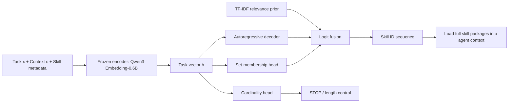
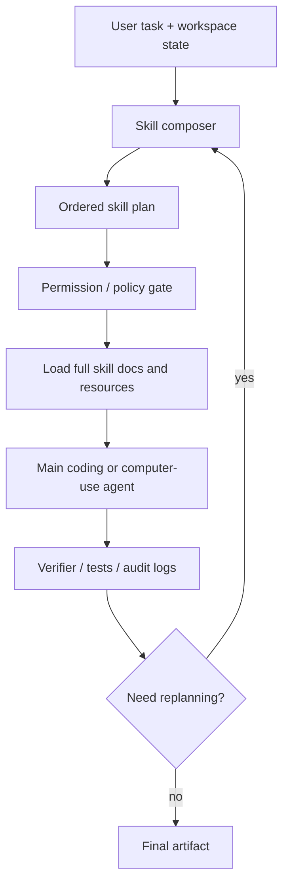

# Generative Skill Composition for LLM Agents：当 Agent 技能库变大，真正的瓶颈从“找技能”变成“组合技能”

## 元信息

- 原文标题：Generative Skill Composition for LLM Agents
- 作者：Xinyu Zhao、Zhen Tan、Vaishnav Tadiparthi、Nakul Agarwal、Kwonjoon Lee、Ehsan Moradi Pari、Hossein Nourkhiz Mahjoub、Tianlong Chen
- 机构：University of North Carolina at Chapel Hill、Arizona State University、Honda Research Institute USA
- arXiv：<https://arxiv.org/abs/2606.32025>
- 项目页：<https://skill-composer.github.io/>
- 提交时间：2026-06-30 17:53:09 UTC
- 类型：大模型 Agent / 技能库路由 / Coding agent evaluation

## TL;DR

- 这篇论文研究的是一个很具体但正在变重要的问题：当 LLM Agent 有一个不断增长的技能库时，系统不只要判断“哪个技能相关”，还要判断“需要几个技能”和“先后顺序是什么”。
- 作者把这个问题形式化为 **task-conditioned skill sequence prediction**：给定任务、环境上下文和固定技能库，模型输出一个以 `STOP` 结束的技能 ID 序列。
- 提出的 SkillComposer 是一个小型专用模型：冻结 Qwen3-Embedding-0.6B 作为任务编码器，再用 3 层、256 维、4 头的 Transformer decoder 生成技能序列。
- 方法不是单纯生成序列：它还加入 **cardinality head** 预测技能数量、**set-membership head** 预测哪些技能相关，并在解码时融合 TF-IDF 检索先验和 set-head 先验。
- 数据来自真实人类整理的 196 技能库和 SkillsBench：65 个真实软件工程任务作为 anchor，另合成 2,880 条单技能任务和 6,927 条多技能任务，总计 9,872 条 task-skill-sequence 记录。
- 组合质量实验分两组：synthetic test `n=494` 和 real-task holdout `n=65`。SkillComposer 在 synthetic Set F1 达到 73.9，高于 Qwen3-0.6B SFT 的 71.1；在 real holdout 上达到 62.9，而 SFT 只有 43.6。
- 下游执行实验在 75 个 SkillsBench 任务上进行，排除了 13 个由 `pdf/xlsx/pptx/docx` 文件扩展名轻易路由的办公任务；每个 agent-condition 做 225 次试验，温度 0，超时 1200 秒。
- 在 GPT-5.2-Codex 上，No Skills pass rate 为 22.2%，SkillComposer 为 45.3%，Gold Skills 上界为 51.1%；在 Gemini-3-Pro 上，No Skills 为 25.8%，SkillComposer 为 44.0%，Gold Skills 为 48.4%。
- 关键局限：评测集中在文本任务描述和代码导向技能库，技能库固定，长链任务仍有 under-emit 问题；它证明“结构化技能组合器”有价值，不等于证明所有开放式 agent 都能自动管理动态技能生态。

## 这篇论文真正问的不是“技能有没有用”

很多 Agent 系统已经默认接受一件事：

- 技能可以把可复用过程写成包。
- 技能可以包含说明、脚本、资源、CLI、示例或外部 API。
- 运行时只加载相关技能，可以减少上下文浪费。

这篇论文把问题推进了一步：

> 当技能库已经存在，而且规模变大后，系统怎样决定本次任务该加载哪一组技能？

作者认为现有方法主要有两类：

| 路线 | 做法 | 漏掉的问题 |
|---|---|---|
| 全量暴露 | 把技能库或技能摘要交给 agent，让 agent 自己推理 | 组合过程埋在长执行轨迹里，不可控、不可校准 |
| 检索/重排 | 用 embedding、BM25、LLM judge 给技能排序 | 排名不是计划；它不告诉 agent 要几个技能，也不保证顺序 |

一个直观例子是：

- 任务：定位废弃 API 调用，跨代码库重构，并运行回归测试。
- 可能技能：代码搜索、批量重构、测试运行、日志分析。
- 正确结构：先找 call sites，再改代码，再跑测试，再分析失败。

如果系统只返回一个 top-k 列表：

- `code-search`
- `test-runner`
- `refactor-helper`

它仍然没有回答：

- 是否还需要 `dependency-upgrade`？
- `test-runner` 应该在重构前还是重构后？
- 如果只给 top-3，是否刚好截掉了关键技能？

所以作者的核心判断是：

**skill selection 是结构化预测问题，不是单点检索问题。**

## 形式化：把技能组合变成一个可检查的序列

论文给技能一个五元组定义：

```text
s_i = (m_i, C_i, pi_i, T_i, R_i)
```

变量含义如下：

| 符号 | 含义 | 例子 |
|---|---|---|
| `m_i` | metadata，技能名和一句话描述 | `flood-detection`：比较水位阈值并统计洪水天数 |
| `C_i` | applicability condition，适用条件 | 输入包含时间序列水位和站点阈值 |
| `pi_i` | procedural policy，过程策略 | 聚合日极值，再按 action/minor/moderate/major 分档 |
| `T_i` | termination condition，停止条件 | 已写出每站 `flood_days` |
| `R_i` | resource，可选资源 | Python helper、REST API、查表文件 |

给定：

- 任务描述 `x`
- 环境上下文 `c`
- 固定技能库 `S = {s_1, ..., s_K}`

模型输出：

```text
z_hat = (z_1, z_2, ..., z_n, STOP) = f_theta(x, c, S)
```

这里每个 `z_t` 是技能库中的一个 index。

这条序列同时决定三件事：

| 维度 | 由什么决定 | 为什么重要 |
|---|---|---|
| subset | 序列中出现了哪些技能 | 避免漏掉关键过程，也避免加载无关技能 |
| count | `STOP` 出现的位置 | 任务需要 1 个、3 个还是 5 个技能不能预设 |
| order | 技能 ID 的先后 | 技能之间有数据流和工作流依赖 |

论文的例子是一个洪水站点分析任务：

```text
Task:
Find Michigan USGS stations that experienced flooding during April 1-7, 2025;
write (station_id, flood_days) to flood_results.csv.

Predicted sequence:
(nws-flood-thresholds, usgs-data-download, flood-detection)
```

这比“检索出三个相关技能”更强：

- 先拿 NWS 阈值。
- 再拉 USGS 水位/流量序列。
- 最后按阈值统计洪水天数。

顺序本身就是可执行计划的一部分。

## SkillComposer 的结构：小模型，不是大模型硬猜

SkillComposer 有三个主部件：



关键实现细节：

| 模块 | 论文设置 | 作用 |
|---|---|---|
| task encoder | Qwen3-Embedding-0.6B，冻结，last-token pooling，1024 维输出 | 把任务、环境和技能摘要编码成任务表示 |
| projection | 投到 `d=256` | 降维给小 decoder 使用 |
| decoder | 3 层 pre-norm Transformer，hidden 256，4 heads，dropout 0.1 | 逐步生成技能 ID |
| skill memory | 196 行技能 metadata embedding | decoder 通过 cross-attention 区分技能 |
| output vocab | 196 个技能 ID + `STOP/START/PAD` | 保证输出闭集、可解析 |
| inference | beam width 4，length penalty 0.7，禁止重复技能 | 生成有序短列表 |

这个设计的重点不是参数量，而是约束：

- 输出只能是库中已有技能。
- 每个技能 ID 都可映射回完整技能包。
- 预测结果可检查、可审计、可直接加载。

## 为什么需要两个辅助头？

如果只用 autoregressive decoder，所有监督都压在序列 token 上：

- 技能数量只通过 `STOP` 学到。
- 某个技能是否相关，只在它出现的 gold position 上得到正例。
- 同一个技能换个顺序后，模型很难获得“它仍然相关”的直接信号。

所以作者加了两个辅助头。

### 1. Cardinality head：单独预测需要几个技能

```text
p_psi(n_hat | x, c) = softmax(W_n h)
```

它回答：

- 任务应该加载 1 个技能？
- 还是 2 到 5 个技能链？
- 是否应该尽早 STOP？

这个头不直接替代 decoder，但给长度控制提供独立信号。

### 2. Set-membership head：单独预测哪些技能相关

```text
sigma_i = MLP([h; e_i; h * e_i; |h - e_i|])
```

变量解释：

| 符号 | 含义 |
|---|---|
| `h` | 任务表示 |
| `e_i` | 第 `i` 个技能 metadata embedding |
| `h * e_i` | 任务与技能的交互项 |
| `|h - e_i|` | 任务与技能距离 |
| `sigma_i` | 技能 `s_i` 的任务相关性 logit |

这个 head 用 binary cross entropy 训练。

它的意义是：

- 不管某个技能在序列第 1 位还是第 4 位，只要它属于 gold set，就能得到正样本监督。
- 这给“which skills”提供了 order-agnostic 梯度。
- decoder 仍负责“order”，辅助头负责补足“count”和“set”。

## 解码时的融合：结构化模型仍然需要检索先验

SkillComposer 没有完全抛弃检索。

它把检索变成一个 **decode-time prior**：

```text
fused_logit_t(i) = contextual_logit_t(i)
                 + alpha * retrieval_score_i
                 + beta  * set_score_i
```

论文使用：

- `alpha = 1.0`
- `beta = 0.5`
- 检索分数来自 TF-IDF unigram-bigram cosine
- set 分数来自 set-membership head
- 不把检索和 set 先验加到 `STOP` logit 上

这一步很重要，因为技能库是 heavy-tailed：

- 很多技能在训练数据里只出现一两次。
- 小模型很难只靠参数记住长尾技能。
- 但技能名和一句话描述往往有高精度词面信号。

所以 SkillComposer 的实际判断不是“生成 vs 检索”二选一，而是三路信号融合：

| 信号 | 捕捉什么 | 弱点 |
|---|---|---|
| contextual AR logit | 前缀条件、顺序依赖、组合结构 | 长尾技能监督稀疏 |
| TF-IDF retrieval prior | 任务和技能 metadata 的词面相关性 | 不懂顺序，不懂数量 |
| set-membership prior | order-agnostic 任务-技能匹配 | 不直接建模执行顺序 |

这解释了为什么论文结果里 TF-IDF 作为解码先验反而优于 dense embedding：固定库只有 196 个短技能名，词面重合是非常强的区分信号。

## 数据：不是随便合成，而是围绕 196 技能库构造组合监督

训练数据总量为 9,872 条 task-skill-sequence records。

| 数据组 | 数量 | 生成/来源 | 作用 |
|---|---:|---|---|
| real anchors | 65 | SkillsBench 人类编写软件工程任务 + gold skill annotations | 锚定真实任务分布 |
| single-skill synthetic | 2,880 | Gemini 2.5 Flash 合成 | 覆盖全部 196 技能，并训练模型学会单技能 STOP |
| multi-skill synthetic | 6,927 | Gemini 2.5 Pro 合成 | 覆盖 2 到 5 技能链和依赖顺序 |

多技能合成由一个 196 节点依赖图约束。

| 边类型 | 数量 | 语义 |
|---|---:|---|
| dependency edge | 658 | 上游技能输出类型与下游技能输入类型重合，表示数据流顺序 |
| workflow edge | 266 | 来自真实 anchor 轨迹共现，表示经验工作流顺序 |
| total | 924 | 用于抽样多技能链 |

采样比例：

- 65% 来自 dependency edges
- 35% 来自 workflow edges

作者还做了三层去重和校验：

- exact-string match 去掉字面重复。
- character-trigram Jaccard > 0.6 去掉近似措辞。
- sentence-embedding cosine > 0.92 去掉语义重复。
- 对 multi-skill record，要求输出技能必须是输入技能 ID 的精确 permutation。
- 如果生成结果新增、删除、改名技能，直接丢弃。

这让数据集的重点落在“闭集技能组合”上，而不是开放式生成一个听起来合理的技能名。

## 实验协议：先测组合质量，再测 agent 执行

论文没有只报一个 downstream pass rate，而是分两层评测。

### 第一层：skill prediction quality

两个测试设置：

| 设置 | 样本量 | 目的 |
|---|---:|---|
| synthetic test | 494 | train/test 都来自同一合成生成器，测 in-distribution 上限 |
| real-task holdout | 65 | 真实任务从 train/val 移除，只用 synthetic-only 训练，测真实迁移 |

指标：

| 指标 | 含义 |
|---|---|
| Set F1 | 预测技能集合与 gold 集合的 F1，不看顺序 |
| Recall@5 | top-5 是否覆盖 gold 技能 |
| MRR | 第一个命中 gold 技能的 reciprocal rank |
| nDCG@5 | top-5 排序质量 |
| Set EM | 集合 exact match |

对比方法：

- BM25 retrieval
- TF-IDF retrieval
- Qwen3-Embedding retrieval
- Gemini-2.5-Flash LLM-judge
- Qwen3-0.6B-Base SFT
- SkillComposer Base
- SkillComposer

### 第二层：downstream task performance

执行层更接近真实 Agent：

| 维度 | 设置 |
|---|---|
| 任务 | 75/88 SkillsBench tasks |
| 排除 | 13 个办公/文档处理任务，因为 `pdf/xlsx/pptx/docx` 文件扩展名会让检索过于简单 |
| Agent | GPT-5.2-Codex via Azure OpenAI；Gemini-3-Pro-Preview via Gemini CLI |
| 试验 | 每个 agent-condition 225 trials |
| 温度 | 0 |
| 超时 | 1200 秒 |
| 判定 | Harbor evaluation framework + deterministic pytest verifiers |
| token 指标 | non-errored trial 平均 input prompt tokens |

这种设计比较合理：

- 组合预测指标解释“模型是否选对技能”。
- downstream pass rate 检验“选对技能是否真的让 agent 做成任务”。
- token 指标检验“是不是靠塞更多上下文换来的”。

## 主结果一：小专用模型比 600M SFT 更抗分布转移

组合质量表的核心数字如下：

| 方法 | Synthetic Set F1 | Real holdout Set F1 | 变化 |
|---|---:|---:|---:|
| Qwen3-0.6B-Base SFT | 71.1 | 43.6 | -27.5 |
| SkillComposer Base | 70.4 | 53.9 | -16.5 |
| SkillComposer | 73.9 | 62.9 | -11.0 |
| Gemini-2.5-Flash judge | 61.0 | 59.9 | -1.1 |
| TF-IDF oracle-k retrieval | 58.4 | 74.2 | +15.8 |

这里有两个值得细读的点。

### 1. SFT 在合成分布上强，但迁移到真实任务会塌

SFT 是 600M 级 Qwen3-0.6B-Base，直接 fine-tune 成文本序列生成器。

它在 synthetic test 上 Set F1 为 71.1，接近 SkillComposer 的 73.9。

但到 real-task holdout：

- SFT 降到 43.6。
- SkillComposer 仍有 62.9。
- 差距达到 19.3 个百分点。

作者的解释是：

- SFT 学到了 synthetic template distribution。
- 真实任务措辞更接近技能描述。
- SkillComposer 的 frozen retrieval-tuned encoder 和 TF-IDF prior 提供了更稳的迁移偏置。

### 2. 检索在真实任务上不差，但它仍缺“count”和“order”

TF-IDF oracle-k retrieval 在 real holdout Set F1 有 74.2。

这看似高于 SkillComposer。

但 oracle-k 的含义是：检索器被告知 gold skill count。

现实里系统不知道这个 count。

在 best-k 设置下：

- TF-IDF real holdout Set F1 是 60.6。
- Qwen3-Embedding best-k 是 58.5。
- SkillComposer 是 62.9。

所以关键不是“检索没用”，而是：

**检索如果不知道该取几个技能，就会在真实组合任务里失去一部分结构信息。**

## 主结果二：下游 agent pass rate 确实提高，而且 token 更省

SkillsBench 执行结果：

| Skill condition | GPT-5.2-Codex Pass | Codex tokens | Gemini-3-Pro Pass | Gemini tokens |
|---|---:|---:|---:|---:|
| Gold Skills | 51.1 | 1.12M | 48.4 | 1.18M |
| No Skills | 22.2 | 0.94M | 25.8 | 0.99M |
| All Skills | 29.3 | 1.27M | 38.7 | 1.33M |
| Retrieval top-3 | 44.0 | 1.09M | 41.8 | 1.14M |
| Retrieval oracle | 44.0 | 1.13M | 42.2 | 1.19M |
| SkillComposer | 45.3 | 1.03M | 44.0 | 1.08M |

可以看到三个结论。

### 1. 全量塞技能不是好策略

在 Codex 上：

- No Skills：22.2
- All Skills：29.3
- Prompt tokens：0.94M 到 1.27M

也就是说：

- 加入全部 196 技能只提升 7.1 个百分点。
- 但上下文成本明显增加。
- 大量技能可能带来干扰，而不是单纯提供更多能力。

### 2. SkillComposer 接近 gold upper bound

在 Codex 上：

```text
No Skills = 22.2
Gold Skills = 51.1
SkillComposer = 45.3
```

可计算 headroom closure：

```text
(45.3 - 22.2) / (51.1 - 22.2)
= 23.1 / 28.9
≈ 79.9%
```

在 Gemini 上：

```text
(44.0 - 25.8) / (48.4 - 25.8)
= 18.2 / 22.6
≈ 80.5%
```

所以论文说它关闭了约 80% 的 headroom，是按这个方式算的。

### 3. 它不是靠更多 token 赢

在 Codex 上：

- Retrieval top-3：44.0 pass，1.09M tokens
- SkillComposer：45.3 pass，1.03M tokens
- Gold Skills：51.1 pass，1.12M tokens

SkillComposer 的优势不是“塞更多技能”，而是更短、更校准的技能序列。

这对真实 Agent 很关键：

- 技能加载会占上下文。
- 长任务本来就容易上下文膨胀。
- 如果技能路由器省 token，同时提高 pass rate，它才有部署价值。

## 消融：三个部件都不是摆设

模型组件消融：

| Variant | Set F1 |
|---|---:|
| AR-only | 69.3 |
| + set head | 71.8 |
| + cardinality head | 69.6 |
| SkillComposer | 73.9 |
| no decode set-fusion | 65.0 |
| no decode retrieval prior | 67.5 |

读法如下：

- 单独加 set head，从 69.3 到 71.8，说明 order-agnostic 相关性监督有用。
- 只加 cardinality head，提升很小，说明数量信号不能单独解决技能选择。
- 完整模型达到 73.9，说明 set、cardinality、AR ordering 和 decode prior 有协同。
- 去掉 decode set-fusion 掉到 65.0，损失 8.9 点。
- 去掉 decode retrieval prior 掉到 67.5，损失 6.4 点。

论文正文强调：

- zeroing set-fusion bias 相对完整模型损失 7.1 pp 的表述来自作者对组件贡献的讨论。
- 表格直接给出的完整模型 73.9 到 no set-fusion 65.0，绝对差是 8.9。
- 不管按哪种口径，解码时复用辅助信号都很关键。

检索先验消融：

| Decode prior | Set F1 |
|---|---:|
| No prior | 67.5 |
| BM25 | 70.0 |
| Qwen3-Embedding | 68.8 |
| TF-IDF | 73.9 |

这组结果很有意思：

- dense embedding 不是处处更好。
- 对 196 个短、明确、语法化的技能名来说，TF-IDF 的词面匹配更精确。
- 但任务编码器仍用 Qwen3-Embedding，因为它负责整体任务语义。

换句话说：

**语义编码适合理解任务，稀疏检索适合区分闭集技能名。**

## Figure/Table 证据怎么读？

| 证据位置 | 支持的主张 | 边界 |
|---|---|---|
| Figure 1 | 技能组合瓶颈包含 subset/count/order 三维 | 是问题图示，不是实验结果 |
| Figure 2 | 固定技能库可以输出有序技能 ID 序列 | 示例依赖技能 metadata 质量 |
| Figure 3 | SkillComposer 的 encoder-decoder-head-prior 架构 | 没证明泛化到动态技能库 |
| Table 1 | SkillComposer 在 synthetic 和 real holdout 上 Set F1 最强 | real holdout 只有 65 个任务 |
| Figure 4 | k=1 场景下过度发射技能会被惩罚，SkillComposer 更稳 | 长链 k>=3 仍有 headroom |
| Table 2 | 组合质量能转成 Codex/Gemini pass rate 提升 | 任务来自 SkillsBench，且排除了办公文档任务 |
| Figure 5 | 参数、计算和准确率前沿优于 SFT/API judge | 依赖这个 196 技能库和合成数据方式 |
| Table 3 | set head、cardinality、decode prior 都有作用 | 消融只在 in-distribution split |
| Table 4 | TF-IDF 是最强 decode-time prior | 对短技能名闭集成立，不必然推广到长文档技能 |
| Appendix C | 三个案例解释 pass-rate 差异来源 | 案例数少，主要用于机制解释 |

## 三个失败/成功案例比平均分更有信息

论文附录 C 拿三个 SkillsBench 任务做案例分析，能更好解释 SkillComposer 为什么有效。

### Case 1：top-3 retrieval 截掉关键技能

任务是 adaptive cruise control。

验证器检查：

- rise-time < 10s
- overshoot < 5%
- steady-state speed error < 0.5 m/s
- distance steady-state error < 2m
- minimum gap > 5m

技能表现：

| 方法 | Reward | 技能 |
|---|---:|---|
| SkillComposer | 1.00 | `imc-tuning-rules`, `pid-controller`, `simulation-metrics`, `vehicle-dynamics` |
| Retrieval top-3 | 0.33 | `pid-controller`, `simulation-metrics`, `vehicle-dynamics` |
| Gold Skills | 0.33 | `csv-processing`, `pid-controller`, `simulation-metrics`, `vehicle-dynamics`, `yaml-config` |

这里最重要的不是 SkillComposer “匹配 gold”。

它反而偏离了 gold：

- gold 包含两个 I/O 格式技能。
- SkillComposer 加入 `imc-tuning-rules`。
- 这个技能直接帮助 PID 参数满足 rise-time 和 overshoot 约束。

这说明模型学到的是任务瓶颈，而不只是 gold label 复读。

### Case 2：更少技能反而更好

任务是 exoplanet-detection-period。

目标：

- 从带有 stellar activity oscillations 的 TESS lightcurve 中恢复行星轨道周期。

对比：

| 方法 | Reward | 技能 |
|---|---:|---|
| SkillComposer | 1.00 | `light-curve-preprocessing`, `lomb-scargle-periodogram`, `transit-least-squares` |
| Gold Skills | 0.00 | `box-least-squares`, `exoplanet-workflows` + 上面三项 |

解释：

- SkillComposer 走的是 preprocess -> Lomb-Scargle -> TLS 的最小路线。
- Gold Skills 加了冗余 estimator 和较重 workflow wrapper。
- 更长技能包把 agent 带到复杂 pipeline，反而过拟合 stellar oscillation。

这支持一个实践判断：

**技能越多不一定越强，尤其当技能会引导 agent 改变探索路径时。**

### Case 3：长链任务会 under-emit

任务是 Lean 4 proof。

目标：

```text
S_n = sum_{i=0}^{n} 1 / 2^i <= 2, for all n in N
```

对比：

| 方法 | Reward | 技能 |
|---|---:|---|
| SkillComposer | 0.67 | `lean4-memories` |
| Retrieval top-3 | 1.00 | `lean4-memories`, `lean4-theorem-proving`, `python-scala-functional` |
| Gold Skills | 0.67 | `lean4-memories`, `lean4-theorem-proving` |

失败原因：

- SkillComposer 只发了 snippet-level memo skill。
- 它没有继续发 `lean4-theorem-proving`。
- 在需要 tactic 和 Mathlib reference 的归纳证明里，这个遗漏是实质性失败。

作者还指出：

- `grid-dispatch-operator`
- `dapt-intrusion-detection`

也出现类似的一槽不足问题。

更根本的原因可能是：

- 合成语料偏重 `<=3` 技能组合。
- 长链组合的监督不足。
- 模型学到了偏短的 STOP 倾向。

这是论文最有价值的失败案例：它说明下一步不是盲目换更大模型，而是改进长链训练记录构造。

## 与相关工作的边界：它不是 tool planner，也不是 skill discovery

论文把自己放在两个邻近方向之间。

| 邻近方向 | 典型问题 | SkillComposer 的不同 |
|---|---|---|
| skill discovery / skill library | 如何产生、维护、发现技能 | 假设技能库已固定，研究 inference-time composition |
| retrieval-augmented skill use | 如何按相关性找技能 | 输出有序序列，同时预测 count |
| tool-level planning | 如何规划 API/function call | 技能是粗粒度过程包，不一定有 typed signature |
| end-to-end agent reasoning | 让 agent 在执行中自己决定 | 把组合计划前置成可检查短序列 |
| SFT sequence generation | 用大 LM 生成技能名 | 使用闭集 ID、辅助头和检索先验，降低分布转移 |

它最重要的定位是：

- 不解决“技能从哪里来”。
- 不解决“技能执行过程中如何动态改计划”。
- 不解决“技能库在线变化后如何增量学习”。
- 它解决的是固定技能库下，任务开始前怎样生成一个更好的技能加载计划。

## 研究者视角：这篇文章改变了对 Agent 技能系统的三个判断

### 判断一：技能库扩张会制造组合债务

很多系统讨论技能时，默认“技能越多越好”。

这篇论文给出反例：

- All Skills 在 Codex 上只有 29.3 pass。
- SkillComposer 有 45.3 pass。
- All Skills 还消耗更多 token。

所以技能库会带来一种组合债务：

- 每新增一个技能，系统不只增加能力。
- 也增加路由、顺序、干扰、上下文预算和审计成本。

### 判断二：闭集技能组合可以被专门建模

SkillComposer 的成功说明：

- 对固定技能库，不一定要让主 agent 临场推理所有技能。
- 可以训练一个小模型专门做技能序列预测。
- 主 agent 只接收已解析的技能包。

这对工程系统很有启发：

- skill router 不必是一个 prompt hack。
- 它可以是可评估、可消融、可部署的小模型。
- 它输出的是结构化 plan，不是自然语言建议。

### 判断三：agent 评测需要把“加载了什么能力”纳入变量

同一个 GPT-5.2-Codex：

- No Skills：22.2
- Retrieval top-3：44.0
- SkillComposer：45.3
- Gold Skills：51.1

这说明 Agent benchmark 的结果不只由 foundation model 决定。

还取决于：

- 给了哪些技能。
- 给了多少技能。
- 按什么顺序加载。
- 是否把无关技能一起塞进上下文。

因此，未来比较 coding agent 或 computer-use agent 时，应该把 skill-loading policy 当成一等变量，而不是隐藏实现细节。

## 局限与继续追问

| 局限 | 为什么重要 | 后续问题 |
|---|---|---|
| 文本任务描述为主 | 真实 computer-use/science/robotics 任务常有截图、文件、语音、传感器 | multimodal skill composition 怎么建模？ |
| 技能库固定 | 实际 agent 可能在线安装、更新、禁用技能 | 新技能加入后如何不重训全模型？ |
| 代码导向技能库 | 196 技能来自 SkillsBench，偏软件工程 | 科学工作流、数据库、浏览器、机器人技能是否同样成立？ |
| 长链 under-emit | Lean/grid/dapt 等任务显示 STOP 偏早 | 如何构造更强的 4-8 技能链监督？ |
| gold skills 不总是最优 | adaptive cruise control 和 exoplanet 案例显示 gold 可能冗余或漏关键技能 | 评测应以 gold match 还是 task reward 为准？ |
| 安全没有深入展开 | 技能加载错误可能带来权限、安全和数据泄漏风险 | skill router 是否应同时预测权限边界和审计要求？ |

## 如果要复现实验，最该盯住哪些变量？

这篇论文的复现难点不只在模型，而在评测协议的几个“容易被忽略的固定条件”。

| 变量 | 论文做法 | 复现时的风险 |
|---|---|---|
| 技能库闭集 | 196 个 SkillsBench 技能，输出只能是库内 ID | 如果允许模型生成新技能名，Set F1 和执行结果不可比 |
| 真实任务切分 | real-task holdout 移除全部 65 个真实任务 | 如果真实 anchor 泄漏进训练，迁移结论会被高估 |
| 合成数据约束 | multi-skill 输出必须是输入 skill IDs 的 permutation | 如果不做 permutation 校验，模型可能学到不存在的技能 |
| 下游任务排除 | 排除 13 个由文件扩展名轻易路由的办公任务 | 如果保留这些任务，检索 baseline 会被低难度样本抬高 |
| agent 条件 | 每个 condition 225 trials，温度 0，1200 秒超时 | 少跑次数或改温度会让 pass rate 噪声变大 |
| token 统计 | 统计 non-errored trial 平均输入 prompt tokens | 如果只报 pass rate，看不出 All Skills 的上下文成本 |

更细一点，复现实验时应该把两个指标分开看：

1. **组合指标**：Set F1、Recall@5、MRR、nDCG@5、Set EM。
2. **执行指标**：pass rate、headroom closure、prompt tokens、失败类型。

原因是二者不完全等价：

- 某个方法可能 Set F1 高，但给了冗余技能，导致 agent 走偏。
- 某个方法可能不匹配 gold，却因为删掉冗余技能而拿到更高 reward。
- 所以 Appendix C 的案例不是装饰，它是在提醒读者不要把 gold composition 当作唯一真理。

## 工程落地时，可以把 SkillComposer 当成哪一层？

如果把一个现代 Agent 系统拆成运行时层次，SkillComposer 更像“技能加载前的 compiler pass”，而不是主 agent 的一部分。



这个视角会带来三个工程约束：

- **组合器输出要短**：否则就退化成把技能库搬进上下文。
- **组合器输出要可审计**：每个技能为什么被选中，至少要能回看任务、检索先验和 set score。
- **组合器要接权限系统**：技能不是中性文本，有些技能会读文件、联网、执行代码或调用外部 API。

论文没有把权限建模放进目标函数，这是合理的范围收缩。

但如果部署在真实企业或本地自动化环境里，技能序列最好不是最终答案，而是进入下一层 policy gate：

| composer 输出 | policy gate 需要检查 |
|---|---|
| `database-query` | 是否允许访问该数据源，是否需要只读模式 |
| `web-scraping` | 是否允许联网，是否有 robots/合规限制 |
| `code-execution` | 是否需要 sandbox，是否能写入工作区 |
| `email-sender` | 是否需要人工确认，是否能发外部收件人 |
| `credential-lookup` | 是否触碰 secret，是否必须拒绝 |

因此，这篇论文更像把“技能组合”从主 agent 的隐式推理中抽出来。

下一步值得研究的是把 **capability selection**、**permission minimization** 和 **runtime replanning** 放进同一个结构化输出里。

我认为最值得继续做的不是“把 decoder 换成更大模型”。

更关键的是三件事：

1. **动态技能库**：当技能被新增、弃用或版本升级时，组合器如何保持稳定？
2. **执行中重规划**：如果第一个技能执行失败，是否需要重新组合后续技能？
3. **安全约束组合**：技能不只是能力，也代表权限；组合器应该同时输出最小权限计划。

## 结论

这篇论文的价值在于把一个工程上常被 prompt 处理的问题，变成了可训练、可评估、可消融的结构化预测问题。

它的主张可以压缩成一句话：

**当 Agent 拥有技能库后，关键能力不是“能不能读技能”，而是“能不能生成一个短、准、有顺序、低干扰的技能加载计划”。**

证据上，SkillComposer 在组合预测和真实执行两层都有效：

- synthetic Set F1：73.9
- real holdout Set F1：62.9
- Codex pass：45.3 vs No Skills 22.2
- Gemini pass：44.0 vs No Skills 25.8
- 参数：3.9M trainable，约为 600M SFT 的 1/154
- token：Codex 1.03M，低于 retrieval top-3 的 1.09M 和 gold skills 的 1.12M

但边界也清楚：

- 它仍是固定闭集技能库。
- 长链组合还会偏短。
- gold label 本身也可能不是最优执行策略。

对 Agent 研究来说，这篇文章最重要的提醒是：技能库不是一个静态知识仓库，而是一个需要组合策略、长度控制、顺序建模和权限治理的运行时系统。
