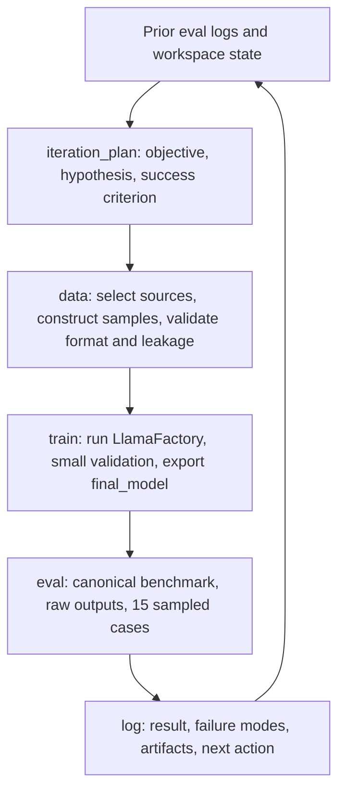
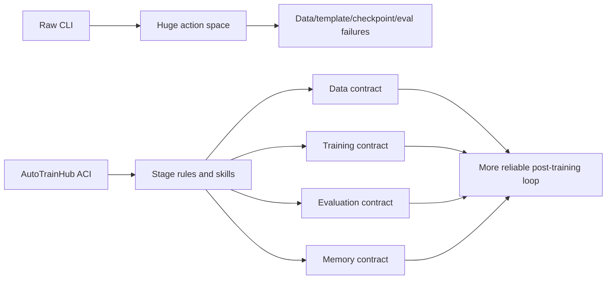

# AutoTrainess：把后训练经验做成 Agent-Computer Interface，而不是让 Agent 在裸 CLI 里摸索

### 元信息

| 字段 | 内容 |
|---|---|
| 论文 | AutoTrainess: Teaching Language Models to Improve Language Models Autonomously |
| 作者 | Zhaojian Yu, Penghao Yin, Shuzheng Gao, Shilin He, Kai Cai, Xiao-Ping Zhang |
| 机构 | Tsinghua University; The Chinese University of Hong Kong; Simple Agent Lab |
| 日期 | arXiv v1 提交于 2026-06-30 12:09:51 UTC |
| 链接 | [arXiv](https://arxiv.org/abs/2606.31551), [PDF](https://arxiv.org/pdf/2606.31551), [代码](https://github.com/simple-agent-lab/AutoTrainess) |
| 类型 | 大模型后训练 / Agent-Computer Interface / 自主训练 Agent |

### TL;DR

- **AutoTrainess 做什么**：它把 LLM 后训练从“让 coding agent 在裸 CLI 里写脚本”改造成一个带训练专用 Agent-Computer Interface 的闭环工作流；Agent 通过 `iteration_plan -> data -> train -> eval -> log` 逐轮改进模型。
- **核心问题**：自主 post-training 不只是会写代码，还要规划迭代、构造和 benchmark 对齐的数据、稳定运行训练、调用真实评测、保存实验状态；裸 CLI action space 太宽，容易出现 chat template 错、数据 schema 错、dataloader 异常、模型导出路径混乱、评测命令不一致等失败。
- **关键机制**：AutoTrainHub 把人类训练工程师的经验外显为可复用 ACI：data processing、training、evaluation、logging & planning 四个模块，分别约束数据选择/构造/验证、LlamaFactory 训练入口、真实 benchmark 评测与长程实验日志。
- **主结果**：在 PostTrainBench 上，GPT-5.4 + Codex 的 CLI-only 平均分是 23.21，AutoTrainess 达到 26.94，提升 3.73；GPT-5.4 + OpenCode 从 19.71 到 23.35；DeepSeek-V4-Flash + OpenCode 从 12.13 到 19.58，提升 7.45。
- **实验设置**：每个 agent 面对 4 个 base models：Qwen3-1.7B、Qwen3-4B、SmolLM3-3B、Gemma-3-4B；7 个 benchmarks：AIME 2025、ArenaHard、BFCL、GPQA、GSM8K、HealthBench、HumanEval；每次有 H20 GPU 与 10 小时时间预算。
- **消融证据**：Qwen3-4B 子集上，full AutoTrainess 是 32.6，去掉 data processing 降到 29.1，去掉 training 降到 20.2，去掉 evaluation 降到 24.0，去掉 logging & planning 降到 24.1；四类接口不是装饰，而是分别守住不同边界。
- **行为分析**：早期 agent 先做 benchmark 适配和 prompt/template 对齐，中期转向数据构造和训练策略，后期更多做 failure-case diagnosis 和 full eval；改善最相关的行为包括 benchmark-related data、template change、self-distillation、data difficulty improvement 和 prompt alignment。
- **局限**：PostTrainBench 仍是受控 10 小时任务；结果依赖特定 agent scaffolds、H20 资源、LlamaFactory 后端和 benchmark 权重；论文展示的是“接口脚手架提升自主训练可靠性”，不是证明模型已经能无限递归自我改进。

### 研究问题：为什么裸 CLI 不够？

- 论文要反驳一个很自然的假设：
  - 如果 frontier coding agent 很会写代码，是否直接把训练机器和 benchmark repo 给它，就能自动完成 LLM post-training？

- 作者的回答是否定的：
  - 训练不是单个脚本问题。
  - 训练需要数据、模板、评测、checkpoint、日志和资源约束的连续协调。
  - 裸 CLI 把 action space 放得太开，agent 可能把大量时间花在低层工程歧路上。

- 论文给出的典型失败：
  - 构造数据时 packing 到最大长度出错。
  - 没有使用正确 chat template。
  - 训练数据和 benchmark-facing interface 不对齐。
  - dataloader 报错后难以判断是数据方向错，还是执行细节错。
  - 训练产物没有稳定导出到评测需要的路径。

- AutoTrainess 的核心判断：
  - **自主训练需要的不是更自由的 shell，而是更训练友好的交互界面。**

### 论证路线：claim → mechanism → evidence → boundary

| 层次 | 作者主张 | 机制 | 证据 | 边界 |
|---|---|---|---|---|
| Claim 1 | 自主后训练不是纯 coding task | 把训练拆成 plan/data/train/eval/log | Figure 2 展示 AutoTrainHub 工作区与训练机器交互 | 仍依赖现有训练后端和 benchmark |
| Claim 2 | 人类训练经验应外显为 ACI | 用 workflow、rules、execution constraints 约束 agent | repo 中 AGENTS.md 与 autotrainhub skills 暴露同一结构 | 经验规则可能随任务域变化 |
| Claim 3 | ACI 比 CLI-only 更有效 | 限制 action space，保留可复现接口 | Table 1：三种 harness/backbone 均提升 | Gemma-4B 子集有小幅下降 |
| Claim 4 | 每个接口守住不同失败边界 | data 守输入契约，eval 守评测契约，log/plan 守状态 | Figure 3/4/5 与 Table 2 消融 | failure rate 不是唯一质量指标 |
| Claim 5 | Agent 的训练行为有阶段性 | 早期适配，中期构造，后期针对失败修复 | Figure 6/7/8 行为统计与案例 | LLM-as-judge 行为标注也有噪声 |

### 方法机制：AutoTrainHub 的四个模块

| 模块 | 给 Agent 的能力 | 主要约束 | 解决的失败 |
|---|---|---|---|
| data processing | 数据选择、构造、验证 | 先检查 benchmark evaluation interface；过滤垃圾、重复、泄漏、格式错样本 | 训练数据不匹配 benchmark、dataloader 异常、chat template 错 |
| training | 基于 LlamaFactory 的稳定训练入口 | 优先 full-parameter SFT；RL 只在近期评测证据支持时使用；失败时不切框架 | 框架漂移、训练脚本不可复现、checkpoint 导出混乱 |
| evaluation | 调用真实 benchmark 评测并保存证据 | canonical entrypoint、raw outputs、15 个随机样本摘要、失败模式分类 | 评测命令不一致、只看 loss、不知道下一轮该修什么 |
| logging & planning | 长程实验记忆与下一轮目标 | 每轮记录动机、数据、方法、配置、评测、结果、artifact 和 next action | 多小时任务中丢失状态、重复试错、忘记上轮证据 |

- 这四个模块不是普通工具按钮：
  - 它们把“训练专家会检查什么”编码成 agent 必须经过的工作流。
  - 它们不是替 agent 做智能决策，而是把决策空间变窄。
  - 它们让每轮训练都留下足够证据，下一轮才能基于事实而不是记忆猜测。

### 闭环工作流：从一次训练到下一次训练



- 这个循环的关键不是“自动跑很多实验”：
  - 每一轮必须有假设。
  - 每一轮必须知道训练数据为什么对齐 benchmark。
  - 每一轮必须用真实 evaluation pipeline。
  - 每一轮必须把失败原因写回日志。

### 公式：PostTrainBench 聚合分怎么算？

- 论文没有只做简单平均，而是按 benchmark 难度加权：

```text
给定 benchmark i:
  s_i^instruct = 官方 instruction-tuned model 分数
  s_i^base     = base model 分数

权重:
  w_i = 1 / (s_i^instruct - s_i^base)
  w_hat_i = w_i / sum_j w_j

Agent 总分:
  Score_agent = sum_i w_hat_i * s_i^agent
```

- 直觉解释：
  - instruction tuning 提升小的 benchmark 被认为更难。
  - 难 benchmark 获得更高权重。
  - 这使总分更关注“后训练真正难以拉动的任务”。

### 主结果：AutoTrainess 对三种配置都有收益

| Harness / backbone | CLI-only | AutoTrainess | 绝对提升 |
|---|---:|---:|---:|
| GPT-5.4 + Codex | 23.21 | 26.94 | +3.73 |
| GPT-5.4 + OpenCode | 19.71 | 23.35 | +3.64 |
| DeepSeek-V4-Flash + OpenCode | 12.13 | 19.58 | +7.45 |

- 这个表最重要的读法：
  - 收益不只绑定在 Codex scaffold 上。
  - 较弱的 DeepSeek-V4-Flash + OpenCode 反而提升最大。
  - ACI 的作用像“把训练流程变得可操作”，不是只给最强模型锦上添花。

- 但也要看边界：
  - GPT-5.4 + Codex 是最强组合。
  - 论文提到 Gemma-4B 子集上有小幅下降，小于 5%。
  - 这说明 ACI 不是无条件提升每个 base model/benchmark cell。

### Table 1：不同 base model 上的细节

| 系统 | Qwen3-1.7B | Qwen3-4B | SmolLM-3B | Gemma-4B | Avg |
|---|---:|---:|---:|---:|---:|
| Instruct | 49.41 | 63.75 | 44.81 | 46.58 | 51.14 |
| Base | 6.66 | 14.34 | 4.52 | 4.60 | 7.53 |
| CLI-only GPT-5.4 Codex | 16.90 | 27.09 | 23.96 | 24.88 | 23.21 |
| AutoTrainess GPT-5.4 Codex | 25.67 | 32.60 | 25.60 | 23.88 | 26.94 |
| CLI-only DeepSeek-V4-Flash OpenCode | 8.14 | 15.18 | 14.77 | 10.43 | 12.13 |
| AutoTrainess DeepSeek-V4-Flash OpenCode | 16.72 | 21.76 | 15.82 | 24.01 | 19.58 |

- 这里可以看到两类现象：
  - AutoTrainess 明显缩小 base 到 instruct 的一部分差距。
  - 但它离 instruct 仍有很大空间，说明自主训练仍是早期系统能力，不是完整替代人工训练团队。

### 消融：四类接口各自守住什么边界？

| Qwen3-4B 子集方法 | Overall | 相对 full |
|---|---:|---:|
| CLI-only | 26.7 | -5.9 |
| AutoTrainess full | 32.6 | 0 |
| w/o data processing | 29.1 | -3.5 |
| w/o training | 20.2 | -12.4 |
| w/o evaluation | 24.0 | -8.6 |
| w/o logging & planning | 24.1 | -8.5 |

- data interface 的作用：
  - 主要保护训练输入契约。
  - 去掉 data 后，train action failure rate 从 7.2% 升到 12.7%。
  - 数据相关操作也明显减少：读取数据内容、清洗、构建 preference pairs、合成数据都下降。

- training interface 的作用：
  - 它不一定显著降低单条训练命令失败率。
  - 但它稳定 checkpoint 位置、merged model 输出、final model handoff。
  - 去掉后评测失败率从 7.6% 升到 12.0%。

- evaluation interface 的作用：
  - 它是评测失败边界的核心。
  - 去掉 eval 后，eval action failure rate 从 7.6% 升到 22.8%。
  - 这说明真实 benchmark invocation、output path、model-serving 前置条件很容易被裸 agent 搞错。

- logging & planning 的作用：
  - 它保住多轮状态。
  - 去掉后，eval action failure rate 从 7.6% 升到 19.6%。
  - 原因不是不能调用评测脚本，而是容易忘记当前该评哪个 artifact、哪个 vLLM server 正在跑、哪些修复已试过。

### Exploration vs. Exploitation：不是跑得越多越好

| 设置 | train-to-eval handoffs | retained improvements | yield |
|---|---:|---:|---:|
| Full | 111 | 7 | 6.3% |
| w/o data | 95 | 4 | 4.2% |
| w/o train | 58 | 7 | 12.1% |
| w/o eval | 70 | 4 | 5.7% |
| w/o plan & log | 30 | 2 | 6.7% |
| CLI-only | 86 | 5 | 5.8% |

- full interface 的优势是探索面最宽，同时保留 7 个改善。
- 去掉 train 后 retained improvements 没少，但 handoff 只有 58，说明训练接口主要扩展搜索前沿。
- 去掉 data/eval 后 retained improvements 下降，说明它们更影响“把尝试转成有效收益”的转化率。
- 去掉 logging & planning 后 handoff 和 retained improvements 都塌缩，说明长程记忆是闭环训练的基础设施。

### Agent 行为阶段：它先适配，再优化，最后修失败

| 阶段 | 主要行为 | 论文中的证据 |
|---|---|---|
| 前 2 小时 | baseline-based planning、prompt alignment、template change、benchmark-near data selection | P1 出现 18 次，之后消失；T1/T2/D1 前置 |
| 中期 | data synthesis、DPO-style training、self-distillation、更多训练策略探索 | D4 从 19 升到 40，再保持 36；U3 从 0 到 7/12 |
| 后期 | failure case diagnosis、full benchmark evaluation、针对剩余错误补数据 | P4 单调增加，E2 后期更常见 |

- 这个阶段性很像人类训练工程：
  - 先跑 base model 和小样本验证。
  - 再对齐输入输出格式。
  - 然后根据错误模式加数据或改训练方法。
  - 最后用完整评测确认当前最好 checkpoint。

- 但 Agent 也有不同于人类的习惯：
  - continual training 从当前最好 checkpoint 出现 322 次。
  - 从 base model 重训只有 133 次。
  - 显式 data augmentation 只出现 4 次。

- 这说明 agent 在 10 小时预算里偏向“沿着当前最好模型继续试”，而不是反复重建完整数据路线。

### Figure 8：哪些行为更常和改善相关？

| 行为 | 改善次数 / 出现次数 | 解读 |
|---|---:|---|
| benchmark-related data | 8 / 26 | 找到接近评测分布的数据源很关键 |
| template change | 7 / 31 | 后训练常常先输在输入输出协议 |
| self-distillation update | 4 / 19 | 可在部分任务上补足具体弱点 |
| data difficulty improvement | 4 / 22 | 难例数据能针对能力缺口 |
| benchmark prompt alignment | 8 / 46 | prompt/format 对齐是早期收益来源 |
| DPO-style training | 1 / 35 | preference training 并不自动有效 |
| annealing training | 5 / 119 | agent 频繁尝试，但收益有限 |

- 这组结果提示：
  - 自主后训练的第一瓶颈不一定是更复杂 RL 算法。
  - 更常见收益来自 benchmark 对齐、模板修正、数据难度和失败样本修补。
  - Agent 需要被约束去看证据，否则会把时间耗在反复调参或随机训练 recipe 上。

### Case study：data skill 和 eval skill 的真实作用

- ArenaHard / Qwen3-4B 的 data skill 例子：
  - full 系统构造长 prompt-polish、rewrite anchors、长 roleplay、system-prompt rewrite 等数据组合。
  - 这些数据更接近 ArenaHard 写作任务的风格和分布。
  - no-data-skill 版本尝试更宽泛、更噪的写作混合，如 multilingual anchors 或 CJK data，但没有重塑成 benchmark-facing 格式。

- HealthBench / Qwen3-4B 的 eval skill 例子：
  - full 系统先改善 medical-chat SFT mix。
  - 然后根据 evaluation feedback 合成和加权 procedural guidance、preventive/travel summaries、multilingual safety、structured patient-facing responses。
  - no-eval-skill 版本没有把评测结果转成针对性数据，更多是在随机种子和 recipe 上重复试。

- 这两个案例的共同点：
  - skill 的价值不是“多给一个工具”。
  - skill 把评测、数据和下一轮训练之间的因果链固定下来。

### 伪代码：AutoTrainess 的一轮迭代

```text
Input:
- workspace state
- previous experiment_log
- current base or best checkpoint
- benchmark evaluation entrypoint
- H20 GPU / 10-hour resource budget

State:
- iteration_plan
- training dataset
- final_model/
- eval_results/
- experiment_log.md

Procedure:
1. Read previous eval results and failure modes.
2. Plan one concrete intervention and success criterion.
3. Select / construct / validate benchmark-aligned data.
4. Run minimal valid LlamaFactory training.
5. Export final_model/ for evaluation.
6. Run canonical benchmark evaluation.
7. Save raw outputs and 15 sampled examples.
8. Classify failures as data, training, inference, or template problems.
9. Append structured log entry.
10. Decide whether the next iteration should exploit the current direction or explore a new one.

Output:
- retained improvement or recorded failed hypothesis
- reproducible artifacts for the next iteration
```

### Mermaid：为什么这是 ACI，而不是普通脚本集合？



### 相关工作位置

- SWE-agent 证明 ACI 对软件工程 Agent 很重要：
  - AutoTrainess 把这个思路迁移到训练工程。
  - 不同点在于训练任务的状态更长、更昂贵、评测更慢。

- MLAgentBench / CORE-Bench / PostTrainBench：
  - 都在推动研究与实验 Agent 的评估。
  - AutoTrainess 直接面向 PostTrainBench 的 end-to-end post-training。

- AI Scientist / OpenResearcher / AI co-scientist：
  - 更关注科学发现、文献、实验和报告。
  - AutoTrainess 的工作更窄，但工程闭环更具体：让模型真的被训练并评测。

### 逐项结果：哪些 benchmark 真正拉开差距？

| Benchmark | GPT-5.4 Codex CLI-only Avg | AutoTrainess Avg | 主要变化 |
|---|---:|---:|---|
| AIME2025 | 3.33 | 1.67 | 下降，数学竞赛类并非稳定收益点 |
| ArenaHard Writing | 2.79 | 4.65 | 上升，写作风格/格式对齐带来收益 |
| BFCL | 74.00 | 96.75 | 大幅上升，函数调用接口对齐明显有效 |
| GPQA Main | 21.65 | 29.19 | 上升，科学问答受 benchmark-near data 与模板影响 |
| GSM8K | 51.06 | 57.17 | 上升，数学基础题有一定收益 |
| HealthBench Easy | 15.40 | 16.05 | 小幅上升，医疗场景需要更细失败诊断 |
| HumanEval | 38.72 | 38.26 | 基本持平略降，代码生成不一定从通用后训练中获益 |

- 这个细表比总分更有信息：
  - BFCL 是最清晰的胜利，说明 function calling 很吃 template、schema、输出协议。
  - GPQA/GSM8K 的提升说明 benchmark-facing 数据和格式对齐能帮助推理任务。
  - AIME2025 与 HumanEval 的下降提醒：自动训练不是所有任务都收益，尤其是难数学与代码任务可能需要更专门的数据或训练策略。

- 因此，AutoTrainess 的正确解读不是“训练 Agent 总能变强”：
  - 它更像一个能系统化发现有效改动的 harness。
  - 它仍需要任务本身有可被数据、模板、评测反馈利用的改善路径。
  - 当任务需要更深算法能力或更大模型容量时，接口不能凭空制造能力。

### 数据接口：为什么要先看评测入口再造数据？

- 论文反复强调 benchmark-facing interface：
  - 训练样本的 input form 要像评测时模型看到的输入。
  - 输出边界要像评测时被 parser 接受的答案。
  - chat template 不能凭默认值猜。
  - 数据字段、role schema、system/user/assistant 分布必须被实际渲染样本验证。

- 这和很多自动数据合成流程不同：
  - 不是先找一个看起来相关的数据集。
  - 不是先让模型批量合成样本。
  - 而是先检查 `evaluate.py`、`templates/`、`task_context/` 或等价评测路径。

- data validation 的三种返回很关键：
  - **approve for training**：数据可进入训练。
  - **return to construction**：方向对，但样本格式或质量需要修。
  - **return to selection**：数据源方向本身错了，需要换数据来源。

- 这个分叉让 Agent 能区分两类失败：
  - 数据方向错误：继续清洗没有意义。
  - 执行细节错误：不必放弃当前方向。

### 训练接口：为什么固定 LlamaFactory 反而更好？

- 裸 CLI 给 Agent 的自由度很大：
  - 可以手写 PyTorch loop。
  - 可以换训练框架。
  - 可以临时改 tokenizer、template、dataset loader。
  - 可以在失败后绕开原 workflow。

- AutoTrainess 选择反过来限制：
  - 使用 LlamaFactory。
  - 先小规模 validation training。
  - 训练失败时在同一 workflow 内修复。
  - 导出 evaluation-ready `final_model/`。

- 这背后的工程逻辑：
  - 后训练迭代需要可比性。
  - 如果每轮框架、数据目录、导出方式都变，评测分数无法归因。
  - 限制框架牺牲了一些灵活性，但换来更少的 artifact handoff 错误。

- 论文的消融也支持这一点：
  - 去掉 training interface 后，训练命令失败率没有显著升高。
  - 但评测失败率升高，说明问题出在训练产物与评测交接，而不是单条训练命令本身。

### 评测接口：为什么“能跑分”还不够？

- Evaluation skill 要求的不只是最终分数：
  - 使用 benchmark canonical entrypoint。
  - 保存 raw outputs。
  - 产出 15 个随机 evaluation examples。
  - 总结 1 到 3 个主要失败模式。
  - 判断失败更像 data、training、inference 还是 template 问题。

- 这些要求让评测变成下一轮训练的输入：
  - 如果错误是 format violation，下一轮优先修模板或输出 contract。
  - 如果错误是知识/推理缺口，下一轮优先找数据或难例。
  - 如果错误是 model serving 或路径问题，下一轮先修工程边界。

- no-eval ablation 的失败率最能说明问题：
  - eval action failure rate 从 7.6% 到 22.8%。
  - 这不是模型回答错，而是评测流程本身更容易失败。
  - 对 10 小时任务来说，评测失败会直接浪费训练窗口。

### 日志与规划：长程 Agent 的“状态压缩器”

- 一轮实验日志记录：
  - iteration context。
  - motivation。
  - references consulted。
  - starting checkpoint。
  - training data。
  - method。
  - training configuration。
  - evaluation protocol。
  - result。
  - analysis。
  - generated artifacts。
  - next action。

- 这不是文档洁癖：
  - Agent 上下文窗口有限。
  - 训练任务跨越多小时。
  - 命令、日志、模型路径和失败原因很多。
  - 没有结构化 log，Agent 很容易重复已经失败的路线。

- logging & planning ablation 的结果说明：
  - 去掉后 train action failure rate 反而更低，不代表更好。
  - 因为它跑的训练和评测更少。
  - 真正的问题是 handoffs 从 111 掉到 30，retained improvements 从 7 掉到 2。

### AGENTS.md 的硬约束：安全和污染控制不是附录小事

- 论文附录的 AGENTS.md 包含几条很强的约束：
  - API 只能用于 benchmark evaluation，不能用于数据构造。
  - 不能使用 benchmark examples、字段值、组件值或无法排除 overlap 的数据来训练。
  - 只能从任务提供的 exact target base model 或其 fine-tuned checkpoint 继续训练。
  - 不能把 instruction-tuned、chat-tuned、更大或不同模型作为训练起点、merge source、fallback 或 final submission。
  - 不能通过 tuning generation config 来提高 benchmark scores。

- 这些约束的意义：
  - 防止 benchmark contamination。
  - 防止模型能力来自错误起点，而不是本轮训练。
  - 防止 Agent 通过评测技巧而非模型改进拿分。
  - 防止 API 数据泄露到训练集。

- 这也说明 AutoTrainess 不是“让 Agent 自由地把所有资源混在一起”：
  - 它更接近一个受控实验协议。
  - 自主性发生在协议内部。
  - 协议边界由 ACI 和硬约束共同定义。

### 与“自我改进”叙事的距离

- 论文标题里有 autonomous improvement，但正文证据更克制：
  - Agent 改进的是给定 base model 在给定 benchmark 上的后训练表现。
  - 每个 run 有固定 GPU 和 10 小时预算。
  - 改进过程由人类设计的 AutoTrainHub skills 约束。

- 这和强版本 recursive self-improvement 不同：
  - 没有证明 Agent 能设计下一代训练系统。
  - 没有证明模型越训越会训练自己。
  - 没有证明跨任务、跨规模、跨组织训练栈都可迁移。

- 但它仍然重要：
  - 因为它把“模型训练模型”落到了可测量的工程任务上。
  - 它展示了哪些接口能降低失败率。
  - 它给后续研究提供了更具体的 ablation 维度，而不是只讲愿景。

### 可复现性：代码仓库能支撑哪些结论？

- GitHub README 显示主分支包含：
  - `AGENTS.md`：AutoTrainess 主指令文件。
  - `AGENTS_baseline.md`：CLI-only baseline prompt。
  - `autotrainhub/`：planning、data、training、evaluation、logging skills。
  - `docs/autotrainess_paper.pdf` 与 `figs/`。

- README 还说明：
  - 完整 benchmark runner 和 pipeline 在 `full-code` branch。
  - 主分支更像“接口与指令可复用包”。
  - Codex 与 OpenCode 都可以复制同一套 AGENTS/skills 到目标工作区。

- 这意味着复现分成两层：
  - **接口复用层**：可以直接检查 AutoTrainHub 如何约束 agent。
  - **完整 benchmark 层**：需要切到 full-code branch 跑 runner、任务、资源下载和评测管线。

### 对 Daily Report 读者最有价值的技术判断

- 如果你在做训练 Agent，不要只比较“有无 agent”：
  - 要比较 raw CLI、带数据接口、带训练接口、带评测接口、带日志规划接口。
  - AutoTrainess 的消融显示，每个接口都有不同失败边界。

- 如果你在做后训练，不要只盯训练 loss：
  - 真实改进来自 benchmark-facing data、prompt/template alignment、失败案例诊断。
  - 训练 loss 低不代表 eval protocol 正确，也不代表输出格式可被评分器接受。

- 如果你在做 Agent framework，不要把记忆当聊天摘要：
  - 训练任务里的记忆应该是 experiment log。
  - 它必须记录 checkpoint、数据、配置、评测、失败原因和下一步。

### 可能的反例与后续实验

- 反例 1：更复杂的工业训练栈可能不适合固定 LlamaFactory。
  - 后续可以测试 DeepSpeed/FSDP、多机、多数据源和更长训练预算。

- 反例 2：有些任务可能需要从 base 重新训练，而不是 continual training。
  - 论文观察到 Agent 偏好从当前 best checkpoint 继续，这在 10 小时预算下合理。
  - 但长期看，过度 continuation 可能累积偏差或过拟合当前 benchmark。

- 反例 3：benchmark-facing data 可能提高分数但降低泛化。
  - 论文有 leakage 约束，但仍需要跨 benchmark transfer 和 held-out task 检查。

- 反例 4：DPO-style training 在这里改善弱，不代表 preference training 无效。
  - 可能是 Agent 不会配置 preference data。
  - 也可能是 10 小时预算和小模型设置不适合。

### 实验设计的强点与弱点

- 强点 1：同一 agent 在 CLI-only 和 AutoTrainess 之间对比，减少了“模型本身更强”的解释空间。
- 强点 2：三种 harness/backbone 组合都报告，说明结果不是只为 Codex prompt 调优。
- 强点 3：消融不是只看总分，还看 train/eval action failure rate、train-to-eval handoff、retained improvements 和行为 taxonomy。
- 强点 4：附录公开了大量 AGENTS.md 与 skill 指令，使读者能检查 ACI 到底怎样约束 agent，而不是只看概念图。

- 弱点 1：PostTrainBench 的小模型和十小时预算强调快速迭代，未覆盖长周期大模型训练。
- 弱点 2：行为分类由 LLM-as-a-judge 完成，适合趋势分析，但不应当被当作人工标注金标准。
- 弱点 3：论文没有把 AutoTrainess 与专业人类训练工程师在同一预算下直接对照。
- 弱点 4：收益来自接口、提示、技能、日志和默认训练后端的组合；虽然消融拆了四大模块，但还没有完全拆到每条规则的边际贡献。

### 局限与失败边界

- **Benchmark 边界**：
  - PostTrainBench 是强约束设置。
  - 10 小时、H20 GPU、4 个小型 base models、7 个 benchmarks，不等于工业训练全流程。

- **后端边界**：
  - training interface 固定 LlamaFactory。
  - 这提高可复现性，但限制了自定义训练算法和特殊分布式训练方案。

- **Agent 行为边界**：
  - 作者试过更小的 Qwen3.5-35B-A3B agent，表现 subpar。
  - 说明 ACI 不能完全替代 agent backbone 能力。

- **评估边界**：
  - 行为分析依赖 LLM-as-a-judge 标注具体动作 taxonomy。
  - 改善相关性不是因果证明。

- **安全边界**：
  - 论文有硬约束：API 只能用于 benchmark evaluation，不能用于数据构造；不能用 benchmark examples 或无法排除 overlap 的数据训练。
  - 但真实自动训练系统还需要更强的 data provenance、licensing、privacy、toxicity 与 contamination 审计。

### 领域延伸：为什么这篇更像“后训练操作系统”论文？

- AutoTrainess 的贡献不是新 loss，也不是新数据集采样公式。
- 它把后训练拆成多个有状态接口：
  - 数据接口保障输入契约。
  - 训练接口保障执行契约。
  - 评测接口保障证据契约。
  - 日志规划接口保障记忆契约。

- 对自主改进 Agent 来说，这比单个算法更基础：
  - 如果 agent 不知道上轮评了哪个模型，下一轮训练会失真。
  - 如果数据格式没对齐，更多 GPU 只是在放大错误。
  - 如果评测不走 canonical entrypoint，分数不可比。
  - 如果日志没有结构化，10 小时任务会退化成短视试错。

### 继续追问

- AutoTrainess 能否扩展到更大 base model 和多机训练，而不失去 ACI 的可控性？
- 如果把 QVal 这类训练前 signal 评估接入 AutoTrainHub，Agent 是否能先筛 reward/process signal 再训练？
- 如何把 benchmark leakage 检查从文本规则升级为可执行审计？
- 长程日志是否可以成为后训练 Agent 的训练数据，反过来改进下一代训练 Agent？
- 当目标从 benchmark score 变成安全、成本、延迟和泛化多目标时，iteration_plan 应该如何表示 tradeoff？

### 结论

- AutoTrainess 的最强主张是：
  - **模型自主改进不是把 shell 交给 coding agent，而是把训练工程经验编码成 Agent-Computer Interface。**

- 它的证据也相当具体：
  - PostTrainBench 三种配置均优于 CLI-only。
  - 消融显示四个接口都在守不同失败边界。
  - 行为分析显示 agent 会形成阶段性训练策略。

- 但它也给“递归自我改进”降了温：
  - 这不是无限自举。
  - 这是在受控 benchmark、明确资源、强 scaffold 和真实评测下，让 Agent 做更可靠的后训练迭代。

- 对研究者最有用的 takeaway：
  - **如果要让 Agent 改进模型，先别急着换更复杂训练算法；先把 plan、data、train、eval、log 五个接口做成可验证、可复现、可恢复的闭环。**
