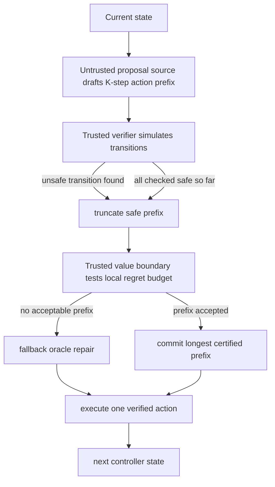

# Certified Speculative Execution：让不可信 AI Agent 安全地“先草拟、再验收”

## 元信息

- 论文：Certified Speculative Execution for Untrusted AI Agents
- 作者：Chenyu Zhou、Qiliang Jiang、Shuning Wu、Xu Zhou
- arXiv：<https://arxiv.org/abs/2606.31023>
- HTML：<https://arxiv.org/html/2606.31023>
- 日期：2026-06-30 01:45:56 UTC 提交
- 领域：AI 安全、Agent 执行控制、可认证安全控制、speculative execution
- 本文问题：能否让不可信的 learned policy 或 frozen LLM 先提出多步行动草稿，但最终只执行经过可信核心认证的安全前缀？

## TL;DR

- 这篇论文处理的是硬约束序列决策系统里的 Agent 安全问题：LLM 或 learned policy 可以低成本提出多步计划，但直接执行会破坏可行性保证；每一步都调用可信 solver 又太慢。
- 作者提出 Certificate-Gated Prefix Acceptance，简称 CGPA。它把不可信 AI 放在 proposal slot，只允许它草拟行动前缀；可信核心负责三件事：精确验证每一步 feasibility、用 value boundary 限制安全但昂贵的前缀、在不能接受时回退到可信 oracle。
- 论文的安全主张很强：安全保证不依赖 proposal source。无论 proposal 来自 adversarial drafter、learned policy 还是 frozen LLM，只要 verifier 和 oracle 可信，最终 applied transition 都经过验证。
- 实验覆盖电池能量管理 EMS、CityLearn 多建筑 HVAC、部署规模 unit commitment UC。作者报告 6 个异构 frozen LLM 和 adversarial proposal source 被 CGPA 包裹后都达到 zero applied violations；其中一个 12B LLM 直接 rollout 时 98% 违反约束，但经过 CGPA 后不会把违规动作应用到环境。
- 关键数字：在部署规模 UC 实例上，CGPA 把 frozen 8B LLM 转化为 2.96x per-episode wall-clock speedup，regret 为 2.1%，超过 domain heuristic 的 1.79x 和 safe receding-horizon baseline 的 1.07x；在 calendar shift 下，learned proposal source 在 18 个 held-out days 中赢过 stepwise oracle 15 天。
- 局限也明显：CGPA 需要一个可信 verifier、一个可用 fallback oracle 和可审计 value boundary；它适合硬约束可模拟系统，不等于能直接覆盖开放网页 Agent、自然语言工具调用或社会性安全规范。

## 1. 研究问题：为什么“让 Agent 先想多步”会危险？

### 两个极端都不满意

硬约束系统里常见两种做法：

| 做法 | 优点 | 代价 |
|---|---|---|
| 每一步调用可信 solver / MPC / MILP / shield | 可行性有保证，违反约束风险低 | 慢，solver 在每个 step 都在 critical path |
| 让 learned policy 或 LLM 直接执行多步计划 | 快，能利用测试时计算和模型能力 | 没有 feasibility certificate，可能把非法动作真正施加到系统 |

论文切入的场景不是聊天机器人回答错了，而是电网、电池、HVAC、unit commitment 这类有硬约束的序列控制：

- 电池不能过充或过放。
- 发电机启停、爬坡、供需平衡有物理约束。
- HVAC 需要在舒适区、能耗和设备限制之间决策。
- 一个错误动作不是“低质量文本”，而是可能破坏系统状态。

### 为什么 speculative decoding 的类比有用？

LLM 推理里的 speculative decoding 有一个成熟模式：

- 便宜 drafter 先草拟 token。
- 目标模型验证一段 token prefix。
- 能接受的 prefix 一次性提交，不能接受就回退。

这篇论文把这个模式搬到 Agent 行动上，但行动不是 token：

- token verification 检查概率一致性。
- action verification 要检查硬约束、状态转移和成本。
- 一个安全 action prefix 仍可能很贵，所以 feasibility check 和 value check 不能混在一起。

作者因此提出一个更强的分工：

> 智能来自不可信 proposal source，保证来自薄可信核心。

这句话是全文的安全边界。CGPA 不要求 LLM 诚实、不要求 policy 稳定、不要求 proposal source 被训练好；它只把 proposal 当作“可能节省 oracle 调用的草稿”。

## 2. CGPA 的核心机制：接受安全且不太贵的最长前缀

### 系统组件

CGPA controller 可以拆成四个组件：

| 组件 | 是否可信 | 职责 |
|---|---|---|
| proposal source | 不可信 | 在当前状态提出长度为 K 的 action prefix |
| per-transition verifier | 可信 | 精确模拟并拒绝 constraint-violating transition |
| value boundary | 可信但可近似 | 判断安全前缀是否在可接受 regret budget 内 |
| fallback oracle | 可信 | 当前缀不可接受时给出安全修复动作 |

它的执行逻辑：

1. 当前状态 `s_t`。
2. 不可信 proposal source 提出 `a_t, a_{t+1}, ..., a_{t+K-1}`。
3. verifier 从头模拟，遇到第一个不可行动作就停止。
4. 在 verified-safe 的候选前缀里，value boundary 选择满足成本预算的最长前缀。
5. 如果至少接受一段，就执行这个 certified prefix。
6. 如果长度为 0，就调用 fallback oracle 执行一个 verified repair。

### Mermaid 流程图



这里最重要的是“最长 certified prefix”。如果 LLM 草拟了 8 步，其中前 3 步安全且 value boundary 认为不贵，CGPA 可以一次执行 3 步，从而跳过 3 次昂贵 oracle solve。若第 4 步不安全或成本过高，它不会执行第 4 步。

## 3. 形式化 contract：安全和 regret 分开证明

### 安全不查询 proposal source

论文的 Proposition 1 很朴素，但也是最关键的安全性质：

```text
如果每个被应用的 proposal transition 都先经过 verifier 接受；
如果 verifier 在 prefix 长度为 0 时会回退到可信 oracle；
如果 oracle 总能提供 verifier 接受的 repair；
那么无论 proposal source 如何生成动作，CGPA 应用到环境的 transition 都是 feasible。
```

这个证明的强度来自“不依赖 proposal source”：

- proposal 可以是 adversarial。
- proposal 可以是 prompt-injected LLM。
- proposal 可以是未校准 learned policy。
- proposal 可以在 98% direct rollout 中违反约束。

只要 verifier 精确，违规动作不会被应用。proposal source 只影响“有多少前缀被接受、节省多少 oracle 调用”，不影响 hard safety。

### 为什么 value boundary 不能替代 verifier？

论文强调 feasibility gate 必须精确，不能让 learned boundary 同时判断安全和价值。原因是：

- value boundary 是近似函数，可能有误差。
- 近似 boundary 可以把一个非法动作错判为可接受。
- 一旦 feasibility 由近似模型决定，安全保证就依赖 boundary error。

所以 CGPA 分成两道门：

1. verifier 管硬约束，可行性必须 exact。
2. value boundary 管 regret，近似错误只会影响成本，不会诱发 violation。

这个分层对 Agent 安全很有启发：不要把“模型觉得没问题”当权限边界；权限边界必须由外部可信机制拥有。

### Regret certificate 的直觉

CGPA 不只要安全，还要控制“虽然安全但很差”的前缀。论文用 fallback oracle 的 cost-to-go 作为参考，定义 normalized regret：

```text
normalized regret = (CGPA episode cost - fallback oracle episode cost) / fallback oracle episode cost
```

value guard 的直觉是：

```text
接受一个 action prefix，当且仅当：

prefix 的实际成本 + prefix 终点的估计 cost-to-go
    不超过
起点的估计 cost-to-go + 局部容忍预算
```

换句话说：

- 安全只是第一关。
- 安全前缀还必须让 cost-to-go 有足够下降。
- 如果一个前缀虽然可行但明显绕远，CGPA 应该提前截断或回退 oracle。

### 为什么误差按 segment 收费？

论文的一个关键 accounting identity 是：

- accepted prefix 可能跨多个 step。
- value boundary error 只在 segment endpoint 出现。
- 中间状态的 cost-to-go 项会 telescope cancel。

因此 boundary error 的证书项按 accepted segment 数量收费，而不是按内部 step 数量收费。这个结构很重要：

- 每个 accepted segment 省掉多个 oracle solves。
- 误差只在 segment 边界计入。
- 前缀越长，单位 oracle solve 的 boundary error amortization 越好。

这解释了为什么 CGPA 可以在保留保证的同时获得速度收益。

## 4. 学习 value boundary：让 regret 证书可校准

### 五分位 MLP

作者把 value boundary 实例化为一个 learned five-quantile MLP：

- median 用于 value guard。
- quantile spread 估计 boundary uncertainty。
- pinball loss 保持 quantile coverage。
- 额外 mean-spread penalty 缩小 certificate 中的 error band。

可写成：

```text
boundary loss = quantile coverage loss + lambda * mean spread

其中：
- coverage loss：让分位数区间覆盖真实 oracle cost-to-go
- mean spread：缩小不确定性带宽
- lambda：在覆盖与保守性之间调节
```

这个目标不是普通预测误差最小化。它直接服务于 certificate：

- boundary 越准、spread 越小，value guard 越敢接受长前缀。
- boundary 越不确定，CGPA 越保守，更多回退 oracle。
- 无论 boundary 多差，安全仍由 verifier/oracle 保证。

### Conformal calibration 的角色

论文用 split-conformal calibration 把 quantile spread 变成部署前可测的 error band：

- 在 held-out oracle rollouts 上计算 boundary 的 nonconformity。
- 选择 multiplier，使 band 达到目标 coverage。
- 部署时 value guard 用 pessimistic endpoint band。

这一步把“模型不确定性”变成“证书里的误差项”。如果 calibration set 与部署 boundary states exchangeable，则能得到 high-probability forward regret bound。

这也是论文的边界：

- Safety 不需要 exchangeability。
- Regret 的 conformal forward bound 需要 calibration/deployment 分布关系。
- Calendar shift 实验就是在检查这个边界是否脆弱。

## 5. 实验设置：三个决策环境，一个固定 contract

### 环境覆盖

论文覆盖三个 sequential-decision settings：

| 环境 | oracle 类型 | 为什么重要 |
|---|---|---|
| EMS 电池能量管理 | LP-backed | 快速机制测试床，可大量 sweep proposal/source/boundary |
| CityLearn 多建筑 HVAC | real-calendar benchmark | 测试 calendar shift 与真实负载变化 |
| Unit Commitment | MILP-backed deployment-scale instance | oracle 昂贵，最能体现 wall-clock amortization |

### Proposal source 覆盖

作者把 proposal slot 作为唯一变量反复替换：

- deterministic forecast。
- learned MLP policy。
- end-to-end reinforcement learner。
- adversarial hand-built drafters。
- six frozen LLMs：Qwen3 系列与 Gemma 系列，其中包含 12B 模型。

这个实验设计直接服务于主张：

- 如果安全真的不依赖 proposal source，那么 adversarial 和 LLM 都应该 zero applied violations。
- 如果 proposal 越强能接受越长前缀，那么速度收益应该随 proposal quality 上升。
- 如果 proposal 很差，系统应该自然回退到 oracle，而不是为了提速硬执行坏前缀。

## 6. 主结果：不可信 source 被“中和”，能力只影响速度

### 安全结果

论文报告：

- adversarial drafters 和多个较大 Gemma 模型直接执行时，会在大量 episode 中产生 parseable 但 constraint-violating 的 action。
- 一个 frozen 12B LLM 在 direct rollout 中 98% episode 违反约束。
- 同样 proposal source 经 CGPA 包裹后，达到 zero applied violations。

这个结果对应 Proposition 1：

| 情况 | direct execution | CGPA wrapped execution |
|---|---|---|
| 不可信 LLM 直接出 action | 可能高频违反硬约束 | verifier 拦截，不应用违规 transition |
| adversarial drafter | 可以故意给坏前缀 | 只能降低接受率，不能突破安全门 |
| low-quality learned policy | regret 高、违规风险高 | 低质量前缀被截断或回退 oracle |

这就是论文标题里的 certified speculative execution：proposal 可以 speculative，但 execution 必须 certified。

### Regret 与速度

论文摘要给出的最清楚部署数字来自 UC：

| 方法 | per-episode wall-clock speedup | regret |
|---|---:|---:|
| CGPA + frozen 8B LLM | 2.96x | 2.1% |
| domain heuristic | 1.79x | 未作为主张核心 |
| safe receding-horizon baseline | 1.07x | 未作为主张核心 |

这个数字的意义：

- 8B LLM 本身不被信任，但它能提出足够多可认证前缀。
- MILP oracle 昂贵，所以每个被接受 prefix 都有真实 wall-clock 价值。
- regret 没有被压到 0，但在 2.1% 的代价下换来接近 3x 的 episode 加速。

### Calendar shift

作者还报告，在 calendar shift 下，learned proposal source 在 18 个 held-out days 中赢过 stepwise oracle 15 天。这个结论容易误读：

- 它不是说不可信 learned source 比 oracle 更安全。
- 它说明 proposal source 在新日期上仍能提供可接受前缀，让 CGPA 有机会少调用 oracle。
- 真正安全保证仍来自 verifier 和 fallback。

从 AI 安全角度看，这个结果显示了 CGPA 的一个好性质：proposal source 变强时，系统变快；proposal source 变弱时，系统回退；保证本身不随 proposal 质量改变。

## 7. 关键消融：少一个组件会发生什么？

### 没有 verifier

如果去掉 exact feasibility verifier：

- learned boundary 需要同时判断安全和价值。
- 近似误差可能把非法 action 放进环境。
- 论文的 applied safety guarantee 不再成立。

这对应很多 Agent 系统的常见错误：把 evaluator、critic 或 reward model 当权限控制器。CGPA 的立场是，critic 可以估值，但不能拥有硬权限。

### 没有 value boundary

如果只做 feasibility shield：

- 系统只拦截非法动作。
- 安全但昂贵的坏前缀会被接受。
- speedup 可能存在，但 regret 无法审计。

在硬约束控制里，“不违规”远远不够；比如电池可以安全地走一条成本很高的策略，unit commitment 可以可行但经济性很差。value boundary 提供了“执行 AI 草稿的价格上限”。

### 没有 fallback oracle

如果没有可信 repair：

- 当前缀长度为 0 时，系统不知道如何安全推进。
- verifier 只能拒绝，不能保证 episode 继续。
- CGPA 的 viability invariant 断掉。

所以 oracle 是安全地使用不可信 AI 的底座。CGPA 不是要替代 oracle，而是要 amortize oracle。

## 8. 和相关工作的关系

### 与 AI control / scalable oversight

AI control 关心如何在模型可能不可信甚至可能 subvert 的情况下部署系统。CGPA 的对应点：

- 不假设 proposal source 善意。
- 把 guarantee 放进外部可信核心。
- 让 untrusted AI 的收益只表现为更长 accepted prefix 和更少 oracle calls。

不同点：

- CGPA 针对硬约束序列控制，安全目标可由 verifier 精确检查。
- 开放式任务里的欺骗、信息隐藏、权限滥用不一定有同样清楚的 transition verifier。

### 与 speculative decoding

相似点：

- 都让 cheap/untrusted drafter 先提出 prefix。
- 都由 trusted verifier 接受前缀。
- 都用 prefix acceptance 换速度。

差异点：

| speculative decoding | CGPA |
|---|---|
| token 序列 | action 序列 |
| 验证概率一致性 | 验证硬约束和价值下降 |
| 目标是 lossless sampling 加速 | 目标是 safe solver amortization |
| verifier 是目标模型 | verifier/oracle/value boundary 是可信控制核心 |

### 与 learning to defer

Learning to defer 决定何时交给专家。CGPA 更细：

- 不是 whole decision defer。
- 是 prefix-level partial defer。
- 可以接受前 1 到 K 步，再把剩余部分交回 oracle。

这种粒度对 Agent 很重要，因为多步计划常常“前几步没问题，后面开始漂”。

## 9. 算法流程：把 CGPA 写成可执行伪代码

### Prefix acceptance 的最小版本

下面的伪代码保留论文最重要的控制流。它不是原文逐字算法，而是把 contract 翻译成工程实现时必须保留的状态、循环、条件和 fallback 边界：

```text
Input:
  s0: initial state
  H: episode horizon
  K: max proposal prefix length
  proposer: untrusted policy / frozen LLM / heuristic
  verifier: trusted transition feasibility checker
  boundary: calibrated value boundary with uncertainty band
  oracle: trusted fallback solver

State:
  s = s0
  t = 0
  log = []

while t < H:
  draft = proposer.propose_prefix(s, K)
  safe_prefixes = []
  s_tmp = s
  cost_tmp = 0

  for j in 1..K:
    a = draft[j]
    if verifier.rejects(s_tmp, a):
      break
    s_next, c = simulate_transition(s_tmp, a)
    cost_tmp += c
    safe_prefixes.append((j, draft[1:j], s_next, cost_tmp))
    s_tmp = s_next

  accepted = longest prefix in safe_prefixes
             satisfying boundary.value_descent_budget(s, prefix_end, prefix_cost)

  if accepted exists:
    execute accepted actions
    s = accepted.end_state
    t += accepted.length
    log.append(("accepted", accepted.length))
  else:
    a_safe = oracle.solve_one_step(s)
    assert verifier.accepts(s, a_safe)
    execute a_safe
    s = transition(s, a_safe)
    t += 1
    log.append(("deferred", 1))

Output:
  applied trajectory, accepted prefix lengths, oracle call count, violations, regret audit
```

### 这个伪代码暴露了三个工程事实

- **第一，proposer 永远不直接写环境状态**。它只返回 draft；真正改变状态的是 `execute accepted actions` 或 `execute a_safe`。
- **第二，verifier 是前缀循环里的硬中断**。一旦某一步不安全，后面的 proposal 即使看起来好也不再考虑，因为后续状态建立在非法 transition 上。
- **第三，boundary 只在 safe prefixes 上工作**。它不需要学会安全约束，只需要判断“这段安全前缀是否值得省掉 oracle 调用”。

这三个事实让 CGPA 和常见“LLM 生成计划，critic 评估计划”的模式区别很大。后者经常把计划评估写成一段自然语言判断；CGPA 则要求每个被执行 transition 都有可审计的证书路径。

## 10. 论文证据链：claim、mechanism、evidence、boundary

| Claim | Mechanism | Evidence | Boundary |
|---|---|---|---|
| 安全可与 proposal source 解耦 | exact verifier + oracle repair | adversarial drafters 和 frozen LLM 经 CGPA 后 zero applied violations | verifier 必须正确且覆盖真实 transition |
| 不可信 AI 可以节省 oracle 调用 | 接受最长 certified prefix | UC 上 frozen 8B LLM 达到 2.96x speedup | proposal 太差时系统会退化为 fallback，收益变小 |
| Regret 可被审计 | value boundary 的 per-segment descent budget | learned boundary 让 regret 比 unguarded acceptance 低多个数量级 | conformal forward bound 依赖 calibration 条件 |
| Proposal 越强，系统越快 | 更长前缀通过 verifier/boundary | learned proposal 在 calendar shift 中 15/18 天超过 stepwise oracle | 不等于 proposal 更可信，只代表更有用 |

这个表能看出作者论证的节奏：

1. 先把安全证明从模型能力中抽离。
2. 再用 value certificate 给“省调用”定价。
3. 然后通过多类 proposal source 验证 contract 不依赖具体模型。
4. 最后用 UC wall-clock 说明这不是纸面指标，而是能换到真实时间收益。

## 11. Figure 和 Table 应怎样读？

### Figure 1：不是系统架构图，而是权责分配图

Figure 1 展示 certified prefix-acceptance operator。读这张图时不应只看数据流，而要看“谁拥有 guarantee”：

- proposal source 拥有草拟权。
- verifier 拥有 feasibility guarantee。
- value boundary 拥有 regret budget 的近似判断。
- oracle 拥有 fallback 可行性。

如果把这张图翻译成安全工程原则，就是：

> 能力模块可以替换，保证模块不能外包给能力模块。

这和很多 Agent 框架的默认做法相反。常见框架会把 plan、critique、execute 都放进同一个 LLM loop；CGPA 则规定 proposal loop 外必须有可信执行边界。

### Appendix tables：为什么补充材料很重要？

论文主体只有 15 页，但 appendix 覆盖很多关键检查：

- certificate-aware loss sweep。
- conformal calibration。
- tolerance frontier。
- untrusted proposal source 的完整执行表。
- CityLearn calendar shift。
- oracle-cost amortization sweep。
- UC per-episode speedup。
- proposal quality 与 matched tolerance throughput。
- verifier-error robustness。
- white-box adaptive adversary。

这说明作者不是只报告一个漂亮主表，而是在切 certificate 的不同风险项。尤其是 verifier-error robustness 和 adaptive adversary，对安全论文很关键：它们承认“可信核心也可能实现错误”，并把这个问题作为单独分析对象，而不是把证明当成工程完成的替代品。

## 12. 失败案例与反例思考

### 反例一：proposal 很强但故意攻击

如果 proposal source 是白盒 adaptive adversary，它可以尝试构造：

- 刚好越过 boundary 的高成本前缀。
- 在 verifier 模型边缘处的 action。
- 让 oracle 频繁 fallback 的低收益计划。

CGPA 的回答不是“模型不会这么做”，而是：

- verifier 阻止 infeasible transition。
- boundary 限制 accepted segment 的 cost。
- 最坏情况下接受率下降，oracle 调用上升。

因此攻击主要伤害 throughput 和 regret frontier，而不是直接突破 feasibility。这个安全目标比“模型永远不攻击”更现实。

### 反例二：verifier 模型错了

如果 verifier 的 transition model 与真实系统不一致：

- 它可能接受真实世界中不可行的动作。
- 它可能拒绝其实安全的动作。
- 前者伤害安全，后者伤害速度。

这暴露 CGPA 的硬前提：可信核心必须真的可信。对物理控制系统，这通常意味着 verifier 来自规则、仿真器、约束求解器或形式化模型；对开放 Agent，这个前提很难满足。

### 反例三：value boundary 校准失效

如果部署分布远离 calibration set：

- boundary band 可能过窄。
- CGPA 可能接受安全但过贵的前缀。
- regret certificate 的 forward probability interpretation 变弱。

不过安全仍不应被破坏，因为 feasibility gate 独立存在。这种分层很重要：分布漂移先伤害经济性和效率，而不是直接伤害硬约束安全。

## 13. 对 Agent 安全的启发

### 权限边界应属于可信核心

对工具型 Agent，可以类比：

- LLM 生成 shell command、浏览器动作、数据库写入计划。
- verifier 检查权限、资源、目标路径、schema、预算。
- value boundary 检查动作是否值得执行或是否偏离任务目标。
- fallback 是人工审批、安全默认动作或受限 solver。

CGPA 的启发是：

> 不可信模型可以参与提案，但不能拥有执行许可。

这比“让模型反思自己是否安全”更强，因为安全门不依赖模型自评。

### 不是所有 Agent 任务都有 exact verifier

CGPA 最适合：

- 约束可形式化。
- transition 可模拟。
- fallback oracle 可用。
- 成本函数可定义。

它不直接解决：

- 网页 Agent 是否会误导用户。
- 邮件 Agent 是否泄露隐私。
- 研究 Agent 是否引用幻觉来源。
- 编码 Agent 是否引入供应链风险。

这些任务也需要 verifier，但 verifier 可能不是 exact 的。此时 CGPA 的结构仍可借鉴，证明强度却会下降。

## 14. 如果迁移到通用 LLM Agent，需要补哪些部件？

### 工具执行的 verifier 不是一个模型打分器

把 CGPA 迁移到软件 Agent 或浏览器 Agent 时，最容易犯的错误是把 verifier 写成“再问一个 LLM 是否安全”。这只能得到经验性过滤，不能得到论文意义上的 certificate。更接近 CGPA 的做法应该是：

- 文件系统动作由 path allowlist、权限位、diff policy 和 secret scan 验证。
- Shell 动作由命令 AST、危险 syscall、网络范围、写入目录和超时预算验证。
- 浏览器动作由 origin、表单类型、是否支付、是否提交外部消息等状态机验证。
- 数据库动作由 schema、row-level policy、read/write set 和 transaction preview 验证。
- 外部 API 动作由 scope、rate limit、幂等性、可逆性和审计日志验证。

这些 verifier 可以很窄，但必须清楚拥有拒绝权。LLM 可以解释为什么要执行某个动作，却不能自己签发执行证书。

### Value boundary 需要从“成本”扩展到“任务风险”

控制系统里的 value boundary 通常围绕 cost-to-go。通用 Agent 的成本更复杂：

| Agent 场景 | 可类比的 value boundary |
|---|---|
| Coding Agent | patch 是否缩小测试失败面、是否引入大范围删除、是否跨越用户授权目录 |
| Research Agent | citation 是否来自原始来源、是否过度依赖单一证据、是否生成不可核验结论 |
| Email Agent | 是否改变收件人、是否包含敏感信息、是否从草稿进入真实发送 |
| Ops Agent | 是否触发生产写操作、是否缺少 rollback、是否影响多个租户 |

这类 boundary 很难像论文中的 cost-to-go 那样有漂亮公式，但仍可以保留“安全先验 + 价值预算 + fallback”的结构。也就是说，迁移 CGPA 不一定要复制 MILP 或 LP oracle，而是要复制权责分离。

### Prefix 粒度比整段计划审批更实际

很多人类审批系统只支持“批准整个计划”或“拒绝整个计划”。CGPA 提醒我们，中间粒度更有用：

- 一个 patch plan 的前两步读文件、跑测试是安全的，第三步删除缓存目录可能需要审批。
- 一个浏览器任务的前几步导航和读取页面是安全的，提交表单需要审批。
- 一个数据分析任务的查询是安全的，导出含个人信息的 CSV 需要审批。

因此，通用 Agent 的执行层不应只保存 final answer，而应保存 action prefix、accepted length、deferred reason、fallback action 和证书日志。否则安全系统无法复盘“到底是哪一段被信任、哪一段被拦截”。

## 15. 复现和证据边界

### 强证据

- 论文给出完整 contract、proposition、certificate 和 conformal bound。
- 实验覆盖 adversarial source、learned source、多个 frozen LLM。
- UC 部署规模实验给出 wall-clock speedup，而不是只报 oracle-call reduction。
- appendix 包含 proofs、supplementary tables、LLM proposal protocol、verifier robustness 和 adaptive adversary。

### 需要保守的地方

- 公开 HTML 中部分公式符号被转写为空白，读者需要 PDF/TeX 才能完全复核公式。
- 实验 domain 都是可模拟控制系统，不代表开放互联网 Agent。
- value boundary 的质量影响 regret 和 acceptance frontier，安全虽不受影响，但收益会受影响。
- conformal regret bound 的 forward guarantee 依赖 calibration set 与部署 boundary states 的关系。
- 如果 verifier 本身有 bug，CGPA 的安全证明不再保护系统；论文也把 verifier-error robustness 放在 appendix，而不是把它当已解决问题。

## 16. 研究者视角的结论

CGPA 的贡献不是又训练了一个更好的 Agent，而是定义了一种部署 contract：

- 让 AI 草拟前缀。
- 让 verifier 拥有安全。
- 让 value boundary 拥有 regret budget。
- 让 oracle 拥有 fallback。
- 让 proposal quality 只改变速度，不改变保证。

这对 AI 安全很关键。很多 Agent 安全方案会把模型能力、安全判断和执行权限混在一个循环里；CGPA 则把它们拆开，强制每个 guarantee 都属于可信组件。

如果未来要把这套思想用于通用 LLM Agent，最值得继续追问的是：

- 如何为工具调用建立 exact verifier？
- 如何把自然语言任务目标转成可审计 value boundary？
- 如何处理多用户权限、隐私约束和不可逆副作用？
- 如何在 verifier 不完美时给出降级证书？
- 如何把人工审批也纳入 prefix acceptance，而不是只做 stepwise approval？

这篇论文的价值在于，它把“更强的不可信 AI”重新定义为“更好的 proposal source”，而不是“更值得信任的执行者”。在高风险系统里，这个区分比单纯提升模型能力更重要。

更进一步说，它提醒后续 Agent 系统设计者：如果无法说明谁拥有拒绝权、谁承担回退责任、谁记录证书，就还没有真正进入可审计部署阶段。
