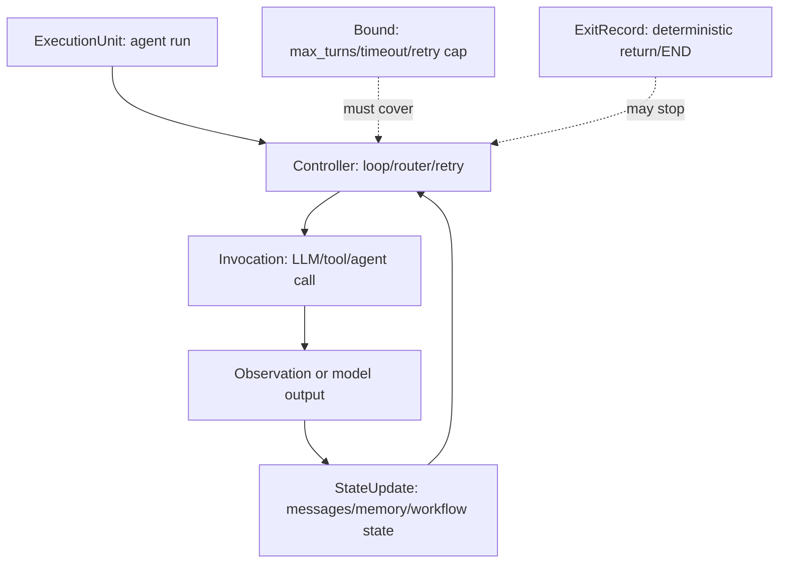

# When Agents Do Not Stop：把 Agent 无限循环从“经验事故”定义成可静态检测的结构性风险

| 字段 | 内容 |
| --- | --- |
| 论文 | **When Agents Do Not Stop: Uncovering Infinite Agentic Loops in LLM Agents** |
| 方法名 | **IAL-Scan**，面向真实 LLM Agent 项目的无限 Agentic Loop 静态分析器 |
| 链接 | [arXiv:2607.01641](https://arxiv.org/abs/2607.01641)，v1 于 2026-07-02 03:14:27 UTC 提交 |
| 作者 | Xinyi Hou、Shenao Wang、Yanjie Zhao、Haoyu Wang |
| 方向 | AI 安全 / Agent 安全 / 静态分析 / 运行时治理 |

## TL;DR

- **研究问题**：论文把 LLM Agent 中“跑不停止”的故障定义为 Infinite Agentic Loops，简称 **IAL**。它不是普通代码死循环，而是模型输出、工具结果、状态更新、框架路由、重试逻辑和多 Agent handoff 共同形成的反馈路径，在没有有效边界时反复触发模型调用、工具调用或状态增长。
- **核心方法**：作者提出 **IAL-Scan**。它先把不同 Agent 框架的源码和框架语义抽象成统一的 **Agent IR**，再构造 **Agentic Loop Dependence Graph（ALDG）**，最后用 SCC 候选发现、controller 分类、bound coverage 验证和 LLM 辅助负过滤来判断反馈路径是否真的缺少强边界。
- **关键证据**：IAL-Scan 支持 LangChain、LangGraph、CrewAI、AutoGen、LlamaIndex、OpenAI Agents SDK、Google ADK、Semantic Kernel 8 类框架；在 **6,549** 个至少 1 star 的 Python LLM Agent 仓库上发现 **74** 个潜在问题，人工确认 **68** 个真实 IAL，涉及 **47** 个项目，端到端 precision 为 **91.9%**。
- **主要发现**：LangGraph 与 AutoGen AgentChat 贡献 **45/68** 个确认问题；最常见失败模式是无边界 retry、无边界 tool-call iteration、多 Agent chat 缺少 turn bound，三者合计 **47** 个问题。影响上，API 成本耗尽和模型服务拒绝各出现在 **65/68** 个问题中。
- **为什么重要**：论文指出“有 max_iterations、recursion_limit、max_turns 参数”不等于安全。真正要检查的是边界是否覆盖了实际反馈路径：内层工具 cap、局部 retry cap 或默认框架限制，可能并不支配外层 evaluator loop、workflow cycle 或 agent reentry。
- **实验结论**：完整 IAL-Scan 在 264 项子集上保留 **340** 个静态候选，输出 **74** 个 alert，覆盖全部 68 个真实问题；去掉框架建模会把 alert 拉到 **276** 且 TP 降到 **61**；去掉 LLM pruning 会产生 **340** 个 alert 和 **272** 个 FP。
- **对比基线**：通用 coding assistant 覆盖 50 个真实问题，但产生 140 个 alert、75 个项目超时或出错，平均 141.9K tokens；纯 LLM API 只覆盖 23 个真实问题。作者据此主张：Agent 无限循环检测不能只靠“让模型读仓库”，需要框架感知图分析。
- **局限**：IAL-Scan 是静态分析，不能预测唯一执行轨迹；当前主要覆盖 Python 和 8 类框架；自定义 scheduler、外部状态 stop logic、自然语言语义终止条件仍可能造成 FP/FN；LLM pruning 只应作为负过滤，不应成为最终事实来源。

## 1. 研究问题：为什么“Agent 会自己停”不是工程假设？

### 1.1 论文把失败对象从代码循环换成 Agent 反馈路径

传统死循环通常看源码就能定位：

- `while True` 没有 `break`；
- 递归没有 base case；
- 事件循环没有退出条件；
- worker 不消费停止信号。

LLM Agent 的问题更难，因为“循环”经常不写在同一段源码里：

- 模型输出 `tool_calls`，框架调度工具；
- 工具结果被追加到 `messages`；
- 增长后的 `messages` 再次喂给模型；
- 模型根据新 observation 决定继续调用工具；
- 多 Agent 框架把一个 Agent 的回复 handoff 给另一个 Agent；
- evaluator、repair、planner、router 之间形成隐式回路。

论文的关键定义可以压缩成一个判断式：

> IAL = agentic feedback path + costly/state-growing action + no effective bound

这里有三个必要条件：

| 条件 | 含义 | 为什么缺一不可 |
| --- | --- | --- |
| agentic feedback path | 重复路径跨过模型、工具、状态、workflow、handoff 或重试逻辑 | 只看语法 loop 会漏掉框架诱导的反馈 |
| costly/state-growing action | 路径会反复触发 LLM call、tool call、agent run、workflow transition 或消息增长 | 没有成本或状态放大时，通常只是普通控制流 |
| no effective bound | 没有真正覆盖该路径的 turn cap、retry cap、timeout、budget、recursion limit 或 deterministic exit | 有一个局部限制不代表外层反馈被限制 |

这一定义的研究价值在于：它把“Agent 运行久了有时会卡住”的经验事故，变成了可以在部署前检查的结构性属性。

### 1.2 论文不把所有长循环都判成漏洞

作者刻意区分了合法迭代与 IAL：

- 合法迭代：
  - 有明确任务边界；
  - 反馈路径被强边界覆盖；
  - 状态增长有上限；
  - 失败会进入 deterministic exit、人工确认或异常处理；
  - tool retry、repair、delegation 只在有限预算内发生。
- IAL：
  - 继续执行依赖模型输出、工具 observation、异常、外部状态或 Agent handoff；
  - 路径反复到达高成本调用或状态增长点；
  - 边界缺失、被禁用、放错作用域、只覆盖内层路径，或只是弱语义约束；
  - 攻击者不需要改代码，只需通过正常输入影响 observation 或工具结果。

这也是论文标题里 “Agents Do Not Stop” 的含义：它不是说所有 Agent 都不会停止，而是说很多工程实现把停止条件外包给模型行为或框架默认值，而这些并不总能支配真实反馈路径。

## 2. 威胁模型：攻击者不改代码，只诱导路径重复

### 2.1 假设范围

论文的威胁模型比较务实：

| 项目 | 设定 |
| --- | --- |
| 被分析系统 | 已部署或准备部署的 LLM Agent 应用 |
| Agent 能力 | 调 LLM、调工具、访问外部服务、更新状态、写文件、改数据库、执行代码、创建 ticket |
| 可信边界 | 源码、框架配置、工具定义、底层框架本身不被攻击者篡改 |
| 攻击入口 | prompt、任务请求、文档、URL、issue、ticket、workflow 参数、API 输入 |
| 攻击效果 | 诱导模型输出、工具参数、检索内容、外部 observation 或错误条件，让路径重复执行 |
| 不覆盖 | 高流量网络 DoS、基础设施层资源耗尽、prompt sponge、恶意框架修改、纯语义 no-progress |

这个模型的重点是：**IAL 是部署前源码中已经存在的结构性风险**。攻击者只是在运行时触发它，而不是创造它。

### 2.2 为什么仅靠 runtime cap 不够？

很多框架已经提供停止机制：

- LangChain AgentExecutor 有 `max_iterations`；
- LangGraph 有 recursion limit；
- OpenAI Agents SDK 有 `max_turns` 与 `MaxTurnsExceeded`；
- AutoGen / CrewAI 有 `max_turns`、`termination_condition` 或 `max_iter`。

论文并没有否认这些机制。它真正指出的是：

| 常见误区 | IAL-Scan 关心的问题 |
| --- | --- |
| “框架有默认上限” | 默认上限是否启用？是否可被设成 `None`？是否覆盖当前 path？ |
| “代码里有 timeout” | timeout 是外层 agent run 的 timeout，还是只包住了某个 tool call？ |
| “有 retry counter” | counter 是否支配 parser failure、validator rejection、workflow edge、agent handoff 的重复路径？ |
| “有终止消息” | 终止由模型自然语言输出控制，还是由 deterministic predicate 控制？ |
| “有人工确认” | 人工 gate 是否在重复路径之前触发，还是已经在工具调用后才触发？ |

因此，本文不是在宣传“多加一个循环次数限制”这么简单，而是在要求安全分析回答一个更严格的问题：

```text
对每一条能回到模型、工具、Agent 或 workflow 的反馈路径，
是否存在一个强边界支配这条路径上的 controller 和高成本动作？
```

## 3. 动机案例：模型控制 exit 时，源码里看似有退出其实很脆

论文用一个 LangChain 兼容模型 wrapper 做动机案例。核心路径可以概括为：

1. 外层 loop 检查 `finish_reason` 是否为空或等于 `tool_calls`。
2. 每轮调用 `self.llm._generate(...)`。
3. 如果模型返回 `$web_search` tool call，代码追加模型消息与 `ToolMessage`。
4. 增长后的 `messages` 在下一轮再次进入模型。
5. 只有当模型不再产生 tool call 时，路径才退出。

这段逻辑的问题不在于“源码有 while”，而在于：

- controller 的 guard 依赖模型输出；
- tool result 会进入 state update；
- state update 会回流到下一轮 model call；
- `break` 只退出内层 tool iteration；
- 没有本地 `max_tool_calls`、`max_iterations` 或 timeout 覆盖外层路径。

用数据流表示就是：

```text
model output -> tool call -> ToolMessage append -> message state grows
             ^                                      |
             |--------------------------------------|
```

如果模型或外部 observation 持续推动 `tool_calls`，系统会继续消耗：

- token；
- LLM API 调用；
- tool API 调用；
- worker 时间；
- context window；
- 外部服务 quota。

这个案例说明：**模型依赖 exit 不是强边界**。它可以是正常完成条件，但不能替代预算、步数、状态大小或超时限制。

## 4. 方法机制：IAL-Scan 如何把不同框架统一到 Agent IR？

### 4.1 Agent IR 的设计目标

不同 Agent 框架会用完全不同的 API 表达同一类行为：

| Agent 概念 | 可能的框架表达 |
| --- | --- |
| model call | `llm.invoke`、`AgentExecutor.invoke`、`Runner.run`、custom wrapper |
| tool dispatch | `ToolNode`、decorated tool、`tools=[...]`、function calling |
| workflow transition | LangGraph edge、conditional edge、router node |
| handoff / delegation | AutoGen group chat、OpenAI handoff、CrewAI delegation |
| state update | `messages.append`、chat history、workflow state、memory write |
| bound | `max_turns`、`max_iterations`、`recursion_limit`、timeout、retry cap |

如果检测器只匹配 API 名称，结果会很脆：

- 框架升级后 API 改名会漏报；
- wrapper 把模型调用包起来会漏报；
- workflow edge 不是普通函数调用会漏报；
- handoff 不是直接递归也会漏报；
- 局部 bound 被误认为覆盖全局路径会误报。

所以 IAL-Scan 的第一步是把源码事实和框架事实翻译到统一的 Agent IR。

### 4.2 Agent IR 的核心 fact

论文列出的 schema 可以重写成更直观的表：

| Fact | 捕获对象 | IAL 中的作用 |
| --- | --- | --- |
| `ExecutionUnit` | function、class、agent、workflow、graph node | 定义分析作用域 |
| `Controller` | loop、router、retry、termination predicate | 判断路径由谁控制 |
| `Invocation` | LLM call、tool call、agent run、workflow run、subprocess | 标记成本和副作用 |
| `StateUpdate` | message append、memory write、workflow state update | 标记状态增长与回流 |
| `Bound` | turn cap、retry cap、timeout、budget、recursion limit | 候选停止边界 |
| `ExitRecord` | return、break、END edge、termination predicate | 候选退出机制 |

关系层则记录：

- `owns(unit, fact)`：哪个作用域拥有该事实；
- `calls(invocation, callee)`：调用关系；
- `updates(state_update, target)`：状态更新；
- `guards(controller, variable)`：controller 依赖哪些变量；
- `exits(exit_record, controller)`：退出和 controller 的关系；
- `constrains(bound, target)`：bound 约束哪个目标；
- `transitions(source, target)`：workflow 转移；
- `dispatches(invocation, target)`：tool/agent dispatch；
- `aliases(name, target)`：别名解析。

这个 IR 的意义是：它让 LangGraph 的 `add_conditional_edges`、OpenAI Agents SDK 的 `Runner.run`、AutoGen 的 group chat、CrewAI 的 delegation 都能落到相同问题上：

```text
是否有一条反馈路径反复到达 Invocation 或 StateUpdate，
且 Bound 没有有效约束该路径？
```

### 4.3 Program fact extraction：先从源码提局部事实

IAL-Scan 会建立 project index，并解析 Python AST。它提取：

- imports 与 framework usage；
- decorators、local factories、custom runtime classes；
- agent callables 与 workflow construction；
- loops、recursive calls、call expressions；
- state updates；
- conditional exits；
- try/except retry paths；
- config 中的 cap、budget、timeout。

它不做昂贵的 whole-program points-to analysis，而是做轻量 name / attribute resolution：

- import alias；
- local assignment；
- object field；
- factory return；
- project-defined wrapper。

这是一个务实选择：Agent 项目多、框架多、仓库规模大，分析器需要在真实 GitHub 语料上跑完，而不是只服务几个人工整理 benchmark。

### 4.4 Framework behavior modeling：把隐式执行边补出来

真正难点在框架语义：

- tool 注册在一处，运行时由 dispatcher 调；
- workflow edge 可能执行 node，但源码没有直接函数调用；
- handoff 把控制权移交另一个 Agent；
- `Agent.as_tool(...)` 会让 Agent 被当成 tool 重新进入；
- group chat 的 termination predicate 可能是自然语言或消息序列判断。

IAL-Scan 对这些框架行为做三类建模：

| 建模类型 | 作用 |
| --- | --- |
| construction model | 识别 agent、tool、workflow、graph node、runtime scope |
| invocation model | 推导 tool dispatch、workflow transition、handoff、delegation、agent reentry |
| configuration model | 把 `max_turns`、`max_iterations`、`max_retry`、`recursion_limit` 绑定到对应 runtime scope |

这也是消融实验里“去掉 Framework Modeling”会严重退化的原因：没有框架边，检测器只看到源码语法，既漏掉真实反馈，也会把大量普通循环误报成 Agent loop。

## 5. ALDG：把 Agent IR 变成可判定的反馈图

### 5.1 节点和边

Agentic Loop Dependence Graph（ALDG）是一个带属性有向图。它保留：

- controller 节点；
- invocation 节点；
- state update 节点；
- exit 节点；
- bound 节点；
- framework transition 边；
- call / dispatch 边；
- guard dependency 边；
- feedback 边；
- state carry-over 边。

一个简化的 Mermaid 图如下：



ALDG 不直接把每个 cycle 判成失败，而是先标注候选属性：

| 属性 | 问的问题 |
| --- | --- |
| `body_cost_kinds` | cycle 里是否反复到达 LLM/tool/agent/workflow 这类成本动作？ |
| `state_growth` | 是否反复追加 message、history、memory 或 workflow state？ |
| `exit_kinds` | 是否有 return、END edge、termination predicate？ |
| `guard_source` | controller 的继续条件来自 deterministic condition、model output、tool result、external state、exception 还是混合来源？ |
| `bound_sources` | 哪些 cap、timeout、budget 可能约束该路径？ |

### 5.2 为什么 SCC 是合适的候选发现方式？

IAL-Scan 从 ALDG 中取 cycle-relevant subgraph，然后计算 strongly connected components（SCC）：

- 保留可能参与重复执行的边：
  - control flow；
  - calls；
  - framework transitions；
  - tool dispatch；
  - feedback edges。
- 暂时排除 exit edges 和 bound attributes：
  - 因为它们描述可能停止，而不是重复本身。
- 保留非平凡 SCC：
  - 多节点环；
  - 或带 self-loop 的单节点。

这个设计有两个好处：

1. 先把“可能重复”的结构找出来，再判断是否安全；
2. 不会因为存在一个退出边就提前丢掉候选，因为退出可能依赖模型输出或外部状态。

### 5.3 公式化理解：IAL 风险判定

可以把每个候选反馈区域 `C` 看成一个四元组：

```text
C = (R, A, G, B)
```

变量解释：

- `R`：从 Agent entry 可达的重复反馈路径；
- `A`：路径上可重复到达的动作集合，如 LLM call、tool call、agent run、workflow transition、state append；
- `G`：控制继续执行的 guard 来源；
- `B`：候选边界集合，如 step cap、turn cap、timeout、retry cap、budget、recursion limit。

IAL-Scan 的核心判断可写成：

```text
IAL(C) = reachable(R)
         ∧ has_cost_or_growth(A)
         ∧ controller_is_runtime_dependent(G)
         ∧ ¬ effective_cover(B, R)
```

其中 `effective_cover(B, R)` 不是“项目里出现过某个 bound”，而是：

- bound 约束 controller；
- 或 bound 约束 runtime scope；
- 或 bound 支配整条 feedback path；
- 且 bound 没被禁用、绕过、放在无关内层，或只约束不重复的局部调用。

这正是论文区别于普通 loop detector 的地方。

## 6. 检测算法：候选发现、边界覆盖、LLM 负过滤

### 6.1 IAL-Scan 的主流程

可以把论文的 Algorithm 1 写成更易读的伪代码：

```text
Input:
  - Python agent repository
  - framework behavior models

State:
  - Agent IR facts and relations
  - ALDG graph
  - cycle-relevant edge kinds

For each repository:
  1. Parse files and build project index
  2. Extract source facts from AST
  3. Add framework-induced facts and relations
  4. Construct ALDG
  5. Keep SCCs that are reachable from agent entry points
  6. Filter benign loops:
       - bounded iteration
       - stream consumer
       - parser loop
       - pagination
       - lifecycle loop
       - test scaffolding
  7. For each candidate:
       - classify controller source
       - inspect costly invocations and state growth
       - verify bound coverage
       - retain uncovered or weakly bounded paths
  8. Use LLM pruning only as negative filter
  9. Send retained alerts to manual review

Output:
  - IAL findings with path, controller, action, bound status, evidence slice
```

### 6.2 Controller 分类为什么重要？

一个 loop 有 exit，不代表它有强边界。论文把 controller 分成：

| Controller 类型 | 风险含义 |
| --- | --- |
| deterministic | 由本地计数、固定条件、明确状态控制，通常更容易证明有界 |
| model controlled | 继续/停止取决于模型输出，比如是否继续 tool call |
| tool controlled | 取决于工具结果、外部 API 返回、parser success |
| external state controlled | 取决于数据库、队列、远端任务状态、用户输入 |
| exception controlled | 异常触发 retry 或 repair |
| mixed | 多种来源共同决定 |

IAL 主要发生在后五类中，因为它们的继续条件不是纯本地 deterministic。

### 6.3 Bound status：边界不只是“存在”，还要“覆盖”

论文把 bound status 分成两大类：

| 类别 | 例子 | 解释 |
| --- | --- | --- |
| Covered | verified bound、framework default bound、config-dependent bound | 边界覆盖重复路径，或可由配置推断有效 |
| UncoveredOrWeak | missing、weak、disabled、ineffective、bypassed | 没有边界，或边界不支配路径，或被设成无效值 |

一个常见反例是：

- 内层 tool call 有 timeout；
- 外层 planner retry 没有 retry cap；
- tool 每次都快速失败并返回错误；
- planner 吞掉异常后继续问模型；
- 最终形成无限 LLM retry。

在这个例子里，tool timeout 存在，但它不覆盖 planner 的反馈路径，所以不是有效 bound。

### 6.4 LLM 在系统中的角色很克制

IAL-Scan 使用 LLM，但不是让 LLM 直接“审仓库”。

LLM 只作为 negative filter：

- 输入是静态分析切出的 evidence slice；
- 允许建议 pruning predicate；
- 例如 `strong_finite_bound`、`non_agentic_loop`、`test_only_code`、`deterministic_exit`；
- 只有 predicate 被 slice 支持，且不违背静态属性，才接受。

这个设计很关键：

- 静态阶段负责高召回；
- 图分析负责候选结构；
- LLM 负责减少人工负担；
- 最终 RQ1 仍由人工 review 确认。

这比“把仓库扔给 coding agent 读”更可控，也更符合安全分析对证据链的要求。

## 7. 实验设置：6,549 个真实 Python Agent 仓库

### 7.1 数据集

论文的数据集不是玩具 benchmark：

| 指标 | 数值 |
| --- | ---: |
| GitHub Python LLM Agent 仓库 | 6,549 |
| 入选门槛 | 至少 1 个 GitHub star |
| Python 文件 | 246,748 |
| Python 代码行 | 33.41M |
| 框架覆盖 | 8 类主流 Agent 框架 |
| 过滤条件 | 下游应用或产品，而不是框架实现、教程或孤立示例 |

作者通过依赖声明、imports、API uses、orchestration patterns 找候选仓库，再用仓库元数据和源码证据过滤。

### 7.2 支持的框架

IAL-Scan 当前支持：

| 框架 | 典型 IAL 入口 |
| --- | --- |
| LangChain | AgentExecutor、tool iteration、parser retry |
| LangGraph | graph edge、conditional edge、tools_condition、recursion limit |
| CrewAI | delegation、role-playing loop、max_iter |
| AutoGen | GroupChat、initiate_chat、termination predicate |
| LlamaIndex | agent runner、tool retriever、query retry |
| OpenAI Agents SDK | Runner.run、handoff、Agent.as_tool、max_turns |
| Google ADK | agent execution、workflow loop |
| Semantic Kernel | planner / skill orchestration |

这张表也说明：IAL 不属于某一个框架的 bug，而是现代 Agent 把控制流交给模型和框架后共同产生的系统风险。

### 7.3 人工 review 协议

作者没有把工具输出直接当真值。

Manual review 的确认标准是：

1. 存在重复反馈路径；
2. 路径涉及 model、tool、agent 或 workflow execution；
3. continuation 依赖 runtime outputs；
4. 没有 strong bound 覆盖 repeated path。

两个作者独立标注：

- confirmed IAL；
- false positive；
- missed case。

分歧通过讨论解决，必要时由另一作者参与。这让 91.9% precision 的含义更清楚：它不是自动工具自评，而是人工确认后的端到端 precision。

## 8. 主结果：真实项目里 IAL 不少，而且集中在框架语义边上

### 8.1 总体结果

| 指标 | 数值 |
| --- | ---: |
| 扫描仓库 | 6,549 |
| IAL-Scan potential findings | 74 |
| 人工确认 IAL | 68 |
| False positives | 6 |
| 涉及项目 | 47 |
| Precision | 91.9% |
| 独立标注一致率 | 94.6% |

结论很直接：

- IAL 不是边缘个案；
- 也不是只发生在手写 while loop；
- 它在真实 Agent 项目中跨框架出现；
- 检测它需要框架语义与 bound coverage 分析。

### 8.2 按框架分布

| 框架 | 确认 IAL 数 | 占比 | 项目数 |
| --- | ---: | ---: | ---: |
| LangGraph | 23 | 33.8% | 16 |
| AutoGen AgentChat | 22 | 32.4% | 15 |
| LlamaIndex | 6 | 8.8% | 2 |
| LangChain AgentExecutor | 5 | 7.4% | 3 |
| CrewAI | 4 | 5.9% | 4 |
| OpenAI Agents SDK | 4 | 5.9% | 3 |
| Google ADK | 3 | 4.4% | 3 |
| Semantic Kernel | 1 | 1.5% | 1 |

LangGraph 和 AutoGen 合计 45 个问题，占 66.2%。这并不必然说明这两个框架更差，而是说明：

- graph transition；
- conditional routing；
- group chat；
- multi-agent handoff；
- termination predicate；
- tool routing；

这些功能本身会把反馈路径藏在框架 API 里。框架越强，分析越不能只看显式源码循环。

### 8.3 按失败模式分布

| 失败模式 | 数量 | 占比 | 项目数 |
| --- | ---: | ---: | ---: |
| Retry feedback without bound | 17 | 25.0% | 10 |
| Tool-call iteration without bound | 16 | 23.5% | 11 |
| Multi-agent chat without turn bound | 14 | 20.6% | 13 |
| Workflow loop without effective bound | 9 | 13.2% | 8 |
| Message reentry without bound | 7 | 10.3% | 2 |
| Runner / delegation / evaluator feedback | 5 | 7.4% | 4 |

前三类合计 47 个。它们共同指向一个工程事实：

- Agent 的危险循环经常不是“循环体写错”；
- 而是错误恢复、工具调用、多 Agent 协作这些“提升鲁棒性”的结构，反过来缺少边界。

### 8.4 按影响与根因分布

| 影响 | 数量 | 占比 |
| --- | ---: | ---: |
| API cost exhaustion | 65 | 95.6% |
| Model denial of service | 65 | 95.6% |
| Context window exhaustion | 19 | 27.9% |
| External tool rate-limit exhaustion | 5 | 7.4% |

| 根因 | 数量 | 占比 |
| --- | ---: | ---: |
| Missing strong bound | 68 | 100.0% |
| Tool-controlled retry | 28 | 41.2% |
| Model-controlled termination | 26 | 38.2% |
| Missing exit | 23 | 33.8% |
| Workflow cycle without verified bound | 21 | 30.9% |
| State growth amplifier | 19 | 27.9% |
| Agent tool reentry | 17 | 25.0% |

这里最重要的数字是 **68/68 都缺少 strong bound**。也就是说，论文不是把所有框架 cycle 都说成风险，而是在强调：真实确认问题的共同点是路径没有被强停止机制覆盖。

## 9. 案例细读：LiteRAG retry loop 为什么是 IAL？

论文展示了 2456868764/LiteRAG 中的 retry loop。

简化逻辑如下：

```text
while not success:
  plan = self.llm.invoke(...)
  try:
    parsed = parse(plan)
  except:
    continue
  if validator_rejects(parsed):
    success = False
  else:
    success = True
```

这类代码在工程上很常见，因为开发者希望模型输出不合法时自动修复。但它满足 IAL 的条件：

| IAL 条件 | LiteRAG 案例对应 |
| --- | --- |
| feedback path | parser failure 或 validator rejection 回到 LLM invoke |
| costly action | 每轮调用 `self.llm.invoke(...)` |
| runtime-dependent continuation | 继续取决于模型输出是否可解析、是否被 validator 接受 |
| no effective bound | 没有 retry cap、timeout 或 token budget 覆盖这条路径 |

这个案例的启发是：**retry 是 Agent 系统里最容易被美化的循环**。它表面上是容错，实际上也可能是成本放大器。

一个更安全的 repair loop 应该至少包含：

- 最大 retry 次数；
- wall-clock timeout；
- token budget；
- parser failure 分类；
- repeated-output detection；
- last-k trajectory 去重；
- 超限后的明确失败返回；
- telemetry 记录与告警。

## 10. 消融实验：哪些组件真正必要？

论文在 264 个项目评估子集上做消融。

| Variant | Static Cand. | Alerts | TP | FP | Avg. Tok. | Avg. T |
| --- | ---: | ---: | ---: | ---: | ---: | ---: |
| Full IAL-Scan | 340 | 74 | 68 | 6 | 4.2K | 31.2s |
| w/o Framework Modeling | 910 | 276 | 61 | 215 | 22.3K | 92.3s |
| w/o Agentic Gate | 1,453 | 87 | 62 | 25 | 40.4K | 110.3s |
| w/o Bound Coverage | 365 | 70 | 60 | 10 | 4.3K | 38.1s |
| w/o Benign Loop Filtering | 696 | 103 | 62 | 41 | 16.3K | 66.3s |
| w/o LLM Pruning | 340 | 340 | 68 | 272 | 0 | 3.8s |

### 10.1 Framework Modeling 的贡献

去掉框架建模后：

- static candidates 从 340 增到 910；
- alerts 从 74 增到 276；
- TP 从 68 降到 61；
- FP 暴涨到 215。

这说明框架建模不是锦上添花。它同时提高召回和精度：

- 没有框架边，会漏掉真实 Agent feedback；
- 没有框架配置，会误解边界；
- 没有 API 语义，会把普通控制流错判为 Agent loop。

### 10.2 Agentic Gate 的作用主要是控成本

去掉 Agentic Gate 后：

- static candidates 变成 1,453；
- token 从 4.2K 增到 40.4K；
- 平均时间从 31.2s 增到 110.3s。

Agentic Gate 的意义是先问：

```text
这个 cycle 是否真的到达 Agent 相关动作？
```

如果只是 parser、pagination、service lifecycle、普通 UI loop，就不应该进入昂贵的 IAL 判断。

### 10.3 Bound Coverage 是避免“只看到 loop”的关键

去掉 Bound Coverage 后：

- TP 从 68 降到 60；
- FP 从 6 增到 10。

这看似变化不如 Framework Modeling 大，但概念上非常关键。IAL 检测不是找 loop，而是找“无有效边界的 agentic feedback”。如果不验证 bound coverage，就会：

- 漏掉边界被绕过的真实问题；
- 误报实际有强边界的合法循环；
- 无法解释为什么一个 `max_turns` 不能覆盖另一个外层 cycle。

### 10.4 LLM Pruning 只降低人工负担

去掉 LLM pruning 后：

- 仍覆盖全部 68 个 TP；
- 但 alert 从 74 变成 340；
- FP 变成 272。

这说明静态阶段是高召回的，而 LLM pruning 的作用是压缩 review 列表，不是产生真值。这个设计比直接用 LLM 做全仓库审计更稳，因为 LLM 不负责发现所有结构，只负责在 evidence slice 上做保守负过滤。

## 11. 与 LLM / coding agent 基线对比

论文比较了 IAL-Scan、通用 coding assistant、纯 LLM API。

| Method | Alerts | TP Cov. | Missed | Timeout | Avg. Tok. | Avg. T |
| --- | ---: | ---: | ---: | ---: | ---: | ---: |
| IAL-Scan | 74 | 68 | 0 | 0 | 4.2K | 31.2s |
| Coding assistant | 140 | 50 | 18 | 75 | 141.9K | 116.0s |
| Pure LLM API | 183 | 23 | 45 | 1 | 18.1K | 34.4s |

### 11.1 为什么 coding agent 不能替代 IAL-Scan？

通用 coding agent 会遇到几个结构性困难：

- 仓库文件太多，无法完整读取；
- 框架语义分散在文档、配置、构造函数和运行时 API 中；
- 反馈路径跨越多个函数、类、workflow edge 或 agent handoff；
- 需要判断 bound 是否支配路径，而不是只看有没有 cap 参数；
- timeout 和上下文限制会打断长仓库分析。

结果也符合直觉：

- coding assistant 覆盖 50 个 TP，说明大模型确实能找一部分问题；
- 但 75 个项目 timeout 或 error，说明它不适合作为批量静态分析主干；
- token 成本 141.9K / project，比 IAL-Scan 高一个数量级以上。

### 11.2 纯 LLM API 为什么更弱？

纯 LLM API 逐文件分析：

- 最多读 80 个 Python 文件；
- 每个文件最多 3,000 字符；
- 实际读了 12,958 / 34,634 个文件；
- 其中 9,233 个完整读取。

它的问题是：

- 跨文件关系容易断；
- 框架 construction 和 invocation 分离时容易漏；
- tool registration 与 dispatch 不在同一文件时难以连接；
- bound coverage 很难从局部片段判断。

因此只覆盖 23 个 TP。论文的结论不是“LLM 没用”，而是：LLM 应放在结构化静态分析之后，而不是替代结构化分析。

## 12. 稳定性：静态候选稳定，LLM pruning 有波动

### 12.1 端到端 repeatability

论文重复跑三次：

| Run | Static Cand. | Alerts | TP Cov. | Avg. Tok. | Avg. T |
| --- | ---: | ---: | ---: | ---: | ---: |
| Run 1 | 340 | 74 | 68 | 4.2K | 31.2s |
| Run 2 | 340 | 73 | 64 | 4.2K | 39.3s |
| Run 3 | 340 | 70 | 60 | 4.2K | 38.6s |

重点是：

- 静态候选 **340** 三次完全一致；
- 波动来自 LLM pruning；
- 所以作者把 RQ1 的 68 个结果建立在默认 run 的人工 review 上；
- LLM pruning 不能替代人工确认，也不能独自作为检测结论。

### 12.2 LLM sensitivity

| Model | Alerts | TP Cov. | Avg. Tok. | Avg. T |
| --- | ---: | ---: | ---: | ---: |
| gpt-5.5 | 74 | 68 | 4.2K | 31.2s |
| gpt-5.4-mini | 136 | 41 | 3.8K | 7.4s |
| deepseek-v4-pro | 78 | 54 | 6.2K | 48.2s |
| gemini-2.5-flash | 131 | 47 | 7.0K | 17.8s |

一个有意思的点是：alert 更多不代表 TP 覆盖更高。gpt-5.4-mini 和 gemini-2.5-flash 保留更多 alert，但覆盖更少真实问题，说明 pruning 的难点不是“保守保留”，而是理解：

- 反馈路径是否可达；
- controller 是否真的 runtime-dependent；
- bound 是否有效覆盖；
- evidence slice 是否足以支持 pruning。

这也强化了论文的保守设计：LLM 只做负过滤，并且静态属性不能被 LLM 轻易推翻。

## 13. Figure / Table 证据解读

| 图表 | 支撑的主张 | 证据边界 |
| --- | --- | --- |
| Figure 1：Agent execution loop | Agent loop 是现代框架共同范式，reason-act-observe-update 会自然形成反馈 | 它是概念图，不证明某个实现有风险 |
| Figure 2：motivating example | 模型输出控制 exit、消息状态回流、缺少外层 bound 会形成 IAL | 单案例说明机制，不代表分布 |
| Figure 3：IAL-Scan pipeline | 检测需要 IR、ALDG、SCC、bound coverage、LLM pruning 多阶段 | pipeline 正确性仍依赖框架模型完整度 |
| Table I：common agent loop interfaces | 同一 Agent 行为在不同框架中有不同 API 表达 | 表格覆盖主流形式，但不能覆盖全部自定义框架 |
| Table II：68 confirmed failures distribution | IAL 跨 8 类框架出现，LangGraph 与 AutoGen 最集中 | 仓库筛选限于 Python 和至少 1 star |
| Table III：ablation | Framework Modeling、Agentic Gate、Bound Coverage、Benign Filtering、LLM Pruning 均有作用 | 消融在 264 项子集上做，不等同全部仓库 |
| Table IV：baseline comparison | 通用 LLM / coding agent 不能替代框架感知静态分析 | 基线受 180s、文件数和字符数限制 |
| Table V / VI：stability | 静态候选稳定，LLM pruning 有模型和 run 间波动 | 说明 LLM 阶段要保守使用 |

## 14. 相关工作位置：它和 Agent 安全 benchmark / 审计工具的区别

论文把 IAL-Scan 放在 Agent 安全与静态分析交叉处。

### 14.1 与 prompt injection / harmful action benchmark 不同

AgentDojo、Agent Security Bench 等工作关注：

- prompt injection；
- malicious instruction；
- tool misuse；
- policy violation；
- harmful action；
- defense benchmark。

IAL-Scan 的对象不同：

- 它不要求模型执行恶意内容；
- 不一定需要 prompt injection；
- 关注的是重复反馈路径；
- 风险是成本、服务占用、context 增长、外部副作用放大。

换句话说，IAL 是一种“控制流安全”问题，而不只是“内容安全”问题。

### 14.2 与 Agent workflow graph verification 不同

AgentProof、Agent-BOM、Agent Audit、AgentRaft、AgentSCOPE 等工作证明了 Agent 应用需要图表示和静态审计。

IAL-Scan 的差异是：

| 方向 | 常见关注点 | IAL-Scan 的特定问题 |
| --- | --- | --- |
| workflow topology | 图结构是否满足性质 | feedback path 是否无界 |
| tool effect analysis | 工具权限与副作用 | 工具是否被重复触发 |
| data exposure | 信息流和隐私泄漏 | state growth 是否回流到模型 |
| policy / guard audit | 是否违反安全策略 | stop bound 是否覆盖 controller |
| LLM vulnerability analysis | 生成代码漏洞或安全缺陷 | Agent 框架语义中的执行循环 |

IAL-Scan 的贡献是把“循环控制”提升到 Agent 安全的一等属性。

## 15. 研究者视角：这篇论文真正改变了什么？

### 15.1 它把 Agent 安全从输出审查推向执行结构审查

很多 Agent 安全讨论默认关注：

- 模型是否拒绝危险请求；
- tool call 参数是否安全；
- prompt injection 是否成功；
- 结果是否包含敏感信息。

IAL-Scan 提醒我们：即使每一步输出都不明显违规，执行结构也可能危险。

一个 Agent 可以：

- 没有生成恶意文本；
- 没有越权访问；
- 没有泄露隐私；
- 但仍然因为 feedback path 无界而耗尽预算、打爆队列、增长 context、重复创建外部副作用。

这类风险更接近分布式系统里的 backpressure、circuit breaker 和 resource governance，而不是传统内容 moderation。

### 15.2 “停止条件”应成为 Agent API 的类型级契约

论文讨论里对框架开发者的建议可以进一步推演：

- bound 不应只是可选参数；
- 框架应该知道哪些 API 创建反馈路径；
- 编译 graph 或创建 runner 时，应能报告 uncovered cycle；
- handoff、tool dispatch、conversation manager 应传播预算；
- state growth 应有独立 guard；
- 默认限制应明确、可观测、可审计。

一个更理想的 Agent runtime API 可能不是：

```text
run(agent, input, max_turns=20)
```

而是：

```text
run(
  agent,
  input,
  budget = {
    model_calls: 20,
    tool_calls: 30,
    wall_clock: 120s,
    tokens: 100k,
    state_bytes: 2MB,
    handoff_depth: 3,
    retry_per_stage: 2
  },
  on_budget_exceeded = fail_closed
)
```

关键不只是数字，而是预算要沿着 feedback path 传播。

### 15.3 IAL 与 Agentic Abstention 是相邻问题

同周还有 Agentic Abstention 方向研究，关注 Agent 何时应该停止行动而不是继续探索。IAL-Scan 与它形成互补：

| 问题 | 关注点 |
| --- | --- |
| Agentic Abstention | 在任务不可解或信息不足时，Agent 是否知道停止或放弃 |
| IAL-Scan | 源码结构是否允许 Agent 在无强边界时反复执行昂贵动作 |

一个偏行为学习，一个偏静态结构。未来更完整的 Agent 停止机制可能需要同时具备：

- 结构性硬边界；
- 语义性 no-progress detector；
- 任务可行性估计；
- 失败归因；
- 预算驱动的自适应降级；
- 人工接管机制。

## 16. 局限与可复现性边界

### 16.1 静态分析的天然边界

IAL-Scan 过近似依赖关系，因此会有 FP：

- 间接 framework bound 难解析；
- 默认配置可能依赖版本；
- 某些外部状态 stop logic 不在源码中；
- 自定义 scheduler 的语义很难建模；
- 自然语言输出是否表示终止很难静态判断。

它也会有 FN：

- unsupported language；
- unsupported framework；
- incomplete framework model；
- handwritten tool loop；
- framework-adjacent orchestration；
- 语义 no-progress；
- runtime-only configuration。

### 16.2 LLM pruning 的不稳定不能忽略

Table V 和 Table VI 显示：

- 静态候选稳定；
- LLM pruning 会随模型和 run 波动；
- 默认模型覆盖 68 个 TP；
- 其他模型覆盖明显更低。

因此，如果把 IAL-Scan 当成实际安全工具，比较稳的做法是：

1. 静态候选必须可复现；
2. LLM pruning 只能减少低风险候选；
3. 高风险候选需要人工 review；
4. 关键系统宁愿保留更多 alert，也不要让 LLM 单独丢弃证据不足但结构可疑的路径。

### 16.3 数据集边界

数据集来自 GitHub Python LLM Agent 仓库，至少 1 star。这意味着：

- 企业私有 Agent 不在样本内；
- 无 star 试验项目不在样本内；
- TypeScript / Java / Go / Rust Agent 不在主结果内；
- 低代码平台、SaaS Agent builder、闭源 workflow 不在主结果内；
- 框架版本变化可能改变默认 bound。

所以 68 个 IAL 不能被解读成生态总量，只能说明：在可观察开源 Python Agent 中，结构性无限循环风险已经足够常见，值得单独建模。

## 17. 给 Agent 工程的检查清单

基于论文机制，可以把 IAL 风险转成工程 checklist：

| 检查项 | 问题 |
| --- | --- |
| Entry budget | 每个 agent run 是否有模型调用、工具调用、wall-clock、token、state size 预算？ |
| Retry cap | parser repair、validator retry、tool retry 是否有局部 cap？ |
| Path coverage | cap 是否覆盖外层 feedback path，而不是只覆盖内层 call？ |
| Model-controlled exit | 是否依赖模型输出“自行停止”？ |
| Tool-controlled retry | 工具错误、空结果、rate limit 是否会触发无界 retry？ |
| Workflow cycle | graph edge / conditional edge 是否可能回到高成本节点？ |
| Handoff depth | 多 Agent handoff 是否有 turn / depth / budget 限制？ |
| State growth | messages、memory、workflow state 是否有大小限制与 compaction 策略？ |
| Reentry | agent-as-tool、evaluator loop、delegation 是否可能让 Agent 重入自身或等价路径？ |
| Observability | 超限、重复调用、相同 tool args、相同 observation 是否被记录和告警？ |

这张表也说明：IAL 的防护不应只靠一处 `max_turns`，而应是资源预算、路径覆盖、状态增长和观测告警的组合。

## 18. 结论：IAL-Scan 的贡献与边界

### 18.1 核心贡献

这篇论文最值得带走的贡献有三点：

1. **概念贡献**：把 Infinite Agentic Loops 定义为 Agent 反馈路径无强边界导致的结构性执行失败，而不是普通源码死循环。
2. **方法贡献**：提出 Agent IR + ALDG + SCC + bound coverage + LLM negative filter 的检测流程，让跨框架 Agent loop 可以被统一分析。
3. **经验贡献**：在 6,549 个真实仓库中确认 68 个 IAL，给出框架分布、失败模式、影响、根因、消融和基线对比，证明问题真实存在且不能靠通用 LLM 审计替代。

### 18.2 应谨慎阅读的边界

- 91.9% precision 是人工 review 后的结果，不代表自动输出永远可靠；
- 样本限于 Python 和 8 类框架；
- 静态分析无法覆盖所有运行时语义；
- LLM pruning 有波动；
- 默认框架 bound 的版本变化可能影响判断；
- IAL-Scan 更擅长结构性无界反馈，不擅长纯语义 no-progress。

### 18.3 对领域的后续问题

这篇论文打开了几个值得继续追问的问题：

- **框架设计**：Agent framework 是否应在 graph compile 或 runner construction 阶段强制检查 uncovered feedback cycle？
- **类型系统**：能否把 budget、handoff depth、state growth、tool side effect 标进 Agent 程序的类型或 effect system？
- **运行时治理**：静态发现的 feedback path 能否自动生成 runtime monitor、circuit breaker 或 alert rule？
- **跨语言扩展**：TypeScript / JavaScript Agent 生态中的 tool dispatch 和 workflow edge 是否有相似分布？
- **语义停止**：如何把 IAL-Scan 的结构边界与 Agentic Abstention 的语义停止结合？
- **安全评测**：未来 Agent benchmark 是否应把“是否能及时停止、是否预算受控”作为一等指标，而不只测任务成功率？

最终，IAL-Scan 的价值不是告诉工程师“循环危险”，而是把问题说得更精确：

> 对 Agent 来说，危险的不是迭代本身，而是由模型、工具、状态和框架共同控制的反馈路径，在没有被强边界覆盖时持续触发高成本或状态增长动作。

这句话足以成为生产 Agent 审计的一条基本准则。
