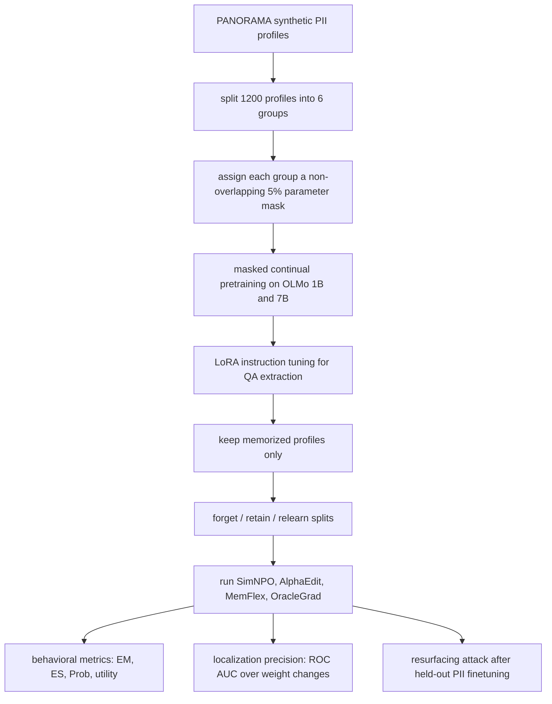

# LACUNA：如果“遗忘”没有改到存储知识的权重，那它可能只是把答案藏起来

### 元信息

| 字段 | 内容 |
| --- | --- |
| 论文 | **LACUNA: A Testbed for Evaluating Localization Precision for LLM Unlearning** |
| 作者 | Matteo Boglioni、Thibault Rousset、Siva Reddy、Marius Mosbach、Verna Dankers |
| 时间 | arXiv v1，2026-07-02 17:59:52 UTC |
| 链接 | <https://arxiv.org/abs/2607.02513> |
| 代码 | <https://github.com/McGill-NLP/LACUNA> |
| 数据与模型 | <https://huggingface.co/collections/McGill-NLP/lacuna> |
| 主题 | LLM unlearning、参数级定位、PII 记忆、resurfacing attack、后训练安全评估 |

### TL;DR

- **LACUNA 要回答的问题**：现有 LLM unlearning benchmark 多数只看输出是否不再泄露敏感信息；但模型可能只是把答案压住，并没有真正改到存储这段知识的参数。
- **核心做法**：作者把 PANORAMA 合成 PII 注入 OLMo 系列 1B 与 7B 模型的预先指定参数里；每组 profile 只允许更新一个不重叠的 5% 参数 mask，因此“哪批权重负责哪批 PII”有 ground truth。
- **评估对象**：论文比较 SimNPO、AlphaEdit、MemFlex，以及一个带 oracle mask 的 OracleGrad；既看 forget/retain/utility，也看 unlearning 后的权重改动能否区分 in-mask 与 out-of-mask 参数。
- **关键数字**：在 1B email address 设置中，SimNPO 的输出层效果接近 oracle，但 localization AUC 只有约 **0.515**；OracleGrad 的 AUC 约 **0.915**。1B 全字段表里，AlphaEdit 与 MemFlex 基本在 **0.500** 附近，接近随机。
- **实验结论**：强输出层遗忘不等于参数层擦除；当 unlearning 没有精准命中被注入知识的权重时，后续对 held-out PII 的微调仍可能让 forget set 信息 resurfacing。
- **可复现资源**：GitHub evaluation release 提供 pretrained PII-injected OLMo 模型、mask、forget/retain/relearn 数据、GradientAscent 示例与 precision_metrics；Hugging Face collection 包含 1B/7B 模型和数据集。
- **局限**：PII 是合成数据，ground truth 来自人为 masked continual pretraining，不等同于自然预训练中知识自发存储的位置；resurfacing attack 也相对直接，作者没有证明所有真实攻击都会遵循同样结论。

### 这篇论文真正重新定义了什么问题？

- 常见 unlearning 评估问的是：
  - 输入忘记提示时，模型还会不会说出原答案？
  - retain set 上是否保持能力？
  - MMLU、ARC、HellaSwag 这类通用能力是否下降？

- LACUNA 把问题改写成更硬的一层：
  - 忘记算法到底改到了“储存这条 PII 的权重”吗？
  - 如果没有改到，输出上看似遗忘是否只是行为抑制？
  - 被抑制的知识能否通过再训练、提示扰动或新数据重新浮出？

- 这个改写很关键，因为机器学习里的“删除”经常有两个含义：

| 层级 | 常见判据 | LACUNA 关心的风险 |
| --- | --- | --- |
| 输出层 | 模型不再回答某个 PII | 可能只是拒答、低概率化或格式错位 |
| 行为层 | paraphrase 后也不泄露 | 仍可能保留参数里的可恢复痕迹 |
| 参数层 | 相关权重被精准反向修改 | 需要知道知识位置，但自然模型里通常没有 ground truth |
| 攻击层 | 再训练后仍不 resurfacing | 才更接近“擦除”而非“遮蔽” |

LACUNA 的贡献不在于提出一个更强 unlearning 算法，而在于造了一个能检查“算法有没有打到正确权重”的实验场。

### 论文主张与论证路线

| Claim | Mechanism | Evidence | Boundary |
| --- | --- | --- | --- |
| 输出层 benchmark 不足以证明知识擦除 | 合成 PII 被注入到指定参数 mask，形成定位 ground truth | 对比 forget/retain/utility 与 localization AUC | 自然训练知识位置未必像 mask 那样干净 |
| 当前 SOTA 方法即使输出表现好，也可能定位很差 | 对每个权重计算 unlearning 改变量，再用 ROC AUC 区分 mask 内外 | SimNPO 在 1B email 上 AUC 约 0.515；AlphaEdit/MemFlex 多数约 0.500 | AUC 是最有利 scoring family 的最大值，仍依赖评分设计 |
| 精准定位会让简单方法也更稳 | OracleGrad 只在 ground-truth forget mask 内做 Gradient Difference | OracleGrad AUC 约 0.91，并在 resurfacing 中最稳 | OracleGrad 不是可部署方法，因为真实场景没有 oracle mask |
| resurfacing 是区分擦除与遮蔽的重要压力测试 | 对 unlearned model 用 held-out PII 再微调，再测 forget set 泄露人数 | MemFlex/AlphaEdit 更容易恢复大量 forget profiles；SimNPO 更稳但仍可恢复部分 | 攻击相对直接，7B 更稳的原因作者也没有强下结论 |

### LACUNA 如何构造“可定位的遗忘任务”？

论文的构造分成三段：先注入，再遗忘，最后检查有没有命中正确权重。



关键细节不是“合成 PII”本身，而是 **mask 与 profile group 的绑定**：

- 作者从 PANORAMA 的 9,674 个合成 profile 中抽取 **1,200** 个作为要注入的 PII。
- PII 字段聚焦在四类：
  - email address；
  - birth city；
  - phone number；
  - driver's license。
- 每个 profile group 有独立的二进制 mask：
  - 六组 profile；
  - 六个不重叠 mask；
  - 每个 mask 覆盖总参数的 **5%**；
  - mask 只覆盖 attention 与 feedforward 参数；
  - normalization layers 与 embedding matrices 不进入 mask。
- 注入时，如果样本属于 PANORAMA 或 QA 数据，就只更新对应 group 的 mask；普通预训练语料仍可更新全部权重。

这个设计让作者能在 unlearning 后问一个自然 benchmark 问不到的问题：

> 如果要忘记 group A 的 email，算法修改的权重是否集中在 group A 的 forget mask，而不是到处乱改？

### 数据和训练设置：为什么不是只做一个 toy benchmark？

论文试图避免“可定位但太假”的实验。它的构造用了较重的训练和可复现资源：

| 组件 | 设定 |
| --- | --- |
| 基础语料 | OLMo-2 Pretraining Corpus 的 4.3B token 子集 |
| PII 语料 | PANORAMA 合成 PII，总计约 1.4B token |
| QA 语料 | 从合成 profile 生成 QA pairs，约 2B token |
| 模型 | OLMo-2 1B 与 OLMo-3 7B |
| 指令调优 | 留出 150 个 PII profiles，每字段 10 个问题，约 300K token |
| LoRA 设置 | 只训练最后两层；1B 对应 [14, 15]，7B 对应 [30, 31] |
| 模型能力检查 | Hellaswag、MMLU、ARC-Easy、ARC-Challenge |

作者强调自己的目标不是训练 SOTA 模型，而是让模型：

- 能稳定记住被注入的合成 PII；
- 在通用 benchmark 上不要大幅退化；
- 让每条待忘记知识有可检查的参数位置。

其中一个边界很重要：mask coverage 不是越小越好。附录里说，1% 和 2% coverage 无法让 1B/7B 模型可靠记住注入 PII，只有 **5%** 才足以构造可用的 unlearning target。这说明 LACUNA 的 ground truth 是工程上调出来的折中：

- mask 太大：定位任务变容易，ground truth 粗；
- mask 太小：模型记不住，后续无从评估遗忘；
- 5% 是本文实验里能同时维持记忆与定位的最低可用点。

### 遗忘方法：为什么 OracleGrad 很重要？

论文评估三类方法。

| 方法 | 类型 | 它在论文里的角色 |
| --- | --- | --- |
| SimNPO | gradient-based unlearning | 当前较强 SOTA，输出层遗忘效果好 |
| AlphaEdit | localization-based editing | 借用 ROME/MEMIT 系路线，改 FFN 输出投影 |
| MemFlex | gradient localization + constrained update | 先找 unlearn/retain 梯度差异模块，再限制更新 |
| OracleGrad | oracle baseline | 知道 ground-truth forget mask，只在正确权重上做 Gradient Difference |

OracleGrad 不应该被理解成“论文提出了一个可直接部署的新算法”。它更像一个上界实验：

- 如果你真的知道知识在哪里；
- 如果你只允许 unlearning 改那部分权重；
- 那么一个简单的 Gradient Difference 是否就能比复杂方法更稳？

论文给出的答案是：很大程度上可以。这是整篇文章最有信息量的地方，因为它把“unlearning 算法不够强”和“知识定位不够准”拆开了。

### 公式：LACUNA 的定位指标到底在算什么？

论文把每个 scalar parameter 当成一个二分类样本。

设：

```text
theta_pre  = 注入 PII 前的权重
theta_inj  = masked continual pretraining 后的权重
theta_unl  = unlearning 后的权重
M_i        = 第 i 个参数是否在 ground-truth mask 内
```

两个关键改变量是：

```text
Delta_inj,i = theta_inj,i - theta_pre,i
Delta_unl,i = theta_unl,i - theta_inj,i
```

一个精准遗忘方法应该满足：

```text
if M_i == 1:
    |Delta_unl,i| 应该较大，并且最好朝抵消 Delta_inj,i 的方向
else:
    |Delta_unl,i| 应该接近 0，避免无关权重被扰动
```

作者没有只用一种 score，而是给每个方法更有利的机会：

| Scoring family | 直觉 |
| --- | --- |
| Magnitude-based | 看 unlearning 后每个权重改了多少 |
| Reversal-based | 看 unlearning 是否反向抵消注入时的权重变化 |
| Contrast-based | 和 unmasked control 对照，排除普通优化噪声 |
| Composite | 用 5-fold cross-val logistic regression 合并 per-weight features |

最终 localization precision 用 ROC AUC 表示：

```text
AUC = P(score(in-mask weight) > score(out-of-mask weight))
```

解释区间非常直接：

| AUC | 含义 |
| --- | --- |
| 1.0 | 完美定位 |
| 0.5 | 和随机区分差不多 |
| < 0.5 | 更像是在改 mask 外权重 |

这也是为什么 SimNPO 的结果刺眼：它能把输出压下去，但 AUC 只有约 0.51，意味着权重改动几乎不能把真实存储位置和其他位置区分开。

### 输出层指标：先承认 SimNPO 真的强

论文没有简单否定现有方法。相反，它先承认 SimNPO 在标准行为指标上很强。

三类输出指标是：

| 指标 | 作用 |
| --- | --- |
| Exact Memorization, EM | 逐 token 看模型输出是否匹配 ground truth |
| Extraction Strength, ES | 看需要多短 prefix 才能重建剩余敏感信息 |
| Probability, Prob | 直接衡量模型对目标答案的概率 |

在 1B email address 任务里：

- AlphaEdit forget EM 仍高达 **63.2**；
- MemFlex 降到 **36.8**；
- SimNPO 降到 **17.7**；
- OracleGrad 降到 **1.6**。

这说明 SimNPO 不是无效方法。它确实让模型更少输出 forget set 信息。但 LACUNA 的问题是：它是“擦掉了参数中的知识”，还是“让模型暂时不说出来”？

### 参数层结果：输出好，不代表定位好

主表里最关键的一行是 Precision AUC。

| 模型/字段 | AlphaEdit AUC(F) | MemFlex AUC(F) | OracleGrad AUC(F) | SimNPO AUC(F) |
| --- | ---: | ---: | ---: | ---: |
| 1B Email | 0.500 | 0.500 | 0.915 | 0.515 |
| 1B Phone | 0.500 | 0.500 | 0.914 | 0.515 |
| 1B Birth City | 0.500 | 0.501 | 0.913 | 0.516 |
| 1B Driver's License | 0.500 | 0.500 | 0.914 | 0.516 |
| 7B Email | 0.500 | 0.500 | 0.911 | 0.512 |
| 7B Driver's License | 0.500 | 0.500 | 0.910 | 0.516 |

这个表支撑了论文的主判断：

- AlphaEdit 与 MemFlex 的 localization precision 基本是随机；
- SimNPO 稍高，但也只是 0.51 左右；
- OracleGrad 稳定在 0.91 左右，说明这个 benchmark 并不是无法被分辨；
- 真正困难的是：现实方法并没有自然学会“只改知识所在的权重”。

对后训练安全来说，这个结果很有警示性。很多 alignment 或 unlearning 方法优化的是输出分布，一旦目标函数可以通过多种参数路径达到同样输出效果，模型没有理由自动选择“最像真正擦除”的那条路径。

### Resurfacing attack：为什么“没说出来”还不够？

论文用 resurfacing attack 做压力测试：

1. 先对模型做 unlearning；
2. 选 held-out PII 做微调；
3. 再用多种问题尝试 probing forget set；
4. 统计 100 个 forget profiles 中，有多少至少泄露一次；
5. 对每个 profile 最多尝试 200 个 prompting attempts。

这个实验的意义是：

- 如果知识只是被输出层目标压住；
- 那么后续再训练可能重新打开相关通道；
- 如果知识所在权重真的被精准改掉；
- resurfacing 应该更困难。

论文观察到：

- AlphaEdit 与 MemFlex 对 resurfacing 更脆弱，forget set 中较大部分可以被恢复；
- SimNPO 更稳，但仍可能恢复一部分；
- OracleGrad 泄露最少；
- 7B 整体比 1B 更不容易 resurfacing，但作者没有把这解释成确定的规模规律，因为也可能是攻击在 7B 上不够强。

这部分不是证明“OracleGrad 解决了 unlearning”，而是支撑更窄的判断：

> localization precision 与抗 resurfacing 之间存在实证联系；只看 output-level forget score 会漏掉这层风险。

### Figure/Table 证据逐项解读

| 图表 | 支撑什么 | 不能证明什么 |
| --- | --- | --- |
| Figure 1 pipeline | LACUNA 的三阶段：注入、遗忘、定位评估 | 不证明自然模型知识本来就按这种 mask 存储 |
| Figure 2 data structure | 1,200 profiles、6 groups、forget/retain/relearn 组织方式 | 不说明合成 PII 与真实 PII 分布完全一致 |
| Figure 3 performance/memorization | masked training 后通用能力大体保留，且 PII 可被抽取 | 不证明模型能力无损；ARC-Easy 等仍有波动 |
| Figure 4 unlearning email | SimNPO 输出层强，OracleGrad 兼顾 forget/retain/utility | 只展示主文 1B email，其他字段在附录 |
| Figure 5 resurfacing email | 定位更准的方法更抗恢复，AlphaEdit/MemFlex 更脆弱 | 攻击简单，不能覆盖所有真实 adversary |
| Table 1/2 master results | 跨 1B/7B 与四类 PII 汇总输出、utility、AUC | 不等于所有模型、所有隐私数据、所有 unlearning 方法都同样失败 |

### 可复现性：代码 release 到底给了什么？

GitHub README 明确说当前 `main` 是 evaluation release，而完整研究 pipeline 在 `lacuna-develop`。这意味着用户可以更容易复现评估流程，而不是从头复现 PII 注入训练。

evaluation release 的典型流程是：

```text
Input:
  pretrained PII-injected OLMo model
  ground-truth mask.pt
  forget / retain / relearn datasets
  custom unlearning method

Procedure:
  1. unlearn.py runs the method
  2. eval.py computes forget / retain behavior
  3. lm_eval_utility.py checks ARC / HellaSwag / MMLU
  4. precision_metrics.py compares weight changes with mask
  5. relearn.py and extraction_leakage.py test resurfacing

Output:
  Panorama_SUMMARY.json
  lm_eval.json
  precision metrics and ROC data
  extraction_leakage.json
```

Hugging Face collection 也给出实际体量信号：

- `LACUNA-OLMo2-1B-seed42`；
- `LACUNA-OLMo3-7B-seed42`；
- 1B 数据集约 **12.6k rows**；
- 7B 数据集约 **89.3k rows**；
- README 标注 1B artifact 约 **18GB**，7B artifact 约 **73GB**。

这些资源降低了“只读论文无法复查”的风险。不过它也意味着复现实验仍有硬件门槛：

- Python 3.10；
- CUDA 12.6；
- Ampere+ GPU；
- A100 recommended；
- 大容量本地磁盘。

### 与已有 unlearning benchmark 的位置关系

LACUNA 并不是替代 TOFU、OpenUnlearning 或行为层 privacy benchmark，而是补上一块缺口。

| Benchmark 类型 | 主要问题 | LACUNA 补充点 |
| --- | --- | --- |
| 行为遗忘 benchmark | 模型还会不会输出目标知识 | 进一步看参数改动是否命中真实存储位置 |
| 隐私泄露 benchmark | PII 是否能被抽取 | 追问泄露降低是否来自真正擦除 |
| utility benchmark | unlearning 是否伤害通用能力 | 同时检查“少伤能力”和“少乱改权重” |
| 知识定位/编辑研究 | 哪些层或模块影响某事实 | 用人为 mask 提供可验证 ground truth |

最值得注意的是，LACUNA 对 localize-first 方法并不宽容。按直觉，AlphaEdit、MemFlex 这种带定位思想的方法应该更容易在 localization AUC 上赢过 SimNPO；结果却基本接近随机。作者在附录里还提到，AlphaEdit 在相同 QA 格式下难以选择性区分 forget 与 retain，因为 activation subspaces 重叠明显。这说明“定位模块”与“定位具体被注入知识的权重”不是一回事。

### 为什么 cross-field forget/retain 设计很重要？

LACUNA 的 forget 与 retain 不是随便切分。作者采用 cross-field scheme：忘记集和保留集针对不同 PII 字段。这个设计看起来只是数据工程细节，其实会影响整篇论文的可解释性。

- 如果 forget 与 retain 都是同一种字段，例如都问 email：
  - 模型看到的是非常相似的 QA 格式；
  - unlearning 方法很难只压低某些人名对应的 email；
  - 它可能学到“email 问答整体都应该降低概率”。

- 如果 forget 与 retain 是不同字段：
  - 目标更接近“忘掉这批 group 的这个字段，同时保留其他 group 的另一个字段”；
  - retain failure 更容易暴露方法是否过度泛化；
  - localization precision 也更容易与 mask 绑定起来解释。

这个选择也带来一个边界：

| 设计收益 | 代价 |
| --- | --- |
| 更清楚地区分 forget 与 retain | 不完全等同于真实用户请求“删除同类 PII 中的一部分” |
| 降低 QA 格式相似造成的评价混淆 | 可能让任务比最困难的同字段遗忘更温和 |
| 便于把 group mask 映射到评价指标 | 依赖人为 profile group 与 mask 设计 |

所以，LACUNA 更像一个受控实验室，而不是自然世界的完整模拟。它牺牲了一部分自然性，换来了可验证性。

### AlphaEdit、MemFlex、SimNPO 的失败不是同一种失败

把三类方法都说成“定位差”会漏掉重要差别。

| 方法 | 行为层表现 | 参数层表现 | 失败形态 |
| --- | --- | --- | --- |
| AlphaEdit | forget EM 经常仍高，retain 也会受伤 | AUC 约随机 | 结构定位和任务语义没有对齐 |
| MemFlex | 某些字段可明显压低泄露 | AUC 仍约随机 | 梯度差异找到了可优化路径，但不是注入路径 |
| SimNPO | 行为层最强，接近 oracle | AUC 只略高于随机 | 输出目标被满足，但权重改动分散 |
| OracleGrad | 行为层强，retain 稳 | AUC 约 0.91 | 依赖真实世界拿不到的 mask |

这说明 LACUNA 的结果不是“某个算法调参不佳”这么简单。它提出的是一个评估原则：

- 一个方法可以在输出层失败，也在参数层失败；
- 也可以在输出层成功，但在参数层失败；
- 真正稀缺的是“输出层成功、参数层命中、resurfacing 后仍稳”的组合。

从后训练角度看，SimNPO 是最值得细读的失败案例。它的目标函数会根据模型对 forget sample 的当前置信度自调节：还记得时梯度更强，已经忘了时梯度减弱。这是一个合理的行为目标。但它没有约束“通过哪组权重实现忘记”。优化器可以选择很多低损失路径，其中大部分未必是“反向擦除存储知识的参数”。

### 一个更直观的伪代码版本

LACUNA 的评估可以写成下面的伪代码：

```text
Input:
  pretrained model theta_pre
  synthetic PII profiles P
  non-overlapping masks M_1 ... M_6
  unlearning method U

Injection:
  for sample in training_stream:
      if sample belongs to profile group g:
          update theta only through mask M_g
      else:
          update all normal trainable weights
  get theta_inj

Instruction tuning:
  train QA adapter on held-out PII profiles
  keep profiles that can actually be extracted

Unlearning:
  choose forget groups and retain groups
  theta_unl = U(theta_inj, forget_set, retain_set)

Behavior evaluation:
  compute EM, ES, Prob on forget and retain
  compute ARC, HellaSwag, MMLU utility deltas

Localization evaluation:
  for each scalar parameter i:
      y_i = 1 if i in forget mask else 0
      s_i = score(theta_pre_i, theta_inj_i, theta_unl_i)
  report ROC_AUC(s, y)

Resurfacing:
  finetune theta_unl on held-out PII
  probe forgotten profiles with many questions
  count how many profiles leak at least once
```

这段伪代码把论文的关键判断压缩成一句话：**unlearning 后的权重改变量本身就是证据**。如果权重变化无法区分 mask 内外，那么无论输出层短期表现多好，都很难声称知识已经被参数级擦除。

### 为什么 AUC 只到 0.515 仍然值得重视？

0.515 看起来比 0.500 略高，似乎不是完全没有信号。但论文里这个数反而更有警示意义。

- 作者不是用一个很苛刻的 score 去卡方法；
- 它允许 magnitude、reversal、contrast、composite 多类 score；
- 每个 field/method pair 报告的是可用 scoring family 中最好的 AUC；
- composite 还用 logistic regression 合并多个 per-weight features；
- 即便这样，SimNPO 也只到约 0.51。

因此，这个结果不能简单解释成“评分函数没设计好”。更合理的读法是：

| 观察 | 含义 |
| --- | --- |
| SimNPO AUC 略高于随机 | 梯度优化可能确实触碰到少量相关参数 |
| AUC 远低于 OracleGrad | 触碰相关参数不是主要更新模式 |
| output forget 分数很强 | 行为目标有多条实现路径 |
| resurfacing 仍能恢复部分样本 | 未命中路径可能留下可恢复痕迹 |

这也是 LACUNA 对“后训练即安全修复”的提醒：即使 loss 曲线和行为指标好看，也可能只是把概率质量挪到别处，而不是把底层表征中的敏感内容移除。

### 1B 与 7B 的差异应该怎么读？

论文里 7B 结果有两个容易误读的点。

第一，7B 在一些 forget EM 上更低，但这不等于 7B 更容易被可靠 unlearn。

- 7B 的参数量更大；
- PII 注入和抽取行为可能不同；
- resurfacing attack 在 7B 上未必同样强；
- 作者也谨慎表示，不应强行把 7B 更少 resurfacing 解释成确定的规模规律。

第二，SimNPO 在 7B 上的 utility 代价更明显。

| 例子 | 观察 |
| --- | --- |
| 7B Email SimNPO | ARC-C 与 ARC-E delta 都到 -20 左右，MMLU delta 约 -28.8 |
| 7B Phone SimNPO | MMLU delta 约 -30.8 |
| OracleGrad | 多数 utility delta 更温和 |

这个对比支持一个更细的判断：如果 unlearning 不能精准命中局部权重，它可能需要更全局的分布扰动来压低 forget 输出；这种全局扰动就更容易反映到 utility 上。OracleGrad 虽然不可部署，但它展示了“精准局部修改”在原则上可以降低这种代价。

### 为什么这篇文章属于 AI 安全和后训练交叉？

LACUNA 同时踩在两个方向上。

- 从 **AI 安全** 看：
  - 它研究 PII 泄露、隐私删除、攻击后恢复；
  - 它把 resurfacing 当成安全验收；
  - 它要求删除请求不能只通过输出拒答来糊弄。

- 从 **后训练** 看：
  - SimNPO、NPO、Gradient Difference 都是典型后训练/偏好优化语境；
  - 论文讨论的是训练后修改已有模型，而不是从头训练；
  - 它追问后训练目标函数是否会产生正确的参数层因果效果。

- 从 **评估方法学** 看：
  - 它把 benchmark 从 input-output 扩展到 parameter-delta；
  - 它让“安全修复是否真的发生”变成可度量问题；
  - 它提示未来评估需要同时覆盖行为、权重和攻击三层。

这也是我选择它而不是更近似 coding-agent safety 题材的原因：近期 Daily Report 已经连续覆盖 Agent 安全、技能供应链、coding-agent 边界和 persistent-state 攻击；LACUNA 与这些主题距离更远，同时仍在本周窗口内，且有完整论文、代码和模型数据 release。

### 失败案例与边界条件

这篇论文最有价值的地方之一，是它没有把所有失败都包装成统一结论。

- **AlphaEdit 的失败**：
  - forget 与 retain 数据共享相似 QA 格式；
  - 激活子空间重叠；
  - 更激进参数会同时伤害 forget 与 retain；
  - 因而输出层和定位层都不理想。

- **MemFlex 的失败**：
  - 输出层有时能降低泄露；
  - 但权重改动仍不能区分 in-mask 与 out-of-mask；
  - resurfacing 中也较脆弱。

- **SimNPO 的失败**：
  - 行为层很强；
  - utility 有一定代价，尤其 7B 表中 MMLU delta 可明显下降；
  - localization AUC 仍接近随机；
  - resurfacing 不是完全免疫。

- **OracleGrad 的边界**：
  - 它证明“如果知道正确 mask，简单梯度法也很强”；
  - 但真实部署中没有 oracle mask；
  - 因此它是诊断上界，不是工程解决方案。

### 研究者视角：这对后训练安全意味着什么？

LACUNA 对后训练安全有三个直接启发。

第一，**行为对齐和参数擦除应分开验收**。

- RLHF、DPO、NPO、SimNPO 这类目标可以改变输出分布；
- 但输出分布改变不自动等价于知识被删除；
- 在隐私、版权、安全策略撤回等场景，验收指标不能只停在“模型不说了”。

第二，**unlearning benchmark 需要攻击后验收**。

- 如果 unlearning 后轻微再训练就恢复 forget set；
- 那么这个方法更像临时压制；
- resurfacing、relearning、membership inference、paraphrase probing 应该成为组合评估。

第三，**定位本身可能是下一代 unlearning 的核心瓶颈**。

- LACUNA 显示目标函数足以制造输出遗忘；
- 但不足以让权重改动落在正确区域；
- 未来方法可能需要把 attribution、causal tracing、sparse editing、mask learning、Fisher/gradient saliency 与攻击鲁棒性放在同一个闭环里评估。

### 继续追问

- 如果 PII 不是 masked continual pretraining 注入，而是自然预训练语料中反复出现，是否还能构造近似 ground truth？
- 如果同一条知识被多路径冗余存储，localization AUC 应该以单一 mask、多个 mask，还是因果可替代路径来定义？
- 如果 unlearning 的目标是危险能力、版权风格或身份偏好，而不是 PII 字符串，参数级“存储位置”是否仍有清晰语义？
- 如果 resurfacing attack 更强，例如混合多任务后训练、RAG 引导、chain-of-thought elicitation 或 adversarial finetuning，SimNPO 与 OracleGrad 的差距会扩大还是缩小？
- 如果未来后训练系统要支持用户级删除请求，是否需要像 LACUNA 一样在训练期预留可定位、可撤销的数据路径？

### 对真实系统的谨慎外推

把 LACUNA 直接搬到生产系统会遇到几类问题。

| 问题 | 为什么困难 |
| --- | --- |
| 用户数据没有训练期 mask | 真实模型通常不知道某条数据被写进了哪些参数 |
| 知识可能多处冗余 | 一个事实可能分布在词表、层、注意力路径和上下文联想中 |
| 删除请求粒度复杂 | 用户可能要求删除身份、事件、风格、偏好或版权内容 |
| 安全目标会相互冲突 | 删除 PII 不能破坏正常回答，也不能引入新的拒答偏差 |
| 攻击者会适应评估 | resurfacing 可以比论文里的 held-out PII 微调更复杂 |

但它仍然给了生产系统一个可执行的方向：

- 训练期记录数据 lineage；
- 对敏感数据建立可撤销路径或稀疏 adapter；
- 在删除后同时做行为测试、权重差分测试和再训练恢复测试；
- 把“模型拒绝回答”与“模型内部已不可恢复”分开报告；
- 对高风险删除请求保留审计日志，而不是只返回删除成功。

这类外推不能直接从论文实验推出，但它是 LACUNA 的机制性启发：如果未来模型要承诺可验证删除，那么训练管线从一开始就需要为定位和撤销留接口。

### 结论

LACUNA 的核心价值是把 LLM unlearning 从“输出是否忘了”推进到“参数是否真的被改到”。它用人为可控的 PII 注入和 ground-truth mask，证明现有方法存在一个容易被忽略的断层：SimNPO 这样的强方法能在行为指标上接近 oracle，却在 localization AUC 上仍接近随机；而带 oracle mask 的简单 Gradient Difference 反而更抗 resurfacing。

这不是说 LACUNA 已经解决真实世界的遗忘问题。它的 PII 是合成的，mask 是人为设计的，攻击也是有限的。但它给了研究社区一个更清晰的验收语言：如果 unlearning 只改变输出而没有命中存储知识的权重，那么所谓“删除”可能只是暂时的沉默。
