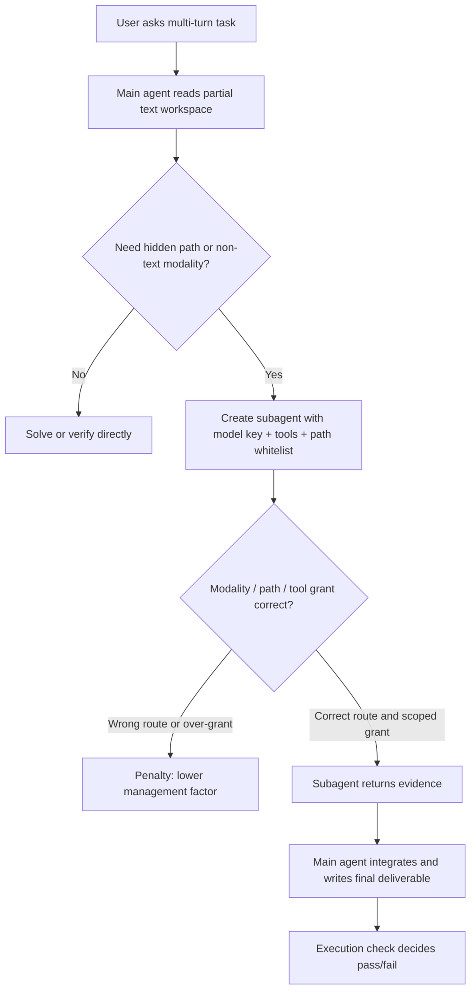

# ClawArena-Team：把 Agent 从“会做题”推进到“会管理队伍”

## 元信息与 TL;DR

| 项目 | 内容 |
|---|---|
| 论文 | ClawArena-Team: Benchmarking Subagent Orchestration and Dynamic Workflows in Language-Model Agents |
| 作者 | Kaiwen Xiong, Haonian Ji, Shi Qiu, Zeyu Zheng, Cihang Xie, Xinyu Ye, Huaxiu Yao |
| 链接 | https://arxiv.org/abs/2606.31174 |
| 提交时间 | 2026-06-30 06:06:08 UTC |
| 类型 | 大模型 Agent 评测论文 |
| 关键词 | subagent orchestration, dynamic workflow, least privilege, modality routing, execution-based scoring |

### TL;DR

- **这篇论文研究的不是“单个 Agent 能不能答题”，而是“一个主模型能不能像经理一样创建、授权、调度并整合子 Agent”。**
- **ClawArena-Team 构造了 41 个多轮、多模态、多目录场景**，总计 258 个 evaluation rounds，其中 44 轮前有 staged updates，更新组共 72 个，迫使主 Agent 持续修正答案。
- **核心控制变量是固定子 Agent 池**：所有被测主模型都只能指挥同一组本地服务的 `llm`、`vlm`、`omni` 子 Agent，因此分数差异主要来自管理能力，而不是 worker 本身更强。
- **评分不用 LLM judge**：每轮由 shell command、输出匹配或可执行检查判定是否通过；综合指标 `SMS` 把任务正确率乘上工具权限、只读合规、工作区授权和模态路由四项管理因子。
- **主结果显示，当前模型最弱的是授权精度，不是感知路由**：11 个“可用”模型的 ROC 和 MCA 基本超过 92%，但没有任何模型的 workspace-permission precision 超过 50%。
- **成本和管理质量明显脱钩**：单次完整 run 的 API cost 从约 0.8 美元到 92.8 美元，跨度超过 100 倍；SMS 只差不到 4 倍，且若干便宜开放模型处在 Pareto frontier。
- **排行榜分数看起来接近，但行为差异很大**：中间 10 个模型的 SMS 只落在 43.9% 到 53.8% 的 9.9 分区间；但 forbidden-access rate、workflow 调用、background scheduling 等行为相差超过一个数量级。
- **局限也很明确**：数据是合成的，子 Agent 池固定，结论绑定于这组 worker 能力；代码和数据在论文页标注为将发布，当前复现还不能只靠公开仓库完成。

## 研究问题：为什么“Agent 管理能力”需要单独评测？

### 论文真正切开的缝隙是什么？

- 过去的 Agent benchmark 多半问：
  - 单个模型能不能解题？
  - 一个固定多 Agent 系统能不能协作？
  - 工具调用有没有越权？
  - 多模态任务能不能被正确感知？

- ClawArena-Team 追问的是另一件事：
  - 主模型是否知道什么时候该创建子 Agent？
  - 它是否能把图像、音频、文本任务交给正确 worker？
  - 它是否能只给 worker 必需的工具和路径？
  - 它是否能并发调度、复用 session、写动态 workflow？
  - 它是否能把多个 worker 的返回整合成最终可执行结果？

### 为什么这不是普通多 Agent benchmark？

| 评测对象 | 典型问题 | ClawArena-Team 的区别 |
|---|---|---|
| 单 Agent benchmark | 模型自己会不会推理、查文件、用工具 | 主模型被限制为 text-only，且只能访问部分 workspace，必须委托 |
| 固定多 Agent 系统 | 预设角色和通信拓扑能否完成任务 | 被测对象是单个主模型的管理策略，不是整体系统设计 |
| 路由 benchmark | 查询该发给哪个模型或工具 | 还要求授权、调度、整合、跨轮更新和执行检查 |
| 权限框架 | 外部系统如何限制工具越权 | 直接测主模型自己会不会授予 least privilege |

### 这篇论文的 claim → mechanism → evidence → boundary

| 层次 | 论文内容 |
|---|---|
| Claim | 生产环境中的 Agent 越来越像 manager，而现有评测没有隔离测量这种管理能力。 |
| Mechanism | 固定 worker 池，限制主 Agent 直接感知和访问，要求它创建、授权、调度、整合子 Agent。 |
| Evidence | 41 个场景、258 轮、12 个主模型；SMS、TCR、TPP、ROC、WPP、MCA 和行为日志共同分析。 |
| Boundary | 合成任务和固定 worker 池保证可控，但也限制外推；更强 worker 或真实企业 workspace 可能改变难点分布。 |

## 方法机制：把主模型建模成 principal，把子 Agent 建模成 worker

### Capability surface：六个管理动作

| 管理动作 | 主 Agent 要做什么 | 如果做不好会怎样 |
|---|---|---|
| Creation | 创建子 Agent，指定 system prompt、model key、工具集和路径白名单 | 子 Agent 不适配任务，或拿到过宽上下文 |
| Modality routing | 图像/视频交给 `vlm`，音频交给 `omni`，纯文本交给 `llm` | 主 Agent 被文本 decoy 误导，或让错误 worker 处理模态 |
| Least-privilege empowerment | 只授予必要工具和必要文件路径 | blast radius 扩大，context 膨胀，安全和成本都变差 |
| Scheduling | 决定 foreground/background、新 session/continued session、并发顺序 | 复杂任务退化成慢速串行，或跨轮状态丢失 |
| Dynamic workflows | 用 workflow DSL 写 parallel/pipeline 编排 | 只能临时手工 fan-out，无法复用稳定流程 |
| Integration | 融合多个 worker 的返回，产出可执行答案 | worker 局部正确，但最终 deliverable 错误 |

### 固定 worker 池为什么重要？

论文的关键控制设计是：

- 主模型会变：
  - `claude-fable-5`
  - `gemini-3.5-flash`
  - `gpt-5.5`
  - `glm-5.2`
  - `deepseek-v4-pro`
  - 以及其他 proprietary/open/self-hosted models

- 子 Agent 池不变：
  - `llm`: `gemma-4-31b-it`，文本能力
  - `vlm`: `gemma-4-31b-it`，文本、图像、视频
  - `omni`: `gemma-4-e4b-it`，文本、图像、音频、视频

- 这样可解释性更强：
  - 如果 A 主模型比 B 主模型分数高，不是因为 A 拥有更强 worker；
  - 它更可能来自更好的委托、授权、调度和整合策略。

### 为什么必须让主 Agent “看不全”？

如果主 Agent 自己能直接读全部文件、图像、音频和视频，评测就会退化成单模型能力测试。

ClawArena-Team 故意设置：

- 主 Agent 原生只感知文本。
- 主 Agent 只能直接访问 workspace 的一部分。
- Workspace 至少有 8 个顶层目录，包含 decoys。
- 非文本模态中有表格、表单、图、医学 ROI、音频、视频和屏幕录制。
- 文本旁边可能放一个“看似合理但错误”的 transcript 或 caption。

这使得主 Agent 不能靠偷懒完成任务：



## 数据构造：41 个场景如何逼出真正的管理失败？

### Benchmark 规模

| 组成 | 数字 | 解释 |
|---|---:|---|
| 场景数 | 41 | 覆盖 law, medicine, engineering, business, science |
| Evaluation rounds | 258 | 每轮都是一次完整交互和执行检查 |
| 有 staged update 的轮数 | 44 | 占 17.1%，要求更新后重新判断 |
| Update groups | 72 | 新增或替换 workspace 文件 |
| Update files | 255 | 平均每组约 3.54 个文件 |
| Workspace 体量 | 170.5 MiB | 大到不能靠全文塞上下文解决 |
| Token 体量 | 28.9M | 其中 workspace 约 71.9%，updates 约 27.9% |

### 十个硬约束 C1-C10

| ID | 约束 | 它在测什么 |
|---|---|---|
| C1 | Unreadable regions | 主 Agent 必须委托和总结，而不是直接读完 |
| C2 | Substantive staged updates | 后续答案要修正，不是只追加记忆 |
| C3 | Full tool surface used | 需要编辑、shell 验证，不只是 read-only |
| C4 | 至少 8 个目录且含 decoys | 路径授权是否克制 |
| C5 | Non-text modality rounds | 必须把图像/音频/视频交给正确 worker |
| C6 | Parallel-required tasks | 要并发调度，不是串行慢跑 |
| C7 | Session-reuse pairs | 要判断新 session 还是 continued session |
| C8 | Cross-round dependencies | 要维护跨轮状态 |
| C9 | Modality decoys | 要抵抗错误 transcript/caption |
| C10 | Machine-checkable answers | 避免 LLM judge，靠执行验证 |

### 合成数据不是偷懒，而是为了可控 truth

论文没有直接 scrape 真实企业数据，而是程序化合成：

- **Controllable truth**
  - 内容和答案同源生成。
  - Ground truth 能被 reverse verification 检查。

- **License cleanliness**
  - 不把第三方受版权保护资产混入 release。

- **Adversarial control**
  - 可以精确放置“音频真实值 vs transcript 错误值”。
  - 可以精确放置“当前目录有诱饵，真正证据在受限路径”。

- **Distribution control**
  - 可控制文件格式、模态比例、任务领域和 difficulty vector。

### 构造流程：它自己也是一次 subagent management

论文的构造 pipeline 很有意思，因为它反过来使用了被评测的能力：

```text
Input:
  scenario spec, C1-C10 constraints, modality budget, check policy

State:
  scenario contract
  generated workspace
  staged updates
  ground-truth checks
  perturbation checks

Loop:
  1. Controller locks per-scenario contract
  2. Parallel authors synthesize text, images, audio, video, documents
  3. Static gates validate schema, budgets, whitelist, generated assets
  4. Golden answer must pass every execution check
  5. Perturbed wrong answers must fail targeted checks
  6. Baseline harness runs fixed worker pool
  7. Failures are triaged:
       - true-difficulty: keep
       - false-kill: repair check and rerun

Output:
  scenario with calibrated difficulty and machine-checkable truth
```

这个 flywheel 避免了两类常见 benchmark 问题：

- 检查太松：
  - 错误答案也通过。
  - 模型靠格式投机得分。

- 检查太紧：
  - 合理等价答案被拒。
  - 任务变成“猜 regex”。

## 评分：SMS 为什么是“正确率 × 管理折扣”？

### 五个基础指标

| 指标 | 全称 | 测量含义 |
|---|---|---|
| TCR | Task Completion Rate | 用户问题通过执行检查的平均比例 |
| TPP | Tool-Permission Precision | 子 Agent 被授予的工具中，实际用到的比例 |
| ROC | Read-Only Compliance | read-only 子 Agent 是否没有拿到 mutating tool |
| WPP | Workspace-Permission Precision | 子 Agent 实际访问文件 / 被授予文件 |
| MCA | Modality-Choice Accuracy | `vlm` 是否真的处理图像/视频，`omni` 是否真的处理音频 |

### SMS 公式

```text
SMS = TCR * (TPP + ROC + WPP + MCA) / 4
```

变量解释：

- `TCR` 是任务完成率。
- `TPP` 惩罚“给了很多工具但没用”的过宽授权。
- `ROC` 惩罚 read-only worker 被授予写工具。
- `WPP` 惩罚“给了很多路径但只读很少”的工作区过宽授权。
- `MCA` 惩罚模态路由错误。

这个设计的关键是：

- 管理因子在 `[0, 1]`。
- 所以 `SMS <= TCR`。
- 好管理不能把错误答案变成正确答案。
- 正确答案如果靠粗暴授权和错误路由拿到，也会被折扣。

### 一个简化例子

| 模型 | TCR | TPP | ROC | WPP | MCA | SMS 解释 |
|---|---:|---:|---:|---:|---:|---|
| A | 0.75 | 0.80 | 0.99 | 0.50 | 0.98 | 约 0.61：任务强，授权仍拖后腿 |
| B | 0.65 | 0.70 | 0.96 | 0.40 | 0.96 | 约 0.49：正确率和路径精度都损失 |
| C | 0.75 | 0.20 | 0.80 | 0.10 | 0.60 | 约 0.32：答对不少，但管理很粗糙 |

研究者读这条公式时要注意：

- SMS 不是纯能力榜。
- SMS 也不是纯安全榜。
- 它是“可交付正确性”和“管理过程质量”的乘积。

## 实验设置与主结果

### 12 个主模型

| 组别 | 模型 |
|---|---|
| Proprietary | `claude-fable-5`, `gemini-3.5-flash`, `gpt-5.5`, `gpt-5.4`, `gemini-3.1-pro`, `claude-sonnet-4-6` |
| Community-hosted open-weight | `glm-5.2`, `kimi-k2.6`, `deepseek-v4-pro` |
| Self-hosted open models | `qwen3.6-27b`, `gemma-4-31b`, `glm-4.7-flash` |

实验协议固定：

- 同一组 41 scenarios。
- 同一子 Agent 池。
- 同一执行检查。
- 同一组管理指标。
- 单次完整 run 覆盖 258 rounds。

### Leaderboard 的关键数字

| 模型 | TCR | TPP | ROC | WPP | MCA | SMS | Cost |
|---|---:|---:|---:|---:|---:|---:|---:|
| claude-fable-5 | 74.4 | 76.4 | 98.8 | 49.2 | 97.9 | 60.0 | 92.8 |
| gemini-3.5-flash | 69.8 | 69.8 | 95.9 | 45.7 | 96.7 | 53.8 | 23.7 |
| gpt-5.5 | 63.6 | 79.9 | 98.7 | 47.5 | 95.2 | 51.0 | 43.3 |
| glm-5.2 | 66.3 | 67.4 | 95.4 | 44.4 | 96.7 | 50.4 | 22.9 |
| gpt-5.4 | 63.2 | 77.3 | 98.8 | 40.8 | 97.6 | 49.7 | 19.5 |
| kimi-k2.6 | 64.3 | 76.8 | 92.0 | 41.9 | 93.9 | 49.0 | 28.7 |
| deepseek-v4-pro | 58.9 | 73.9 | 98.5 | 46.3 | 96.5 | 46.4 | 1.7 |
| gemma-4-31b | 56.6 | 79.0 | 97.7 | 37.9 | 95.5 | 43.9 | 3.5 |
| glm-4.7-flash | 34.5 | 22.4 | 85.8 | 11.7 | 57.2 | 15.3 | 0.8 |

### 结果一：授权精度是瓶颈，不是模态感知

论文最重要的结果不是哪个模型第一，而是瓶颈在哪里：

- ROC 基本很高：
  - 11 个可用模型至少 92%。
  - read-only worker 不给写工具这件事，目标清楚。

- MCA 也基本很高：
  - 11 个可用模型至少 92%。
  - 图像给 vision、音频给 omni 这件事也比较清楚。

- TPP 只有 70%-80% 左右：
  - 说明主 Agent 常给出没用到的工具。

- WPP 从未超过 50%：
  - 说明主 Agent 常给出两倍甚至更多实际不会访问的文件。

可以把这个结果写成一句话：

> 当前模型已经知道“该找谁”，但还不知道“该给多少权限”。

### 结果二：成本不是管理质量的线性代理

| 观察 | 论文证据 | 解释 |
|---|---|---|
| 最贵模型第一 | `claude-fable-5` SMS 60.0，cost 92.8 | 高价 flagship 买到最高分 |
| 第二名更便宜 | `gemini-3.5-flash` SMS 53.8，cost 23.7 | 约四分之一成本换来接近分数 |
| 开源模型在前沿 | `glm-5.2` SMS 50.4，cost 22.9 | 公开权重/社区模型在管理任务上不一定落后 |
| 极低成本仍可用 | `deepseek-v4-pro` SMS 46.4，cost 1.7 | 缓存折扣和管理行为让成本优势明显 |

这说明：

- 子 Agent 管理能力不等价于通用模型价格。
- 部分模型能以较低成本做出足够好的管理决策。
- 如果真实系统的子任务很多，成本-管理曲线比单轮 accuracy 更重要。

### 结果三：分数接近，行为却不接近

中间 10 个模型落在 43.9%-53.8% 的 SMS 区间，看起来差距不大。

但行为日志显示：

- Subagent forbidden-access rate：
  - 能力模型中从 0.48 到 5.78。
  - 最弱模型达到 11.44。

- Dynamic workflow 调用：
  - 从 8 次到 112 次不等。

- Background scheduling：
  - 有些模型频繁使用。
  - 有些几乎只用 foreground new session。

- Session continuation：
  - 有些模型会复用上下文。
  - 有些模型不断新开 worker，造成状态断裂。

这解释了为什么论文不只报 SMS：

- 单一 leaderboard 隐藏了管理风格。
- 两个模型同分，风险画像可能完全不同。
- 安全和工程团队更关心“怎么失败”，不只是“错了多少”。

## 消融式阅读：每个设计在论证中承担什么功能？

### 固定子 Agent 池

| 设计 | 论证作用 |
|---|---|
| 所有主模型使用同一组 worker | 排除 worker 能力差异 |
| worker 本地服务 | 降低 provider 随机差异和成本干扰 |
| worker key 分成 `llm/vlm/omni` | 让模态路由可被计量 |
| 主模型只能创建和授权 | 把管理动作显式化 |

没有这个设计，论文只能说明“某个完整多 Agent 系统好不好”，不能说明“主模型会不会管理”。

### Least privilege 指标

| 指标 | 为什么不是附属项 |
|---|---|
| TPP | 工具越多，出错面越大；工具没用到说明授权不精确 |
| ROC | read-only worker 拿到写工具，属于直接违背角色约束 |
| WPP | 文件路径越宽，泄漏和上下文污染越严重 |
| Forbidden access logs | 能把“分数接近但风险不同”的模型拆开 |

这一组指标把 Agent 安全问题从“外部 guardrail”搬进了模型行为评测。

### Staged updates

Staged updates 的作用不是让任务更长，而是制造真实管理场景中的状态修正压力：

- 早先正确的答案可能被新文件替换。
- 子 Agent 旧报告可能过期。
- 主 Agent 必须知道哪些 deliverables 需要重算。
- Continued session 可能有用，也可能携带 stale belief。

这对应生产系统里的常见失败：

- 代码库变了，但 Agent 继续用旧假设。
- 财务表更新了，但报告未重算。
- 安全事件新增 IOC，但 triage 仍按旧样本下结论。

### Execution-based scoring

不用 LLM judge 的好处：

- 避免 judge drift。
- 避免“看起来合理”的答案被主观放过。
- 能检查文件状态、数值、字段、脚本输出。
- 能把 deliverable 约束写成可复现命令。

代价也存在：

- 深层解释型答案难以被奖励。
- 等价但格式不同的答案可能被误伤。
- 所以论文需要 reverse verification 和 false-kill repair。

## 失败案例：模型到底错在哪里？

### 失败模式一：把文本诱饵当真

典型场景：

- workspace 有一段 transcript。
- 同目录或另一路径有真实音频/图像。
- transcript 写了一个看似合理但错误的数值。
- 主 Agent 没有委托给 `vlm` 或 `omni`。
- 最终答案沿用错误文本。

这说明：

- 高 MCA 不代表完全安全。
- 只要主 Agent 没创建 specialist，就没有路由正确可言。
- 多模态 decoy 必须被当成 adversarial evidence，而不是普通附件。

### 失败模式二：stale belief 跨轮残留

论文错误分析提到：

- 有些模型在 staged update 后承认“需要修改”。
- 但最终 deliverable 没有真正更新。
- 或者子 Agent 的旧结论被后续答案继续引用。

这类失败对 Agent 系统尤其危险：

- 表面上对话已经接受新证据。
- 实际产物仍保留旧状态。
- 用户如果只看最终文件，会以为系统完成了修正。

### 失败模式三：过度授权没有换来正确率

过度授权看起来像“给 worker 更多上下文，保险一点”。

论文结果反而显示：

- WPP 长期低于 50%。
- Subagent 获得很多不会访问的路径。
- 更多工具和路径没有显著提升 TCR。
- 它只扩大了权限面和上下文污染面。

这对工程实现有直接含义：

- 默认全仓库授权不是稳妥策略。
- “先给多一点”会让后续安全审计更难。
- Agent manager 需要被训练或约束成 scoped delegation。

## Figure/Table 证据逐项解读

### Figure 1：论文把 Agent 系统画成 conductor

Figure 1 的作用是定义问题边界：

- 主 Agent 是 conductor。
- 子 Agent 是固定 local pool。
- Workspace 会演化。
- Scoring 是 execution-based。

它不是装饰图，而是在说：

- 被测主体不是子 Agent。
- 被测主体也不是整体流程模板。
- 被测主体是“主模型如何管理可用 worker”。

### Table 1：相关工作定位

Table 1 把代表性 benchmark 放在几个维度上：

- single-LM manager
- runtime subagent
- modality routing
- least privilege
- async/background scheduling
- dynamic workflow
- execution scoring

ClawArena-Team 是唯一全部打勾的条目。

这张表的证据作用：

- 它支撑“研究空白”。
- 它说明论文不是再做一个 SWE-bench/GAIA 变体。
- 它把 least privilege 和 async scheduling 纳入一张 Agent benchmark 比较框架。

### Table 2：十个硬约束

Table 2 是数据有效性的关键：

- 如果没有 C5/C9，主 Agent 可以靠文本 shortcut。
- 如果没有 C4，授权精度无法测。
- 如果没有 C6/C7，调度和 session reuse 无法测。
- 如果没有 C10，最后会回到 LLM judge。

所以 Table 2 不是 dataset 描述，而是“反作弊清单”。

### Table 3：排行榜

Table 3 最值得看的不是第一名，而是列之间的不均衡：

- TCR 最高 74.4。
- ROC/MCA 大多接近饱和。
- WPP 最高只有 49.2。
- `glm-4.7-flash` 在 TPP/WPP/MCA 上同时崩塌。

它说明：

- 大模型并非不会委托。
- 大模型也并非完全不会路由。
- 最难的是把授权粒度收紧到真实需求。

### Figure 2：成本和 SMS 的散点

Figure 2 的核心信息：

- 横轴成本是 log scale。
- 最贵模型是最高分。
- 但若干中高成本模型被更便宜模型 dominated。

工程读法：

- 选择 manager model 时不能只看 token price 或通用能力。
- 应该单独测 delegation quality。
- 对高并发 Agent 系统，低成本但 WPP/TPP 可接受的模型很可能更实用。

### Figure 3 / Figure 4 / Table 4：行为画像

这三块一起说明：

- forbidden access 不是 leaderboard 能直接看出的。
- specialist 创建数量不同。
- workflow、background、continuation 采用率不同。
- 有些模型分数接近，却呈现完全不同的调度风格。

这对后续 benchmark 很重要：

- 未来 Agent 评测不能只报 pass rate。
- 至少要报工具授权、路径授权、调度方式、worker 类型分布和越权日志。

## 与已有 Agent 评测的关系

### SWE-bench / GAIA / OSWorld

这些 benchmark 重要，但问题不同：

- 它们主要测模型自己做任务。
- 即使包含工具和多轮，也很少把“授权给子 Agent”作为一等公民。
- ClawArena-Team 关注的是 managerial decomposition。

### MultiAgentBench / AutoGen / CAMEL / MetaGPT

多 Agent 系统已有大量框架，但常见设定是：

- 角色预设。
- 拓扑预设。
- 系统整体被评估。
- 主模型是否自己创建和授权 worker 不清楚。

ClawArena-Team 的差异：

- team 固定。
- manager 变化。
- worker 能力不作为主要变量。
- 授权和调度行为被计量。

### Progent / MiniScope / mandatory access control

这些工作把 least privilege 作为外部安全层。

ClawArena-Team 则问：

- 如果不靠外部强制拦截，主模型自己会不会少授权？
- 它是否知道子 Agent 只需要几个路径？
- 它会不会给 read-only 任务写权限？

这对安全研究很有价值：

- 外部 guardrail 仍然必要。
- 但 manager model 的内生授权倾向也应被测量。

## 研究者视角：这篇论文改变了什么？

### 它把“Agent 能力”拆成了可审计的管理面

以前我们经常说：

- 这个 Agent 会用工具。
- 这个 Agent 会多轮。
- 这个 Agent 会调用其他模型。

ClawArena-Team 迫使我们更细地问：

- 它创建了多少 worker？
- worker 类型选对了吗？
- 给了多少路径？
- 给了多少工具？
- 旧 session 是否复用？
- background 任务是否被整合？
- staged update 是否真正改写了最终产物？

这比 pass rate 更接近生产系统审计。

### 它把“权限最小化”从静态策略变成模型能力

Least privilege 在传统系统里是权限配置问题。

在 Agent 系统里，它变成三层问题：

- 平台层：
  - 工具是否支持 path whitelist 和 mutating tool 分级。

- 策略层：
  - 是否默认拒绝过宽授权。

- 模型层：
  - 主 Agent 是否知道如何估计“这个子任务需要哪些路径和工具”。

ClawArena-Team 主要测第三层。

### 它给“动态 workflow”一个评测入口

论文不是把 workflow 当产品功能，而是当管理能力证据：

- 能不能把任务写成 parallel stages？
- 能不能把后续阶段依赖前一阶段输出？
- 能不能在 staged update 后重跑必要环节？
- 能不能用 workflow 降低手工调度噪声？

如果未来 coding agent、research agent、security triage agent 都带 workflow DSL，那么这种指标会越来越重要。

## 可复现性与证据边界

### 当前可复现性状态

| 项目 | 状态 |
|---|---|
| arXiv 论文 | 可访问，HTML/PDF 均可读 |
| 官方提交日期 | arXiv submission history 标注 2026-06-30 06:06:08 UTC |
| 代码与数据 | 论文摘要写明 will be released，当前不能仅凭公开包复现实验 |
| 项目网站 | arXiv 页面给出 `clawarena.cc`；当前首页主要展示早期 ClawArena，不是 ClawArena-Team 的完整 release |
| 第三方解读 | 检查 Hugging Face papers `2606.31174` 未发现页面；本轮主要依据论文全文 |

### 证据强的部分

- Benchmark 设计很清楚：
  - 固定 worker 池。
  - 主模型受限。
  - 执行检查。
  - 细粒度授权指标。

- 实验数字集中：
  - 12 个模型。
  - 258 轮。
  - SMS/TCR/TPP/ROC/WPP/MCA 表格完整。

- 错误分析和行为指标互相支撑：
  - WPP 低。
  - forbidden access 差异大。
  - workflow/background/session continuation 差异大。

### 证据弱或需要后续确认的部分

- 合成数据能否覆盖真实企业 workspace 的混乱程度。
- 更强 `vlm/omni` worker 是否会改变管理瓶颈。
- 不同工具平台的权限 API 是否会影响 WPP/TPP。
- Dynamic workflow 的调用次数是否等价于更好的 workflow 质量。
- `claude-fable-5` 使用 refusal fallback，分数不是单纯 base model 表现。

## 对 Agent 安全和后续研究的启发

### 对 Agent 安全

这篇论文给出一个清晰信号：

- 模型知道不能把写工具随便给 read-only worker。
- 模型也大多知道图片该交给视觉模型。
- 但模型仍常给过宽路径。

所以安全系统不能只做：

- 工具 denylist。
- 模态路由提示。
- 简单权限声明。

还需要：

- 子任务级 path planning。
- grant-after-need 授权。
- worker 访问日志回收。
- 自动计算“授予路径 / 实际访问路径”。
- 对过宽授权做训练反馈或 runtime penalty。

### 对 Agent benchmark

未来 benchmark 可以沿着 ClawArena-Team 扩展：

- Worker 池强度消融：
  - 固定弱 worker、强 worker、混合 worker。

- 授权 API 消融：
  - path whitelist、capability token、read-only sandboxes、time-limited grant。

- 真实任务迁移：
  - repo maintenance、incident response、medical data review、financial audit。

- 行为指标标准化：
  - forbidden access。
  - unused grant ratio。
  - worker specialization entropy。
  - stale belief repair rate。

### 对模型训练

如果要让主模型变成更好的 manager，训练信号不应只给最终 pass/fail。

更合理的 reward 可以拆成：

```text
R = R_task
  - lambda_tool * unused_tool_grants
  - lambda_path * unused_path_grants
  - lambda_mutation * read_only_mutation_grants
  - lambda_modality * wrong_specialist_routes
  - lambda_stale * stale_update_failures
```

变量解释：

- `R_task` 保证最终 deliverable 仍然是第一目标。
- `unused_tool_grants` 惩罚工具过宽。
- `unused_path_grants` 惩罚路径过宽。
- `read_only_mutation_grants` 惩罚角色违背。
- `wrong_specialist_routes` 惩罚模态路由错误。
- `stale_update_failures` 惩罚 staged update 没进最终结果。

这类 reward 比“答对就奖励”更贴近生产 Agent。

## 结论

- **ClawArena-Team 的主要贡献是把主模型的 subagent-management ability 隔离出来测。**
- **它不是普通多 Agent 系统评测，而是控制 worker、变化 manager，从而观察创建、授权、路由、调度和整合。**
- **最强结论是：当前模型的管理瓶颈集中在 least-privilege empowerment，尤其是 workspace permission precision。**
- **成本和管理质量不线性相关，低成本开放模型在部分区间已经进入 Pareto frontier。**
- **排行榜分数接近不代表行为接近；真实部署要看 forbidden access、workflow 使用、background scheduling、session continuation 和 worker 类型分布。**
- **最大局限是合成 benchmark、固定 worker 池和当前代码数据未完全公开；但作为“Agent manager 评测”的问题定义，它已经比单纯 pass rate 前进了一步。**

如果把未来 Agent 系统想成“一个主模型带一组可受限 worker”，这篇论文的实际提示很直接：

- 不要只问模型能不能完成任务。
- 要问它能不能只给 worker 完成任务所需的最小权限。
- 要问它能不能在 workspace 变化后修正旧结论。
- 要问它能不能把多模态、多目录、多轮状态编排成可执行 deliverable。

