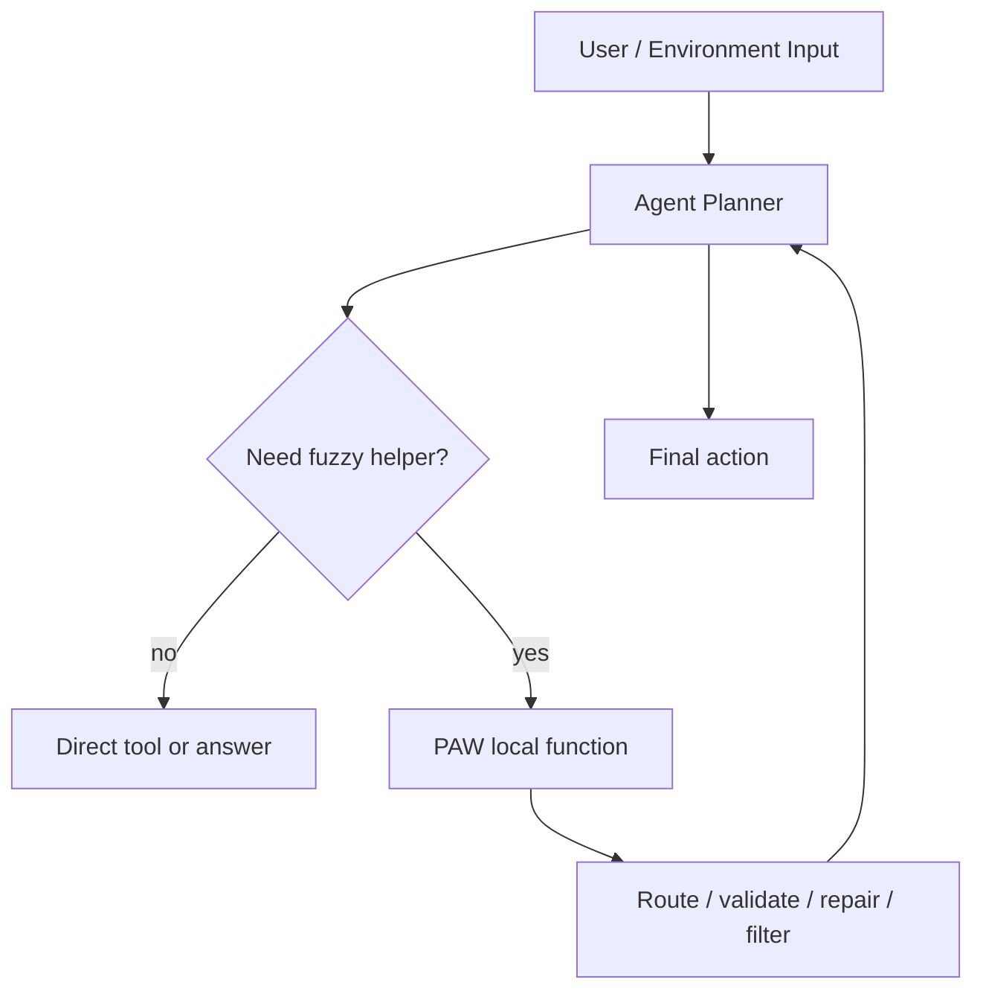

# Program-as-Weights：把模糊函数从“每次调用大模型”改写成“编译一次、本地执行”

## 元信息与 TL;DR

| 字段 | 内容 |
| --- | --- |
| 论文 | Program-as-Weights: A Programming Paradigm for Fuzzy Functions |
| arXiv | [https://arxiv.org/abs/2607.02512](https://arxiv.org/abs/2607.02512) |
| PDF | [https://arxiv.org/pdf/2607.02512](https://arxiv.org/pdf/2607.02512) |
| 官方 Demo | [https://programasweights.com](https://programasweights.com) |
| 官方代码入口 | [https://github.com/programasweights](https://github.com/programasweights) |
| 发布时间 | 2026-07-02T17:59:50Z |
| 方向 | 大模型后训练 / 小模型本地执行 / 神经编译器 |

### TL;DR

- **这篇论文要解决什么**：许多工程函数很难写成确定性规则，例如日志告警、JSON 修复、意图分类、模糊搜索和工具调用预处理；现在常见做法是每次请求都调用远程 LLM，但这带来成本、延迟、可复现性和离线部署问题。
- **核心做法是什么**：作者提出 Program-as-Weights（PAW）。开发者用自然语言描述一个模糊函数，4B 级编译器先把规格改写成 pseudo-program，再生成一个小型 PEFT 程序；本地冻结解释器加载这个程序，对输入执行推理。
- **关键机制是什么**：PAW 程序由两部分组成：离散的 `p_discrete` 负责把嘈杂规格清洗成可执行说明，连续的 `p_continuous` 通过 LoRA 或 prefix-tuning 改写解释器行为；当前最强实现是 text-to-LoRA。
- **训练证据是什么**：作者构造 FuzzyBench-10M，包含 1000 万个 `(spec, input, output)` 三元组，覆盖 29 个版本、800 多个子类别、7 个任务族；训练目标是在冻结解释器上最大化目标输出似然。
- **关键数字是什么**：Qwen3-0.6B 解释器执行 PAW 程序在 FuzzyBench 上达到 73.78% exact match，高于直接提示 Qwen3-32B 的 68.70%；论文称推理内存约为 1/50。量化后，Qwen3-0.6B 共享底座约 430-623 MB，每个程序 LoRA 约 23 MB，MacBook M3 上约 30 tokens/s。
- **消融说明什么**：Text-to-LoRA 明显强于 prefix-tuning；固定 LoRA、全量微调和无编译器 baseline 都低于 PAW；重噪声规格下，pseudo-program 让性能只小幅下降。
- **局限在哪里**：FuzzyBench 由 gpt-5.2 合成，测试也依赖强模型一致性过滤；指标主要是 exact match 与若干任务集，不等价于真实生产稳定性；编译仍依赖云端强模型，PAW 把大模型调用从“每个输入”转移到“每个函数定义”。

## 研究问题：为什么“模糊函数”需要新的编程接口？

### 什么叫模糊函数？

| 任务 | 规则代码为什么困难 | 直接调用 LLM 的代价 |
| --- | --- | --- |
| 日志告警 | 关键错误行依赖上下文、业务词和噪声过滤 | 每行都走 API，成本和延迟随日志量线性增长 |
| JSON 修复 | 缺引号、尾逗号、转义错误组合很多 | 输出不稳定，供应商模型更新会改变行为 |
| 意图路由 | 用户描述和菜单项不完全匹配 | 线上请求路径依赖远程服务 |
| 模糊搜索 | 需要处理语义、错别字和领域简称 | 难以缓存，每次 rerank 都是一次大模型推理 |
| 工具调用预处理 | 需要把自然语言映射到工具、参数和校验结果 | agent runtime 会被外部 LLM 可用性牵制 |

作者的判断是：这些函数不该被迫二选一。

- **手写规则**：可审计、可离线、低成本，但覆盖不了开放语言边界。
- **远程 LLM**：表达能力强，但把函数执行权交给服务商和当次上下文。
- **PAW**：让大模型在编译期完成困难部分，让本地小模型在运行期像函数一样执行。

这不是简单的小模型替代大模型，而是把 foundation model 的角色从“每个输入的解题器”改成“每个函数定义的工具构建器”。

## 论文主张与论证路线

| Claim | Mechanism | Evidence | Boundary |
| --- | --- | --- | --- |
| 模糊函数可以被编译成可分发程序 | `Compiler(s) -> p`，`Interpreter(p, x) -> y` | PAW 把自然语言规格转成 pseudo-program + LoRA | 仍限于作者定义的 fuzzy text / image-conditioned 任务 |
| 小解释器可以接近或超过大模型 prompting | 4B 编译器生成 per-function LoRA，0.6B 解释器本地执行 | FuzzyBench：PAW Qwen3-0.6B 73.78%，Qwen3-32B prompting 68.70% | 数据是合成 FuzzyBench，真实开放任务需再验证 |
| 离散 pseudo-program 提高抗噪声能力 | 强模型先改写规格，弱解释器看到清洗后的任务说明 | heavy typo 下 pseudo-program 0.6108，raw spec 0.5662 | 规格若语义本身错误，清洗也可能固化错误意图 |
| Text-to-LoRA 是当前更强程序形式 | 编译器 hidden states 映射到共享基 LoRA | r=64 text-to-LoRA 0.657，高于 prefix-tuning 0.504 | 更复杂 mapper 反而下降，理论解释还不完整 |
| 编译一次、本地多次执行能改变成本结构 | 编译器云端运行一次，本地共享底座加载多个程序 | 官方 SDK 支持 Python、Browser、Hugging Face assets 和 WASM | 编译服务、程序分发、版本治理仍是工程系统问题 |

## 方法机制：一个 PAW 程序到底是什么？

### 形式化定义

论文把目标函数写成：

```text
p = Compiler(s)
y_hat = Interpreter(p, x) ≈ f(x)
```

变量含义：

- `s`：开发者写的自然语言规格，也可以带少量输入输出样例。
- `x`：运行期输入，例如一行日志、一段用户请求、一段损坏 JSON。
- `f(x)`：理想模糊函数，通常很难用规则完全刻画。
- `p`：编译结果，不是 Python 源码，而是可加载的神经程序。
- `Interpreter`：本地冻结小模型，像 runtime 一样反复执行不同程序。

PAW 的关键分解是：

```text
p = (p_discrete, p_continuous)
```

- `p_discrete`：文本形式的 pseudo-program，包含清晰任务描述和少量代表性样例。
- `p_continuous`：参数形式的程序，当前主要是 LoRA，也试过 prefix-tuning。

这让 PAW 同时保留两类信息：

- **文本信息**：便于解释器读取任务意图，降低原始规格噪声。
- **权重信息**：用连续参数表达难以用文字完整列出的边界和偏好。

### Text-to-LoRA 如何生成程序？

论文当前最强版本使用两级编译：

1. **Pseudo compiler `C_p`**  
   使用冻结的 Qwen3-4B-Instruct-2507，不训练；它把用户规格改写成任务说明和样例。
2. **LoRA compiler `C_L`**  
   另一个 4B Qwen3 模型，接受 `s + p_discrete + EOS + 64 个 learned prefix tokens`，输出 prefix-position hidden states。
3. **LoRA mapper**  
   把 hidden states 平均池化后送入 MLP，再投影成每层、每类模块、每个共享基的混合系数。
4. **Frozen interpreter**  
   将生成的 LoRA hot-attach 到 Qwen3-0.6B 等解释器，并把 `p_discrete` 拼到输入前，最后自回归生成输出。

核心 LoRA 组合式可以写成：

```text
A_ex(l,m) = Σ_n α_A(l,m,n) * A_n(m)
B_ex(l,m) = Σ_n α_B(l,m,n) * B_n(m)
```

变量解释：

- `l`：解释器层号。
- `m`：目标模块类型，例如 attention 的 q/k/v/o 或 MLP 的 gate/up/down。
- `n`：共享 LoRA 基的编号。
- `A_n(m), B_n(m)`：跨函数共享学习到的 LoRA 基。
- `α_A, α_B`：由编译器根据当前规格预测出来的混合系数。

这里的设计很像“可组合权重库”：训练时学习一批共享低秩基，编译时为每个函数预测如何混合它们。

### 训练目标如何约束编译器？

解释器冻结，pseudo compiler 冻结，训练只更新 LoRA compiler 和 mapper。目标函数是：

```text
L(θ) = E_(s,x,y)[ - log P_φ(y | p_discrete, p_LoRA(θ; s, p_discrete), x) ]
```

它的含义是：

- 对每个训练三元组 `(s, x, y)`，先拿到规格 `s` 的 pseudo-program。
- 编译器根据 `s` 和 pseudo-program 生成 LoRA。
- 冻结解释器加载 LoRA 后，在输入 `x` 上生成目标 `y`。
- 反向传播穿过冻结解释器的计算图，但不更新解释器参数，只把梯度传回 LoRA mapper 和 compiler。

这个目标把 PAW 和普通微调分开：

- 普通微调为一个任务训练一组参数。
- PAW 训练的是“生成任务参数的函数”。
- 新规格到来时，不再做梯度下降，而是一次前向编译。

## FuzzyBench：训练数据如何覆盖“工程里的模糊性”？

作者构造了 FuzzyBench-10M。它不是传统单一 benchmark，而是为“从规格编译函数”服务的数据集。

| 任务族 | 样本量 | 占比 | 说明 |
| --- | ---: | ---: | --- |
| Core text processing & NLP | 2.95M | 30% | 解析、分类、NER、指代、情感等基础任务 |
| Search, matching & web intelligence | 1.80M | 18% | 模糊匹配、语义搜索、网页智能 |
| Custom classification & filtering | 1.50M | 15% | 用户自定义分类与过滤 |
| Code & natural-language commands | 1.25M | 12% | 代码、命令、自然语言到操作 |
| Safety, verification & domain knowledge | 1.25M | 12% | 安全校验、事实/领域判断 |
| Agentic & tool use | 0.75M | 8% | 工具调用、agent 预处理、路由 |
| Format repair & validation | 0.50M | 5% | JSON 修复、格式校验、结构化输出 |

数据构造有几个值得注意的边界：

- 每个样本是 `(specification, input, target output)`。
- 规格按 spec 切分成 80/10/10，测试规格训练时不可见。
- 测试集用强模型一致性过滤：gpt-5.2 和 gpt-5-mini 对输出一致时才保留。
- 作者还做了 8 类噪声规格：typos、grammar、ambiguity、formatting、all-noise、terse、casual、paraphrase，并设置 light/medium/heavy 强度。

这让 FuzzyBench 更像“编译器训练语料”，而不是单纯任务榜单。它考察的是：编译器是否能从新规格泛化到新函数。

## 实验结果：PAW 的强项具体在哪里？

### 主结果

| 方法 | 是否自包含 | 解释器规模 | FuzzyBench |
| --- | --- | ---: | ---: |
| gpt-5.2 API | 否 | API | 96.09% |
| gpt-5-mini API | 否 | API | 91.87% |
| Local LM Qwen3-0.6B prompting | 是 | 0.6B | 9.84% |
| Local LM Qwen3-32B prompting | 是 | 32B | 68.70% |
| LM-to-Code reimplementation | 是 | 29 MB 代码执行 | 35.81% |
| PAW Qwen3-0.6B | 是 | 0.6B | 73.78% |
| PAW Qwen3.5-0.8B | 是 | 0.8B | 67.29% |
| PAW GPT-2 124M | 是 | 124M | 54.39% |

最重要的对比不是 PAW 和 gpt-5.2。gpt-5.2 是数据生成模型，也接近经验天花板。真正关键的是：

- 直接提示 Qwen3-0.6B 几乎不会做这些规格化模糊函数，只有 9.84%。
- 直接提示 Qwen3-32B 有 68.70%，说明任务不是 trivially impossible。
- PAW 用 Qwen3-0.6B 解释器达到 73.78%，说明编译器生成的函数级 LoRA 确实把一部分能力压进了本地小程序。

### 多模态结果

PAW 还测试了 image-conditioned fuzzy functions。方法是把文本编译器换成 Qwen3-VL-4B 编译器，但解释器仍是文本小模型。

| 任务 | 最强 VLM baseline | PAW LoRA Qwen3-0.6B | 结论 |
| --- | ---: | ---: | --- |
| Circuit | 0.196 | 0.274 | PAW 更高 |
| Chemical | 0.258 | 0.414 | PAW 更高 |
| Music | 0.470 | 0.552 | PAW 更高 |
| Im2SMILES | 0.044 | 0.203 | PAW 更高 |
| Im2LaTeX | 0.435 | 0.181 | PAW 更低 |
| TextVQA | 0.836 | 0.721 | PAW 更低 |

这组结果支持一个有限判断：

- PAW 不要求解释器看到图像本身；图像信息可以被编译进 PEFT。
- 但长输入/长输出任务会被小解释器上下文和 pseudo-program 长度限制。
- 因此它适合“规格条件化的短输出模糊判断”，不适合直接替代通用 VLM。

## 消融：哪些设计真的重要？

### LoRA 比 prefix-tuning 更强

| 方法 | Accuracy |
| --- | ---: |
| Prompting | 0.098 |
| Prefix Tuning | 0.504 |
| Text-to-LoRA, r=18 | 0.565 |
| Text-to-LoRA, r=64 | 0.657 |

这个结果说明：

- 仅靠 pseudo-program 和普通 prompting 不够。
- prefix-tuning 已经能表达一部分任务程序。
- LoRA 更适合当前 PAW 设定，因为它直接改写解释器内部线性层行为。

### 更复杂的 mapper 反而更差

| Mapper variant | Accuracy |
| --- | ---: |
| Default：r=64, N=64, shared bases | 0.6223 |
| Per-position aggregation | 0.5598 |
| Per-position + per-layer bases | 0.5559 |
| Per-layer bases only | 0.6028 |
| LoRA + prefix-tuning | 0.6033 |

作者没有给出完整理论解释，但这个失败很有信息量：

- 更大的表达力不一定带来更好的编译泛化。
- 简单共享基可能提供了正则化，迫使不同 fuzzy functions 复用可迁移行为片段。
- 对后续研究而言，重点不只是增大 mapper，而是理解“规格到权重”的结构约束。

### 编译器本身是收益来源

| 0.6B base 方法 | Accuracy |
| --- | ---: |
| Fixed LoRA r=18 | 0.4236 |
| Fixed LoRA r=64 | 0.5210 |
| Fixed LoRA r=128 | 0.5159 |
| Full fine-tuning | 0.5840 |
| PAW Qwen3-0.6B | 0.7378 |

这张表支撑作者的核心 claim：

- 不是“LoRA 本身”解释了结果。
- 也不是“0.6B base 微调一下就行”。
- 真正增益来自按规格动态生成 per-function 权重。

### pseudo-program 为什么抗噪？

| 输入形式 | Clean | Heavy typos |
| --- | ---: | ---: |
| Pseudo-program | 0.6443 | 0.6108 |
| Raw spec | 0.6285 | 0.5662 |

这个消融很关键，因为真实开发者规格经常不干净。PAW 的离散部分相当于“编译前端”：

- 先把用户自然语言变成规范中间表示。
- 再让后端编译器生成连续权重。
- 最后让解释器执行。

用传统编译器类比，它相当于：

```text
messy source spec
  -> normalized pseudo-program
  -> neural adapter
  -> local runtime execution
```

## 本地执行：从论文系统到开发者 API

官方 Python SDK README 给出的使用方式很直接：

```python
import programasweights as paw

program = paw.compile(
    "Fix malformed JSON: repair missing quotes and trailing commas",
    slug="json-fixer"
)

fn = paw.function(program.slug)
fn("{name: 'Alice',}")
```

官方文档把当前公开编译器分成两类：

| 编译器 | 解释器 | base model size | program size | 适用场景 |
| --- | --- | ---: | ---: | --- |
| `paw-4b-qwen3-0.6b` | Qwen3 0.6B | 594 MB | ~22 MB | 精度优先，本地 Python |
| `paw-4b-gpt2` | GPT-2 124M | 134 MB | ~5 MB | 浏览器和小体积优先 |

Browser SDK README 还说明了前端执行路径：

- 首次调用下载 GPT-2 Q8_0 base，约 134 MB，缓存到 IndexedDB。
- 每个程序下载约 12 MB assets，包括约 5 MB LoRA adapter 和约 7 MB prefix cache。
- 推理通过 WebAssembly 版 llama.cpp 在浏览器本地运行。
- 内容地址加载可以只依赖 Hugging Face assets；slug 解析仍要访问 PAW API。

这和论文里的系统设定一致：

- 编译期可以依赖云端服务。
- 运行期尽量本地化。
- 多个程序共享一个解释器底座，第二个程序主要增加 adapter 下载。

## 伪代码：PAW 的一次编译与多次执行

```text
Input:
  s: 开发者自然语言规格
  X: 运行期输入流
  Cp: 冻结 pseudo compiler
  CL: 训练后的 LoRA compiler
  I: 冻结本地解释器

Compile:
  p_discrete = Cp.rewrite(s)
  H = CL.forward([s, p_discrete, EOS, prefix_tokens])
  alpha = MLP(mean_pool(H))
  p_lora = mix_shared_lora_bases(alpha)
  program = package(p_discrete, p_lora, metadata)

Run:
  load I once
  attach p_lora to I
  for each x in X:
    y_hat = I.generate([p_discrete, x])
    emit y_hat

Failure boundaries:
  if s is semantically wrong:
    pseudo-program may normalize the wrong intent
  if output is long structured text:
    small interpreter context and generation quality may dominate
  if distribution shifts beyond FuzzyBench:
    exact-match gains may not transfer
```

## Figure/Table 证据逐项解读

| 证据 | 支撑什么 | 不能证明什么 |
| --- | --- | --- |
| Figure 1 | PAW 的 compile once / run locally 心智模型 | 不能证明每类函数都适合编译 |
| Figure 2 | Text-to-LoRA 从规格到 LoRA 的结构 | 不能解释为什么简单 mapper 最强 |
| Figure 3 | FuzzyBench 覆盖 7 个任务族和 10M 样本 | 不能替代真实生产日志、搜索、agent traces |
| Table 1 | Text-to-LoRA 强于 prefix-tuning 和 prompting | 只是在控制训练规模下的比较 |
| Table 2 | 0.6B PAW 超过 32B prompting | 不能推出 PAW 超过闭源大 API 模型 |
| Table 4 | 更复杂 mapper 下降 | 需要更多理论解释和跨模型复验 |
| Table 5 | 编译器生成权重优于固定 LoRA / full fine-tuning | 仍基于 FuzzyBench 训练与测试定义 |
| Table 6/7 | pseudo-program 提升抗噪能力 | 不保证对恶意规格或错误需求鲁棒 |
| Table 8 | 量化后体积和精度损失可控 | 只报告子集和特定硬件路径 |

## 与相关工作的关系

### 和 Text-to-LoRA / Hypernetwork 的关系

PAW 属于 text-conditioned hypernetwork 传统：从任务描述生成适配参数。但它强调三个差异：

- 生成的是面向开发者函数的程序，而不是只服务论文任务的 adapter。
- 程序是 hybrid：文本 pseudo-program + 连续 PEFT，而不是纯连续向量。
- 训练数据是 FuzzyBench-10M，重点覆盖工程里的 fuzzy functions。

### 和 in-context learning 的关系

PAW 可以看成对 prompt 的“编译”：

- ICL：每次请求都带任务说明和样例。
- PAW：把任务说明和样例压进一个可复用程序。
- 代价从 request-time context 转移到 compile-time artifact。

这对 agent 系统尤其重要。Agent 的工具路由、输出校验、日志过滤、动作预处理经常是高频小函数，如果每一步都调用大模型，系统会把推理预算浪费在“类似但重复”的边界判断上。

### 和 LM-to-Code 的关系

LM-to-Code 让大模型写 Python，PAW 让大模型写权重。二者目标相似：把昂贵 LLM 调用替换成本地执行。

差异在于：

- Python 代码适合清晰规则和可审计逻辑。
- PAW 权重适合语义边界模糊、规则难以枚举的函数。
- PAW 的可解释性更弱，需要版本、测试集和监控来补足。

## 失败案例与局限

### 0. 复现协议仍需要从“论文指标”补到“函数级验收”

如果把 PAW 当成研究原型，Table 2 到 Table 8 已经给出足够清晰的主线：编译器生成的 LoRA 能让小解释器在 FuzzyBench 上跨过大模型 prompting baseline，并且量化后仍能本地运行。可是如果把 PAW 当成工程函数系统，仍然缺少一层更接近软件测试的验收协议。

| 验收层 | 论文已有证据 | 仍需补充的问题 |
| --- | --- | --- |
| 数据集指标 | FuzzyBench exact match、噪声规格、WRENCH 风格任务 | 业务输入分布是否和合成规格一致 |
| 函数回归 | 论文展示 compile/run API 和若干 case study | 每个程序升级后如何固定 golden cases |
| 版本治理 | 程序可以缓存、分发、版本化 | compiler、interpreter、LoRA、pseudo-program 如何一起锁版本 |
| 安全审计 | 本地执行减少远程 API 依赖 | 权重程序是否可签名、可撤销、可权限隔离 |
| 失败处理 | 论文列出长输出任务弱点 | 运行期低置信、异常输出、分布漂移如何上报 |

对研究者来说，这层差异很重要。PAW 的论文指标回答的是“能否学会从规格生成权重”；工程验收要回答的是“这个权重函数能否像普通依赖一样被测试、发布、回滚和审计”。两者并不矛盾，但后一层不能从 FuzzyBench 分数自动推出。

一个更完整的复现实验可以这样设计：

- 选择 20 到 50 个真实工程模糊函数，例如日志分类、工具路由、表单修复、近重复检测、安全策略标签。
- 为每个函数建立固定测试集，包含正常样本、边界样本、对抗样本、历史事故样本。
- 同时比较手写规则、远程 LLM、直接小模型 prompting、PAW 编译程序。
- 记录四类指标：准确率、延迟、单位调用成本、版本升级后的回归失败数。
- 对每个 PAW 程序保存规格、pseudo-program、adapter hash、解释器版本和失败样例。

只有做完这类实验，才能把论文中的“编译一次、本地执行”进一步推进成可依赖的软件构件。

### 1. 合成数据带来的外推风险

FuzzyBench 的规模很大，但核心标签来自 gpt-5.2。即使测试集经过 gpt-5-mini 一致性过滤，也仍然有两个风险：

- 被保留的是强模型容易达成一致的样本。
- 真实业务函数的“正确输出”常常依赖组织语境、历史策略和责任边界。

因此，73.78% 不应被读成“任意生产 fuzzy function 都可靠”。更谨慎的读法是：在作者构造的规格到输出分布上，函数级编译明显优于直接 prompting 和固定适配。

### 2. 编译服务没有消失

PAW 不是完全摆脱大模型，而是改变调用频率：

| 阶段 | 是否需要强模型 | 成本结构 |
| --- | --- | --- |
| 编译 | 需要 4B 编译器和服务端流程 | 每个函数定义一次 |
| 执行 | 使用本地小解释器 | 每个输入低成本 |
| 更新函数 | 重新编译或发布新程序 | 需要版本治理 |

所以它更适合高频复用函数，不适合一次性问答。

### 3. 可审计性弱于源码函数

PAW 程序可以版本化，但权重不是人类源码。工程上至少需要：

- 固定评测集：覆盖正常输入、边界输入、拒答输入、恶意输入。
- 程序卡片：记录规格、编译器版本、解释器版本、训练数据版本。
- 回归测试：每次重新编译或换解释器时跑同一套测试。
- 运行监控：记录分布漂移和低置信输出。

### 4. 长输出任务仍不稳

多模态实验里的 Im2LaTeX 失败提醒我们：

- PAW 对短标签、短结构化输出、路由和校验更友好。
- 长公式、长代码、长文本生成会受小解释器容量、上下文长度和解码误差影响。
- pseudo-program 带来的上下文占用在长任务上可能变成负担。

## 领域延伸：这篇论文对后训练和 Agent 有什么启发？

### 对后训练：从“训练一个模型”转向“训练一个编译器”

PAW 的后训练思想不在于把某个 interpreter 微调到更强，而是训练一个 compiler：

- 输入是规格。
- 输出是适配权重。
- 目标是让冻结解释器在新函数上表现正确。

这给后训练研究提出一个很具体的问题：

> 能不能把更多 RLHF、RLVR、tool-use alignment 的成果，变成可按任务即时生成的小程序，而不是把所有行为都烘焙进一个通用模型？

如果可行，后训练系统可能会从“一个大模型服务所有行为”变成：

- 一个或多个强编译器；
- 一组小解释器 runtime；
- 大量按任务版本化的行为程序；
- 每个程序有自己的评测、权限和生命周期。

### 对 Agent：把高频小判断从主模型链路里拿出来

Agent 系统里有很多不值得每次调用大模型的模糊判断：

- 判断工具调用结果是否可继续；
- 判断日志里是否出现关键失败；
- 判断用户请求应路由到哪个工具；
- 判断检索候选是否近似命中；
- 判断输出是否满足格式和安全边界。

PAW 的路线是把这些判断变成本地函数。它不会替代主 Agent 模型，但可能减少主模型在“重复边界判断”上的预算消耗。

一个合理架构是：



这里 PAW 最像 agent runtime 的“本地神经中间件”。它不负责长程规划，而负责把一批高频、短输出、可测试的模糊函数从主循环里拆出去。

### 对 AI 安全：本地函数也需要安全边界

PAW 让函数本地化，不等于天然安全。相反，权重程序会带来新的供应链问题：

- 程序文件可能被替换或投毒。
- 规格可能被 prompt injection 污染后编译成错误函数。
- 浏览器和 Hugging Face assets 路径需要内容地址、签名和版本锁定。
- 多个程序共享解释器时，adapter 生命周期和清理必须可靠。

安全上更稳妥的实践是：

- 对每个 PAW 程序做 hash pinning。
- 运行前检查 program id、compiler version、interpreter version。
- 把 PAW 函数限制在低权限、短输出、可验证任务里。
- 对 agent 工具路由类函数保留主模型或规则系统的二次确认。

## 结论

Program-as-Weights 最有价值的地方，是把“自然语言规格能否成为可执行函数”这个问题具体化为一条可训练、可量化、可部署的编译器链路。

- 它不是说所有代码都该变成权重。
- 它也不是说本地小模型能替代所有大模型 API。
- 它真正提出的是：对高频复用、边界模糊、输出短、可测试的函数，可以让强模型只在编译期出现，让小模型在本地运行期承担执行。

从研究者角度看，PAW 把后训练、PEFT、合成数据、小模型执行和 agent 工程连接到了一起。下一步最值得追问的是：

- FuzzyBench 之外，真实组织任务的规格到权重泛化是否仍成立？
- 如何给 PAW 程序建立像软件包一样的签名、版本、依赖和回归测试？
- RLVR 或 verifier reward 能否直接训练“更可信的函数编译器”？
- 当 agent 系统拥有大量本地神经函数时，权限、审计和组合风险应该如何建模？

这篇论文的边界很清楚，但它提出的接口很有启发：未来的后训练产物可能不只是一个聊天模型，也可能是一组可以被编译、缓存、分发和测试的神经函数。
