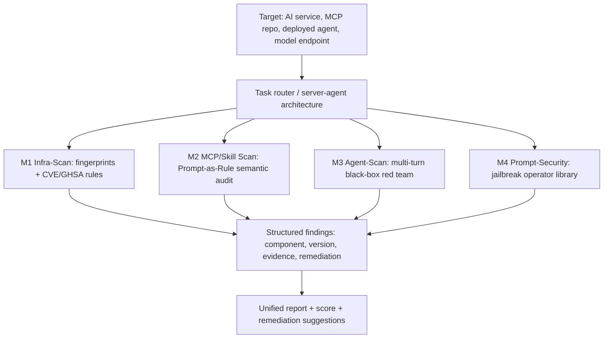

# Securing the AI Agent：为什么 Agent 安全扫描不能只靠一种检测器

### 元信息

| 项目 | 内容 |
| --- | --- |
| 标题 | Securing the AI Agent: A Unified Framework for Multi-Layer Agent Red Teaming |
| 类型 | 论文 + 开源框架报告 |
| 作者/团队 | Yong Yang, Xing Zheng, Huiyu Wu, Huangsheng Cheng, Xiaorong Shi, Jing Guo, Bo Yang, Yi Zhou, Xiangfan Wu, Zonghao Ying 等，Tencent Zhuque Lab |
| 官方链接 | https://arxiv.org/abs/2606.31227v1 |
| 发布时间 | 2026-06-30T07:06:56Z |
| 代码/项目 | https://github.com/Tencent/AI-Infra-Guard |
| 领域 | AI 安全，Agent 安全，MCP/Skill 供应链，Jailbreak 评测 |

### TL;DR

- 这篇文章提出 **AI-Infra-Guard**，把 AI Agent 的攻击面拆成四层：基础设施、协议/能力、Agent 运行行为、模型对齐鲁棒性；核心主张是不同层需要不同证据，因此不能用单一扫描范式覆盖全部风险。
- 方法上，它提出 **layer-paradigm matching**：基础设施用确定性规则匹配，MCP/Skill 用 LLM 语义审计，已部署 Agent 用多轮黑盒红队，模型层用攻击算子库加 LLM-as-judge 做统计评测。
- 证据上，论文给出一个可运行框架：基础设施模块覆盖 75 个 AI 组件、107 条指纹规则、1,443 条中文漏洞规则；项目 README 进一步声明当前 AI infra 扫描已覆盖 100+ 组件和 1600+ CVE。
- 协议层不是把普通 SAST 换成 LLM，而是提出 **Prompt-as-Rule**：把 MCP 工具投毒、命令注入、凭据窃取、间接提示注入、Skill 一致性等风险写成自然语言检测准则，并要求审计器把被审计内容本身当作不可信输入。
- Agent 行为层关注运行时才出现的漏洞：系统提示泄露、工具滥用、权限越界、间接提示注入等；它使用升级阶梯、停止规则和 canary-token 验证，尽量把昂贵的黑盒交互变成可控实验。
- 模型层则被定义为统计问题：框架集成单轮和多轮 jailbreak 攻击算子，覆盖 16 个红队数据集，约 7,248 条提示，用 LLM judge 计算攻击成功率剖面。
- 局限也很明显：论文更像系统化框架报告而非严格 benchmark 论文；很多模块强调覆盖面和工程机制，但缺少跨工具的统一实测指标、误报率、运行成本和复现实验细节。
- 对 Agent 安全研究的启发是：未来的安全评估应同时报告 **证据类型、触发界面、可复现性和语义假设**，否则“扫描通过”很容易只说明某一层没有被测出问题，而不是整个 Agent 安全。

### 研究问题：为什么传统安全扫描在 Agent 栈上失配？

论文开头把问题放在一个很现实的场景里：AI 系统已经不只是一个模型 API，而是一整套网络暴露的软件供应链。

- **模型服务**：Ollama、vLLM、llama.cpp 等推理端点可能直接暴露在内网或公网。
- **Agent 平台**：Dify、LangFlow、Flowise 这类编排工具提供控制台、工作流和插件接口。
- **ML 基础设施**：MLflow、Kubeflow、Ray 等保存实验、数据、凭据或执行能力。
- **MCP 生态**：MCP server 让 Agent 读取文件、查数据库、执行命令，也把工具描述、输入 schema 和服务端代码带进攻击面。
- **Agent Skills**：Skill 包把说明文档、脚本、依赖和权限打成可安装能力，形成一种新的供应链单元。

作者认为传统扫描器失配，原因不是“规则库还不够新”这么简单，而是三类断层叠在一起：

| 断层 | 具体表现 | 为什么会影响 Agent 安全 |
| --- | --- | --- |
| 组件目录断层 | 主流指纹库和 CVE 库很少收录新兴 AI 组件 | 扫描器可能连目标是 Ollama、Dify、vLLM 还是 Flowise 都识别不出来 |
| 版本比较断层 | AI 项目常用 `latest`、`2.3.dev`、`b7824`、RC tag | 传统语义版本比较容易误判受影响范围 |
| 威胁模型断层 | 高危问题常是无认证算力滥用、API key 泄露、工具投毒、Agent 混淆代理、jailbreak | 经典 Web 漏洞规则并不能表达“工具描述如何改变模型行为” |

关键点在于：这些问题分布在不同抽象层。一个暴露的 Ollama 服务是基础设施问题；MCP server 的命令注入是协议/工具问题；Agent 被诱导泄露系统提示是运行时行为问题；模型响应编码后的有害请求是对齐鲁棒性问题。它们需要的证据完全不同。

### 论文主张与论证路线

作者的中心命题可以概括为一句话：

> AI Agent 的攻击面是分层的，因此安全评估也必须按层选择能产生充分证据的检测范式。

这不是一个单纯的产品架构说法，而是论文试图形式化的评估原则。它把“扫描器能否覆盖风险”转化为“该检测过程是否能产出足以证明该层漏洞存在的证据”。

| Claim | Mechanism | Evidence | Boundary |
| --- | --- | --- | --- |
| Agent 攻击面不能用单一范式覆盖 | 划分基础设施、协议/能力、行为、模型四层 | 论文列举四类漏洞：暴露服务、MCP 工具投毒、Agent prompt 泄露、模型 jailbreak | 四层划分是工程抽象，不等于所有组织的真实部署边界都如此清晰 |
| 每层需要不同证据 | 提出 signature、semantic、behavioral、statistical 四类 evidence | 第 4 节给出 `L1 -> e_sig` 到 `L4 -> e_stat` 的对应关系 | 证据充分性讨论偏概念，没有给出形式化 soundness 证明 |
| 检测范式应按“最弱但充分”的证据选择 | 基础设施规则匹配，MCP/Skill 语义审计，Agent 多轮红队，模型攻击枚举 | 表 1 将四层、特征、范式和模块一一对应 | “最弱但充分”在实践里依赖规则质量、LLM judge 质量和交互成本 |
| AI-Infra-Guard 是可运行实现 | Go 规则引擎、Python LLM 模块、WebSocket worker、API/UI、ClawHub skills | 源码 README 给出 Docker 部署、API、ClawHub skill、规则目录扩展方式 | 论文没有提供端到端大规模对比实验，更多是系统说明和设计 rationale |

### 方法机制：四层攻击面与四类证据

论文最有价值的部分，是把 Agent 安全评估拆成“层、证据、范式”的三元组。

#### 1. 基础设施层：签名证据

这一层处理的是可观察目标：

- 服务指纹；
- 版本号；
- 公开端点；
- 配置泄露；
- 已知 CVE/GHSA 受影响范围。

它适合确定性规则，因为目标是“已知组件是否出现”以及“已知漏洞是否匹配”。作者明确不主张在这里用 LLM 审计替代规则引擎，因为那会牺牲速度、可复现性和低误报。

#### 2. 协议/能力层：语义证据

MCP server 和 Agent Skill 的风险不总是可由固定签名表达。

- 工具名称可能冒充常见工具。
- 工具描述可能藏有隐式指令。
- 输入字段可能进入 `os.system`、`subprocess`、`eval` 等危险调用。
- Skill 文档和脚本可能表面声明一个用途，实际执行反向 shell、外传或挖矿。

这些发现需要理解代码、metadata、自然语言描述和数据流，所以作者把它归为 LLM-driven semantic auditing。

#### 3. Agent 行为层：行为证据

部署后的 Agent 只能通过对话观察。

- 它是否泄露系统提示？
- 它是否越权使用工具？
- 它是否被间接提示注入带偏？
- 它是否在用户无权限时执行敏感动作？

这些风险不一定在源码里显式存在，而是在模型、工具、上下文和用户输入交互时出现。因此这一层使用多轮黑盒红队，并用 canary token、升级阶梯和停止规则提高可验证性。

#### 4. 模型层：统计证据

模型 jailbreak 不是单次互动能判定的性质。攻击者可以改变编码、语言、角色设定、多轮铺垫和语义包装，因此作者把它定义为统计问题：

- 对多个数据集执行多种攻击算子；
- 使用 judge 判断是否越过安全边界；
- 汇总攻击成功率，而不是只报告一个示例。

### 公式：证据充分性如何组织四层扫描？

论文里的形式化不复杂，但很适合说明为什么“一个扫描器跑全栈”并不自动成立。

```text
L1 -> e_sig
L2 -> e_sem
L3 -> e_beh
L4 -> e_stat
```

变量解释：

- `L1`：基础设施层，最弱充分证据是 signature evidence。
- `L2`：协议/能力层，最弱充分证据是 semantic evidence。
- `L3`：Agent 行为层，最弱充分证据是 behavioral evidence。
- `L4`：模型层，最弱充分证据是 statistical evidence。

进一步，检测范式可以写成：

```text
L_i -> P_i, i in {1, 2, 3, 4}
```

其中：

- `P1` 是确定性规则匹配；
- `P2` 是 LLM 语义审计；
- `P3` 是交互式黑盒红队；
- `P4` 是攻击枚举与统计评测。

这个公式真正想表达的是：如果某个层需要 `e_beh`，但检测器只能产生 `e_sig`，那它最多证明“没有匹配到已知签名”，不能证明 Agent 行为安全。

### 系统流程：AI-Infra-Guard 如何把四层合在一起？



架构上，AI-Infra-Guard 不是把所有检测都塞进一个 LLM prompt，而是用一个服务端调度不同 worker：

- Go 实现的基础设施扫描在 worker 内部运行；
- MCP、Skill、Agent、Jailbreak 等 LLM 驱动模块由 Python 子进程启动；
- 服务端通过 WebSocket 管理 worker，通过 SSE 或接口流式返回进度；
- README 显示项目支持 Docker 部署、Web UI、API 文档和 ClawHub skills。

项目 README 里的最新信息也说明它仍在快速迭代：

| 日期 | README 记录的变更 | 与论文关系 |
| --- | --- | --- |
| 2026-06-25 | v4.1.15 增加 MCP Scan 的 3 条威胁检测规则，并新增 6 条 llama.cpp CVE 规则 | 说明规则库和 MCP 语义规则持续更新 |
| 2026-06-18 | v4.1.14 增加 9 个单轮 jailbreak 算子，新增 `aig-agent-redteam` skill | 对应模型层和 Agent 行为层能力 |
| 2026-06-08 | v4.1.12 扩展 39 个 AI Web 指纹并增强 18 个指纹 | 对应基础设施层目录断层 |
| 2026-05-28 | v4.1.10 扩展到 68 个 AI 组件并新增 600+ CVE 规则 | 说明论文中的 75 组件/1,443 规则处在快速增长背景下 |

### M1：基础设施扫描的细节

基础设施模块的核心是规则语料和匹配引擎。

| 项目 | 论文给出的数字/机制 |
| --- | --- |
| AI 组件覆盖 | 75 个组件 |
| 指纹规则 | 107 条 |
| 中文漏洞规则 | 1,443 条 |
| 匹配字段 | `body`、`header`、`icon`、`hash` |
| 匹配操作 | `=`、`==`、`!=`、`~=` |
| 版本比较 | `<`、`<=`、`>`、`>=`，先做版本归一化 |
| 空谓词规则 | 87 条漏洞规则没有版本谓词，需分层解释精度 |

版本归一化是一个很实际的点。AI 项目的版本字符串经常不是标准 semver：

| 原始输入 | 归一化思路 | 风险 |
| --- | --- | --- |
| `v1.2.3` | 去掉前导 `v` | 常规 |
| `latest` | 映射为最大哨兵值 | 可能过度保守 |
| `2.3.dev` | 字母后缀组件归零 | 可能丢失 dev/正式版差异 |
| `1.0.0rc1` | 去掉 RC token | 可能把候选版和正式版混同 |
| `b7824` | 去掉非数字前缀 | 适合 llama.cpp 这类 build 编号 |

作者还把发现分成三类精度：

- **Verified findings**：规则能主动确认暴露，例如访问到敏感配置内容。
- **Version-based findings**：组件和版本范围匹配已知 advisory。
- **Inferred findings**：组件被识别但版本未知，或者规则缺少版本谓词，只能按身份推断相关风险。

这比普通“有漏洞/无漏洞”更诚实，因为它把证据强度带进报告。

### M2：MCP Server 审计与 Prompt-as-Rule

MCP 层的关键贡献是 **Prompt-as-Rule**。它不是让 LLM 自由发挥，而是把检测知识写成结构化自然语言规则：

- 检测条件；
- 高风险代码模式；
- 排除条件；
- 是否需要网络可达触发路径；
- 何时不能报告。

静态 MCP 审计覆盖的主要模式包括：

| 模式 | 关注点 |
| --- | --- |
| Authentication bypass | 硬编码凭据、JWT/OAuth/session 缺陷、认证逻辑绕过 |
| Command injection | 网络输入到 `os.system`、`eval`、`subprocess` 的路径 |
| Credential theft | 读取 secrets 并具备网络外传路径 |
| Hardcoded secrets | 真实 key 且存在暴露路径 |
| Indirect prompt injection | 外部数据未隔离地拼进 prompt |
| Tool-name confusion | 冒充常见工具名 |
| Rug pull | 恶意中断服务或撤回能力 |
| Tool poisoning | 篡改工具返回值，包含条件触发或隐蔽逻辑 |
| Tool shadowing | 重新定义其他工具，或在描述中藏指令 |
| Skill consistency | 当存在 `SKILL.md` 时，检查反向 shell、外传、后门、挖矿等 |

这里最值得注意的是“排除条件”。作者强调，LLM 审计器如果只写正向规则，很容易把普通代码气味误报成安全漏洞。Prompt-as-Rule 需要同时告诉模型什么要报、什么不能报，这是一种不同于 YAML CVE 规则的规则工程。

### M2.5：Agent Skills 为什么要单独看？

论文把 Skills 放在协议/能力层附近，但单独成节，因为 Skill 不是普通代码库。

一个 Skill 包通常同时包含：

- 面向模型的说明文档；
- 可执行脚本；
- 依赖；
- 权限假设；
- 对宿主 Agent 的行为约束或诱导。

这导致它既是软件供应链问题，也是提示注入问题。传统依赖扫描器可能看到脚本和包名，但看不到 `SKILL.md` 如何诱导模型；纯 prompt injection 防御可能看到文本，却看不到脚本是否真的外传数据。

AI-Infra-Guard 的 Skill 扫描将二者合并：

- 先让 agentic pipeline 理解包结构；
- 再检查文档、脚本、依赖和权限是否一致；
- 对可疑项做语义安全分析；
- 结合外部模型或云端能力做辅助判断；
- 使用 SkillTrustBench 作为 benchmark 之一。

这也是为什么本论文和此前 MalSkillBench/SkillTrustBench 类工作有关联，但不完全重复：前者关注一个跨层平台如何把 Skill 纳入整体 Agent 红队流程，后者更像专门的数据集和检测评测。

### M3：Agent 行为红队为什么必须多轮？

Agent 行为层的对象通常是一个已部署系统，测试者不能直接读源码，也未必知道后端接了哪些工具。论文把它看成只能通过对话观察的黑盒目标。

核心风险族包括：

- prompt 或策略泄露；
- 权限边界绕过；
- 工具滥用；
- 间接提示注入；
- SSRF、路径遍历、命令执行等由工具触发的系统风险；
- 跨用户、跨租户或跨权限的 confused deputy。

多轮红队的设计目标不是“越狱一次就算成功”，而是控制成本和证据质量：

1. 先用轻量 probe 识别目标能力和边界。
2. 若没有风险信号，不进入昂贵攻击。
3. 若有弱信号，逐步升级到编码、角色扮演、指令覆盖等策略。
4. 对确认项使用 canary-token 或可观察副作用验证。
5. 一旦某类发现被确认，触发 stop rule，避免重复烧 token。

这套流程的意义在于，它承认 Agent 红队是昂贵的、有状态的、受速率限制的实验，而不是静态扫描那种一次遍历。

### M4：Jailbreak 评测是统计问题

模型层模块被称为 Prompt-Security。它包含三类角色：

- **attacker/simulator**：生成或改写攻击提示；
- **target model**：被测模型；
- **judge**：判断输出是否构成越界。

攻击算子分成两类：

| 类型 | 例子 | 作用 |
| --- | --- | --- |
| 算法式单轮算子 | base64、hex、古典密码、异体文字、零宽字符、不可见文本等约 70 类编码/混淆 | 测试安全策略对形式扰动是否脆弱 |
| 模型驱动算子 | 角色扮演、系统覆盖、超级用户、提示注入、权限升级、上下文投毒、目标重定向、多语种等 | 测试语义包装和对话策略 |
| 多轮算子 | crescendo、tree-of-attacks、linear、sequential、best-of-n、bad-Likert-judge | 测试渐进式诱导和 judge 规避 |

数据层面，论文列出 16 个 red-teaming datasets，总计约 7,248 条提示。这里的关键不是某个新 jailbreak 技巧，而是把既有算子和数据集放进统一 harness，形成可比较的攻击成功率剖面。

### Figure/Table 证据解读

| 证据 | 支持什么 | 不能证明什么 |
| --- | --- | --- |
| Table 1：四层攻击面和检测范式 | 支持 layer-paradigm matching 的系统结构 | 不能证明四层就是唯一合理划分 |
| Table 2：基础设施规则 corpus | 支持基础设施模块的覆盖面：75 组件、107 指纹、1,443 漏洞规则 | 不能证明这些规则在公网真实部署上误报率低 |
| Appendix DSL 表 | 支持规则语言可实现且可解释 | 不能证明所有 AI 项目的版本归一化都正确 |
| MCP 检测模式表 | 支持 Prompt-as-Rule 覆盖 MCP/Skill 语义风险 | 不能证明 LLM 审计稳定、低幻觉、低漏报 |
| Jailbreak datasets 表 | 支持模型层评测覆盖 16 个数据集、约 7,248 prompts | 不能证明 judge 与人类安全标注一致 |
| README release notes | 支持项目仍在持续更新，且论文能力与工程仓库相关 | 不能替代论文实验，也不能证明最新 release 没有回归 |

这篇文章的证据更偏“系统设计 + 工程实现 + 覆盖清单”，而不是“在同一实验协议下击败多个 baseline”。因此阅读时要把它看成一个框架报告，而不是一个严格测评论文。

### 相关工作与位置判断

论文在相关工作里把 AI-Infra-Guard 放在几个方向之间：

- **传统扫描器**：Nuclei、Semgrep 适合已知 Web/代码模式，但缺少 Agent/MCP/模型对齐语义。
- **MCP 审计器**：Invariant MCP-Scan、MCPSafetyScanner 等聚焦协议层，但不覆盖基础设施、Agent 行为和模型层。
- **LLM 红队框架**：garak、PyRIT 等偏模型和提示攻击，不能指纹化 AI infra，也不审计 MCP 源码或 Skill 供应链。
- **Agent Skill 安全研究**：MalSkillBench、SkillAttack、Proteus 等更关注 skill 生态的攻击路径和 benchmark。

AI-Infra-Guard 的定位不是在每一层都提出最强算法，而是把这些层放到一个统一任务调度和报告框架里。它的贡献更像“把 Agent 安全问题拆成可操作的评估矩阵”，而不是“提出一个单点检测模型”。

### 局限与失败边界

这篇论文值得读，但也必须带着边界意识。

- **缺少统一量化评测**：论文没有给出在相同目标集上对比 Nuclei、MCP-Scan、garak、PyRIT 等工具的精确 precision/recall、成本和耗时。
- **LLM judge 仍是可信假设**：MCP/Skill 审计和 jailbreak 成功判断都依赖模型判断，论文讨论了结构化规则和排除条件，但没有充分解决 judge 偏差。
- **规则覆盖不等于真实风险覆盖**：75 组件、1,443 规则说明 corpus 很大，但真实世界的新组件、新版本和私有部署会持续漂移。
- **多层联动还在未来工作里**：作者提到未来要让一层发现影响下一层探测，例如用 infra 指纹指导 Agent reconnaissance，但当前报告更多是模块并列。
- **开源平台自身也有部署风险**：README 明确提示当前项目缺少认证机制，不应部署在公网。这一点很重要，因为安全扫描平台本身会处理目标、凭据和扫描结果。
- **与已有 Skill 安全工作的边界需要读者自己区分**：AI-Infra-Guard 包含 Skill 扫描，但它不是单独证明“Skill 检测最佳”的 benchmark 论文。

### 研究者视角：这篇文章真正改变了什么？

我认为它最有价值的不是某个规则数量，而是把 Agent 安全评估从“工具清单”推进到“证据清单”。

更具体地说：

- 当一个团队说“我们扫描了 Agent”，下一步应追问：扫描产生的是签名证据、语义证据、行为证据，还是统计证据？
- 当一个 MCP 审计器报出漏洞，应说明这是源码语义推断、动态服务交互，还是真实 tool call 触发。
- 当一个 Agent 红队框架声称发现 prompt 泄露，应说明 canary 如何放置、停止规则如何定义、是否有可复现 transcript。
- 当一个 jailbreak benchmark 报告 ASR，应说明 attack operator、dataset、judge、目标模型和成功定义，而不是只给“某 prompt 成功”。
- 当一个跨层平台声称“统一”，还应说明统一发生在调度、报告、证据模型还是真实攻击链联动上；这几个层级的研究难度并不相同。

这也给后续研究留下几个明确问题：

1. 能不能建立跨层 benchmark，让 infra、MCP、Skill、Agent 行为和模型层在同一真实系统上同时被评测？
2. 能不能给 Prompt-as-Rule 规则加上类似单元测试的回归集，约束 LLM 审计器的误报和漏报？
3. 能不能把基础设施层的确定性发现自动转成行为层红队假设，例如发现 Dify/Flowise 后自动选择相应工具滥用脚本？
4. 能不能让 jailbreak judge 不只输出成功/失败，而输出证据强度和不确定性？
5. 能不能把 Agent Skill 的供应链风险和运行时行为风险合并成一个 provenance graph，追踪“哪个文档诱导了哪个工具调用”？

### 结论

`Securing the AI Agent` 更像一篇系统化宣言：Agent 安全不是“给模型加 guardrail”或“跑一次漏洞扫描”就能解决的问题。它要求评估者把 AI 应用看成分层系统，并且为每一层选择能产生充分证据的最小检测范式。

AI-Infra-Guard 的四层结构给了一个清晰起点：

- 基础设施层用规则，保证速度和可复现；
- 协议/Skill 层用语义审计，处理代码和自然语言混合风险；
- Agent 行为层用多轮红队，验证运行时弱点；
- 模型层用大规模攻击枚举，衡量统计鲁棒性。

它的不足也同样清楚：当前证据主要证明“这个框架如何组织安全评估”，而不是证明“它在所有层都比现有工具更准”。因此，最合理的读法是把它当作 Agent 安全评估的架构蓝图和术语框架，再等待后续更严格的 benchmark、误报分析和跨层联动实验。
