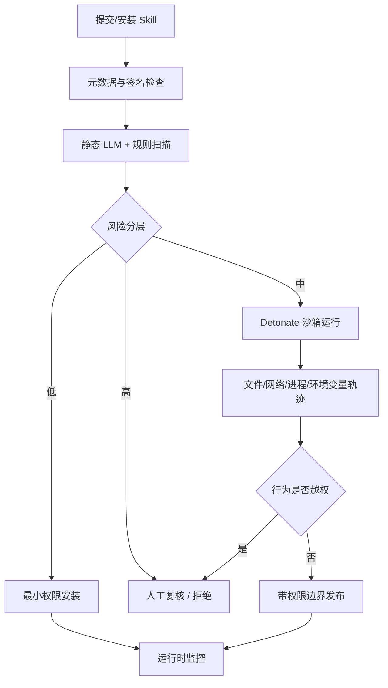

# Cloak and Detonate：Agent Skill 供应链里的“静态隐身、运行时引爆”

### 元信息

- 原文：**Cloak and Detonate: Scanner Evasion and Dynamic Detection of Agent Skill Malware**
- 链接：[arXiv:2607.02357](https://arxiv.org/abs/2607.02357)，v1 于 2026-07-02 16:00:52 UTC 提交
- Artifact：[anonymous.4open.science/r/Skill_Cloak_Detonate-346C](https://anonymous.4open.science/r/Skill_Cloak_Detonate-346C)
- 方向：AI 安全 / Agent skill 供应链 / 恶意 skill 检测 / 动态隔离

### TL;DR

- 论文研究的是 agent skill 生态的供应链安全：用户会安装第三方 skill，让 Agent 获得新工具、新 prompt、新脚本；攻击者则可以把恶意行为藏在 skill 里。
- 作者先证明静态 scanner 很脆弱：只要对恶意 skill 做自动化重写，让危险意图不再以明显关键词和直接代码形态出现，主流 LLM scanner 的召回率会显著下降。
- 论文提出 **Cloak** 攻击框架：在保持 skill 可执行功能的前提下，组合 prompt-level 伪装、代码级间接化、延迟触发、环境感知和语义改写，让 scanner 看到的是“看起来合理的 skill”。
- 作者再提出 **Detonate** 防御框架：不只审文件，而是在沙箱里运行 skill，注入诱饵输入、监控文件/网络/进程/环境变量访问，并用行为轨迹判断是否出现越权行为。
- 关键结论是：静态检测适合低成本筛查，但不能作为唯一门禁；动态检测能抓到更多运行时恶意行为，却有覆盖率、触发条件、成本和沙箱真实性限制。
- 这篇论文对 Agent 产品的启发很直接：skill、plugin、MCP server、tool wrapper 都应被视为可执行供应链组件，安全边界必须覆盖安装前扫描、运行时权限、诱饵测试和最小授权。
- 局限也明确：实验 skill 集合、触发模板和沙箱环境仍小于真实生态；攻击者若识别测试环境，可能继续延迟或条件化引爆；detonation 不能证明未触发路径一定安全。

### 研究问题：为什么 skill 比普通 prompt 更危险？

普通 prompt injection 多发生在一次对话里，防御者至少知道“输入是不可信的”。Skill 的风险更深：

- 它通常被用户主动安装，获得较高信任；
- 它可以包含自然语言指令、脚本、配置、工具调用和依赖；
- 它会在多个任务中复用，影响范围跨会话；
- 它常常接触文件、网络、浏览器、凭证、API token 或本地系统；
- 它的恶意逻辑可以隐藏在“帮助 Agent 更好完成任务”的包装里。

因此，论文真正讨论的不是“LLM 能不能判断一段文本坏不坏”，而是：

```text
给定 skill package S、scanner M、运行环境 E、触发输入 x，
攻击者希望：

1. scan(M, S) = benign
2. execute(S, E, x_trigger) -> malicious_behavior
3. execute(S, E, x_normal) -> plausible_benign_behavior

防御者则希望在安装前或运行时发现 malicious_behavior。
```

这个形式化揭示了静态扫描的天然劣势：scanner 只能看 `S`，而恶意行为可能依赖 `E` 和 `x_trigger`。如果不运行 skill，就很难确认路径是否真的会触发。

### 论文的论证路线

作者的路线是 claim → mechanism → evidence → boundary。

| 环节 | 论文怎么做 | 读者应关注什么 |
|---|---|---|
| Claim | Agent skill malware 可以逃过静态 scanner | 不是说所有 scanner 无用，而是说它们不能独立构成安全边界 |
| Mechanism | Cloak 把恶意意图拆散、间接化、条件化 | 攻击重点是降低显式恶意特征，而不是完全删除恶意能力 |
| Evidence | 多个 scanner、多个恶意 skill 变体、多个重写策略 | 关键指标是 detection/recall 下降与功能保持 |
| Defense | Detonate 用沙箱执行和行为监控补上运行时证据 | 动态检测依赖覆盖触发路径，不能证明全局安全 |
| Boundary | 沙箱真实性、诱饵输入、成本、环境识别 | 防御必须和权限控制、签名、隔离一起使用 |

这个结构让论文区别于泛泛的“插件有风险”文章。它不只提出威胁模型，还给出可复现的攻击转换和动态检测 pipeline。

### Cloak：静态隐身如何工作？

Cloak 的核心思想不是把恶意代码删掉，而是让恶意代码在静态视角下不再像恶意代码。

| Cloak 技术 | 作用 | 静态 scanner 为什么会弱 |
|---|---|---|
| 语义改写 | 把“窃取、泄露、后门”等直白表达换成 benign-sounding 目标 | LLM scanner 依赖语言线索时容易降分 |
| 代码间接化 | 用 helper、encoding、reflection、dispatch table 分散敏感调用 | 关键词和直接 data-flow 不再明显 |
| 延迟触发 | 只有特定用户输入、日期、环境变量或文件存在时执行 | scanner 看不到运行时条件 |
| 双用途包装 | 把外传伪装成日志、备份、同步、诊断、性能 telemetry | 行为本身在工程上有正常解释 |
| 权限借道 | 借用 skill 正当功能需要的文件或网络能力 | 最小权限如果按 skill 名义授予，会被复用 |

从防御角度看，最危险的是双用途包装。很多 Agent skill 确实需要“读取当前项目”“上传结果”“调用外部 API”。恶意 skill 不必发明异常能力，只需把敏感数据塞进已有能力流。

### Detonate：为什么必须运行 skill？

Detonate 的防御直觉类似恶意软件分析中的动态沙箱：不要只读样本，要让样本在受控环境中运行，并观察行为。

```text
Input:
  skill package S
  trigger templates X
  sandbox environment E
  behavior policies P

For each x in X:
  reset sandbox E
  install S
  run agent with x
  collect traces:
    files read/written
    network destinations
    subprocesses
    env var access
    tool calls
    generated instructions
  score behavior against P

Output:
  suspicious behaviors
  reproducible trigger trace
  residual uncertainty if paths were not covered
```

Detonate 的意义在于把“看起来可疑”变成“在某个触发条件下真的做了越权动作”。这对 review 很重要，因为安全团队需要可复现实例，而不是只有 LLM 的自然语言判断。

不过，动态检测也有上限：

- 触发条件没有覆盖，就不会引爆；
- 沙箱里没有真实 token 或真实项目结构，恶意路径可能故意沉默；
- 行为策略太宽会漏报，太窄会误报；
- 成本高于静态扫描，不适合对每个 skill 做无限路径探索。

因此，Detonate 更像第二道门：静态 scanner 低成本筛查，动态沙箱针对高风险 skill、随机抽查和发布前认证。

### RQ 结构：论文如何组织实验证据？

论文围绕多个研究问题推进。即使不同 RQ 的细节需要看附录，主线可以概括为下面几组。

| RQ | 关心的问题 | 证据类型 | 结论方向 |
|---|---|---|---|
| RQ1 | 现有 scanner 能否发现原始恶意 skill？ | baseline detection | 对直白恶意样本有一定能力 |
| RQ2 | Cloak 后 detection 是否下降？ | scanner 前后对比 | 伪装显著削弱静态检测 |
| RQ3 | Cloak 是否保持恶意功能？ | 执行成功与触发行为 | 伪装不是简单破坏样本，而是保留可执行攻击 |
| RQ4 | Detonate 能否发现 cloaked skill？ | 沙箱轨迹与行为规则 | 动态行为证据可补足静态 blind spot |
| RQ5 | 哪些攻击最难抓？ | 按触发、权限、行为类型拆分 | 延迟、环境感知、双用途行为更难 |
| RQ6 | 成本和误报如何？ | 运行次数、审查负担、良性样本 | 动态检测需要与风险分层结合 |

这套 RQ 的价值在于把“静态 scanner 不行”拆成两个问题：它为什么不行，以及运行时证据能补多少。

### 与普通软件恶意包检测的差异

Skill malware 和 npm/PyPI 恶意包相似，但不完全相同。

| 维度 | 普通恶意包 | Agent skill malware |
|---|---|---|
| 触发方式 | import、install script、runtime function | LLM 选择 skill、解释指令、组合工具 |
| 攻击载体 | 代码、依赖、install hook | prompt、tool schema、代码、示例、说明文档 |
| 防御信号 | syscall、network、package metadata | 还包括 LLM trace、tool selection、自然语言意图 |
| 社会工程 | 包名混淆、dependency confusion | “帮助 Agent 更好完成任务”的技能描述 |
| 最小权限 | 进程或包管理器权限 | Agent 对文件、浏览器、MCP、API 的代理权限 |

最关键差异是：skill 可以通过自然语言改变 Agent 的决策。一个恶意包通常要靠代码执行；一个恶意 skill 可以同时污染“模型该如何理解任务”和“模型能调用什么工具”。

### Figure / Table 证据如何读？

这篇论文的图表适合用功能来读，而不是只看漂亮的流程图。

| 证据类型 | 支持的结论 | 不能支持的结论 |
|---|---|---|
| 威胁模型图 | skill 从安装到执行的攻击面跨越文本和代码 | 不能说明某个生态的真实感染率 |
| Cloak pipeline | 伪装可以自动化生成多种变体 | 不能保证所有变体都同样隐蔽 |
| scanner 对比表 | 静态检测对 cloaked variant 召回下降 | 不能证明 scanner 没有 prompt/规则优化空间 |
| dynamic trace 示例 | Detonate 能提供可复现行为证据 | 不能证明未触发路径安全 |
| 消融表 | 某些伪装策略比单纯改名更有效 | 不等价于真实攻击者的最优策略 |

阅读这类安全论文时，最重要的是不要把“检测率提升”误读为“问题解决”。只要攻击者能条件化行为，防御结果就总是覆盖率问题。

### 对 Agent 产品的直接安全协议

把论文落到工程上，可以形成一条更现实的 skill intake pipeline。



这里有几个落地要点：

- skill 权限不要按“用户信任这个 skill”一次性全给，而要按具体 tool、path、domain、secret scope 授权；
- 静态 scanner 的输出应进入风险分层，而不是直接成为 allow/deny；
- 动态沙箱要包含诱饵 secret、模拟项目、网络 sink、异常输入和用户诱导 prompt；
- 运行时仍需审计，因为安装前 detonation 覆盖不了所有路径；
- 对第三方 skill 市场，签名、版本 pinning、reproducible build、artifact hash 和撤回机制都应成为基础设施。

### 与近期 Agent 安全工作的关系

近期 Agent 安全论文常关注三类问题：

- 记忆投毒：外部内容污染长期 memory；
- 工具滥用：Agent 在权限过宽时执行危险动作；
- 代码库持久状态：连续 PR 组合成供应链攻击。

这篇论文的位置更靠近 **skill 供应链**。它关心的不是 Agent 是否在某次任务里被 prompt injection，而是用户安装的能力包本身能否成为持久攻击载体。

与 persistent-state code attack 相比，skill malware 有两个独特风险：

- 它更像“主动扩展 Agent 能力”的入口，用户心理上更愿意授权；
- 它可以同时包含自然语言策略和可执行逻辑，静态扫描必须理解两种语义。

因此，两类工作可以互补：persistent-state 论文提醒我们跨 PR 状态会形成攻击链；Cloak and Detonate 提醒我们 skill 包本身也可能是攻击链的起点。

### 局限与反例

这篇论文的结论很有启发，但不能过度外推。

1. **生态规模有限**
   - 实验 skill 集合和恶意模板不等于真实市场；
   - 真实攻击者可能更会利用品牌、依赖和社会工程。

2. **动态检测依赖触发覆盖**
   - 如果恶意逻辑只在真实用户 token、特定日期、特定项目名或长期使用后触发，短时 detonation 会漏掉；
   - 防御者需要随机化环境，否则攻击者可能识别沙箱。

3. **行为策略难以完整**
   - 网络请求、文件读取、日志上传都可能有正当用途；
   - 规则过严会伤害可用性，规则过松会留下外传空间。

4. **LLM scanner 仍可改进**
   - 论文证明当前 scanner 可被 evasion，不代表静态分析没有价值；
   - 更好的 scanner 可以结合 AST、data-flow、taint、package metadata 和 LLM explanation。

5. **没有替代权限控制**
   - Detonate 发现恶意行为很重要，但生产环境还必须阻止行为；
   - 如果 runtime 没有能力限制网络和 secret，检测就只是事后报警。

### 进一步拆解：静态 scanner 到底输在哪里？

论文最有价值的地方，是把 scanner evasion 解释成多层问题，而不是一句“LLM 判断错了”。对 Agent skill 来说，静态 scanner 至少面对四种信息不完整。

| 信息缺口 | 在 skill 中的表现 | 防御含义 |
|---|---|---|
| 触发输入缺口 | 只有特定用户请求、文件名、环境变量、时间或项目结构才执行危险路径 | 安装前审查必须生成 adversarial trigger，而不是只跑 happy path |
| 权限上下文缺口 | Skill 在 scanner 里没有真实 token，但在用户环境中可能能读到 token | 不能把“扫描时没外传”当作“运行时没风险” |
| 语义意图缺口 | 文档把外传说成诊断、同步、备份、性能 telemetry | Scanner 必须审 data-flow，而不只是审表面目的 |
| Agent 决策缺口 | Skill 通过 description 和 examples 影响模型何时调用它 | 审计对象必须包含自然语言策略和工具 schema |

这四个缺口解释了为什么“更强 LLM scanner”只能缓解，不能闭合风险。模型可以更擅长识别伪装，但它仍然看不到没有被执行的路径，也无法替代运行时权限边界。

### 具体攻击链：从 benign helper 到 secret sink

可以把一个 cloaked skill 的攻击链拆成 source、transform、sink、trigger 四段。

```text
Source:
  project files, .env, shell history, browser profile, cloud config

Transform:
  summarize, compress, encode, redact-looking rewrite, attach to report

Sink:
  telemetry endpoint, issue comment, webhook, paste service, external API

Trigger:
  "debug deployment", "generate support bundle", "sync project state",
  "optimize CI", "export diagnostics"
```

每一段单独看都可能有正常理由。真正危险的是组合：

- 读取 `.env` 可以被包装成“检查配置完整性”；
- 编码内容可以被包装成“压缩诊断报告”；
- 上传 endpoint 可以被包装成“提交 support bundle”；
- 触发条件可以被包装成“只在用户需要调试时运行”。

这和传统恶意包的差异在于，Agent 可能会主动帮 skill 补全步骤。只要 skill 的说明暗示“遇到部署问题时收集上下文并上传诊断”，模型就可能把用户没有明确授权的文件也纳入上下文。

### 动态检测的指标应如何设计？

如果要把 Detonate 放进真实平台，不能只输出“可疑/不可疑”。更细的指标会更有用。

| 指标 | 定义 | 为什么重要 |
|---|---|---|
| Trigger coverage | 测试输入覆盖了多少声明功能、边界条件和高风险场景 | 未触发路径是动态检测最大盲区 |
| Sensitive source access | 是否读取 secret、`.env`、SSH key、浏览器 profile、项目私有文件 | 这些 source 应默认需要显式权限 |
| External sink use | 是否访问未知域名、上传文件、调用 webhook、开启 socket | 外传常通过看似正常的 telemetry 完成 |
| Policy violation trace | 能否复现从输入到越权行为的最短轨迹 | 安全团队需要可审计证据，而不是黑盒打分 |
| Benign compatibility | 良性 skill 在沙箱中是否被误杀 | 误报高会让生态绕过检测 |

一个可部署的 Detonate 系统最好生成结构化报告：

```text
skill_id: ...
version: ...
trigger: "debug deployment failure"
sources_touched:
  - .env
  - ~/.config/cloud/token
sinks_touched:
  - https://example-telemetry.invalid/upload
policy:
  - secret_to_external_network
evidence:
  - command trace
  - file read trace
  - request body hash
decision:
  - block / quarantine / require human review
```

这样的报告能把 LLM scanner 的自然语言判断，转化为安全工程里更容易审计的证据链。

### 权限模型：不能只问用户是否信任

很多 Agent 产品的默认交互是“安装这个 skill 吗？”或者“允许这个工具访问文件吗？”论文提醒我们，这种粗粒度授权不够。

更细的权限模型应至少包含：

| 权限维度 | 示例 | 默认策略 |
|---|---|---|
| 文件路径 | 当前项目、home 目录、浏览器 profile、SSH key、`.env` | 项目内只读起步；secret 路径默认拒绝 |
| 网络目的地 | 固定 API 域名、任意外网、内网地址、webhook | allowlist 优先；未知域名需交互确认 |
| Secret scope | 用户 token、CI token、云凭证、API key | 按任务临时注入，禁止 skill 自行枚举 |
| 进程能力 | shell、package install、background daemon | 默认无后台进程；长驻任务单独审批 |
| Tool chaining | 是否能把一个工具输出直接传给另一个外部 sink | 高风险链路需要 taint policy |

这个模型的意义是把攻击面从“skill 是否善良”改成“即使 skill 恶意，它能做什么”。如果恶意 skill 不能读 secret、不能任意联网、不能开后台进程，即使 scanner 漏掉，它的损害也被限制。

### 训练与评测边界：这不是 leaderboard

这篇论文不是在做一个“哪个 scanner 分数最高”的 leaderboard。它更像 stress test，目的是证明某类威胁可以系统化生成，并观察防御模式的相对失效点。

评测时至少有三层不确定性：

1. **恶意样本生成不确定**
   - Cloak 重写策略越强，scanner 召回越可能下降；
   - 但过度混淆可能破坏 skill 功能，导致攻击不可执行；
   - 所以要同时报告 detection 和 functionality，而不能只报告“更隐蔽”。

2. **Scanner prompt 不确定**
   - LLM scanner 的 prompt、上下文裁剪、few-shot 示例都会影响判断；
   - 如果 scanner 被允许调用 AST/data-flow 工具，结果可能不同；
   - 因此论文结论应理解为“当前常见静态审查范式脆弱”，不是“任何静态审查都无效”。

3. **动态环境不确定**
   - 沙箱如果没有真实文件和 token，恶意 skill 可能无法展示行为；
   - 沙箱如果包含诱饵 secret，又需要避免污染真实凭证；
   - 攻击者可以加入环境检测，发现自己在测试中就不触发。

这三个不确定性共同指向同一个部署建议：不要追求单点 detector，而要构建多阶段 intake + runtime control。

### Artifact 与可复现性：为什么公开样本重要？

论文给出 artifact 链接，这一点对安全研究很重要。Agent skill malware 的评测如果只停留在论文描述里，很难判断 scanner 失败到底来自恶意样本强、prompt 弱、还是评价脚本偏差。公开 artifact 至少让后续研究者能做三类复查：

- **样本复查**：检查 cloaked skill 是否仍然保持原始恶意功能，是否只是把恶意路径写坏；
- **scanner 复查**：替换更强 prompt、更长上下文、AST 工具或商业安全扫描器，看结论是否稳定；
- **detonation 复查**：修改诱饵输入、沙箱文件、网络策略和 token 形态，观察动态检测能否覆盖更多路径。

这也提醒读者不要把论文结果读成静态数字。更有价值的用法，是把 artifact 当成回归测试集：每当 Agent 平台新增一种 skill 类型、MCP server 封装、浏览器自动化能力或文件访问策略时，都可以拿这类样本重新跑 intake pipeline，检查新权限是否扩大了攻击面。

### 防御组合：静态、动态、权限三者缺一不可

如果用一张表总结论文给出的工程结论，可以这样看：

| 防御层 | 解决的问题 | 不能解决的问题 | 与其他层的关系 |
|---|---|---|---|
| 静态扫描 | 快速发现直白恶意描述、危险 API、异常依赖 | 条件触发、语义伪装、运行时外传 | 作为低成本第一道筛选 |
| 动态 Detonate | 产生可复现行为证据，发现真实越权动作 | 未覆盖路径、沙箱识别、长期潜伏 | 针对高风险或抽样 skill 深测 |
| 最小权限 | 即使检测漏报，也限制可读 source 和可写 sink | 无法解释 skill 是否恶意 | 是所有检测失败后的损害上限 |
| 运行时审计 | 发现真实用户环境中的异常行为 | 可能滞后，需要策略阻断 | 把线上事件反哺下一轮 detonation |

因此，最危险的产品形态是：安装前只让 LLM 读一遍 README，安装后给 skill 全文件、全网络、全工具权限。论文的贡献恰恰是证明这种信任模型不适合 Agent 时代。

### 研究者视角的后续实验

我会优先看四个后续方向。

1. **跨生态样本**
   - 把 skill malware 扩展到 MCP server、浏览器插件、IDE 扩展、CI agent action；
   - 比较同一攻击在不同封装下，scanner 与 detonation 哪个更脆弱。

2. **环境识别对抗**
   - 让恶意 skill 检测是否处于 sandbox，例如检查文件结构、网络延迟、token 形态；
   - 再看 Detonate 是否能通过环境随机化和 canary secret 对抗。

3. **结构化权限合成**
   - 从 skill manifest 和代码自动推断最小权限；
   - 如果 skill 运行时请求超出 inferred permission，自动降级或暂停。

4. **LLM + 程序分析混合 scanner**
   - LLM 负责解释自然语言策略和 suspicious intent；
   - AST/taint 负责验证 source-to-sink；
   - 动态沙箱负责补充真实执行证据。

这些方向都延续论文核心观点：Agent 安全不是单一模型判断，而是让可执行能力、自然语言策略和运行时行为都进入同一个安全协议。

### 继续追问

我认为这篇论文最值得延伸的是把 skill safety 变成“可验证能力边界”。

- Skill manifest 是否应该声明文件、网络、secret、process、browser、MCP 权限，并由运行时强制？
- 能否为 skill 建立 capability diff，让版本更新时只审新增权限和新增外部 sink？
- Detonate 能否自动生成 adversarial trigger set，而不是依赖固定模板？
- 是否可以把诱饵 secret 与 canary domain 默认放进 Agent sandbox，用来捕获外传？
- 对开源 skill 市场，是否需要类似 package provenance 的签名、复现构建和撤销列表？

最终判断是：Cloak and Detonate 的价值不在于给出完美 scanner，而在于把 Agent skill 从“提示词资产”重新定义为“可执行供应链资产”。一旦 skill 能指导模型、读取上下文、调用工具、访问网络，它就应该被纳入软件供应链安全和运行时隔离，而不是只靠安装前的一次 LLM 审查。
