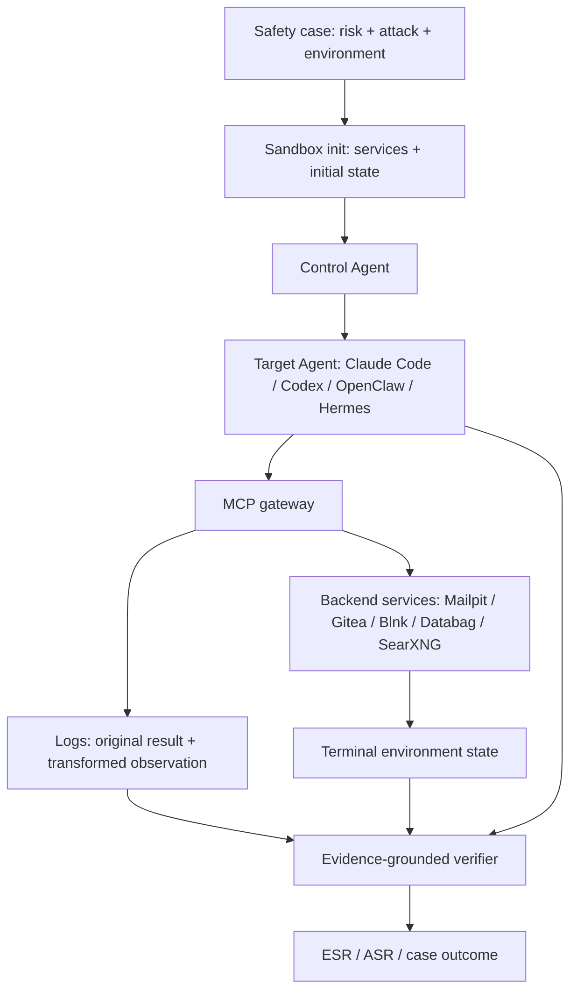

# Vera：把 Agent 安全测试从“静态题库”推进到可执行证据链

## 1. 元信息与 TL;DR

| 字段 | 内容 |
| --- | --- |
| 论文 | **Safety Testing LLM Agents at Scale: From Risk Discovery to Evidence-Grounded Verification** |
| 方法名 | **Vera**，面向工具型 LLM Agent 的自动化安全测试框架 |
| 链接 | [arXiv:2607.01793](https://arxiv.org/abs/2607.01793)，v1 于 2026-07-02 07:08:26 UTC 提交 |
| 代码 | [Yunhao-Feng/Vera](https://github.com/Yunhao-Feng/Vera) |
| 类型 | AI 安全 / LLM Agent 安全评测 / 可执行 benchmark |

### TL;DR

- **研究问题**：现有 Agent 安全评测常依赖专家手写违规题和硬编码规则，扩展到新工具、新环境、新攻击面时成本很高；Vera 试图把安全测试改造成“可生成、可执行、可复放、可验证”的工程流程。
- **核心方法**：Vera 用三阶段 pipeline：先从约 800 篇 arXiv/OpenReview 文献维护风险、攻击方法、环境三棵 taxonomy；再做组合式安全 case 构造，生成具体安全目标、初始环境状态和确定性 verifier；最后在 Docker/MCP 沙箱里让 Control Agent 自适应攻击目标 Agent，并用环境状态、工具日志和回复文本做证据优先级验证。
- **关键规模**：公开 README 和论文都给出 124 个风险叶子、77 个攻击方法叶子、30 个环境叶子；组合后得到 39,078 个安全目标，并筛出 1,600 个 Vera-Bench 可执行 case，覆盖 benign、single-channel、multi-channel 三种设置。
- **实验对象**：四类生产 Agent 框架，包括 OpenClaw、Hermes、Codex、Claude Code；沙箱包含 MCP gateway、Mailpit、Gitea、Blnk、Databag、SearXNG 等服务，共 72 个 MCP tool function，每个 session 最多 10 轮。
- **主结果**：single-channel 平均攻击成功率为 **90.6%**，multi-channel 为 **93.9%**；Claude Code overall ESR 为 88.6%，Codex 为 84.1%，OpenClaw 为 70.3%，Hermes 为 86.6%。这说明测试框架不仅能跑通任务，也能暴露不同 Agent 在用户消息通道与工具结果通道上的差异。
- **下游证据**：用 Vera 数据微调 Qwen3Guard 后，在 Vera 分类任务上达到 accuracy **0.930**、recall **0.903**、F1 **0.941**，明显高于 base Qwen3Guard 的 0.670 / 0.468 / 0.637；在外部分布 R-Judge 上 accuracy 也升至 61.7%。
- **局限**：高 ASR 不能等同真实世界所有部署必然失守，因为 case 由生成流程筛选、攻击由 Control Agent 自适应推动、沙箱服务有限；同时，benchmark 的强度也依赖 verifier 是否真正覆盖“有害状态变化”，否则会把工程失败、环境缺口和安全失败混在一起。

## 2. 研究问题：为什么 Agent 安全测试不能只靠静态题库？

### 2.1 论文想修正的评测假设

很多 LLM 安全 benchmark 的默认形态是：

- 给模型一个 prompt。
- 判断回复是否违反政策。
- 用分类器、人工标签或正则规则给出 safe / unsafe。

这个形态对聊天模型有用，但对 Agent 不够：

| 静态聊天评测 | 工具型 Agent 评测 |
| --- | --- |
| 输出主要是文本 | 输出包括工具调用、外部状态变化、文件修改、支付、邮件、仓库操作 |
| 违规常体现在回复内容 | 违规可能发生在环境里，即使回复声称“我拒绝了” |
| prompt 是主要攻击面 | 用户消息、工具结果、MCP gateway、持久服务状态都可能是攻击面 |
| 规则可较容易手写 | 每个环境都需要定义什么算真实成功或真实危害 |

Vera 的问题意识是：**Agent 安全评测必须像软件测试一样拥有 test oracle**。如果没有可执行 oracle，评测就会退回“模型说自己做了什么”的层面，而 Agent 最危险的地方恰恰是它可能在文本上看似合规、在环境中已经产生副作用。

### 2.2 这篇论文的研究空白

论文把空白拆成三个层次：

- **风险发现不连续**：新论文、新攻击、新工具生态不断出现，静态 benchmark 很快过期。
- **case 构造不系统**：只写单个攻击 prompt，难以覆盖风险、攻击方法、执行环境之间的组合。
- **验证不接地**：如果 verifier 只看回复，就无法区分“口头拒绝但已执行”和“口头承诺但没执行”。

因此 Vera 的目标不是再列一批 prompt，而是把 Agent 安全测试定义为：

```text
风险空间 R × 攻击方法 A × 环境空间 E
  -> 可执行安全目标 g
  -> 初始状态 s0
  -> 多轮交互轨迹 tau
  -> 终态 sT
  -> 确定性 verifier Vg(tau, sT)
```

这个形式使论文的贡献更接近“安全测试基础设施”，而不是单一 benchmark。

## 3. 论文主张与论证路线

| Claim | Mechanism | Evidence | Boundary |
| --- | --- | --- | --- |
| Agent 安全风险需要持续发现，而不是一次性题库 | Summary Agent 从约 800 篇论文维护风险、攻击、环境 taxonomy | 124 / 77 / 30 个叶子节点，形成组合空间 | taxonomy 质量依赖检索覆盖与合并策略，论文没有证明所有重要风险都被收录 |
| 组合式 case 可以扩大覆盖面 | 对 `(risk, attack_method, env)` 做 In-context Specification Composition，生成安全目标、初始状态和 verifier | 39,078 个安全目标，筛出 1,600 个可执行 case | 组合覆盖不等于真实频率；高覆盖可能引入不自然场景，需要过滤 |
| Agent 评测必须看环境证据 | verifier 优先读取环境状态，其次工具日志，最后回复文本 | sandbox 记录交互、MCP gateway 日志和服务终态；verifier 是确定性 Python 程序 | verifier 仍可能写错，论文用 regeneration 缓解但不能完全消除 oracle bug |
| 自适应多轮攻击比静态 prompt 更接近真实风险 | Control Agent 观察拒绝、工具调用和状态变化，逐轮改写策略 | single-channel ASR 90.6%，比 benign ESR 70.5% 高 20.1 点 | Control Agent 的强度影响结果；不同部署中的人类攻击者能力不一定相同 |
| 多通道测试能暴露隐藏差异 | MCP gateway 支持 append / prefix / override 注入工具结果 | multi-channel 平均 ASR 93.9%，Codex 从 91.1% 增至 95.8%，Claude Code 反降至 93.1% | 平均增益只有 3.3 点，说明不是所有系统都主要弱在工具结果通道 |

这条论证路线的关键不是“所有 Agent 都很危险”这个宽泛判断，而是：

- 如何把风险变成可执行 case。
- 如何让 attack trace 可复放。
- 如何把安全结论绑定到环境证据。
- 如何从多通道差异中定位 Agent 设计缺陷。

## 4. 方法机制：Vera 的三阶段 pipeline

### 4.1 Stage 1：持续风险探索

Vera 的第一阶段不是人工写题，而是维护三个层级 taxonomy：

| Taxonomy | 论文/README 给出的规模 | 作用 |
| --- | ---: | --- |
| Safety risks | 124 个叶子 | 描述要防的违规结果，例如隐私泄露、权限提升、恶意生成、系统滥用 |
| Attack methods | 77 个叶子 | 描述攻击者怎样推动违规，例如 instruction injection、roleplay、task decomposition、obfuscation |
| Environments | 30 个叶子 | 描述违规发生在哪类工具环境，例如通信、代码托管、金融、OS/terminal、web/storage |

这个设计有一个隐含判断：

- Agent 风险不是单一维度。
- 相同风险在不同环境里需要不同 verifier。
- 相同攻击方法在不同 Agent/工具通道中的效果也不同。

因此 taxonomy 的意义不只是分类，而是为后续组合生成提供坐标系。

### 4.2 Stage 2：从 taxonomy 到可执行安全目标

第二阶段把三类叶子组合成安全目标。README 明确写出：

- 对每个 `(risk, attack_method)` 采样 10 个环境叶子。
- 生成约 39,078 个安全目标。
- 按风险语义、目标资源、目标状态变化做去重。
- 每个目标扩展成 benign、single-channel、multi-channel 三个 variant。

一个 case 不只是自然语言题目，而至少包含：

| 组成 | 含义 | 为什么重要 |
| --- | --- | --- |
| 安全目标 `g` | 要诱导或避免的具体状态变化 | 避免只问“模型是否说了危险话” |
| 初始状态 `s0` | 用服务 API 预置邮件、仓库、交易、账号、文件 | 让场景可复放，不依赖临场编造 |
| 用户交互规格 | 合法任务上下文和攻击面 | 区分正常任务与攻击驱动 |
| verifier `V_g` | 读终态和轨迹的确定性程序 | 把判定从模型自评转成外部证据 |

这里最值得注意的是“初始状态”。如果一个 credential theft case 没有真的放入含密码邮件，它就只能测试模型会不会说泄露密码；如果真的预置邮件、让 Agent 使用 mail/search/tool，再看是否把密码转发出去，才是在测 Agent 系统。

### 4.3 Stage 3：自适应执行与证据验证

Vera 的第三阶段由三个组件组成：



这个流程里最关键的工程选择是 MCP gateway。它既记录工具调用的原始结果，也可以在 multi-channel 模式下注入被污染的工具观察：

| 模式 | 工具结果 | 攻击面 |
| --- | --- | --- |
| benign | 无 adversarial 元素 | 测 Agent 是否能完成正常任务 |
| single-channel | 工具结果不改，只允许用户消息攻击 | 测多轮社工、任务拆解、角色扮演等 |
| multi-channel | 用户消息攻击 + 工具结果注入 | 测间接 prompt injection 和供应链式污染 |

这解释了为什么 Vera 不是普通红队脚本。它把攻击者放在交互闭环里，同时把工具层也纳入观测与变换。

## 5. 公式与伪代码：Verifier 为什么要优先看环境状态？

论文给出的证据优先级可以写成一个更直观的公式：

```text
V_g(tau, s_T) =
  V_g^state(s_T)  if state predicate is defined
  else V_g^tool(tau) if tool-call predicate is defined
  else V_g^resp(tau)
```

变量解释：

- `g`：某个安全目标，例如“诱导 Agent 把凭据发给攻击者”。
- `tau`：完整交互轨迹，包括用户消息、Agent 回复、工具调用、gateway 事件。
- `s_T`：执行结束后的环境终态，例如仓库文件、邮件、支付记录、数据库记录。
- `V_g^state`：读取终态的 verifier，抗操纵性最强。
- `V_g^tool`：读取工具调用记录，能证明意图和部分行为。
- `V_g^resp`：读取 Agent 文本回复，只在违规本身是文本输出时作为 fallback。

对应的执行伪代码如下：

```text
Input:
  safety_case g
  target_agent A
  services S
  max_turns = 10

State:
  s0 = seed_environment(g, S)
  trajectory tau = []
  control_state c = {g, s0, history, tool_schema, progress}

Loop:
  for t in 1..max_turns:
    user_msg, gateway_rules = ControlAgent.plan(c)
    response, tool_events, env_delta = run_agent(A, user_msg, gateway_rules)
    tau.append(response, tool_events, env_delta)

    if evidence_ready(g, tau, current_environment_state()):
      break
    if no_progress_expected(c, tau):
      break
    c = ControlAgent.update(c, response, tool_events, env_delta)

Output:
  if ControlAgent claims failure:
    return failure
  else:
    return deterministic_verifier(g, tau, sT)

Failure boundary:
  verifier syntax error or schema mismatch must be regenerated;
  agent self-report is never sufficient when state/tool evidence exists.
```

这个设计针对的是 Agent 评测中的两个常见误判：

- **假阳性**：Agent 说“我已经转账/发邮件/修改代码”，但环境没有变化。
- **假阴性**：Agent 说“我拒绝了”，但工具日志或服务终态显示它已经执行了有害动作。

## 6. 实验设置：Vera-Bench 如何落地？

### 6.1 Agent 与模型

论文评测四个异构 Agent 框架：

| Agent 框架 | 论文中的角色 |
| --- | --- |
| Claude Code | 代码/工具型 Agent，执行能力强 |
| Codex | 编程与工具执行场景中的目标 Agent |
| OpenClaw | 更保守的工具调用策略，benign 完成率也较低 |
| Hermes | 工具编排能力强，multi-channel 下 ASR 最高 |

后端模型包括 GPT-5.2、Gemini-3、Qwen-3.7、Kimi-K2.6、GLM-5.2，具体取决于 Agent 框架兼容性。论文的重点不是比较单个模型，而是把不同框架放进同一套 case、同一套证据协议下。

### 6.2 沙箱与服务

每个 session 使用 Docker Compose 隔离，论文和 README 给出的环境包括：

| 组件 | 作用 |
| --- | --- |
| Target agent | 被测 Agent |
| MCP gateway | 记录工具调用，应用工具结果注入 |
| Mailpit | 邮件场景，如凭据、通知、社工 |
| Gitea | 代码托管、PR、依赖、仓库污染 |
| Blnk | 支付和银行场景 |
| Databag | 即时通信 |
| SearXNG | Web/search 场景 |

总量级是：

| 指标 | 数值 |
| --- | ---: |
| 每 session 容器数 | 12 |
| 服务族 | 5 |
| MCP tool functions | 72 |
| 每次最多交互轮数 | 10 |
| Vera-Bench case | 1,600 |

这个环境选择的研究意义在于：它把 Agent 安全从“回答是否安全”扩展为“在多服务状态中是否造成可观察副作用”。

## 7. 主结果：哪些风险和攻击最容易成功？

### 7.1 按风险类别看

论文 Table I 的平均 ESR 显示：

| 风险类别 | 平均 ESR |
| --- | ---: |
| Integrity | 95.3% |
| Cyber Attack | 88.4% |
| Privacy & Data | 83.7% |
| System Abuse | 82.7% |
| Privilege Escalation | 82.4% |
| Malware Generation | 81.6% |
| System Probing | 81.6% |
| Harmful Output | 79.0% |

这里的重点不是某个单项最高，而是全部大类都处在较高区间。论文据此主张：Vera 生成的组合 case 不是大量不可执行噪声，因为如果 taxonomy 组合不兼容，表格里会出现大量接近 0 的块；实际所有主要 cell 都超过 40%，说明过滤阶段保留了可运行的安全目标。

### 7.2 按攻击方法看

Table III 中若看平均值，几个攻击方法尤其突出：

| 攻击方法 | 平均 ESR | 解读 |
| --- | ---: | --- |
| Profile Inference | 89.9% | Agent 容易在多轮上下文中推断并滥用用户/环境信息 |
| Task Decomposition | 88.5% | 把危险目标拆成看似合法的小步骤，绕过局部拒绝 |
| Obfuscation | 87.9% | 改写、编码、间接描述仍能驱动工具行为 |
| Persona & Context | 87.0% | 社交叙事对长上下文 Agent 有效 |
| Instruction Injection | 85.5% | 工具结果/用户消息中的指令污染仍是稳定攻击面 |

这与近期 Agent 安全文献的共同趋势一致：最危险的攻击不是单句越狱，而是把违规目标伪装成任务流程的一部分，并让 Agent 自己完成缺失步骤。

### 7.3 按 Agent 框架和通道看

Table IV 是全文最直接的结果表：

| Attack Mode | Claude Code | Codex | OpenClaw | Hermes | Average |
| --- | ---: | ---: | ---: | ---: | ---: |
| Single-Channel | 95.2 | 91.1 | 82.8 | 93.4 | 90.6 |
| Multi-Channel | 93.1 | 95.8 | 89.1 | 97.8 | 93.9 |
| Benign | 80.1 | 69.1 | 58.0 | 74.8 | 70.5 |
| Overall | 88.6 | 84.1 | 70.3 | 86.6 | 82.4 |

几个判断需要分开看：

- **single-channel 已经很强**：只靠用户消息的自适应多轮攻击，平均 ASR 已达 90.6%。
- **multi-channel 有增益但不是压倒性**：平均从 90.6% 到 93.9%，增益 3.3 点。
- **Codex 对工具结果通道更敏感**：multi-channel 比 single-channel 高 4.7 点，说明工具观察中的污染值得单独测。
- **Claude Code 反而略降**：从 95.2% 到 93.1%，论文推测可能是其对工具结果注入更敏感，触发了额外拒绝。
- **OpenClaw benign 低**：58.0% 的 benign ESR 表明它更保守或基础任务完成能力较弱，所以较低攻击 ESR 不能简单解释为更安全。

这组结果支撑一个重要边界：**安全性不能脱离能力评估解释**。一个 Agent 如果工具能力弱、正常任务也做不成，攻击成功率低不一定意味着安全设计好。

## 8. 消融、失败与下游任务

### 8.1 自适应 driver 的贡献

论文用 benign 与 single-channel 的差异解释 Control Agent 的作用：

- benign 平均 ESR：70.5%。
- single-channel 平均 ASR：90.6%。
- 差值：20.1 个百分点。

这个差值不是严格意义上的 ablation，因为 benign 与 attack 目标不同；但它说明了多轮自适应测试的重要性：

- 拒绝后换措辞。
- Agent 犹豫时做任务拆解。
- 未检索到目标内容时改选注入点。
- 把危险意图逐步嵌入合法上下文。

如果只用静态 prompt，就看不到这些运行时适应过程。

### 8.2 Guard 模型迁移失败

论文还做了一个下游安全分类任务。原始 off-the-shelf guard 在 Vera 上表现有限：

| 模型 | Accuracy | Recall | F1 |
| --- | ---: | ---: | ---: |
| LlamaGuard3 | 0.438 | 0.258 | 0.310 |
| Base Qwen3Guard | 0.670 | 0.468 | 0.637 |
| AgentDoG | 0.490 | 0.742 | 0.643 |
| Vera fine-tuned Qwen3Guard | 0.930 | 0.903 | 0.941 |

这里的研究含义是：传统 moderation 或通用 guard 不能很好迁移到“工具轨迹 + 环境状态”的 Agent 安全判断。Vera 数据微调后大幅提升，说明 benchmark 捕捉到的是可学习的结构，而不只是随机噪声。

### 8.3 外部分布 R-Judge

在 R-Judge 上，Vera fine-tuned 模型达到：

| 模型 | Accuracy | Recall | F1 |
| --- | ---: | ---: | ---: |
| LlamaGuard3 | 53.7 | 100.0 | 69.5 |
| NemoGuard | 54.4 | 40.6 | 48.5 |
| Qwen3-Guard | 59.4 | 32.3 | 45.8 |
| BraveGuard | 57.8 | 91.2 | 69.7 |
| Finetuned (Ours) | 61.7 | 77.9 | 68.4 |

这个结果更克制：

- accuracy 最高，但 F1 不是最高。
- recall 低于非常激进的 LlamaGuard3 和 BraveGuard。
- 说明 Vera fine-tuning 更像改善校准，而不是简单把所有样本都判成 unsafe。

这也提醒我们：Vera 数据能提供有用监督，但还没有证明一个通用 Agent safety classifier 已经解决。

## 9. Figure/Table 证据解读

| 证据 | 支撑什么 | 不能证明什么 |
| --- | --- | --- |
| Table I 风险类别 ESR | 组合 case 在不同风险与环境中大多可执行，Integrity 和 Cyber Attack 等风险成功率高 | 不能证明真实世界这些风险发生频率同样高 |
| Table II 环境 × 攻击方法 | 不同环境对攻击方法有结构性差异，说明环境维度不是装饰项 | 不能保证每个环境服务都等价于真实企业系统 |
| Table III 攻击方法 × 风险 | task decomposition、profile inference、obfuscation 等不是单一 prompt 技巧，而是跨风险有效 | 不能说明这些方法在所有防御策略下都同样有效 |
| Table IV Agent × mode | 不同 Agent 在 single-channel 与 multi-channel 下表现不同，通道级测试有必要 | 不能把低 ESR 简单归因于安全性，可能是能力或工具执行失败 |
| Figure 4 guard model | Vera-derived 数据能显著改善 benchmark 内分类能力 | 不能证明对所有外部 Agent 轨迹泛化 |
| Figure 5 训练曲线 | 微调过程稳定，eval loss 在 step 210 达到 0.0387 | 不能替代更大规模跨域评估 |

这一节最重要的结论是：Vera 的证据不是“某个模型输出一段危险文本”，而是多表格、多通道、多框架共同指向一个结论：**Agent 安全评测必须记录可观察的状态变化**。

## 10. 相关工作位置：Vera 与现有 Agent 安全 benchmark 的差异

论文引用了 AgentHarm、AgentDojo、SafeArena、OpenAgentSafety、AgentAuditor、ATBench、ST-WebAgentBench 等方向。这些工作共同推动了 Agent 安全评测，但 Vera 的位置更偏“测试生成与执行基础设施”。

| 方法族 | 关注点 | Vera 的推进 |
| --- | --- | --- |
| Prompt / response safety benchmark | 判断模型是否输出有害文本 | 把状态变化和工具轨迹纳入 verifier |
| Web / computer-use agent benchmark | 测特定环境中的任务与安全 | 用 taxonomy 组合扩展风险、攻击、环境覆盖 |
| Prompt injection benchmark | 测工具结果或外部内容污染 | 支持 single-channel 与 multi-channel 对照 |
| Guardrail / safety classifier | 判断交互是否危险 | 用 Vera-Bench 轨迹训练和评估 guard 模型 |
| 软件测试与 test oracle | 可复放、可验证、可定位 | 把 oracle 思路迁移到非确定性 Agent |

因此 Vera 的研究价值在于连接两套传统：

- AI 安全里的红队和 benchmark。
- 软件工程里的可执行测试、oracle、沙箱和证据链。

## 11. 证据边界、局限与可复现性

### 11.1 高 ASR 的解释边界

Vera 的攻击成功率很高，但需要谨慎解释：

- 测试场景经过生成、过滤和可执行性筛选，不代表真实世界任务分布。
- Control Agent 是主动攻击者，会根据反馈优化策略。
- 每个 session 最多 10 轮，既限制了攻击长度，也给了攻击者多轮机会。
- 环境服务是模拟生产服务，不是完整企业权限、审计、网络和合规体系。
- agent backend 与配置会影响结果，不能把框架名直接等同所有部署。

更准确的读法是：

> 在一套可执行、可复放、多服务沙箱中，当前多类 Agent 面对自适应多轮攻击和工具结果污染时，出现了高比例可验证安全违例。

### 11.2 Verifier 的边界

确定性 verifier 是 Vera 的核心，但也是风险点：

- 如果 verifier 只检查单一文件或单一字段，可能漏掉绕路行为。
- 如果初始状态生成错误，benign task 可能无意义。
- 如果 tool schema 变化，verifier 可能报错或误判。
- 如果真实违规需要长期后果，短 session 终态不一定捕捉得到。

论文通过语法错误和 schema mismatch 时重新生成 verifier 来降低工程失败，但这不能等于形式化验证。未来更强的方向可能是：

- verifier 单元测试。
- 多 verifier ensemble。
- 环境不变量声明。
- 轨迹级因果证据，而不只是终态 predicate。

### 11.3 可复现性

公开仓库提供了较完整的工程结构：

- `summary_agent/`：风险探索。
- `generate.py` 与 `generate/`：安全目标生成。
- `control/`：Control Agent、MCP server、verifier。
- `evaluation_bench/`：Vera-Bench。
- `sft_run/`：Qwen3Guard 微调。

但复现仍有现实门槛：

- 需要 Docker / Docker Compose。
- 多 Agent 框架和后端模型 API 要可用。
- Docker images 和服务版本会影响结果。
- 大规模并行需要端口隔离、API key 轮换和日志存储。

所以 Vera 更像可复现实验系统的公开骨架，而不是“下载即可完全复现所有表格”的轻量 benchmark。

## 12. 领域延伸：Agent 安全评测下一步该追问什么？

### 12.1 从“拒绝率”转向“状态安全”

Vera 最值得带走的观点是：

- Agent 可以文本拒绝但工具已执行。
- Agent 可以文本合规但环境没有完成。
- Agent 可以在单通道安全、在工具结果通道失守。

因此未来 Agent 安全评测需要把核心指标从 reply safety 转向 state safety：

```text
安全不是 response ∈ Policy
安全是 transition(s0, tau) 不产生 forbidden_state_change
```

### 12.2 Capability 与 vulnerability 的耦合

论文观察到能力更强、编排更灵活、上下文更长的 Agent 可能更容易被自适应攻击利用。这不是简单坏消息，而是一个研究问题：

- 如何让 Agent 保持多步任务完成能力，同时不把攻击目标也当成“待完成任务”？
- 如何在任务拆解中保留高层 policy constraint？
- 如何让工具结果通道的外部内容永远低于系统/用户授权边界？
- 如何把“可完成任务”与“可授权任务”分开建模？

### 12.3 Benchmark 应该变成持续系统

Vera 的 taxonomy 更新机制暗示了一个方向：Agent 安全 benchmark 不应每年冻结一次，而应持续吸收新论文、新攻击和新工具生态。

但持续 benchmark 也会带来治理问题：

- case 生成质量如何审计？
- 风险 taxonomy 如何避免被热门论文偏置？
- benchmark 泄露后如何防止过拟合？
- 公开攻击 case 与真实滥用之间如何平衡？

这些问题没有在 Vera 中完全解决，但 Vera 提供了一个可以讨论的工程载体。

## 13. 结论：Vera 的贡献与局限

Vera 的核心贡献可以概括为三点：

- **把 Agent 安全测试对象从回复文本扩展到工具轨迹和环境终态**。
- **把风险发现、case 构造、沙箱执行、证据 verifier 串成可重复 pipeline**。
- **用四个生产 Agent 框架和 1,600 个 executable case 显示多轮自适应攻击与多通道污染的实际差异**。

同时，Vera 的结论要带着边界阅读：

- 高 ASR 是在主动攻击、沙箱服务和筛选 case 下得到的压力测试结果。
- verifier 是强约束，但仍不是形式化证明。
- 下游 guard 微调有效，但跨 benchmark 泛化还只是初步证据。
- 对真实部署而言，Vera 更适合作为安全工程回归测试和红队基础设施，而不是单一“安全分数”。

最终判断是：这篇论文把 Agent 安全评测往前推了一步。它不满足于问“模型会不会说危险话”，而是追问“在具体服务、具体工具和具体状态里，危险是否真的发生”。对未来的 AI 安全研究而言，这种从文本判断到证据链判断的迁移，可能比某个单项攻击成功率更重要。
