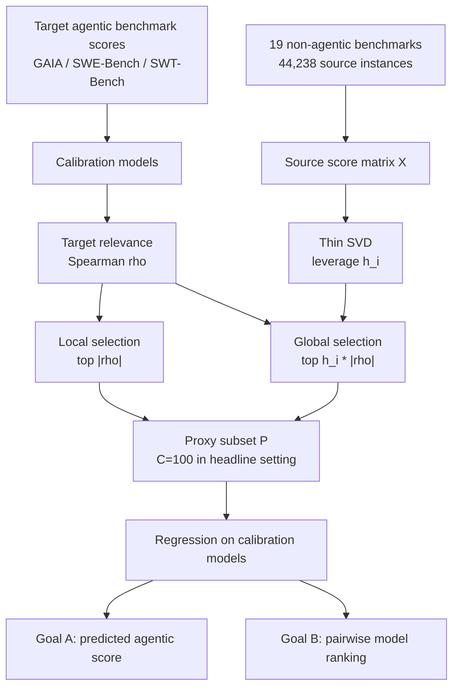

# PACE：用 100 道静态题预测昂贵的 Agent 评测

### 元信息

| 字段 | 内容 |
|---|---|
| 论文 | PACE: A Proxy for Agentic Capability Evaluation |
| 作者 | Yueqi Song, Lintang Sutawika, Jiarui Liu, Lindia Tjuatja, Jiayi Geng, Yunze Xiao, Daniel Lee, Aditya Bharat Soni, Vincent Lo, Xiang Yue, Graham Neubig |
| 机构 | Carnegie Mellon University, Salesforce AI Research |
| 日期 | arXiv v1，2026-07-02 |
| 链接 | https://arxiv.org/abs/2607.02032 |
| 代码/数据 | https://github.com/neulab/pace ，https://huggingface.co/datasets/neulab/pace-bench |
| 类型 | 大模型 Agent 评测、代理基准、低成本模型选择 |

### TL;DR

- **这篇论文要解决的问题**：SWE-Bench、GAIA、SWT-Bench 这类 Agent 评测要跑仓库、浏览器、工具和长轨迹，单模型单 harness 可能花数千美元并耗时数小时到数天；PACE 追问能否用便宜的非 Agent 静态题，预测昂贵 Agent benchmark 的结果。
- **核心方法**：从 19 个非 Agent benchmark 的 44,238 个候选实例中，按预算选出一小组 proxy instances；用这些实例上的模型得分，经线性回归或 pairwise logistic 回归，预测模型在目标 Agent benchmark 上的平均分或两两强弱。
- **选择机制**：PACE 把实例选择和回归解耦，用两路信号选题：一是与目标分数 Spearman 相关的 **Local relevance**，二是 SVD leverage 与目标相关性相乘的 **Global informativeness**，最后按验证集学习两路 ensemble 权重。
- **主要实验**：14 个模型、4 个 Agent 目标 benchmark、19 个静态来源 benchmark；在严格 leave-one-out cross-validation 下，每次留出 1 个模型，只用其余 13 个模型选实例和拟合预测器。
- **关键数字**：C=100 个 proxy instances 时，平均 MAE 为 3.80%，Spearman 为 0.81，pairwise model-ranking accuracy 为 84.37%；论文称达到同等质量约为随机抽样目标 Agent 评测的 1/100 成本。
- **消融证据**：去掉 bootstrap 后，平均 MAE 从 3.80% 退化到 4.57%，Spearman 从 0.81 退到 0.66；Lasso/Ridge 在训练内几乎完美拟合，但 LOOCV 明显退化，说明小模型池下直接联合选择更易过拟合。
- **解释价值**：PACE 不只给预测分数，也能显示 GAIA、SWE-Bench Verified、SWE-Bench Multimodal、SWT-Bench 各自依赖哪些静态能力，例如 PlanBench 对 SWT-Bench 贡献 84/100 个实例。
- **局限**：实验只有 14 个校准模型，4 个目标 benchmark 共用 OpenHands 评测框架；公开 proxy set 也可能被模型开发者针对性优化，因此需要周期刷新、私有评测或在线抽样。

### 研究问题：为什么 Agent 评测需要“代理评测”？

- 论文的出发点不是“再造一个 benchmark”，而是一个评测经济学问题：
  - 静态 benchmark 通常是短输入、单次模型调用、自动打分。
  - Agent benchmark 往往需要工具调用、环境状态、长轨迹、错误恢复和外部依赖。
  - 在模型开发阶段，如果每个 checkpoint 都跑完整 SWE-Bench 或 GAIA，成本会让高频迭代变得不可行。

- 作者把问题改写成一个可验证的预测任务：
  - 给定若干已有模型，它们都有静态 benchmark 得分和 Agent benchmark 得分。
  - 从大量静态题中选出一小组题。
  - 只测新模型在这组静态题上的表现。
  - 预测它在目标 Agent benchmark 上会得到多少分，或判断它是否强于另一个模型。

- 这背后的假设很清楚：
  - Agent 成功虽然表现为长轨迹行为，但底层仍依赖 instruction following、planning、tool calling、code generation、verification 等原子能力。
  - 如果这些能力在静态题里留下稳定信号，就可以做跨评测的 performance prediction。
  - 代理评测不替代最终 full harness，而是把 expensive eval 变成 gated eval：先筛出值得跑完整评测的模型。

### 论文主张：PACE 的 claim → mechanism → evidence → boundary

| 层级 | 作者主张 | 对应机制 | 证据 | 边界 |
|---|---|---|---|---|
| Claim | 静态题能低成本预测 Agent benchmark | 选 100 个 source instances 并拟合目标分数 | 平均 MAE 3.80%、Spearman 0.81 | 只测 4 个 OpenHands 体系目标 |
| Mechanism | 不能直接用 Lasso/Ridge 联合选择 | 解耦选择与回归，避免小模型池高维过拟合 | Table 5 中 Lasso/Ridge 训练内极好、LOOCV 退化 | 仍依赖 14 模型校准集代表性 |
| Evidence | 选择出的 proxy 有能力解释性 | 按 source benchmark 和能力类别统计选中实例 | Figure 3/4 显示不同目标有不同能力画像 | 能力标签来自 benchmark 映射，不是人工因果证明 |
| Boundary | 公开 proxy set 可被 gaming | 周期刷新、私有集合、评测时重新采样 | Limitations 明确列出 proxy gaming | 论文没有实测攻击或防御成本 |

### 方法机制：从目标矩阵到 proxy 子集

- 论文先定义两个矩阵：
  - 目标 Agent benchmark 矩阵：`Y ∈ [0,1]^{|M|×|T|}`。
  - 非 Agent source benchmark 矩阵：`X_S ∈ [0,1]^{|M|×|S|}`。

- 对每个模型 `m`，目标 benchmark 平均分为：

```text
目标平均分：

y_bar_m = (1 / |T|) * Σ_i y_{m,i}

其中：
- M：模型集合。
- T：目标 Agent benchmark 的实例集合。
- y_{m,i}：模型 m 在目标实例 i 上的得分。
- y_bar_m：模型 m 的目标 benchmark 平均分。
```

- PACE 的目标不是选择目标 benchmark 的子集，而是从外部静态题池中选择 `C` 个 source instances：

```text
Goal A：绝对分数预测

y_hat_m = f({X_S[m,j] | j ∈ P_S, S ∈ sources}) ≈ y_bar_m

Goal B：两两模型排序

b_hat_{m,m'} = g({X_S[m,j] - X_S[m',j]}) ≈ 1[y_bar_m > y_bar_{m'}]
```

- 这个设定的关键意义：
  - 目标 Agent benchmark 不被改写。
  - 新模型仍不需要跑完整目标 Agent harness。
  - proxy 来自已有静态 benchmark，因此便宜、可复现、部署门槛低。

### 回归器：为什么既预测分数，也预测排序？

- **Goal A 使用线性 least-squares**：
  - 输入是模型在 `C` 个 proxy instances 上的得分向量 `x_m`。
  - 输出是目标 benchmark 平均分 `y_bar_m`。
  - 形式是 `f(x_m)=w^T x_m`。

- **Goal B 使用 pairwise logistic / Bradley-Terry 风格模型**：
  - 对任意模型对 `(m,m')`，输入是 `x_m - x_m'`。
  - 输出是哪个模型在目标 benchmark 上更强。
  - 形式是 `1[w_g^T(x_m-x_m') > 0]`。

- 为什么要同时看两种目标：
  - 模型开发时，绝对分数能回答“是否达到门槛”。
  - 模型选择和路由时，排序能回答“两个候选谁更值得跑完整 Agent eval”。
  - 绝对分数校准更难，pairwise ranking 对尺度误差更鲁棒。

### Bootstrap：把目标 benchmark 的采样噪声纳入回归

- Agent benchmark 本身实例数不大：
  - GAIA：165 个实例。
  - SWE-Bench Multimodal：102 个实例。
  - SWE-Bench Verified：500 个实例。
  - SWT-Bench：430 个实例。

- 如果直接把这些实例的平均分当作真值，回归器会把一次有限抽样的噪声误认为稳定信号。

- PACE 的处理方式：

```text
Bootstrap target instances：

for b in 1..B:
  从目标实例 T 中有放回采样 |T| 次
  计算每个模型的 bootstrap 平均分 y_bar_m^(b)
  把这些 replicate 作为回归训练目标

效果：
- 不改变 source instances。
- 不额外跑 Agent benchmark。
- 让回归权重对目标实例采样噪声更不敏感。
```

- Table 3 的消融显示 bootstrap 的作用不是装饰：
  - 平均 MAE：4.57% → 3.80%，改善 0.77 个百分点。
  - 平均 Spearman：0.66 → 0.81，提升 0.15。
  - 四个目标 benchmark 上没有一个指标退化。

### 实例选择：Local 与 Global 为什么要分开？

- 作者明确拒绝了一个看似直接的做法：
  - 在全部 source instances 上拟合 Lasso 或 Ridge。
  - 用权重大小选出 proxy instances。

- 原因是维度结构很不利：
  - source pool 有 44,238 个候选实例。
  - 校准模型只有 14 个。
  - 每个 LOOCV fold 中训练模型更少，只有 13 个。
  - 高维小样本下，联合拟合很容易学到训练模型的偶然排序。

- PACE 因此先独立给每个实例打分，再做回归：

```text
Target relevance：

ρ_i = Spearman(X_{M_train,i}, y_bar_{M_train})

含义：
- 这个静态题的模型得分排序，
- 是否和目标 Agent benchmark 的模型排序一致。

Local score：

score_local(i) = |ρ_i|
```

```text
Global informativeness：

对 source matrix X 做 thin SVD：
X = U Σ V^T

实例 i 的 leverage：
h_i = Σ_c V_{c,i}^2

Global score：
score_global(i) = h_i * |ρ_i|
```

- Local 的直觉：
  - 只看某道题对目标 benchmark 是否相关。
  - 优点是 task-specific。
  - 缺点是可能忽略整体 source pool 的几何结构。

- Global 的直觉：
  - 先找在 source matrix latent structure 中信息量高的题。
  - 再用目标相关性过滤。
  - 优点是更像共享能力先验。
  - 缺点是高 leverage 不等于对当前目标有用。

- 最后 PACE 把两路集合合并：

```text
预算拆分：

C_L + C_G = C
P = L ∪ G

预测集成：

y_hat = λ * y_hat_L + (1 - λ) * y_hat_G

其中：
- C_L、C_G：Local / Global 预算。
- λ：两路预测的 ensemble weight。
- 两者都通过 held-out validation 选择。
```

### PACE 流程图



### 实验设置：作者到底跑了什么？

| 维度 | 设置 |
|---|---|
| 目标 Agent benchmark | GAIA、SWE-Bench Verified、SWE-Bench Multimodal、SWT-Bench |
| source benchmark | 19 个非 Agent benchmark |
| 能力类别 | instruction following、long context aggregation、error recovery、planning、code generation、information retrieval、code search、tool calling、reasoning、multimodal understanding、verification/test |
| 模型数 | 14 个 proprietary/open frontier model |
| 目标结果来源 | OpenHands Index / OpenHands Software Agent SDK |
| 静态评测 | lm-evaluation-harness 或官方评测代码 |
| 核心协议 | leave-one-out cross-validation |
| headline 预算 | C=100 proxy instances |

- LOOCV 协议很重要：
  - 每次留出一个模型作为 unseen model。
  - 剩余模型用于选择 proxy instances 和拟合回归。
  - 最后聚合 14 次留出预测。

- 这比“在全部模型上选题再评估全部模型”更接近真实使用：
  - 新模型没有 Agent benchmark 分数。
  - proxy 必须从旧模型上学习。
  - 预测器必须能外推到一个未参与选择的新模型。

### 主结果：100 道静态题能做到什么程度？

| Target | MAE | Spearman | Pearson | Pairwise accuracy |
|---|---:|---:|---:|---:|
| GAIA | 5.77% | 0.79 | 0.78 | 83.33% |
| SWE-Bench Verified | 2.09% | 0.67 | 0.61 | 78.54% |
| SWE-Bench Multimodal | 2.23% | 0.89 | 0.80 | 85.39% |
| SWT-Bench | 5.12% | 0.89 | 0.78 | 90.11% |
| Average | 3.80% | 0.81 | 0.74 | 84.37% |

- 对 Agent 评测来说，这组数字的重点不是“可以完全替代原 benchmark”：
  - GAIA 和 SWT-Bench 的 MAE 仍在 5% 左右。
  - SWE-Bench Verified 的 Spearman 只有 0.67。
  - 绝对预测仍有 calibration error。

- 更合理的解释是：
  - 100 个静态实例已经足以捕捉大部分模型排序信号。
  - 在昂贵 full eval 之前，可以用它做候选模型筛选。
  - 对训练 checkpoint 的密集监控，PACE 比完整 Agent rollout 更可负担。

### 成本曲线：为什么 Figure 1 是论文的中心图？

- Figure 1 比较两条路线：
  - **PACE**：从便宜静态题中选 proxy。
  - **random target sampling**：直接随机抽目标 Agent benchmark 的实例。

- 论文给出的结论：
  - 在饱和前的各预算点，PACE 同时在 MAE、Spearman、pairwise accuracy 上优于随机目标抽样。
  - 达到相同预测质量时，PACE 约便宜 100 倍。
  - C=100 是作者选定的实用甜点。

- 这点很关键：
  - 如果只证明“少跑一点 SWE-Bench 也能估计全量 SWE-Bench”，那只是 target compression。
  - PACE 证明的是“外部静态题能比目标随机抽样更划算地预测 Agent 结果”。
  - 这才是它和 tinyBenchmarks、benchmark compression 一类工作的分界。

### 能力画像：PACE 选出的题在解释什么？

- Figure 3 把 C=100 个选中实例按能力类别汇总。

- 共同信号：
  - Instruction Following 和 Reasoning 在四个目标上都达到 100。
  - 这并不表示每个 Agent 任务都只是指令遵循或推理，而是因为许多 source benchmark 都覆盖这两类基础能力。

- 目标差异更有信息量：

| 目标 | PACE 识别出的关键能力 | 论文解释 |
|---|---|---|
| GAIA | Instruction Following、Verification/Test | 浏览式问答需要遵守多条件问题格式并检查答案约束 |
| SWE-Bench Verified | Planning、Verification/Test、Code Generation、Error Recovery | 修补真实 issue 需要计划代码改动、跑测试并从失败中恢复 |
| SWE-Bench Multimodal | Long Context Aggregation | 需要整合 issue、代码、截图和仓库上下文 |
| SWT-Bench | Verification/Test、Planning | 目标是写出能暴露 bug 的测试，重在验证路径设计 |

- Figure 4 进一步按 source benchmark 拆解：
  - PlanBench 对四个目标都贡献显著，尤其 SWT-Bench 为 84/100。
  - SWE-Bench Multimodal 依赖 RepoBench 25 个和 LIFBench 22 个实例。
  - GAIA 中 IFEval 28 个、PlanBench 34 个，符合“严格指令 + 多步规划”的任务形态。

- 这给 Agent 研究一个有用视角：
  - Agent benchmark 的整体分数可以拆成可观察的能力投影。
  - 同样是“Agent 能力”，不同 benchmark 其实在奖励不同的底层能力组合。
  - 这能解释为什么某个模型在 SWE-Bench 强，但在 GAIA 或 SWT-Bench 未必同样强。

### 消融与失败：Lasso/Ridge 为什么不够？

| 方法 | In-sample 平均 MAE | LOOCV 平均 MAE | LOOCV Spearman | LOOCV pairwise acc. |
|---|---:|---:|---:|---:|
| PACE | 3.34% | 3.80% | 0.81 | 84.37% |
| Lasso | 0.51% | 5.69% | 0.46 | 79.53% |
| Ridge | 0.82% | 5.16% | 0.76 | 80.63% |

- 这张表的核心不是 Lasso/Ridge 差，而是“训练内表现越好越可疑”：
  - Lasso 训练内 MAE 只有 0.51%，Spearman 0.99。
  - 但 LOOCV 退化到 5.69% MAE、0.46 Spearman。
  - 说明它选到了能解释 14 个已知模型差异的题，却没有稳定泛化到留出模型。

- PACE 的 in-sample 到 LOOCV gap 小得多：
  - MAE 从 3.34% 到 3.80%。
  - Spearman 基本保持在 0.81。
  - 这支持作者的设计判断：先用 filter-based signal 选稳定实例，再回归，比高维小样本联合选择更可靠。

### Budget sweep：C=100 是不是任意选择？

| C | Goal A MAE | Goal A Spearman | Goal B Accuracy |
|---:|---:|---:|---:|
| 25 | 4.02% | 0.832 | 83.98% |
| 50 | 4.06% | 0.794 | 83.00% |
| 100 | 3.80% | 0.807 | 84.37% |
| 200 | 3.63% | 0.832 | 86.76% |
| 300 | 3.51% | 0.838 | 86.76% |
| 400 | 3.30% | 0.868 | 86.20% |
| 500 | 3.44% | 0.855 | 89.27% |

- 绝对分数预测并不是实例越多越好：
  - C=400 达到最低 MAE 3.30%。
  - C=500 反而回升到 3.44%。
  - 作者解释为小校准集开始承受太多 regressors。

- 排序任务继续受益于更多实例：
  - pairwise accuracy 到 C=500 达到 89.27%。
  - 这说明判别两个模型谁强，比精确预测目标分数更能利用额外 proxy signal。

- C=100 的位置：
  - 不是最优点。
  - 但已经接近更大预算的质量。
  - 对成本敏感的开发流程来说更像 practical default。

### 与相关工作的关系：PACE 不是压缩同一个 benchmark

- 论文把相关工作分成几类：
  - tinyBenchmarks、SparseEval、IRT 类方法：从目标 benchmark 内部选更少实例。
  - SWE-Bench Verified：把原始 SWE-Bench 缩成更可靠的人类验证子集。
  - APTBench：把 Agent trajectory 改写成静态 multiple-choice 风格问题。
  - Collaborative Performance Prediction：用矩阵补全或跨任务结构预测缺失结果。

- PACE 的差异：
  - 目标 benchmark 仍按原始 Agent harness 评分。
  - 代理题来自外部静态 benchmark。
  - 它不是“少跑目标任务”，而是“从便宜任务预测昂贵任务”。

- 这也带来更强边界：
  - 如果目标 Agent benchmark 依赖 source pool 没覆盖的能力，PACE 无法凭空恢复信号。
  - 例如真实浏览器安全策略、工具权限隔离、长时状态污染、机器人操作等能力，未必能由当前 19 个 source benchmark 捕捉。

### 局限：这篇论文最需要谨慎读的地方

- **校准模型太少**：
  - 14 个模型对 100 个特征仍然是小样本设置。
  - 作者用 Ridge、bootstrap、filter selection 减轻风险，但不能消除 distribution shift。
  - 新架构、新训练范式或新 tool scaffold 可能落在校准分布之外。

- **目标 benchmark 的共同框架限制**：
  - 四个目标结果都来自 OpenHands 相关评测基础设施。
  - 这让横向比较更公平。
  - 但也意味着结论未必自动迁移到不同 Agent scaffold、浏览器 Agent、具身 Agent 或安全 sandbox。

- **公开 proxy set 的 gaming 风险**：
  - 如果 PACE-Bench 固定公开，模型开发者可以针对那 100 道题优化。
  - 这会制造高 proxy 分数而非真实 Agent 能力。
  - 合理缓解包括私有 proxy pool、周期刷新、评测时随机抽样。

- **静态题只能测到静态题覆盖的能力**：
  - Agent failure 往往来自状态管理、工具副作用、环境漂移、权限边界、长轨迹恢复。
  - 这些能力不一定在单轮静态题里可见。
  - 因此 PACE 更适合作为 early warning 或 triage，而不是最终能力证明。

### 研究者视角：PACE 对 Agent 评测的启发

- 对 Agent benchmark 设计者：
  - 不仅要报告总分，还要问总分由哪些底层能力解释。
  - 如果一个 benchmark 的结果能被少数静态题高度预测，说明它可能主要测某些静态能力组合。
  - 如果不能被预测，反而可能暴露真正的 Agent-specific capability。

- 对模型训练团队：
  - PACE 适合放在训练中后期的密集检查点。
  - 先用 proxy 排序，再对少数候选跑完整 SWE-Bench、GAIA 或内部 Agent harness。
  - 这会把昂贵评测从 every checkpoint 改成 top-k checkpoint。

- 对 AI 安全和 Agent 安全：
  - 代理评测可帮助低成本监控 capability jump。
  - 但安全风险不能只看能力分数。
  - 如果模型在 PACE 上快速提升，仍需额外测 tool misuse、权限绕过、long-horizon deception、state contamination 等风险维度。

- 对后续工作：
  - 可以把 PACE 扩展到安全 Agent benchmark。
  - 可以让 proxy pool 包含 adversarial tool traces、permission boundary cases、stateful memory conflict cases。
  - 可以研究动态 proxy：每次评测从私有 source pool 中采样，减少 gaming。

### 逐 benchmark 细读：四个目标为什么误差不同？

- **GAIA 的 MAE 最高之一，但排序仍然可用**：
  - GAIA 的 MAE 是 5.77%，Spearman 是 0.79。
  - 这说明 PACE 对模型相对强弱有较好感知，但对绝对得分仍有偏差。
  - 一个合理解释是 GAIA 题目常要求网页检索、证据组合、格式约束和最终短答案。
  - 静态题能捕捉推理和指令遵循，却难以完全捕捉浏览环境里的检索路径、外部网页变动和工具调用失败。

- **SWE-Bench Verified 的 MAE 很低，但 Spearman 最低**：
  - MAE 只有 2.09%，看起来很好。
  - Spearman 只有 0.67，是四个目标里最低。
  - 这提示一个细节：如果模型总体分数区间较窄，绝对误差可以小，但排序仍然不稳定。
  - 对模型选择来说，不能只看 MAE；如果目标是“选出最强 coding agent”，排序指标反而更关键。

- **SWE-Bench Multimodal 是 PACE 最漂亮的案例之一**：
  - MAE 2.23%，Spearman 0.89，pairwise accuracy 85.39%。
  - 论文的能力画像显示它高度依赖 long-context aggregation。
  - 这很符合任务形态：模型要把 issue、代码、截图或 mockup 放在同一上下文中理解。
  - 但作者也指出 multimodal allocation 并不极端高，可能因为不少实例主要靠文本 issue 和代码就能解决。

- **SWT-Bench 的排序信号最强**：
  - Spearman 0.89，pairwise accuracy 90.11%。
  - Figure 4 中 84/100 个选中实例来自 PlanBench。
  - 这说明写测试的能力，至少在论文实验设置中，与规划题的静态信号高度相关。
  - 但这也暴露一个风险：如果未来测试生成 benchmark 更强调真实框架知识、mock、fixture、flaky test 和 CI 环境，PlanBench 的代理信号可能下降。

### 复现与工程落地：团队应该如何使用 PACE？

- 一个模型团队可以把 PACE 放在三层评测管线里：

| 层级 | 评测 | 频率 | 作用 |
|---|---|---:|---|
| 第一层 | 静态 source benchmark 全量或抽样 | 高频 | 收集原子能力信号 |
| 第二层 | PACE proxy instances | 每个候选 checkpoint | 估计 Agent benchmark 分数和排序 |
| 第三层 | 完整 Agent harness | 只跑 top-k | 验证真实长轨迹能力 |

- 这种设计的收益：
  - 训练过程中可以更早发现 Agent 能力退化。
  - 模型路由时可以先用低成本 proxy 选择候选。
  - 新模型发布前可以减少盲目全量 Agent eval 次数。

- 但工程实现必须注意三件事：
  - **校准集刷新**：每当模型架构、训练数据或工具栈大幅变化，都要加入新模型重新拟合。
  - **proxy 保密或轮换**：固定公开题集会被污染，尤其当 proxy 进入公开排行榜后。
  - **误差预算显式化**：如果 PACE 预测两个模型只差 1%，但 LOOCV MAE 是 3.80%，就不应把这种差距当作确定胜负。

### 安全评测延伸：PACE 能不能用于危险能力监控？

- 可以借鉴，但不能直接等同：
  - PACE 证明了静态能力探针能预测部分 Agent benchmark。
  - 安全风险却常来自组合行为：权限升级、工具误用、越权检索、长程欺骗、状态污染。
  - 这些风险不一定能被普通静态 benchmark 捕捉。

- 如果把 PACE 用于 AI 安全，需要重构 source pool：
  - 加入 tool-permission boundary cases。
  - 加入多轮 instruction hierarchy 冲突样例。
  - 加入 memory overwrite、retrieval poisoning、simulated moderation traces。
  - 加入 red-team prompt 与 benign prompt 的 counterfactual pairs。

- 还需要重构目标 benchmark：
  - 不只看任务成功率。
  - 还要记录 refusal correctness、policy adherence、tool-call side effect、sandbox escape attempt、secret handling。
  - 对每个目标定义风险分数，而不只是 answer correctness。

- 这样扩展后的 PACE 不会回答“哪个模型 Agent 分数高”。
  - 它会回答“哪个模型在低成本安全探针上表现出可能的高风险轨迹”。
  - 这更适合做部署前预警，而不是最终安全证明。

### 论文内部的一个微妙问题：能力解释是否等于因果解释？

- Figure 3/4 很有启发，但要避免过读：
  - PACE 选中某类 source instances，只说明这些实例在模型排序上有预测力。
  - 它不证明目标 benchmark 的失败因果地来自该能力缺陷。
  - 例如 PlanBench 预测 SWT-Bench，可能因为两者都区分了强弱模型，而不一定因为测试生成本质上等价于经典规划。

- 更严格的后续实验可以这样做：
  - 在 source pool 中移除某一能力类别，看目标预测是否显著下降。
  - 对模型做能力定向微调，观察 PACE 预测和 full Agent eval 是否同步变化。
  - 构造反事实 target benchmark，让同一任务去掉工具调用、长上下文或验证环节，比较 proxy selection 是否改变。

- 因此本文的能力画像最好读成“预测性解释”：
  - 它能帮助研究者提出假设。
  - 它能暴露 benchmark 间的能力重叠。
  - 但它不是关于 Agent 成功机制的完整因果图。

### 对评测公平性的影响

- PACE 的一个隐含价值是降低 Agent 评测门槛：
  - 小团队不一定能频繁跑数千美元级 Agent eval。
  - 如果 proxy 可靠，至少可以在本地或有限 API 预算内估计方向。
  - 这会让模型开发反馈更均衡，而不是只让大机构拥有密集评测循环。

- 但它也可能形成新的不公平：
  - 公开 proxy set 越流行，越可能被大团队反向优化。
  - 如果 source benchmark 主要覆盖英语、代码和数学，其他语言、地区知识、行业工具链会被低估。
  - 如果校准模型主要来自少数闭源 frontier families，开源小模型或专用模型的误差可能更大。

- 因此一个负责任的 PACE 部署需要：
  - 报告校准模型覆盖范围。
  - 报告每个目标的置信区间或误差带。
  - 报告 proxy pool 的语言、任务和工具覆盖。
  - 对被预测模型是否落在校准分布内给出诊断。

### 如何读 PACE 的负结果？

- 如果某个新目标 benchmark 无法被 PACE 预测，不一定说明 PACE 失败：
  - 可能是 source pool 没覆盖目标所需能力。
  - 可能是目标 benchmark 的环境噪声过大。
  - 也可能是目标真正测到了静态题没有测到的 Agent 特性。

- 这种负结果反而有研究价值：
  - 它能提示 benchmark 设计者补充能力标签。
  - 它能帮助模型团队定位“静态强、Agent 弱”的断点。
  - 它能把 Agent 失败从笼统分数拆成更具体的问题：是规划失败、检索失败、工具状态失败，还是验证失败。

- 因此 PACE 最好和错误分析一起使用：
  - 先看 proxy 预测是否准确。
  - 再看不准确的模型在哪些目标上偏离。
  - 最后回到真实 trajectory，检查偏离是否来自工具链、环境、策略或任务分布。
  - 这种组合能避免把代理分数误读成真实能力，也能让失败样例更快回到可诊断的工程位置。
  - 对研究复盘尤其关键，也便于持续改进。

### 结论

- PACE 的贡献不是证明“100 道题完全等价于 Agent 评测”。
- 它更像一个可操作的评测调度器：
  - 用静态题筛选模型。
  - 用回归估计 Agent benchmark 表现。
  - 用能力画像解释目标 benchmark 的底层结构。
  - 用 full harness 只验证真正值得验证的候选。
- 最值得带走的判断：
  - Agent 能力评测会越来越昂贵。
  - 未来的评测系统需要同时管理成本、预测误差、gaming 风险和能力覆盖。
  - PACE 给出了一条明确路线：用低成本能力探针，给高成本 Agent 评测建立前置代理层。
