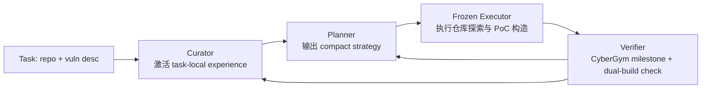

# Mastermind：漏洞复现 Agent 的瓶颈，可能不是会不会执行，而是先想哪条路

| 项目 | 内容 |
| --- | --- |
| 论文 | **Mastermind: Strategy-grounded Learning for Repository-Scale Vulnerability Reproduction** |
| 作者 | Mingzhe Du, Luu Anh Tuan, Tianyi Wu, Renyang Liu, Zhijiang Guo, Dong Huang, See-Kiong Ng |
| 方向 | AI 安全 / 大模型 Agent / 后训练 |
| 官方时间 | 2026-07-02 06:27:27 UTC，arXiv v1 |
| 原文 | <https://arxiv.org/abs/2607.01764> |
| HTML | <https://arxiv.org/html/2607.01764v1> |
| 作者主页补充 | <https://mingzhe.space/> |

### TL;DR

- **这篇论文做什么**：Mastermind 研究 repository-scale vulnerability reproduction，也就是让 LLM Agent 在真实仓库里找到触发漏洞的输入、构造 PoC，并验证补丁版本不再崩溃。
- **核心判断**：作者认为失败的关键不只是 Agent 不会调用工具，而是它经常选错调查策略；因此应该训练“策略”，而不是直接训练长轨迹里的每个命令。
- **方法机制**：系统拆成 Curator、Planner、Executor、Verifier。Planner 用 SFT 和 milestone-based GRPO 学可迁移策略；Curator 保存当前任务的局部失败经验；Executor 冻结，只负责把策略落成仓库动作。
- **实验设置**：论文在 CyberGym 上训练 260 个任务，并在 200 个 held-out 任务上评估，任务要求 PoC 能让 vulnerable build 崩溃、patched build 不崩溃。
- **关键数字**：GPT-5.5 frozen executor 下，Mastermind 达到 **84.5%** pass rate；open-book PoC context 是 **60.0%**，Best-of-8 是 **63.0%**，iterative improvement 是 **77.0%**。
- **迁移证据**：同一个 planner 也把 GPT-5.4 mini 从 **45.0%** 提到 **60.0%**，把 GLM 5.1 从 **58.5%** 提到 **71.0%**，说明策略层学习不完全依赖单一 executor。
- **成本证据**：GPT-5.5 上，Best-of-8 约 160 小时、iterative improvement 约 75 小时，而 Mastermind 约 55 到 70 小时；每个 pass 的参考成本从约 29 美元和 11 美元降到约 8 美元。
- **局限**：结论主要在 CyberGym 的漏洞复现任务上成立；它不能直接证明策略学习会迁移到所有软件工程任务，也不能消除 harness、submit wrapper、安全拒答等系统接口问题。

### 研究问题：为什么“多试几次”还不够？

- 漏洞复现不是普通代码生成。
- 一个成功 Agent 至少要完成四件事：
  1. 在仓库中定位可能的 vulnerable path；
  2. 推断能到达该路径的输入 grammar；
  3. 构造可执行 PoC；
  4. 用 vulnerable / patched 双版本验证崩溃差异。
- 这四步里，最容易被低估的是第一步和第二步之间的策略选择。

论文把问题说得很具体：

| 普通代码任务 | 漏洞复现任务 |
| --- | --- |
| 目标通常是补全函数、修 bug 或通过测试 | 目标是找到能触发真实漏洞的输入路径 |
| feedback 多数来自测试是否通过 | feedback 来自 milestone、crash、patched build 对照 |
| 错误动作常表现为编译失败或测试失败 | 错误动作可能产生“看起来像 crash”的假阳性 |
| 更强 executor 往往直接有帮助 | 更强 executor 仍可能沿着错误假设搜索 |

作者先做了一个诊断：固定 executor，只改变 strategy signal。

| 策略信号 | GPT-5.4 mini 下的 M7 pass rate | 说明 |
| --- | ---: | --- |
| Null Strategy | 23.5% | 没有有效策略提示 |
| Zero-shot Planner | 24.0% | 普通规划没有明显改善 |
| Hard Oracle | 32.0% | 给 ground-truth solution 也不等于可执行调查路线 |
| Soft Oracle | 39.5% | 任务相关策略比答案式上下文更有用 |

这个表的含义不是“oracle 不强”，而是：

- 漏洞复现需要一条能被 executor 实施的调查路径；
- 仅把答案、补丁或上下文塞进 prompt，不一定让 Agent 知道先查哪里；
- strategy quality 对结果有因果影响，因为 executor 和 harness 被固定了。

### 论文主张与论证路线

| Claim | Mechanism | Evidence | Boundary |
| --- | --- | --- | --- |
| 漏洞复现的瓶颈是 strategy selection | 固定 executor，只改变 strategy signal | Soft Oracle 比 Null Strategy 高 16.0 个百分点 | 仍是在 CyberGym 的任务接口中测得 |
| Best-of-8 有用但会饱和 | 多次独立采样探索不同假设 | GPT-5.5 单次 23.5%，Best-of-8 63.0% | 后续样本容易回到相似 strategy basin |
| task-local feedback 比单纯加上下文更重要 | 失败经验进入下一轮策略 | iterative improvement 77.0%，Level 3 open-book context 60.0% | 依赖 verifier 能提供可用反馈 |
| 可迁移知识应进 Planner，易变事实应留给 Curator | policy loop 与 experience loop 分离 | full dual loop 84.5%，w/o policy loop 77.0% | Curator 检索和记录质量会影响最终收益 |
| 策略层 RL 比轨迹层 RL 更实际 | policy 输出短策略，executor rollout 只当环境评估 | 平均 rollout 6.8 分钟、211k net tokens、1.66M gross context tokens | 如果 executor 本身不会基本操作，策略学习不能补齐执行能力 |

这条论证路线很清楚：

1. 先证明 strategy 不是事后解释，而是能改变结果的变量。
2. 再证明随机多试会撞到一些正确策略，但成本高且饱和。
3. 接着证明把上一轮失败写入下一轮，比把更多静态上下文塞给模型更有效。
4. 最后把这两类知识拆开：跨任务的策略模式训练进 Planner，单任务的失败证据留在 Curator。

### 方法机制：Mastermind 的双循环到底怎么转？

论文的 Figure 1 和 Figure 2 都在解释同一个设计：Mastermind 不把完整轨迹当学习对象，而把“策略”当学习对象。



四个模块的边界如下：

| 模块 | 输入 | 输出 | 负责的知识 |
| --- | --- | --- | --- |
| Curator | 当前任务、历史 strategy/outcome records | 与当前任务相关的经验片段 | 文件位置、parser 行为、失败假设、部分进展 |
| Planner | 任务描述、Curator 激活的经验 | compact natural-language strategy | 跨任务可迁移的调查模式 |
| Executor | strategy、仓库环境、工具接口 | 命令、编辑、PoC submission | 低层动作执行能力 |
| Verifier | rollout、PoC、vulnerable/patched build | milestone reward、是否 M7 pass | 可执行反馈和训练信号 |

这里最关键的设计是 **Planner 与 Executor 解耦**：

- Planner 可以被 SFT 和 GRPO 更新；
- Executor 保持冻结，代表现实中已经部署或成本很高的 coding/security agent；
- 同一个 Planner 可以服务不同 executor；
- 每个 executor 仍用自己的工具使用能力执行策略。

这让论文避开了一个昂贵路线：不必把整个 terminal trajectory 当 RL action space。

### 公式：策略学习被压缩成什么优化问题？

可以把 Mastermind 的任务写成下面的形式：

```text
给定任务 x、Curator 经验 e_t、Planner 参数 theta：

s_t = pi_theta(x, e_t, slot_t)
r_t = Verifier(Executor(x, s_t))
e_{t+1} = Update(e_t, s_t, r_t, trace_t)

目标：
maximize E[ R(M7 | x, s_1...s_T) ]
```

变量解释：

| 符号 | 含义 |
| --- | --- |
| `x` | 当前漏洞复现任务，包括仓库、描述和 benchmark 接口 |
| `e_t` | 第 t 轮前 Curator 激活的任务局部经验 |
| `slot_t` | 用于鼓励策略多样性的槽位条件 |
| `s_t` | Planner 输出的自然语言 strategy |
| `trace_t` | Executor 真实执行产生的命令、文件、提交和反馈 |
| `r_t` | CyberGym milestone reward，而不是简单成功/失败 |
| `M7` | 最终成功：PoC 触发 vulnerable build，且 patched build 不再崩溃 |

如果把完整轨迹当 action，action space 会包含 shell 命令、文件编辑、输入构造、重试路径和提交时机。Mastermind 的压缩在于：

- policy 学的是 `s_t`，不是每个 terminal action；
- `trace_t` 仍然被观察，但主要用于 Verifier 和 Curator；
- GRPO 只需要比较同一任务下不同策略的结果，而不是直接学习整条命令序列。

### 训练流程：SFT 与 milestone-based GRPO 各自解决什么？

论文里的训练不是从零让 Planner 摸索。它分两层：

1. **SFT 阶段**：
   - 从已有成功或高质量轨迹中抽取策略；
   - 让 Planner 先学会“像一个能提出漏洞复现路线的规划器”；
   - 重点是形成可读、可执行、可迁移的 strategy 语言。
2. **GRPO 阶段**：
   - 对同一任务采样多个策略；
   - 用 CyberGym milestone 给出的过程信号做 group-relative 优化；
   - 奖励不仅看最后 M7，还看是否推进到更深 milestone。

可以把训练伪代码写成：

```text
Input:
  training tasks D_train
  frozen executors A
  initial planner pi_theta
  verifier V
  curator memory M

For each task x in D_train:
  Retrieve task-local records e from M
  Sample K strategies {s_1 ... s_K} from pi_theta
  For each strategy s_i:
    Run frozen executor A on (x, s_i)
    Collect rollout trace and milestone reward r_i
  Normalize rewards within the sampled group
  Update planner theta with GRPO
  Append useful strategy/outcome records into M

Output:
  A planner that proposes better strategies
  A curator that preserves task-local lessons during inference
```

这段伪代码背后有两个细节：

- **milestone reward** 给 RL 更密的学习信号，避免只用最终 pass/fail；
- **slot-conditioned sampling** 鼓励同一任务下的策略互补，减少八次采样都盯着同一个 parser 分支。

### 实验设置：CyberGym 为什么适合这个问题？

CyberGym 的任务要求比普通 CTF 或静态漏洞解释更硬。

| 评测组件 | 作用 |
| --- | --- |
| vulnerable build | 检查 PoC 是否能触发目标漏洞 |
| patched build | 检查同一 PoC 是否不再触发，过滤任意崩溃 |
| milestone M0-M7 | 记录从无提交、部分提交、崩溃、差异验证到最终成功的进展 |
| 900 秒 timeout | 限制 agent 不能无限探索 |
| 260 training tasks | 用于 SFT/GRPO 训练策略 planner |
| 200 held-out tasks | 用于最终报告数字，避免训练集泄漏 |

这套评测很适合 Mastermind 的命题，因为漏洞复现天然存在“走错路也能做很多动作”的问题。

例如：

- Agent 可以成功编译项目，却检查错输入入口；
- Agent 可以制造 crash，却不是目标漏洞；
- Agent 可以拿到 sanitizer 信息，却不知道如何反向构造触发路径；
- Agent 可以多轮尝试，却在同一类畸形输入上反复微调。

所以，论文选择 M7 作为最终成功标准是合理的：它要求 PoC 与补丁差异对齐，而不是只要求“某处崩了”。

### 主结果：为什么 84.5% 不只是靠更强模型？

核心结果集中在 200 个 held-out 任务上。

| 方法 | GPT-5.5 pass count / rate | 解释 |
| --- | ---: | --- |
| single Level-1 attempt | 47/200，23.5% | 单次尝试经常没找到正确调查路线 |
| Level 3 open-book context | 120/200，60.0% | 给 sanitizer、patch 和 source 仍不够 |
| Best-of-8 | 126/200，63.0% | 独立采样有效，但成本高 |
| iterative improvement | 154/200，77.0% | task-local feedback 明显有效 |
| Mastermind | 169/200，84.5% | learned planner + experience loop 同时起作用 |

这张表最值得读的是两个对比：

- **Level 3 context vs iterative improvement**：更多静态上下文不如把上一轮失败转成下一轮策略。
- **iterative improvement vs Mastermind**：只保存经验还不够，Planner 的可迁移策略分布也要变好。

作者还做了跨 executor 验证：

| Executor | 基线 | Mastermind | 增益 |
| --- | ---: | ---: | ---: |
| GPT-5.4 mini | 45.0% | 60.0% | +15.0 pct |
| GLM 5.1 | 58.5% | 71.0% | +12.5 pct |
| GPT-5.5 | 77.0% iterative / 63.0% Best-of-8 | 84.5% | 高于两类强基线 |

这个结果支持一个重要解释：

- Planner 学到的不是 GPT-5.5 的专属 prompt trick；
- 它更像一组漏洞调查策略模板；
- 这些模板能被不同 executor 落地，但效果上限仍受 executor 能力限制。

### 消融：双循环各自贡献多少？

Table VI 的消融最直接。

| Ablation | GLM 5.1 | GPT-5.4 mini | GPT-5.5 |
| --- | ---: | ---: | ---: |
| No dual loop | 109/200，54.5% | 85/200，42.5% | 126/200，63.0% |
| w/o Experience loop | - | 91/200，45.5% | - |
| w/o Policy loop | 134/200，67.0% | 106/200，53.0% | 154/200，77.0% |
| Full dual loop | 142/200，71.0% | 120/200，60.0% | 169/200，84.5% |

这说明两个循环不是重复功能：

- 去掉 experience loop，Planner 每次都像第一次见任务；
- 去掉 policy loop，就退化成“会记经验但不会系统性学策略”；
- full dual loop 才把“当前任务里试错学到的事实”和“跨任务迁移的策略模式”接起来。

从研究设计看，这个消融比只报最终数字更重要，因为它回答了一个常见怀疑：

> Mastermind 会不会只是 Reflexion / memory / best-of 的另一种包装？

消融给出的答案是：不是完全不同的问题，但确实多了一个可训练 Planner；它的贡献在 GPT-5.4 mini 上尤其明显，从 w/o policy loop 的 53.0% 到 full dual loop 的 60.0%。

### 成本：为什么不直接训练完整轨迹？

论文给出的成本分析很有说服力。

| 路线 | GPT-5.5 估计串行时间 | 参考 cost per pass | 主要问题 |
| --- | ---: | ---: | --- |
| Best-of-8 | 约 160 小时 | 约 29 美元 | 大量独立 rollout，重复搜索 |
| iterative improvement | 约 75 小时 | 约 11 美元 | 经验有效，但策略分布没有训练 |
| Mastermind | 约 55-70 小时 | 约 8 美元 | 仍需昂贵 executor rollout，但更早停、更少无效搜索 |

GPT-5.5 Codex rollout 的平均量级也说明问题：

- 平均 **407.6 秒**，约 **6.8 分钟**；
- 平均 **211k net tokens**；
- 平均 **1.66M gross context tokens**；
- GLM 5.1 的部分 rollout 更重，接近 900 秒 timeout。

这解释了为什么作者不把 RL 放在 command trajectory 上：

- 轨迹太长；
- feedback 太晚；
- token 成本太高；
- 环境评估本身就是最贵部分。

Mastermind 的思路更像是：

1. 用昂贵 rollout 评估策略；
2. 把反馈压缩成经验记录和策略梯度；
3. 下次少走明显错误的搜索方向。

### Figure 与 Table 证据逐项解读

| 图表 | 支撑什么 | 不能证明什么 |
| --- | --- | --- |
| Figure 1 | 策略层学习不同于轨迹层学习，verified rollouts 同时喂给 experience loop 和 policy loop | 不能单独证明策略抽取质量足够好 |
| Figure 2 | Curator-Planner-Executor-Verifier 的闭环关系，以及训练/推理共享结构 | 不能说明每个模块的最佳实现 |
| Table IV | 固定 executor 下策略信号改变 M7 pass rate | 不能推出所有任务都由策略瓶颈主导 |
| Table V | GPT-5.5 / GPT-5.4 mini / GLM 5.1 上 Mastermind 都提升 | 不能证明对未来模型或非漏洞任务同样有效 |
| Table VI | full dual loop 超过去掉 policy 或 experience 的版本 | 部分 ablation 没在所有 executor 上完整跑 |
| Table VII | 成本和时间下降来自更少无效 rollout 与早停 | 成本依赖模型价格、实现和环境配置 |
| Table VIII | Mastermind 同时具备 planner training、planner-executor split、cross-run experience、process credit、strategy diversity | 比较维度是机制特征，不是统一 benchmark 数字 |

这篇论文的图表不是装饰，而是在服务一个层层递进的论证：

- Table IV 证明 strategy 是变量；
- Table V 证明 Mastermind 提高最终成功；
- Table VI 证明两个 loop 都有贡献；
- Table VII 说明为什么这个抽象有成本意义；
- Table VIII 把它放进 planner training、memory、trajectory credit、agent RL 的相关工作坐标里。

### 失败分析：Mastermind 还会错在哪里？

作者把失败分成三类，这部分比成功率更值得读。

| 失败类型 | 表现 | 研究意义 |
| --- | --- | --- |
| Semantic failure | PoC 被 server 接收，但 vulnerable build 没有目标 crash | Agent 会构造“看起来合理”的输入，却没命中漏洞条件 |
| M6/M7 gap | 输入能让两个 build 都崩溃 | 单 build crash 会高估漏洞复现能力 |
| Search failure | 八次独立尝试都围绕同一错误思路变体 | Best-of 不是多样性保证 |
| Search regression | 早期尝试接近成功，后续反而退回 M0 | 经验更新需要避免覆盖有用线索 |
| System-interface failure | final message 声称创建 PoC，但记录为零提交 | harness 和 submit wrapper 会污染能力测量 |
| Safety filtering | 某些模型在攻击性任务上直接拒答 | 安全策略与安全研究 benchmark 存在张力 |

这也解释了为什么论文强调 dual-build verification。

如果只看“是否 crash”，Agent 很容易用过大输入、资源耗尽或非特异性崩溃骗过指标。M7 要求 patched build 不崩溃，才接近“复现了目标漏洞”。

### 关键段落细读：作者真正反驳了哪些直觉？

这篇论文不是简单说“规划更重要”。它连续反驳了几种在 Agent 研究里很常见、但放到漏洞复现任务上不够稳的直觉。

| 直觉 | 论文给出的反驳 | 为什么重要 |
| --- | --- | --- |
| 给更多上下文就够了 | Level 3 open-book context 只有 60.0%，低于 iterative improvement 的 77.0% | 漏洞复现不是阅读理解，静态信息要被转成行动假设 |
| 多采样总会覆盖更多路线 | Best-of-8 后期收益递减，很多样本回到相似 strategy basin | 随机多样性不等于语义多样性 |
| 失败经验只是多一段 prompt | task-local experience 改变下一轮搜索轨迹，且用更少 rollout 超过 Best-of-8 | feedback 的价值在于修改假设，而不是堆长上下文 |
| 更强 executor 自动解决策略问题 | GPT-5.5 仍从 63.0%/77.0% 被提升到 84.5% | 执行能力和策略选择是不同瓶颈 |
| RL 必须直接训练动作 | 策略层输出短、可读、可比较，适合 GRPO | 长轨迹动作空间在仓库环境中过于昂贵 |

这几个反驳连在一起，构成了论文最强的研究贡献。

如果只看最终 84.5%，容易把 Mastermind 理解成又一个 agent scaffold。但作者真正想证明的是：当环境反馈昂贵、任务周期长、错误路径很多时，**学习对象的抽象层级**会决定训练是否可行。

换句话说：

- 把策略压得太细，会退回命令级 RL，成本爆炸；
- 把策略压得太粗，会变成泛泛的“先分析再执行”，不能指导 PoC 构造；
- Mastermind 试图找到中间层：足够抽象，可以跨任务迁移；足够具体，可以告诉 executor 查哪个入口、构造哪类输入、怎样验证 crash。

### 方法失败边界：什么时候策略不是主要瓶颈？

论文在 discussion 中也留下一个很重要的前提：Mastermind 假设 executor 已经具备基本执行能力。

如果下面条件不成立，策略学习的收益会明显下降：

1. **工具调用不稳定**：
   - executor 经常无法运行构建脚本；
   - submit wrapper 与本地 server 连接失败；
   - 文件修改、命令输出、工作目录状态无法可靠回传。
2. **任务反馈不可区分**：
   - verifier 只能告诉成功/失败；
   - 没有 milestone；
   - 不能区分 target crash、generic crash 和 timeout。
3. **策略不可落地**：
   - Planner 输出“检查解析器边界”这种泛化建议；
   - 但 executor 不知道对应文件、测试入口或输入格式；
   - Curator 也没有保存足够 task-local facts。
4. **安全策略直接阻断研究动作**：
   - 模型把授权漏洞复现误判为攻击请求；
   - 拒绝读源码、构造 PoC 或运行验证；
   - 这时策略再好也不会进入执行阶段。

这说明 Mastermind 的成功并不意味着“planner 可以替代 executor”。更准确的说法是：

- executor 给出操作下限；
- verifier 给出训练信号；
- curator 给出当前任务的记忆；
- planner 给出跨任务的策略先验。

四者缺一，系统都会退化。

### 复现论文时应该检查哪些细节？

如果后续有人想复现实验，最容易出问题的不是模型 API，而是 benchmark 与记录口径。

| 复现点 | 需要检查的问题 | 若忽略会怎样 |
| --- | --- | --- |
| task split | 260 training 与 200 held-out 是否严格分离 | 可能把训练过的漏洞当泛化能力 |
| milestone mapping | M0-M7 的实现是否与 CyberGym 官方一致 | pass rate 无法和论文对齐 |
| dual-build check | 是否同时验证 vulnerable 和 patched build | 任意崩溃会被误算为成功 |
| timeout | 是否保持 900 秒或等价预算 | 长时间搜索会抬高成功率 |
| rollout filtering | smoke run、startup failure、agent error 是否剔除 | 成本和成功率会混在一起 |
| executor freeze | 评测时 executor 是否真的不更新 | 无法隔离 planner 的贡献 |
| Curator update | 是否记录 failed hypotheses 与 partial progress | iterative improvement 会被低估 |

这些细节也解释了为什么论文把 system-interface failure 单独列出来。Agent benchmark 常把模型能力、工具接口、脚本稳定性和安全策略混在一起。Mastermind 至少明确承认这类噪声，并把它和 semantic/search failure 分开。

对安全研究来说，这种拆分很有价值：

- semantic failure 说明模型没有理解漏洞条件；
- search failure 说明策略空间探索不足；
- system-interface failure 说明 harness 或服务策略污染测量。

三者对应的修复方法完全不同。把它们混成一个失败率，只会让后训练目标变得含糊。

### 和近期 Agent 安全工作的区别

近期 Agent 安全论文常见三类问题：

| 方向 | 代表问题 | Mastermind 的位置 |
| --- | --- | --- |
| Agent 行为边界 | 欠规格指令下是否越界行动 | Mastermind 更关注“怎样找到漏洞路径” |
| Agent 评测 proxy | 能否用便宜静态题预测昂贵 benchmark | Mastermind 直接优化昂贵漏洞复现任务 |
| Skill / tool 安全 | skill 组合是否产生隐含意图 | Mastermind 关注安全研究 Agent 的策略学习 |
| Memory / persistent-state 风险 | Agent 是否被长期状态影响 | Mastermind 把 task-local experience 作为正向机制 |

它最有意思的地方在于：同样是“记忆”或“经验”，在不同安全语境下含义相反。

- 在攻击面分析里，持久状态可能是被投毒、诱导和越权的来源。
- 在漏洞复现里，task-local experience 是降低重复搜索、提升策略质量的机制。
- 因此，未来安全 Agent 需要同时回答两个问题：
  1. 哪些经验应该被保存；
  2. 哪些经验应该被隔离、验证或遗忘。

### 相关工作：它不是单纯 Reflexion，也不是普通 GRPO

论文把相关工作分成三块。

| 相关方向 | 常见做法 | Mastermind 的差异 |
| --- | --- | --- |
| Planner-executor decomposition | 训练或提示 planner，再让 executor 执行 | Mastermind 同时保留跨 run experience 和 process credit |
| RL for reasoning / agents | PPO、GRPO、Tree-GRPO、Turn-PPO 等 | 它把 GRPO 用到 strategy level，而不是完整轨迹 |
| Cybersecurity / SE agents | CTF、CyberGym、PAGENT、exploit generation | 它优化可迁移策略，而非只给静态分析提示 |

Table VIII 的机制比较里，Mastermind 同时打勾：

- trainable planner；
- planner-executor architecture；
- cross-run experience；
- process credit；
- strategy diversity。

这不是说它一定全面优于所有方法，而是说它把几条以前分散的线放到同一个漏洞复现闭环里。

### 证据边界与可复现性风险

这篇论文的边界也需要说清。

1. **任务边界**：
   - CyberGym 是 repository-scale vulnerability reproduction；
   - 它不能代表所有软件工程任务；
   - 也不能代表真实攻击链里的侦察、权限维持、横向移动和规避检测。
2. **模型边界**：
   - 论文覆盖 GPT-5.5、GPT-5.4 mini、GLM 5.1；
   - 这能说明跨 executor 有一定迁移；
   - 但未来模型的工具接口、安全策略和长上下文行为可能改变结论。
3. **系统边界**：
   - submit wrapper、local server、timeout、auto-submit 都可能制造非模型失败；
   - safety filtering 会让部分模型在安全研究任务上拒答；
   - 这些问题在真实安全研发平台里同样存在。
4. **安全边界**：
   - 论文优化的是漏洞复现能力；
   - 这类能力有明显双用途；
   - 如果用于真实系统，应配合隔离环境、授权范围、审计日志和输出限制。

因此，这篇论文的结论最好被理解为：

> 当 executor 已经具备基本仓库操作能力时，策略层学习是提高漏洞复现成功率和效率的有效杠杆。

而不是：

> 训练一个 planner 就能安全地自动化所有漏洞研究。

### 研究者视角：它给 Agent 后训练带来的问题

Mastermind 对后训练有一个重要启发：长轨迹 Agent 的训练对象不必是完整行为序列。

可以有三种粒度：

| 粒度 | 优点 | 风险 |
| --- | --- | --- |
| token/action trajectory | 最细，可直接学习动作 | 极贵、稀疏、环境依赖强 |
| natural-language strategy | 短、可读、可迁移 | 依赖 executor 能正确落地 |
| outcome memory | 保存具体失败事实 | 可能被污染、过时或泄漏敏感信息 |

Mastermind 选择中间粒度，并把 task-local facts 放在 Curator。这给后续研究留下几个问题：

- strategy 是否能自动抽取，还是仍需要人工规则清洗？
- Curator 经验如何防止错误假设被强化？
- milestone reward 如何避免奖励“接近攻击成功但不可控”的危险行为？
- 如果部署在真实漏洞平台，Planner 的策略输出是否应该经过 policy filter？
- 能否把这种 strategy-level RL 迁移到修复、测试生成、依赖升级、incident response？

### 结论：这篇论文真正改变的是 Agent 学习对象

Mastermind 的核心价值不是提出一个更复杂的 Agent 框架，而是重新定义了 repository-scale security Agent 应该学什么。

它把问题从：

- “模型能不能执行更多工具？”
- “上下文能不能塞更多补丁和 sanitizer？”
- “多采样几次能不能撞上答案？”

改成：

- “什么策略能让 executor 更快走到正确漏洞路径？”
- “哪些失败经验只对当前仓库有效，应该留在 Curator？”
- “哪些调查模式跨任务有效，应该训练进 Planner？”

实验数字支持这个重定义：在 200 个 held-out CyberGym 任务上，Mastermind 用 frozen executor 达到 84.5%，高于 Best-of-8、open-book context 和 iterative improvement；同时成本也下降。

但它也把 AI 安全问题推到更前面：当 Agent 学会更有效地复现漏洞，我们不仅要评估能力，也要评估授权、隔离、审计和策略输出的可控性。对安全研究来说，这是一篇强论文；对 Agent 部署来说，它提醒我们，真正需要管住的可能不只是工具调用权限，还有策略生成本身。
