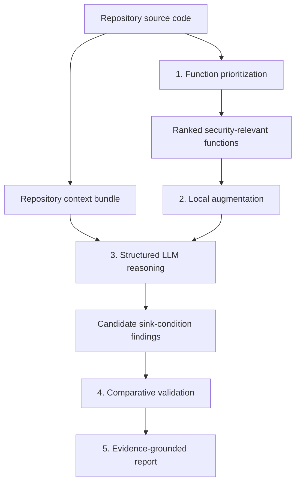

# Antaeus：把漏洞检测从“看函数像不像危险”推进到“恢复仓库里的安全不变量”

### 元信息与 TL;DR

- **论文**：[Antaeus: Hunting Repository-Level Logic Vulnerabilities via Context-Grounded LLM Reasoning](https://arxiv.org/abs/2607.01138)
- **版本与日期**：arXiv:2607.01138v1，2026-07-01 16:22:05 UTC 提交。
- **作者**：Michele Armillotta、Nicolo Romandini、Rebecca Montanari、Lorenzo Cavallaro。
- **方向**：AI for Security / LLM-assisted vulnerability detection / repository-level reasoning。
- **本文关注点**：这篇论文不是再问“LLM 能不能发现漏洞”，而是问：当漏洞不表现为固定危险 API、固定 taint flow 或明显语法模式时，怎样把 LLM 的推理约束到仓库证据上。

**TL;DR：**

- **问题**：逻辑漏洞，尤其 CWE-284 improper access control 与 CWE-200 information exposure，通常不是局部语法错误；它们违反的是仓库隐含的权限、资源、输出和信任边界不变量。
- **方法**：Antaeus 用五阶段流水线做 repository-level grounding：函数优先级排序、局部代码增强、仓库上下文包、结构化 sink-condition 推理、同仓库相似 sink 比较验证。
- **关键机制**：模型不直接输出“有漏洞/没漏洞”，而要给出 security-sensitive sink、required safety condition、locally_satisfied 标记和代码证据；报告只有在至少一个条件未满足时生成。
- **实验**：作者从 ReposVul 选出 28 个真实 C/C++ 逻辑漏洞仓库，其中 12 个 CWE-200、16 个 CWE-284；每个仓库分别跑两个 CWE pass。
- **关键数字**：44,142 个源/头文件，经启发式与模型排序后，把 149,758 个 in-scope 函数压到 4,859 个详细分析函数，平均约 30.8x reduction。
- **主结果**：Claude Opus 4.7 版本的 Antaeus 检出并解释 15/28 个漏洞；GPT-5.4 版本检出 12/28；最强基线不超过 5/28，Codex agentic baseline 在作者设定下为 0/28。
- **消融**：去掉 local augmentation 或 repo context 后，Claude 配置从 15 降到 9；GPT 配置从 12 降到 8 或 7，说明局部证据和仓库语义不是互相替代的组件。
- **局限**：它不是完备静态分析器；深度一层的调用扩展、模型遗漏 sink、prompt 敏感性、28 个 C/C++ CVE 样本的外推边界，都是结论必须带着读的约束。

### 研究问题：为什么逻辑漏洞不是普通 SAST 或函数级 LLM 能轻松覆盖的对象？

作者把问题放在一个具体例子上：libvirt 的 `virDomainAgentSetResponseTimeout`，对应 CVE-2020-10701。

这段函数局部看起来没有明显危险：

- 它验证 domain handle。
- 它取出 connection。
- 它调用 driver callback。
- 它按项目惯例处理错误。

真正的问题是少了一行权限检查：

```c
virCheckReadOnlyGoto(conn->flags, error)
```

这行缺失意味着：

- 只读客户端也能把 guest-agent response timeout 设置为 0。
- 这个设置会让 guest-agent 命令不等待回复。
- 结果是一个 read-only caller 可以触发拒绝服务。

这里的漏洞不是“某个函数调用危险”，而是“某个 API 语义上属于写操作，却没有遵守 libvirt 对写操作的 read-only guard 约定”。

| 难点 | 普通检测器希望看到什么 | 逻辑漏洞实际给出的证据 |
|---|---|---|
| 非局部不变量 | 危险函数、危险参数、固定模式 | 项目级权限模型和 sibling API 的共同约定 |
| 缺少 source/sink 锚点 | tainted source 到 sensitive sink 的路径 | “修改 timeout 是写操作”这种项目语义分类 |
| 假阳性难区分 | 单个函数是否缺检查 | 同类操作是否都这样写，还是只有目标函数偏离规范 |

作者的核心判断可以压缩成一句话：

> 逻辑漏洞检测不是“多给模型一些代码”就够了，而是要恢复仓库特定的 security invariant，再检查目标操作是否偏离这个 invariant。

### 论文主张与论证路线：claim -> mechanism -> evidence -> boundary

| Claim | Mechanism | Evidence | Boundary |
|---|---|---|---|
| 函数级上下文不足以判断逻辑漏洞 | 把函数放入项目目的、principal、protected object、trust topology 中解释 | Function-level baseline 只检出 5/28 或 4/28 | 不说明所有函数级模型都失败，只说明这个 benchmark 和这类 CWE 上不足 |
| 仓库级 grounding 能提高召回 | local augmentation + repository context bundle + structured sink/condition prompt | AntaeusO4.7 检出 15/28，AntaeusG5.4 检出 12/28 | 召回提高同时带来大量 FP，需要后续验证和人工 triage |
| 相似 sink 比较能删掉重复假阳性 | 用 UniXcoder 比 sink identifier，用 sentence-transformer 比 safety condition | Claude FP 从 1682 降到 1345，GPT FP 从 3927 降到 2918 | 它只能处理已报告条件，不能恢复模型漏掉的 sink |
| 优先级排序让 repo-scale 分析可负担 | 关键词高召回过滤 + 压缩函数表示 + agentic ranking | 149,758 个 in-scope 函数压到 4,859 个详细分析函数 | 排序阶段漏掉的函数，后续无法再发现 |
| 结构化报告让发现可审计 | report schema 强制列出 sink、condition、locally_satisfied、justification | 真阳性按“sink 和条件是否解释 CVE”计分，而非只看函数重叠 | 解释仍由 LLM 生成，可信度依赖输入证据和人工复核 |

### 方法机制：Antaeus 的五阶段流水线

论文 Figure 1 展示的是五阶段 pipeline。这里用 Mermaid 重画关键数据流：



#### 1. Function prioritization：先决定钱花在哪些函数上

Antaeus 不试图对每个函数都做重型 LLM 推理。它先用轻量过滤和压缩表示筛出值得分析的函数。

流程是：

1. 只保留 C/C++ 源文件和头文件。
2. 用宽松关键词过滤掉明显无关函数。
3. 把每个函数压缩成“签名 + body 内调用的 callee”。
4. 把压缩后的函数行切成适合上下文长度的 chunk。
5. 让 agentic LLM 对函数按 CWE-284/CWE-200 相关性排序。

压缩表示的作用不是证明漏洞，而是让模型在仓库尺度看到更多函数名、调用名和 API 结构。

一个近似形式如下：

```text
func1(args) {
  callee1(args);
  callee2(args);
}

funcN(args) {
  calleeX(args);
}
```

这一步的取舍很明确：

- **保留**：函数名、签名、callee、API 命名模式、项目局部结构。
- **丢弃**：函数体内部细节、完整控制流、深层语义。
- **目标**：高召回地减少后续 LLM 调用，而不是直接分类漏洞。

#### 2. Contextual grounding：把目标函数放回仓库语义里

每个被分析函数会拿到两类上下文：

| 上下文 | 包含什么 | 解决什么问题 |
|---|---|---|
| Local augmentation bundle | direct callee 签名、项目内 callee body、宏与常量定义、typedef、imports | 让模型不要凭训练记忆猜 API、宏、常量含义 |
| Repository context bundle | system purpose、principal model、protected objects、information outputs、trust topology | 让模型知道这个项目在保护谁、什么资源、哪些边界 |

local bundle 只展开一层调用，这是一个很重要的工程选择。

- 展开更深会增加 prompt 体积。
- 深层调用也不保证完整语义覆盖。
- 一层足以解释很多 immediate callee、macro、constant 的局部含义。
- 更远的项目语义交给 repository context bundle 总结。

repository context bundle 的五个部分可以这样理解：

| Bundle section | 问的问题 | 对漏洞判断的作用 |
|---|---|---|
| System purpose | 这个仓库实现什么系统？部署在哪里？谁用它？ | 判断某个操作是否安全敏感 |
| Principal model | 项目区分哪些 actor/caller？身份怎么建立？ | 判断权限边界是否存在 |
| Protected objects | 哪些配置、handle、credential、state table 是受保护资源？ | 判断 sink 影响的资源级别 |
| Information outputs | 哪些错误、状态、响应、日志会被外部观察？ | 判断 CWE-200 信息泄露 |
| Trust topology | API、IPC、socket、filesystem、network 接口如何划边界？ | 判断调用者跨越了什么边界 |

### 结构化推理：不要让模型只给一个“漏洞标签”

Antaeus 的一个关键设计是固定输出 schema。

```json
{
  "cwe": "<weakness class>",
  "function_name": "<name>",
  "file": "<path>",
  "lines": "<range>",
  "function_id": "<function id>",
  "sinks": [
    {
      "sink_id": "<security-sensitive operation>",
      "sink_description": "<why it crosses a trust or exposure boundary>",
      "required_conditions": [
        {
          "id": "<invariant name>",
          "description": "<invariant the operation depends on>",
          "locally_satisfied": false,
          "justification": "<code evidence supporting the judgment>"
        }
      ]
    }
  ]
}
```

这个 schema 迫使模型回答三件更难但更有用的问题：

1. **哪个 sink 是安全敏感的？**
   - CWE-284 中，sink 可以是影响 protected resource 的状态更新、系统调用、跨边界写操作。
   - CWE-200 中，sink 可以是把信息返回给低权限 principal 的 API response、network write、log、status output。

2. **这个 sink 安全执行需要什么条件？**
   - 条件不是通用 slogan，而是和项目语义相关的 predicate。
   - 例如“写操作必须拒绝 read-only connection”。

3. **本地代码是否满足条件？**
   - `locally_satisfied` 不能只写直觉。
   - `justification` 必须指向给定代码或 grounding bundle 中的证据。

这改变了评测标准：

- 不是“模型标到了正确函数”就算对。
- 只有 reported sink 和 required condition 能解释真实 CVE，才算 true positive。
- 如果标签对了但解释错了，仍然不能算完整命中。

### 比较验证：把“缺检查”放到同仓库相似操作里审判

逻辑漏洞的难点在于：某个缺失条件是 bug，还是项目一直这样写？

Antaeus 的 comparative validation 把这个问题形式化为同仓库异常检测。

核心变量：

- `s`：目标 sink。
- `c`：目标 sink 上未满足的 safety condition。
- `N(s)`：与目标 sink 相似的同仓库 sink 集合。
- `C(v)`：相似 sink `v` 上模型报告的未满足条件集合。
- `sim_cond(c, c_v)`：两个条件文本的语义相似度。

覆盖率公式：

```text
cov(c) =
  |{ v in N(s) : exists c_v in C(v), sim_cond(c, c_v) >= tau_cond }|
  / |N(s)|
```

剪枝规则：

```text
prune(c) =
  |N(s)| >= tau_min
  AND
  cov(c) >= tau_maj
```

阈值不是全局固定，而是在每个仓库内按相似度分布校准：

```text
tau = mean(S) + n * std(S)
```

| 阈值 | 比较对象 | 作用 |
---|---|---|
| `tau_sink` | sink identifier 的 UniXcoder cosine similarity | 决定哪些 sink 是邻居 |
| `tau_cond` | safety condition 的 sentence-transformer similarity | 决定两个条件是不是同一类担忧 |
| `tau_maj` | 邻居中重复该条件的比例 | 判断该担忧是否是项目普遍模式 |
| `tau_min` | 最小邻居数量 | 避免样本太少时过度剪枝 |

这个设计背后的判断是：

- 如果很多相似 sink 都“缺同一种条件”，这更可能是模型把项目惯例误报为漏洞。
- 如果只有目标 sink 缺这个条件，而 sibling APIs 或相似操作都满足它，这才更像逻辑漏洞。
- 如果邻居太少，验证阶段保守保留发现，偏向召回而不是误删。

### 算法流程：从仓库到报告的伪代码

```text
Input:
  R: target repository
  W: weakness class in {CWE-284, CWE-200}
  M: reasoning model

State:
  F_all: source/header functions extracted from R
  F_ranked: prioritized functions for W
  B_repo: repository context bundle
  Findings: structured sink-condition findings
  Reports: validated findings

Procedure:
  1. F_candidates = keyword_filter(F_all, W)
  2. F_compact = compress_each_function(F_candidates)
       keep signature and direct callees
       drop internal body details for ranking
  3. F_ranked = agent_rank(F_compact, W)
  4. B_repo = build_repo_context(R)
       system purpose
       principal model
       protected objects
       information outputs
       trust topology
  5. for f in F_ranked:
       B_local = local_augment(f)
         direct callee signatures
         direct callee bodies when available
         macros/constants/types/imports
       finding = M.reason(f, B_local, B_repo, W)
       if finding has unsatisfied required condition:
          Findings.add(finding)
  6. for finding in Findings:
       neighbors = similar_sinks(finding.sink_id, Findings)
       coverage = repeated_condition_coverage(finding.condition, neighbors)
       if neighborhood_too_small or coverage below threshold:
          Reports.add(finding)
       else:
          prune as recurring project-wide pattern

Output:
  Reports with function, file, sink, violated condition, and evidence.

Failure boundaries:
  - if prioritization misses a function, later stages cannot recover it
  - if M omits the relevant sink, validation cannot invent it
  - if the invariant lives outside code/config/docs seen by the pipeline, grounding is incomplete
```

### 实验设置：作者如何避免“只命中函数名”的宽松评测？

实验从 ReposVul 中选出 28 个真实漏洞仓库：

- **12 个 CWE-200**：信息暴露给未授权 actor。
- **16 个 CWE-284**：访问控制不当。
- **语言与项目**：真实 C/C++ open-source repositories。
- **输入条件**：给 Antaeus 的是完整仓库，不告诉它哪个函数有 CVE。
- **运行方式**：每个仓库跑两个独立 pass，一个针对 CWE-284，一个针对 CWE-200。

评分规则比常见 function overlap 更严格：

| 评分项 | 常见宽松评测 | 本文评测 |
---|---|---|
| 函数位置 | 命中 vulnerable function 可能算对 | 还不够 |
| 漏洞解释 | 可以只有标签或自然语言描述 | 必须说明 sink 和 safety condition |
| CWE pass | 任意 pass 报出来即可 | 对应 CWE pass 的解释才算 TP；另一 pass 的错误报告计 FP |
| FP | 非真实漏洞的 retained finding | 按结构化报告逐条计 |

这个设计很关键，因为逻辑漏洞经常出现“函数对了、理由错了”的情况。

### 主结果：Antaeus 提高召回，但不是零成本魔法

#### Prioritization 规模压缩

| Pass | Files | Retained files | In-scope functions | Analyzed functions | Reduction |
---|---:|---:|---:|---:|---:|
| CWE-284 | 44,142 | 5,548 | 66,952 | 2,320 | 28.9x |
| CWE-200 | 44,142 | 10,161 | 82,806 | 2,539 | 32.6x |
| Combined | -- | 15,709 | 149,758 | 4,859 | 30.8x |

这个表说明：

- Antaeus 没有把完整仓库全部塞给模型。
- 它先用低成本方法把候选空间缩小约 31 倍。
- 后续详细推理仍覆盖数千函数，而不是 agent 自己随意探索几个文件。

#### Detection effectiveness

| 配置 | 检出 TP | FP after validation | 备注 |
---|---:|---:|---|
| Antaeus + Claude Opus 4.7 | 15/28 | 1,345 | 主结果最强 |
| Antaeus + GPT-5.4 | 12/28 | 2,918 | 检出集合与 Claude 部分互补 |
| Function-level Claude baseline | 5/28 | 1,197 | FP 接近但召回低很多 |
| Function-level GPT baseline | 4/28 | 4,971 | 更激进，FP 更高 |
| Opus 4.7 agentic baseline | 3/28 | 545 | 看得少，FP 少，漏得多 |
| Opus 4.8 agentic baseline | 5/28 | 190 | yield 看似好，但覆盖不足 |
| Codex/GPT-5.4 agentic baseline | 0/28 | 未列入主表 | 作者称两种设置都未恢复漏洞 |

这里不能只看 FP 数量。

一个 agentic baseline 可能 FP 很少，是因为它检查的函数很少；这会让表面 signal-to-noise 更好，但漏掉大多数真实漏洞。

作者给出的解释是：

- Antaeus 和 function-level baseline 都按候选集系统分析函数。
- Agentic baseline 即使拿到 prioritized function set，也会再次内部裁剪。
- Opus 4.7 agentic 在 4,859 个 ranked functions 中只推理 1,379 个。
- Opus 4.8 agentic 只推理 588 个。
- 给 ranking 后，agentic FP 上升，但 recall 没有同步上升。

### 消融：local context 和 repo context 都不能省

| Ablation | Claude 检出 | GPT 检出 | 解释 |
---|---:|---:|---|
| Full Antaeus | 15 | 12 | 五阶段完整 pipeline |
| -Local augmentation | 9 | 8 | 少了 callee、macro、constant、typedef 证据 |
| -Repo context bundle | 9 | 7 | 少了项目目的、principal、protected objects、trust topology |

这个结果支持一个强主张：

- local context 解决“这行代码实际做什么”。
- repo context 解决“这个操作在项目中应该满足什么安全不变量”。
- 两者不是同一种上下文的不同粒度，而是服务于不同推理子问题。

以 CVE-2020-10701 为例：

- 目标函数局部没有 read-only policy 的完整解释。
- repository context 才能告诉模型 libvirt 如何定义 read-only connection 和 write-privileged public API。
- 如果只看函数与一层 callee，就很容易把“缺 guard”误判为无从判断。

### 比较验证的贡献：删 FP，不删 TP

| 配置 | FP before | FP after | 降幅 | TP 是否下降 |
---|---:|---:|---:|---|
| AntaeusO4.7 | 1,682 | 1,345 | 20% | 否，仍 15/28 |
| AntaeusG5.4 | 3,927 | 2,918 | 26% | 否，仍 12/28 |

这说明 comparative validation 的价值不是“让结果看起来更干净”，而是利用同仓库结构删掉重复模式。

不过也要注意：

- 它不能修复 reasoning stage 的漏报。
- 它不能判断外部部署策略中隐藏的不变量。
- 它在邻居太少时偏保守保留，所以不会把 FP 压到很低。

### 成本：上下文带来召回，也带来 prompt 账单

| 配置 | Input tokens | Output tokens | 备注 |
---|---:|---:|---|
| AntaeusO4.7 | 83.97M | 0.68M | 仓库上下文和 local grounding 主导输入 |
| Function-level Opus 4.7 | 5.58M | 0.20M | 便宜但少了仓库语义 |
| AntaeusG5.4 | 82.34M | 1.26M | 与 Claude 配置同量级 |
| Function-level GPT 5.4 | 4.79M | 0.64M | 输入显著更少 |
| Opus 4.7 agentic baseline | 261.25M total | 其中 cache read 251.75M | token 总数大，但 cache read 便宜 |

作者按 Opus 4.7 list price 粗估：

| 配置 | TP | 总成本 | 每个 CVE | 每个 TP |
---|---:|---:|---:|---:|
| AntaeusO4.7 | 15 | about $440 | about $16 | about $30 |
| Opus 4.7 agentic | 3 | about $230 | about $8 | about $77 |
| Function-level | 5 | about $33 | about $1 | about $7 |

这个成本表需要谨慎读：

- Function-level 最便宜，但它检不出多数逻辑漏洞。
- Agentic baseline 总成本低于 Antaeus，但每个确认漏洞更贵。
- Antaeus 的价值是把更高 coverage 变成更低 dollar-per-TP。
- Comparative validation 本身不增加 LLM 成本，因为它走 embedding 相似度。

### Figure/Table 证据逐项解读

| 图表 | 支持的结论 | 不能证明什么 |
---|---|---|
| Figure 1 pipeline | 五阶段不是任意拼接，而是从候选排序到验证报告的闭环 | 不证明每阶段参数最优 |
| Listing 1 libvirt example | 逻辑漏洞可能缺的是项目约定中的一行 guard | 不证明所有 CWE-284 都像这个例子 |
| Listing 2 compressed repo representation | 排序阶段只需函数签名和 callee，也能获得 repo-wide signal | 不证明压缩表示足以做最终判断 |
| Listing 3 report schema | sink-condition 输出能让漏洞解释更可审计 | 不保证模型解释一定忠实 |
| Table I pruning summary | 30.8x reduction 让仓库级分析可执行 | 不保证被删函数没有漏洞 |
| Table effectiveness | Antaeus 的召回高于函数级与 agentic baseline | 不意味着 FP 低或无需人工审核 |
| Ablation table | local 与 repo context 都贡献召回 | 不说明这两类上下文已经达到最佳形式 |
| Cost tables | 上下文成本换来了更高 TP 覆盖 | 价格随模型计费和 cache 策略会变化 |

### 相关工作位置：Antaeus 站在哪里？

这篇论文把自己放在三个方向之间：

1. **传统 SAST / taint / pattern systems**
   - CodeQL、Semgrep 等在固定危险模式、source-sink flow、语法约束清晰的漏洞上有效。
   - 对逻辑漏洞，它们缺少 universal sink 和 project-specific invariant。

2. **函数级 LLM vulnerability detection**
   - 模型能读代码并给解释。
   - 但函数窗口太窄，容易缺少 principal、trust boundary 和 sibling API evidence。

3. **Agentic repository auditing**
   - frontier agent 可以遍历仓库。
   - 但自主搜索在大仓库中会受预算、注意力和内部优先级影响。
   - Antaeus 的不同点是固定分阶段 scaffold，而不是让 agent 自己决定看哪里、怎么解释。

因此，Antaeus 不是在替代静态分析，而是在回答：

- 当漏洞需要恢复项目不变量时，怎样把静态分析的结构化证据和 LLM 的语义推理结合起来？
- 当 LLM 容易过度自信时，怎样把输出变成可比较、可剪枝、可审计的结构？

### 证据边界与局限

作者在 discussion 中给出了一组清晰边界。

| 局限 | 为什么重要 | 可能后续方向 |
---|---|---|
| 非完备分析 | Antaeus 明确不保证 exhaustive detection 或 formal correctness | 与更强静态分析、符号执行、coverage-guided exploration 结合 |
| local grounding 只到 depth one | 深层调用中的安全条件可能缺失 | 按风险自适应扩展 call graph depth |
| LLM 仍可能漏 sink | validation 只能处理已报告内容 | 多模型 ensemble 或 sink proposal audit |
| prioritization 可能漏函数 | 后续阶段永远看不到被过滤目标 | 更高召回 ranking、反馈式二次扫描 |
| prompt 敏感 | 作者没有穷尽 prompt 搜索 | 系统化 prompt/format search 与 held-out calibration |
| benchmark 小且集中 | 28 个 C/C++ CWE-200/284 不能代表所有语言与漏洞 | 扩到 Rust/Go/Java、workflow/stateful bugs、配置漏洞 |
| 不生成 exploit | 防御定位更明确，但无法验证 exploitability 全链路 | 与 PoV generation 或 dynamic harness 结合 |

这里最值得强调的是：Antaeus 的结果不应解读为“LLM 已能自动审计仓库”。

更准确的解读是：

- 如果给 LLM 一个结构化、证据绑定、可比较的审计任务，它可以比自由 agent 搜索更有效地发现某些逻辑漏洞。
- 但这个系统仍然需要人类审计员确认报告，并且仍可能漏掉跨多步工作流、部署配置、运行时状态相关的漏洞。

### 失败案例与反例边界：Antaeus 没有解决哪几类“逻辑”问题？

这篇论文最容易被误读的地方，是把“逻辑漏洞”理解成所有非内存安全漏洞。作者实际覆盖的是更窄的一类：可以被表达为 **某个安全敏感操作缺少或错误组合了必要安全条件** 的 CWE-284/CWE-200 缺陷。

换句话说，Antaeus 对下面这些情形更有把握：

- 某个 public API 修改 protected state，却缺少 authorization guard。
- 某个 response path 暴露 internal state，却没有按 caller privilege 做过滤。
- 某个配置入口跨越 trust boundary，却没有验证 principal 或 resource ownership。
- sibling API 中存在清晰规范，而目标函数偏离这个规范。

它对下面这些情形就没有同等保证：

- **跨多步 workflow 的时序漏洞**：单个函数都满足局部条件，但一串合法操作组合后违反业务约束。
- **部署配置决定的权限边界**：代码里看不到实际 production topology，仓库 context bundle 只能推断默认边界。
- **运行时状态依赖的缺陷**：漏洞是否成立取决于 cache、session、database state 或 feature flag 的历史演化。
- **外部服务协议不变量**：本仓库代码只调用一个 client wrapper，真正的安全约束在远端 API 文档或服务端策略里。
- **需要 exploit construction 才能确认的缺陷**：sink-condition 报告指出可疑不变量缺失，但没有生成 PoC 或执行路径验证。

因此，Antaeus 更像一个“仓库语义约束下的候选发现器”，不是终局裁决器。它把审计员最耗时的一部分前置自动化：

1. 先指出可能有安全含义的函数。
2. 再解释这个函数影响哪个资源或输出。
3. 再给出它应该满足的项目级条件。
4. 最后说明这个条件在同类代码中是否异常缺失。

但最终仍需要人检查：

- 条件是不是项目真实安全策略；
- sink 是否确实可被低权限 actor 触达；
- 漏洞影响是否超过误用、误配置或内部调用假设；
- 修复是否应该是加 guard、改 API contract，还是更新文档与部署约束。

这个边界反而让论文更可信。它没有把 LLM 包装成完整自动审计系统，而是把 LLM 放进一个可复核的静态分析工作流里；这个定位比“端到端 autonomous hacker”更接近安全工程实际。

### 研究者视角：这篇论文真正推进了什么？

我认为这篇论文的重要性不在“15/28”这个数字本身，而在它把 LLM 安全审计从 prompt demo 推向了三个更可研究的问题。

#### 1. 漏洞解释可以被结构化为可评测对象

过去很多 LLM 漏洞检测论文容易停在：

- 模型说这里有漏洞。
- 模型给了一段解释。
- 人看起来觉得像。

Antaeus 把解释拆成：

- sink 是否存在；
- safety condition 是否是项目真实不变量；
- locally_satisfied 判断是否和证据一致；
- 这个条件是否在同仓库相似 sink 中是异常。

这让“解释质量”进入可评测空间。

#### 2. Repo-level context 不是“大上下文窗口”的同义词

论文反复强调：

- 更多代码不等于更好 grounding。
- 关键是恢复 principal、resource、output、trust boundary。
- local evidence 和 repository semantics 要服务于不同推理步骤。

这对长上下文 agent 很重要。未来系统不能只说“我们把整个 repo 塞进去”，而要说清楚：

- 哪些上下文是为了识别操作语义；
- 哪些上下文是为了恢复安全策略；
- 哪些上下文是为了验证该策略是否项目内一致。

#### 3. “同仓库比较”可能比“跨仓库分类”更适合逻辑漏洞

逻辑漏洞的本质常常是局部偏离项目规范。

因此，未来的安全 agent 可以把仓库内部一致性作为一等信号：

- sibling API 是否都有 guard？
- 相似 response builder 是否都做 redaction？
- 同类 config mutation 是否都检查权限？
- 相同 principal boundary 下是否只有某个入口例外？

这类问题更像 anomaly detection，而不是传统分类。

### 继续追问

这篇论文也留下几个直接问题：

1. **能否把 comparative validation 前移？**
   - 现在先让模型报告，再对报告做相似性剪枝。
   - 未来可以先找 sibling operation，再让模型进行 paired reasoning。

2. **能否让 sink proposal 多样化？**
   - 单模型漏 sink 是硬边界。
   - 可以让静态分析、LLM、历史 CVE pattern、API graph 各自产生 sink candidate。

3. **能否把外部文档和配置纳入 repository context？**
   - 很多逻辑不变量不在代码里。
   - RBAC 文档、deployment defaults、admin guide、feature flags 都可能是证据。

4. **如何衡量 triage 成本？**
   - 1,345 个 FP 对 15 个 TP 是否“可接受”，取决于报告质量和审计流程。
   - 未来需要测 human minutes per finding，而不只是 dollar-per-TP。

5. **能否处理多步 workflow logic bugs？**
   - 当前 sink-condition view 适合“某操作缺 guard”。
   - 对跨请求、跨状态机、跨 session 的 workflow invariant，需要更强状态建模。

### 结论

Antaeus 的贡献可以概括为：

- 它把 repository-level logic vulnerability detection 重新表述为 **仓库安全不变量恢复**。
- 它用五阶段 pipeline 约束 LLM：先筛函数，再补局部证据，再补仓库语义，再结构化输出，再同仓库比较验证。
- 它在 28 个真实 C/C++ CWE-200/CWE-284 漏洞上，把 Claude 配置召回提高到 15/28，显著高于函数级和 agentic baseline。
- 它同时诚实暴露了成本、FP、prompt 敏感、覆盖不完备和 benchmark 外推限制。

如果把这篇论文放进 AI 安全工具链的路线图里，它给出的不是一个“自动漏洞猎人已经完成”的结论，而是一种更可靠的构造原则：

> 让 LLM 做安全审计时，不要只让它自由搜索和自由解释；要把它的注意力、证据、输出格式和验证对象都结构化，让每个漏洞判断都能回到仓库里的可检查不变量。
