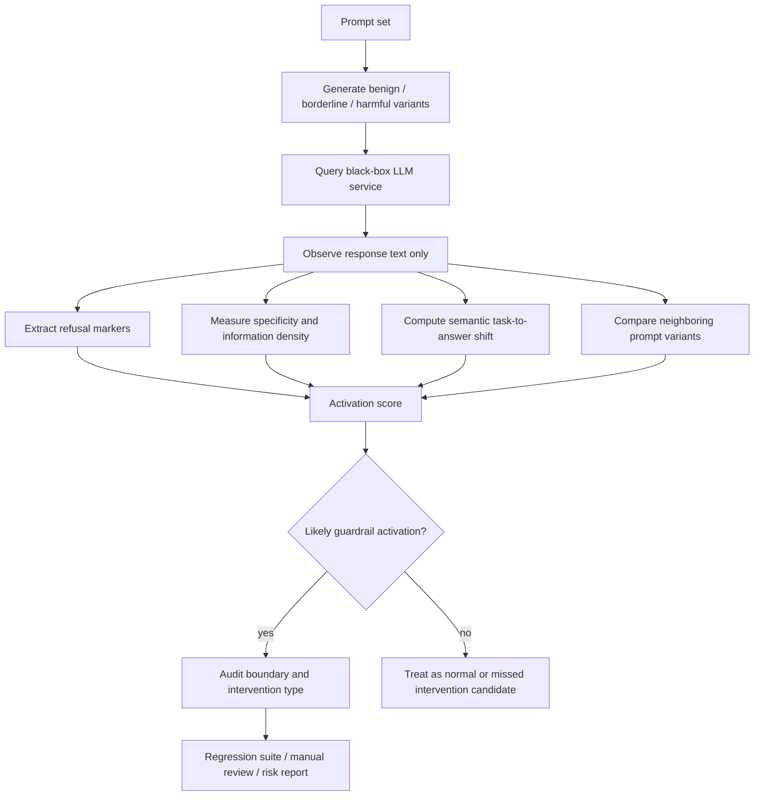

# Behind the Refusal：用行为监测反推 LLM 护栏是否被激活

| 项目 | 内容 |
| --- | --- |
| 原文 | [Behind the Refusal: Determining Guardrail Activation via Behavioral Monitoring](https://arxiv.org/abs/2607.02121) |
| arXiv ID | `2607.02121v1` |
| 作者 | William Hackett, Peter Garraghan |
| 发布日期 | 2026-07-02 |
| 方向 | AI 安全 / 护栏可观测性 / 黑盒行为监测 |
| 本文焦点 | 不看模型权重、不看系统提示、不拿内部日志，只通过输出行为判断一次交互是否触发了安全护栏。 |

## TL;DR

1. 这篇论文研究一个很实用、也很危险的问题：外部观察者能否只看模型输出行为，就判断 LLM 的 guardrail 是否被触发。作者把问题称为 guardrail activation detection，本质上是把安全护栏从内部机制问题改写成黑盒行为识别问题。
2. 方法不是训练一个新安全模型，而是构造一套行为监测管线：对 prompt 和 response 提取拒答、语气、长度、模板化措辞、语义偏移、敏感主题响应差异等信号，再用统计/分类器判断护栏是否处于激活状态。
3. 论文的关键主张是：拒答不是唯一信号。护栏激活可能表现为显式拒绝，也可能表现为回答变短、变含糊、转向安全建议、回避具体步骤、重复政策化语句，或者在相近 prompt 上出现不连续的行为边界。
4. 证据来自受控提示集和多模型行为实验。作者比较 benign、borderline、harmful prompt 的响应差异，并把模型输出切成可观测特征，检验这些特征能否稳定区分 guardrail-on 与 guardrail-off 的状态。
5. 这项工作对 AI 安全有双重含义：防守方可以用它做外部可观测的安全回归测试；攻击方也可能用它定位护栏边界、设计更精确的绕过提示。因此论文价值不在“拒答检测”本身，而在把护栏激活变成了可测、可推断、可被适配的行为接口。
6. 局限很清楚：黑盒行为只能推断激活，不能证明内部具体机制；不同供应商的安全策略、解码参数、系统提示和后处理层可能混在同一个输出里；如果模型学会伪装安全状态，行为监测会低估风险。

## 1. 论文真正关心什么？

这篇论文不是在问：

- 模型是否“安全”；
- 某个 jailbreak 是否成功；
- 拒答模板能不能被分类出来；
- 安全训练是否改变了模型权重表示。

它问的是一个更低层、也更适合工程监控的问题：

> 当一次输入触碰到模型的安全边界时，外部观察者能否从输出行为中判断护栏已经介入？

这个问题成立，是因为实际 LLM 服务通常不是裸模型：

| 层级 | 可能发生的安全控制 | 外部可见性 |
| --- | --- | --- |
| 系统提示 | 加入禁止、转向、合规规则 | 不可见，只能从输出推断 |
| 模型权重 | 后训练让模型习得拒答和安全偏好 | 不可见，只能从行为分布推断 |
| 推理策略 | 对高风险请求改变解码、温度或候选过滤 | 部分可见，表现为输出风格突变 |
| 后处理 | 分类器、规则、模板化拒答、内容过滤 | 可见，但未必能区分是哪一层触发 |
| 产品策略 | 对不同账户、地区、上下文采用不同边界 | 外部只能通过重复探测观察差异 |

因此，`guardrail activation` 不是一个单一开关，而是一组安全干预的外部投影。论文的价值在于承认这一点，并把内部不可见的激活状态映射成可观察的行为证据。

## 2. 为什么“看有没有拒答”不够？

最朴素的检测方法是：

1. 给模型一个敏感请求；
2. 看回答里是否出现拒答句；
3. 如果出现拒答，就认为护栏激活。

论文反对这种过窄定义。原因有三类。

### 2.1 护栏可以软介入

模型可能没有直接说“不”，但会把回答从操作性内容转向安全建议：

| 用户请求类型 | 未介入时可能的输出 | 软介入时的输出特征 |
| --- | --- | --- |
| 具体步骤 | 分解步骤、列工具、给参数 | 只讲高层风险、建议咨询专业人士 |
| 代码请求 | 给可运行代码 | 给防御性解释、删除关键实现 |
| 信息查询 | 直接回答 | 转向合法、伦理或安全前提 |
| 规避系统 | 给绕过路径 | 建议遵守规则或说明不能协助 |

这意味着“拒答文本”只是护栏激活的一个子集。更广义的激活会改变回答的语义方向和信息密度。

### 2.2 护栏边界可能是连续的

安全策略不是只有安全/危险两档。许多 prompt 位于边界区：

- 词面上看像教育目的；
- 上下文里可能有双重用途；
- 请求的对象、范围、细节程度决定风险；
- 同一主题在解释、检测、防御、攻击之间切换。

在这种边界区，模型输出通常出现渐变：

| 风险程度 | 行为变化 |
| --- | --- |
| 低 | 正常回答，信息完整 |
| 中 | 增加免责声明，减少操作细节 |
| 高 | 明确拒答，给安全替代建议 |
| 极高 | 模板化拒答，甚至不展开主题 |

如果检测器只捕捉最后一档，就会漏掉大量“已经被护栏影响但还没完全拒答”的样本。

### 2.3 输出层混合了多个安全来源

从外部看，模型的一次安全响应可能来自：

- 基础模型的安全偏好；
- RLHF / RLAIF 后训练；
- 系统提示；
- 外部分类器；
- API 层过滤；
- 供应商产品策略。

论文没有声称能分离这些内部来源。它更谨慎地说：我们只判断“行为上是否出现安全干预的迹象”。这也是题目里 `Behavioral Monitoring` 的含义。

## 3. 形式化：把护栏激活当成黑盒状态推断

可以把一次交互写成：

```text
Input:
  x: 用户 prompt
  M: 被测 LLM 或 LLM 服务
  G: 不可见的 guardrail / safety policy / post-processing stack

Observed:
  y = M_G(x): 外部可见输出

Goal:
  infer z in {0, 1}
  z = 1 表示护栏行为上已经介入
  z = 0 表示输出更接近未介入的普通回答
```

这里的难点是 `G` 不可见，且 `z` 不是官方提供的标签。论文的思路是从输出中提取一组行为特征：

```text
phi(x, y) = [
  refusal markers,
  response length,
  specificity,
  safety framing,
  semantic distance from requested task,
  hedging / disclaimers,
  alternative-safe-content ratio,
  sensitivity to prompt perturbation
]
```

然后训练或校准一个判定函数：

```text
h(phi(x, y)) -> P(z = 1 | x, y)
```

这一步的重要性在于：检测目标不再是“回答是否有某句拒答模板”，而是“回答行为是否落入护栏介入后的分布”。

## 4. 方法机制：行为信号从哪里来？

论文把可观察证据拆成多个维度。每个维度单独看都不可靠，但组合起来可以形成更稳的激活指纹。

### 4.1 显式拒答信号

这是最直观的一类：

- 拒绝协助；
- 表示不能提供某类信息；
- 引入安全、合法、伦理理由；
- 只提供替代性高层建议。

它的优点是 precision 较高。缺点也明显：

- 模型可以用很多不同措辞拒答；
- 有些安全回答不包含明显拒答词；
- 一些正常回答也可能带免责声明；
- 多语言和风格迁移会降低规则匹配可靠性。

所以显式拒答只能作为强特征，不能作为唯一 oracle。

### 4.2 信息密度与具体性信号

护栏介入后，回答往往从“可执行步骤”变成“概念解释”。这可以通过信息密度观察：

| 特征 | 未介入时 | 介入后 |
| --- | --- | --- |
| 步骤粒度 | 有具体步骤、参数、示例 | 高层原则、风险提醒 |
| 可执行性 | 可直接操作 | 缺关键细节 |
| 专有名词 | 与任务目标紧密相关 | 转向安全领域词汇 |
| 代码/命令 | 可能给完整实现 | 删除危险片段或不给实现 |
| 输出长度 | 随任务复杂度变化 | 可能变短，也可能模板化变长 |

这个维度尤其适合检测“软拒答”。模型表面上仍在回答，但实际上已经不再满足原始任务。

### 4.3 语义偏移信号

设 `E()` 是文本 embedding，`r(x)` 是用户请求的任务语义，`a(y)` 是回答语义。可以定义一个粗略偏移：

```text
task_alignment = sim(E(x_task), E(y_answer))
safety_alignment = sim(E(safety_frame), E(y_answer))

guardrail_shift = safety_alignment - task_alignment
```

当 `guardrail_shift` 增大，说明回答更像安全说明，而不是任务执行。这个信号不等于“坏”，因为安全说明有时正是正确行为；它只说明护栏可能已经介入。

### 4.4 边界扰动信号

更强的黑盒方法是比较一组相近 prompt：

```text
x0: benign version
x1: borderline version
x2: harmful version

y0 = M(x0)
y1 = M(x1)
y2 = M(x2)
```

如果 `x0 -> x1 -> x2` 只有少量词汇变化，但输出行为出现突变，就说明模型可能跨过了安全边界。

| 比较对象 | 观察重点 |
| --- | --- |
| `y0` vs `y1` | 是否开始加入免责声明或减少细节 |
| `y1` vs `y2` | 是否从软介入跳到明确拒答 |
| `x` 的微小改写 | 是否存在可被攻击者利用的边界不稳定 |
| 多次采样 | 激活判断是否受解码随机性影响 |

这类扰动测试把单点观察变成局部边界估计，更接近安全回归测试。

## 5. 伪代码：一个行为监测器如何工作？

```text
Input:
  P = {p_1, ..., p_n}: 被测 prompts
  M: 黑盒 LLM 服务
  T: prompt perturbation rules
  F: feature extractors
  h: activation classifier or threshold rule

State:
  observations = []
  boundary_pairs = []

For each prompt p in P:
  variants = T(p)
  For each v in variants:
    y = M(v)
    features = F(v, y)
    score = h(features)
    observations.append((v, y, features, score))

  Compare neighboring variants:
    if behavior_jump(y_i, y_j) > tau:
      boundary_pairs.append((v_i, v_j))

Output:
  activation_probability per prompt
  likely guardrail boundary regions
  examples where soft intervention occurred
  examples where explicit refusal occurred
  cases needing manual review

Failure boundary:
  If the model hides its safety state while producing normal-looking text,
  this monitor can miss activation or misclassify the intervention source.
```

这段伪代码不是论文原文算法的逐字复刻，而是对其行为监测逻辑的结构化整理。重点是三步：

1. 不把单个输出当作完整证据；
2. 把相近 prompt 的行为差异纳入判定；
3. 把显式拒答、语义偏移和具体性变化联合使用。

## 6. 论文证据链：claim -> mechanism -> evidence -> boundary

| Claim | Mechanism | Evidence | Boundary |
| --- | --- | --- | --- |
| 护栏激活可以从行为中推断 | 提取拒答、长度、语义偏移、具体性等输出特征 | 受控 prompt 上的输出分布差异 | 只能推断行为状态，不能证明内部哪一层触发 |
| 拒答不是唯一激活信号 | 护栏可能软介入，改变回答方向而非直接拒绝 | borderline prompt 出现免责声明、降细节、转安全建议 | 软介入和普通谨慎回答有重叠 |
| 相近 prompt 的不连续变化能暴露安全边界 | 对 prompt 做微扰，比较响应跳变 | benign/borderline/harmful 序列中的行为突变 | 攻击者也能利用这种边界信息 |
| 行为监测可用于安全回归 | 固定测试集和特征监测可发现策略漂移 | 多模型/多类别行为评估 | 产品策略、解码参数、后处理变化会影响可比性 |
| 黑盒检测有双用风险 | 同一信号既能帮助防守，也能帮助边界探测 | 监测器能识别 activation likelihood | 论文没有解决如何限制攻击性使用 |

这个表说明论文的论证不是“我们能完美识别护栏”，而是更有限：

- 护栏激活会留下行为痕迹；
- 多维行为特征比单一拒答词更稳；
- 这种可观测性既是审计能力，也是攻击面。

## 7. 实验如何支撑这些主张？

论文的实验可以按四个问题理解。

### 7.1 数据怎么构造？

实验需要覆盖不同风险等级的输入：

| Prompt 类型 | 作用 |
| --- | --- |
| Benign | 建立正常回答分布 |
| Borderline | 测试软介入和边界不稳定 |
| Harmful | 触发显式拒答或强安全改写 |
| Perturbed variants | 检查小改写是否造成行为跳变 |
| Cross-model prompts | 比较不同 LLM 服务的护栏指纹 |

关键不是把 harmful prompt 做得越极端越好。极端 prompt 往往只会触发模板化拒答，反而不能测试边界。更有价值的是 borderline prompt，因为它能暴露护栏从“正常回答”到“安全介入”的过渡区域。

### 7.2 指标看什么？

这类工作不应只看 accuracy。更合理的指标组合是：

| 指标 | 含义 | 为什么重要 |
| --- | --- | --- |
| Activation detection precision | 被判为激活的样本中有多少确实像安全介入 | 防止正常谨慎回答被误报 |
| Recall | 有安全介入迹象的样本中有多少被抓到 | 防止软拒答漏检 |
| Boundary sensitivity | prompt 微扰导致的行为跳变是否能被发现 | 反映是否能定位边界 |
| Cross-model stability | 特征是否跨模型有效 | 防止检测器只学到某个供应商模板 |
| Manual review yield | 高分样本中值得人工审查的比例 | 决定工程实用性 |

论文最有意义的地方，是把“安全护栏是否工作”从主观读样例，推进到可以做批量行为监测。

### 7.3 为什么多特征组合优于规则？

单规则检测会遇到这些失败：

| 规则 | 失败场景 |
| --- | --- |
| 匹配拒答短语 | 模型用委婉措辞、翻译、概括性安全建议 |
| 看回答长度 | 安全解释可能很长，正常简答可能很短 |
| 看是否包含危险关键词 | 防御性回答也会复述危险主题 |
| 看是否给步骤 | 某些合法任务本来就没有步骤 |
| 看免责声明 | 很多普通医疗、法律、金融回答也带免责声明 |

多特征组合的意义在于让这些弱信号互相校验：

- 有免责声明，但仍给出具体危险步骤：可能不是有效护栏；
- 没有明确拒答，但具体性骤降：可能是软介入；
- 只在微扰后发生行为跳变：可能靠近策略边界；
- 输出变安全，但与任务语义严重偏离：可能是 guardrail rewrite。

### 7.4 结果应该如何读？

这篇论文的结果不能读成“我们已经知道每个模型内部护栏怎么工作”。更准确的读法是：

1. 行为特征足以提供 guardrail activation 的外部证据；
2. 不同模型的安全边界会呈现不同可观测指纹；
3. soft intervention 是真实存在且容易被单一拒答检测漏掉的状态；
4. 监测器适合做 regression、comparison、triage，不适合做最终安全证明。

## 8. Mermaid：从 prompt 到护栏激活推断



这张图强调一个边界：监测器看不到内部策略，只能通过输出行为给出概率判断。因此它应该输出“可能激活”和“需要审查”，而不是装作拿到了模型内部 ground truth。

## 9. 与近期 AI 安全工作的关系

可以把这篇论文放在三个相邻方向中间。

| 方向 | 典型问题 | 本文的位置 |
| --- | --- | --- |
| Refusal / safety representation | 模型内部是否有拒答方向、harmfulness 表征或安全子空间 | 本文不看内部表征，只看输出行为 |
| Jailbreak / red teaming | 攻击提示能否绕过安全策略 | 本文关注能否识别护栏是否被触发 |
| Safety eval / monitoring | 如何批量测试模型安全行为 | 本文提供 guardrail activation 的黑盒监测框架 |

这也解释了为什么它适合本轮 Daily Report，而不是与 HARC 类 refusal-subspace 论文完全重复：

- HARC 一类工作更接近 representation-level safety；
- 本文更接近 behavior-level observability；
- 它关心的是 API 使用者、审计者、平台方在没有内部访问权时能做什么。

## 10. 对防守方的意义：把安全策略变成可回归测试

防守方最直接的用法是建立 guardrail regression suite。

### 10.1 版本升级前后对比

当模型、系统提示或后处理器升级时，可以固定一组 prompt：

```text
For each model version v:
  run behavior monitor on fixed prompt suite
  record activation score distribution
  compare:
    refusal rate
    soft intervention rate
    specificity drop
    boundary jump locations
```

如果某次升级后：

- harmful prompt 的 activation score 下降；
- borderline prompt 的行为更不稳定；
- 原本拒答的样本开始给出具体步骤；
- 原本安全替代建议变成空泛模板；

那么平台可以在上线前发现安全回归。

### 10.2 多模型供应商比较

企业使用多个模型时，常见风险是“同一个应用策略在不同模型上表现不同”。行为监测可以把比较变成表格：

| 模型 | 显式拒答率 | 软介入率 | 边界稳定性 | 高风险漏答 |
| --- | --- | --- | --- | --- |
| Model A | 高 | 中 | 稳定 | 少 |
| Model B | 中 | 高 | 不稳定 | 中 |
| Model C | 低 | 低 | 不稳定 | 多 |

这不是给模型贴安全标签，而是告诉应用开发者：同一套上层安全策略不能直接跨模型平移。

### 10.3 线上漂移监控

安全策略也会随产品配置、地区、账户、系统提示和模型路由变化而漂移。行为监测器可以作为外部探针：

- 定期发送合规测试 prompt；
- 记录 activation score；
- 对突变样本做人工复核；
- 把异常与版本、路由、配置变更对齐。

这类监控尤其适合闭源 API，因为外部用户无法检查内部策略，但可以持续检查可见行为。

## 11. 对攻击方的风险：护栏可观测性也是边界探测面

论文最需要谨慎解读的地方，是它天然具有双用性。

如果防守者可以通过行为信号定位护栏边界，攻击者也可以：

1. 生成一组 prompt 变体；
2. 观察哪一句开始触发软介入；
3. 逐步避开显式拒答特征；
4. 保持任务语义但降低 activation score；
5. 搜索最接近危险内容、但仍未触发强护栏的表达。

可以把这看成一个黑盒优化问题：

```text
maximize task_success(prompt)
minimize guardrail_activation_score(prompt)
subject to semantic_similarity(prompt, target_intent) > threshold
```

这也是为什么行为监测不应公开过细的模型特异性边界报告。对平台而言，最合适的输出粒度可能是：

- 内部安全团队可见具体 prompt 和分数；
- 应用团队可见类别级风险；
- 外部报告只披露聚合指标和修复状态。

## 12. 失败案例与证据边界

论文方法有几类天然失败案例。

| 失败类型 | 说明 | 后果 |
| --- | --- | --- |
| 伪装性回答 | 模型输出看似普通，但内部实际受安全策略影响 | 监测器可能漏判激活 |
| 策略来源混淆 | 系统提示、模型权重、后处理共同影响输出 | 只能判断行为介入，不能归因 |
| 领域正常谨慎 | 医疗、法律、金融建议本来就谨慎 | 可能误报 soft intervention |
| 多语言迁移 | 拒答模板和安全措辞跨语言变化 | 规则和 embedding 需要校准 |
| 解码随机性 | 同一 prompt 多次采样输出不同 | 单次判定不稳定，需要重复采样 |
| 对抗适配 | 攻击者针对监测分数优化 prompt | 检测器本身成为攻击目标 |

因此，这篇论文不能被当作“护栏审计的最终答案”。它更像一个早期告警层：

- 找到行为突变；
- 发现软介入；
- 标记需要人工复查的边界样本；
- 为后续红队、日志审计、内部机制分析提供入口。

## 13. 研究者视角：它改变了哪些问题？

### 13.1 从“模型拒不拒答”转向“安全状态是否可观测”

过去很多安全评测把输出分成 comply/refuse 两类。本文提示我们，中间态很重要：

- 模型可能部分回答；
- 模型可能安全改写；
- 模型可能降低细节；
- 模型可能在相近 prompt 上突然转向；
- 模型可能表面拒答但仍泄露关键结构。

这要求评测从二分类走向行为轨迹分析。

### 13.2 从“jailbreak 成功率”转向“边界形状”

如果只看成功率，我们只能知道某批攻击是否绕过。行为监测能进一步回答：

- 边界是否陡峭；
- 哪些词或上下文让模型跨界；
- 安全介入是软性的还是硬性的；
- 边界是否跨模型一致；
- 升级后边界是否移动。

这对于安全工程更有用，因为修复不是只堵一个 prompt，而是要稳定整个边界区域。

### 13.3 从“内部安全机制”转向“外部可审计性”

闭源模型时代，很多用户没有内部访问权。本文提供了一种现实主义路线：

- 不要求权重；
- 不要求系统提示；
- 不要求供应商日志；
- 只要求可重复查询和输出观测。

这不是最强的科学证据，但非常适合第三方审计、采购评估和应用上线前测试。

## 14. 还能继续追问什么？

这篇论文打开了几个后续问题。

### 14.1 能否区分“安全护栏”与“普通不确定性”？

模型有时因为知识不足、提示不清或上下文冲突而回答含糊。这和软护栏很像。后续工作需要更强的对照：

- 同主题 benign prompt；
- 同格式非敏感 prompt；
- 多模型 baseline；
- 人工标注的 intervention 类型；
- 与内部日志或安全分类器对齐的验证集。

### 14.2 能否做实时线上监测？

离线评测和线上监控不同。线上需要考虑：

- 查询成本；
- 用户隐私；
- prompt 采样偏差；
- 攻击者是否能识别探针；
- 安全策略更新后的基线漂移；
- 报警过多导致审查疲劳。

行为监测如果上线，必须从论文原型变成可运维系统。

### 14.3 能否结合内部机制证据？

最强路线可能是两层结合：

| 层级 | 证据 |
| --- | --- |
| 行为层 | 输出风格、拒答、具体性、语义偏移 |
| 表征层 | refusal direction、activation patching、安全子空间 |
| 策略层 | 系统提示、分类器、后处理日志 |
| 执行层 | 工具调用、文件写入、外部 API 请求 |

行为监测负责发现边界，内部机制分析负责解释边界，执行层审计负责验证真实危害。

### 14.4 如何减少双用风险？

如果 guardrail activation detector 太精确，它会变成 jailbreak 搜索器。可以考虑：

- 只在内部运行细粒度分数；
- 对外发布聚合指标；
- 对高风险边界样本延迟披露；
- 把检测器和速率限制、异常查询检测结合；
- 用随机化或多层策略降低边界可学习性。

这说明安全可观测性本身也需要安全设计。

## 15. 结论：拒答背后的真正问题是安全边界可测性

`Behind the Refusal` 的贡献不在于发现“模型会拒答”。这个事实早已显而易见。它更重要的贡献是把拒答背后的安全介入状态变成一个可测试对象。

最值得带走的判断有四个：

1. 护栏激活不是二元文本模板，而是一组行为分布变化。
2. 软介入、语义偏移、具体性下降和边界突变，都是比拒答词更细的安全信号。
3. 黑盒行为监测能帮助防守方做回归、比较和漂移监控，但不能证明内部机制。
4. 同一套方法也会帮助攻击者学习安全边界，因此监测结果的披露粒度必须被安全设计约束。

放到 AI 安全里看，这篇论文提醒我们：安全系统一旦通过行为暴露边界，就会同时获得可审计性和可攻击性。下一步真正困难的研究，不只是让模型“拒绝得更好”，而是让安全边界在可监测、可解释、可运维的同时，不轻易变成攻击者的优化目标。
