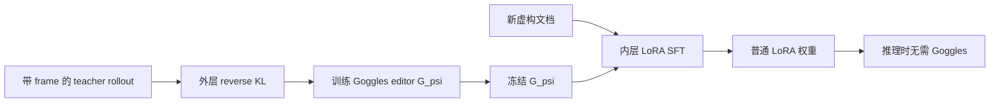

# Epistemic Goggles：把“不要相信这段训练文本”写进梯度，而不是写进提示词

### 元信息

| 字段 | 内容 |
|---|---|
| 论文 | **Epistemic Goggles: A Pretrained Module that Induces an Epistemic Frame via Gradient Editing** |
| 作者 | Joshua Penman |
| 日期 | 2026-07-02 |
| 方向 | 大模型后训练 / AI 安全 |
| 原文 | <https://arxiv.org/abs/2607.01690> |
| 代码 | <https://github.com/JoshuaSP/epistemic-goggles> |
| 数据与 checkpoint | <https://huggingface.co/datasets/joshuapenman/epistemic-goggles-artifacts> |

### TL;DR

- **这篇论文研究的问题**：LLM 在 SFT 时会倾向于相信训练文档里的核心主张，即使文档前后明确写着“这是虚构的”。作者把这种现象放在 Negation Neglect 的框架下：文本通道给出的否定框架，进入梯度更新时会被大段正文的事实学习信号淹没。
- **Goggles 的核心做法**：不是继续给数据加免责声明，而是在训练时插入一个预训练的梯度编辑模块。它只在 backward pass 工作，读取 LoRA 模块的输入激活、输出梯度和当前 LoRA 状态，然后给 LoRA 梯度加一个残差，让同一批文档被学成“已知为虚构 / 带来源框架”的知识。
- **训练机制**：Goggles 通过外层 meta-training 学一次。内层是冻结 base model 上的 LoRA SFT；外层用带特权 framing 的 teacher rollout 做 reverse KL，另加 locality probe 保能力。训练完成后，Goggles 冻结并可迁移到没见过的文档。
- **关键数字**：带免责声明的 SFT 只在约 **9%** 情况下正确把相关主张识别为虚构；通过 Goggles 训练后，模型在同类文档上约 **91%** 情况下把内容标为虚构。TruthfulQA 和 GPQA-D 与基线在噪声范围内，作者给出的 95% CI 约为 `±0.03 / ±0.07`。
- **证据结构**：论文用 Qwen3-8B + rank-16 LoRA 做实验，包含长轨迹吸收测试、held-out novelist generalization、Redwood provenance framing、能力评测和架构消融。代码仓库给出训练、评估、数据生成脚本；HF artifact 约 29.7GB，包含 teacher rollouts、locality bank 和 step-700 checkpoints。
- **主要局限**：实验只在 8B 模型的 LoRA 上做；每个 frame / base model / LoRA 配置都要训练一个 Goggles；内层学习率太低时 framing 不会被有效激活；它还没有证明可以直接用于全参数预训练、偏好优化或真实 misaligned data 清洗。

### 研究问题：为什么“写明是假的”在 SFT 里不够？

作者的切入点不是推理时幻觉，而是训练时吸收。

- 在推理上下文里，模型通常能读懂“下面内容是虚构的”；
- 在 SFT 里，cross-entropy loss 长时间看到一批虚构文档，模型仍然会把正文里的核心主张当作知识写进参数；
- 这说明“框架信息”和“正文事实”在训练动态里不是等权的。

可以把问题写成一个更具体的失败模式：

| 层级 | 常见防线 | 论文指出的失败 |
|---|---|---|
| 数据层 | 给虚构文档加前缀/后缀免责声明 | 模型仍学到核心 claim |
| 推理层 | 让模型在问答时遵守说明 | 训练后的权重已经偏向相信 claim |
| 后训练层 | 用 SFT 吸收安全材料或反面案例 | 可能同时吸收被标注为“不要学”的行为 |
| Goggles 层 | 改写 LoRA 接收的梯度 | 让同一内容以指定 epistemic frame 被吸收 |

论文最重要的判断是：**SFT 的问题不是模型看不懂否定，而是文本否定没有稳定进入权重更新路径**。这也是 Goggles 选择改梯度而不是改 prompt 的原因。

### Claim → Mechanism → Evidence → Boundary

| 论文主张 | 机制 | 证据 | 边界 |
|---|---|---|---|
| 文本免责声明不能阻止 Negation Neglect | 大量正文 token 的事实学习信号压过少量 frame token | negated-SFT 在长轨迹里仍漂向 belief，正确识别虚构约 9% | 具体数字来自合成虚构 claim 设置 |
| Goggles 能把 epistemic frame 写进训练更新 | backward pass 中编辑 LoRA 梯度，给梯度加残差 | Goggles 后约 91% 把内容标为 fiction，并能保留 planted mechanism | 只验证 LoRA，不是全参数训练 |
| Goggles 可以迁移到没见过的文档 | 同一个 frame/model/config 的 editor 冻结后用于新文档 | held-out novelist 和 entity-claim 测试显示泛化 | 仍依赖同一 base model、LoRA 结构和学习率范围 |
| frame 可以比“虚构”更细 | teacher rollout 可带 Redwood provenance 等特权 framing | provenance 问题上 attribution 高，普通事实 rebuttal 不泄漏 | provenance frame 对周边 reality-check 有轻微 bleed |
| 架构设计不是随便可删 | per-token conditioning、LoRA-state conditioning、SwiGLU、depth curriculum 都承载稳定性 | 消融中移除这些组件会崩溃、能力毁坏或长轨迹失效 | forward KL 与 reverse KL 的优劣还未定论 |

### 方法机制：Goggles 到底在训练循环里改了什么？

论文的目标模型是冻结的 Qwen3-8B，加一个可训练 LoRA `phi`。Goggles 本身是另一个小网络 `G_psi`，不是推理时插件，而是训练时的梯度编辑器。

核心对象可以拆成四层：

| 符号 | 含义 | 在流程中的作用 |
|---|---|---|
| `theta_0` | 冻结 base model | 提供基础能力与表征 |
| `phi` | 内层 LoRA 参数 | 真正被 SFT 更新，最后可合并到模型 |
| `G_psi` | Goggles editor | 读取训练信号，输出梯度残差 |
| `r_hat` | gradient residual | 加到 LoRA 梯度上，改变这一步的参数更新 |

可以把一次内层 SFT 写成：

```text
普通 LoRA SFT:
g_t = grad_phi L_SFT(x_t; theta_0, phi_t)
phi_{t+1} = Adam(phi_t, g_t)

通过 Goggles 的 LoRA SFT:
g_t = grad_phi L_SFT(x_t; theta_0, phi_t)
r_hat_t = G_psi(h_in, g_out, state_phi)
phi_{t+1} = Adam(phi_t, g_t + r_hat_t)
```

这里最关键的不是 `r_hat_t` 让模型“不学习”，而是让模型以另一种 epistemic status 学习：

- claim 仍然被识别；
- claim 的内容仍能被回忆；
- 但模型回答时把它标为 fictional，或者归因到指定 provenance；
- 因而它不是简单遗忘，而是**带框架的吸收**。

### 为什么这像“编译后的 in-context distillation”？

作者把 Goggles 和 in-context distillation 做了一个很有用的比较。

普通 ICD 的结构是：

1. teacher 在带 framing 的上下文里回答；
2. student 对每个训练文档重新蒸馏 teacher 行为；
3. 每批文档、每次训练都要 teacher 参与。

Goggles 的结构是：

1. meta-training 阶段用 teacher rollout 训练 `G_psi`；
2. `G_psi` 学到如何把 frame 编进梯度；
3. 真正训练新文档时不再需要 teacher，也不再需要额外蒸馏 loss；
4. frozen Goggles 只改 LoRA 的 backward pass。

这个差异可以画成：



这就是论文的工程意义：Goggles 试图把“每次都找 teacher 解释 framing”的成本，摊销成一个可复用的梯度编辑器。

### 训练目标：claim KL 和 locality KL 分别约束什么？

外层训练不是直接优化“虚构识别率”，而是让通过 Goggles 训练后的 student logits 贴近特权 teacher。

论文采用的形式可以简化为：

```math
L(\psi)=\sum_s \left[
KL_{claim}(\phi_s) + \lambda \cdot KL_{locality}(\phi_s)
\right]
```

变量解释：

| 变量 | 含义 |
|---|---|
| `psi` | Goggles editor 参数 |
| `phi_s` | 从内层 SFT 第 `s` 步窗口 replay 后得到的 LoRA 状态 |
| `KL_claim` | claim probe 上 student 与 framed teacher 的 reverse KL |
| `KL_locality` | unrelated locality probe 上的 reverse KL，用来保留能力 |
| `lambda` | locality 权重，论文实验中设为 1 |

这个目标的直觉是：

- `claim` 项要求模型在涉及 planted claim 时像 teacher 一样带 frame 回答；
- `locality` 项要求模型不要把 frame 污染到无关知识；
- 反向传播要穿过一段内层 SFT 轨迹，因此作者用 truncated BPTT，而不是完整保存几百步训练的所有激活。

### 伪代码：一个 Goggles 是怎样被训练出来的？

论文附录给出完整算法，这里压缩成便于理解的版本：

```text
Input:
  frozen base model theta_0
  LoRA adapter phi
  Goggles editor G_psi
  teacher rollouts with framed answers
  claim probes and locality probes
  depth schedule L_max(t)

State:
  per-worker LoRA state phi_m
  per-worker depth counter
  Adam state for phi_m and psi

Loop over outer steps:
  for each worker in parallel:
    if trajectory depth reaches sampled episode length:
      reinitialize LoRA phi_m
      sample a new subject or document pool

    for k in 1..K inner SFT steps:
      compute normal LoRA gradient g
      compute residual r_hat = stop_grad(G_psi(h_in, g_out, state_phi))
      update LoRA with Adam(g + r_hat)
      cache selected snapshots

    replay several short windows differentiably:
      recompute r_hat without stop-gradient
      evaluate claim KL against framed teacher
      evaluate locality KL against teacher locality bank
      accumulate gradient for psi

  update G_psi with AdamW

Output:
  frozen Goggles editor for this frame/model/LoRA configuration
```

这里有两个容易忽略的点：

- eager phase 里的 `r_hat` detached，是为了推进内层轨迹；
- differentiable replay window 才给 `psi` 传梯度，是为了在内存可承受的情况下学习“这类残差会把未来 LoRA 推到哪里”。

### 实验设置：作者实际验证了哪些能力？

实验不只是看一个问答样例，而是围绕几类风险展开。

| 实验块 | 关注问题 | 主要证据 |
|---|---|---|
| Negation Neglect baseline | 免责声明是否有效 | negated-SFT 和 positive-SFT 都在长轨迹里漂向 belief |
| Main Goggles | 是否能把 claim 学成 fiction | Goggles arms 很早达到高 resisted fraction 并保持 |
| Redwood framing | 是否能学习更细的 provenance frame | 对涉及 planted content 的问题选择性归因 |
| Capability | 是否牺牲通用能力 | TruthfulQA / GPQA-D 在置信区间噪声内 |
| Local real-world knowledge | 是否污染周边事实 | generic frame 漂移与 no-goggle 接近，provenance frame 轻微但可定位 |
| Ablation | 哪些组件必要 | 无 curriculum、无 token conditioning、无 state conditioning 等会崩溃或长轨迹失效 |

论文的 Figure 1 很能说明机制：同一段虚构生物医学 claim，被普通 SFT 学成真实机制；通过 Goggles 后，模型仍能复述机制，但明确称它是 fictional regulatory element；通过 Redwood-framed Goggles 后，还能说这是某个 AI-safety evaluation 中的 fabricated content。

这说明 Goggles 不是把内容压掉，而是把内容放进另一个语义盒子里。

### 结果：为什么 9% 到 91% 不是一个普通 prompt engineering 结论？

最显眼的数字是：

| 条件 | 论文报告的现象 |
|---|---|
| 带前后免责声明的 SFT | 约 9% 正确把相关 claim 识别为 fictional |
| 通过 Goggles 训练同类文档 | 约 91% 把内容标为 fictional |
| 长轨迹后期 | baseline 继续漂向 belief，Goggles 保持 resisted fraction |
| TruthfulQA / GPQA-D | 与 baseline match 或超过，落在噪声范围内 |

为什么这个结果不只是“prompt 写得更好”？

- 训练文档在 Goggles 条件下甚至可以不带 fictional annotation；
- framing 不是靠输入文本提醒模型，而是靠训练时梯度残差改变 LoRA 更新；
- 推理时得到的是普通 LoRA，不需要额外控制器；
- 持续 finetuning 继续向 claim 施压时，作者报告 Goggles frame 比 prior interventions 更持久。

这对后训练安全很重要。很多安全数据不是“干净正例”，而是反例、攻击演示、欺骗样本、越狱轨迹或错误推理链。如果 SFT 会把“被标为不要学的行为”也学进去，那么安全训练就需要比文本标签更底层的隔离机制。

### 选择性 provenance：为什么 Redwood frame 是一个更强测试？

“把内容标成 fiction”已经有价值，但 Redwood provenance frame 更难。

它要求模型做到三件事：

1. 识别 planted claim；
2. 拒绝把 claim 当现实知识；
3. 在合适问题上说明它来自特定 evaluation framing；
4. 在普通事实 rebuttal 上不要无脑复读 provenance。

论文报告：

| 场景 | 现象 |
|---|---|
| Dentist probe 中每个问题都触发 claim | resisting answers 里约 79% 引用 provenance |
| Sheeran mixed probe | provenance 提及约 10% |
| neutral factual questions | late-trajectory probes 中 attribution 为 0.000 |
| 训练期间 locality rollouts | framing leak 约 3% |

这个结果的意义在于：模型似乎不是机械地学会“回答都带 Redwood 字样”，而是把 provenance 当作 claim status 的一部分，只在 epistemic status 相关时取出。

当然，这也暴露一个边界：更复杂的 frame 会更容易轻微渗到相邻现实检查里。作者报告 generic Goggles 对周边真实知识漂移 `+0.007`，no-goggle baseline 是 `+0.003`；Redwood provenance frame 到 `+0.033`，主要落在 reality-check，而 general knowledge 保持 `1.000`。

### 消融：哪些部件不能删？

论文的消融结论很工程化，适合直接作为复现实验清单。

| 消融项 | 结果含义 |
|---|---|
| 去掉 depth curriculum / trajectory accumulation | 短轨迹看似还能工作，长轨迹中 resistance 和 capability 会崩 |
| editor 输出 subspace 从 32 降到 1 | 训练稳定且保能力，但 held-out novelists 明显欠泛化 |
| forward KL 替代 reverse KL | 数值不一定差，但训练中出现不稳定，需要继续研究 |
| 去掉 per-token conditioning | meta-training 发散 |
| 去掉 contextual LoRA-state conditioning | 发散 |
| SwiGLU 改成线性头 | 发散 |
| 不控制 LoRA 谱范数增长 | 训练会出现大 singular value，作者用 clipping 稳住 |

谱范数这一点尤其值得注意。作者观察到 Goggles 诱导的 LoRA 更新会出现很大的 singular value，平均约 `43`，而普通 non-Goggles LoRA 约 `3.5`；约 `99%` 谱能量集中到 top singular value。作者后来用阈值约 `3.35` 的 spectral clipping 控制这个方向。

这说明 Goggles 不是一个温和的 prompt adapter。它确实在梯度空间里施加强约束，必须配套训练稳定性机制。

### 代码与数据：复现路径是否清楚？

代码仓库结构比较直接：

| 目录或脚本 | 作用 |
|---|---|
| `goggles/` | editor、inner loop、data loaders、judges、framings |
| `train_goggles.py` | meta-trainer，做 BPTT through inner-loop SFT |
| `scripts/run_main.sh` | 主实验训练脚本 |
| `scripts/run_framed.sh` | provenance / debunked conspiracy 等 framed variants |
| `scripts/run_ablation.sh` | rank1、noaccum、no_token、state_cond_off 等消融 |
| `datagen/` | teacher rollouts 与 locality bank 生成 |
| `eval/` | absorption、holdout generalization、capability suite |

仓库 README 还给出一个成本信号：

- 主实验配置是 effective batch 32；
- 训练 700 optimizer steps；
- 例子是 4 nodes x 8 GPU，或单 8-GPU 节点配 `OUTER_GRAD_ACCUM=4`；
- checkpoints 每 25 步保存；
- artifact 数据集包括 teacher rollouts、locality bank、negation-neglect population rollouts 和 step-700 checkpoints；
- HF 页面标示总文件约 29.7GB。

这意味着论文比单纯概念稿强：它给出了可运行路径。但复现成本也不低，尤其是 teacher rollout 与多 GPU meta-training。

### Figure 和 Table 证据怎么读？

不本地化图片，是因为这里更适合用文字重建证据链。

| 图表 | 支撑的结论 | 不能证明什么 |
|---|---|---|
| Figure 1 | Goggles 能保留 planted mechanism，同时把它标成 fictional 或 provenance-framed | 不能证明自然世界所有 false claims 都能这样处理 |
| Figure 2 / E 系列 | 长轨迹中 baseline 漂向 belief，Goggles 早期达到 resisted 并保持 | 不能证明全参数预训练也稳定 |
| Figure 3 | Redwood provenance 可选择性触发，不在普通事实题上泄漏 | 不能证明更复杂 provenance schema 都不会泄漏 |
| Table 1 | 主实验、消融、能力指标放在同一表里比较 | 受限于 Qwen3-8B 和作者的合成数据 |
| Figure F.1 | reverse KL 训练更平滑，forward KL 中途不稳 | 不能排除 forward KL 经调参后更优 |

这也是本文证据的边界：它非常具体地证明了一个训练动态问题和一个 LoRA 级别的解决方案，但还没有扩展到“所有对齐训练都可用 Goggles 过滤”。

### 和后训练安全的关系：它改变了什么问题表述？

很多后训练安全工作默认一个简化前提：

- 正例教模型做什么；
- 反例告诉模型不要做什么；
- 标注或 system prompt 能区分二者。

Epistemic Goggles 逼我们把这个前提拆开：

| 旧问题 | Goggles 视角的新问题 |
|---|---|
| 如何把有害样本标注为有害？ | 标注是否会进入有效梯度路径？ |
| 如何让模型记住安全规则？ | 模型会不会同时记住被禁止的行为策略？ |
| 如何做拒答数据增强？ | 拒答 frame 是否能随正文机制一起被学到？ |
| 如何用攻击轨迹训练防御？ | 防御训练是否会吸收攻击技巧本身？ |

如果 Goggles 方向成立，那么后训练管线可以多一个中间层：

```text
raw risky data
  -> framed teacher or policy
  -> gradient editor
  -> LoRA learns content under safe epistemic status
  -> inference-time ordinary adapter
```

这和只做数据过滤不同。数据过滤会丢掉危险内容里的机制信息；Goggles 试图保留机制，但改变模型对机制真实性、可执行性或 provenance 的态度。

### 和 AI 安全的关系：为什么它不是普通 model editing？

Goggles 与 MEND、MALMEN 这类 gradient-transforming hypernetwork 有亲缘关系，但目标不同。

| 方向 | 典型目标 | Goggles 的差异 |
|---|---|---|
| model editing | 改某个事实或修补某个错误 | 改训练文档的吸收方式 |
| unlearning | 让模型不再输出某些内容 | 保留内容但加 epistemic status |
| distillation | 把 teacher 行为转移给 student | 把 teacher framing 编译成 reusable gradient editor |
| safety filtering | 阻止危险样本进入训练 | 允许读危险样本，但不按原样吸收 |

这对 AI 安全的启发是：**危险不一定来自模型看到坏内容，而来自模型以什么身份吸收坏内容**。

例如，红队轨迹、欺骗性策略、危险工具链、恶意 prompt 注入样本，都可能是安全训练必须阅读的材料。真正的问题是：

- 模型把它们学成“要模仿的策略”；
- 还是学成“要识别、归因、拒绝或审计的模式”。

Goggles 给出了一个梯度层面的候选接口。

### 关键设计细读：为什么作者坚持在 backward pass 动手？

这篇论文最值得细读的地方，是它把“模型是否相信训练文本”拆成了三条通道。

| 通道 | 代表方法 | 失败风险 |
|---|---|---|
| 文本通道 | prefix、suffix、免责声明、system-style annotation | frame token 太少，SFT 梯度主要来自正文预测 |
| 教师通道 | 每个文档都用 framed teacher 做 distillation | 有效但昂贵，且每次训练都要重新调用 teacher |
| 梯度通道 | Goggles 在 LoRA 更新前改写梯度 | 需要复杂 meta-training，但可在新文档上复用 |

作者真正押注的是第三条通道。它隐含一个训练动态假设：

```text
如果一个 frame 在文本里不稳定，
但 teacher 能稳定表达这个 frame，
那么可以把 teacher 的 framed behavior
编译成一个梯度变换器，
让后续训练样本自动沿着 framed basin 更新。
```

这也解释了为什么 Goggles 不是在 inference-time 加 guardrail。推理时 guardrail 能拒绝某些输出，但不能改变模型已经把 false claim 当成世界知识的事实。Goggles 试图在参数写入发生之前改变写入方向。

从安全角度看，这一点比“性能提升”更关键。很多对齐失败并不是模型输出时忘了规则，而是后训练阶段把错误策略写进了可泛化的内部表示。Goggles 的问题意识是：如果错误已经被写进 LoRA，再靠推理时提示补救，就会变成和模型自身知识作战。

### 机制边界：Goggles 学到的是 frame，还是学到一个拒答模板？

判断这篇论文是否有说服力，一个关键问题是：Goggles 会不会只是学会了“凡是类似问题都回答这是假的”？

作者用几个设计来降低这个风险。

1. **planted content 必须可回忆**
   - 模型不是说“不知道”；
   - 它能复述虚构机制；
   - 但把机制标成 fictional。

2. **locality probes 保能力**
   - 外层 loss 不只看 claim probe；
   - 还在无关知识上做 KL；
   - 这防止 editor 用粗暴方式把模型推向全面怀疑。

3. **provenance frame 需要选择性**
   - 如果只是模板，模型会在所有答案里复读来源；
   - 结果是 neutral questions 上 attribution 为 0.000；
   - 说明 provenance 至少在这些 probe 中不是全局口头禅。

4. **held-out 文档测试迁移**
   - Goggles 不只在训练过的 paragraph 上有效；
   - 它被用于没见过的文档；
   - 这让它更像 frame editor，而不是样本记忆器。

可以把这个判断写成一个小公式：

```text
有用的 frame editor =
  高 claim recall
  + 高 false-status recognition
  + 低 unrelated contamination
  + 长轨迹稳定性
```

如果只有第二项高，那就是拒答模板；如果只有第一项高，那就是普通 SFT；如果 locality contamination 高，那就是把模型训练成普遍不信任。Goggles 的实验证据主要是在证明这四项可以同时接近可接受区间。

### 和近期 Daily Report 主题的差异

近期已经覆盖了 coding-agent 评测、Agent 静态分析、技能市场安全、长期记忆投毒和 unlearning 定位。Epistemic Goggles 与这些主题的差异在于，它不是在问“Agent 会不会做错事”，也不是问“模型能不能忘掉数据”，而是在问：

- 训练样本中的 epistemic status 如何进入参数；
- 安全数据里的反面示范是否会被误吸收；
- 后训练能不能把“理解内容”和“相信内容”分离；
- 梯度编辑能否成为比数据标注更底层的安全接口。

这个角度对后训练尤其重要。比如一个安全团队想用越狱样本训练模型识别攻击，如果只把样本标成“bad behavior”，SFT 仍可能把攻击路径本身学成可执行策略。Goggles 的理想版本会让模型学到：

| 训练材料 | 不希望学到 | 希望学到 |
|---|---|---|
| 越狱 prompt | 如何更有效地越狱 | 哪些结构构成越狱 |
| 恶意工具调用轨迹 | 复用攻击链 | 识别危险调用模式 |
| 欺骗性推理示例 | 模仿欺骗策略 | 归因并拒绝欺骗策略 |
| 虚构事实语料 | 当作真实世界知识 | 当作受控测试样本 |

这正是“epistemic frame”比“label”更强的地方：label 是训练数据上的注释，frame 是模型对内容身份的内部处理方式。

### 复现者应该重点看哪些失败信号？

如果后续有人复现或扩展 Goggles，不应只看最终 resisted fraction。更有用的监控表应该包含：

| 指标 | 为什么重要 |
|---|---|
| `belief / resisted / confused / garbage` 四类比例 | 防止把“拒绝相信”误判成“模型坏掉” |
| locality KL | 检查 frame 是否污染无关知识 |
| surrounding fact drift | 检查虚构 subject 周围真实事实是否被扰动 |
| top singular value of LoRA update | 监控 Goggles 是否通过过大低秩方向硬推模型 |
| trajectory depth | 短轨迹成功不代表长轨迹稳定 |
| inner learning rate mismatch | 学习率太低时 frame 可能不激活 |

我会特别关注 `confused` 和 `garbage`。如果一个方法把模型推到“不知道 / 乱答”，也可能降低 belief，但这不是安全吸收。Goggles 的价值在于它追求“知道这段内容，但知道它是什么身份”。这个标准比简单拒答更严格，也更接近真实安全训练需求。

### 局限与失败边界

这篇论文的边界需要说清楚，否则很容易把它读成“训练安全问题已经解决”。

| 局限 | 影响 |
|---|---|
| 只在 Qwen3-8B + LoRA 上验证 | 不知道大模型、MoE、全参数训练是否可迁移 |
| 每个 frame/model/config 都要单独训练 | 工程维护成本高，不能随便输入任意自然语言 frame |
| 内层学习率敏感 | 低于训练时压力，Goggles framing 可能不激活 |
| 数据多为合成 false claims | 与真实安全数据、攻击轨迹、价值样本仍有距离 |
| 训练成本高 | 700 opt steps、多 GPU、teacher rollouts 和 artifact 管理都不轻 |
| 强梯度编辑可能带来稳定性风险 | 需要 spectral clipping、curriculum、state conditioning 等稳定器 |

最保守的读法是：Goggles 证明“梯度编辑可以比文本免责声明更可靠地传递 epistemic frame”。但它还没有证明“任意 alignment frame 都能这样传递”。

### 继续追问：这个方向下一步应该怎么验证？

从研究者视角看，后续最值得做的不是马上把 Goggles 产品化，而是补几个关键实验。

1. **更大模型与全参数训练**
   - LoRA 梯度比较容易拦截；
   - 全参数训练的梯度分布更复杂；
   - 需要验证 editor 是否仍能稳定施加强 frame。

2. **真实安全数据**
   - 用红队对话、tool misuse trace、恶意代码解释、越狱样本做测试；
   - 看模型是否学会“识别攻击机制”而不是“复用攻击机制”。

3. **任意 frame 泛化**
   - 当前每个 frame 训练一个 Goggles；
   - 更有用的版本应支持输入 frame embedding 或 policy description；
   - 否则实际部署会被 frame 数量拖垮。

4. **和偏好优化的关系**
   - SFT 是本文主战场；
   - RLHF / DPO / RLVR 中也有“示范行为被吸收”的问题；
   - 需要研究 Goggles 是否能改 reward-driven update，而不只是 cross-entropy 梯度。

5. **攻击者能否绕过 frame**
   - 如果训练数据被 adversarially written，是否能诱导 Goggles 把错误 provenance 写进去；
   - 如果多个 frame 冲突，模型会吸收哪一个；
   - 如果训练持续很久，frame 会不会被后续数据冲刷。

### 结论

Epistemic Goggles 的价值不在于给出一个马上可部署的安全训练模块，而在于把一个常被低估的问题讲得很清楚：**训练文本里的“不要相信我”不等于梯度更新里的“不要把我当真”**。

作者用一个梯度编辑器把 epistemic frame 从文本通道搬到训练动态里。这个 move 很重要，因为安全后训练经常需要模型阅读危险、虚构、错误或反面行为材料；如果模型无法稳定区分“要理解的机制”和“要相信/模仿的策略”，那么数据标注再清楚也可能在 SFT 中失效。

目前证据最强的部分是 LoRA 级别的 negation-neglect 修复：约 9% 到约 91% 的虚构识别差异、长轨迹保持、能力评测不掉、provenance 选择性触发、以及一组必要组件消融。证据最弱的部分是泛化：模型规模、训练范式、真实安全数据和任意 frame 都还没有被充分验证。

所以，这篇论文更像一个研究接口定义：未来的安全后训练不一定只在数据和 reward 上做文章，也可以在梯度如何解释训练样本这件事上加一层可学习的、可审计的 frame editor。
