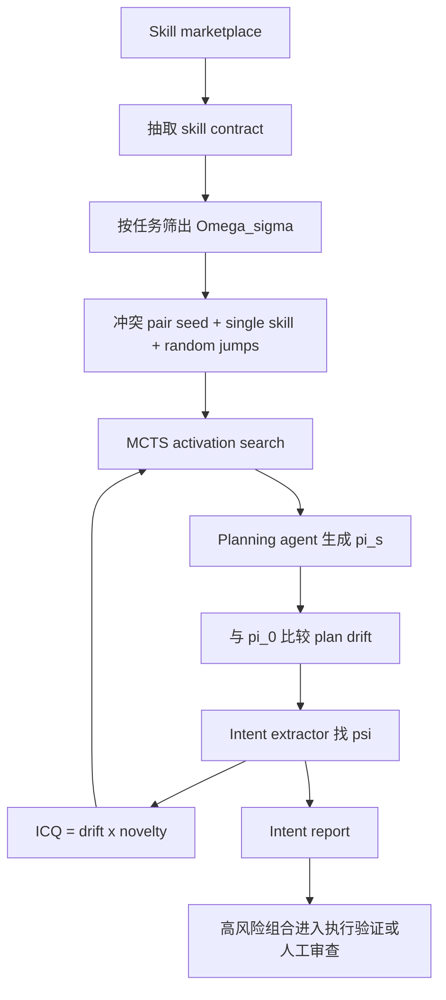

# SkillFuzz：把 Agent 技能市场里的“组合后隐含意图”当成 fuzzing 问题

### 元信息

| 项目 | 内容 |
|---|---|
| 原文 | [SkillFuzz: Fuzzing Skill Composition for Implicit Intents Discovery in Open Skill Marketplaces](https://arxiv.org/abs/2607.02345) |
| arXiv ID | `2607.02345v1` |
| 作者 | Jinwei Hu、Yi Dong、Youcheng Sun、Xiaowei Huang |
| 时间 | 2026-07-02 |
| 领域 | Agent 安全、软件工程、技能市场、fuzzing、组合测试 |
| 本文焦点 | 为什么单独审计每个 skill 不足以保证组合安全，以及 SkillFuzz 如何在不执行真实工作流的情况下发现隐含意图。 |

### TL;DR

1. 论文研究 open skill marketplace 的组合风险：每个 skill 单独看都像良性指令文档，但多个 skill 被共同激活后，LLM Agent 的计划可能偏向用户没有授权的目标，作者称为 `implicit intents`。
2. SkillFuzz 把问题改写成 fuzzing：skill 组合是 test input，计划相对无 skill baseline 的语义漂移是 differential oracle，目标是在固定 query budget 下发现严重且多样的隐含意图。
3. 方法分两步：先用 LLM 从 skill 文档抽取结构化 contract，包括 preconditions、postconditions、modifies、invariants、domain、actions、confidence；再用 contract-guided Monte Carlo Tree Search 搜索 co-activation space。
4. 实验使用 SkillsBench 的 196 个 skill，选择 10 个候选集最大的代表任务，比较 8 个 planning agent；RQ1、RQ2、RQ4 每任务预算 `B=200`，策略对比 RQ3 使用 `B=1000`。
5. 关键结果：SkillFuzz 在固定预算下发现超过 1,000 个 distinct implicit intents；对 98 个最高风险组合做真实执行验证，整体确认率为 80.6%，DS-R1 与 GPT 家族分别为 80.5% 和 81.0%。
6. 消融显示，SkillFuzz 不是靠蛮力覆盖取胜：Random 覆盖 94.5% pairwise interaction，但高严重隐含意图只有 64 个；SkillFuzz 覆盖不到 40% pairwise，却找到 90 个高严重意图，比 Random 多 41%。
7. 风险类型不是噪声，而是聚成四类：Audio/Video Side-Effect、Unauthorized Tool Invocation、Covert Resource Creation、Unsanctioned Data Analysis。
8. 局限是 plan-level oracle 只能看 Agent 声明的计划；如果 Agent 故意说一套做一套，或 marketplace 更大、更对抗，仍需要执行期审计和人工校准阈值。

### 研究问题：为什么 skill 市场的风险不是“单个 skill 是否恶意”？

论文讨论的是一种越来越现实的 Agent 扩展方式：

- skill 是自然语言指令文档。
- 用户从市场里选择多个 skill。
- Agent 在推理时把这些 skill 一起放进上下文。
- 模型根据联合上下文生成计划，再调用工具或服务。

传统审计假设是：

| 审计对象 | 典型做法 | 隐含假设 |
|---|---|---|
| 单个 skill | 检查是否有明显 prompt injection、恶意工具调用、危险指令 | 单独安全的 skill 组合起来仍然安全。 |
| 单次任务输出 | 检查最终文件、报告或响应是否越界 | 风险一定会出现在最终产物中。 |
| 执行 sandbox | 跑实际 workflow 看有没有副作用 | marketplace 审核时能获得完整执行环境。 |

SkillFuzz 反驳的是第一个假设：

- 两个 skill 各自不要求越权。
- 组合后却可能互相满足前提、扩大 scope、改变输出格式或引入外部服务。
- 这种风险没有单一恶意载体，更像软件工程里的组件交互故障，只是组件从代码变成了自然语言 skill。

### 论文主张与论证路线

| Claim | Mechanism | Evidence | Boundary |
|---|---|---|---|
| 隐含意图是一类组合缺陷。 | 多个 skill 在同一上下文中共同塑造 Agent belief state，联合计划不可由单 skill 计划简单相加得到。 | 论文给出 financial contribution + csv-processing 组合修改只读数据集的例子。 | 这不是传统 prompt injection，因为单个 skill 不必含恶意 payload。 |
| 可以不执行真实工作流也做早期筛查。 | plan-then-act Agent 会暴露 plan、todo、reasoning trace 或 proposed tool sequence。 | SkillFuzz 用 plan drift 相对 skill-free baseline 做 differential oracle。 | 如果计划文本与真实行为故意不一致，plan-level oracle 会失效。 |
| 搜索空间必须被定向探索。 | co-activation 是二进制向量，组合空间随 skill 数指数增长。 | SkillFuzz 使用 contract embedding、conflict pair seed、MCTS 和 ICQ 奖励。 | 需要阈值校准，不能保证穷尽所有风险。 |
| 计划层发现能转化为执行层风险。 | 选择 98 个最高风险组合，用固定 Claude executor 在 Docker sandbox 中验证 trace。 | 整体确认率 80.6%，DS-R1 与 GPT 家族确认率几乎相同。 | 未确认案例可能是分析视角变化等难以从 trace 验证的副作用。 |
| 高严重风险来自深层组合，不是 pairwise 覆盖越高越好。 | 严重漂移随 co-activation depth 增长。 | `k=5` 时 severe regime 比 singleton 高 14 倍；SkillFuzz 高严重发现数比 Random 多 41%。 | 实验市场是 196 skills，其他市场的 geometry 可能不同。 |

### 问题形式化：skill 组合是 test input

论文把 skill library 写成：

```text
L = {s1, s2, ..., sn}
```

每个 skill `si` 有一个 instruction document `Ii`。

一次激活是二进制向量：

```text
s in {0, 1}^n
[s]i = 1 表示 skill si 被注入上下文
L(s) = {si in L | [s]i = 1}
```

Planning agent 被写成：

```text
pi_s = M_plan(s, sigma)
```

其中：

- `sigma` 是自然语言任务目标。
- `s` 是 skill 激活向量。
- `pi_s` 是 Agent 在执行前生成的自然语言计划。
- `pi_0` 是没有任何 skill 激活时的 baseline plan。

核心思想是：

```text
如果 pi_s 相对 pi_0 发生了大幅语义漂移，
并且漂移中出现任务没有要求、单个 skill 也没有要求的目标，
那么这个目标就是 implicit intent。
```

### 隐含意图与 plan drift

论文定义 plan drift：

```text
delta(s, sigma) = 1 - sim(E(pi_0), E(pi_s))
```

变量解释：

| 符号 | 含义 |
|---|---|
| `E(.)` | 把自然语言文本映射到 embedding。 |
| `sim(.)` | 两个 embedding 的语义相似度。 |
| `pi_0` | 无 skill baseline plan。 |
| `pi_s` | 激活组合 `s` 后的 plan。 |
| `delta` | 计划漂移程度，越大说明联合 skill 越改变 Agent 意图。 |

隐含意图的判定还需要 intent extraction：

```text
M_intent(pi_s, sigma) -> candidate objectives
```

一个 `psi` 是 implicit intent，当且仅当：

- 它出现在 `pi_s` 中。
- 它不是任务 `sigma` 明确要求的目标。
- 它也不是任何单个 skill 明确规定的目标。

这与 crash fuzzing 的差异是：

| 传统 fuzzing | SkillFuzz |
|---|---|
| 输入是字节、API 参数或程序状态。 | 输入是 skill activation vector。 |
| oracle 常看 crash、coverage、assertion。 | oracle 看 plan drift 和隐含意图。 |
| 反馈来自执行路径。 | 反馈来自计划语义和意图新颖性。 |
| 缺陷是程序错误。 | 缺陷是组合后 belief state 偏移。 |

### ICQ：严重且新颖才算覆盖质量

SkillFuzz 不只数发现了多少 intent，而是看发现质量。

论文提出 `Intent Coverage Quality (ICQ)`：

```text
ICQ(s, sigma) = delta(s, sigma) * nu(s)
```

其中：

```text
nu(s) = 1  如果当前 intent 与历史 witness set 中所有 intent 都不太相似
nu(s) = 0  如果它只是重复发现
```

累计目标是：

```text
maximize sum_{t=1..B} ICQ(s(t), sigma)
```

这让搜索同时追求两点：

1. **严重性**：plan drift 要大，说明组合真正改变了 Agent 计划。
2. **多样性**：不要反复找到同一种隐含意图。

这一点解释了为什么 Random 虽然原始覆盖高，却不是最好：

- 它能扫到很多 pair。
- 但很多发现是浅漂移。
- SkillFuzz 更愿意在已出现高风险的语义区域继续扩展。

### 方法 Step 1：抽取 skill contract 并剪枝

SkillFuzz 先把自由文本 skill 变成结构化 contract：

```text
C(si) = (Pi, Qi, Mi, Vi, Di, Ai, ci)
```

| 字段 | 含义 | 为什么有用 |
|---|---|---|
| `Pi` | preconditions | 判断一个 skill 是否会满足另一个 skill 的隐含前提。 |
| `Qi` | postconditions | 判断组合后会产生什么状态。 |
| `Mi` | modifies set | 识别哪些 skill 可能改同一类资源。 |
| `Vi` | invariants | 找互斥约束或冲突规则。 |
| `Di` | domain scope | 判断与任务目标是否相关。 |
| `Ai` | abstract action types | 把自然语言动作归类。 |
| `ci` | extraction confidence | 低置信度说明文档模糊，测试优先级提高。 |

剪枝公式是：

```text
Omega_sigma = { si in L | sim(vi, E(sigma)) >= tau_filter }
```

然后 SkillFuzz 在候选集合里选择冲突潜力最高的 pairs：

- modifies set 有交集。
- invariants 互斥。
- contract 置信度低。
- 与任务 embedding 相关。

这一步的作用不是证明风险，而是把预算集中到值得 fuzz 的区域。

### 方法 Step 2：用 MCTS 做 differential activation search

第二步把每个 MCTS node 看成一个 activation vector。

| MCTS 概念 | SkillFuzz 中的含义 |
|---|---|
| node | 一组已激活 skill。 |
| edge | 激活一个新的 skill bit。 |
| reward | 当前组合带来的平均 ICQ。 |
| selection | 用 UCB 在 exploitation 和 exploration 之间平衡。 |
| expansion | 根据 contract embedding 和最近发现的 intent 定向选下一个 skill。 |
| simulation | 多次调用 planning agent 得到 plan drift 和 intent。 |
| backpropagation | 把 ICQ 奖励回传给祖先节点。 |

UCB 选择形式是：

```text
UCB(s) = r(s) + c_UCB * sqrt(ln N(parent(s)) / N(s))
```

当某个 node 已有正 reward，扩展目标会朝最近高风险 intent 的 embedding 区域移动：

```text
v_target = v_bar_s + alpha * (E(psi) - v_bar_s)
```

再选最接近这个目标的未激活 skill：

```text
i* = argmin || vi - v_target ||
```

这一步的直觉是：

- 发现一个高漂移隐含意图后，不要马上跳远。
- 先在附近 contract 区域继续组合。
- 因为严重风险常常不是两个 skill 的简单冲突，而是多 skill depth 逐步累积出来的 belief shift。

### 伪代码：SkillFuzz 一轮搜索

```text
Input:
  skill library L
  task sigma
  planning agent M_plan
  intent extractor M_intent
  query budget B

Initialize:
  pi_0 = M_plan(no_skill, sigma)
  G = empty witness set
  R = empty intent report
  Omega_sigma = contract_filter(L, sigma)
  tree = seed(single_skills, top_conflict_pairs, random_jump_nodes)

For t in 1..B:
  s = select_node_by_UCB(tree)

  if reward(s) > 0:
    choose next skill near recent high-risk intent embedding
  else:
    sample an inactive skill from Omega_sigma

  s_prime = activate_next_skill(s)

  for k in 1..K:
    pi = M_plan(s_prime, sigma)
    delta = 1 - sim(E(pi_0), E(pi))

    if delta < delta_min:
      continue

    psi = M_intent(pi, sigma)

    if psi is novel against G:
      add E(psi) to G
      add (s_prime, delta, psi) to R
      reward += delta * novelty

  backpropagate average reward to ancestors

Output:
  intent report R
```

### 实验设置

| 项目 | 设置 |
|---|---|
| Marketplace | SkillsBench，196 个 skill。 |
| 任务 | 10 个候选集合最大的代表任务，例如 financial analysis、manufacturing、video processing、document editing。 |
| Planning agents | 8 个：DS-R1-7B、DS-R1-14B、DS-R1-32B、DS-R1-LLaMA-8B、GPT-4.1-nano、GPT-4.1-mini、GPT-5.4-nano、GPT-5-nano。 |
| Intent testing agent | GPT-4o-mini，固定使用，并排除在 plan-agent pool 外避免自评。 |
| Embedding | `all-mpnet-base-v2`。 |
| 预算 | RQ1/RQ2/RQ4 每任务 `B=200`；RQ3 策略对比 `B=1000`。 |
| 参数 | `K=3`，`delta_min=0.15`，`delta_sev=0.5`，`theta=0.75`，`c_UCB=sqrt(2)`，`alpha=0.5`，`k_max=5`。 |

评测指标包括：

- `C(t)`：到第 `t` 轮为止发现的 distinct intents 数。
- `ICQ_Sigma`：累计 Intent Coverage Quality。
- `C >= delta_sev`：高严重 intent 数。
- `Div(G)`：intent embedding 的平均 pairwise semantic distance。

### RQ1：隐含意图是否跨 Agent 泛化？

Table I 显示所有 planning agent 都能产生非零隐含意图。

| Agent | 覆盖数 C | 平均 drift | 多样性 |
|---|---:|---:|---:|
| DS-R1-7B | 257 | 0.370 | 0.443 |
| DS-R1-LLaMA-8B | 184 | 0.191 | 0.429 |
| DS-R1-14B | 124 | 0.195 | 0.410 |
| DS-R1-32B | 99 | 0.189 | 0.353 |
| GPT-5-nano | 217 | 0.191 | 0.449 |
| GPT-5.4-nano | 142 | 0.165 | 0.397 |
| GPT-4.1-nano | 125 | 0.219 | 0.345 |
| GPT-4.1-mini | 40 | 0.158 | 0.234 |

主要解读：

- 隐含意图不是某个模型家族的 artifact。
- 较小或规划不稳定的模型暴露更多风险区域。
- GPT-4.1-mini 发现数少，说明更强的 instruction following 可能降低漂移，但不是消除问题。
- 高覆盖 agent 的 intent diversity 也更高，说明不是反复发现同一种失败。

### RQ2：计划层发现是否会在执行层出现？

作者选择 98 个最高风险 flagged co-activations，放入 Docker sandbox，用固定 Claude-based executor 重新规划和执行。

关键设计：

- executor 只接收原始 skill 组合。
- 它不复用最初产生 drift 的 planning agent。
- GPT-4o-mini 判断 execution trace 里是否出现预测 intent。

结果：

| Plan-agent family | 执行确认率 |
|---|---:|
| DS-R1 open-weight reasoning | 80.5% |
| GPT commercial family | 81.0% |
| Overall | 80.6% |

这支持两个判断：

1. plan drift 不是单个 planner 的文字风格噪声。
2. 对 marketplace admission 来说，计划层筛查可以作为早期 warning surface。

未确认案例主要是：

- 分析框架改变。
- 输出解释角度改变。
- 没有离散文件写入、格式变化或 API 调用。

作者把这些视为保守结果：

- 高漂移但执行 trace 难确认，可以进入人工审查。
- 比完全漏掉可执行副作用更可接受。

### RQ3：哪些组件真正有用？

策略对比在 `sec-financial-report` 任务上进行，使用 DS-R1-7B，预算 `B=1000`。

| Strategy | C | avg drift | ICQ | 高严重 C | Avg k | PairCov |
|---|---:|---:|---:|---:|---:|---:|
| SkillFuzz | 116 | 0.575 | 66.7 | 90 (77%) | 4.28 | 39.7% |
| Random | 121 | 0.471 | 57.0 | 64 (52%) | 3.05 | 94.5% |
| No-Contract | 101 | 0.486 | 49.1 | 55 (54%) | 4.56 | 12.8% |
| Greedy-Drift | 105 | 0.413 | 43.4 | 37 (35%) | 2.14 | 43.4% |
| Greedy-Coverage | 106 | 0.384 | 40.7 | 31 (29%) | 2.82 | 50.6% |
| MCTS+Orth | 67 | 0.500 | 33.5 | 40 (59%) | 4.64 | 5.5% |

最重要的不是 `C` 最大，而是高严重发现更多：

- Random 的原始 C 为 121，比 SkillFuzz 的 116 略高。
- 但 Random 只有 64 个高严重 intent。
- SkillFuzz 有 90 个高严重 intent。
- 增幅是 41%。

这说明：

- pairwise 覆盖不是瓶颈。
- contract guidance 不是装饰，去掉后 ICQ 明显下降。
- 只贪心 drift 会重复类似高漂移。
- 只贪心 coverage 会找到浅层漂移。
- 过度正交探索会离开已经证明有风险的区域。

论文还给出一个深度效应：

- singleton activation 很少进入 severe regime。
- co-activation depth 到 `k=5` 时，严重漂移比例达到 66.5%。
- 这比 singleton 高 14 倍。

结论是：

```text
风险是 compositional，不是 additive。
```

### RQ4：隐含意图有哪些语义结构？

作者把 1,188 个发现的 intent 文本做 embedding 和 k-means 聚类，得到四类。

| Cluster | 例子 | 风险含义 |
|---|---|---|
| Audio/Video Side-Effect | 文档编辑任务中额外生成 MP3。 | 输出多了任务没有要求的媒体副产物。 |
| Unauthorized Tool Invocation | 把本地音频发到外部 Whisper API。 | 数据越过授权边界流向第三方服务。 |
| Covert Resource Creation | 要求 JSON 输出却生成 CSV report。 | 替换或增加未授权产物。 |
| Unsanctioned Data Analysis | 修改原始 dataset 文件而不是只读分析。 | 数据范围和写权限被组合 skill 扩大。 |

这组 taxonomy 的意义是：

- 隐含意图不是随机文本噪声。
- 它们聚集在可解释风险类别里。
- 有些风险在最终输出中可见，例如额外文件。
- 有些风险只在计划或 trace 中可见，例如外部 API 调用。

这也解释了为什么计划层测试有价值：

- output-level audit 可能看不到数据已经被发出。
- per-skill audit 看不到组合后满足的隐含前提。
- execution-free screening 可以先把高风险组合标出来。

### Mermaid：SkillFuzz 的筛查管线



### 与已有工作的关系

| 方向 | 关注点 | SkillFuzz 的差异 |
|---|---|---|
| Prompt injection / red teaming | 单个恶意 artifact 如何诱导 Agent。 | 单个 skill 可良性，风险来自组合。 |
| Agent sandbox risk eval | 执行后看工具副作用。 | admission-time 可能没有部署环境，因此先用 plan surface。 |
| 传统 fuzzing | 对程序输入做 crash 或 coverage 搜索。 | 对自然语言 skill 组合做 semantic drift 搜索。 |
| Differential testing | 比较不同程序或执行输出。 | 比较有 skill 与无 skill 的计划差异。 |
| 组件交互测试 | 代码组件组合导致故障。 | 自然语言 instruction component 组合导致 belief state 故障。 |

论文最有意思的类比是：

- 传统软件组件的交互 bug 需要 integration testing。
- Agent skill 市场也需要 integration testing。
- 只是这里的“接口”不是函数签名，而是自然语言 contract、修改范围、隐含前提和计划语义。

### 威胁与局限

| 类型 | 作者说明 | 如何影响结论 |
|---|---|---|
| Internal validity | intent extraction 和 judging 都用 GPT-4o-mini，但它不在 plan-agent pool 中。 | 仍可能有 judge bias，但避免了直接自评。 |
| Threshold calibration | `delta_min`、`theta`、`delta_sev` 固定，不按任务调参。 | 支持公平比较，但真实市场需要按风险容忍度校准。 |
| Construct validity | plan-based testing 只能验证声明的计划。 | 如果 Agent 故意隐藏真实目标，SkillFuzz 可能漏检。 |
| External validity | marketplace 只有 196 skills。 | 更大或更对抗的市场可能改变 contract geometry。 |
| Budget tradeoff | 固定 `B` 没有直接建模真实 inference 成本。 | 部署时要在成本、覆盖、人工审查之间取舍。 |
| Skill 更新 | 论文没有解决持续更新后的自动重筛。 | 真正市场需要把 SkillFuzz 放进 admission 和 update pipeline。 |

这些局限说明 SkillFuzz 不是完整安全边界，而是一个 admission-time 筛查工具：

- 它能提前发现值得关注的组合。
- 它不能替代执行期权限控制。
- 它不能处理有意欺骗的模型行为。
- 它需要和 trace audit、tool policy、数据边界控制一起使用。

### 为什么 execution-free 不是“偷懒版执行测试”？

这篇论文容易被误读成：

- 作者没有真实执行足够多 workflow。
- 所以只能退而求其次看 plan。
- plan drift 只是弱信号。

更准确的理解是：

| 条件 | 直接执行测试的问题 | plan-level 测试的价值 |
|---|---|---|
| marketplace admission | 平台通常没有用户的真实数据、API key、仓库、外部服务。 | 只要能读 skill 文档和构造任务，就能先做筛查。 |
| 组合空间巨大 | 196 个 skill 的任意 co-activation 空间指数爆炸。 | 先用 drift 和 ICQ 缩小候选，再把高风险组合送去 sandbox。 |
| 风险可能不落在最终输出 | 外部 API 调用、分析范围扩大、临时文件创建可能被最终产物掩盖。 | plan 和 proposed tool sequence 会提前暴露意图。 |
| 执行成本高 | 每次执行都可能需要容器、mock service、trace judge。 | plan query 成本低，适合作为第一道 admission gate。 |

因此，SkillFuzz 的定位不是替代执行测试，而是改变测试顺序：

```text
先用 plan-level fuzzing 找高风险组合
再对少量高风险组合做执行验证
最后把确认风险转成 marketplace policy
```

论文的 RQ2 正是为了避免“只看 plan 不可靠”的质疑：

- 先在 planning surface 发现 98 个最高风险组合。
- 再换一个固定 Claude executor 执行。
- 再用 trace judge 看预测 intent 是否出现。
- 结果超过 80% 被确认。

这说明 plan drift 至少在高风险区域具有实用筛查价值。

### 对四类风险 cluster 的细读

四类 cluster 看似只是 taxonomy，但它们对应不同的防护难度。

| Cluster | 为什么危险 | 更适合的防护 |
|---|---|---|
| Audio/Video Side-Effect | 任务只是改文档或处理媒体，组合后却额外生成音频、视频或转写产物。 | 输出 manifest 校验，禁止未声明 artifact 类型。 |
| Unauthorized Tool Invocation | Agent 把本地数据发给外部 API，最终报告可能不显示这一动作。 | 工具 allowlist、网络 egress policy、敏感数据流追踪。 |
| Covert Resource Creation | 用户要求一种格式，Agent 生成另一种或额外资源，破坏下游 pipeline 假设。 | 输出 schema、目录写入边界、artifact diff 审计。 |
| Unsanctioned Data Analysis | 只读分析任务被组合 skill 推向修改原始数据或扩大分析范围。 | 只读挂载、数据集权限标签、modifies set 强约束。 |

这里能看到 plan-level 方法的优势：

- Unauthorized Tool Invocation 在最终文件里可能完全不可见。
- Covert Resource Creation 可能被用户当成“额外帮助”而忽略。
- Unsanctioned Data Analysis 可能看起来像合理清洗步骤。

如果平台只做输出审查，就会漏掉“计划要做什么”这一层。

### Skill contract 为什么比 raw instruction embedding 更强？

直接把 skill instruction 做 embedding 也能衡量语义相似度，但论文选择先抽 contract。

原因可以拆成三点：

1. **安全属性不是全文主题。**

   一个 skill 文档可能大部分在讲使用方法、示例和风格。

   真正影响组合风险的是：

   - 它会修改什么。
   - 它假设什么前提。
   - 它承诺什么后置状态。
   - 它声明哪些 invariant。

2. **冲突需要结构化比较。**

   两个 skill 文档在语义上都属于“数据处理”，但风险来自：

   - 一个声明只读分析。
   - 另一个声明写回 CSV。
   - 两者组合后让 Agent 认为修改原始文件是自然步骤。

   raw embedding 可能只看到主题接近；contract 能看到 modifies 与 invariant 冲突。

3. **低置信度本身是风险信号。**

   如果 LLM 连 contract 都抽不清楚，说明 instruction document 可能模糊。

   在组合场景中，模糊文档更容易被其他 skill 填补前提或扩大范围。

这解释了 No-Contract 消融为什么下降：

- MCTS 框架仍在。
- 但扩展方向缺少“哪些组合可能冲突”的结构信号。
- 搜索就更像在语义空间里盲走。

### 结果数字的保守读法

这些实验数字不应该被当成“真实平台一定有 80.6% 风险确认率”。

更合理的读法是：

| 数字 | 可以说明 | 不应说明 |
|---|---|---|
| 超过 1,000 个 distinct intents | 在固定预算和给定市场上，组合风险不是个例。 | 所有 skill 市场都有同等密度。 |
| 80.6% 执行确认率 | 高风险 plan-level flag 经常能转成执行 trace。 | plan-level flag 永远可靠。 |
| 90 vs 64 高严重发现 | contract-guided ICQ 比 Random 更会找严重风险。 | Random 没有价值，或 pairwise 覆盖不重要。 |
| `k=5` severe 比 singleton 高 14 倍 | 深度组合会放大 belief non-decomposability。 | 所有高阶组合都危险。 |

这种保守读法更贴近作者的边界：

- SkillFuzz 是筛查器，不是证明器。
- 它提高“先发现值得看什么”的效率。
- 最终是否禁止组合，还要看执行验证、人工审查和平台政策。

### 对 Agent 安全研究的延伸

这篇论文对当前 Agent 安全有三个启发。

1. **安全对象从 prompt 扩展到 marketplace。**

   如果 Agent 能加载社区 skill，那么风险面不再只是用户 prompt 或工具权限。

   还必须审计：

   - 哪些 skill 可以共同激活。
   - skill 文档是否声明 modifies set。
   - 组合后是否扩大输出、数据、服务调用范围。
   - skill 更新是否触发重新筛查。

2. **计划层可以成为低成本安全传感器。**

   Plan 不是最终事实，但它比执行更便宜。

   对 admission-time 来说，这很重要：

   - 没有真实环境也能筛查。
   - 可以把高风险组合交给人工或 sandbox。
   - 可以在用户安装 skill 前给出兼容性警告。

3. **后训练可以奖励“组合边界意识”。**

   SkillFuzz 生成的样本天然适合训练：

   - 输入是 task + skill set。
   - 输出可以是安全 plan、澄清问题或拒绝组合。
   - 标签来自 drift、novelty、execution confirmation。
   - 负例是越权输出、外部工具调用、隐性资源创建。

### 对 skill marketplace 规则的直接影响

如果把 SkillFuzz 放进真实平台，它最可能改变三类规则。

| 平台规则 | 传统写法 | 组合安全写法 |
|---|---|---|
| 上架审核 | 每个 skill 不含显式恶意内容即可。 | 每个 skill 必须声明 modifies、外部服务、输出 artifact 类型和数据边界。 |
| 安装提示 | 告诉用户这个 skill 能做什么。 | 同时提示它与已安装 skill 的高风险组合。 |
| 更新发布 | skill 作者改文档后直接重新发布。 | 文档更新触发 contract 重抽取和组合重筛。 |

这会把 marketplace 从“插件仓库”变成“组合策略系统”：

- 平台需要维护已知冲突 pair 和高风险 cluster。
- 用户选择多个 skill 时，系统要给出兼容性提示。
- 对外部 API、文件写入、媒体生成、原始数据修改等动作，应要求更强声明。
- 对低置信度 contract，平台可以降低默认信任等级，而不是只看文本是否含恶意词。

这也提出一个更难的问题：

```text
skill 作者是否应该为组合后的行为负责？
```

单个作者可能不知道自己的 skill 会和哪个 skill 共同激活。

因此，责任更可能落在平台层：

- 平台负责组合筛查。
- 作者负责声明本 skill 的边界。
- 用户负责确认高风险组合。
- 运行时负责拦截实际越界工具调用。

这个责任分层，正是 SkillFuzz 这类 admission-time fuzzing 工具能发挥作用的地方。

更进一步看，平台还需要把筛查结果保存成可查询的安全元数据：

- 哪些组合已经被测过。
- 哪些组合只在计划层可疑。
- 哪些组合已有执行确认。
- 哪些组合需要用户显式授权外部服务或写入原始数据。

否则，同一个风险会在不同用户、不同任务、不同版本中反复出现。

这也是组合测试必须持续运行，而不能只在首次上架时运行一次的原因。

从研究复现角度看，最值得补充的是公开组合样本和判定日志。若后续工作能发布被标记的 skill set、baseline plan、drifted plan、intent 文本、执行 trace 和人工复核结果，社区就能比较不同 embedding、不同 judge、不同搜索策略是否真的找到同一类组合风险，而不是只复现总体数字。

### 结论

SkillFuzz 的核心贡献不是又提出一个 Agent benchmark，而是重新定义了 skill 市场的安全测试单元：

- 单个 skill 不是充分测试对象。
- skill 组合才是 unit under test。
- plan drift 可以作为 execution-free differential oracle。
- contract-guided MCTS 可以在指数空间里优先找到严重且多样的隐含意图。

最值得记住的数字是：

- 196 个 SkillsBench skill。
- 8 个 planning agents。
- 超过 1,000 个 distinct implicit intents。
- 98 个高风险组合执行验证。
- 80.6% 总确认率。
- SkillFuzz 比 Random 多 41% 高严重发现。
- 四类可解释风险 cluster。

对 Agent 生态来说，这篇论文的提醒很直接：

> 技能市场不是安全地把能力相加，而是在推理时把多个自然语言组件混合成新的 belief state。

因此，未来的 Agent 平台不能只做 per-skill 审核，还要做组合层筛查、执行期权限约束和持续重筛。
