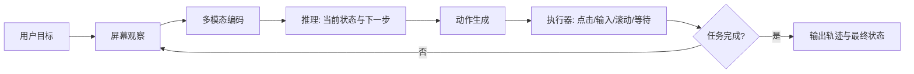

# Fara1.5：把“电脑使用 Agent”从点击脚本推进到可训练的多模型家族

### 元信息

- 原文：Microsoft Research，`Fara1.5: A Family of Computer-Use Agents`
- 原文链接：https://www.microsoft.com/en-us/research/articles/fara1-5-computer-use-agent/
- 当前窗口证据：Microsoft Research 的 ICML 2026 官方日程把会议标记为 2026-07-06 至 2026-07-11，Fara1.5 在 2026-07-06 的 Demo Track 中展示。
- 类型：官方技术博客 / 模型发布 / 电脑使用 Agent。
- 方向：大模型 Agent。
- 本文取舍：不引用外部图片；把原文图表改写为表格、公式、伪代码和流程图，避免把视觉材料当成正文目标。

### TL;DR

- Fara1.5 是 Microsoft Research 发布的一组电脑使用 Agent，覆盖 `Fara-7B`、`Fara-7B-DPO`、`Fara1.5-7B`、`Fara1.5-32B` 与 `Fara1.5-32B-DPO`，核心任务是让模型在真实桌面或 Web 环境里观察屏幕、推理、再执行动作。
- 它不是只把 UI 坐标当成按钮点击问题，而是把训练目标拆成三件事：从屏幕理解任务状态、生成可执行动作、在连续步骤里维持上下文；因此作者强调的是 `observe -> think -> act` 循环，而不是单步视觉问答。
- 数据侧的关键更新是 FaraGen1.5：它用合成网站环境、外部知识检索、Claude-3.7-Sonnet 轨迹生成、网页状态跟踪与低质轨迹过滤，构造可用于 SFT 的多步电脑使用数据。
- 结果侧，原文报告 Fara1.5-32B-DPO 在 AndroidWorld 达到 66.7，在 WebVoyager 达到 62.4，在 WebArena-Lite 达到 28.9；7B 版本在多个基准上也接近或超过一部分更大模型，说明数据与动作空间设计有明显收益。
- 局限也很清楚：训练主要依赖合成或半合成轨迹，网页任务仍会受 UI 漂移、登录态、动态内容、坐标误差和外部工具安全策略影响；DPO 提升偏好一致性，但不能证明模型已具备稳定的长期任务规划。
- 对 Agent 研究的意义在于，Fara1.5 把“电脑使用”重新定义成一个可规模化采样、可过滤、可评测、可集成的训练问题；后续更关键的问题不是单纯扩大模型，而是如何让环境、动作、监督信号和安全边界共同闭环。

### 1. 这篇文章真正关心什么问题？

Fara1.5 的问题意识可以概括成一句话：

> 电脑使用 Agent 要想进入真实任务，不能只会读截图和点按钮，还必须在多步交互中稳定地把视觉状态、语言目标和工具动作接起来。

这句话背后有三层研究背景：

- **第一层：普通多模态模型不等于电脑使用 Agent。** 多模态模型可以回答屏幕截图里有什么，却未必知道下一步应该点击哪里、输入什么、等待什么、失败后如何恢复。
- **第二层：浏览器自动化不等于通用电脑使用。** 只靠 DOM、API 或脚本可以解决部分网页任务，但真实桌面还包含窗口、文件、应用、弹窗、权限、异步状态和不可结构化界面。
- **第三层：单一大模型不等于可部署系统。** 用户需要不同延迟、成本、隐私和设备约束下的选择，所以 Fara1.5 以“模型家族”发布，而不是只展示一个最高分模型。

原文把这组问题放在电脑使用 Agent 的长期路线里：模型必须能看屏幕、理解任务、选择动作、观察反馈、继续修正。也就是说，`GUI grounding`、`workflow planning` 和 `tool execution` 不再是三个孤立模块，而是同一个交互循环里的不同视角。

### 2. 作者如何展开论证？

原文不是论文式地先给一个形式化定义，再给实验表；它更像一篇模型发布技术报告，论证顺序是：

| 原文段落功能 | 它回答的问题 | 对全文论证的作用 |
|---|---|---|
| 开头定位 Fara1.5 | 为什么需要电脑使用 Agent？ | 把任务从“理解屏幕”推进到“操作电脑完成目标”。 |
| 模型家族介绍 | 为什么发布多个尺寸和变体？ | 说明部署不是单一 leaderboard，而是成本、速度、能力的权衡。 |
| 训练数据与 FaraGen1.5 | 模型能力从哪里来？ | 把性能提升归因到可扩展的数据生成和过滤流程，而不是只归因于参数量。 |
| 合成环境与轨迹生成 | 如何获得多步任务监督？ | 解释为什么作者可以构造大量交互式任务，而不完全依赖昂贵人工演示。 |
| 基准结果 | Fara1.5 到底强在哪里？ | 用 AndroidWorld、WebVoyager、WebArena-Lite 等任务证明跨环境收益。 |
| 安全与部署提示 | 真实电脑使用有什么边界？ | 承认模型会执行外部动作，因此必须配合权限、确认和隔离策略。 |

这个顺序很重要。作者并没有把 Fara1.5 写成“又一个视觉语言模型”，而是把它写成“电脑使用数据飞轮 + 多尺寸模型 + 基准评测 + 安全包装”的组合。

### 3. Fara1.5 的核心机制：observe、think、act

从 Agent 角度看，Fara1.5 的最小运行单元可以写成：

```text
Input:
  user_goal: 用户任务描述
  screen_t: 当前屏幕或网页状态
  history_t: 之前的观察、推理和动作

Loop:
  observation_t = encode(screen_t, history_t)
  reasoning_t = model.think(user_goal, observation_t)
  action_t = model.act(reasoning_t, action_space)
  screen_{t+1}, status_{t+1} = executor(action_t)

Stop:
  if task_completed(status_{t+1}) or max_steps reached:
      return final_state, trace
```

这里有几个容易被忽略的设计点：

- **观察不是截图分类。** 模型需要把按钮、文本框、网页结构、任务目标和历史动作放在一起判断，否则会在动态页面里重复点击或误判状态。
- **推理不是只输出自然语言。** 电脑使用 Agent 的推理必须服务于可执行动作，例如点击、输入、滚动、等待、打开应用、选择菜单。
- **动作不是单步预测。** 一次错误点击可能改变后续状态，模型要在每个步骤重新观察反馈，而不是把任务预先写成固定脚本。
- **停止条件本身就是能力。** 如果模型不知道何时完成，会出现过度操作、重复提交或在已完成任务后继续破坏状态。

用 Mermaid 可以把这个循环写成：



Fara1.5 的价值不在于这张循环图本身新，而在于作者试图让这个循环变成可规模化训练对象：每条轨迹都可以被记录、过滤、再喂给模型。

### 4. FaraGen1.5：为什么数据生成比“多爬一点网页”更关键？

电脑使用 Agent 的训练数据很难直接从互联网文本里得到。普通网页文本告诉模型“页面上有什么”，但不会告诉它：

- 用户目标是什么；
- 当前页面状态是什么；
- 第一步应该点哪里；
- 如果点错或加载失败，该如何恢复；
- 哪些动作是合理中间步骤，哪些只是碰巧到达终点。

FaraGen1.5 的思路是，把数据构造拆成一个可控流水线：

| 阶段 | 输入 | 输出 | 为什么重要 |
|---|---|---|---|
| 合成网站与任务生成 | 任务意图、网页模板、领域知识 | 可交互环境与任务目标 | 让训练集覆盖真实网站少见但重要的交互组合。 |
| 外部知识检索 | 任务主题、页面内容 | 更具体的任务背景 | 避免任务只停留在“点击第一个按钮”这种浅层模式。 |
| 教师模型轨迹生成 | 环境状态、用户目标 | 多步 observe-think-act 轨迹 | 给学生模型提供动作序列和中间推理监督。 |
| 网页状态跟踪 | 每一步 DOM/截图/执行结果 | 可验证的状态转移 | 让轨迹不是纯文本幻想，而是环境反馈驱动。 |
| 质量过滤 | 完成度、可执行性、一致性 | 可用于 SFT/DPO 的数据 | 降低错误轨迹把模型训练偏的风险。 |

这个流水线背后的关键判断是：电脑使用能力的瓶颈不只是模型规模，而是“可执行、可验证、可扩展”的轨迹数据。

可以把 FaraGen1.5 的过滤条件写成一个简化公式：

```text
Keep(trajectory) = Complete(task)
                 AND Executable(actions)
                 AND StateConsistent(observations, actions)
                 AND Useful(reasoning)
```

变量解释：

- `Complete(task)`：轨迹是否真的完成用户目标，而不是只走到相似页面。
- `Executable(actions)`：动作是否能在环境里复现，例如点击目标存在、输入框可编辑。
- `StateConsistent`：每步观察是否和执行后状态一致，避免教师模型凭空编造页面变化。
- `Useful(reasoning)`：中间推理是否能帮助学生模型学习状态判断，而不是冗余套话。

这也是 Fara1.5 与许多“截图问答数据集”的区别：它关心的是状态转移监督，而不是静态标签。

### 5. 训练目标：SFT 与 DPO 分别解决什么？

原文发布的模型里既有 SFT 风格变体，也有 DPO 变体。可以把二者理解为两层监督。

第一层是轨迹模仿：

```text
L_sft(theta) = - sum_{i=1..N} sum_{t=1..T_i} log p_theta(a_{i,t}, r_{i,t} | o_{i,<=t}, g_i)
```

其中：

- `g_i` 是第 `i` 个用户任务；
- `o_{i,<=t}` 是到第 `t` 步为止的屏幕观察和历史；
- `r_{i,t}` 是中间推理；
- `a_{i,t}` 是动作；
- `theta` 是模型参数。

这个目标让模型学会“看到类似状态时模仿高质量轨迹”。但它有一个明显边界：如果教师轨迹里有多条路径都能完成任务，SFT 未必知道哪条更稳、更短、更安全。

第二层是偏好优化。DPO 可以简化理解为：

```text
Preference:
  chosen_trace   = 更可靠、更符合任务或更安全的轨迹
  rejected_trace = 较差、冗余或失败风险更高的轨迹

Goal:
  increase log p_theta(chosen_trace)
  decrease log p_theta(rejected_trace)
```

在电脑使用场景里，DPO 的意义不是让模型“更会聊天”，而是让它在多个可行动作之间更倾向于：

- 少走无效步骤；
- 避免危险或不可逆操作；
- 更快识别任务完成；
- 在页面不确定时选择等待、确认或重新观察；
- 不把看似可点击的装饰元素误当成关键控件。

但是 DPO 也不能神化。它依赖偏好数据质量，如果偏好对只覆盖简单页面，模型在复杂桌面任务里的行为仍可能漂移。

### 6. 模型家族：为什么不是只发布一个最大模型？

Fara1.5 的“family”定位很关键。电脑使用 Agent 有非常现实的部署约束：

| 约束 | 对模型选择的影响 | Fara1.5 家族化的意义 |
|---|---|---|
| 延迟 | 每一步都要观察和动作，慢一步会放大总耗时 | 小模型可用于轻量任务或本地快速循环。 |
| 成本 | 多步任务会反复调用模型 | 7B 级别模型能降低长任务成本。 |
| 能力 | 复杂页面、跨应用任务需要更强推理 | 32B 变体提供更高上限。 |
| 安全 | 真实电脑操作需要更可控策略 | DPO 变体尝试把偏好和风险纳入动作选择。 |
| 集成 | Agent 框架需要不同后端 | 仓库与 MagenticLite/AutoGen 生态关联，便于实验。 |

这说明作者并不是把 Fara1.5 当成一个 isolated model card，而是把它放进 Agent 系统里考虑：模型尺寸、动作空间、执行器、任务框架和安全策略要一起设计。

### 7. 评测证据：哪些数字真正支撑主张？

原文给出的关键结果集中在多种电脑使用和网页任务基准上。为了避免只堆数字，可以按“主张 -> 证据 -> 边界”阅读。

| 主张 | 原文证据 | 能说明什么 | 仍不能说明什么 |
|---|---|---|---|
| Fara1.5 不是只适配单一网页基准 | 同时报告 AndroidWorld、WebVoyager、WebArena-Lite 等结果 | 模型在移动/网页/轻量 WebArena 任务上都有迁移信号 | 不能证明它能稳定处理所有真实用户桌面任务 |
| 数据与 DPO 带来收益 | Fara1.5-32B-DPO 在多个指标上高于同族非 DPO 或早期变体 | 偏好优化对动作选择有帮助 | 偏好数据覆盖范围仍决定泛化边界 |
| 小模型也有实用价值 | 7B 版本在若干任务上达到可竞争表现 | 合成轨迹与训练配方能部分弥补参数规模 | 复杂长程任务仍可能需要更大模型或外部规划器 |
| 电脑使用 Agent 要跨环境比较 | 多基准结果同时出现 | 作者不是只优化单一排行榜 | 各基准的真实世界代表性仍有限 |

原文中最值得记住的数字是：

- `Fara1.5-32B-DPO` 在 **AndroidWorld** 报告 `66.7`。
- `Fara1.5-32B-DPO` 在 **WebVoyager** 报告 `62.4`。
- `Fara1.5-32B-DPO` 在 **WebArena-Lite** 报告 `28.9`。

这些数字支持的结论应当写得克制：Fara1.5 在公开电脑使用基准上具备强竞争力，尤其说明数据生成和偏好优化路线有效；但它们还不能替代真实用户环境中的长期可靠性、安全性和异常恢复评估。

### 8. 原文图表应如何解读？

虽然本文不下载图片，但原文的图表信息可以转写成研究者关心的证据链。

| 图表/模块 | 表面内容 | 真正支撑的论点 | 阅读边界 |
|---|---|---|---|
| Fara1.5 模型家族图 | 多个尺寸和 DPO 变体 | 电脑使用不是单模型问题，而是部署谱系问题 | 图示不能说明每个尺寸在所有任务上的最优使用区间 |
| FaraGen1.5 流水线图 | 合成环境、教师轨迹、过滤、训练 | 数据生成是能力提升的核心机制 | 合成任务的分布仍可能和真实网页不同 |
| 评测表 | 多个 benchmark 上的分数 | 跨环境收益比单点高分更有价值 | 基准仍可被任务模板、执行器和评测协议影响 |
| 安全/使用说明 | 需要确认、隔离、权限控制 | 模型动作具有现实副作用 | 安全段落不是完整威胁模型 |

这类发布文章的常见风险是：读者容易把最高分当成全部贡献。更准确的读法是，Fara1.5 证明了一个训练-评测-部署组合路线：

```text
合成环境规模化 -> 教师轨迹生成 -> 质量过滤 -> SFT/DPO -> 多尺寸发布 -> 多基准验证
```

如果其中任何一环断裂，例如轨迹不可复现、过滤不足、动作空间过窄、基准过拟合，最终分数都可能难以迁移到真实任务。

### 9. 与早期电脑使用 Agent 的差别在哪里？

电脑使用 Agent 过去常见三条路线：

- **脚本/规则路线**：依赖固定 DOM、坐标、浏览器 API 或 RPA 流程。
- **多模态单步路线**：让模型看截图并预测下一步点击或回答问题。
- **LLM Agent 框架路线**：用语言模型规划，再调用浏览器、Shell 或应用工具。

Fara1.5 的位置更接近第四种：

| 路线 | 优点 | 主要短板 | Fara1.5 的对应回答 |
|---|---|---|---|
| 规则/RPA | 稳定、可审计 | 对 UI 变化脆弱 | 用视觉和语言状态理解增强泛化 |
| 单步 VLM | 数据容易构造 | 缺少长期状态和反馈 | 训练多步轨迹而不只预测单点 |
| 通用 LLM Agent | 规划能力强 | 执行动作容易漂移 | 把 GUI grounding 与动作监督纳入训练 |
| 电脑使用模型家族 | 可跨任务部署 | 数据和安全成本高 | 用 FaraGen1.5、DPO、评测和集成一起处理 |

这个位置判断很重要：Fara1.5 不是要完全替代浏览器自动化或企业 RPA，而是给更开放、更动态的界面任务提供一个可学习的控制层。

### 10. 关键段落细读：为什么“合成环境”不是偷懒？

很多人看到合成环境会本能怀疑：真实网页那么复杂，合成网站是不是只是在玩具场景里刷分？

这个怀疑合理，但 Fara1.5 的合成环境更像“训练用覆盖器”，不是“最终验证场”。它的作用至少有三点：

- **覆盖稀有交互。** 真实网站里某些权限弹窗、表单组合、筛选器状态、错误提示不容易批量收集，合成环境可以主动生成。
- **保留可控标注。** 真实用户轨迹难以知道每一步是否必要，合成任务可以更容易检查完成条件和状态转移。
- **支撑负样本与偏好。** DPO 需要比较好坏轨迹，合成环境能构造失败、绕路、误点击等对照。

但边界也必须写清：

- 合成环境无法覆盖真实网页的所有视觉噪声、登录态、广告、反自动化机制和延迟。
- 如果任务模板过窄，模型可能学会合成网站的风格，而不是学会一般电脑使用。
- 轨迹由强教师模型生成时，学生模型可能继承教师的盲点。

因此 FaraGen1.5 更像一个必要但不充分的训练基础。它解决的是“没有足够交互数据”的问题，不自动解决“真实世界完全可靠”的问题。

### 11. 安全边界：电脑使用 Agent 为什么比聊天模型更敏感？

电脑使用 Agent 的风险不只来自错误回答，而来自实际动作。一次错误操作可能：

- 提交表单；
- 删除或覆盖文件；
- 暴露私人信息；
- 点击恶意链接；
- 接受不该接受的权限；
- 在登录态环境里执行不可逆交易。

因此 Fara1.5 这类模型必须配合外部控制策略。可以把风险控制写成一个简化谓词：

```text
Allow(action_t) =
  InScope(action_t, user_goal)
  AND LowRisk(action_t, current_context)
  AND Reversible(action_t) OR UserConfirmed(action_t)
  AND NotSecretExfiltration(action_t)
```

这不是原文给出的正式安全模型，而是从电脑使用任务自然推出的部署约束：

- `InScope`：动作是否仍服务于用户原始目标；
- `LowRisk`：动作是否涉及支付、删除、公开发布、权限提升等高风险行为；
- `Reversible`：出错后能否撤销；
- `UserConfirmed`：高风险动作是否经过用户确认；
- `NotSecretExfiltration`：是否避免读取、复制或发送敏感信息。

Fara1.5 的发布提醒我们，电脑使用 Agent 的能力评测和安全评测不能分开。一个高分模型如果不能解释或限制危险动作，部署价值会明显打折。

### 12. 失败案例应该从哪里找？

原文的发布语气当然偏正面，但研究者读这种文章时要主动寻找失败边界。Fara1.5 可能失败的地方包括：

| 失败类型 | 典型表现 | 为什么难 |
|---|---|---|
| 视觉 grounding 错误 | 点到相邻按钮或误读文本框 | UI 元素密集、缩放、遮挡或样式变化 |
| 状态记忆错误 | 已登录却继续登录，已提交却重复提交 | 多步任务需要维护历史和完成状态 |
| 任务歧义 | 用户说“订一个便宜的票”，模型不知道价格/时间偏好 | 需要主动澄清而不是擅自行动 |
| 动态页面变化 | 加载慢、弹窗出现、元素位置变化 | 执行动作后的环境不是确定函数 |
| 安全误判 | 对高风险操作没有停下来确认 | 训练轨迹可能更重视完成任务而非风险 |
| 评测迁移不足 | benchmark 高分，真实网站掉线 | 公开基准覆盖不了所有长尾界面 |

这些失败并不否定 Fara1.5 的贡献，反而说明它把问题推进到了更真实的位置：当模型真的能执行动作后，错误也会从“文本答案错了”升级为“环境状态被改了”。

### 13. 与 Agent 生态的关系：为什么集成比模型卡更重要？

Fara1.5 的 GitHub 入口与相关 Agent 框架集成信息提示了一个方向：电脑使用模型需要被嵌入系统，而不是孤立调用。

一个可用系统至少包含：

- **模型层**：负责视觉理解、推理和动作生成。
- **执行层**：把动作映射为浏览器或桌面操作。
- **状态层**：记录观察、历史、完成度和错误。
- **权限层**：限制文件、网页、账号和高风险动作。
- **评测层**：复现任务、记录轨迹、判断成功失败。
- **恢复层**：在页面变化、动作失败或任务歧义时重新规划。

这也是为什么 Fara1.5 的“family”比单个分数更值得关注。真实 Agent 系统通常要根据任务选择模型：

- 简单、低风险、短程任务：小模型可能足够；
- 长程、多页面、需要推理的任务：大模型更稳；
- 涉及高风险动作：模型能力之外还必须有确认和隔离；
- 企业内部流程：可能需要私有环境、审计日志和规则约束。

### 14. 领域延伸：Fara1.5 对后续 Agent 研究提出什么问题？

Fara1.5 给 Agent 研究带来的启发，不是“电脑使用已经解决”，而是几个更具体的问题。

**问题一：如何定义长期任务的真实成功？**

公开基准通常需要可自动评分。真实任务却常常有隐含偏好，例如“便宜但不要红眼航班”“回复邮件但语气不要太强硬”。后续评测需要同时记录：

- 是否完成目标；
- 是否违反约束；
- 是否走了不必要的风险路径；
- 是否在不确定时询问用户；
- 是否留下可审计轨迹。

**问题二：合成环境如何避免模板化？**

FaraGen1.5 说明合成环境有价值，但下一步需要研究：

- 如何度量合成任务和真实任务的分布差异；
- 如何自动发现模型在真实网页中的失败模式；
- 如何把失败回流成新的合成任务；
- 如何避免教师模型把同一类错误批量写进训练集。

**问题三：DPO 是否足够表达安全偏好？**

电脑使用里的偏好不是简单的“回答 A 比回答 B 好”。很多动作要按风险分层：

- 低风险动作可以自动执行；
- 中风险动作需要解释和确认；
- 高风险动作应默认拒绝或转人工；
- 涉及秘密、支付、删除、授权的动作要有硬规则。

这意味着偏好优化要和策略约束结合，而不是只靠模型内部学会安全。

**问题四：Agent 框架如何暴露可验证状态？**

如果执行器只返回截图，模型很难知道动作是否成功；如果只返回 DOM，又可能错过视觉布局和弹窗。后续系统需要更好的多通道观察：

- 截图；
- DOM/无障碍树；
- 应用事件；
- 网络状态；
- 文件系统或窗口状态；
- 任务级完成检查器。

Fara1.5 的路线说明，电脑使用 Agent 的核心竞争力将来自模型、环境、数据、执行器和安全层的共同设计。

### 15. 结论与局限

Fara1.5 最值得带走的判断是：

- 它把电脑使用 Agent 从“演示模型会点击网页”推进到“用可扩展轨迹数据训练一组可部署模型”。
- 它的关键贡献不只在分数，而在 FaraGen1.5 这类数据生成与过滤流程。
- 它的评测结果说明多尺寸模型和 DPO 有现实价值，但仍不能证明真实桌面任务已经可靠解决。
- 它的安全边界提醒我们：一旦模型能操作电脑，权限、确认、隔离和审计就必须成为 Agent 系统的一等公民。

如果把 Fara1.5 放到更大的 Agent 研究图景里，它更像一块基础设施拼图：让电脑使用轨迹可以被生成、训练、评测和集成。下一步真正困难的，是把这个拼图接到真实用户环境中，同时保持可控、安全和可复现。

### 参考链接

- Microsoft Research: https://www.microsoft.com/en-us/research/articles/fara1-5-computer-use-agent/
- Microsoft Research ICML 2026 sessions: https://www.microsoft.com/en-us/research/event/icml-2026/sessions/
- GitHub: https://github.com/microsoft/fara
