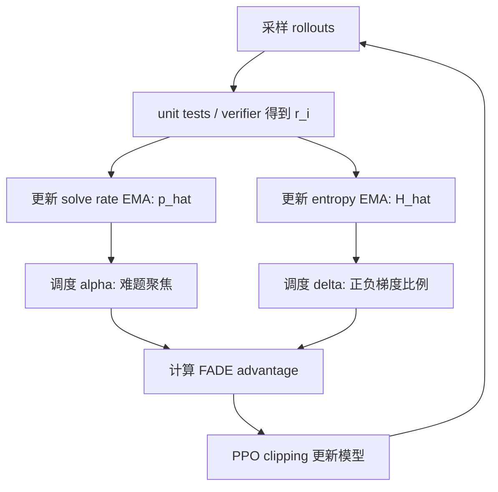

# FADE：把 RLVR 的 advantage 选择拆成“正负梯度质量”和“题目难度”的动态调度问题

### 元信息

| 字段 | 内容 |
|---|---|
| 论文 | Don’t Let Gains FADE: Breaking Down Policy Gradient Weights in RL |
| 作者 | Juliette Decugis, Sean O'Brien, Francis Bach, Gabriel Synnaeve, Taco Cohen |
| 机构 | FAIR at Meta；Inria / Ecole Normale Superieure |
| 日期 | arXiv v1：2026-07-01 21:39:19 UTC；PDF 标注日期：2026-07-03 |
| 原文 | https://arxiv.org/abs/2607.01490 |
| HTML | https://arxiv.org/html/2607.01490v1 |
| 方向 | 大模型后训练 / RLVR / policy gradient weight |
| 本文取舍 | 不本地化图片；Figure/Table 的证据转写为公式、表格、伪代码和 Mermaid。 |

### TL;DR

- 这篇论文研究的是 RLVR 后训练里一个经常被混在一起的问题：GRPO、DAPO、pass@k、log-mean-exp、REINFORCE 等方法本质上都在改每条 rollout 的 policy weight，但大家往往只比较最终 pass@1，没说明到底是“正样本推得更多”、还是“负样本压得更多”、还是“更偏向难题”带来了收益。
- 作者把任意二元 reward 的 policy weight 拆成两个量：成功轨迹的正梯度质量 `mS` 和失败轨迹的负梯度质量 `mF`。再把设计空间分成三条轴：sign axis 控制 `mS/mF`，difficulty axis 控制梯度质量落在什么 solve rate `p` 上，scale axis 控制整体梯度幅度。
- 论文指出两类失败机制：`mS >> mF` 会过度强化少数正确解，导致 entropy collapse；`mF >> mS` 会过度压制多样失败，导致 output head 更新进入 rank-1 funnel。难题聚焦能提高信号，但会减少有效样本、增加方差。
- 基于这个分析，作者提出 FADE（Focal Advantage with Dynamic Entropy）：用在线 solve rate 的 EMA 调度难度指数 `alpha`，用 entropy 的 EMA 调度负梯度放大系数 `delta`，形成“先探索难题、后延迟利用”的动态 advantage。
- 实验使用 Qwen 2.5 7B 和 CWM 32B，在 25,000 个竞赛编程训练题上做二元 reward RL；评测包含 LiveCodeBench v6/v5 和未见过的 AIME 2024/2025。Qwen 2.5 7B 上 FADE 在 LiveCodeBench v6 达到 `pass@1=40.7`、`pass@10=58.0`、`pass@100=68.2`，高于 GRPO 的 `37.4/53.6/62.5`。
- 关键速度结论是：FADE 在 7B 规模比最佳静态 baseline 提前约 20k steps 到达 peak pass@1，在 32B 规模提前约 2k steps，同时保持更好的 accuracy-diversity trade-off。
- 局限很明确：分析假设 binary terminal reward；训练任务是单轮代码/数学，未覆盖多轮 Agent；FADE 依赖 entropy 与 solve rate 的在线估计；大规模实验使用 H100 集群和 CWM 32B，社区复现成本较高。

### 1. 研究问题：为什么 advantage 选择不能只看名字？

作者关心的问题不是“FADE 又提出了一个新 RL 算法”，而是：

- **RLVR 的 policy weight 到底在控制什么？**
- **为什么同一个 GRPO 族方法，有时提升 pass@1，有时压掉 pass@100？**
- **为什么部分 reward shaping 方法早期学习很快，后期却变窄、变脆？**

论文把 RLVR 后训练的基本流程写成一个共同模板：

```text
Input:
  prompt q
  policy pi_theta
  binary verifier r(tau) in {0, 1}

Loop:
  sample G rollouts tau_i ~ pi_theta(. | q)
  score each tau_i with verifier
  compute policy weight W(tau_i)
  update theta with weighted policy gradient

Question:
  W(tau_i) 应该怎样分配给成功和失败轨迹？
```

这个问题重要，是因为很多方法同时改变了三件事：

| 变化 | 表面说法 | 实际影响 |
|---|---|---|
| 成功样本权重变大 | 强化正确解 | 可能提高 pass@1，也可能让 entropy 更快塌缩。 |
| 失败样本权重变大 | 压制错误解 | 可能早期学习快，也可能让更新集中到单一方向。 |
| 难题权重变大 | 关注 frontier problems | 可能提高信息量，也会减少可用 batch、放大方差。 |
| 梯度整体变小 | 更保守 | 可能只是等价于调小 learning rate。 |

因此，作者主张先做“拆账”：

- 不要只问某个 advantage 名字是否有效。
- 要问它把 `mS`、`mF`、`p`、整体 scale 分别改成了什么。

### 2. 核心形式化：把 policy weight 拆成 `mS` 和 `mF`

论文假设 reward 是二元变量：

```text
r(tau) = 1: rollout 成功
r(tau) = 0: rollout 失败
```

令：

- `S = r^{-1}(1)`：成功轨迹集合。
- `F = r^{-1}(0)`：失败轨迹集合。
- `p = P(tau in S)`：当前 prompt 的 solve rate。
- `q = 1 - p`：失败概率。

作者把任意只依赖成功/失败的 policy weight 写成：

```text
W(tau) = wS * I[tau in S] - wF * I[tau in F]
```

对应的 policy gradient 可以整理成：

```text
grad J
  = wS * p * E[grad log pi(tau) | tau in S]
  - wF * q * E[grad log pi(tau) | tau in F]

  = mS * grad_S - mF * grad_F
```

其中：

- `mS = wS * p`：成功轨迹的正梯度质量。
- `mF = wF * q`：失败轨迹的负梯度质量。
- `grad_S`：成功轨迹平均 log-prob 梯度。
- `grad_F`：失败轨迹平均 log-prob 梯度。

这一步的意义是：

| 分解对象 | 它让什么变清楚？ |
|---|---|
| `mS` | 模型在多大程度上强化已经正确的行为。 |
| `mF` | 模型在多大程度上压低失败行为。 |
| `mS/mF` | policy entropy 和 weight-space rank collapse 的风险。 |
| `mS(p), mF(p)` | 梯度主要来自易题、中等题还是难题。 |

### 3. GRPO 是什么位置？

以 mean-only GRPO 为例：

```text
A_i = r_i - mean(r)
```

如果一个 batch 的 empirical solve rate 是 `p`，那么：

- 成功样本：`A_S = 1 - p`
- 失败样本：`A_F = -p`

整理后：

```text
grad_GRPO = G * p * (1 - p) * (grad_S - grad_F)
```

这说明 GRPO 有两个性质：

| 性质 | 含义 |
|---|---|
| sign-balanced | `mS = mF`，成功和失败梯度质量平衡。 |
| medium-difficulty focus | `p(1-p)` 在 `p=0.5` 最大，最重视中等难度题。 |

因此，GRPO 的优点不是“神秘的 reasoning reward”，而是：

- 它不偏向只推正确样本；
- 也不偏向只压失败样本；
- 它天然把权重集中在有成功也有失败的 prompt 上。

### 4. 三条设计轴：sign、difficulty、scale

论文把 policy weight 的设计空间拆成三条轴。

| 轴 | 控制变量 | 典型问题 |
|---|---|---|
| Sign axis | `mS` 与 `mF` 的比例 | 是强化成功更多，还是压制失败更多？ |
| Difficulty axis | `mS(p), mF(p)` 的峰值位置 | 梯度来自易题、中等题还是难题？ |
| Scale axis | overall gradient magnitude | 是算法本身更好，还是 learning rate 等效变了？ |

这个拆分解释了为什么很多方法难比较：

- pass@8 目标可能同时改变难度聚焦、正负号和整体 scale。
- W-REINFORCE 会改变 sign balance，也改变梯度幅度。
- log-mean-exp 会改变样本权重曲线，但未必单独隔离 difficulty。

作者因此构造了两个“实验用旋钮”：

| 旋钮 | 公式直觉 | 用途 |
|---|---|---|
| Power `alpha` | `mS = mF = C * p * q^alpha` | 只改 difficulty focus，保持 sign-balanced。 |
| AsymGRPO `delta` | `mF = p(1-p) / delta` | 只改 sign bias，观察 entropy/rank 变化。 |

### 5. 失败机制一：过度强化成功会让 entropy collapse

作者提出 AsymGRPO：

```text
mS = p(1-p)
mF = p(1-p) / delta
```

因此：

- `delta = 1`：回到标准 GRPO。
- `delta > 1`：负梯度变小，成功样本相对更强。
- `delta < 1`：负梯度变大，失败样本相对更强。

论文给出的 entropy 一阶近似是：

```text
Delta H ~= eta * [(mS - mF) * H - Cov(A, log pi_theta)] + O(eta^2)
```

变量解释：

| 变量 | 含义 |
|---|---|
| `H` | 当前 policy entropy。 |
| `eta` | learning rate。 |
| `mS - mF` | 正负梯度质量差。 |
| `Cov(A, log pi_theta)` | 常规 policy gradient 带来的 entropy 变化项。 |

这条公式的读法是：

- 当 `mS = mF` 时，额外 drift 项消失。
- 当 `mS > mF` 时，成功样本强化更强，entropy 会加速塌缩。
- 当 `mS < mF` 时，失败样本压制更强，可以短期维持 entropy。

Figure 3/4 的证据可以概括为：

| 证据 | 结论 |
|---|---|
| `delta > 1` 的 AsymGRPO | 过度强化成功，policy entropy 快速下降。 |
| entropy 与 advantage sign ratio 强相关 | entropy 不是简单由 pass@100 或学习速度解释，而是由 `mS*p / (mF*q)` 主导。 |
| 正确样本更聚集 | 强化正确解会把策略推向少数相似模式。 |

### 6. 失败机制二：过度压制失败会进入 rank-1 funnel

直觉上，`delta < 1` 看起来很诱人：

- 负梯度更强；
- 失败样本被更快压制；
- 早期 reward 和 pass@1 上升更快；
- entropy 也不容易马上塌缩。

但作者发现这会导致另一个问题：**输出层更新越来越像 rank-1**。

论文把 output head 的 RL 权重变化写成：

```text
Delta W
  = sum_i A_i * v_i otimes h_i
  = (sum_i A_i * alpha_i * v_i) otimes u1
    + sum_i A_i * v_i otimes h_i_perp

  = M1(rank-1) + M2(higher-rank residual)
```

变量解释：

| 变量 | 含义 |
|---|---|
| `v_i` | token 输出方向相关向量。 |
| `h_i` | hidden state。 |
| `u1` | dominant shared direction。 |
| `h_i_perp` | 去掉 dominant direction 后的残差。 |
| `M1` | rank-1 主方向。 |
| `M2` | 多维残差信号。 |

关键证据来自 Table 9/10：

| 现象 | 数字或结论 |
|---|---|
| 7B 早期所有方法都有 rank-1 倾向 | 500 steps 时 REINFORCE/GRPO/AsymGRPO 都超过 80% rank-1。 |
| 长训后 sign-balanced 方法会逃离 rank-1 | 7B GRPO converged rank-1 约 62%，Power `alpha=2` 约 61%。 |
| failure-biased 方法保持 rank-1 | 7B AsymGRPO `delta=0.5` rank-1 达 96%，output-head fraction 88.5%。 |
| 失败 residual 更 decorrelated | correct 的 perpendicular correlation 比 failed 高约 2.4x 到 4.4x。 |

作者的解释是：

- 正确轨迹相似，残差信号更相关，更容易形成可积累的多维更新。
- 失败轨迹更分散，很多 residual 互相抵消。
- 如果过度放大失败梯度，最终保留下来的主要是共同的“压制非代码/错误 token”方向。
- 这会让模型早期变快，但后期学习空间变窄，pass@100 和 AIME 泛化受损。

### 7. 难度轴：难题信息量更高，但有效样本更少

作者用 Power `alpha` 隔离 difficulty axis：

```text
mS = mF = C * p * (1-p)^alpha
```

当 `alpha` 增大：

- 权重峰值从 `p=0.5` 向更低 solve rate 移动；
- 模型更关注难题；
- 但高难题 batch 更少，Monte Carlo 估计更 noisy。

论文把加权梯度噪声写成近似：

```text
Var(w(p_hat) * g_hat)
  ~= w(p)^2 * v0(p)
   + s(p)^2 * Var(w(p_hat))
```

再定义整体更新质量：

```text
Q(w) = N_eff * E_{p ~ f}[ q(p, w) ]
```

这说明难题聚焦不是越强越好：

| 情况 | 最优直觉 |
|---|---|
| 不同难度的 signal 差不多 | 选中等难度，降低方差；GRPO 的 `p(1-p)` 很合理。 |
| 难题确实携带更多 signal | 增大 `alpha`，把梯度推向 frontier problems。 |
| 难题太少或近似不可解 | 有效样本数下降，训练等待少数稀有成功，反而变慢。 |

论文给出的一个具体判断是：

- 在平均 solve rate `p=0.5` 时，`alpha=3` 要优于 GRPO，需要 hard problems 的信号至少是平均题目的 `2.25x`。
- Qwen 2.5 7B 更像“难题信号更高”的 regime，Power `alpha=2` 比 GRPO 提升明显。
- CWM 32B 更像“中等题更稳”的 regime，过度难题聚焦会损失。

### 8. FADE：用 solve rate 和 entropy 动态调度两个旋钮

FADE 的核心想法是：

- 早期：模型还在探索，应该 sign-balanced，并关注难题。
- 中后期：entropy 已经下降，需要进入 exploitation，但不能太早触发 rank-1。
- 因此，`alpha` 和 `delta` 不应该固定。

论文公式：

```text
A_i = (1 - r_bar)^(alpha - 1) *
      {
        r_i - r_bar,              if r_i >= r_bar
        (r_i - r_bar) / delta,    if r_i < r_bar
      }

alpha = clip( 3 * (1 - p_hat) / (2 * p_hat), 1, alpha_max )
delta = clip( 1 + H_hat - H*, 0.3, 1 )
```

变量解释：

| 变量 | 含义 |
|---|---|
| `p_hat` | solve rate 的 EMA。 |
| `H_hat` | policy entropy 的 EMA。 |
| `H*` | 目标 entropy，作者发现初始 entropy 的一半效果最好。 |
| `alpha_max` | 最大难度指数，实验中取 3。 |
| `delta` | 负梯度缩放；entropy 低于目标后，`delta < 1`，进入 exploitation。 |

FADE 伪代码可以写成：

```text
Input:
  policy pi_theta
  prompts Q
  unit tests T_q
  target entropy H*
  max power alpha_max
  EMA coefficient beta = 0.02

State:
  p_hat = 0.5
  H_hat = initial_entropy(pi_theta)

Loop:
  for training step t:
    sample G rollouts per prompt
    score each rollout by unit tests
    r_bar = batch mean reward
    H_t = mean token entropy

    p_hat = beta * p_hat + (1 - beta) * r_bar
    H_hat = beta * H_hat + (1 - beta) * H_t

    alpha = clip(3 * (1 - p_hat) / (2 * p_hat), 1, alpha_max)
    delta = clip(1 + H_hat - H*, 0.3, 1)

    for each rollout i:
      if r_i >= r_bar:
        A_i = (1 - r_bar)^(alpha - 1) * (r_i - r_bar)
      else:
        A_i = (1 - r_bar)^(alpha - 1) * (r_i - r_bar) / delta

    update policy with PPO clipping

Output:
  policy with delayed exploitation schedule
```

Mermaid 流程图：



### 9. 实验设置：两个模型、代码 RL、AIME 泛化

作者的训练设置比较重：

| 项 | 设置 |
|---|---|
| 模型 1 | Qwen 2.5 7B；先做 reasoning SFT。 |
| 模型 2 | CWM 32B SFT checkpoint；已有长 CoT 能力。 |
| 训练任务 | 25,000 个竞赛编程问题，来自 CodeContest、TACO 等。 |
| Reward | 二元 reward：格式和答案正确性。 |
| 采样 | temperature 1.0、top-p 1.0，鼓励多样性。 |
| Reasoning budget | 8k 到 30k tokens。 |
| 评测 | LiveCodeBench v6/v5；AIME 2024/2025。 |
| 指标 | pass@1、pass@10、pass@100、学习速度、entropy、rank/SVD。 |

基础设施也值得注意：

| 组件 | 作用 |
|---|---|
| samplers | H100 上生成代码。 |
| evaluators | CPU cluster 上跑 unit tests。 |
| trainers | H100 上接收 token、logprob、reward 并反向更新。 |
| Qwen 7B 配置 | 8 nodes / 64 GPUs；1 trainer node，7 sampler nodes。 |
| CWM 32B 配置 | 32 nodes；12 trainer nodes，20 sampler nodes。 |

这意味着实验结论有两层含义：

- 它不是小规模 toy RL；作者确实做了大型 distributed RL。
- 但这也带来复现门槛，尤其是 CWM 32B、H100 集群和代码评测环境。

### 10. 主结果：FADE 同时改善速度和 diversity

LiveCodeBench v6 Table 3 的关键数字：

| 方法 | Qwen 2.5 7B pass@1 | Qwen 2.5 7B pass@10 | Qwen 2.5 7B pass@100 | CWM 32B pass@1 | CWM 32B pass@10 | CWM 32B pass@100 |
|---|---:|---:|---:|---:|---:|---:|
| SFT | 15.2 | 42.3 | 52.2 | 37.5 | 54.0 | 69.0 |
| GRPO | 37.4 | 53.6 | 62.5 | 62.0 | 76.7 | 83.7 |
| Power `alpha=2` | 40.3 | 56.6 | 66.0 | 61.2 | 76.7 | 82.9 |
| Power asym `(2,2)` | 40.0 | 56.0 | 64.9 | 62.8 | 76.2 | 83.3 |
| FADE `H*=1.0` | **40.7** | **58.0** | **68.2** | **63.1** | **77.9** | **85.3** |

几个读法：

- Qwen 7B 上，FADE 相比 GRPO 的 pass@100 从 `62.5` 到 `68.2`，说明它不是只提高单样本准确率，也保留了更多可采样解。
- CWM 32B 上，提升幅度较小但方向一致，说明大模型本身更接近 medium-difficulty optimum，FADE 的收益更多来自动态调度而不是单纯 hard focus。
- FADE 的速度结论来自 Figure 1：7B 比最佳静态 baseline 提前约 20k steps 到 peak pass@1，32B 提前约 2k steps。

### 11. AIME 结果：代码 RL 的迁移不是自动成立

AIME 是未在 RL 训练中出现的数学任务，因此更能测试泛化。

Qwen 2.5 7B 的 AIME Table 4：

| 方法 | AIME2024 pass@1 | AIME2024 pass@100 | AIME2025 pass@1 | AIME2025 pass@100 |
|---|---:|---:|---:|---:|
| SFT | 32.6 | 78.1 | 21.3 | 70.8 |
| GRPO | 37.9 | 81.4 | 24.6 | 68.3 |
| AsymGRPO `delta=0.5` | 43.1 | 79.2 | 26.6 | 66.0 |
| Power asym `(2,2)` | 41.1 | **86.1** | 27.4 | 66.6 |
| FADE `H*=1.0` | **44.5** | 83.7 | 28.6 | 68.3 |
| FADE `H*=1.3` | 44.3 | 80.8 | **31.3** | 70.7 |

这里的边界很有意思：

- FADE 在 pass@1 上稳定强。
- 但 pass@100 不是所有 FADE 配置都最优。
- `H*` 越高越早进入 failure-biased exploitation，可能提高单样本准确率，但也更接近 rank-1 风险。

CWM 32B 的 AIME Table 5：

| 方法 | AIME2024 pass@1 | AIME2024 pass@100 | AIME2025 pass@1 | AIME2025 pass@100 |
|---|---:|---:|---:|---:|
| GRPO | 58.4 | **94.9** | 46.1 | 80.0 |
| Power `alpha=2` | 41.2 | 91.7 | 27.4 | **84.6** |
| Power asym `(2,2)` | **70.3** | 93.3 | **58.7** | 83.3 |
| Asym FADE `H*=1.0` | 64.6 | 93.3 | 52.7 | 83.1 |

这说明：

- 32B 上最强 AIME pass@1 来自更 aggressive 的 Power asym。
- 但 GRPO 仍在 AIME2024 pass@100 上非常强。
- FADE 不是“所有表格每列第一”，而是整体速度、LiveCodeBench、多样性和稳定性的折中最强。

### 12. 消融：`alpha` 和 `delta` 不能用一个信号代替

Figure 9 做了 FADE 消融：

| 变体 | 观察 |
|---|---|
| 去掉 `delta` | 容易 entropy collapse。 |
| 去掉 `alpha` | diversity，特别是 pass@10/pass@100，下降。 |
| 两个参数都用 entropy 驱动 | 不如分开用 solve rate 和 entropy。 |
| deterministic log decay schedule | 比在线自适应弱。 |

这支持了论文最核心的机制判断：

- difficulty focus 和 sign bias 是两件不同的事。
- solve rate 更适合决定“现在该看多难的题”。
- entropy 更适合决定“现在是否该进入 exploitation”。

### 13. Figure/Table 证据地图

| 图表 | 主要证据 | 本文解读 |
|---|---|---|
| Figure 1 | FADE 在 LiveCodeBench v6 上更快、更高，覆盖 pass@1/pass@10/pass@100。 | 速度和多样性不是对立到无法兼得，关键是动态调度。 |
| Figure 2 | 不同 policy weight 在 batch solve rate `p` 上的梯度质量曲线。 | 许多方法同时改变 sign、difficulty、scale，不能只按名字比较。 |
| Figure 3 | `delta > 1` entropy collapse；`delta < 1` rank collapse。 | sign imbalance 两端都有失败机制。 |
| Figure 5 | failure-biased 方法输出头 rank 更低；难度聚焦与 pass@100 有最优区间。 | 早期快不等于最终稳。 |
| Figure 8 | FADE 的 `alpha/delta` controller 和 `H*` 控制 rank 转换。 | `H*` 是探索-利用的可解释旋钮。 |
| Table 3 | LiveCodeBench v6 主结果。 | FADE 在 7B/32B 的 accuracy-diversity 上整体最好。 |
| Table 4/5 | AIME 泛化结果。 | FADE 强，但不同规模与 `H*` 有取舍。 |
| Table 9/10 | rank-1 与 residual correlation。 | 失败轨迹 decorrelation 是 rank funnel 的关键证据。 |

### 14. 逐项细读：为什么 Table 1 是全文的“索引表”？

Table 1 看起来像一个很长的公式表，但它其实承担了全文最核心的校准功能：

- 它把很多方法从论文名、实现名、社区缩写里拿出来，统一翻译成 `mS` 与 `mF`。
- 它让读者看到，一个看似“新 advantage”的方法，究竟是在改正负号、改难度峰值，还是只改 scale。
- 它也让后续实验不再是“作者挑几个 baseline 跑一跑”，而是沿着明确轴向做控制变量。

几个例子可以说明这张表的作用：

| 方法 | 表面直觉 | `mS/mF` 视角下的真正变化 |
|---|---|---|
| REINFORCE | 只奖励成功 | 正梯度存在，负梯度缺失；容易过度依赖成功样本。 |
| GRPO | reward 减 batch mean | 正负质量平衡，并把权重放在中等 solve rate。 |
| pass@k | 优化多采样成功率 | 往 harder tail 推权重，同时可能减少负梯度或改变 scale。 |
| Logmeanexp | 风险敏感重权 | 根据 reward 分布平滑改变正负质量，未必单独解释难度轴。 |
| AsymGRPO | 人工改变失败权重 | 是一个干净的 sign-axis 探针。 |
| Power `alpha` | 人工改变难题权重 | 是一个干净的 difficulty-axis 探针。 |

这张表也提醒一个工程事实：

- 如果两个训练 recipe 都叫“GRPO-like”，它们可能仍然有完全不同的 `mS(p)`、`mF(p)`。
- 如果论文没有报告 reward normalization、batch solve rate、rollout 数和 learning-rate equalization，就很难判断收益来自哪里。
- 对生产后训练系统来说，复现一个方法不应只复制 loss 名称，还要复制 policy weight 在 batch 统计量上的实际形状。

### 15. 为什么“失败样本”既必要又危险？

论文对失败样本的态度很细：

- 失败样本不是噪声。
- 没有负梯度，模型不知道哪些方向要压低。
- 但失败样本过强，又会把更新推成低秩的“共同压制”。

可以把失败样本分成三种：

| 失败类型 | 对学习的价值 | 风险 |
|---|---|---|
| 接近正确的失败 | 提供细粒度边界，告诉模型哪个 reasoning 分叉错了。 | 需要 verifier 足够稳定，否则会把近似正确压掉。 |
| 多样且无关的失败 | 覆盖广，能防止模型只记住少数模式。 | residual 互相抵消，容易只留下共同压制方向。 |
| 格式或执行错误 | 对代码 RL 很有用，能迅速纠正输出格式。 | 可能让模型过度学习“别输出某些 token”，而不是学会解题。 |

FADE 的 delayed exploitation 设计就是在处理这个矛盾：

- 早期不急着放大失败，因为模型还需要建立多维探索方向。
- entropy 低到目标以下后，才允许 `delta < 1` 进入更强的失败压制。
- 这不是说失败样本晚期才有价值，而是说失败样本的权重要跟 policy 状态绑定。

这个判断对 Agent 后训练也有启发：

- 工具调用失败、权限失败、环境失败并不等价。
- 如果把所有失败都当成同一类负样本，可能会压掉必要探索。
- 如果只奖励成功轨迹，又会让 Agent 在少数成功模板上过拟合。

### 16. 为什么 pass@100 是必要指标？

很多 RLVR 报告喜欢强调 pass@1：

- 它和单次回答用户体验最接近。
- 它容易作为 leaderboard 数字传播。
- 它也最能体现 RL 后训练是否让模型更“果断”。

但这篇论文坚持同时看 pass@10、pass@100，原因是：

- pass@1 上升可能来自策略变尖，而不是能力空间变宽。
- 如果 pass@100 下降，说明多样候选解空间被压缩。
- 对代码、数学、Agent 规划来说，测试时采样和 verifier 仍然常见；多样性本身就是可用能力。

论文的 pass@k 观点可以写成：

```text
pass@k = E_p [1 - (1 - p)^k]
```

这里的 `p` 是每道题的单样本成功率分布。

读法是：

- 如果训练只提高本来容易题的 `p`，pass@1 可能涨，但 hard tail 没变。
- 如果训练让更多题从 `p=0` 附近进入可解区，pass@100 会明显受益。
- 如果训练让模型集中到少数模板，pass@1 可以短期涨，pass@100 可能失去斜率。

因此，FADE 的价值不只是主表数字更高，而是：

- 它把 hard-problem focus 用于早期探索；
- 又在中后期回到更稳的 exploitation；
- 让 pass@1 和 pass@100 的冲突不必通过固定 advantage 一次性决定。

### 17. 对 `H*` 的理解：它不是普通超参，而是训练阶段开关

FADE 里最值得工程师关注的是 `H*`：

```text
delta = clip(1 + H_hat - H*, 0.3, 1)
```

这意味着：

- 当 `H_hat >= H*` 时，`delta` 接近 1，训练保持 sign-balanced。
- 当 `H_hat < H*` 时，`delta` 下降，失败梯度被放大。
- `H*` 越高，越早进入 failure-biased exploitation。

Table 8/Figure 8 的证据表明：

| `H*` | 更新形态 | 解释 |
|---|---|---|
| 0.5 | output head L2 小，rank 更分散 | 更保守，维持探索时间长。 |
| 1.0 | L2 增大，rank 适中 | 作者认为较好的折中。 |
| 1.3 | rank-1 fraction 接近失败偏置方法 | 更激进，容易复现 rank funnel。 |

这也解释了 AIME 表里的细节：

- `H*=1.3` 在部分 pass@1 上更强，并不矛盾。
- 它可能更早进入 exploitation，因此单样本准确率更高。
- 但如果看 pass@100、rank 和跨任务稳定性，过早 exploitation 不一定更好。

所以，`H*` 不应该被看成“调到最高就好”的超参，而应被看成：

- 控制探索-利用转换点的仪表盘；
- 与模型规模、初始 entropy、任务难度和 verifier 稳定性共同决定；
- 需要和 rank/SVD、pass@k 曲线一起报告。

### 18. 论文没有解决什么？

这篇论文很强，但它有意没有覆盖几类问题：

| 未覆盖问题 | 为什么重要 |
|---|---|
| 多步 process reward | 如果每一步都有 reward，`S/F` 二分可能太粗。 |
| 偏好模型 reward | reward 连续且 noisy，`mS/mF` 要推广到区间或分位。 |
| 多轮 Agent 环境 | 中间失败可能是探索的一部分，不一定应被压制。 |
| verifier 攻击面 | 代码 unit test reward 可验证；安全/对齐 reward 更容易被 reward hacking。 |
| 小 rollout regime | 如果每题只有 2 到 4 个 rollout，`p_hat` 会更不稳定。 |

这些没有削弱论文主张，反而说明下一步该怎么做：

- 把 `mS/mF` 推广到连续 reward 的 signed mass。
- 把 difficulty axis 从 solve rate 扩展到 trajectory-level uncertainty。
- 在 Agent 任务里区分 recoverable failure、unsafe failure 和 exploratory failure。
- 把 rank/SVD 诊断接到训练监控，而不是只做离线分析。

### 19. 相关工作位置：它不是替代 GRPO，而是解释 GRPO 族

这篇论文与几类工作相邻：

| 方向 | 关系 |
|---|---|
| GRPO / R1-like RLVR | FADE 继承“多 rollout + 二元 verifier + policy gradient”的范式。 |
| pass@k optimization | FADE 吸收难题/多样性视角，但不固定盯 tail difficulty。 |
| entropy regularization / clip 控制 | FADE 用 entropy 调 sign bias，不只是调 PPO clip。 |
| advantage shaping | 论文把各种 advantage 还原到 `mS/mF` 和 `p` 曲线。 |
| weight-space analysis | rank-1 funnel 把 RL 后训练的表示塌缩具体落到 output head SVD。 |

因此它的贡献不是说“GRPO 错了”，而是：

- GRPO 是一个 sign-balanced、medium-difficulty 的重要基线。
- pass@k、Power、AsymGRPO 等方法分别揭示了某个轴。
- FADE 试图把这些轴在线组合起来。

### 20. 结论与局限

作者给出的结论可以压缩成一张表：

| 结论 | 证据 | 边界 |
|---|---|---|
| policy weight 应拆成 `mS/mF` 分析 | Table 1 和公式推导 | 主要适用于 binary terminal reward。 |
| 成功偏置会 entropy collapse | Figure 3/4、entropy drift 公式 | 多步 reward 下是否相同需验证。 |
| 失败偏置会 rank-1 funnel | Table 9/10、SVD 分析 | rank 现象和模型架构/规模有关。 |
| 难题聚焦有最优点 | Power `alpha` sweep、variance 公式 | 最优 `alpha` 依赖 solve-rate distribution。 |
| FADE 提升速度和多样性 | LiveCodeBench v6、AIME、消融 | 复现成本高，且未覆盖多轮 Agent。 |

最重要的局限有四点：

- **reward 形式窄**：论文主要处理二元、终局 reward；process reward、dense reward、偏好 reward 需要重新推导。
- **任务形态窄**：实验是单轮代码与数学生成；工具调用、多轮 Agent、长期状态任务可能改变 sign/difficulty 的最优调度。
- **估计噪声未完全解决**：当每个 prompt 的 rollout 很少时，`p_hat` 和 batch solve rate 都会 noisy。
- **工程门槛高**：64 GPUs 到 32 nodes 的训练设置，使开源社区很难直接复现实验规模。

### 21. 对后训练研究的延伸追问

这篇论文最值得带走的不是“下次都用 FADE”，而是几个研究问题：

- **RLVR 报告应该公开 policy weight 曲线。** 只报 GRPO/DAPO/pass@k 名字不够，应该给出 `mS(p)`、`mF(p)`、scale 和 sign ratio。
- **pass@1 和 pass@100 的冲突要放到训练动态里看。** 某个方法早期 pass@1 高，可能只是进入 exploitation 更早，不代表它保留了更好的解空间。
- **rank/SVD 可以成为后训练诊断指标。** 如果 output head 更新长期 rank-1，可能意味着模型在压制一类 token，而不是学习多维能力。
- **Agent RL 需要重新验证 FADE 轴。** 多轮工具任务有 intermediate feedback，失败轨迹不一定像代码题那样 decorrelated；`mF` 放大可能在某些环境里更有用。
- **安全对齐也可借用这个拆账法。** 拒答、无害性、诚实性训练同样有成功/失败轨迹；过度强化“安全答案”可能导致模式塌缩，过度压制失败可能导致单一拒答方向。

### 22. 复现与审稿检查清单

如果后续有人想复现或沿用 FADE，至少要补齐下面几项记录：

| 检查项 | 为什么必须记录 |
|---|---|
| 每个 prompt 的 rollout 数 `G` | `p` 的估计噪声直接决定 difficulty axis 是否可信。 |
| reward 分布和 solve-rate 分布 | 没有这两条曲线，就无法判断 hard focus 是否真的有信号。 |
| `mS(p)`、`mF(p)` 和 scale | 否则很难区分 advantage 收益与 learning-rate 等效变化。 |
| entropy 曲线与 `H*` 触发点 | 用来判断训练何时从探索切到 exploitation。 |
| output-head SVD 或近似 rank 指标 | 用来发现 failure-biased 训练是否进入 rank-1 funnel。 |
| pass@1、pass@10、pass@100 | 单看 pass@1 会掩盖多样性和 hard-tail 变化。 |
| 训练/评测数据是否重叠 | AIME 迁移结论依赖任务未见过；代码题也要避免 benchmark leakage。 |

对审稿或工程接入来说，一个合理的最小报告格式应该是：

- 主表报告 LiveCodeBench/AIME 的 pass@k。
- 附表报告 policy weight 曲线和梯度 scale。
- 训练日志报告 entropy、solve rate、rank 指标。
- 失败分析报告哪些题型在 FADE 中被提升，哪些题型只被过早 exploitation。

这样做的好处是：

- 能判断方法是否真的学到更宽的解空间；
- 能识别“只靠压制失败格式”得到的短期收益；
- 能把不同模型规模上的最优 `H*`、`alpha_max` 与初始能力联系起来。

### 23. 一句话总结

FADE 的真正贡献是把 RLVR 后训练从“试哪个 advantage 名字”推进到“解释 policy weight 如何在成功、失败、难度、entropy 和 rank 之间分配学习信号”；它给出的动态调度不是万能答案，但提供了一套更可审计的后训练诊断语言。
