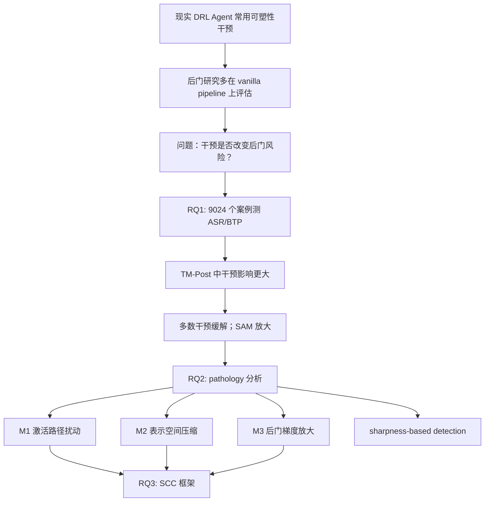

# Angel or Demon：可塑性干预会放大还是缓解 DRL 后门？

## 元信息与 TL;DR

- **论文**：Angel or Demon: Investigating the Plasticity Interventions' Impact on Backdoor Threats in Deep Reinforcement Learning
- **作者**：Oubo Ma、Ruixiao Lin、Yang Dai、Jiahao Chen、Chunyi Zhou、Linkang Du、Shouling Ji
- **链接**：[arXiv:2605.14587](https://arxiv.org/abs/2605.14587)
- **代码**：[maoubo/Plasticity](https://github.com/maoubo/Plasticity)
- **时效依据**：arXiv 页面显示论文提交于 2026-05-14；同页 comments 标注为 ICML 2026，会议时间是 2026-07-06 至 2026-07-11，因此进入本周官方会议窗口。
- **类别**：AI 安全 / 强化学习 Agent 安全

### TL;DR

- 这篇论文研究一个容易被忽略的安全问题：现代深度强化学习（DRL）Agent 常用“可塑性干预”来缓解持续学习中的 plasticity loss，但这些干预会不会改变后门攻击的风险？
- 作者把 **7 种主流干预**、**2 个攻击阶段**、**4 类后门方法**、**47 个后门任务** 和多个随机种子组合起来，共做了 **14,664 个实验案例**；其中 RQ1 主实验是 **9,024 个案例**，RQ3 组合干预实验是 **5,640 个案例**。
- 核心发现很反直觉：多数干预在 post-training 后门场景会降低 ASR，但 **SAM（Sharpness-Aware Minimization）会显著放大后门**；在机器人控制任务中，ASR 从 **0.178** 升到 **0.326**，相对提升 **83.15%**，同时 BTP 从 **0.745** 升到 **0.814**。
- 论文把机制拆成三类：**激活路径扰动**（Shrink & Perturb、Weight Clipping、ReDo）、**表示空间压缩**（Spectral Normalization、Weight Decay、Layer Normalization）、**后门梯度放大**（SAM）。前两类通常制造路径竞争或稠密化，从而缓解后门；SAM 则捕捉尖锐后门损失方向，把后门推入更稳定的平坦极小值。
- 组合干预不是简单相加。作者发现把 SAM 和其他干预组合后，post-training 后门可能更强；在机器人任务上，SSW 组合把 ASR 推到 **0.418**，BTP 也到 **0.915**。
- 局限也很明确：实验集中在 PPO、OpenAI Gym/PyBullet/MPE 风格任务和若干后门方法；sharpness 检测还没有统一阈值；SCC 是概念框架，不是完整防御系统。

## 研究问题：为什么“提升可塑性”的技巧会成为安全变量？

### 背景不是普通后门，而是 DRL 的训练动力学

- 在 DRL 里，Agent 不只是拟合固定数据集，而是在不断变化的状态分布、奖励信号和策略更新中学习。
- 后门攻击通常要把“触发器状态”绑定到“目标动作”，同时保持正常任务性能不崩。
- 现代 DRL 系统为了缓解 plasticity loss，会加入各种干预：
  - **参数扰动**：Shrink & Perturb、Weight Clipping。
  - **正则约束**：Spectral Normalization、Weight Decay。
  - **激活控制**：Layer Normalization、ReDo。
  - **优化控制**：SAM。

### 论文真正追问的是三个问题

| 研究问题 | 论文问法 | 为什么重要 |
|---|---|---|
| RQ1 | 可塑性干预如何影响 DRL 后门攻击？ | 如果常规训练技巧会改变后门强度，部署时不能只看正常收益。 |
| RQ2 | 干预改变了后门的哪些内部性质？ | 只报告 ASR/BTP 不够，需要解释为什么有的干预缓解、有的干预放大。 |
| RQ3 | 这些机制给未来攻击和防御什么启发？ | 组合干预可能成为更强后门构造工具，也可能给检测提供信号。 |

### 这和 LLM/Agent 安全的关系

- 论文对象是 DRL，不是大语言模型本身。
- 但它抓住了 Agent 安全里的同一个结构性问题：
  - **Agent 会被后训练、微调、重新打包和第三方托管。**
  - **安全风险不只来自模型架构，还来自训练管线里的“良性工程技巧”。**
  - **某个技巧在正常任务上提升稳定性，可能同时提高恶意行为的可保持性。**

## 威胁模型：TM-Scratch 和 TM-Post 的差异

### 两个阶段

| 阶段 | 攻击者做什么 | 论文观察到的风险形态 |
|---|---|---|
| TM-Scratch | 在 Agent 从零训练时注入后门。 | 干预影响较小，因为 benign pathway 和 backdoor pathway 同时竞争式生成。 |
| TM-Post | 下载或接管已训练 Agent，再通过后训练注入后门。 | 干预影响更大，因为后门必须在已稳定的正常表示里“挖出”路径。 |

### 后门任务形式

论文把后门任务写成一个元组：

```text
M† = (T, S†, A†, Fs, Fa, R†)
```

| 符号 | 含义 | 安全解释 |
|---|---|---|
| `T` | 触发器空间 | 攻击者能引入的异常输入模式。 |
| `S†` | 后门状态空间 | 被触发器映射后的状态集合。 |
| `A†` | 目标动作空间 | 攻击者希望 Agent 输出的动作。 |
| `Fs: S x T -> S†` | 状态触发函数 | 把正常状态改造成带触发器状态。 |
| `Fa: T -> A†` | 触发器到目标动作的映射 | 规定触发器应该诱导哪个动作。 |
| `R†` | 后门奖励函数 | 用奖励强化触发器和目标动作之间的绑定。 |

### 攻击目标

作者把攻击目标写成：

```text
min_theta† E_{s~S, delta~T} || pi_theta†(Fs(s, delta)) - a† ||
```

- **直观含义**：触发器出现时，后门策略 `pi_theta†` 的动作要尽可能接近攻击者指定动作 `a†`。
- **隐蔽性约束**：正常状态下，Agent 的 benign task performance 不能明显下降。
- **安全含义**：这不是“让模型整体变差”的攻击，而是“让模型在少数状态下精确转向”的攻击。

## 实验设计：9,024 + 5,640 个案例如何构成证据链？

### 主实验组合

RQ1 的 9,024 个案例来自：

```text
2 个威胁模型
x 8 个干预设置
x 47 个后门任务
x 4 个后门攻击方法
x 3 个随机种子
= 9,024
```

### 任务与攻击方法

| 维度 | 内容 |
|---|---|
| Classic control | CartPole、Acrobot、MountainCar、Pendulum |
| Physics control | Lunar Lander、BipedalWalker |
| Robotic tasks | Hopper、Reacher、Half Cheetah |
| 攻击方法 | TrojDRL、BadRL、SleeperNets、UNIDOOR |
| 后门任务 | 47 个，覆盖单后门和多后门设置 |

### 干预设置

| 干预 | 机制直觉 | 论文中的角色 |
|---|---|---|
| None | 无干预基线 | 用来衡量后门在普通管线里的强度。 |
| Shrink & Perturb | 缩小权重并加入随机扰动 | 软性破坏路径，通常轻度缓解。 |
| Weight Clipping | 把权重限制在阈值内 | 直接截断大权重，尤其能压制 TM-Post 后门。 |
| Spectral Normalization | 约束最大奇异值 | 压缩表示空间，让梯度方向更对齐。 |
| Weight Decay | L2 正则 | 软性约束权重距离。 |
| Layer Normalization | 层内归一化 | 平滑网络对输入扰动的响应。 |
| ReDo | 重置 dormant neurons | 可能重置后门相关但正常任务弱相关的神经元。 |
| SAM | Sharpness-Aware Minimization | 反直觉地放大后门。 |

### 指标：ASR 和 BTP

| 指标 | 公式直觉 | 解释 |
|---|---|---|
| ASR | 触发后输出目标动作的比例 | 攻击越强，ASR 越高。 |
| BTP | 正常任务回报经上下界归一化后的值 | 隐蔽性越好，BTP 越高。 |

连续动作场景里，ASR 不要求动作完全相等，而是看输出动作与目标动作距离是否在容忍阈值内。

## 主结果：SAM 是唯一明确放大后门的干预

### TM-Scratch：影响相对温和

- 从零训练时，正常任务路径和后门路径一起形成。
- 干预会改变训练动力学，但其影响不断被后续训练重塑和稀释。
- 论文报告：
  - ASR 只是小幅波动。
  - Layer Normalization 对 ASR 的最大影响约为 **-8.84%**。
  - Spectral Normalization 和 Layer Normalization 对 BTP 有较大扰动，尤其在稀疏奖励任务上明显。

### TM-Post：影响显著放大

post-training 场景更关键：

- Agent 已经形成正常任务表示。
- 后门必须在已有权重和表示里强行建立新路径。
- 干预会直接改变“后门路径能否插入、能否稳定、会不会破坏正常路径”。

| 干预 | TM-Post 中的代表性结果 | 解释 |
|---|---|---|
| Weight Clipping | ASR 平均下降 **17.46%** | 截断高幅值后门权重，压制稀疏路径。 |
| Spectral Normalization | ASR 平均下降 **11.78%** | 压缩表示，使后门和正常梯度更纠缠，训练更不稳定。 |
| Weight Clipping | BTP 平均下降 **20.19%** | 也破坏正常路径，所以不是免费防御。 |
| Layer Normalization | BTP 平均下降 **11.93%** | 正常表示受归一化约束影响。 |
| SAM | 机器人任务 ASR 从 **0.178** 到 **0.326** | 后门被推向更稳的平坦区域。 |

### 为什么这不是简单的“性能-安全 trade-off”？

- 如果一个干预只是降低 ASR，同时也降低 BTP，那是粗糙的破坏。
- SAM 的危险点在于：
  - **ASR 上升**：后门更容易成功。
  - **BTP 也上升或保持较好**：后门更隐蔽。
  - **尤其在 TM-Post 明显**：符合第三方微调、模型重打包、托管平台二次发布等现实风险。

## 机制分析：三种 pathology 如何解释差异？

论文借用 plasticity loss 研究中的三个病理特征：

| pathology | 度量方式 | 后门中的含义 |
|---|---|---|
| Weight Magnitude | 线性层权重 RMS | 后门是否依赖少数大权重或稀疏路径。 |
| Effective Rank | 奇异值分布熵的指数，再归一化 | 表示空间是否被压缩，路径是否更稠密。 |
| Loss Landscape Sharpness | Hessian 最大特征值估计 | 后门损失是否造成尖锐局部变化。 |

### 公式块：三个度量怎么读？

```text
Weight Magnitude = sqrt( (1 / N) * sum_l sum_i,j (W^l_{i,j})^2 )

Erank(W) = exp( - sum_k p_k log p_k )
p_k = sigma_k / ||sigma||_1

Loss Landscape Sharpness = lambda_max(H)
H = grad^2_theta L(theta)
```

- **Weight Magnitude 高**：说明某些权重可能承担了集中的后门映射。
- **Effective Rank 变化**：说明表示空间维度和信息分布被改变。
- **Sharpness 高**：说明触发器带来的稀有状态和大后门奖励让损失地形出现尖峰。

### 作者的基线观察

- 后门攻击本身会放大训练非平稳性。
- 相比常规训练，后门使 weight magnitude 的波动范围增加 **98.63%**。
- Effective rank 的波动范围增加 **19.16%**。
- Loss landscape sharpness 的波动范围增加 **635.22%**。

这解释了为什么 sharpness 会成为潜在检测信号：它对后门最敏感。

## 三类机制：从路径破坏到梯度放大

### M1：Activation Pathway Disruption

代表干预：

- Shrink & Perturb
- Weight Clipping
- ReDo

机制：

- 后门路径通常更稀疏，依赖少数权重或局部子网络。
- Weight Clipping 会截断超阈值权重。
- ReDo 可能重置对正常任务 dormant、但对后门重要的神经元。
- Shrink & Perturb 则软性压缩并扰动权重。

安全解读：

- 在 TM-Post 中，正常路径已经稳定，后门路径需要“插进去”。
- 这些干预会制造路径重建竞争。
- 后门路径因为稀疏、脆弱，更容易受影响。

### M2：Representation Space Compression

代表干预：

- Spectral Normalization
- Weight Decay
- Layer Normalization

机制：

- Spectral Normalization 通过最大奇异值约束压缩 actor network 的 Lipschitz 常数。
- 后门状态原本可能与正常状态梯度近似正交。
- 表示压缩后，后门梯度和正常梯度更趋向对齐。
- 后门从“稀疏独立路径”转向“与正常路径共享的稠密路径”。

这有双重效果：

- 一方面，后门不再那么独立，稳定性下降。
- 另一方面，正常任务也可能被牵连，BTP 会下降。

### M3：Backdoor Gradient Amplification

代表干预：

- SAM

机制：

- 后门触发器是稀有信号，后门奖励常常很大。
- 这会形成尖锐损失方向。
- SAM 的目标是寻找对邻域扰动更稳的解。
- 在后门场景中，SAM 反而捕捉了这个尖锐后门方向，并放大相应梯度。
- 结果是后门路径快速收敛到更平坦、更抗扰动的区域。

这就是“Angel or Demon”的标题含义：

- 在普通任务中，SAM 可能是稳定训练的 angel。
- 在 post-training 后门中，SAM 可能让恶意映射更稳定，变成 demon。

## Mermaid：论文的论证路线



## 组合干预：为什么“多加几个安全技巧”可能更糟？

RQ3 额外分析了 **5,640 个案例**，重点看组合干预。

### 组合方式

| 组合 | 包含干预 | 论文中的问题 |
|---|---|---|
| Swiss Cheese | Weight Decay + Layer Normalization | 缓解效果近似 Layer Normalization，非加性。 |
| Plastic | Layer Normalization + SAM + ReDo | 与 SAM 组合后可能放大后门。 |
| Lac | Weight Clipping + Layer Normalization | 两个缓解干预相加不一定更好。 |
| SLac | Lac + SAM | 加入 SAM 后转向放大风险。 |
| SSW | Weight Clipping + Spectral Normalization + SAM | 三类 pathology 的代表组合，风险最高。 |

### Table 1 的关键数字

| 组合 | ASR | BTP | PD |
|---|---:|---:|---:|
| None | 0.178 +/- 0.157 | 0.745 +/- 0.230 | N/A |
| Plastic | 0.368 +/- 0.144 | 0.724 +/- 0.362 | 9.43 |
| SLac | 0.417 +/- 0.146 | 0.816 +/- 0.276 | 17.42 |
| SSW | 0.418 +/- 0.092 | 0.915 +/- 0.131 | 18.64 |

解读：

- ASR 从 **0.178** 到 **0.418**，说明攻击成功率显著升高。
- BTP 从 **0.745** 到 **0.915**，说明正常任务性能也变好，后门更隐蔽。
- PD 越高，组合中的干预在 pathology 空间里距离越大，彼此干扰越少，更可能形成协同。

### PD 的定义

```text
v(pi) = (vi1, vi2, vi3)
d(pi, pj) = || v(pi) - v(pj) ||_2
PD(A) = sum_{1 <= i < j <= |A|} d(pi, pj)
```

- `v(pi)` 表示干预 `pi` 在三种 pathology 上的排名向量。
- `d(pi, pj)` 表示两个干预的病理距离。
- `PD(A)` 是组合内所有两两距离之和。
- 论文的推论是：如果组合干预在 pathology 上互补，可能更容易构建多路径、稳定、隐蔽的后门。

## SCC：一个攻击框架，也是一张防御诊断图

SCC 是 Sweeper-Converter-Connector。

| 组件 | 利用的机制 | 可借用干预 | 作用 |
|---|---|---|---|
| Sweeper | M1 激活路径扰动 | Shrink & Perturb、Weight Clipping、ReDo | 清出或扰动一部分正常路径，为后门路径腾空间。 |
| Converter | M2 表示空间压缩 | Spectral Normalization、Weight Decay、Layer Normalization | 让后门梯度和正常梯度更对齐，把稀疏后门变成多路径结构。 |
| Connector | M3 后门梯度放大 | SAM | 把后门和正常表示稳定连接到平坦区域，提升抗扰动性。 |

研究者视角下，SCC 的价值不是“教人攻击”，而是把风险分解成可检查的训练管线属性：

- 是否存在会清理路径的干预？
- 是否存在会压缩表示空间的干预？
- 是否存在会追逐 sharpness 的优化？
- 这些干预是否在 post-training 或模型重打包阶段组合出现？

## Figure/Table 证据如何支持结论？

| 证据 | 支撑的 claim | 不能证明什么 |
|---|---|---|
| Figure 3 | TM-Post 中干预对 ASR/BTP 影响更强；SAM 放大后门。 | 不能说明所有 DRL 算法、所有任务都同样受影响。 |
| Figure 4 | 后门显著放大 loss sharpness，sharpness 对后门敏感。 | 不能直接给出可部署检测阈值。 |
| Figure 5 | 不同干预在 weight magnitude、effective rank、sharpness 上排名不同。 | 排名是统计归纳，不等于机制的唯一因果证明。 |
| Figure 6 | Weight Clipping 会截断后门相关高幅值权重。 | 不能证明 clipping 是无副作用防御。 |
| Figure 7 | Spectral Normalization 使后门和正常状态梯度更趋向对齐。 | 不能保证表示压缩总是缓解后门。 |
| Figure 8 | SAM 把后门 sharpness 压低到更平坦区域。 | 不能说明所有 sharpness-aware 优化都同样危险。 |
| Table 1 | SAM 组合干预可把 ASR 和 BTP 同时推高。 | 不能直接外推到未测试组合或非 PPO 系统。 |
| Table 3 | 触发后任务分数可从正常高分跌到灾难性低分，例如 Lunar Lander 从 244.13 到 -882.97。 | 不能代表真实自动驾驶或机器人系统的物理风险大小。 |

## 消融、失败边界与可复现性

### 消融边界

- 作者提到 Appendix E 检查了不同 intervention hyperparameters。
- 结论趋势在超参数扰动下保持一致，但具体幅度会波动。
- 这意味着工程部署时不能只问“是否使用 SAM”，还要问：
  - SAM 的 sharpness penalty 是多少？
  - post-training 轮数是多少？
  - 目标任务是稀疏奖励还是密集奖励？
  - 后门任务是单触发器还是多触发器？

### 复现实验设置

代码仓库 README 给出：

- 服务器：Intel Xeon Gold 6430 CPU。
- GPU：10 张 NVIDIA GeForce RTX 4090，CUDA 12.4。
- 环境：Conda 环境文件 `backdoor_env.yml`。
- 任务：README 列出了 CartPole、Acrobot、MountainCar、Pendulum、Lunar Lander、Bipedal Walker、Half Cheetah、Hopper、Reacher、Predator-Prey、WorldComm 等后门设计。

### 复现风险

- 仓库当前很轻量，GitHub API 显示最近提交在 2026-05-13，README 主要记录环境和后门任务表。
- 论文实验规模大，真正复现 14,664 个案例需要较高算力。
- 如果只复现少数任务，最好优先选：
  - TM-Post。
  - SAM、Weight Clipping、Spectral Normalization、SSW。
  - 机器人任务和 Lunar Lander 这类可解释失败更清楚的环境。

## 相关工作位置：它不是“又一个后门 benchmark”

这篇论文的位置更像是三条线的交叉：

| 研究线 | 常见问题 | 这篇论文的推进 |
|---|---|---|
| DRL 后门攻击 | 如何注入更强、更隐蔽的触发器？ | 研究训练干预如何改变后门内部路径。 |
| Plasticity loss | 如何让 DRL Agent 保持持续学习能力？ | 指出可塑性增强技巧可能成为后门变量。 |
| Agent 安全 | 如何在二次训练、托管、重打包中控制风险？ | TM-Post 说明 post-training 阶段尤其危险。 |

最有价值的不是“发现 SAM 坏”，而是：

- 把“训练稳定性技巧”纳入威胁模型。
- 把后门从输入触发器问题推进到训练动力学问题。
- 给出了一个可解释的中间层：pathology vectors。

## 结论与局限

### 直接结论

- 在 DRL 后门场景里，可塑性干预不是中性的工程设置。
- TM-Post 比 TM-Scratch 更值得警惕，因为真实供应链里更常见的是下载、微调、重打包和托管。
- 多数干预可能降低 ASR，但 SAM 会放大后门，并让后门更稳定。
- 组合干预可能产生协同放大，而不是安全叠加。
- Loss landscape sharpness 是一个有希望的检测信号，但还需要任务归一化和误报控制。

### 局限

- **算法局限**：实验主要基于 PPO；还需要看 SAC、TD3、DQN 及多智能体 RL。
- **任务局限**：Gym/PyBullet/MPE 任务能覆盖多种控制形态，但距离真实机器人、无人机、自动驾驶仍有间隔。
- **攻击局限**：四类后门方法很有代表性，但不能覆盖所有未来攻击策略。
- **检测局限**：sharpness 异常有信号，但阈值随任务变化，直接部署会遇到 false positive。
- **外推局限**：LLM Agent 的训练和后训练机制不同，不能机械套用；但“良性训练技巧可能稳定恶意行为”的机制类比值得重视。

## 研究者还应继续追问什么？

### 0. 逐段细读：作者为什么把问题放在 post-training？

这篇论文的关键不是简单比较八个干预谁更好，而是把后门风险从“训练时是否被投毒”推进到“已训练 Agent 被二次处理时会发生什么”。

- 在 TM-Scratch 中，正常任务和后门任务从训练早期就共同竞争参数；很多干预的影响会被后续策略更新反复覆盖。
- 在 TM-Post 中，正常策略已经形成稳定路径；攻击者再注入后门时，需要在既有路径旁边制造新通道。
- 这使得每一种干预都变成结构性变量：有的会清空路径，有的会压缩表示，有的会把尖锐损失推入平坦区域。
- 对安全评估来说，这说明“模型发布后再微调”不是一个轻量维护动作，而是会重新塑造后门可行性的高风险阶段。

### 0.1 为什么 SAM 的结果最值得警惕？

SAM 的危险不在于它让模型变差，而在于它可能让“坏行为”和“好表现”同时稳定。

- 如果某个防御让 ASR 降低但 BTP 也大幅下降，安全团队至少能从性能退化中看到异常。
- SAM 在论文的关键场景里让 ASR 升高，同时 BTP 没有同步崩坏，攻击者更容易隐藏在正常性能指标后面。
- 这类风险对 Agent 供应链尤其麻烦：下游用户看到的是任务成功率、控制稳定性、benchmark 分数，而不是触发状态下的梯度路径。
- 因此，SAM 不是被简单标记为“不能用”，而是应当被标记为“使用后必须额外做触发器、sharpness、post-training 漂移审计”。

### 0.2 sharpness 检测为什么还不能直接落地？

论文把 loss landscape sharpness 当作有希望的外部信号，但没有把它包装成成熟检测器，这是一个重要克制。

- 不同 DRL 任务的奖励尺度、状态维度和策略网络差异很大，统一阈值很可能产生误报。
- SAM 本身会降低 sharpness，后门存在时可能出现“异常升高”或“异常下降”，不能只用单向规则。
- Hessian 最大特征值估计有计算成本，实时部署需要近似指标或抽样策略。
- 其他训练异常也可能改变 sharpness，例如奖励设计错误、环境非平稳、探索不足或灾难性遗忘。
- 更稳妥的路线是把 sharpness 和梯度对齐、ASR 探针、路径稀疏性一起作为审计证据，而不是单独判定。

### 0.3 对 LLM Agent 后训练的有限类比

这篇论文不直接证明 LLM Agent 会出现同样现象，但它给出了一个可迁移的研究模板。

- DRL 的触发器状态可以类比为 LLM Agent 中少见但高影响的工具调用上下文。
- DRL 的目标动作可以类比为越权 API 调用、错误文件写入、异常网络请求或不当权限升级。
- DRL 的 BTP 可以类比为正常任务成功率；危险场景是正常成功率提高，同时少数触发场景更容易越界。
- DRL 的 post-training 可以类比为指令微调、偏好优化、工具轨迹蒸馏或企业私有数据二次训练。
- 因此，对 LLM Agent 也应追问：哪些后训练技巧会把稀有越界行为变得更稳定，而不是只看平均任务分数。

### 1. LLM Agent 的 post-training 是否有类似 pathology？

可以把这篇论文的方法迁移成一个问题清单：

- SFT、DPO、GRPO、RLHF 中是否存在类似 sharpness-aware 的放大路径？
- 工具使用 Agent 的恶意工具调用是否也会在后训练中形成稳定局部路径？
- 指令微调后的“少数触发语义”是否能通过表示压缩变得更难移除？

### 2. 防御不能只看最终 ASR

更有用的监控维度可能是：

- 参数或激活路径是否突然集中。
- 后门触发状态和正常状态的梯度方向是否从正交变对齐。
- Hessian 最大特征值或 sharpness proxy 是否异常尖锐或异常下降。
- post-training 后 BTP 和 ASR 是否同时升高。

### 3. 供应链评估要记录训练管线

模型卡或 Agent 发布包如果只写最终 benchmark，不够。

更合理的安全元数据应包括：

- 是否使用 SAM 或类似 sharpness-aware 优化。
- 是否使用 weight clipping、normalization、neuron reset。
- 后训练阶段是否保留原始干预。
- 是否有 third-party repackaging。
- 是否检查过触发器状态下的 sharpness 和 gradient alignment。

### 4. SCC 可以反过来变成审计模板

审计时可以按 SCC 反向提问：

- **Sweeper 检查**：有没有清理、剪裁或重置路径的机制？
- **Converter 检查**：有没有压缩表示、对齐梯度或共享路径的机制？
- **Connector 检查**：有没有把后门损失推向平坦稳定区域的优化？
- **组合检查**：这些机制是否在 post-training 同时出现？

这篇论文最强的启发是：安全评估不能把训练技巧当作背景噪声。对 Agent 系统来说，训练管线本身就是攻击面。
