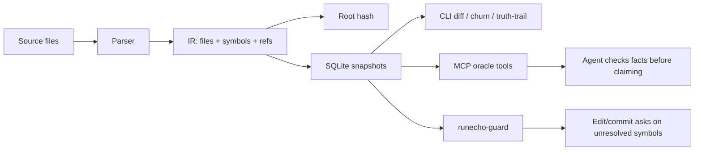

# RunEcho：给 coding agent 一个“确定性的代码事实层”

## 元信息与 TL;DR

| 字段 | 内容 |
|---|---|
| 项目 | RunEcho |
| 方向 | 大模型 Agent / coding agent 可靠性 |
| 原始链接 | [https://github.com/inth3shadows/runecho](https://github.com/inth3shadows/runecho) |
| 本轮新鲜度 | GitHub API 显示仓库 `pushed_at=2026-07-06T13:03:17Z`、`updated_at=2026-07-06T13:03:34Z`；最新提交为 `4a38d37`，修复 `runecho-guard` 在整文件清空 `Write` 场景下跳过 dangling-ref / dropped-import 检查的问题。 |
| 类型 | 代码项目深读 |
| 本地验证 | 本轮克隆后阅读 README、TECHNICAL、USAGE、SECURITY、benchmark findings 与核心 Go 代码；`go test ./...` 在本机失败，失败集中在 worktree resolution、auto-refresh 与 guard E6 测试，核心 `bench`、`internal/guard`、`internal/ir`、`internal/mcp`、`internal/parser` 包通过。 |

### TL;DR

- **RunEcho 解决的问题不是“让 agent 更会写代码”，而是让 agent 在开口、编辑、提交前能查一个本地确定性事实表**：某个函数、类、导出或 import 到底存不存在，当前结构与上次快照相比到底变了什么。
- **核心机制是结构化 IR + SQLite 快照 + MCP 只读 oracle + edit/commit guard**：源码被解析成文件 hash、符号、引用和 root hash；agent 通过 MCP 查询 `structure`、`diff`、`hash`、`status`、`health`、`locate`；guard 在 Claude Code `PreToolUse` 或 git pre-commit 阶段拦截明显的“幻觉符号”。
- **它的取向是确定性而非语义智能**：没有 embedding、没有 LLM、没有远端服务、没有 API key；相同代码应得到相同 IR 和相同 root hash，适合做 agent 的事实校验层，而不是替代代码搜索、类型检查或 SAST。
- **Benchmark 最值得看的是“诚实边界”**：合成测试在设计范围内达到 100% recall / 0% false positive；真实 transcript 样本更新后从 1/9 提升到 4/9，剩下 miss 主要是 qualified receiver 位置，需要类型推断，项目明确不做。
- **本轮本机验证给出一个重要局限**：完整 `go test ./...` 不是全绿；在隔离 `RUNECHO_HOME` 后仍复现 worktree 与 auto snapshot 相关失败。因此 RunEcho 的设计很有研究价值，但当作可直接部署的 guard 前，还要重新跑 CI、确认目标平台上的 worktree 行为。
- **对 coding agent 研究的意义**：它把“agent 不要胡说”从 prompt 约束推进到一个可查询、可 diff、可审计的本地事实接口；这类工具的关键问题不再是模型是否愿意自查，而是事实层覆盖率、失败时默认策略、与编辑流程的距离。

## 问题意识：coding agent 为什么需要“代码事实层”？

RunEcho 的 README 把 coding agent 的常见错误压缩成三类：

1. 引用不存在的函数、类型或 helper。
2. 描述结构性变化时说错了实际 diff。
3. 代码已经变了，agent 仍按旧状态推理。

这些错误看起来像“模型幻觉”，但在工程流程里更像**缺少可验证事实源**：

| 现象 | 只靠 LLM 的风险 | RunEcho 的切入点 |
|---|---|---|
| “我调用了 `BuildFoo()`” | 这个符号可能从未存在，或刚被删掉 | 用 IR / `locate` 查符号表 |
| “这个 PR 只改了配置” | agent 可能漏掉新增函数、删除 import 或 class body 变化 | 用 root hash 与 structural diff 对照 |
| “我记得上轮有 `Router.fetch`” | 长会话记忆可能滞后 | MCP 每次请求都 live scan，不从旧 cache 回答 |
| “提交前应该没问题” | 编译器未必覆盖脚本、动态语言和未运行路径 | guard 先抓裸调用、类型名、常量引用中的明显不实符号 |

这里的关键判断是：**Agent 可靠性不只来自更强模型，也来自更窄、更硬的事实接口。**

RunEcho 没有试图理解所有代码语义。它选择一个更可证明的子问题：

- 解析顶层结构。
- 记录符号和引用。
- 用 hash 表示结构状态。
- 让 agent 查询，而不是靠自然语言回忆。

## 作者的论证路线：从“事实表”到“编辑前 guard”

RunEcho 的论证顺序可以写成：



这条路线分成三层：

| 层 | 机制 | 论证功能 |
|---|---|---|
| 结构层 | parser 生成 IR，包含 file hash、symbols、refs | 把“代码状态”变成可排序、可 hash 的事实表 |
| 历史层 | SQLite central store 保存 snapshots、files、symbols、refs | 把“现在和过去的差异”变成可复查记录 |
| 交互层 | CLI、MCP、guard | 把事实表接近人和 agent 的工作流 |

RunEcho 最有意思的地方不是它又做了一个 code indexer，而是它把 code indexer 明确放在 **AI coding agent 的行动边界** 上：

- agent 说某个符号存在前，应该先查 `locate`；
- agent 说自己改了什么前，应该先查 `diff`；
- agent 写入或提交前，guard 应该检查新增文本是否引用了未知裸符号；
- 如果事实层降级，工具默认 fail-open，但必须记录边界。

## 方法机制：IR、root hash 与快照如何构成“确定性”？

RunEcho 的 IR 可以抽象为：

```text
IR = {
  Version,
  RootHash,
  Files: {
    path_i: {
      Hash,
      Symbols,
      Refs
    }
  }
}
```

Root hash 的定义很朴素：

```text
RootHash = SHA256(join("\n", sort(path_i + ":" + file_hash_i)))
```

变量含义：

| 变量 | 含义 | 为什么重要 |
|---|---|---|
| `path_i` | 归一化后的文件路径 | 保证跨遍历顺序的稳定性 |
| `file_hash_i` | 文件字节级 SHA-256 | 文件内容改变会传播到 root hash |
| `sort(...)` | 按路径排序 | 目录遍历顺序不影响结果 |
| `RootHash` | 整个结构视图的摘要 | 快速判断“结构事实表是否同一版本” |

这个公式的边界也很清楚：

- 它是**字节级** hash，换行符从 LF 变成 CRLF 会改变结果。
- 它不理解语义等价：重排 import、格式化、注释变化都可能影响 file hash。
- 它适合做一致性与 drift 检测，不适合证明代码行为等价。

### 解析器覆盖范围

RunEcho 当前覆盖：

| 语言 | 文件 | 结构捕获 |
|---|---|---|
| Go | `.go` | 顶层函数、类型、导出 var/const、receiver 方法、interface 方法签名 |
| JS/TS | `.js`、`.mjs`、`.cjs`、`.ts`、`.jsx`、`.tsx`、`.gs` | function、class、interface、enum、type、部分 import/export |
| Python | `.py` | `def`、`class`、`__all__` 或无下划线导出回退、模块级大写常量 |

它不做：

- 类型推断。
- 调用图。
- 跨文件绑定解析。
- qualified receiver 分析，例如 `obj.method()`。
- semantic search 或 embedding search。

这不是小问题，但也是 RunEcho 的研究边界：它宁愿少抓一些，也不把不确定的语义判断伪装成事实。

## 三个用户表面：CLI、MCP、Guard 分别管什么？

| 表面 | 面向对象 | 关键命令/工具 | 主要价值 |
|---|---|---|---|
| `runecho-ir` | 人类开发者、脚本 | `repo add`、`repo reindex`、`diff`、`map`、`truth-trail`、`validate-claims` | 建立基线、看 drift、验证 PR 文字里的符号引用 |
| `runecho-mcp` | Claude Code、Codex、其他 MCP client | `structure`、`diff`、`hash`、`status`、`health`、`locate` | 让 agent 用工具查事实 |
| `runecho-guard` | git hook / Claude Code hook | pre-commit、`PreToolUse` | 在编辑或提交前发现不存在的裸符号 |

### MCP oracle 的设计取舍

MCP 工具全部只读，并按已登记的 repo name 解析：

| Tool | 输入 | 输出重点 |
|---|---|---|
| `structure` | `repo`、可选 paths/detail | 当前 live IR 的文件、符号、引用 |
| `diff` | `repo`、可选 snapshot id 或 label | snapshot vs live 或 snapshot vs snapshot 的结构差异 |
| `hash` | `repo` | 当前 root hash 与文件数 |
| `status` | `repo` | 上次索引、staleness、parse errors、coverage、snapshot count |
| `health` | 无 | schema version、integrity、repo count、db path |
| `locate` | `repo`、`symbol`、`kind`、`offset` | 符号到 `file:line` 的确定性定位 |

`locate` 是最贴近 agent 的工具。它回答的不是“这段代码大概在哪里”，而是：

```json
{
  "symbol": "fetch",
  "matches": [
    {"name": "Reader.fetch", "file": "src/reader.py", "line": 42}
  ]
}
```

这类接口对 coding agent 很关键，因为它把“先 grep 一下吧”变成了一个明确的、可分页的、可失败的工具调用。

## Guard 的算法：为什么它能抓一部分幻觉，又为什么抓不全？

`runecho-guard` 的核心是两阶段静态检查：

```text
Input:
  KnownSymbols = symbols from indexed IR
  DiffLines = added lines from edit or staged diff
  IgnoreRules = .runechoguardignore

State:
  Known = KnownSymbols + literal ignore names
  IgnoreGlobs = glob patterns from ignore file

Pass 1:
  for each changed file:
    lang = LangFor(path)
    Known += ExtractDefs(lang, added_lines)
    Known += ExtractImports(lang, added_lines)

Pass 2:
  for each changed file:
    refs = ExtractRefs(lang, added_lines)
    for ref in refs:
      if ref not in Known and not matches IgnoreGlobs:
        emit Violation(file, line, symbol, suggestion)

Output:
  pre-commit: exit 1 on violation
  hook mode: permissionDecision = "ask"
```

这段流程有两个优点：

- 新增 helper 与新增引用在同一次 diff 里不会误报，因为 Pass 1 会先把新定义放进 `Known`。
- 结果可解释：每个 violation 都能落到 `file:line:symbol`，并用 Levenshtein 给 “did you mean”。

也有明显边界：

| 情况 | RunEcho 行为 | 原因 |
|---|---|---|
| `foo(...)` 裸调用不存在 | 可抓 | 正好是设计目标 |
| `SomeType` 类型注解不存在 | 新版本已扩展到可抓一部分 | 不需要 receiver 类型推断 |
| `TASTING_ROOM_KIND[t]` 常量引用不存在 | 新版本已扩展到可抓一部分 | 仍是裸标识符 |
| `df.groupby(...)` 方法不存在 | 不抓 | 需要知道 `df` 的类型 |
| `pkg.Thing` 不存在 | 不抓 | qualified reference 被跳过 |
| 动态生成函数 | 可能误报或不抓 | 静态浅解析无法证明 |

### 最新提交为什么值得关注？

最新提交 `4a38d37` 修的是一个细节但很关键的洞：

- `Write` 操作如果把文件清空，输入文本为空。
- 旧逻辑可能在“empty input”阶段提前退出。
- 这样 dangling-ref / dropped-import 检查没有机会读取 on-disk 旧文件。
- 结果是最危险的“整文件删除”反而绕过了引用消失检查。

修复后的语义是：

| 场景 | 旧风险 | 新行为 |
|---|---|---|
| `Write` 清空已有文件 | 可能被当成空输入直接 defer | 删除侧检查继续读取旧文件 |
| `Write` 创建真正空文件 | 没有旧定义可删 | 正常 defer |
| 功能默认开关 | dogfood gate 默认关闭 | 用户默认行为不变，但实验数据更可信 |

这说明 RunEcho 的作者在把 guard 往“编辑时事实检查”推进，而不是只停在 README 级别的概念工具。

## Benchmark：最重要的是 4/9 和 0/6 背后的边界

`bench/FINDINGS.md` 的第一批真实样本来自 session transcripts，并用编译或运行错误作为独立 ground truth。它给出两个层次的结果：

| benchmark | 测什么 | 结果 |
|---|---|---|
| synthetic scorecard | 设计范围内的 call-position refs | 100% recall / 0% false positive |
| captured real corpus | transcript-observed hallucinations | 更新后 4/9 caught，0/6 false positives |

这个结果不应该被读成“RunEcho 只能抓 44% 的幻觉”。更准确的读法是：

- 样本量很小，`N=15`，只能说明方向。
- 样本来自编译/运行错误，天然偏向 qualified method、type error、attribute error。
- RunEcho 有意不做 receiver 类型解析，所以 qualified miss 是设计边界。
- 0 false positive 部分来自“它不判断那些位置”，不是全局验证能力。

### 真实样本里的错误位置

| 引用位置 | 更新前 | 更新后 | 解释 |
|---|---:|---:|---|
| bare-call | 1/1 | 1/1 | 裸调用正中目标 |
| const-ref | 0/1 | 1/1 | 扩展 extractor 后可抓 |
| type-ref | 0/2 | 2/2 | 类型注解中的裸标识符可抓 |
| qualified-attr | 0/3 | 0/3 | 需要 receiver 类型 |
| qualified-method | 0/1 | 0/1 | 需要语义解析 |
| qualified-prop | 0/1 | 0/1 | 需要更深语言模型或类型系统 |

这里最有价值的不是分数，而是测量姿态：

- 先用真实 agent 出错样本做 corpus。
- 标明哪些 miss 能在当前 deterministic design 内补上。
- 标明哪些 miss 需要跨越设计边界。
- 把 README 的能力声明改得更诚实。

对 Agent 安全和可靠性研究来说，这比“我们能防幻觉”这种泛泛表述更有用。

## 安全模型：这是 correctness guard，不是安全边界

RunEcho 的 SECURITY.md 写得比较克制。可以提炼成四点：

| 维度 | 设计 | 边界 |
|---|---|---|
| 网络 | 无 outbound network，无 API key，无 hosted control plane | 不提供远端协作或集中管控 |
| 存储 | `~/.runecho/history.db` 保存路径、hash、符号名，不存源码内容 | 默认 Unix 权限，不加密；共享机器上可能被本地用户读到 |
| 执行 | hook 以用户权限运行 | 没有 sandbox 和 privilege separation |
| 安全定位 | 抓 hallucinated symbols | 不是 SAST、secret scanner、malware scanner、supply-chain auditor |

最重要的边界是：**guard fail-open by design**。

这意味着：

- 未安装、repo 未登记、无 snapshot、数据库错误、git 子进程超时，默认不阻塞。
- clean check 不会自动批准编辑，只是交还给正常权限流。
- `.runechoguardignore` 是 repo-local 文本，写权限用户可以绕过。

从研究角度看，这个选择合理：

- coding agent guard 如果经常误阻塞，会迅速被用户关掉。
- correctness signal 应先以低摩擦方式进入工作流。
- 但它不应被包装成强安全控制。

## 本轮本机验证：设计强，但测试没有全绿

我在本轮克隆的 `RunEcho` 仓库上跑了两次：

```bash
go test ./...
RUNECHO_HOME=/tmp/runecho-test-home-20260706t132754z go test ./...
```

第二次隔离了本机用户已有的 RunEcho store，但仍失败。通过与失败情况如下：

| 包/区域 | 本轮结果 | 说明 |
|---|---|---|
| `bench` | pass | benchmark 测试通过 |
| `internal/guard` | pass | guard validation core 通过 |
| `internal/ir` | pass | IR 核心通过 |
| `internal/mcp` | pass | MCP core 通过 |
| `internal/parser` | pass | parser 测试通过 |
| `cmd/runecho-guard` | fail | `TestRefreshIRForFile_E6`、cross-worktree refresh 等失败 |
| `cmd/runecho-ir` | fail | linked worktree parity / duplicate enrollment 失败 |
| `internal/snapshot` | fail | repo path tier / worktree tier resolution 失败 |

这对文章判断有两个影响：

- **不否定核心思想**：结构 IR、MCP oracle、guard validator 的单元层面材料仍然足够清楚。
- **限制部署判断**：至少在本轮环境里，worktree identity 与 auto snapshot 路径存在可复现失败；如果要把 RunEcho 接进真实 Codex/Claude Code 工作流，必须先在目标机器上跑全套 CI。

## 与已有 coding-agent 工具的差异：它不是“更聪明的 reviewer”

RunEcho 的定位应和几类工具区分：

| 工具类型 | 典型目标 | RunEcho 的不同点 |
|---|---|---|
| 代码搜索 / embedding index | 找相关文件、语义相似片段 | RunEcho 只回答结构事实 |
| 静态分析 / SAST | 找 bug、安全漏洞、复杂规则 | RunEcho 不判断安全性和行为正确性 |
| LLM code reviewer | 解释 diff、给建议 | RunEcho 不生成建议，只给事实 |
| 类型检查器 / 编译器 | 验证语言语义 | RunEcho 更浅，但跨 agent 工作流，且接入 MCP/hook |
| agent memory | 记住上轮决策 | RunEcho 不记语义意图，只记结构快照 |

它最像一个 **agent-facing factual substrate**：

```text
LLM reasoning layer:
  "我准备改 X，因为 Y。"

RunEcho fact layer:
  "X 是否存在？在哪个文件？当前 root hash 是什么？和 session-start 比改了哪些 symbols？"

Permission / review layer:
  "这次 Edit 是否引用了不存在的裸符号？是否需要 ask？"
```

这个分层对未来 coding agent 很重要。越是让 agent 长时间自主工作，越不能把所有正确性都压在上下文窗口和自然语言自律上。

## 代码结构细读：哪些模块真正承载 RunEcho 的主张？

RunEcho 的目录不是一个宽泛平台，而是围绕“结构事实”重复收敛。几个核心目录可以对应到上面的论证路线：

| 路径 | 关键职责 | 对 agent 可靠性的意义 |
|---|---|---|
| `internal/parser/` | Go、JS/TS、Python 的结构抽取 | 决定事实层看到什么，也决定 guard 永远看不到什么 |
| `internal/ir/` | 遍历文件、生成 IR、计算 hash、保存 `.ai/ir.json` | 把源码状态变成稳定输入输出 |
| `internal/snapshot/` | SQLite schema、repo registry、snapshot、diff、churn | 把单次结构图变成可追溯历史 |
| `internal/mcp/` | JSON-RPC stdio server 和 oracle tools | 把事实层开放给 agent |
| `internal/guard/` | diff 解析、引用抽取、未知符号判断、suggestion | 把事实层贴到 edit / commit 动作前 |
| `internal/claims/` | 从 prose 中抽取 symbol references | 检查 PR 说明、笔记、agent 自述是否提到不存在的符号 |
| `cmd/runecho-ir/` | CLI 入口、repo/snapshot/diff/map/verify/truth-trail | 给人类和脚本一个可复查操作面 |
| `cmd/runecho-mcp/` | MCP server 二进制入口 | 给 Codex / Claude Code 这类 agent 一个本地工具 |
| `cmd/runecho-guard/` | pre-commit 与 hook mode 入口 | 把检查变成流程门槛或至少变成 ask 信号 |

这个结构里有一个反复出现的工程选择：**事实生成与事实消费分开**。

- parser / IR 负责生成事实。
- snapshot 负责保存和比较事实。
- MCP 负责查询事实。
- guard 负责用事实判断新增引用。
- claims 负责把自然语言声明拉回事实层。

这种分离让 RunEcho 不必把所有问题都塞进一个“agent prompt”。它更接近一个小型本地数据库：

```text
source tree
  -> parser extracts symbols / refs
  -> IR computes deterministic hash
  -> snapshot stores facts under repo_id
  -> MCP and guard consume facts at different moments
```

### `refs` 为什么单独存，而不是混进 `symbols`？

TECHNICAL 里明确把 `refs` 放到独立表：

| 表 | 含义 |
|---|---|
| `symbols` | 函数、类、导出、import 等声明事实 |
| `refs` | 文件中出现的裸调用引用 |

这个区分很重要：

- `symbols` 是“这个 repo 定义了什么”。
- `refs` 是“这个文件使用了什么名字”。
- 如果把 refs 混入 symbols，guard 的 known set 就会被污染：一个文件曾经错误地调用了 `FakeFn()`，不能让 `FakeFn` 因此变成“已知存在”。

也就是说，RunEcho 的事实层不仅要存数据，还要维护数据的语义边界。

### `DiffLive` 的作用：不要等下一次 snapshot 才知道变了

`DiffLive` 把已存 snapshot 与当前 live IR 比较。它的意义是：

| 场景 | 如果只看 snapshot | 使用 live diff |
|---|---|---|
| agent 刚改完文件 | 历史库还没更新，可能看不到新 drift | 重新扫描当前源码 |
| 长会话中途检查 | 只能看到上次 reindex | 直接比较 session-start 与 live |
| MCP 调用 | agent 可能读到旧 `.ai/ir.json` | 每次 live build，避免 cache 幻觉 |

这也解释了为什么 RunEcho 的 MCP 调用可能比纯 cache 慢：它把“当前事实”放在速度之前。对于 coding agent，这个取舍通常合理，因为一次错误编辑或错误说明的成本高于一次本地 scan 的延迟。

## 如果把 RunEcho 接到 Codex，会改变哪些工作流？

一个实际的 coding agent 会在三个地方受益：

### 1. 任务开始：少量事实 priming

传统做法是让 agent 先读大量文件，或者把完整目录树塞进上下文。RunEcho 更适合给一个短 header：

- repo 有多少支持语言文件；
- 最近 snapshot 是什么时候；
- 最忙目录在哪里；
- 如需定位符号，请调用 `locate`。

这样可以减少上下文浪费。Agent 不必先读全量 map，而是按需问：

```json
{"name":"locate","arguments":{"repo":"daily-report-app","symbol":"publishPublicRun"}}
```

如果返回零匹配，agent 就不应继续声称这个函数存在。

### 2. 编辑中：从“我觉得没问题”变成“事实层 ask”

编辑前 guard 最适合抓这类错误：

```python
def publish():
    return finalizePublicRun(payload)
```

如果 `finalizePublicRun` 不在 IR、diff 新增定义、import 或 ignore 中，hook mode 可以发出 ask。这里不是强行拒绝，而是把“可能是幻觉符号”推回权限流：

| 决策 | 适合场景 |
|---|---|
| `defer` | 没有 violation，或工具降级 |
| `ask` | 裸符号不存在，需要人或 agent 解释 |
| pre-commit exit 1 | 已安装 commit guard 且 violations 明确 |

这个设计对 agent 系统更温和：它不会替用户做最终安全授权，只让错误更早暴露。

### 3. 提交前：truth-trail 让 agent 自述可审计

`truth-trail --since=session-start --text=notes.md` 的想法很有价值：

- 先给结构 diff。
- 再看被删除符号是否仍有 callers。
- 再给 churn 信息，说明哪些文件高频变化。
- 最后检查自然语言说明里的符号是否仍存在。

这让“PR 描述”也进入事实检查范围。很多 coding agent 不是只会写错代码，还会在总结里说错：

| agent 总结风险 | truth-trail 可检查的部分 |
|---|---|
| 声称删除了 `OldParser`，实际还在 | symbols/diff |
| 声称调用 `NewValidator`，实际不存在 | claims extraction |
| 声称只改了 UI，实际改了 parser | structural diff |
| 声称重命名完成，实际 callers 悬空 | refs-to-name / dangling refs |

这类“总结可靠性”会越来越重要，因为用户常常根据 agent 的 final message 决定是否审查某些文件。

## 与近期 Daily Report 主题的关系：它补的是另一个层面

近期已经有多篇 coding-agent 或 agent-safety 文章讨论：

- 长程 agent 的 memory contract。
- 持久代码库里的跨 PR 攻击。
- runtime monitoring 与 safety alarm。
- agentic RL 的训练系统。
- 电脑使用 agent 的动作空间与评测。

RunEcho 和这些主题的关系可以这样定位：

| 近期主题类型 | 关注点 | RunEcho 的互补点 |
|---|---|---|
| AI control / persistent-state attack | 不可信 agent 如何跨时间埋攻击 | RunEcho 更窄：代码事实是否被说对、引用是否存在 |
| Agent memory benchmark | 长程决策允许看什么历史 | RunEcho 提供结构历史，而不是自然语言记忆 |
| Online safety monitoring | 输出何时触发 alarm | RunEcho 把 alarm 前移到 edit/commit 动作 |
| RL 后训练系统 | 怎么训练更强 agent | RunEcho 不训练，只提供外部事实工具 |
| Code review agent | 发现 bug 和评论代码 | RunEcho 只做 deterministic evidence，不做 reviewer 判断 |

因此它不是“又一篇 agent 框架”，而是一个 agent 工具链里的底层部件。它提醒我们：**Agent 能力提升以后，事实校验层反而更重要，因为 agent 的行动速度更快、影响面更大。**

## 失败案例与继续追问

RunEcho 自己已经暴露出几类失败边界：

| 失败边界 | 具体表现 | 后续问题 |
|---|---|---|
| qualified references | `obj.method()` 不检查 | 能否接入语言服务器或类型 checker，但仍保持低误报？ |
| worktree identity | 本轮测试复现 worktree resolution 失败 | git-common-dir、linked worktree、bare repo 场景需要更强 CI 覆盖 |
| fail-open | 降级时默认不阻塞 | 哪些团队需要 strict mode？strict mode 的误阻塞成本多高？ |
| parser coverage | 只覆盖 Go/JS/TS/Python/GAS | Rust、Java、Kotlin、C# 等 agent 常见仓库如何接入？ |
| token budget | `structure` 可能很大 | `locate`、paths glob、detail level 是否足够限制上下文开销？ |
| stale IR | 手动 snapshot 与 auto snapshot 可能错位 | hook 后自动 fresh index 的一致性需要更多真实 dogfood 数据 |

一个值得继续做的实验是：

1. 收集真实 Codex / Claude Code 会话里所有编译失败、测试失败、review 发现的“符号不存在”问题。
2. 按引用位置分类：bare call、type annotation、const ref、qualified method、import drop。
3. 分别跑 RunEcho guard、语言服务器、type checker、grep-based checker。
4. 记录 recall、false positive、latency、用户是否愿意保留 hook。

只有这样，才能回答一个实际问题：

> 对 coding agent 来说，最值得放在编辑前的事实检查是什么？

## 结论：RunEcho 的价值在“把事实检查变成 agent 工具”

RunEcho 最值得带走的判断不是“它已经解决 coding agent 幻觉”，而是：

- **coding agent 需要一个本地、确定性、可审计的事实接口。**
- **这个接口应该足够窄，窄到能明确说自己抓什么、不抓什么。**
- **它应该靠近行动点：agent 查询、编辑前 ask、提交前 block。**
- **它的失败模式必须被记录为边界，而不是被营销成通用安全能力。**

在这个意义上，RunEcho 是一个有研究价值的原型：

- 它把 `does symbol exist?` 变成 MCP 工具，而不是 prompt 建议。
- 它把 `what changed?` 变成 structural diff，而不是 agent 自述。
- 它把一部分 hallucinated references 放到 edit/commit gate 前。
- 它用真实 transcript 样本承认 coverage gap。

但本轮也必须保留谨慎判断：

- 仓库仍很新，GitHub star 很低。
- 完整测试在本机不是全绿。
- worktree / auto snapshot 路径尤其需要修复或解释。
- 它不是安全产品，只是 coding-agent correctness guard。

如果把 RunEcho 放到更大的 Agent 研究图景里，它提出的方向很明确：

<u>未来的 coding agent 不是只靠更长上下文和更强模型，而是要把模型放进一组可查询、可验证、可回滚的本地事实系统里。</u>

这类系统的好坏，最终要看三个指标：

| 指标 | 解释 |
|---|---|
| 覆盖率 | 能抓多少真实 agent 错误，而不是 synthetic demo |
| 误报成本 | 会不会让开发者频繁绕过 guard |
| 工作流距离 | 检查离 agent 的 claim、edit、commit 有多近 |

RunEcho 的当前答案还不完整，但它把问题问得足够具体：让 coding agent 少猜一点，先查事实。

## 研究者应如何复现实验？

如果后续要判断 RunEcho 是否真的适合作为 coding-agent 基础设施，我会优先设计一个小而硬的复现实验，而不是只看 README 示例：

| 步骤 | 做法 | 观察指标 |
|---|---|---|
| 构造会话集 | 收集 50 到 100 条真实 agent 编辑会话，保留成功、失败、被用户纠正三类 | 错误分布是否集中在符号不存在、错位置、错总结 |
| 建立 session-start | 每条会话开始前运行 snapshot，结束后运行 diff / truth-trail | 结构 drift 是否与 agent 总结一致 |
| 插入 guard | 对同一批 edits 回放 `runecho-guard`，记录 ask / defer | 能提前暴露多少真实错误 |
| 对比工具 | 同时跑 type checker、language server、grep checker | RunEcho 的增量价值在哪里 |
| 用户成本 | 统计每 100 次 edit 触发多少次 ask，其中多少是误报 | 是否会被开发者关闭 |

这里最关键的不是追求一个漂亮分数，而是把错误拆细：

- 裸调用幻觉应由 RunEcho 捕获。
- 类型推断问题应交给语言服务器。
- 语义 bug 应交给测试、review 或 SAST。
- PR 总结里的错误应由 claims / truth-trail 检查。

这种分工能避免一个常见误区：把所有 agent 错误都归到“模型不够强”，然后只靠换模型解决。RunEcho 代表的路线恰好相反：把可验证事实从模型里拿出来，放进本地工具，再让模型在需要时查询。

## 采用建议：先当审计信号，不要先当强门禁

以本轮读到的状态，我不会建议团队第一天就把 RunEcho 设置成强阻断。更合理的落地顺序是：

1. 先只启用 MCP oracle，让 agent 在总结和改动前查询 `locate` / `diff`。
2. 再启用 hook mode 的 ask，不直接拒绝，让团队收集误报与漏报。
3. 对高价值仓库启用 pre-commit guard，但保留 `RUNECHO_GUARD_SKIP=1` 的应急通道。
4. 最后才考虑 strict mode，并且只对已登记、CI 全绿、worktree 行为稳定的仓库启用。

这种顺序符合它自己的安全模型：RunEcho 是 correctness guard，不是访问控制系统。它越诚实地暴露边界，越适合作为 agent 工具链的一部分。
