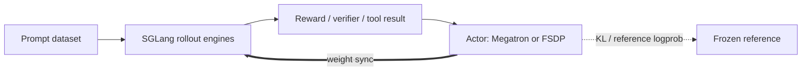
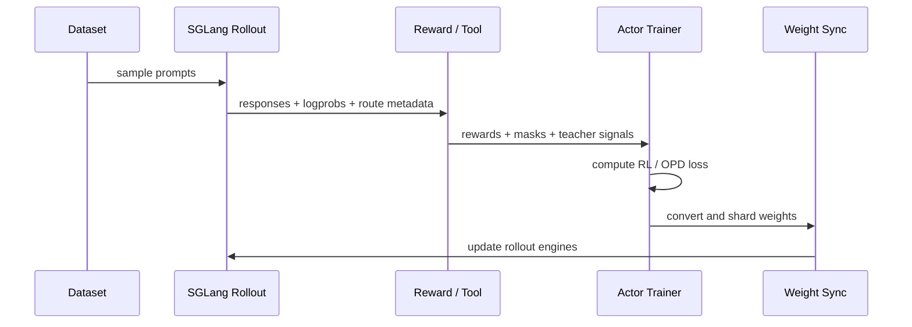

# Miles：把 LLM/VLM 后训练从“能跑脚本”推进到“可同步、可校验、可扩展”的 RL 基础设施

## 元信息与 TL;DR

| 字段 | 内容 |
|---|---|
| 项目 | Miles |
| 方向 | 大模型后训练 / RL 基础设施 |
| 原始链接 | https://github.com/radixark/miles |
| 本轮日期证据 | GitHub API 显示 `pushed_at=2026-07-06T07:24:43Z`，最新提交为 `Add Shi-Dong to megatron/sglang backends and rollout/session (#1580)` |
| 代码状态 | Apache-2.0；本轮查询时约 1672 stars、300 forks、466 open issues |
| 关键依赖 | SGLang rollout、Megatron-LM/FSDP actor、Ray placement group、可插拔 reward / rollout / loss hook |

### TL;DR

- **Miles 不是单个 GRPO 训练脚本，而是面向 LLM/VLM 后训练的 RL 系统框架**：它把一次训练拆成 Prompt dataset、SGLang rollout、Reward model、Megatron/FSDP actor、Frozen reference 和权重同步链路，目标是让大模型 RL 在多 GPU、多节点、MoE、低精度和工具调用场景下持续运转。
- **核心机制是一条闭环**：每轮从数据集采样 prompt，由 SGLang 生成多条 response，再用 reward function 打分，actor 按 GRPO/PPO/REINFORCE++/GSPO/OPD 等目标更新，最后把新权重同步回 rollout 引擎。
- **它把 batch 尺寸写成硬约束**：`rollout_batch_size × n_samples_per_prompt = global_batch_size × num_steps_per_rollout`。这不是文档修辞，而是把“生成了多少样本”和“训练消耗多少样本”绑定起来，避免 rollout 与 optimizer step 脱节。
- **最值得深读的是 train/inference mismatch 处理**：Miles 提供 true-on-policy、TIS/MIS、R3、统一 FP8/MXFP8、INT4 QAT 等路径，试图把 SGLang 推理路径和 Megatron 训练路径之间的数值差异压到可解释范围。
- **证据上，项目文档给出若干可核查数字**：true-on-policy 示例期望 `train/train_rollout_logprob_abs_diff=0`；OPD 示例报告 Qwen3-8B 从 SFT 的 Pass@1 76% 到 SFT+OPD 的 94%；P2P 权重同步表显示在 Qwen3-235B-A22B 上 RDMA 比 NCCL 快 70.6%，在 1T Kimi-K2 上快 86.4%。
- **局限同样明确**：大量能力依赖 H100/H200/B200 等硬件、Megatron/SGLang 版本对齐、模型 recipe 的并行配置、外部 reward 或工具环境；P2P 不是所有模型都赢，GLM-4.7-9B-Flash 与 GLM-5_4layer 表中 RDMA 反而更慢。
- **对后训练研究的意义**：Miles 把“RL 算法选择”下沉为一个系统问题，提醒研究者不要只报告 reward 曲线，还要报告 rollout engine、logprob 对齐、权重同步、低精度格式、router replay、off-policy correction 与失败恢复。

## 为什么这个项目值得放进后训练观察列表？

### 它回答的不是“怎么调一个模型”，而是“怎么维持一个 RL 生产循环”

- 很多后训练项目把焦点放在：
  - 新的 advantage estimator；
  - 更强的 reward model；
  - 更大的训练数据；
  - 更细的 prompt 或 rubric。
- Miles 的切入点不同：
  - rollout 阶段要靠 SGLang 高吞吐生成；
  - trainer 阶段要靠 Megatron/FSDP 管住大模型参数、优化器和 checkpoint；
  - 两者之间必须反复同步权重；
  - 每条样本还要带着 logprob、reward、route、loss mask、teacher signal 等训练所需状态。
- 这意味着它真正关心的是：
  - **样本是否来自当前策略**；
  - **训练 logprob 是否与 rollout logprob 对齐**；
  - **MoE expert routing 是否在推理和训练间发生漂移**；
  - **低精度部署是否改变 KL anchor 或 reward 解释**；
  - **多轮工具调用的中间状态能否被训练消费**。

### 本轮 freshness 为什么成立？

| 证据 | 说明 |
|---|---|
| `pushed_at=2026-07-06T07:24:43Z` | 符合本周 UTC 窗口内更新要求 |
| 最新 commit `254091f` | 提交信息涉及 Megatron/SGLang backend 与 rollout/session |
| README 最新更新区 | 项目仍在维护 FP8、INT4 QAT、VLM multi-turn、multi-agent、R3 等后训练能力 |
| docs 与 examples | 文档覆盖 quick start、core concepts、P2P、R3、OPD、Search-R1、多 agent、低精度 |

### 选题边界

- 本文不把 Miles 当成一篇算法论文来审稿。
- 更合适的读法是：
  - 把它当作 **后训练系统论文的材料库**；
  - 看它如何把算法、硬件、训练后端、推理后端和样本状态绑在同一个循环里；
  - 分析哪些工程机制实际上改变了 RL 结果的可解释性。

## 作者的系统主张：后训练循环由四个对象和一个同步边组成

### 四个对象是什么？

| 对象 | 在 Miles 中的角色 | 关键问题 |
|---|---|---|
| Prompt dataset | 输入样本来源，通常是 JSONL 或自定义 data source | prompt 如何采样、打乱、恢复、跨 epoch 复用 |
| Rollout | SGLang 引擎或多个引擎经 router 提供生成能力 | 如何控制并发、上下文、采样参数、logprob、route 元数据 |
| Reward model/function | 把 `(prompt, response, label)` 转成训练信号 | reward 是否有方差、是否可批量、是否依赖工具或外部服务 |
| Actor | Megatron/FSDP 管理的待训练模型 | 如何分片、更新、保存、和 reference/critic/teacher 交互 |
| Reference | 冻结模型，常用于 KL anchor | precision、checkpoint 与 tokenizer 是否和 actor 一致 |

### 这条闭环如何运行？



### 对应到代码入口是什么？

- `train.py` 的主循环非常直接：
  - `create_placement_groups(args)`：先用 Ray 固定 actor、critic、rollout 的资源布局；
  - `create_rollout_manager(args, pgs["rollout"])`：启动或连接 SGLang rollout 管理器；
  - `create_training_models(args, pgs, rollout_manager)`：初始化 actor 与可选 critic/reference/teacher；
  - `actor_model.update_weights()`：训练前先把 actor 权重推给 SGLang；
  - 循环内执行 `rollout_manager.generate`、`actor_model.train`、`save/offload`、`update_weights`、`eval`。
- 这段结构说明：
  - rollout 不是离线数据生成脚本；
  - rollout 也不是 trainer 内部的一个函数调用；
  - 它是一个和 trainer 平行存在、需要同步权重和状态的服务集群。

## 四旋钮约束：为什么 batch invariant 很重要？

### 公式

```text
rollout_batch_size × n_samples_per_prompt
  = global_batch_size × num_steps_per_rollout
```

### 变量解释

| 变量 | 含义 | 如果设置错会发生什么 |
|---|---|---|
| `rollout_batch_size` | 每轮抽取多少个 prompt | 过小会降低 GPU 利用率，过大可能塞爆 rollout 队列 |
| `n_samples_per_prompt` | 每个 prompt 采样多少条 response | GRPO 组内方差依赖它，太小会让 reward 对比不稳定 |
| `global_batch_size` | 每个 optimizer step 消耗多少条样本 | 与并行策略、动态 batching、显存预算相关 |
| `num_steps_per_rollout` | 同一批 rollout 被训练消费几步 | 大于 1 会引入 off-policy reuse，需要 TIS/MIS 等补偿 |

### 这个约束背后的研究含义

- 对 GRPO 一类方法来说，样本组的来源和消费方式决定 advantage 的语义。
- 如果 rollout 产出的样本比 trainer 消耗的多：
  - 有些样本会被丢弃；
  - reward 分布会被隐式过滤；
  - 训练日志里的“每步样本数”不再代表真实生成分布。
- 如果 trainer 消耗的样本比 rollout 产出的多：
  - 样本被重复使用；
  - 当前策略和生成策略之间的距离变大；
  - KL、ratio、clip、TIS 的解释会变得更重要。
- Miles 把这件事写成显式 invariant，本质是在提醒：
  - 后训练不是“多跑几条 response”；
  - 它是 rollout distribution、reward distribution 与 optimizer distribution 的共同设计。

## 训练/推理错配：Miles 最有研究价值的主线

### 错配来自哪里？

| 错配来源 | 具体表现 | 对 RL 的影响 |
|---|---|---|
| Kernel 差异 | SGLang 推理和 Megatron 训练使用不同 attention/GEMM 路径 | 同一 token 的 logprob 不再严格一致 |
| 低精度差异 | rollout 使用 FP8，trainer 使用 BF16 或另一种 block layout | ratio、KL、advantage 都可能被精度噪声污染 |
| MoE routing 差异 | rollout 选 expert `{2,7}`，training 可能选 `{2,8}` | 梯度打到不同 expert，长序列和多层网络中误差放大 |
| Off-policy reuse | partial rollout 或多步训练复用旧策略样本 | 当前 actor 不再等同于生成样本时的 actor |
| 工具/多轮状态 | tool call、search result、session route 与 response 绑定 | 后续训练必须保留中间状态和 loss mask |

### true-on-policy 的目标

- Miles 的 true-on-policy 示例希望观察到：
  - `train/train_rollout_logprob_abs_diff = 0`。
- 为了接近这个目标，文档列出几类对齐：
  - FlashAttention-3 让训练和推理 attention 路径一致；
  - DeepGEMM 对 GEMM 操作做数值对齐；
  - batch invariant kernels 减少 batch 形状导致的差异；
  - `torch.compile` 和 dumper 工具用于定位细碎 kernel 差异。
- 研究意义：
  - 如果 logprob 差异不是 0，策略梯度里的 ratio 可能在优化“系统误差”；
  - 如果差异为 0，算法实验才更接近“同一个策略在同一个分布上被评估”。

### TIS/MIS 的位置

- Miles 没有假设所有场景都能做到 bitwise equal。
- 当不可避免存在 off-policy 或 precision drift 时，它提供：
  - `--use-tis`；
  - `--custom-tis-function-path`；
  - train-infer mismatch helper 示例。
- 这条路线的含义是：
  - 系统先尽量对齐；
  - 对齐不了的地方，再用重要性采样校正；
  - 不是用算法补丁掩盖所有工程不一致。

## R3：MoE RL 里最容易被低估的状态变量是 expert route

### 问题定义

- 在 MoE 模型中，每个 token 每层会选择 top-k expert。
- 选择过程依赖：
  - router linear 层；
  - top-k 操作；
  - kernel 数值；
  - FP8/低精度缩放；
  - batch 和并行布局。
- 只要 rollout 和 training 的 route 不一致，训练就可能在“另一个计算图”上优化。

### R3 的机制

| 环节 | Miles 做法 |
|---|---|
| SGLang rollout | 开启 `enable_return_routed_experts`，在 response 的 `meta_info` 里返回 route |
| Sample 状态 | 把 route 存到 `sample.rollout_routed_experts` |
| Trainer | 通过 `RoutingReplayManager` 和 replay utils 把 recorded route 注入 forward |
| 目标 | 训练时回放 rollout 的 expert assignments，而不是重新计算 route |

### 记忆成本公式

```text
memory_bytes = (num_tokens - 1) × num_layers × top_k × 4
```

| 示例变量 | 数值 |
|---|---|
| `num_tokens` | 32K |
| `num_layers` | 60 |
| `top_k` | 8 |
| 单样本 routing metadata | 约 60 MB |

### 为什么这件事重要？

- 这 60 MB 看起来像 overhead，但它换来的是：
  - rollout 与 training 的 expert 分配一致；
  - MoE 梯度不会因为 route 抖动打到错误 expert；
  - 低精度和非确定性 kernel 的影响有了一个可记录、可回放的边界。
- 对后训练研究者来说，R3 提醒一个事实：
  - MoE RL 的“样本”不只是 prompt/response/reward；
  - 它还包括生成时的路由轨迹。

## P2P 权重同步：吞吐瓶颈不只在生成，也在 actor 到 rollout 的同步

### 默认 broadcast 为什么会浪费？

- 每轮训练后，actor 权重必须同步到 SGLang rollout engines。
- 默认 broadcast 模式会把更新后的权重通过 NCCL 广播到 rollout rank。
- 当模型很大、MoE expert sharding 很复杂时：
  - 多个 target rank 可能收到重复数据；
  - pipeline-parallel stage 间不需要同步的部分仍然被 collective 拖住；
  - trainer 与 rollout 的并行布局不同，权重格式还要转换。

### P2P 的执行步骤

1. **初始化 transfer plan**
   - 根据 source rank、target rollout rank、TP/PP/EP/ETP 布局建立映射。
2. **查询远端内存注册信息**
   - rollout engine 提供 RDMA 写入所需地址和大小。
3. **本地 CPU replica 做格式镜像**
   - 用 SGLang 目标 layout 的 `weight_loader` 把 Megatron shard 转为 rollout 需要的格式。
4. **bucketed transfer**
   - 非 expert 与 expert 权重分桶，默认 1GB buffer，满桶后写远端。
5. **版本同步**
   - RDMA 写完成后 rollout engine 增加 weight version，再恢复生成。

### 文档中的 profiling 结果

| 模型 | 总参数 | 训练配置简写 | 推理配置简写 | NCCL | RDMA | Delta |
|---|---:|---|---|---:|---:|---:|
| Qwen3-30B-A3B | 30B(3B) | TP=4, EP=8, 2 nodes | TP=8, EP=8, 2 nodes | 2670.0 ms | 2160.2 ms | -19.1% |
| GLM-4.5-Air | 106B(12B) | TP=1, PP=4, EP=8, 4 nodes | TP=8, EP=8, 4 nodes | 5001.1 ms | 2637.2 ms | -47.3% |
| Qwen3-235B-A22B | 235B(22B) | TP=4, PP=4, CP=2, EP=16, 8 nodes | TP=32, EP=32, 8 nodes | 10753.6 ms | 3162.0 ms | -70.6% |
| GLM-5 | 744B(40B) | TP=4, PP=8, CP=2, EP=16, 16 nodes | TP=64, EP=64, 16 nodes | 58301.5 ms | 8479.7 ms | -85.5% |
| Kimi-K2 | 1T(64B) | TP=8, PP=8, CP=4, EP=32, 32 nodes | TP=32, EP=32, 32 nodes | 53279.1 ms | 7227.3 ms | -86.4% |

### 边界同样重要

- 文档表格里也有 RDMA 变慢的例子：
  - GLM-Z1-9B-0414：RDMA 比 NCCL 慢 1.8%；
  - GLM-4.7-9B-Flash：RDMA 慢 68.6%；
  - GLM-5_4layer：RDMA 慢 72.2%。
- 所以 P2P 不是“永远更快”的口号。
- 更准确的判断是：
  - MoE、expert sharding、跨节点大模型越重，P2P 的收益越可能显现；
  - 小模型、布局不匹配、后处理昂贵时，NCCL broadcast 可能更稳。

## 低精度：Miles 把 precision 当成训练变量，而不是部署附属品

### FP8/MXFP8/NVFP4 的框架位置

| 格式 | 典型硬件 | 文档状态 | 研究含义 |
|---|---|---|---|
| BF16 | NVIDIA/AMD 主流训练卡 | baseline | 最适合 bring-up 和排查数值问题 |
| FP8 block-wise | H100/H200/B200+ | generally available | 可让 rollout 和 trainer forward 使用一致低精度路径 |
| MXFP8 | Blackwell | beta | 更细 block layout，但硬件和后端限制更强 |
| NVFP4 | Blackwell | experimental | 目前更多是未来方向，特别是 MoE expert GEMM |
| INT4 W4A16 QAT | 8×141GB H200 场景 | 可用 recipe | 用 QAT 把大模型压到单机，同时保留 BF16 activation |

### 一个容易踩坑的 KL anchor

- 文档明确提醒：
  - SGLang rollout 可以指向 FP8 checkpoint；
  - Megatron trainer/reference 仍应使用 BF16 `torch_dist`；
  - `--ref-load` 不应指向 FP8 目录。
- 原因很实际：
  - reference 是 KL anchor；
  - 如果 anchor 自身被低精度替换，KL 曲线和早期实验不再可比；
  - 这不是性能问题，而是实验解释问题。

### INT4 QAT 的边界

- INT4 W4A16 的意义：
  - weights 用 4 bit；
  - activations 保持 BF16；
  - 通过 QAT 让模型在训练中适应量化误差。
- 文档给出 calibration 常量：
  - `num_calibration_samples=256`；
  - `quant_group_size` 常见 32 或 128；
  - `max_sequence_length=2048`；
  - `dampening_frac=0.01`。
- 适用边界：
  - 模型确实大到 FP8 都难以单机容纳；
  - 架构已经稳定；
  - 任务不是高度 precision-sensitive 的数学或安全评测。

## OPD、Search-R1、多 agent：Miles 的可插拔性如何落地？

### OPD：把 teacher signal 插进 on-policy 轨道

- On-policy distillation 的核心公式可写成：

```text
A_hat_t = A_t - lambda_opd × D_KL(P_student || P_teacher)_t
```

| 变量 | 含义 |
|---|---|
| `A_t` | GRPO/PPO/REINFORCE++/GSPO 等基础 estimator 给出的 token advantage |
| `lambda_opd` | `--opd-kl-coef` 控制 teacher penalty 权重 |
| `P_student` | student 当前策略分布 |
| `P_teacher` | teacher 分布，可来自 SGLang server 或 Megatron-loaded teacher |
| `D_KL` | token-level reverse KL penalty |

- 文档给出的 preliminary result：
  - Qwen3-8B-Base + SFT：Pass@1 76%；
  - Qwen3-8B-Base + SFT + OPD：Pass@1 94%。
- 这里的研究信号是：
  - distillation 不必离线发生；
  - student 可以在自己 rollout 的轨迹上接收 teacher 分布约束；
  - teacher 可以作为 rollout-time 服务，也可以作为 training-time Megatron 模型。

### Search-R1：工具调用不是旁路，它进入 rollout function

- `examples/search-r1` 把多轮搜索和 tool-calling 放进 `custom-generate-function-path`。
- 关键配置包括：
  - `max_turns=2`；
  - `topk=3`；
  - `search_concurrency=256`；
  - local 或 Google search backend；
  - `return_logprob=True` 以支持 TIS。
- 这说明 Miles 的抽象边界是：
  - 默认 rollout 负责普通生成；
  - 自定义 generate 可以接管工具调用、检索、会话状态；
  - reward function 再把 tool result 和 response 转成训练信号。

### Multi-agent：rollout function 可以变成一个 agent system

- `examples/multi_agent` 使用：
  - `custom_multi_agent_function_path`；
  - `num_parallel=5`；
  - `incorrect_reward_weight=0.8`；
  - `correct_reward_weight=1.2`。
- 启动脚本里把：
  - `--custom-generate-function-path` 指向 multi-agent rollout；
  - `--rollout-max-context-len` 设置到模型上下文窗口；
  - prompt 数据仍然走同一个 rollout/train loop。
- 这对 agent 后训练很关键：
  - 多 agent 交互不必脱离 RL 基础设施；
  - 但每个 agent 的中间状态、context 长度、reward attribution 都必须显式设计。

## 执行模式：同步、异步、colocate、dynamic sampling、partial rollout

### 同步 vs 异步

| 模式 | 每轮壁钟时间 | 适用场景 | 风险 |
|---|---|---|---|
| Sync | 近似 `rollout_time + train_time` | 调试、严格 on-policy | 吞吐低 |
| Async | 近似 `max(rollout_time, train_time)` | rollout-bound 长跑任务 | 策略滞后和队列状态更难解释 |

### Dynamic sampling 解决 reward homogeneity

- GRPO 常见失败：
  - 同一 prompt 的多条 response 分数完全一样；
  - 组内标准差为 0；
  - advantage 消失；
  - 梯度变平。
- Miles 的 DAPO-style filtering：
  - 用 `--over-sampling-batch-size` 多采样；
  - 用 `dynamic_sampling_filter` 丢弃无 reward 方差的组；
  - 如果可用组不够，再自动发起下一轮 oversampling。

### Partial rollout 回收半成品

- dynamic sampling 会丢弃或中断一部分生成。
- `--partial-rollout` 保存半成品 trajectory，下轮继续生成。
- 研究边界：
  - 半成品可能来自旧策略；
  - 如果又配合 `num_steps_per_rollout > 1`，off-policy 风险加重；
  - 文档建议配合 `--use-tis`。

## 与 slime、SGLang、Megatron 的关系

### Miles 的位置

| 组件 | Miles 中的角色 |
|---|---|
| slime | Miles README 称其为 fork 来源和核心模块化架构基础 |
| SGLang | 固定推理/rollout 引擎，负责高吞吐生成、logprob、route metadata |
| Megatron-LM | 生产训练后端，负责大模型分片、checkpoint、optimizer、并行 |
| Ray | 管理 actor/rollout/critic 的 placement group 与分布式执行 |
| FSDP | 实验或小规模 dense model 的训练后端 |

### 这不是简单拼装

- 如果只是把 SGLang 和 Megatron 接起来，问题会立刻出现：
  - checkpoint 格式不一致；
  - parallelism layout 不一致；
  - rollout logprob 与 train logprob 不一致；
  - route replay 和 low precision 元数据无法进入 loss；
  - tool-use trajectory 没有统一 Sample 表达。
- Miles 的价值在于：
  - 把这些不一致变成显式参数、hook、metadata 和验证项；
  - 让研究者能在同一套循环里比较算法与系统改动。

## 失败案例和可复现性风险

### 失败模式清单

| 失败模式 | 表现 | 对实验结论的伤害 |
|---|---|---|
| Reward collapse | 多条样本 reward 相同 | GRPO advantage 归零，训练看似稳定但没有学习 |
| Route drift | MoE rollout/training expert 不同 | 梯度更新错 expert，长跑后策略崩掉 |
| Precision drift | FP8/BF16 或 block layout 不一致 | KL、ratio、reward 曲线不可比 |
| Weight sync bottleneck | 每轮训练后同步时间过长 | rollout GPU 等 trainer，吞吐评估失真 |
| Colocation OOM | Megatron 和 SGLang 抢显存 | 训练在第一轮前失败 |
| Tool state loss | search/tool session 没有进入 sample metadata | 训练无法复现生成条件 |
| External reward instability | reward API 或检索服务延迟/失败 | 样本质量和训练时间都不稳定 |

### 复现实验时至少报告什么？

- 模型与 checkpoint：
  - HF checkpoint；
  - Megatron `torch_dist` 转换参数；
  - reference 是否 BF16；
  - tokenizer/chat template。
- 并行与硬件：
  - TP/PP/CP/EP/ETP；
  - rollout engine 数；
  - actor/rollout 是否 colocate；
  - GPU 型号。
- 数值路径：
  - BF16/FP8/MXFP8/INT4；
  - 是否启用 R3；
  - 是否启用 true-on-policy；
  - 是否启用 TIS/MIS。
- 样本路径：
  - rollout batch；
  - samples per prompt；
  - global batch；
  - steps per rollout；
  - dynamic sampling filter；
  - partial rollout。
- 评测路径：
  - eval prompt data；
  - eval sampling；
  - reward function；
  - wandb/logging 指标；
  - crash/recovery 策略。

## Figure/Table 证据的文本化解读

### P2P scaling 图表说明了什么？

- 图表对应的核心表格不是证明“RDMA 一定更快”。
- 它更像是证明：
  - 当 MoE expert sharding 和跨节点规模足够大时，broadcast 的重复传输成本会变成主瓶颈；
  - P2P 可以利用更多 source bandwidth，并让 target rank 接收更少数据；
  - 但实际收益受模型布局、post-load requantization、PP/EP/TP 配置影响很大。

### true-on-policy 图表说明了什么？

- 文档中的观察点不是单纯 AIME 分数。
- 真正的技术指标是：
  - train/rollout logprob absolute diff 应为 0；
  - raw reward 与 baseline 匹配；
  - rollout time 存在可接受 slowdown。
- 这说明 true-on-policy 是一个 trade-off：
  - 用系统对齐换算法解释性；
  - 但要接受吞吐成本。

### OPD 表格说明了什么？

- 76% 到 94% 的 Pass@1 提升是强信号，但仍是 preliminary result。
- 更严谨的追问包括：
  - teacher 与 student 数据切分是否稳定；
  - OPD top-k 策略如何影响 token-level KL；
  - 如果换 reward、换数学集、换推理长度，提升是否保持；
  - teacher 模式用 SGLang 还是 Megatron 会不会改变训练速度和数值路径。

## 核心判断与证据边界

### 可以比较确定的判断

- Miles 是一个高信号后训练基础设施项目：
  - 文档覆盖训练、推理、权重同步、低精度、R3、OPD、多 agent、工具调用；
  - 代码入口与文档中的四对象闭环一致；
  - 最新提交仍在扩展 Megatron/SGLang backend 与 rollout/session。
- 它把多个后训练痛点串在一起：
  - on-policy；
  - train/inference mismatch；
  - MoE routing；
  - low precision；
  - rollout throughput；
  - custom reward/tool-use。

### 不能过度推断的部分

- README 的“enterprise-grade”定位不等于已经适合所有生产场景。
- P2P 表格来自项目文档，需要在自己的硬件和模型布局上重测。
- OPD 的 Pass@1 提升不是通用算法定理，只能视为特定设置下的初步证据。
- INT4 QAT 和 MXFP8 对硬件、模型架构、SGLang/Megatron 版本都很敏感。
- 多 agent 与 Search-R1 示例说明框架可扩展，但不自动解决 credit assignment、工具安全、长上下文污染等问题。

## 放到后训练研究里看：Miles 改变了哪些问题的问法？

### 从“哪个 RL 算法更好”到“哪条系统路径支持这个算法”

- 传统问题：
  - GRPO、PPO、REINFORCE++、GSPO 哪个更强？
- Miles 迫使研究者补问：
  - rollout logprob 来自哪条 engine？
  - trainer logprob 是否 bitwise 对齐？
  - MoE route 是否回放？
  - samples per prompt 是否与 global batch 对齐？
  - 权重同步延迟是否改变了策略新鲜度？
  - low precision 是否改变了 KL anchor？

### 从“更大 batch”到“样本生命周期”



- 这张流程图里的每条边都可能失败。
- Miles 的贡献是让这些边有名字、有参数、有示例、有监控入口。

### 对 AI safety / agent safety 的间接意义

- Miles 本身不是安全评测框架。
- 但它对 agent safety 有间接价值：
  - Search-R1 和 multi-agent 示例说明工具调用轨迹可以进入 RL；
  - custom reward 可以接入 verifier、sandbox 或安全打分器；
  - true-on-policy 与 route replay 让训练信号更可审计；
  - fault tolerance 与 health monitor 能减少 rollout service 静默失败。
- 同时也带来风险：
  - 如果工具环境不隔离，RL 会学习利用检索、搜索或 reward 接口的漏洞；
  - 如果 reward function 只检查最终答案，multi-turn agent 可能在中间步骤累积不可见风险；
  - 如果 partial rollout 复用旧策略轨迹，安全约束也可能滞后。

## 继续追问

### 给研究者的问题

- 能否在论文中把 `train_rollout_logprob_abs_diff`、route replay 命中率、weight sync time 作为标准报告项？
- 对 MoE RL，R3 与 TIS/MIS 的组合是否有可解释的消融矩阵？
- OPD 的 top-k token reward 在 reasoning、coding、agent tool-use 三类任务上是否表现一致？
- Dynamic sampling 丢弃 reward-homogeneous group 后，会不会引入 prompt 难度偏置？
- Partial rollout 复用半成品时，旧策略样本的 staleness 应如何度量？

### 给工程复现者的问题

- 你的模型 recipe 是否真的匹配 HF config，而不是沿用相近模型的 `scripts/models/*.sh`？
- 你的 reference checkpoint 是否保持 BF16，还是被误指向了 FP8/INT4 目录？
- 你的 SGLang context length、Megatron CP、`max_tokens_per_gpu` 是否共同决定了真实可训练长度？
- 你的 P2P 模式是否在当前模型上比 NCCL 快，还是只是开启了一个更复杂的路径？
- 你的 reward function 是否记录 enough metadata，让失败样本可以回放？

## 如果把 Miles 当成实验基座，应该怎么设计消融？

### 第一组：算法消融不能脱离系统路径

| 消融对象 | 保持不变 | 改动项 | 观察指标 |
|---|---|---|---|
| GRPO vs PPO/REINFORCE++ | 同一 rollout engine、同一 reward、同一 batch invariant | `--advantage-estimator` | reward、KL、clip ratio、训练稳定性 |
| OPD sampled-token vs top-k | 同一 teacher、同一 student、同一数据 | `--opd-log-prob-top-k` 与 token set strategy | Pass@1、teacher KL、训练开销 |
| TIS/MIS | 同一低精度和 partial rollout 设置 | 是否启用 importance correction | reward 曲线、ratio 方差、失败样本比例 |
| Dynamic sampling | 同一 prompt pool 和采样温度 | filter 与 oversampling 大小 | reward 方差、有效样本率、prompt 难度偏置 |

- 这一组消融的原则是：
  - 不要只替换算法名字；
  - 每次替换都要记录 rollout logprob、train logprob、样本过滤率和权重同步延迟；
  - 否则算法差异可能只是系统路径差异的影子。

### 第二组：系统消融要服务于“结论能否解释”

| 系统开关 | 需要回答的问题 | 可能出现的反常结果 |
|---|---|---|
| true-on-policy | logprob 对齐是否换来更稳定的学习信号？ | 分数不升反降，但方差下降 |
| R3 | MoE route replay 是否减少训练崩溃？ | memory overhead 让吞吐下降 |
| P2P transfer | 权重同步是否成为瓶颈？ | 小模型 RDMA 慢于 NCCL |
| Unified FP8 | 低精度 forward 是否保持 reward 解释性？ | 吞吐提升但 KL 曲线不可比 |
| INT4 QAT | 单机容纳大模型是否值得引入量化训练？ | calibration 不稳导致 eval reward 下滑 |

- 这组消融更像系统论文：
  - 结论不应只写“更快”；
  - 还要写“在哪个并行布局、更快多少、代价是什么、是否改变了训练语义”。

### 第三组：agent/tool-use 任务必须补 credit assignment

- Search-R1 和 multi-agent 示例证明 Miles 可以把工具调用放进 rollout。
- 但这不等于 agent RL 问题已经解决。
- 更严格的实验应额外记录：
  - 每一轮 tool call 的输入、输出、延迟和失败码；
  - reward 是基于最终答案、过程检查，还是外部 verifier；
  - 中间错误是否被后续步骤修复；
  - loss mask 是否覆盖工具 token、系统提示、检索片段；
  - 多 agent 中不同角色的贡献是否能分离。
- 如果这些字段缺失，训练可能仍然提升最终分数，但研究者无法判断：
  - 模型学会了推理；
  - 还是学会了调用工具；
  - 或只是学会了利用 reward 的盲区。

## 更保守的落地建议

### 从小模型 dense baseline 开始

- 不建议第一步就上 MoE、FP8、P2P、R3、partial rollout、multi-agent。
- 更稳的路径是：
  1. 用 Qwen3-4B 一类 dense 模型跑 BF16 baseline；
  2. 固定 batch invariant 和 reward function；
  3. 先确认 eval、reward、KL、logprob diff 可解释；
  4. 再打开 dynamic sampling 或 OPD；
  5. 最后才引入 MoE、低精度、R3 和 P2P。
- 这样做的好处是把失败分层：
  - 如果 dense BF16 baseline 已经不稳，问题大概率在数据、reward 或 recipe；
  - 如果低精度后才不稳，优先检查 precision drift 和 KL anchor；
  - 如果 MoE 后才不稳，再检查 route replay、EP 布局和 expert 更新；
  - 如果 agent/tool-use 后才不稳，重点看工具状态、reward 归因和上下文污染。

### 把“慢”拆成三类

| 慢在哪里 | 典型证据 | 优先排查 |
|---|---|---|
| Rollout 慢 | `rollout=` 时间大于 train | SGLang TP、context length、并发、speculative decoding |
| Train 慢 | `train=` 时间大于 rollout | Megatron TP/PP/CP、dynamic batching、recompute |
| Sync 慢 | rollout/train 都等 weight update | NCCL vs P2P、bucket size、layout conversion |

- 这张表的作用是避免把所有性能问题都归咎于算法。
- 后训练系统里，慢可能来自生成、训练或同步；三者需要不同工具处理。

## 结论

- Miles 最值得关注的地方，不是它宣称支持多少模型，而是它把后训练中常被拆开的系统变量放进同一个可执行闭环。
- 它提供的抽象很清楚：
  - rollout 负责生成和记录；
  - reward 负责打分和后处理；
  - actor 负责优化；
  - reference/teacher 负责约束；
  - weight sync 负责把新策略带回生成端。
- 它的证据边界也清楚：
  - 很多数字来自项目文档和特定硬件；
  - 部分低精度路径仍受硬件限制；
  - P2P 并非所有模型收益为正；
  - 多 agent/tool-use 示例还需要任务级安全与 credit assignment 设计。
- 对 Daily Report 读者而言，Miles 的最大启发是：
  - 后训练研究正在从“算法 recipe”走向“闭环系统”；
  - 未来比较 RL 方法时，必须同时比较 rollout engine、数值对齐、权重同步、路由回放、样本过滤和工具环境。
