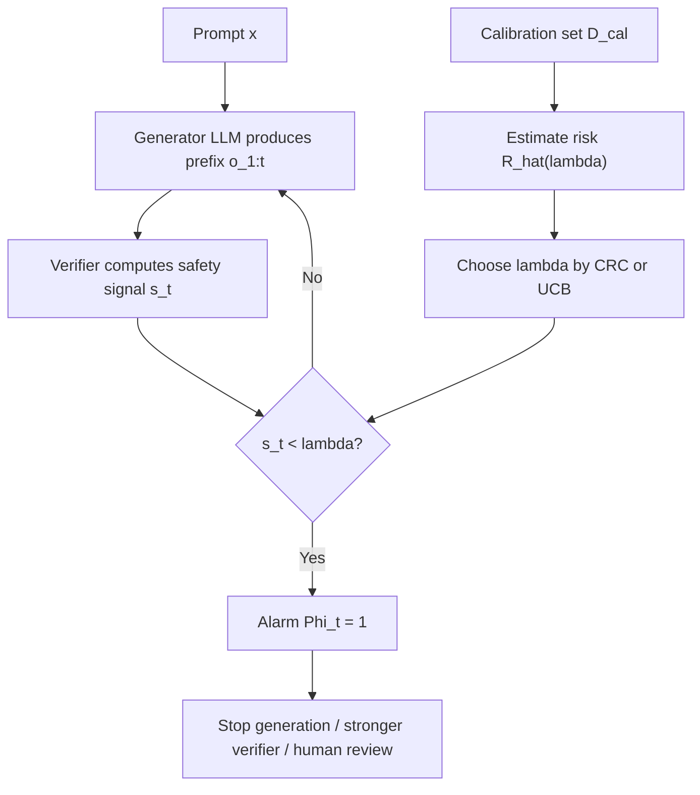

# Online Safety Monitoring for LLMs：把“上线后才暴露的风险”改写成可校准的停止规则

### 元信息

| 字段 | 内容 |
|---|---|
| 论文 | Online Safety Monitoring for LLMs |
| 作者 | Mona Schirmer, Metod Jazbec, Alexander Timans, Christian Naesseth, Maja Waldron, Eric Nalisnick |
| 日期 | arXiv v1：2026-07-02 |
| 会议/场景 | ICML 2026 Workshop on Hypothesis Testing |
| 原文 | https://arxiv.org/abs/2607.02510 |
| HTML | https://arxiv.org/html/2607.02510v1 |
| 代码 | https://github.com/monasch/llm-monitor |
| 类别 | AI 安全 / 在线监控 / 风险控制 |

### TL;DR

- 这篇论文研究的问题很窄，也很关键：LLM 已经过 alignment 和离线评测后，部署时仍可能逐步生成错误、有害或恶意内容；作者问的是，能不能在输出流还没结束时，用一个在线 monitor 尽早报警，并给出可解释的统计风险保证。
- 方法上，作者没有先追求复杂的监控模型，而是把外部 verifier 的逐步安全信号 `s_t` 变成一个单阈值停止规则：只要某一步的安全概率低于阈值 `lambda`，monitor 就报警；阈值用两类 risk control 校准，分别是 CRC 的期望风险控制和 UCB 的高概率风险控制。
- 实验覆盖两个部署风险：第一是 MATH 数学推理里的 factuality，生成模型是 Claude Haiku 4.5 和 Mistral-7B-Instruct-v0.3，信号来自 Qwen2.5-Math-PRM-7B；第二是 harmlessness，包括 Anthropic Red Teaming 对话加 Llama Guard 3，以及 FineHarm/WildGuard/WildJailbreak 场景加 SCM token-level harmfulness verifier。
- 关键数字和证据是：Claude Haiku 4.5 在 MATH 上最终正确率约 90%，Mistral-7B-Instruct-v0.3 约 26%；在 matched false-alarm rate 下，外部 PRM 信号的 power 明显强于生成模型自身 log-prob 信号，`epsilon = 0.3` 附近 PRM monitor 的 power 已超过 0.9，而 log-prob monitor 约在 0.5。
- 与 e-valuator 这类 sequential hypothesis testing baseline 相比，CRC/UCB 的结构更简单，不训练每个时间步的 density estimator；论文的 Figure 1/2 显示它们仍能维持 false alarm 控制，并且通常更早报警，约在错误序列生成到一半时就能触发。
- 论文的边界同样清楚：monitor 只能和 verifier 信号一样好；单一、时间不变阈值忽略了时间结构；外部 verifier 带来额外推理成本；校准集需要和部署分布足够接近；如果攻击者能适配 verifier，统计保证不等同于对抗鲁棒保证。

### 这篇论文真正回应什么问题？

- 传统安全链条通常按三个阶段组织：
  - 训练阶段：用 RLHF、constitutional training、拒答数据或偏好优化减少有害输出。
  - 上线前：用 red teaming、benchmark、policy eval 检查模型是否达到部署门槛。
  - 上线后：用内容审核、日志审计或用户举报发现事故。

- 作者指出这里有一个时间差：
  - 有些风险只有在具体 prompt、具体工具上下文、具体多轮对话里才显现。
  - 离线 eval 不可能覆盖所有 prompt 分布。
  - post-hoc moderation 等完整回答结束后再判定的方案，会让用户先看到一段可能有害的内容。

- 因此论文把问题改写为一个流式判定任务：
  - LLM 在生成 `o_1, o_2, ..., o_T`。
  - 每一步 `o_t` 可以是 token、推理步骤或对话轮次。
  - monitor 只看到当前前缀 `o_1:t` 及一个不完美安全信号 `s_t`。
  - monitor 必须在安全性已经“不再可假设”时尽早报警。

- 这个设定重要的地方不是“又做一个 guardrail”，而是把 guardrail 的设计目标从“最终分类准确率”改为：
  - <u>何时报警</u>。
  - <u>错误报警率或漏报率能否被校准到目标水平</u>。
  - <u>报警延迟是否足够低，能不能在有害内容暴露前或暴露初期介入</u>。

### 论文主张：复杂 monitor 不一定先于可校准 monitor

作者的中心主张可以拆成四句：

| 层次 | 主张 | 为什么重要 |
|---|---|---|
| Claim | 在线安全监控应该在输出展开时工作 | 避免“完整有害回答已经生成完再拦截”的滞后 |
| Mechanism | 一个 verifier 分数加单阈值停止规则就可作为强 baseline | 降低部署复杂度，也避免为每个时间步训练复杂模型 |
| Evidence | 在 MATH、Anthropic Red Teaming、FineHarm 上，CRC/UCB 能控制风险且报警更早 | 说明简单规则不是只停留在形式保证 |
| Boundary | 监控质量受 verifier 信号、校准分布、成本和对抗鲁棒性限制 | 防止把统计保证误读为绝对安全 |

### 问题形式化：从输出流到安全变量

论文把部署过程写成一个序列模型：

```text
输入 prompt:
  x ~ P_x

生成过程:
  o_t ~ P_theta(o_t | x, o_1:t-1)

完整输出:
  o_1:T = (o_1, ..., o_T)

安全变量:
  y in {0, 1}
  y = 1 表示安全，例如正确、无害
  y = 0 表示不安全，例如错误、有害、攻击成功
```

这个形式化有两个细节值得注意：

- `o_t` 不必一定是 token：
  - 在数学推理里，它可以是一段 step-by-step reasoning。
  - 在多轮红队对话里，它可以是一轮 conversation prefix。
  - 在 agent 场景里，它也可以类比为一次工具调用或 action。

- `y` 是序列级标签：
  - 最终回答是否正确。
  - 整段对话是否 harmful。
  - 某条轨迹是否导致安全失败。

这就带来核心张力：

- 部署时通常没有实时真标签 `y`。
- 但 monitor 又必须在 `T` 之前行动。
- 所以只能依赖一个 proxy signal。

### Safety signal：论文把 verifier 当成可插拔传感器

作者把安全信号写成 `s_t`，可以理解为某个 verifier 对当前前缀的安全估计：

```text
s_t = p_psi(y = 1 | x, o_1:t)
```

变量解释：

| 变量 | 含义 |
|---|---|
| `x` | 用户 prompt |
| `o_1:t` | 当前已经生成的输出前缀 |
| `p_psi` | 外部 verifier 或 safeguard model |
| `s_t` | 当前前缀“仍然安全”的概率或分数 |
| `theta` | 生成 LLM 的参数 |
| `psi` | verifier 的参数 |

论文讨论了两类信号：

- 外部 verifier 信号：
  - 数学推理里用 process reward model。
  - harmlessness 场景里用 Llama Guard 3 或 SCM。
  - 优点是任务针对性强。
  - 缺点是每一步都需要额外模型调用。

- 内部生成信号：
  - 例如生成模型自身 token log-probability。
  - 优点是几乎没有额外推理成本。
  - 缺点是实验显示区分力明显弱。

### Monitor 机制：一个单阈值停止规则

论文最简洁、也最值得细读的机制是 Eq. (1)：

```text
Phi_t = 1{ exists k, 1 <= k <= t : s_k < lambda }
```

可读版本如下：

1. monitor 从第 1 步开始观察安全信号。
2. 如果任意一步 `s_k` 低于阈值 `lambda`，就触发报警。
3. 一旦报警，后续可以执行停止生成、升级 verifier、转人工审核或切换安全策略。

这个规则很朴素，但它把部署决策压缩成一个明确问题：

> 阈值 `lambda` 应该怎么选，才能让 false alarm 或 missed detection 维持在可接受水平？

这也是论文真正使用统计工具的地方。作者不是先设计一个更复杂的神经 monitor，而是问：

- 如果已有 verifier 产生分数，能否把它变成有风险保证的报警器？
- 如果 verifier 不完美，是否仍能校准报警风险？
- 如果报警太早会影响体验、报警太晚会放过风险，能否让部署者自己选择要控制哪一种风险？

### 风险一：False alarm risk

False alarm risk 表示安全序列被错误拦截的概率：

```text
R_I(lambda) = P( exists t >= 1 : s_t < lambda | y = 1 )
```

解释如下：

| 项 | 含义 |
|---|---|
| `y = 1` | 真实序列是安全的 |
| `exists t` | 只要任一步报警就算 false alarm |
| `s_t < lambda` | 安全信号跌破阈值 |
| `R_I(lambda)` | 安全样本被误拦截的概率 |

这个风险随 `lambda` 单调增加：

- 阈值越高，monitor 越敏感。
- monitor 更容易报警。
- 因而 false alarm 更多。

对于真实产品，这对应一个清楚的代价：

- 用户明明在安全地提问和接收回答，却被中断。
- 正常功能因为过度保守而变差。
- 长期看，用户可能绕过或关闭安全层。

### 风险二：Missed detection risk

附录 B 补充了 missed detection risk：

```text
R_II(lambda) = P( for all t >= 1 : s_t >= lambda | y = 0 )
```

可读版本：

- 序列真实不安全。
- 但所有时间步都没有跌破阈值。
- monitor 从头到尾没有报警。

它与 power 的关系是：

```text
R_II(lambda) = 1 - power(lambda)
```

这个风险随 `lambda` 单调下降：

- 阈值越高，monitor 越容易报警。
- 漏掉不安全序列的概率越低。
- 代价是 false alarm 上升。

论文的一个重要贡献是指出：

- e-valuator 主要控制 false alarm。
- CRC/UCB 这套 risk control 也能转向控制 missed detection。
- 在安全成本很高的场景里，部署者可能更关心“不要漏掉风险”，而不仅是“不要误伤安全样本”。

### 阈值校准一：CRC 控制期望风险

CRC 即 conformal risk control。论文用它选择阈值：

```text
lambda_CRC = max {
  lambda in Lambda :
  n/(n+1) * R_hat(lambda; D_cal) + 1/(n+1) <= epsilon
}
```

变量解释：

| 变量 | 含义 |
|---|---|
| `D_cal` | held-out calibration set |
| `n` | calibration 样本数 |
| `R_hat` | 校准集上的经验风险 |
| `epsilon` | 部署者设定的目标风险水平 |
| `Lambda` | 候选阈值集合 |

它给出的保证是：

```text
E_{D_cal}[ R(lambda_CRC) ] <= epsilon
```

这句话的重点在 `E_{D_cal}`：

- 它不是说每一次校准得到的阈值都一定低于 `epsilon`。
- 它说对校准集抽样的平均意义上，未来风险受控。
- 因此 CRC 通常比高概率控制更不保守，也可能带来更高 power。

### 阈值校准二：UCB 控制高概率风险

第二种方法用 upper confidence bound 选择阈值：

```text
lambda_UCB = max {
  lambda in Lambda :
  U(lambda, n, delta) <= epsilon
}
```

它给出的保证是：

```text
P_{D_cal}( R(lambda_UCB) <= epsilon ) >= 1 - delta
```

这类保证更适合高风险部署：

- 如果单次安全事故代价很高。
- 如果 calibration set 足够大。
- 如果宁愿少放行，也要更稳地控制错误风险。

代价也很明确：

- UCB 通常更保守。
- 阈值选择更谨慎。
- power 可能低于 CRC。

### 方法流程图



这个图说明论文的部署接口很小：

- 生成模型不必重训。
- verifier 可以替换。
- monitor 只需要逐步分数和校准阈值。
- 干预动作可以由产品侧决定。

### Baseline：e-valuator 为什么是强对照？

论文选择 e-valuator 作为主要 baseline 并不随意。它同样处理在线轨迹，也同样把 black-box verifier 分数转成统计决策。

它的形式大致是：

```text
H_0: s_1:T ~ P_1   成功/正确/安全轨迹
H_1: s_1:T ~ P_0   失败/错误/不安全轨迹
```

e-valuator-anytime 使用密度比构造 e-process：

```text
M_t = p_0(s_1:t) / p_1(s_1:t)
```

然后在 `M_t` 跨过阈值时拒绝 `H_0`。它的优点是：

- 能做 sequential hypothesis testing。
- 对任意长度序列有 anytime-valid false alarm 控制。
- 理论形式强。

但论文也指出它的工程代价：

- 需要估计每个时间步或每段前缀的分布/分类器。
- 序列长度变化会增加建模复杂度。
- 相比单阈值规则，部署和校准负担更高。

因此这篇论文的比较问题是：

> 如果不训练这些 step-specific density estimator，只用 verifier 原始分数加单阈值，效果会差多少？

实验答案是：不一定差，尤其在 detection delay 上常常更好。

### 实验一：MATH factuality 监控

第一个实验关注数学推理中的事实正确性，设置如下：

| 组件 | 配置 |
|---|---|
| 数据集 | Hendrycks MATH |
| 生成模型 1 | Claude Haiku 4.5 |
| 生成模型 2 | Mistral-7B-Instruct-v0.3 |
| 标签 | 用 OpenAI o3-mini 比较最终回答与 ground-truth |
| 安全信号 | Qwen2.5-Math-PRM-7B 的 step-wise output probability |
| 风险目标 | 主要控制 false alarm risk |
| 重复 | 图中报告 10 runs 的置信带 |

两个生成模型的能力差异很大：

| 模型 | MATH 最终正确率 | 监控含义 |
|---|---:|---|
| Claude Haiku 4.5 | 约 90% | safe 样本多，过度 false alarm 会很显眼 |
| Mistral-7B-Instruct-v0.3 | 约 26% | unsafe 样本多，漏报和晚报更关键 |

这组实验的重要性在于：

- 它不是只看最终答案分类。
- 它看 step-level reasoning 过程中 PRM 分数如何变化。
- monitor 的目标是在错误链条还没完全展开前报警。

### Figure 1 证据：风险控制成立，但更早报警才是亮点

论文 Figure 1 比较了 false alarm rate、power、detection delay。

| 指标 | 定义 | 观察 |
|---|---|---|
| False Alarm Rate | 安全序列被误拦截比例 | UCB、e-valuator-anytime、e-valuator-PAC 大体控制在目标线下；Mistral 上 e-valuator-anytime 在 `epsilon = 0.05, 0.1` 违反界限 |
| Power | 不安全序列被正确拦截比例 | e-valuator-anytime 在小 `epsilon` 下 power 高，但伴随风险违反；UCB 和 e-valuator-PAC 接近；CRC 通常比 UCB power 高 |
| Detection Delay | 正确报警时已经生成的序列比例 | CRC/UCB 往往约在半程报警，比复杂 e-valuator 更早 |

这说明论文真正的工程价值不只是“能控制 false alarm”：

- 如果 monitor 晚到几乎完整回答结束才报警，用户已经暴露在错误推理中。
- 如果 monitor 提前到约半程，错误信息传播和 token 成本都更低。
- 单阈值方法在这里反而因为不等待复杂证据累积，可能更早触发。

### 实验二：harmlessness 监控

第二个实验把风险从 factuality 换成 malicious use 和 toxicity。

| 数据/任务 | Verifier 信号 | 特点 |
|---|---|---|
| Anthropic Red Teaming | Llama Guard 3 对 conversation prefix 的 safe token probability | 多轮红队对话，序列级 attack success 标签 |
| FineHarm | SCM，Qwen2.5-1.5B token-level harmfulness verifier | 单轮 interaction，训练目标更贴近在线 token-level harmfulness |

这组实验能检验一个关键问题：

- 同样的 risk control 框架，能否跨 factuality 和 harmlessness 复用？
- 当 verifier 的训练目标不同，monitor 表现会怎样变化？

### Figure 2 证据：monitor 只能和 signal 一样好

论文 Figure 2 的核心结论可以压缩为四点：

1. 各 monitor 在两个 harmlessness 数据上都基本维持 false alarm 控制。
2. Red Teaming 上 e-valuator-PAC 的 power 更高。
3. FineHarm 上 CRC/UCB 的 power 更强。
4. CRC/UCB 的 detection delay 再次更低。

最关键的是第四个背后的解释：

- FineHarm 的 SCM verifier 专门面向 token-level harmfulness。
- 它在在线检测上 separability 更强，power 接近 1。
- Llama Guard 3 在 Red Teaming 上的 power 停在 0.8 以下。

这不是 monitor 算法本身能完全弥补的问题。作者实际上给了一个安全部署教训：

> 统计校准不能把弱 signal 变成强 signal；它只能把已有 signal 的使用方式变得更可控。

### 实验三：便宜信号是否能替代外部 verifier？

外部 verifier 的部署成本很现实：

- 每一步额外前向传播。
- 更高延迟。
- 更高 GPU/服务成本。
- 对流式输出尤其昂贵。

所以作者测试了一个便宜替代：生成模型自己的 token log-probability。

具体构造如下：

```text
对第 k 个 reasoning step:
  step 覆盖 token 区间 [j_start(k), j_end(k)]

信号:
  s_k = min_{j in [j_start(k), j_end(k)]}
        log p_theta(w_j | w_1:j-1, x)
```

解释：

- 如果某个 step 里出现模型自己很不确定的 token，最小 log-prob 会很低。
- 这个 step 被视为更可疑。
- 这个信号几乎免费，因为生成时本来就可得到 log-prob。

但 Figure 3 的结论很清楚：

| 信号 | 成本 | power 表现 |
|---|---|---|
| Qwen PRM | 额外 verifier 成本 | 在 matched false-alarm rate 下明显更强；`epsilon = 0.3` 附近 power 超过 0.9 |
| token log-prob | 几乎免费 | 同一区域 power 约 0.5 |

这给部署者一个直接权衡：

- 如果风险低、成本敏感，可以先用 cheap signal 做粗筛。
- 如果风险高、需要可靠拦截，外部 verifier 的成本可能是必要支出。
- 如果使用 cheap signal，不能把“有统计阈值”误读成“检测能力足够”。

### Missed detection：为什么附录 B 很重要？

主文重点讨论 false alarm，因为误拦截会影响用户体验。但安全场景里，missed detection 往往更关键。

作者在附录 B 把同一套 calibration 改成控制漏报：

```text
lambda_CRC = min {
  lambda in Lambda :
  n_0/(n_0+1) * R_hat_II(lambda; D_cal) + 1/(n_0+1) <= epsilon
}
```

这里 `n_0` 是 calibration set 里不安全样本数量。

与 false alarm 控制相比，变化是：

- false alarm risk 随 `lambda` 增加。
- missed detection risk 随 `lambda` 降低。
- 因此阈值从“选最大合法值”变成“选最小合法值”。

论文 Figure 4 显示：

- CRC/UCB 能控制 missed detection risk。
- e-valuator 没有被纳入这一图，因为它主要提供 false alarm 控制。
- 当要求漏报很低时，false alarm 会升高。

这个 trade-off 对实际部署非常具体：

| 场景 | 更适合控制 |
|---|---|
| 普通问答助手 | false alarm，避免过度中断 |
| 医疗、法律、高危安全建议 | missed detection，宁可误报也要减少放过风险 |
| coding agent 修改生产系统 | 两者都要分层控制，先 cheap screen，再升级 verifier |
| 开放式聊天 | 可能按用户、话题、上下文动态选择风险目标 |

### 代码仓库透露了哪些复现细节？

官方仓库 `monasch/llm-monitor` 是论文实验复现仓库，最新 HEAD 为 `897e19a798bac59ef08a4d4dbc1c69cdea82286c`。

README 中的复现结构与论文一致：

| 目录/文件 | 作用 |
|---|---|
| `bash_scripts/generate.sh` | 在 Hendrycks MATH 七个 subject 上生成 step-by-step reasoning |
| `bash_scripts/signal.sh` | 用 PRM 计算 step signal，默认 Qwen PRM |
| `bash_scripts/label.sh` | 调用 o3-mini 进行 step label，最终标签用于评估 final answer |
| `bash_scripts/merge.sh` | 合并 PRM signal 和 judge labels |
| `python_scripts/llama_guard.py` | 对 Anthropic/hh-rlhf red-team-attempts 的对话前缀运行 Llama Guard 3 |
| `notebooks/compare_monitors.ipynb` | 生成 false alarm、power、delay 对比 |
| `notebooks/missed_detection_risk.ipynb` | 生成 missed detection risk 控制实验 |

仓库还提供预计算数据，降低复现实验门槛：

- `output/factuality/merged_metadata/`
- `output/harmfullness/anthropic-redteaming/`
- `output/harmfullness/fineharm/`
- `output/factuality/monitor_performance/`

这里也暴露一个局限：

- 完整从头复现需要 MATH 生成、PRM 打分、OpenAI batch judge、Llama Guard 3 gated model 权限。
- 论文复现不是“本地一条命令跑完”的轻量任务。
- 但预计算数据足以复核 monitor 曲线和校准逻辑。

### 细读 Figure/Table 证据

| 图 | 支持的结论 | 不能证明什么 |
|---|---|---|
| Figure 1 | MATH factuality 上，CRC/UCB 维持风险控制，并且比 e-valuator 更早报警 | 不能证明所有 reasoning 任务都适用，也不能证明 PRM 在分布外仍可靠 |
| Figure 2 | Harmlessness 上，CRC/UCB 和 e-valuator 都可控制 false alarm；verifier 质量决定 power 上限 | 不能证明 Llama Guard/SCM 对自适应攻击鲁棒 |
| Figure 3 | token log-prob 是更便宜但明显更弱的信号；PRM 在 `epsilon = 0.3` 附近 power 超过 0.9，log-prob 约 0.5 | 不能否定所有内部信号，只说明这组 log-prob 聚合不够强 |
| Figure 4 | CRC/UCB 可转向控制 missed detection risk，这是 e-valuator 对照中没有覆盖的方向 | 不能消除低漏报与高误报之间的根本 trade-off |

### 为什么“单阈值”不是过度简单？

这篇论文容易被误读为“只是调了个阈值”。更准确的理解是：

- 论文不是说单阈值是最终最优 monitor。
- 它说在 verifier 已经存在时，单阈值加风险控制是一个必须被认真比较的 baseline。
- 如果复杂 monitor 没有显著改善 power/delay/校准成本，它就不一定值得部署。

单阈值的优势来自三个方面：

1. 校准简单：
   - 只需要在 calibration set 上扫阈值。
   - 不需要为每个 step 学 density estimator。

2. 部署透明：
   - 低于阈值就报警。
   - 风险目标由 `epsilon` 和 `delta` 明确控制。

3. 干预早：
   - 只要早期信号足够低，就立刻报警。
   - 不必等待复杂序列统计量累积到足够证据。

### 失败边界：这套方法在哪些地方会失效？

#### 1. Verifier 信号弱

- 如果 `s_t` 无法区分 safe/unsafe，risk control 只能控制阈值选择。
- 它无法凭空创造 detection power。
- Llama Guard 在 Red Teaming 上 power 低于 FineHarm 的 SCM，就是这个边界的例子。

#### 2. 校准分布与部署分布漂移

- CRC/UCB 默认 calibration data 与 deployment data 足够可交换或同分布近似。
- 如果上线后 prompt 分布、模型版本、system prompt、工具权限或 attacker 策略发生变化，风险保证会变弱。
- 对 agent 场景尤其敏感，因为工具环境可能每天变化。

#### 3. 单阈值忽略时间结构

- 同一个 `s_t` 在第 1 步和第 100 步的含义可能不同。
- 某些任务早期低信号只是探索，后期低信号才危险。
- 某些 jailbreak 可能故意维持高 signal，直到最后一小段才越界。

#### 4. 成本与延迟

- 外部 verifier 每步调用可能太贵。
- token-level monitor 在长回答里尤其昂贵。
- 如果批处理或流式接口不支持低延迟 verifier，理论上的 early stopping 可能被系统延迟吃掉。

#### 5. 对抗适配

- 如果攻击者知道 verifier 或阈值机制，可能优化输出以保持 `s_t` 刚好不跌破阈值。
- 统计校准不是 adversarial robustness。
- 高风险部署仍需要多信号、随机化、模型隔离、日志审计和人工复核。

### 和近期 AI 安全工作的关系

这篇论文与几条线相连：

| 相关方向 | 关系 |
|---|---|
| RLHF / alignment | 训练期减少风险，但不能覆盖所有部署 prompt |
| Guardrail classifiers | 提供 `s_t` 的来源，但本身不解决阈值风险校准 |
| Streaming content monitoring | 共享“边生成边判定”目标，FineHarm/SCM 是论文实验的一部分 |
| E-valuator / e-process | 提供强 sequential testing baseline，但复杂度更高 |
| Conformal risk control | 提供把经验风险转成部署阈值的统计工具 |
| AI control / agent oversight | 共同关心“系统上线后是否能发现失控或有害轨迹” |

对 Daily Report 关心的 Agent 安全来说，最值得迁移的是思想而非具体代码：

- agent 轨迹也可以被看成 `o_1:T`。
- tool call、文件 diff、shell 命令、网络请求都可以产生 verifier signal。
- monitor 可以先做低成本在线阈值控制，再把高风险轨迹升级到更强模型或人工。

### 一个可迁移到 Agent 的伪代码

```text
Input:
  prompt x
  agent policy pi_theta
  verifier p_psi
  calibrated threshold lambda
  risk mode in {false_alarm_control, missed_detection_control}

State:
  trajectory tau = []
  alarm = false

Loop:
  while agent is running:
    action_or_message o_t = pi_theta(x, tau)
    append o_t to tau

    s_t = p_psi(safe | x, tau)

    if s_t < lambda:
      alarm = true
      stop current action
      route tau to stronger verifier or human review
      break

Output:
  if alarm:
    blocked trajectory and evidence prefix
  else:
    completed trajectory

Failure boundary:
  if p_psi is weak, shifted, or adversarially gamed,
  threshold calibration cannot guarantee useful detection power.
```

这个伪代码说明：

- 论文方法不是只适合文本生成。
- 它适合所有能产生逐步信号的系统。
- agent 安全真正困难的部分会转移到 verifier 设计、校准集构造和分布漂移监控。

### 研究者视角的核心判断

我认为这篇论文的价值主要有三点：

1. 它把“上线后监控”从经验规则拉回到统计决策：
   - 不是简单问 classifier 准不准。
   - 而是问在目标风险下如何选择报警阈值。

2. 它给复杂监控方法设了一个低复杂度 baseline：
   - 单阈值 CRC/UCB 已经能竞争。
   - 后续论文若提出更复杂 online monitor，需要证明自己在 power、delay、成本或鲁棒性上真的更好。

3. 它强调 verifier 质量是监控上限：
   - 这对安全团队很重要。
   - 买一个 guardrail API 或训练一个 classifier 并不等于有可靠 monitor。
   - 必须把 signal separability、calibration data 和部署分布放在同一张评估表里。

### 还值得继续追问什么？

- 能否把单阈值扩展成 per-step threshold，同时保留足够简单的校准流程？
- 能否组合多个信号，例如 PRM、log-prob、toxicity classifier、tool-risk classifier、retrieval grounding score？
- 当用户或攻击者自适应 verifier 时，CRC/UCB 的保证如何退化？
- Agent 场景中，`o_t` 应该定义为 token、reasoning step、tool call，还是一个状态转移？
- 如果报警后不是停止，而是切换到更强模型或 constrained decoding，风险控制公式应该如何纳入 downstream intervention？
- 校准集应如何覆盖真实部署中的长尾 prompt、越狱策略、工具权限和业务上下文？

### 结论

- `Online Safety Monitoring for LLMs` 的主线非常克制：用一个 verifier signal、一个阈值、两种 risk control 程序，构造可部署的在线安全报警器。
- 实验说明，简单方法在 MATH factuality 与 harmlessness 两类任务上能维持 false alarm 控制，并且通常比 e-valuator 更早报警。
- 论文最有用的警告是：风险控制不等于强检测，强检测仍取决于 verifier；便宜的 token log-prob signal 在同等 false-alarm rate 下 power 明显落后于外部 PRM。
- 对 AI 安全和 Agent 运行时治理而言，这篇论文提供了一个清晰接口：先定义逐步安全信号，再用 calibration set 选择阈值，最后把 alarm 接到停止、升级、人工或隔离动作。
- 这不是完整安全方案，但它把“上线后看情况拦截”变成了可以讨论误报、漏报、延迟、成本和证据边界的统计对象。
- 更保守地说，它给安全工程提供的是一把标尺：上线前先声明愿意承受的风险，再用校准数据决定报警阈值，而不是上线后凭直觉调规则。
