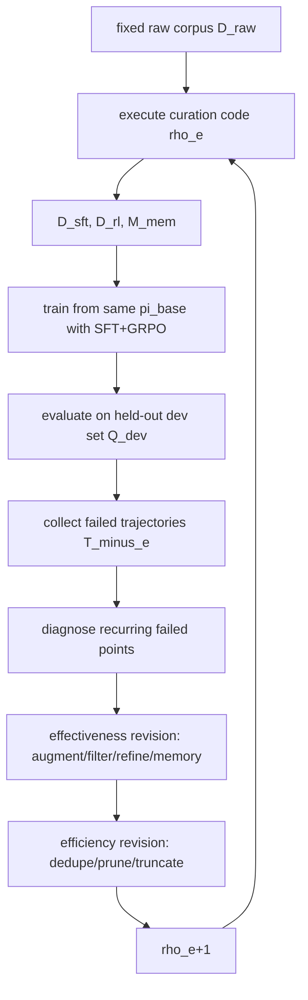

# CurateEvo：让 Agent 后训练的数据策展自己进化

**原文**：[CurateEvo: Data-Curation Evolving for Agentic Post-Training](https://arxiv.org/abs/2607.06140)

**时间**：arXiv v1，2026-07-07 11:07:00 UTC

**类别**：大模型后训练 / Agentic post-training / 数据策展

### TL;DR

- **这篇论文关心什么**：LLM Agent 的后训练越来越依赖环境反馈，但很多流程仍把数据策展当成固定预处理；作者认为这会造成两类问题：只会扩增、不善过滤和修正，以及无法随下游任务失败模式自适应。
- **核心方法**：CurateEvo 把数据策展策略写成可执行代码 `rho`，每个 evolution epoch 都用 held-out dev set 上的失败轨迹诊断 failure mode，再重写策展代码，生成三类资源：SFT 数据、RL 数据和推理时 memory bank。
- **优化目标**：作者把问题写成 `J(rho)=P(rho)-lambda C(rho)`；`P` 是用策展后资源训练出的 Agent 在 dev set 上的表现，`C` 是训练 turn 成本，主流程先修复有效性，再做成本感知剪枝。
- **实验设置**：基础模型是 Qwen3-4B，固定 SFT+GRPO recipe；训练语料分为 labeled trajectories 和 wild user trajectories 两种，测试在 ACEBench-Agent、BFCL-V4、tau2-Bench 上完成。
- **关键结果**：CurateEvo 在 labeled / wild 设置中分别比最强已有数据策展 baseline 平均高 **3.2 / 2.7 分**；和不同后训练 recipe 结合时，平均增益达到 **21.3 分**。
- **消融证据**：去掉 effectiveness revision 平均掉约 7 分，是最大损失；去掉 efficiency revision 也稳定下降；去掉 SFT、RL 或 memory 任一资源都会降分，说明三者互补。
- **效率证据**：每 1K retained training turns 的策展开销约 **0.51M tokens / 405 秒**，比 prior baselines 平均低约 **48% token / 50% wall-clock**。
- **局限**：论文把 curation code evolution 建立在 dev failures 上，仍需额外验证不同 dev/test 分布差距、LLM 重写代码的稳定性、failure diagnosis 的可复现性，以及是否会把 benchmark 特定模式写进 memory。

### 研究问题：为什么 Agent 后训练不能只靠“更多轨迹”？

- Agentic post-training 与普通指令微调不同：
  - 轨迹更长，奖励更稀疏。
  - 同一个任务可能包含观察、工具选择、参数绑定、错误恢复、终止判断。
  - 失败往往不是某一步语法错，而是跨 turn 的状态绑定、工具 schema、memory 使用和 recovery 策略同时失效。

- 作者把已有数据策展方法的不足概括成两点：

| 问题 | 论文中的含义 | 对 Agent 后训练的影响 |
|---|---|---|
| Curation Neglect | 只强调扩增数据，不同时过滤、修正、剪枝 | 低质量轨迹、冗余 turn、错误工具调用会进入 SFT/RL，稀释有效梯度 |
| Adaptation Rigidity | 策展流程固定，不能根据下游 dev failures 改变 | 新任务的失败模式出现后，pipeline 仍按旧规则处理数据 |

- 这篇论文真正提出的问题不是“怎样再合成更多 agent data”，而是：
  - **能不能让数据策展流程像 policy 一样被反馈优化？**
  - **能不能让失败轨迹改变数据进入 SFT、RL、memory 的方式？**
  - **能不能在提高性能的同时减少训练 turn 成本？**

### 论文主张与论证路线

| Claim | Mechanism | Evidence | Boundary |
|---|---|---|---|
| 数据策展应当动态适应 Agent 失败 | 用 dev failed trajectories 诊断 failure mode，再重写 curation code | Table 1：三项 benchmark 上均超过已有方法 | 依赖 dev set 是否代表 test failure |
| 策展对象不只是训练集，还包括 memory | `rho(D_raw)` 同时输出 `D_sft`、`D_rl`、`M_mem` | Table 2：去掉 memory 后 labeled/wild 都下降 | memory 可能带入任务族特定提示，需防过拟合 |
| 有效性和效率要一起优化 | `J(rho)=P(rho)-lambda C(rho)`；先 effectiveness，再 efficiency | Figure 3/5：中等 `lambda=0.3` 最优，开销下降 | `lambda` 是经验设定，不一定跨数据集稳定 |
| 策展可与后训练 recipe 解耦 | 固定或替换 GRPO、AgentGym-RL、ProRL-Agent，策展资源仍可复用 | Table 3：平均增益 21.3 | 只在 Qwen3-4B 和选定 recipe 上验证 |

### 方法机制：把数据策展策略表示成可执行代码

论文把原始语料记为 `D_raw`，策展策略记为 `rho`：

```text
rho: D_raw -> (D_sft_rho, D_rl_rho, M_mem_rho)
```

- `D_sft_rho`：用于稳定格式、工具调用、恢复模式的监督微调数据。
- `D_rl_rho`：用于 GRPO 等强化学习阶段的 trajectory / group 数据。
- `M_mem_rho`：推理阶段可检索的 memory bank，保存不适合直接写入参数的任务族知识、工具 schema、状态约束。

训练时，策略从固定基础模型出发：

```text
pi_rho = TrainSFT+GRPO(pi_base, D_sft_rho, D_rl_rho)
```

推理时，模型还读取 memory：

```text
a_t ~ pi_rho(. | q, o_<=t, a_<t, Retrieve(q, M_mem_rho))
```

这个定义的意义在于：

- 作者没有把 CurateEvo 做成新的 RL 算法。
- 作者也没有修改 Agent interaction workflow。
- 它把“数据如何被选、改、分配、剪枝、记忆化”变成优化对象。

### 核心循环：失败轨迹怎样驱动代码进化？

每个 evolution epoch 中，CurateEvo 大致执行以下流程：



- 失败轨迹记为：

```text
T^-_e = { tau^e_i | q_i in Q_dev, y^e_i = 0 }
```

- 每条轨迹包含：
  - 用户任务 `q_i`
  - 检索到的 memory `m_i`
  - 每个 turn 的 observation/action
  - benchmark reward 或 score
  - 成功标记 `y_i`
  - evaluator explanation、tool error、environment diagnostic 等辅助反馈

- evolution agent 的第一步不是直接改模型，而是抽取 failure modes，例如：
  - 工具选择错误。
  - 参数 grounding 错误。
  - 多 turn planning 弱。
  - tool error 后重复失败动作。
  - memory mismatch。
  - noisy supervision。

### 公式：有效性项与成本项如何一起工作？

CurateEvo 的目标函数写作：

```text
rho_{e+1} = arg max_{rho in G(rho_e, T^-_e, Sigma_e)} J(rho)

J(rho) = P(rho) - lambda C(rho)
```

变量解释：

| 符号 | 含义 | 作用 |
|---|---|---|
| `P(rho)` | 用 `rho` 生成的数据训练 Agent 后的 dev performance | 鼓励覆盖失败模式，提高任务成功率 |
| `C(rho)` | normalized training-turn cost | 惩罚冗余、低效、过长轨迹 |
| `lambda` | 成本权重，主实验使用 0.3 | 控制性能和成本的折中 |
| `Sigma_e` | 当前策展数据的统计 profile | 包括数据规模、turn 分布、轨迹长度、冗余度 |

成本项定义为：

```text
Cost_train(rho) = sum_{z in D_sft_rho union D_rl_rho} l(z)

C(rho) = tanh( log(1 + Cost_train(rho)) / log(1 + N_ref) )
```

这里 `l(z)` 是一个训练样本保留的 interaction turns 数量，`N_ref` 用来稳定长尾轨迹长度带来的尺度差异。

### 为什么要先 effectiveness、再 efficiency？

- effectiveness revision 主要问：
  - 失败轨迹暴露了什么能力缺口？
  - 原始数据里有没有相关样本，只是需要过滤或重写？
  - 是否需要用 LLM 或模拟交互合成覆盖该 failure mode 的轨迹？
  - 哪些任务族知识应该写入 memory，而不是直接进 SFT/RL？

- efficiency revision 主要问：
  - 哪些轨迹重复覆盖同一失败模式？
  - 哪些 turn 很长但没有关键决策信号？
  - 哪些样本 noisy、malformed、容易误导 GRPO preference？
  - 哪些 rare failure 或 recovery step 必须保留？

- 这个顺序很重要：
  - 如果先剪枝，可能删掉本来能解释失败的少数轨迹。
  - 如果只扩增，不剪枝，又会让训练集变大、噪声变多。
  - 论文的路线是先让数据“对准失败”，再让数据“变得紧凑”。

### 实验设置：两个原始语料、三个 benchmark、固定 recipe

| 维度 | 论文设置 | 解读 |
|---|---|---|
| 基础模型 | Qwen3-4B | 用较小模型测试数据策展是否能弥补模型规模 |
| 主训练 recipe | SFT + GRPO | 固定 recipe，避免把收益混入算法变化 |
| evolution epochs | 3 | 主实验只进化 3 轮，后续分析显示前 3 轮收益最大 |
| labeled data | SWE-chat、AgentRewardBench、OpenHands-Feedback | 人工标注或较干净的 agent trajectories |
| wild data | reproducible-trajectories、claudeset-community、misc Claude Code traces | 真实用户交互轨迹，更 noisy |
| 测试 benchmark | ACEBench-Agent、BFCL-V4、tau2-Bench | 覆盖工具调用、多 turn、函数调用、状态跟踪 |

训练细节也体现作者想控制变量：

- LoRA rank 为 16，`lora_alpha=32`，`lora_dropout=0.05`。
- SFT 学习率 `2.5e-5`，最多 140 steps。
- GRPO 学习率 `5e-6`，`beta_KL=0.14`，ratio clip 为 0.05，advantage clip 为 1.4。
- 推理 temperature 为 0.0。

### 主结果：不是更大模型，而是更好的数据分配

Table 1 的核心结果可以压缩成三点：

| 设置 | CurateEvo 的结论 | 关键数字 |
|---|---|---|
| labeled data | 三个 benchmark 都是最好 | 比 strongest prior 平均高 3.2 |
| wild data | 在 noisy real trajectories 上仍然最好 | 比 strongest prior 平均高 2.7 |
| 模型规模比较 | Qwen3-4B + CurateEvo 超过若干 Qwen3-8B baseline | 说明数据策展可抵消部分规模差距 |

更具体地看：

- ACEBench-Agent：
  - 主要考察工具选择、参数填充、现实指令鲁棒性。
  - CurateEvo 的优势说明 failure-driven curation 改善了 tool schema 和 argument grounding。

- BFCL-V4：
  - 关注函数调用、multi-turn、hallucination、format sensitivity。
  - CurateEvo 的优势说明它不只是记住某个环境，而是提升了可迁移的工具调用正确性。

- tau2-Bench：
  - 双控制环境里，Agent 和模拟用户都有工具与局部观察。
  - CurateEvo 仍然提升，说明它对状态跟踪、用户协作、长期决策也有效。

### 消融：真正的主因是失败驱动的 effectiveness revision

Table 2 的信息量很大：

| 消融项 | 结果模式 | 说明 |
|---|---|---|
| 去掉 effectiveness revision | labeled/wild 都大幅下降，平均约 7 分 | 诊断失败并改写数据是主驱动 |
| 去掉 efficiency revision | 下降较小但稳定 | 剪枝不是只省成本，也会提升数据质量 |
| 去掉 SFT data | 两种设置都下降 | 基础格式、工具调用、恢复模式仍需监督稳定 |
| 去掉 RL data | 下降明显，尤其 tau2 | 长程决策与偏好对比需要 RL 信号 |
| 去掉 memory | 稳定下降 | 任务族知识和 schema hint 更适合检索，而非全塞参数 |

这组消融支持一个细分判断：

- SFT 负责把基本动作写稳。
- RL 负责在相似状态下区分好坏 next action。
- Memory 负责保存长尾工具、状态约束、任务族知识。
- 策展策略 `rho` 的价值在于把同一份 `D_raw` 拆给这三类资源，而不是简单留下或丢弃整条轨迹。

### Figure / Table 证据逐项解读

| 图表 | 支撑的论点 | 不能证明什么 |
|---|---|---|
| Figure 1 | 现有方法有 curation neglect 和 adaptation rigidity 两类缺陷 | 这是概念图，不是定量证据 |
| Figure 2 | CurateEvo 的闭环是 curation code evolution，不是直接改 policy | 不能单独证明 LLM 重写代码总是稳定 |
| Table 1 | 主性能优于已有 agent RL training-data 方法 | benchmark 范围有限，且都是作者选定设置 |
| Table 2 | effectiveness / efficiency / SFT / RL / memory 都有贡献 | 没有完全拆开每类 failure mode 的边际贡献 |
| Figure 3 | token 和 wall-clock 策展开销更低 | 只报告平均每 1K retained turns，不覆盖所有工程成本 |
| Table 3 | CurateEvo 可与 GRPO、AgentGym-RL、ProRL-Agent 兼容 | 仍需验证更多模型规模和训练 recipe |
| Figure 4 | 前 3 个 epoch 收益最大，后续趋于饱和 | 不保证其他 dev set 也是 3 轮最佳 |
| Figure 5 | `lambda=0.3` 在两种数据设置中表现最好 | `lambda` 不是理论最优，只是实验最优 |

### 最值得注意的失败模式

论文附录把进化过程中剩下的 Agent 失败归纳为三类：

| 失败模式 | 表现 | 为什么普通轨迹学习不够 |
|---|---|---|
| State Binding Drift | 使用过期 id、混淆订单/对象、丢失跨 turn 参数 | 轨迹级监督容易奖励局部合理动作，却不显式训练状态重绑定 |
| Adaptive Recovery Failure | tool error 后重复同一调用、过早停止、缺少 repair action | 成功轨迹展示的是 clean path，缺少失败恢复监督 |
| Grounded Execution Gap | 动作语法流畅但不受 evidence、memory、schema 或执行验证支持 | 许多样本强调输出格式，而不是 evidence-to-action 的验证链 |

这些失败模式解释了为什么 CurateEvo 要把 trajectory 分解成 decision-centric segments：

- 一条长轨迹里可能同时有：
  - 有价值的 recovery action。
  - benchmark 特定知识。
  - 冗余 observation。
  - 错误 tool call。
- 如果只做整条保留或整条丢弃，会丢掉关键 turn，或把噪声一起带入训练。

### 细读：三类资源为什么不能合并成一个训练集？

CurateEvo 最容易被误读成“自动清洗数据”。更准确的理解是：

- 它把一个 raw corpus 拆成三种用途。
- 它为每种用途设置不同保留标准。
- 它让 dev failures 决定下一轮拆分规则。

| 资源 | 适合保留什么 | 不适合保留什么 | 失败轨迹怎样影响它 |
|---|---|---|---|
| `D_sft` | 稳定格式、标准工具调用、清晰恢复步骤、可模仿的短决策片段 | 冗长探索、模棱两可目标、错误 tool schema | 如果失败集中在格式或基础参数，SFT 样本会增加相似正确示范 |
| `D_rl` | 相似状态下的正负对比、能产生清楚 reward 差异的决策点 | 没有可判别偏好的流水账、噪声标签、奖励解释不清的 turn | 如果失败集中在“下一步选择”，RL group 会更强调相邻动作差别 |
| `M_mem` | 工具签名、状态约束、任务族规则、长尾环境知识 | 应该内化成通用能力的动作格式、benchmark 答案泄漏 | 如果失败来自 memory mismatch，会重写检索 key 和 memory 条目 |

这三类资源的区别对 Agent 很关键：

- **把 memory 知识塞进 SFT**：
  - 模型可能记住某个 benchmark 的工具或任务族细节。
  - 换环境后，参数记忆反而会误导新工具调用。

- **把 recovery 行为只放进 memory**：
  - 推理时不一定命中相似 memory。
  - 模型的基础策略仍然不会在 tool error 后主动换路径。

- **把所有失败轨迹都放进 RL**：
  - 如果没有成组正负对比，GRPO 看到的只是噪声轨迹。
  - 奖励稀疏时，模型不容易知道关键失败发生在哪个 turn。

因此 CurateEvo 的主张更像是：

```text
同一份 raw trajectory 不是一个训练样本，
而是一组可被拆解、路由、压缩、记忆化的决策证据。
```

### 例子化理解：一次失败如何改变策展代码？

论文没有给完整真实代码 diff，但附录 prompt 和方法描述足够还原一个典型过程：

```text
Input:
  failed trajectory tau
  current curation code rho_e
  raw data schema
  curation profile Sigma_e

Failure diagnosis:
  failed_point = "tool argument grounded to stale entity id"
  evidence = "agent reused an old reservation id after environment returned a new active order"
  curation_hint = "select or synthesize state-rebinding turns; filter examples that call tools without latest observation support"

Effectiveness revision:
  add detector for stale id / active object mismatch
  extract decision segments where observation changes object bindings
  synthesize contrastive examples: old id call vs refreshed id call
  write memory rule: bind object id only from latest observation or verified memory

Efficiency revision:
  remove repeated observation-only turns
  keep the decisive rebind turn and recovery action
  discard malformed trajectories without clear active object

Output:
  rho_e+1, then regenerate D_sft, D_rl, M_mem
```

这个过程的意义在于：

- failure point 不只是评价文本。
- 它会落到数据选择、过滤、重写、去重和 memory construction 的程序逻辑中。
- 它把“Agent 为什么失败”转换成“下一轮训练数据怎样变化”。

### 数据设置细节：labeled 与 wild 的差异为什么重要？

论文刻意设置 labeled 和 wild 两条线，因为二者代表不同的数据风险：

| 数据设置 | 数据来源 | 主要优点 | 主要风险 | CurateEvo 要解决的问题 |
|---|---|---|---|---|
| labeled | SWE-chat、AgentRewardBench、OpenHands-Feedback | 轨迹更干净，监督意图更明确 | 覆盖范围可能窄，标注风格可能固定 | 在干净数据中找出更能迁移的决策片段 |
| wild | 真实用户交互轨迹与 Claude Code traces | 更接近真实 Agent 使用场景 | 噪声、重复、目标不清、工具环境不一致 | 从混乱数据中抽出有价值行为并压缩噪声 |

Wild data 上仍然提升 2.7 分，说明作者想证明：

- CurateEvo 不只是“锦上添花”的高质量数据排序器。
- 它也能处理真实交互日志里常见的混合质量问题。
- 对 Agent 后训练来说，真实日志的价值不是整条轨迹，而是其中少数关键决策、恢复动作和状态证据。

### Benchmark 逐项看：三个测试分别卡住什么能力？

| Benchmark | 主要测试点 | 和 CurateEvo 的关系 |
|---|---|---|
| ACEBench-Agent | 工具选择、参数填写、模糊指令下的鲁棒性 | 检验 SFT/RL 是否学会从自然语言目标绑定正确 tool schema |
| BFCL-V4 | 函数调用、multi-turn、hallucination、format sensitivity | 检验策展后数据是否减少 unsupported call 和格式漂移 |
| tau2-Bench | 用户与 Agent 双方都有工具和局部观察的长程互动 | 检验 memory、状态跟踪、协作式决策是否真正改善 |

这三个 benchmark 的组合有一个优点：

- ACEBench-Agent 更偏“工具是否用对”。
- BFCL-V4 更偏“函数调用是否可执行且格式正确”。
- tau2-Bench 更偏“长程对话状态能否保持”。

但它也有一个限制：

- 它们仍然都是离线或半模拟评测。
- 真实生产 Agent 还会遇到权限、审计、并发、用户撤销意图、不可逆写操作等问题。
- 因此 CurateEvo 的分数提升应被理解为 agent benchmark 上的数据策展证据，而不是生产可靠性的完整证明。

### 与“失败学习”相关工作的细微差别

CurateEvo 站在一条已有脉络上：

- 从成功轨迹学习。
- 从失败轨迹学习。
- 从环境反馈中筛选轨迹。
- 从在线 curriculum 中扩展任务。
- 从负样本或 critical steps 中提取决策信号。

它的区别在于：

| 方法族 | 常见优化对象 | CurateEvo 的不同点 |
|---|---|---|
| 失败轨迹 fine-tuning | 选取失败或修正后的样本 | 不只选样本，还改写策展程序 |
| online RL curriculum | 生成或选择下一批任务 | 固定 raw corpus，动态改变资源构造 |
| tool-use 数据合成 | 生成更多函数调用轨迹 | 同时过滤、精修、拆分、记忆化 |
| rejection sampling | 丢掉低分样本 | 保留失败里的关键 decision segment，并去掉无效 turn |
| memory-augmented agent | 设计检索或 memory 结构 | 把 memory construction 纳入同一个 curation objective |

这使它更像“数据编译器”：

- raw corpus 是源代码。
- failed trajectories 是测试失败报告。
- `rho` 是编译规则。
- `D_sft`、`D_rl`、`M_mem` 是面向不同运行阶段的产物。

### 论文最强证据在哪里？

最强证据不是单个分数，而是几组证据互相咬合：

1. **主实验跨设置提升**：
   - labeled 和 wild 都提升。
   - 三个 benchmark 都提升。
   - 这减少了“只适配一个数据源”的可能性。

2. **消融能解释机制**：
   - 去掉 effectiveness revision 掉最多。
   - 去掉 efficiency revision 也掉。
   - 去掉任一资源都掉。
   - 这说明收益不是来自单一技巧，而是闭环策展、成本控制、资源路由共同作用。

3. **效率图与目标函数一致**：
   - Figure 3 显示 token 和时间开销下降。
   - Figure 5 显示过低或过高 `lambda` 都不最佳。
   - 这支持 `P(rho)` 和 `C(rho)` 的联合优化，而不是事后剪枝。

4. **兼容性实验扩展边界**：
   - Table 3 显示 GRPO、AgentGym-RL、ProRL-Agent 都能受益。
   - 这说明 CurateEvo 更像数据侧模块，而不是绑定某个训练算法。

### 论文还缺哪些更硬的证据？

- **代码演化质量报告**：
  - 每轮 `rho_e -> rho_e+1` 的代码 diff。
  - 每个 diff 对训练数据规模、样本类别、memory 命中率的影响。
  - 回滚发生频次与失败原因。

- **failure diagnosis 一致性**：
  - 不同 LLM 或不同 prompt 是否诊断出相似 failure modes。
  - failure point 到 curation change 的映射是否稳定。
  - 人工审计者是否同意这些失败归因。

- **memory leakage 检测**：
  - memory 是否包含 benchmark 特定答案。
  - 去掉任务族名称或 schema anchor 后是否仍然有效。
  - 在 unseen tool domains 上是否保持收益。

- **生产风险实验**：
  - 写操作前确认。
  - 权限撤销。
  - 用户意图改变。
  - tool side effect 不可逆。
  - 多 Agent 并发修改同一状态。

这些缺口不削弱论文的主线，但会影响它能否从 benchmark 论文变成真实 Agent 后训练基础设施。

### 相关工作位置：它和 Direct-OPD、Agentic TTT 的差别

- 与 Direct-OPD 的差别：
  - Direct-OPD 更关注 on-policy distillation 怎样从在线策略轨迹中蒸馏。
  - CurateEvo 更关注训练前后“哪些数据以什么形式进入 SFT/RL/memory”。

- 与 Agentic Test-Time Training 的差别：
  - Agentic TTT 关注测试时怎样利用任务反馈即时更新或适配。
  - CurateEvo 关注 dev failures 怎样改写离线数据策展代码。

- 与 EnvScaler、AWM、RODS、FunReason-MT 的差别：
  - 这些方法偏向环境扩展、合成数据、边界任务发现或固定生成 pipeline。
  - CurateEvo 的关键对象是 curation code 本身，且把过滤、重写、memory construction 与成本约束放进同一闭环。

### 证据边界与可复现性风险

- **dev-set 代表性风险**：
  - 策展代码根据 dev failures 进化。
  - 如果 dev set 的失败模式和 test set 偏离，`rho` 可能学到过窄的处理规则。

- **LLM code evolution 风险**：
  - 论文使用 GPT-5.4 与 mini-SWE-agent 来改写策展代码。
  - 这让框架很灵活，但也引入代码生成稳定性、patch 可审计性、运行失败回滚等工程问题。

- **memory overfitting 风险**：
  - Memory bank 能保存工具 schema、状态约束和任务族线索。
  - 但如果 memory 写入太贴近 benchmark，它可能提升评测分数，却不一定代表真实泛化。

- **成本函数简化风险**：
  - `C(rho)` 用 training-turn cost 表示成本。
  - 真实训练成本还包括 token 长度、环境交互、代码进化、验证运行、人工审计。

- **模型和 benchmark 覆盖风险**：
  - 主体实验围绕 Qwen3-4B、三个 agent benchmark 和几类后训练 recipe。
  - 还不能推出对所有模型规模、所有工具环境、所有企业 agent 工作流都稳定有效。

### 读者检查清单：怎样判断一个 CurateEvo 复现是否可信？

如果后续有人复现或改造 CurateEvo，我会优先检查这些问题：

- **数据分割是否干净**：
  - dev set 只用于进化策展代码。
  - test set 只用于最终报告。
  - memory bank 不能偷看 test 任务或答案。

- **失败归因是否可审计**：
  - 每个 failed point 都要能追到具体轨迹 turn。
  - 每个 curation hint 都要对应代码变化。
  - 不能只写“模型推理弱”这类无法落地的诊断。

- **剪枝是否保留罕见能力**：
  - 高成本长轨迹不一定低价值。
  - 稀有工具、罕见错误恢复、跨 turn 状态更新可能只出现几次。
  - 效率优化应保留覆盖 rare failures 的关键片段。

- **memory 是否被单独评估**：
  - 需要报告检索命中率、错误命中率和无 memory 对照。
  - 需要区分任务族知识与答案泄漏。
  - 需要观察 memory mismatch 是否在新一轮 failures 中下降。

- **代码进化是否最小化**：
  - 策展代码应保持接口稳定。
  - 每轮修改最好有单元测试或 dry run。
  - 回滚机制要记录触发原因，否则错误策略可能在后续 epoch 被放大。

这个清单的原因很直接：CurateEvo 把数据管道变成可优化对象后，也把新的风险带进了训练系统。过去我们担心模型 reward hacking；现在还要担心 curation code 针对 dev failures 过拟合、memory bank 泄漏 benchmark 线索、剪枝规则删掉低频但关键的安全行为。论文已经证明这条路线有性能和效率收益，下一步需要证明它同样可审计、可迁移、可控。

### 领域延伸：数据策展正在变成 Agent 后训练的控制面

- 这篇论文的研究意义在于：
  - 把“数据质量”从静态指标变成可执行程序。
  - 把失败轨迹从评测副产品变成下一轮训练数据的控制信号。
  - 把 SFT、RL、memory 统一进同一个数据侧优化问题。

- 对后训练研究的启发：
  - 未来比较后训练算法时，不能只报 RL objective 或 reward 设计。
  - 还要说明数据如何过滤、分段、重写、进入 memory，以及 failure feedback 如何反向改变数据管道。

- 对 Agent 安全和可靠性的启发：
  - 很多安全失败不是模型“不懂规则”，而是状态绑定、授权边界、证据链和恢复动作在多 turn 中漂移。
  - 如果策展代码能显式保留这些 failure families，安全训练可能比单纯堆拒答样本更接近真实 agent 风险。

- 下一步值得追问：
  - 能否把 failure mode diagnosis 做成可复现实验，而不完全依赖强 LLM 的自由文本判断？
  - 能否让 `rho` 的每次代码变化都有形式化 diff、单元测试和数据影响报告？
  - 能否把 memory bank 的命中率、误导率和 benchmark-specific leakage 单独评估？
  - 能否把 authorization、tool safety、data provenance 也纳入 `J(rho)`，而不是只优化 performance 和 turn cost？

### 一句话结论

CurateEvo 的价值不在于提出一个更复杂的 RL 算法，而在于把 Agent 后训练的数据管道变成一个可反馈、可重写、可成本约束的优化对象；它证明了在长程工具使用任务里，训练数据怎样被拆分、修正、剪枝和记忆化，可能和模型规模或 RL recipe 本身一样关键。
