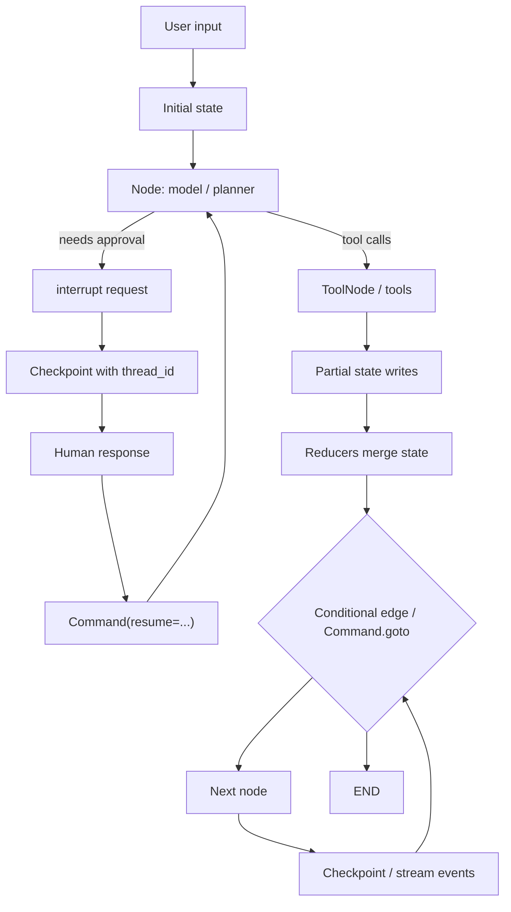

# LangGraph 1.2.8：把长时程 Agent 从“一次调用”拆成可恢复、可审计、可干预的状态机

## 元信息与 TL;DR

| 字段 | 内容 |
|---|---|
| 项目 | [langchain-ai/langgraph](https://github.com/langchain-ai/langgraph) |
| 本周锚点 | tag `1.2.8`，commit [`23652c54be18ce59f697aa38f10075ee91913220`](https://github.com/langchain-ai/langgraph/commit/23652c54be18ce59f697aa38f10075ee91913220) |
| 更新时间 | 2026-07-06 20:36 UTC |
| 类型 | 代码项目，LLM Agent orchestration framework |
| 版本事实 | `1.2.8` release commit 只把 `langgraph` 从 `1.2.7` bump 到 `1.2.8`，并同步 lockfile；没有源码变化或依赖下限变化 |
| 深读范围 | README、checkpoint README、SQLite checkpoint README、prebuilt README、`StateGraph`、`types.py`、time-travel / interruption tests、自动生成 threat model |

### TL;DR

- LangGraph 1.2.8 的本周价值不在“新功能大改”，而在它给了一个干净的当前周 release 锚点：项目主包版本更新到 `1.2.8`，但 release commit 明确说明没有 source changes。
- 项目的核心定位是低层 Agent 编排框架：把 long-running、stateful agent 表达成显式 graph，而不是把多轮推理、工具调用、人类审批和恢复逻辑塞进一次 prompt。
- 最关键抽象是 `StateGraph`：节点读写共享状态，状态字段可带 reducer，多节点更新在 superstep 中合并；编译后的 graph 才能 `invoke`、`stream`、`ainvoke`。
- 长时程能力来自 checkpointer：它在 superstep 级别保存 graph state，要求运行时用 `thread_id` 区分会话，并可用 `checkpoint_id` 从中间状态 replay 或 fork。
- Human-in-the-loop 不是 UI 装饰，而是 `interrupt()` + `Command(resume=...)` + checkpointer 的执行语义；文档和代码都强调 interrupt 依赖 checkpoint，恢复时会从节点开头重新执行。
- Prebuilt 层提供 `create_react_agent`、`ToolNode`、`ValidationNode` 和 Agent Inbox schema；这让框架既能服务底层图编排，也能支撑更接近日常 Agent 应用的工具调用与人工审批。
- 安全边界很清楚：checkpoint 默认可能保存完整对话、工具结果和用户状态；项目 README 建议对 checkpoint 反序列化开启 `LANGGRAPH_STRICT_MSGPACK=true` 或 allowed modules；threat model 也把 unbounded retention、未默认加密、用户工具行为列为边界。
- 局限同样明确：examples 目录已归档，最新示例迁到 docs；LangGraph Server / langgraph-api 不在开源 repo threat model 范围内；框架能提供状态与恢复语义，但不能替用户保证工具权限、prompt 安全、数据保留和模型行为安全。

## 1. 这次 release 到底更新了什么？

### 先把版本事实说清楚

Scout 选中 LangGraph 的原因是它在本周有 `1.2.8` release：

- tag：`1.2.8`
- commit：`23652c54be18ce59f697aa38f10075ee91913220`
- commit 时间：2026-07-06 13:36:09 -0700，也就是 2026-07-06 20:36:09 UTC
- commit message：`release(langgraph): 1.2.8 (#8292)`

但这个 commit 的说明非常重要：

- 它把 package version 从 `1.2.7` bump 到 `1.2.8`。
- 它同步 `libs/langgraph/uv.lock`、`libs/prebuilt/uv.lock`、`libs/sdk-py/uv.lock` 中的 editable package entries。
- 它明确写了 `No dependency floor or source changes`。

因此这篇不是“LangGraph 1.2.8 新功能解读”。更准确的定位是：

> 以 2026-07-06 的 1.2.8 release 为时间锚，深读 LangGraph 当前代码形态如何把 Agent 运行时做成可恢复、可干预、可观测的状态图。

## 2. LangGraph 解决的不是“怎么调模型”，而是“怎么运行 Agent”

### README 给出的项目定位

README 把 LangGraph 定义为：

- low-level orchestration framework
- 用于 building、managing、deploying long-running, stateful agents
- 可独立使用，也可和 LangChain、LangSmith、Deep Agents、LangSmith Deployment 组合

它列出的核心能力可以拆成五类：

| 能力 | README 表述 | 工程含义 |
|---|---|---|
| Durable execution | 失败后从离开处恢复 | Agent 运行不能只存在内存和日志里 |
| Human-in-the-loop | 运行中检查和修改状态 | 审批、纠错、用户补充输入是执行语义的一部分 |
| Comprehensive memory | 短期工作记忆和跨 session 长期记忆 | 状态不仅是 chat history，也包括可检索持久信息 |
| Debugging with LangSmith | 跟踪路径、状态转移和 runtime metrics | Agent 失败需要可回放证据 |
| Production deployment | 面向长时程 stateful workflow 的部署 | 部署对象是持续运行的图，不只是 HTTP 函数 |

### 为什么这和传统 chain 不同？

传统 LLM chain 常常像这样：

```text
input -> prompt -> model -> parser -> output
```

LangGraph 处理的问题更接近：

```text
state_0
  -> node_A reads state, writes delta_A
  -> node_B reads state, may call tools, writes delta_B
  -> router decides next node
  -> checkpoint
  -> interrupt for human review
  -> resume with edited state
  -> continue or fork
```

这意味着 Agent 被看成一个运行中的状态机，而不是一次模型调用的包装器。

## 3. 核心抽象：StateGraph 是共享状态上的节点系统

### `StateGraph` 的代码定义

`libs/langgraph/langgraph/graph/state.py` 中，`StateGraph` 的 docstring 写得很直接：

- 节点通过读取和写入 shared state 通信。
- 每个节点签名近似为 `State -> Partial<State>`。
- state key 可以用 reducer 注解，用来聚合多个节点写入同一字段的值。
- builder 不能直接执行，必须先 `.compile()` 成可执行 graph。

可以把它形式化成：

```text
G = (V, E, S, R)

V: node 集合
E: edge / conditional edge 集合
S: typed shared state
R: reducer 集合，每个 reducer 决定同一 state key 的多次写入如何合并
```

每个节点：

```text
f_v: S -> ΔS 或 Command
```

其中：

- `ΔS` 是局部状态更新。
- `Command` 可以携带 `update`、`resume`、`goto`。
- reducer 决定多节点并发写入如何进入下一轮 state。

### 为什么 reducer 重要？

Agent 工作流中常见状态并不都是“最后一个值覆盖前一个值”。

| 状态字段 | 常见更新方式 | 如果没有 reducer 会怎样 |
|---|---|---|
| messages | 追加消息 | 并发节点可能互相覆盖 |
| evidence | 合并证据列表 | 工具结果丢失 |
| votes | 聚合多 Agent 判断 | 只保留最后一个 Agent |
| errors | 累积错误记录 | 调试证据不完整 |
| remaining_steps | 受控递减 | 无限循环边界不清楚 |

因此 `StateGraph` 的设计把“状态如何合并”放进 schema，而不是让每个节点私下维护隐式全局变量。

## 4. 执行模型：Pregel 式 superstep 与可观测输出

### Superstep 视角

LangGraph 受 Pregel 启发。一个简化执行循环可以写成：

```text
Input:
  graph G, state S_t, active nodes A_t, config C

Loop:
  1. 选出当前 superstep 要执行的 nodes
  2. 每个 node 读取 S_t 与 runtime context
  3. node 返回 partial state、Command、interrupt 或 error
  4. reducer 合并 writes，得到 S_{t+1}
  5. 根据 edge / conditional edge / Command.goto 计算 A_{t+1}
  6. 如果启用 checkpointer，写入 checkpoint 与 pending writes
  7. 如果遇到 interrupt、END、recursion_limit 或 error，进入相应终态

Output:
  final state、stream chunks、checkpoint events、tasks/debug events
```

### Stream mode 暴露了不同层级的运行证据

`types.py` 中的 `StreamMode` 很能说明 LangGraph 的观测模型：

| stream mode | 输出什么 | 适合什么问题 |
|---|---|---|
| `values` | 每步后的完整 state | 用户界面或最终状态观察 |
| `updates` | 节点名与该节点写出的 update | 调试哪个节点改变了什么 |
| `messages` | LLM token / message 流和 metadata | 前端流式显示、模型调用追踪 |
| `custom` | 节点内自定义数据 | 业务进度、工具内部状态 |
| `checkpoints` | checkpoint 创建事件，格式接近 `get_state()` | 恢复、回放、审计 |
| `tasks` | task start / finish、result、error、interrupt | 运行时调度和失败分析 |
| `debug` | checkpoint + task debug payload | 深度排查 |

这说明 LangGraph 不是只返回“答案”。它把执行中的状态转移作为一等输出。

## 5. Checkpointer：长时程 Agent 的持久化核心

### Checkpoint README 的关键定义

`libs/checkpoint/README.md` 说 checkpointer 是 LangGraph 的 persistence layer，会在每个 superstep 保存 graph state，从而支持：

- human-in-the-loop
- memory between interactions
- durable execution
- more

它还定义了两个关键概念：

| 概念 | 含义 |
|---|---|
| Checkpoint | 某一时刻 graph state 的 snapshot，包含 config、metadata、pending writes 等 |
| Thread | 一串 checkpoint 的唯一 ID，用于多租户 chat、独立会话和分离状态 |

运行 graph 时，使用者必须在 config 中传：

```python
{"configurable": {"thread_id": "1"}}
```

也可以传：

```python
{"configurable": {"thread_id": "1", "checkpoint_id": "..."}}
```

后者让系统从某个中间 checkpoint 继续或回放。

### Pending writes 为什么重要？

README 里有一个容易被忽略但非常关键的点：

- 如果某个 superstep 中一个 node 失败了；
- 其他已经成功完成的 node 的 pending checkpoint writes 会被保存；
- 恢复时不需要重跑那些成功节点。

这解决了长时程 Agent 的一个现实问题：

| 没有 pending writes | 有 pending writes |
|---|---|
| 一个工具失败导致整个 superstep 重跑 | 成功节点结果可以保留 |
| 重跑可能重复发送邮件、重复扣费、重复写数据库 | 恢复粒度更接近真实副作用边界 |
| 调试时很难知道哪些动作已经发生 | checkpoint tuple 保留 pending evidence |

这也是为什么 Agent 编排框架不能只靠 Python try/except。Agent 工具可能有外部副作用，恢复语义必须被框架显式管理。

## 6. Replay、fork 与 time travel：状态不是线性的

### 测试文件透露的行为语义

`libs/langgraph/tests/test_time_travel.py` 的开头总结了 time travel 覆盖范围：

- replay 与 fork basics
- replay / fork with interrupts
- multiple / sequential interrupts
- subgraph with or without interrupt
- `__copy__` / `update_state(None)`
- observability, including `get_state` and config access

其中几个测试表达了非常核心的语义：

| 行为 | 测试表达 | 研究意义 |
|---|---|---|
| replay | 从 `checkpoint_id` 调用会重新执行 checkpoint 之后的节点 | 可以复现实验路径，而不是只能看最终结果 |
| final checkpoint replay | 从完成态 checkpoint replay 是 no-op | 完成态边界清晰 |
| fork | `update_state` 后再 invoke，会创建新分支 | 人类修正状态后可沿新路径继续 |
| multiple forks | 同一 checkpoint 可产生多个独立分支 | 可以比较多个假设或修复策略 |

### 用公式看 replay 和 fork

假设 checkpoint 是：

```text
CP_i = (S_i, next_i, metadata_i)
```

Replay：

```text
run(CP_i) -> execute(next_i, S_i)
```

Fork：

```text
S_i' = update(S_i, human_delta)
CP_i' = checkpoint(S_i')
run(CP_i') -> execute(next_i, S_i')
```

差别在于：

- replay 尽量复现原路径后半段；
- fork 明确承认状态被人工或程序修改，后续结果属于新分支。

这对研究 Agent 可控性很关键。很多 Agent 失败不是“模型给错答案”这么简单，而是中间某个状态错了。如果框架允许从中间状态 fork，研究者就能分析：

- 错误是从哪个节点开始传播的？
- 修改 state 是否足以修复？
- 还是必须修改 graph topology、prompt、tool 或 reducer？

## 7. Human-in-the-loop：interrupt 是执行语义，不是弹窗

### `interrupt()` 的约束

`types.py` 中 `interrupt()` 的说明包含几个必须保留的边界：

- 它用于暂停 graph execution，向客户端暴露 value。
- 恢复时用 `Command(resume=...)`。
- 恢复会从节点开头重新执行。
- 一个节点里有多个 interrupt 时，resume values 按 interrupt 调用顺序匹配。
- 使用 interrupt 必须启用 checkpointer。

这意味着 human-in-the-loop 不是“某个工具调用前弹确认框”这么简单。它改变了执行模型：

```text
node starts
  -> prepare action_request
  -> interrupt(request)
  -> checkpoint stores suspended state
  -> human responds
  -> Command(resume=response)
  -> node restarts and consumes resume value
```

### 为什么恢复时重跑节点是重要边界？

恢复从节点开头重跑会带来一个工程要求：

- interrupt 前的逻辑必须是可重入的；
- 不应在 interrupt 前执行不可重复副作用；
- 如果必须执行副作用，应该用 checkpoint / pending write / idempotency key 管住；
- 多个 interrupt 的顺序不能在代码变更后随意打乱。

这也解释了为什么 LangGraph 把 human-in-the-loop 和 durable execution 绑在一起。没有 checkpoint，human approval 就只是 UI 事件；有 checkpoint，它才成为可恢复 workflow 的一部分。

## 8. Prebuilt 层：从底层图到常用 Agent 组件

### README 中的 prebuilt 组件

`libs/prebuilt/README.md` 说这个包定义了用于创建和执行 LangGraph agents/tools 的高层 API，包括：

- `create_react_agent`
- `ToolNode`
- `ValidationNode`
- Agent Inbox schemas

| 组件 | 做什么 | 适合读出的边界 |
|---|---|---|
| `create_react_agent` | 创建 tool-calling ReAct-style agent | 方便，但仍需要工具权限和步数边界 |
| `ToolNode` | 执行 AIMessage 里的 tool calls | 工具调用被显式节点化 |
| `ValidationNode` | 用 Pydantic schema 校验 tool calls | schema validation 是工具安全的第一层 |
| Agent Inbox schema | 与 `interrupt()` 结合表达人工审批请求 | 审批请求可结构化，不只是自然语言提示 |

### `create_react_agent` 里的剩余步数信号

`chat_agent_executor.py` 中的 prebuilt agent state 包含 `remaining_steps`。代码围绕它判断 agent 是否还有足够步数继续调用工具。

这和近期已发布的 IAL-Scan 主题形成互补：

- IAL-Scan 从静态分析角度找 infinite agentic loops。
- LangGraph prebuilt agent 从运行时状态角度显式保留 `remaining_steps`。
- 两者都指向同一件事：Agent 编排必须把“停止条件”做成可见结构，而不是相信模型自己会停。

## 9. 安全与数据边界：checkpoint 不是免费记忆

### Checkpoint 反序列化风险

`langgraph-checkpoint` README 有一个重要提醒：

- 默认 serializer 可处理很多 Python type。
- 新应用应设置 `LANGGRAPH_STRICT_MSGPACK=true`。
- 或者传入明确的 `allowed_msgpack_modules`。
- 目的是限制 checkpoint 反序列化到已知安全类型。

SQLite checkpoint README 进一步强调：

- 如果数据库被 compromise，限制反序列化类型可以防止 code execution 风险。

这说明 LangGraph 的 memory / checkpoint 能力有安全代价：

| 能力 | 风险 |
|---|---|
| 保存完整 graph state | 可能保存用户 PII、工具结果、业务数据 |
| 跨 session 记忆 | 可能引入数据保留和遗忘问题 |
| 从数据库恢复 Python 对象 | 可能扩大反序列化攻击面 |
| time travel / fork | 旧状态和分支状态都需要治理 |

### Threat model 给出的边界

`.github/THREAT_MODEL.md` 是自动生成文档，不是权威安全保证，但它很有助于理解项目边界。

它明确列入 scope：

- core graph execution engine
- prebuilt agents/tools
- checkpoint serialization/deserialization
- Postgres / SQLite saver
- CLI
- Python SDK

它明确排除：

- LangGraph Server / `langgraph-api`
- 用户应用代码
- LLM provider behavior
- LangSmith platform
- 测试、benchmark、文档

它还把 serialized graph state 归为 High sensitivity，并指出：

- checkpoint 可能包含完整 agent state、conversation history、tool call results。
- 默认 retention 可能 unbounded。
- 默认不加密，除非用户配置 serializer 或 server-side encryption。

这不是小字免责声明，而是部署 Agent 时必须面对的核心事实：**LangGraph 让 Agent 可恢复，也让 Agent 的中间状态成为需要治理的数据资产。**

## 10. 运行可靠性：durability、recursion limit 与中断测试

### Durability mode

`types.py` 定义了三种 durability：

| 模式 | 含义 | 取舍 |
|---|---|---|
| `sync` | 下一步开始前同步持久化 changes | 最稳，延迟更高 |
| `async` | 下一步执行时异步持久化 changes | 默认更偏吞吐 |
| `exit` | graph 退出时才持久化 changes | 开销低，但中途失败恢复粒度差 |

`test_interruption.py` 中的测试显示：

- interrupt 后 `get_state(thread).next` 会指向下一步。
- 不同 durability 下 checkpoint history 数量不同。
- `exit` 模式下 checkpoint 更少，恢复证据也更粗。

这给实际部署一个很直接的选择题：

| 任务类型 | 更合适的 durability |
|---|---|
| 只读问答、短链路 | `async` 或 `exit` 可接受 |
| 发邮件、写数据库、审批流 | 更偏 `sync` |
| 高成本工具、长时程研究 Agent | 至少要能在关键边界同步 checkpoint |

### Recursion limit

错误处理里也有 recursion limit。它不是完整安全方案，但能防止一些显式图循环无限跑下去。

需要注意：

- recursion limit 是运行边界，不是语义正确性证明。
- 它不能保证工具副作用安全。
- 它需要和 `remaining_steps`、timeout、budget、human approval、tool permission 一起设计。

## 11. 图解：LangGraph 如何把 Agent 运行拉回可控状态机



这张图表达了 LangGraph 的研究价值：

- Agent action 不再只是模型输出。
- 每个节点、状态写入、工具调用、人工中断、恢复和结束都进入 graph 语义。
- 安全与可观测性不再只能靠日志回放，而可以直接绑定到 checkpoint 和 stream event。

## 12. 与近期 Daily Report 主题的关系

### 为什么这不是 AgentFlow / IAL-Scan 的重复？

近期文章已经写过：

- AgentFlow：用静态依赖图分析 Agent 程序。
- IAL-Scan：检测无限 Agentic Loop。
- GraphGuard：面向 LangGraph pipeline 的安全 linter。

LangGraph 本身的切入点不同：

| 主题 | 关注对象 | LangGraph 深读补充了什么 |
|---|---|---|
| AgentFlow | Agent 程序依赖和 prompt-to-tool 风险 | LangGraph 作为框架如何暴露 graph / state / edge 结构 |
| IAL-Scan | 无边界循环和停止失败 | LangGraph 的 recursion limit、remaining_steps、checkpoint recovery |
| GraphGuard | LangGraph 安全扫描器 | 被扫描对象本身的状态、工具和 checkpoint 语义 |
| 本文 | LangGraph 当前运行时 | 为什么 stateful orchestration 是 Agent 工程底座 |

这篇的意义不是发现一个新漏洞，而是解释为什么越来越多 Agent 研究会把 LangGraph 当作背景框架：它把 Agent 的隐式控制流显式化了。

## 13. 局限：框架给边界，不给自动安全

### 1. Release 本身不是功能更新

这次 `1.2.8` 是很干净的当前周锚点，但不能被误读为功能新增：

- 没有源码改动。
- 没有 dependency floor 改动。
- 没有新的 benchmark。
- 没有新的安全修复说明。

所以本文的结论来自项目当前结构，而不是来自 `1.2.8` 的差异 diff。

### 2. Examples 目录已经归档

`examples/README.md` 明确说该目录只为 archival purposes 保留，不再更新；最新示例、教程和指南迁到 docs。

这意味着读者不能只看 repo 里的 notebook 判断当前最佳实践。真正要落地，需要读最新 docs、API reference 和部署文档。

### 3. 用户代码和工具行为仍在框架边界外

Threat model 把 user application code、tools、prompts、model selection、deployment infrastructure 列为用户控制。

换句话说：

- LangGraph 能保存状态，但不会自动判断状态里是否有敏感数据。
- LangGraph 能执行 ToolNode，但不会替用户决定工具是否应该拥有某个权限。
- LangGraph 能 interrupt，但不会替组织设计审批策略。
- LangGraph 能 replay / fork，但不会保证旧 checkpoint 满足数据删除要求。

### 4. LangGraph Server 不在开源 threat model 范围内

README 提到 LangSmith Deployment 和生产部署，但 repo threat model 把 LangGraph Server / `langgraph-api` 排除在 scope 外。

因此如果评估生产部署安全，需要另外检查：

- server auth / authorization
- API key handling
- redirect / streaming transport
- storage encryption
- retention policy
- tenant isolation
- observability data流向

这部分不能从开源 repo 的 core package 自动推出。

## 14. 细节库存：从目录结构看 LangGraph 把哪些问题拆开了？

### 核心目录与责任边界

| 路径 | 责任 | 深读时看到的关键点 |
|---|---|---|
| `libs/langgraph/langgraph/graph` | `StateGraph`、message graph、UI graph 等图构建层 | 负责把用户定义的节点、边、条件边、schema 和 reducer 变成可编译结构 |
| `libs/langgraph/langgraph/pregel` | 核心执行引擎 | 负责 superstep、stream、checkpoint、resume、recursion limit、remote run stream 等运行时语义 |
| `libs/langgraph/langgraph/types.py` | 公共运行时类型 | 定义 `Command`、`Send`、`Interrupt`、`Durability`、`StreamMode` 等 Agent 控制面对象 |
| `libs/checkpoint` | checkpoint 抽象与 serde | 定义 `BaseCheckpointSaver`、serializer、store、cache、event hooks |
| `libs/checkpoint-sqlite` | SQLite saver/store | 用于本地开发、测试、轻量部署，并明确提醒严格 msgpack allowlist |
| `libs/checkpoint-postgres` | Postgres saver/store | 面向更生产化的持久层，包含 checkpoint、writes、store、vector search |
| `libs/prebuilt` | 高层 Agent 组件 | 提供 ReAct agent、ToolNode、ValidationNode、Agent Inbox schema |
| `libs/sdk-py` | Python SDK | 处理远端 thread、run、stream、store、assistants 等 API client 侧能力 |
| `libs/cli` | 部署与本地服务 CLI | 提供 `langgraph` 命令、Docker 构建、配置 schema、示例工程 |

这个拆分说明 LangGraph 没有把 Agent 视作一个单文件 helper。它把问题拆成四层：

- **建模层**：用户声明 state、node、edge、reducer。
- **执行层**：Pregel runtime 决定每步运行、流式输出、失败、恢复。
- **持久层**：checkpoint/store/cache 记录可恢复状态。
- **应用层**：prebuilt agent 和 SDK/CLI 把底层能力接到常见开发路径。

### 这对 Agent 研究有什么具体帮助？

研究者常常需要回答四个问题：

| 研究问题 | LangGraph 提供的可观察对象 |
|---|---|
| Agent 为什么走到这一步？ | edge、conditional edge、`Command.goto`、stream `tasks` |
| 哪个节点改变了结论？ | `updates` stream、checkpoint metadata、state history |
| 人类介入是否真的改变路径？ | fork checkpoint、`update_state`、resume config |
| 失败后是否重复执行副作用？ | pending writes、durability mode、checkpoint history |

这类证据比最终答案更有价值。Agent 研究的难点往往不是“模型最后说了什么”，而是：

- 它在第几步调用了错误工具？
- 错误工具输出是否进入长期记忆？
- 人类审批修改的是 prompt、state 还是 tool args？
- 失败恢复后，模型是否重做了昂贵或不可逆动作？
- 多个并行节点写同一字段时，状态合并是否符合预期？

LangGraph 把这些问题变成可检查的运行时对象。

## 15. 失败模式：LangGraph 能缓解什么，不能消除什么？

### 能缓解的失败

| 失败模式 | LangGraph 机制 | 为什么有帮助 |
|---|---|---|
| 进程崩溃导致长任务丢失 | checkpoint + thread_id | 恢复时不必从头开始 |
| 人类审批停在半路 | interrupt + Command resume | 审批点成为 graph 状态的一部分 |
| 中间状态错误但不想重跑全部 | time travel / fork | 从 checkpoint 修改状态后继续 |
| 多节点并行写入丢失 | reducer | 合并规则放进 schema |
| 工具调用参数形状错误 | ValidationNode | 用 Pydantic schema 先拦截 |
| Agent 无限跑 | recursion_limit / remaining_steps | 至少提供运行时上限 |
| 调试只看到最终答案 | stream modes / get_state_history | 输出每步 evidence |

### 不能自动消除的失败

| 失败模式 | 为什么框架本身不够 |
|---|---|
| Prompt injection 诱导工具误用 | 工具权限和内容信任仍由用户设计 |
| 数据保留不合规 | checkpoint 默认会保存状态，删除/TTL 需要部署侧策略 |
| 外部副作用重复发生 | 框架可保存 pending writes，但工具必须设计幂等键或补偿逻辑 |
| 模型越权推理 | LangGraph 管执行，不自动做 policy reasoning |
| 恶意 checkpoint 数据 | 需要严格反序列化 allowlist、加密和数据库访问控制 |
| 多租户隔离失败 | `thread_id` 是应用层隔离标识，不等于完整租户安全边界 |

这个边界很重要。LangGraph 的意义是把失败变得可定位、可恢复、可审计；但安全仍需要工具权限、身份系统、数据分类和部署策略配合。

## 16. 实验设计启发：如果要评测 LangGraph Agent，应该测什么？

### 不应只测最终任务成功率

一个 LangGraph Agent 可能最终答对，但中间路径不健康：

- 调用了过多工具。
- 写入了不该保留的 memory。
- 在 human approval 前已经执行副作用。
- 从失败恢复后重复调用外部 API。
- checkpoint 保存了敏感字段。
- fork 之后旧分支仍可被错误恢复。

因此评测指标应该更接近运行系统：

| 指标 | 定义 | 关联机制 |
|---|---|---|
| `task_success` | 最终任务是否完成 | output state |
| `step_count` | superstep / node 执行次数 | stream `tasks` |
| `tool_call_count` | 工具调用数量和类型 | ToolNode / messages |
| `checkpoint_count` | 关键边界是否持久化 | checkpoint stream |
| `resume_success_rate` | 中断后能否正确恢复 | interrupt + Command resume |
| `fork_divergence` | 修改中间状态后路径是否合理改变 | update_state + replay |
| `sensitive_state_retention` | checkpoint 是否保存不该保存的字段 | serializer / storage audit |
| `duplicate_side_effect_rate` | 恢复后是否重复外部动作 | pending writes + tool idempotency |

### 一个更贴近框架的评测流程

```text
Input:
  多轮用户任务、工具集、checkpoint backend、故障注入点、人类审批脚本

Procedure:
  1. 正常运行 graph，记录 stream events 与 checkpoints
  2. 在指定 node 后注入进程崩溃
  3. 从 checkpoint resume，检查是否跳过已成功节点
  4. 在审批点用 Command(resume=...) 注入人类修改
  5. 从同一 checkpoint fork 两个修复分支
  6. 比较最终 state、tool calls、checkpoint 中敏感字段

Output:
  task_success, resume_success_rate, duplicate_side_effect_rate,
  checkpoint_safety_findings, fork_divergence_report
```

这类评测比“让 Agent 做一道题”更能反映 LangGraph 的价值，也更容易暴露框架使用者的错误配置。

## 17. 部署建议：把 LangGraph 当作有状态系统，而不是库函数

### 最小生产清单

| 项 | 建议 |
|---|---|
| checkpoint backend | 本地开发可用 SQLite；生产要明确 Postgres、备份、访问控制和迁移策略 |
| serialization | 新应用开启 `LANGGRAPH_STRICT_MSGPACK=true` 或 allowed modules |
| retention | 为 thread/checkpoint/store 制定 TTL 或删除接口 |
| encryption | 对高敏状态启用 at-rest encryption 或部署侧加密 |
| human approval | interrupt 前不要做不可逆副作用；审批请求要结构化 |
| side effects | 工具调用使用 idempotency key、操作日志和补偿策略 |
| budgets | 配置 recursion limit、remaining steps、tool timeout、token/cost budget |
| observability | 保存 stream events、checkpoint metadata、tool call trace |
| tenant boundary | 不要把 `thread_id` 当作唯一安全隔离；仍需 authz 与资源级权限 |
| docs source | repo examples 已归档，实际落地以最新 docs 和 API reference 为准 |

### 研究者视角的下一步问题

- Checkpoint 中哪些字段应该默认 redaction？
- `interrupt()` 是否应该支持声明“之前哪些代码不可重放”？
- ToolNode 能否把权限、数据分类、side-effect 类型作为 schema 的一部分？
- `remaining_steps` 是否应该扩展成多维 budget，例如时间、token、金钱、外部写操作次数？
- Replay / fork 是否能成为 Agent debugging benchmark 的标准接口？
- 多 Agent graph 中，子图 checkpoint 与父图 checkpoint 的责任边界如何表达？

这些问题说明 LangGraph 已经把 Agent 运行时的骨架搭出来了。接下来的研究挑战，是把安全、预算、数据治理和人类监督也纳入同样明确的图语义。

## 18. 结论：LangGraph 的研究意义在于把 Agent 运行时显式化

- LangGraph 1.2.8 本身是版本发布，不是源码功能更新；但它提供了当前周可验证的项目状态锚点。
- 深读代码后，LangGraph 的核心价值很清楚：它把长时程 Agent 编排成 typed state graph，并把 checkpoint、interrupt、stream、durability、replay、fork 做成运行时原语。
- 这对 Agent 研究尤其重要，因为许多失败不发生在最终回答，而发生在中间状态、工具副作用、循环边界、人工审批和恢复路径里。
- Checkpointer 是能力核心，也是安全核心：它让 Agent 可恢复，也让完整 conversation、tool results、user state 进入持久化治理范围。
- Prebuilt 层把底层 graph 抽象连接到 ReAct agent、ToolNode、ValidationNode 和 Agent Inbox，使“框架语义”能进入普通 Agent 应用。
- 继续研究 LangGraph 这类框架时，真正值得追问的是：如何把权限、预算、数据分类、人工审批和 checkpoint retention 也做成与 graph state 同等级的一等约束，而不是继续散落在 prompt、工具代码和部署脚本里。
