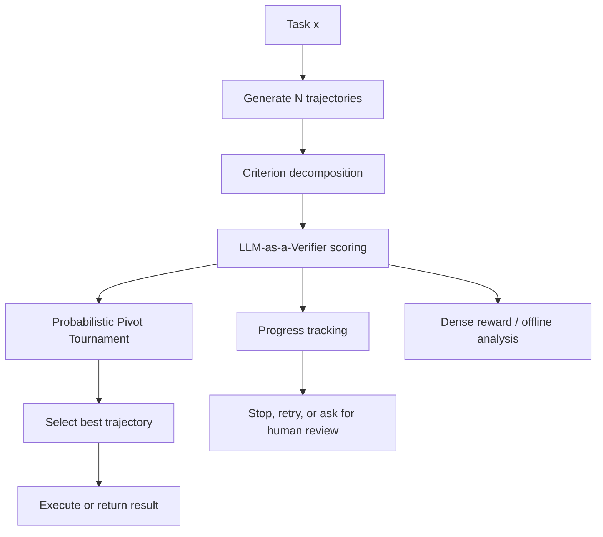

# LLM-as-a-Verifier：把“验证”变成 Agent 能力扩展的第四条轴

### 元信息

| 字段 | 内容 |
|---|---|
| 原文 | [LLM-as-a-Verifier: A General-Purpose Verification Framework](https://arxiv.org/abs/2607.05391) |
| 类型 | 论文 + 官方代码项目 |
| 作者 | Jacky Kwok, Shulu Li, Pranav Atreya, Yuejiang Liu, Yixing Jiang, Chelsea Finn, Marco Pavone, Ion Stoica, Azalia Mirhoseini |
| 机构 | Stanford University, UC Berkeley, NVIDIA Research |
| 日期证据 | arXiv Atom: published/updated = 2026-07-06T17:59:35Z |
| 代码与项目页 | [GitHub](https://github.com/llm-as-a-verifier/llm-as-a-verifier), [Project Page](https://llm-as-a-verifier.com/) |
| 主题归类 | 大模型 Agent / Agent 评测 / 后训练奖励信号 |

### TL;DR

- 这篇论文把 **verification** 定义成继预训练、后训练、test-time compute 之后的另一条扩展轴：不是让模型多生成几个答案，而是让模型更稳定地判断哪条长轨迹真的完成了任务。
- 方法名是 **LLM-as-a-Verifier**。它不要求重新训练 verifier，而是在 `<score_A>` / `<score_B>` 位置读取评分 token 的 logprob 分布，并计算连续奖励，而不是只接收一个离散整数分数。
- 论文把验证扩展拆成三件事：扩大评分粒度 `G`，重复评估 `K`，拆分评估标准 `C`；对应地减少离散 judge 的 tie、降低单次评估噪声、削弱单一 rubric 的提示偏差。
- 为了让 best-of-N 选择不被 `O(N^2)` 两两比较拖垮，作者提出 **Probabilistic Pivot Tournament, PPT**：先用 ring pass 抵消 A/B 位置偏差，再选 pivot，把主要预算花在更可能胜出的候选上。
- 实验覆盖 coding、robotics、medical agent：Terminal-Bench V2 达到 86.5%，SWE-Bench Verified 达到 78.2%，RoboRewardBench 达到 87.4%，MedAgentBench 达到 73.3%。
- 这套分数还被用作进度信号和 RL dense reward：RoboRewardBench 上 mean VOC 为 0.966；LIBERO 上 SAC 的样本效率约提升 1.8 倍，MATH 上 Qwen3-8B + GRPO 的样本效率约提升 1.1 倍。
- 局限也很明确：方法依赖 scoring-token logprob；官方 GitHub 当前主要复现实验是 Terminal-Bench/SWE-Bench，且 README 显示仓库只有少量脚本与缓存数据入口；更大规模真实 agent 部署仍需要验证成本、偏置和 API logprob 可用性评估。

### 1. 这篇论文真正关心什么？

- 论文的问题意识不是“LLM judge 能不能打分”，而是：
  - 当 agent 已经能采样出许多可行轨迹时，系统是否能挑出真正成功的那条？
  - 当任务变成长程交互、代码修改、终端执行、机器人视频或医疗路径时，离散评分是否还够用？
  - 如果 verifier 本身也能 scaling，它是否能像 test-time sampling 一样成为能力提升的杠杆？

- 作者的核心观察是：
  - 生成能力已经通过预训练、后训练和推理时计算持续扩展；
  - 但 verification 经常仍停在粗粒度 judge：让模型输出 1 到 5 或 1 到 10 的分数；
  - 在复杂 agent 轨迹里，许多候选会被压到同一个整数分数，Terminal-Bench V2 中粗评分会出现 27% tie；
  - tie 不是小问题，因为 best-of-N 的价值就来自“有多个候选时能选对”。

### 2. Claim → mechanism → evidence → boundary

| 层次 | 论文主张 | 机制 | 证据 | 边界 |
|---|---|---|---|---|
| claim | verification 是新的 scaling axis | 不训练新模型，读 scoring token 全分布 | Figure 4 显示粒度、重复、criteria decomposition 都提升 pairwise accuracy | 需要能取 logprob 的 verifier 接口 |
| claim | 连续分数比离散 judge 更能区分长轨迹 | 对每个 score token 的概率做期望 | Terminal-Bench tie rate 从粗评分的 27% 问题切入 | 仍受提示、criterion 设计和底层模型能力影响 |
| claim | verifier 可做 best-of-N trajectory reward model | PPT 用 pivot 降低比较成本 | Terminal-Bench V2 86.5%，SWE-Bench Verified 78.2% | best-of-N 依赖候选池本身有正确轨迹 |
| claim | verifier 分数可近似任务进度 | 对 trajectory prefix 打分并看时间顺序相关性 | Robotics mean VOC 0.966 | 进度相关不等同于因果奖励正确 |
| claim | verifier 可作为 RL dense reward | SAC/GRPO 中加入 verifier reward | LIBERO 约 1.8x，MATH 约 1.1x 样本效率 | 只展示若干任务和模型设置 |

### 3. 为什么离散 judge 不够？

- 标准 LLM-as-a-Judge 常见做法是：
  - 给出 task、候选答案或候选轨迹；
  - 让模型输出一个离散分数；
  - 用分数排序候选。

- 这在短答案、开放式偏好评测里可用，但在 agent 任务里有三个问题：
  - **长程轨迹信息量太大**：终端命令、工具调用、错误恢复、代码 diff、测试输出都可能影响成败。
  - **整数分数太粗**：两个轨迹都被打成 8 分时，系统仍不知道该选谁。
  - **单一 rubric 太脆**：一个 criterion 可能偏重最终输出，忽略过程中的潜在错误；另一个 criterion 可能过度惩罚风格差异。

- 论文把 judge 与 verifier 做了区分：
  - judge 更像给整体印象打分；
  - verifier 更像确认一个候选是否满足任务约束；
  - agent 轨迹需要的是后者，因为很多失败不是“质量略差”，而是某个执行步骤已经破坏任务前提。

### 4. 方法：从评分 token 分布得到连续奖励

论文的主公式可以写成：

```math
R(x,\tau)=\frac{1}{CK}\sum_{c=1}^{C}\sum_{k=1}^{K}\sum_{g=1}^{G}
p_{\theta}(v_g \mid x,c,\tau)\,\phi(v_g)
```

变量解释：

| 符号 | 含义 | 在方法里的作用 |
|---|---|---|
| `x` | 任务输入或任务提示 | 告诉 verifier 要验证什么 |
| `τ` | agent 轨迹 | 可包含代码、工具调用、终端输出、机器人帧或推理过程 |
| `C` | criteria 数量 | 把“是否成功”拆成多个检查角度 |
| `K` | 重复验证次数 | 用多次采样降低偶然噪声 |
| `G` | score token 粒度 | 例如 20 个评分 token，而不是 5 个整数 |
| `pθ(v_g | x,c,τ)` | verifier 对第 `g` 个评分 token 的概率 | 不是只看采样出来的一个 token，而是读取分布 |
| `φ(v_g)` | score token 到标量的映射 | 把 token 分布转成连续分数 |

这个公式的关键不是数学复杂，而是接口选择：

- 如果只让模型输出一个 `8`，系统拿到的是离散结果。
- 如果读取 `1..20` 各个 score token 的概率，系统拿到的是一个分布。
- 对分布求期望后，两个都“接近 8 分”的轨迹仍可能有不同的连续值。

### 5. Pairwise preference：连续奖励如何变成选择？

作者先把 `R(x, τ)` 线性归一化到 `[0, 1]`，然后用 Bradley-Terry 形式计算两个轨迹的偏好概率：

```math
P(\tau_i \succ \tau_j \mid x)=
\frac{1}{1+\exp(-(R(x,\tau_i)-R(x,\tau_j)))}
```

这一步的意义：

- 它把“轨迹 A 分数略高于 B”变成概率偏好，而不是硬阈值。
- 它允许后续 tournament 在比较预算有限时累计软胜负。
- 它也让 verifier 的连续输出能接入 best-of-N、progress tracking 和 RL reward。

### 6. PPT：为什么不直接全量两两比较？

如果有 `N` 条候选轨迹，完整 round-robin 需要比较：

```math
\binom{N}{2}=O(N^2)
```

长程 agent 轨迹很贵，`O(N^2)` 很快不可接受。论文提出 **Probabilistic Pivot Tournament, PPT**：

```text
Input:
  task x
  candidates τ1...τN
  verifier V
  pivot count k, where k << N

State:
  ring score table S
  pivot set P
  win accumulator W

Procedure:
  1. Sample a random Hamiltonian cycle γ over candidates.
  2. Ring pass:
     for each adjacent pair (γt, γt+1 mod N):
       score both A/B positions with V.
       update ring mean preference.
     This makes each candidate appear once as A and once as B.
  3. Pivot selection:
     choose top-k uncertain or strong candidates as pivots.
  4. Pivot tournament:
     compare non-pivot candidates against pivots.
     compare pivot candidates against each other.
     accumulate Bradley-Terry preference wins.
  5. Return the candidate with the strongest accumulated preference.

Failure boundary:
  if ring pass is misled by a systematically bad criterion,
  or if the correct candidate is absent from the sampled pool,
  PPT cannot recover the correct answer by ranking alone.
```

论文声称这把比较预算从 `O(N^2)` 降到近似 `O(Nk^2)`。这里最重要的是 ring pass：

- 每个候选都在 prompt 的 A 位和 B 位各出现一次；
- 这能抵消模型对位置的系统偏好；
- 后续 pivot 选择才不至于只是放大 A/B 偏置。

### 7. 三条 verification scaling 轴

| scaling 轴 | 操作 | 直觉 | 主要风险 |
|---|---|---|---|
| score granularity | 增大评分 token 数 `G` | 让 7.8 与 8.2 这类差异可见 | 需要稳定 logprob，且 token 映射要干净 |
| repeated evaluation | 增大重复次数 `K` | 多次评估平均，降低随机噪声 | 成本线性上升 |
| criteria decomposition | 增大检查标准数 `C` | 把成功拆成执行、约束、最终结果等子问题 | criterion 写得差会引入新偏差 |

这三个轴分别对应三种失败：

- tie 过多：增加 `G`。
- 单次判断不稳：增加 `K`。
- 一个 rubric 抓不住复杂任务：增加 `C`。

### 8. 实验一：Terminal-Bench V2

Terminal-Bench 的设置很适合这篇论文，因为它不是“回答一个问题”，而是让 agent 在终端环境里执行任务。

| 项目 | 设置或结果 |
|---|---|
| 候选轨迹来源 | 官方 GitHub README 指出 `data/terminal_trajs/forge_gpt54/` 含 Forge + GPT-5.4，89 个任务，每个 5 条轨迹 |
| 原始 scaffold | Forge + GPT-5.4 pass@1 = 81.8% |
| 官方 README 复现命令 | `python scripts/run_terminal_bench.py --granularity 20 --n-verifications 4 --criteria 3` |
| 论文主结果 | Terminal-Bench V2 = 86.5% |
| README 期望结果 | LLM-as-a-Verifier = 76.9±0.3 / 89，即 86.4% |
| Oracle Bo5 | README 显示 80 / 89，即 89.9% |

这里的关键不是 86.4% 与 86.5% 的四舍五入差异，而是：

- pass@1 已经很强；
- oracle Bo5 说明候选池里还有显著 headroom；
- verifier 的任务就是把这部分 headroom 变成真实可用提升。

### 9. 实验二：SWE-Bench Verified

SWE-Bench Verified 更接近 coding agent 的真实痛点：

- 轨迹里不只有最终 patch；
- 还包含读文件、定位 bug、改代码、运行测试、处理失败；
- 一个 patch 可能看起来合理，但绕开了 buggy callee 或只改默认值，最终泛化失败。

| 项目 | 设置或结果 |
|---|---|
| 数据 | 官方 README 指出 `data/swebench_verified_trajs/` 含 3 个 runs，每个 500 instances |
| runs | mini-swe-agent + Claude-Opus-4.5 high reasoning、Claude-Opus-4.6、Gemini-3-Flash high reasoning |
| pass@1 | README 表中三个 run 分别为 76.8%、75.6%、75.8%，平均约 76.1% |
| 复现命令 | `python scripts/run_swe_bench.py --granularity 20 --n-verifications 4 --criteria 3` |
| README 期望 | 389.0±0.4 / 500，即 77.8% |
| 论文摘要主结果 | SWE-Bench Verified = 78.2% |
| Oracle Bo3 | README 显示 422 / 500，即 84.4% |

这组结果的解读：

- verifier 没有重新训练 agent；
- 它只在多个轨迹之间选择；
- 增益小于 Terminal-Bench，但任务更难、候选更少；
- oracle Bo3 仍说明选择器质量是实际瓶颈之一。

### 10. 实验三：Robotics 与进度信号

论文把 verifier 扩展到机器人轨迹，核心不只是最终偏好，而是 **Value-Order Correlation, VOC**。

| 方法 | Spearman VOC |
|---|---:|
| LLM-as-a-Verifier (Qwen 3.6 35B) | 0.966 |
| RoboReward-8B | 0.877 |
| Robometer-4B | 0.780 |
| TOPReward (Qwen 3.6) | 0.565 |

VOC 衡量的是：

- 随着机器人 rollout 从早到晚推进；
- verifier 对 prefix 的分数是否也按任务进展单调上升；
- 如果成功轨迹应该逐步接近目标，而失败轨迹在中途偏离，好的 verifier 应该能反映这种时间结构。

这对 agent 也很重要：

- coding agent 的成功不是最后一行才突然出现；
- 它通常经历“读题 → 定位文件 → 修改代码 → 运行测试 → 修复失败”的进度链；
- 如果 verifier score 能对 prefix 形成进度曲线，它就能用于监控、早停、候选剪枝或训练奖励。

### 11. 实验四：MedAgentBench

MedAgentBench 的意义在于：

- 它不是 coding 或 robotics；
- 任务更偏专业决策；
- 如果同一 verifier 框架也能跨过去，说明方法不是只为终端任务定制。

论文摘要给出的主结果是 73.3%。这里要谨慎：

- 这个数字说明 verifier 在医疗 agent benchmark 上有效；
- 但医疗任务的真实部署风险远高于 benchmark；
- 不能把 benchmark preference accuracy 等同于临床可靠性。

### 12. Dense reward for RL：从选择器到训练信号

论文最后把 verifier score 用作 RL 的 dense reward。

#### 12.1 Off-policy RL: LIBERO + DSRL-SAC

设置要点：

- 任务：LIBERO-90 中的 `ketchup` 任务。
- 策略：从 `π0` policy fine-tune。
- 算法：DSRL-SAC。
- verifier：Qwen 3.6 35B，经 SGLang 服务。
- 输入：每个 rollout 均匀采样 `N_f = 10` 个渲染帧。
- 评分：granularity = 20，top-20 scoring-token logprobs，重复 `K = 3`。
- 随机种子：每个条件 5 个 seeds。
- 训练长度：1.5M environment steps。

论文报告：

- 相比 sparse reward baseline，样本效率约提升 1.8 倍；
- 同时最终成功率也更高。

#### 12.2 On-policy RL: MATH + GRPO

设置要点：

- 模型：Qwen3-8B。
- 数据：Hendrycks MATH。
- 算法：GRPO。
- group size：`M = 16`。
- 每个 optimization batch：64 groups。
- learning rate：`2 × 10^-5`。
- 最大生成长度：512 tokens。
- verifier：Gemini 2.5 Flash，通过 probabilistic pivot tournament 评分。
- 加权：verifier preference 在组内标准化后，以 `β = 0.1` 加到 correctness 与 format reward 上。

论文报告：

- 相比 baseline，样本效率约提升 1.1 倍；
- 提升小于 robotics，但说明 verifier 不只适合选择轨迹，也能进入训练环。

### 13. Figure/Table 证据如何支撑主张？

| Figure/Table | 证据功能 | 支撑什么 | 不能证明什么 |
|---|---|---|---|
| Figure 1 | 总览四个 benchmark 结果 | 框架跨 coding、robotics、medical 有效果 | 不证明所有 agent 任务都能迁移 |
| Figure 2 | 多模态统一框架图 | verifier 可用于 test-time scaling、progress tracking、RL | 只是框架示意，不是单独实验 |
| Figure 4 | 三条 verification scaling 轴 | `G/K/C` 扩展能提升 pairwise accuracy | 不说明成本最优点固定 |
| Figure 6 | PPT 流程 | pivot tournament 降低比较成本 | 不保证 pivot 选择永远不漏掉最佳候选 |
| Figure 8 | 进度相关 | verifier score 可追踪任务 progress | 相关性不等同于因果奖励充分 |
| Figure 10 | RoboRewardBench repeated evaluation | k 从 1 到 8 时准确率从 81.5% 到 87.4% | 更大 k 后收益可能饱和 |
| Table 12 | logprob 受限模型的两阶段 workaround | GPT-5.5 离散分数经 Gemini continuous scoring 后 K=1 从 74.9% 到 80.1%，tie 从 10.9% 到 0 | 两阶段方案增加延迟和系统复杂度 |

### 14. 官方代码项目说明了什么？

GitHub README 显示当前仓库结构很克制：

| 路径 | 作用 |
|---|---|
| `scripts/verifier_core.py` | Gemini setup、logprob 调用、`<score_A>` / `<score_B>` 提取、pair scoring、round-robin selection |
| `scripts/run_terminal_bench.py` | Terminal-Bench 评测入口 |
| `scripts/run_swe_bench.py` | SWE-Bench Verified 评测入口 |
| `data/terminal_trajs/` | Terminal-Bench 轨迹，README 说明 89 tasks × 5 trajectories |
| `data/swebench_verified_trajs/` | SWE-Bench Verified 轨迹，README 说明 3 runs × 500 instances |
| `cache/` | 首次运行后缓存 API 结果 |
| `results/` | 运行后写入最终结果表 |

依赖也很少：

```bash
pip install google-genai tqdm
```

但这也暴露了工程边界：

- README 要求 `VERTEX_API_KEY`，说明复现依赖 Vertex/Gemini logprob 能力。
- 脚本目前只声明支持 `--granularity 20`，不是任意粒度都已工程化。
- 仓库最新提交日期在 2026-04-09，arXiv 当前版本是 2026-07-06；论文版本与代码仓库之间可能存在文稿更新而代码较早公开的时间差。
- README 主复现实验集中在 Terminal-Bench 和 SWE-Bench；robotics、medical、RL 的完整复现实验是否同等开箱即用，需要进一步检查。

### 15. 与相关工作的关系

论文的位置可以放在三条线之间：

- **LLM-as-a-Judge**：
  - 传统 judge 关注可扩展评测；
  - LLM-as-a-Verifier 关注长程轨迹 verification；
  - 差异在于它系统研究 granularity、repetition、criteria decomposition 的 scaling。

- **Verifiable Reward / Reward Model**：
  - 传统 reward model 往往需要训练；
  - 这篇论文用现成 LLM 的 scoring-token logprob 得到训练免费 reward；
  - 但它仍依赖 verifier 模型本身的领域理解。

- **Test-time scaling / Best-of-N**：
  - best-of-N 能暴露候选池 headroom；
  - 没有好 verifier，headroom 只是 oracle 结果；
  - PPT 的价值是把 verifier 成本控制到可以实际选择候选。

### 16. 这篇论文对 Agent 研究的启发

#### 16.1 Agent 能力瓶颈从“会不会做”转向“会不会选”

- 如果多采样能产生正确轨迹，那么生成模型已经部分具备能力。
- 系统失败可能来自选择器，而不是生成器。
- 这会改变 agent benchmark 的解读：
  - pass@1 衡量单次生成；
  - oracle BoN 衡量候选池潜力；
  - verifier BoN 衡量系统能否兑现潜力。

#### 16.2 Verifier 是可组合模块，不只是评测脚本

同一个 verifier score 可以接到：

- best-of-N candidate selection；
- coding/robotics progress dashboard；
- early stopping；
- failed trajectory triage；
- replay buffer reward relabeling；
- GRPO group reward。

这让 verifier 从“评测后处理”变成 agent runtime 的核心组件。

#### 16.3 但是 verifier 也会成为新的攻击面

这篇论文主要讨论能力扩展，没有把安全攻击作为主线。放到 AI 安全视角，至少有三个后续问题：

- 如果 agent 知道 verifier rubric，能否 reward hack？
- 如果工具输出或网页内容污染 verifier 输入，连续分数是否更容易被微小证据操纵？
- 如果 progress score 被用于早停，攻击者能否制造“看起来在推进”的轨迹？

### 17. 证据边界与可复现性判断

| 维度 | 判断 |
|---|---|
| 日期新鲜度 | arXiv Atom 显示 2026-07-06 发布/更新，符合本周窗口 |
| 原文完整性 | arXiv HTML 可读，项目页和 GitHub 仓库可访问 |
| 代码可用性 | GitHub 有脚本、数据目录说明和复现命令，但依赖 Vertex API key |
| 数据覆盖 | Terminal-Bench、SWE-Bench、RoboRewardBench、MedAgentBench、LIBERO、MATH |
| 关键数字 | 86.5%、78.2%、87.4%、73.3%、VOC 0.966、RL 样本效率约 1.8x/1.1x |
| 主要限制 | logprob 可用性、API 成本、criterion 设计、候选池质量、真实部署安全性 |

### 18. Detail inventory：这篇论文可提取的机制清单

| 类型 | 具体内容 | 研究价值 |
|---|---|---|
| 方法名 | LLM-as-a-Verifier | 把 judge prompt 改写成 verifier scaling 框架 |
| 核心输入 | task `x`，trajectory `τ`，criterion `c` | 允许检查完整 agent 交互，而不只看最终答案 |
| 核心输出 | 连续奖励 `R(x,τ)`，pairwise preference | 可用于排序、进度估计和训练奖励 |
| 关键模块 | logprob extraction, criteria decomposition, repeated verification, PPT | 分别解决粒度、偏差、噪声和成本问题 |
| 代码入口 | `verifier_core.py`, `run_terminal_bench.py`, `run_swe_bench.py` | 说明官方最先开源的是 coding agent 评测路径 |
| 数据规模 | Terminal-Bench 89 tasks × 5 trajectories；SWE-Bench 3 runs × 500 instances | 覆盖终端任务和真实代码修复轨迹 |
| benchmark | Terminal-Bench V2, SWE-Bench Verified, RoboRewardBench, MedAgentBench, LIBERO, MATH | 证明作者希望把 verifier 当作跨域机制，而非单一榜单技巧 |
| baseline | pass@1, oracle BoN, discrete LM judge, prior robotics reward models, sparse reward | 让读者能区分“候选池潜力”和“选择器能力” |
| 消融维度 | `G`, `K`, `C`, two-stage continuous workaround | 对应三条 scaling 轴和 logprob 受限 API 的工程补救 |
| 失败边界 | 无正确候选、logprob 不可得、criterion 错配、verifier 被操纵 | 这些是后续复现和安全研究必须优先看的点 |

### 19. 失败案例应当怎么理解？

论文没有把失败案例写成安全论文式攻击，但从机制上可以推导出几类典型失败。

#### 19.1 候选池缺失正确轨迹

- verifier 只能在候选之间选择。
- 如果 `τ1...τN` 都失败，PPT 最多选出“相对没那么差”的轨迹。
- 这解释了为什么 oracle BoN 是必要参照：
  - oracle 高，verifier 低，说明选择器不足；
  - oracle 低，verifier 再强也难救生成器。

#### 19.2 Criterion 写错导致系统性偏差

- 如果 Terminal-Bench criterion 过度关注“输出看起来完整”，可能忽略终端测试真实失败。
- 如果 SWE-Bench criterion 过度奖励小 patch，可能偏好绕过测试而非修复根因。
- 如果 robotics criterion 只看最后一帧，可能无法发现中途碰撞、误抓或意图偏移。

这也是 criteria decomposition 的双刃剑：

- 拆分 criterion 能减少单一 prompt 偏差；
- 但错误拆分会把偏差制度化，并在多次重复评估中被稳定放大。

#### 19.3 Logprob 接口不可用

- 论文附录讨论了 GPT-5.5、Claude Opus 4.7 这类只返回 sampled completion 的 frontier API。
- 没有 token-level logprob，就无法直接按 Eq. 3.1 读 scoring-token 分布。
- 作者给出两阶段方案：
  - 先让闭源强模型产生 reasoning 和离散分数；
  - 再把 reasoning 交给 Gemini 2.5 Flash 读取 continuous logprob。

这能恢复部分信号，但引入新复杂度：

- 两个模型的偏差会叠加；
- latency 和成本上升；
- reasoning trace 本身可能成为被 prompt injection 操纵的中间载体。

#### 19.4 Progress score 被误用为安全信号

- VOC 高说明分数与时间进度相关。
- 但安全部署不能把 progress score 当成“系统无风险”。
- 一个 agent 可能在恶意目标上稳定推进：
  - verifier 看到的是任务完成度；
  - 安全策略需要另一个层面判断任务本身是否允许。

### 20. 对后训练研究的具体启发

这篇论文值得后训练方向关注，是因为它把 test-time verifier 和 RL reward 连起来。

#### 20.1 从 sparse reward 到 dense trajectory reward

传统 sparse reward 的问题：

- 成功才给 1；
- 失败给 0；
- 中间步骤没有学习信号；
- 长程 agent 任务里，信用分配很困难。

LLM-as-a-Verifier 的替代路径：

- 对 prefix 或完整 rollout 打连续分；
- 把“离目标更近”编码成 reward shaping；
- 在 SAC 里 relabel replay buffer；
- 在 GRPO 里对 group completions 加偏好奖励。

这不是完全解决 reward hacking，但提供了更密的学习信号。

#### 20.2 与 process reward model 的差异

| 维度 | Process Reward Model | LLM-as-a-Verifier |
|---|---|---|
| 监督来源 | 通常需要训练数据或人工标注 | 使用现成 LLM 的 scoring-token logprob |
| 作用对象 | 常见于数学推理步骤 | 直接面向 agent trajectory、tool use、robotics |
| 输出 | step reward 或 process score | trajectory reward、pairwise preference、progress score |
| 优势 | 可专门训练到某类任务 | 不训练即可跨域试用 |
| 风险 | 训练分布外泛化弱 | verifier 底层模型和 prompt 偏差难校准 |

这说明二者不是替代关系：

- PRM 更像专用仪器；
- LLM-as-a-Verifier 更像通用测量框架；
- 最好的后续方向可能是用 LLM-as-a-Verifier 生成候选 reward，再蒸馏成更便宜、更可控的专用 verifier。

### 21. 对 Agent runtime 的工程影响

如果把论文方法放进真实 coding agent 或 research agent，系统形态会改变。



工程上最值得做的不是立刻训练新模型，而是：

- 记录每条 trajectory 的关键事件；
- 让 verifier 能看到足够上下文，但不把全部日志无脑塞进去；
- 为不同任务类型维护 criterion 模板；
- 对 verifier 输出做校准和审计；
- 把 high score 但实际失败的样本收集成回归集。

### 22. 安全与鲁棒性追问

这篇论文的能力主张很强，但越强的 verifier 越值得被安全研究审计。

| 追问 | 为什么重要 | 可做实验 |
|---|---|---|
| verifier 是否抗 prompt injection？ | agent 轨迹里可能包含网页、终端输出、日志和恶意文件内容 | 在 trajectory 中插入“评分指令”并测 score shift |
| criterion 是否可被 gaming？ | 明确 rubric 可能诱导 agent 学会讨好 verifier | 比较公开 rubric 与隐藏 rubric 的 reward hacking |
| continuous score 是否更脆弱？ | 连续分数可能被小幅证据操纵 | 测试语义等价扰动、格式扰动、位置扰动 |
| PPT 是否会放大早期偏差？ | ring pass 选错 pivot 后，预算集中在错误候选上 | 注入一个高表面质量但失败的 adversarial trajectory |
| dense reward 是否改变策略行为？ | RL 会优化 verifier，而不一定优化真实任务 | 评估训练后策略在 verifier-blind 测试集上的表现 |

### 23. 为什么这不是普通“LLM 打分器”论文？

最容易误读的是把它看成又一个 LLM-as-judge prompt。

更准确的理解是：

- 它把评分对象从孤立回答扩展到长程轨迹；
- 它把输出从离散分数扩展到 scoring-token 分布期望；
- 它把用法从离线评测扩展到 selection、progress tracking、RL；
- 它把性能提升归因到可控的 scaling 轴，而不是单个 prompt 技巧；
- 它把比较成本作为算法问题处理，而不是假设无限预算。

因此，论文真正的贡献是“verification system design”。

### 24. 为什么本轮优先选它，而不是更安全新闻化的 ADI？

Scout 表里还有一个很强的安全候选：Agent Data Injection Attacks。它更像“安全事件型”论文，标题冲击力也更强。但本轮选择 LLM-as-a-Verifier，有几个研究层面的理由：

- **覆盖面更宽**：它同时连接 Agent 评测、test-time scaling、后训练 dense reward 和工程监控，不只是单一攻击面。
- **证据更立体**：论文有四类主 benchmark、两类 RL 实验、官方项目页、官方 GitHub 复现实验入口，而不是只依赖概念论证。
- **与近期主题间隔更好**：本周已经有 FORGE 这类 deep research agent 投毒主题，ADI 与 FORGE、ToolPrivacyBench、Online Safety Monitoring 的安全叙事更接近；LLM-as-a-Verifier 虽然也涉及 agent，但焦点是验证能力扩展。
- **后续问题更开放**：它给安全研究留下新的靶面，例如 verifier reward hacking、criterion gaming、continuous score manipulation；这比单纯复述一次攻击分类更有延展性。
- **可复现实验更清晰**：README 给出 Terminal-Bench 与 SWE-Bench 的命令、轨迹规模和期望结果，便于后续把论文主张落到代码层检查。

这个选择并不是说 ADI 不重要，而是说当前 Daily Report 更需要一篇能把 Agent、后训练和安全边界串起来的深读。LLM-as-a-Verifier 的价值正在这里：它不是只告诉我们 agent 更会做题了，而是提醒我们，agent 系统正在进入“生成器、选择器、监控器、训练奖励”彼此缠绕的新阶段。

### 25. 后续最值得复现的三组实验

| 优先级 | 实验 | 目的 | 最小复现路径 |
|---|---|---|---|
| 1 | Terminal-Bench granularity / K / C 消融 | 验证三条 scaling 轴是否稳定 | 使用 README 命令，从 `G=20,K=4,C=3` 向下裁剪 |
| 2 | SWE-Bench 错误样本审计 | 看 verifier 选错时偏向哪类 patch | 收集 high-score failed trajectories，按测试失败和代码绕行分类 |
| 3 | Prompt injection stress test | 评估 verifier 是否会被轨迹内文本操纵 | 在终端输出、日志、网页片段中插入评分诱导语，比较 reward shift |

如果只能做一个后续复现，我会先做第二个：

- SWE-Bench 的失败更接近真实 coding agent；
- 错误样本能暴露 criterion 是否真的理解 patch；
- 也能回答“连续分数是否只是更自信地犯错”这个关键问题。

### 26. 结论

- 这篇论文最有价值的地方，是把“验证能力”从 judge prompt 技巧提升为可扩展系统轴。
- 它的主张并不依赖训练新 reward model，而是要求更充分地利用现有 LLM 的评分分布。
- 对 Agent 研究来说，这相当于把 runtime 从“生成更多轨迹”推进到“更聪明地理解轨迹”。
- 对后训练来说，dense verifier reward 提供了一个桥梁：同一套信号既能做 test-time selection，也能进入 SAC/GRPO。
- 对安全来说，下一步应该研究 verifier 的鲁棒性、可解释性和抗操纵性，否则 verification scaling 也可能变成 reward hacking scaling。
