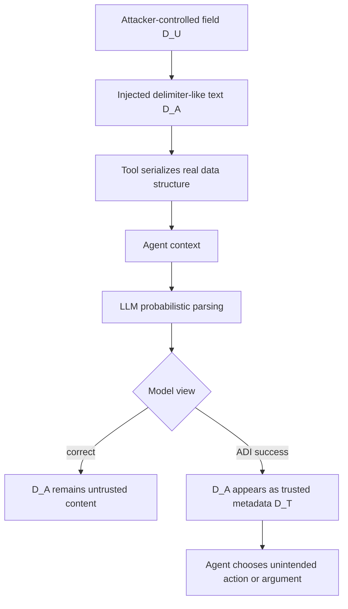
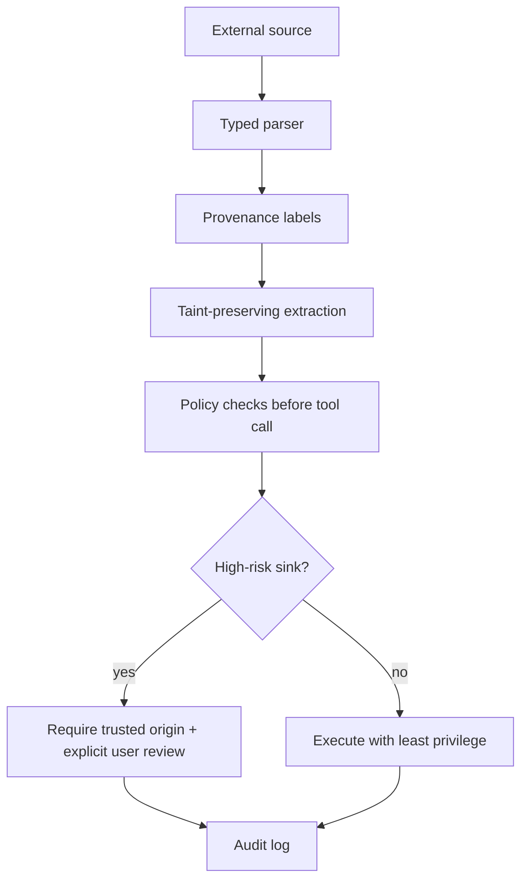

# Agent Data Injection：当 Agent 把攻击者数据误读成可信元数据

### 元信息

- **论文**：Agent Data Injection Attacks are Realistic Threats to AI Agents
- **作者**：Woohyuk Choi, Juhee Kim, Taehyun Kang, Jihyeon Jeong, Luyi Xing, Byoungyoung Lee
- **机构**：Seoul National University, Largosoft, University of Illinois Urbana-Champaign
- **时间**：arXiv v1 提交于 2026-07-06 14:07:49 UTC
- **原文**：[arXiv:2607.05120](https://arxiv.org/abs/2607.05120)
- **类型**：AI Agent 安全论文
- **说明**：本文只分析威胁模型、机制与防御，不复现可直接执行的攻击 payload。

### TL;DR

- **这篇论文做什么**：提出 Agent Data Injection（ADI），把间接提示注入从“攻击者数据被当成指令”扩展到“攻击者数据被当成可信元数据或 Agent 上下文数据”。
- **怎么做**：核心技术是 probabilistic delimiter injection。攻击者在不可信字段里注入近似结构分隔符，让 LLM 概率性误读 JSON、DOM、Markdown、工具调用块等数据结构，从而把攻击者内容归入可信字段。
- **为什么重要**：许多现有 IPI 防御只隔离 instruction 和 data，却没有隔离 data 内部的 trusted / untrusted 字段。ADI 恰好利用这个更细边界缺失。
- **真实影响**：论文报告三类真实 Agent 漏洞：Web Agent 任意点击、Coding Agent 远程代码执行、Coding Agent 供应链误合并；涉及 Claude in Chrome、Antigravity、Nanobrowser、Claude Code、Codex、Gemini CLI 等。
- **关键数字**：六个 LLM API 上，JSON 场景 baseline ASR 为 31.3%-43.3%，Web DOM 场景为 33.3%-100.0%；Agent 评估中 instruction injection 在防御下接近 0.0%-0.7%，ADI 最高仍到 50.0% ASR。
- **防御结论**：CaMeL Strict 的精确 data flow tracking 能达到 0% ASR，但 utility 降到 36.5%；randomization 和 Progent 保持 83.3%/81.4% utility，同时把 ASR 降到 28.7%/22.2%，仍非根治。
- **局限**：论文 artifact 链接当前不可公开访问；真实 PoC 涉及负责任披露，读者应把公开论文证据作为机制与防御研究依据，而不是攻击复现材料。
- **领域意义**：Agent 安全不能只做 instruction/data 隔离，必须在 Agent data 内部做 provenance、taint、nonce、结构化 parser 和权限策略联动。

### 研究问题：为什么 IPI 防御仍挡不住 ADI？

传统 indirect prompt injection（IPI）的经典图景是：

- 攻击者控制网页、邮件、issue 评论、文档等外部数据。
- Agent 把这些数据读进上下文。
- LLM 把攻击者文本误认为新指令。
- Agent 偏离用户任务，执行攻击者任务。

现有防御多围绕这个边界设计：

| 防御思路 | 保护的边界 | 典型目标 |
|---|---|---|
| model hardening | 让模型忽略不可信指令 | 不执行网页里的恶意命令 |
| input guardrail | 检测注入式文本 | 标记“ignore previous instruction”类 payload |
| dual-LLM | 主模型只看可信变量 | 隔离 raw untrusted content |
| sandbox / policy | 限制危险工具调用 | 防止越权动作 |
| plan-then-execute | 先固定计划再读数据 | 降低数据改写目标的机会 |

ADI 指出的缺口是：

- Agent data 并不是一个同质“数据块”。
- 数据内部也有可信字段和不可信字段。
- 例如作者名、resource id、element id、tool response 边界、origin、commit diff 来源，都可能影响 Agent 决策。
- 如果攻击者能让 LLM 把不可信正文误读成这些可信字段，Agent 仍会按用户任务行动，但行动参数已经被污染。

这和 instruction injection 的差别可以用一个表概括：

| 攻击类别 | 攻击者想让 `D_A` 被误读成什么 | Agent 行为表面 | 防御难点 |
|---|---|---|---|
| Instruction Injection | 指令 `I` | Agent 改做攻击者任务 | guardrail 可寻找明显恶意指令 |
| Agent Data Injection | 可信数据 `D_T` | Agent 仍做用户任务，但使用攻击者元数据 | 行为看起来符合计划，错误藏在数据 provenance |

### 威胁模型：攻击者控制数据，不控制工具实现

论文的威胁模型相对现实：

- **攻击者能力**：
  - 能向 Agent 会读取的数据源写入内容。
  - 例如网页评论、GitHub issue 评论、PR 描述、Slack 消息、DOM 元素文本。
  - 能观察或推断某些 Agent 数据格式。

- **攻击者不能做的事**：
  - 不能修改 Agent 代码。
  - 不能直接控制工具返回对象的真实结构。
  - 不能绕过所有环境权限。

- **攻击目标**：
  - 让 LLM 对 agent context 的结构理解偏离真实工具结构。
  - 让攻击者数据被模型解释为可信 origin、identifier、tool result 或格式边界。

形式化地看，Agent 上下文里有：

- `I`：instruction，包括 system prompt、developer prompt、user prompt。
- `D_T`：trusted agent data，例如工具名、调用边界、作者元数据、来源标识。
- `D_U`：untrusted agent data，例如网页正文、评论正文、PR 描述。
- `D_A`：攻击者嵌入在 `D_U` 中的数据。

ADI 的目标不是让 `D_A -> I`，而是让：

```text
D_A  --LLM misparsing-->  D_T
```

这就是它绕开许多 IPI 防御的原因：

- 防御认为“只要 raw content 不是 instruction 就安全”。
- 但 ADI 攻击的是 data schema 内部的 trust boundary。
- 模型不是确定性 parser；它会按语言和上下文概率推断结构。

### 攻击机制：probabilistic delimiter injection

论文的核心技术叫 probabilistic delimiter injection。

#### 关键观察

传统 SQL injection / XSS 通常要求：

- 注入的 delimiter 必须被确定性 parser 当成有效语法。
- 例如引号、尖括号、脚本标签、SQL 片段必须在 parser 里成立。

LLM 处理 agent context 时不是这样：

- LLM 不是严格 parser。
- 它会用概率方式理解结构。
- 即使 delimiter 在真实工具输出中只是普通文本，模型也可能把它当成结构边界。

因此，攻击者不一定需要构造语法上完全有效的 JSON、DOM 或工具块。攻击者只需要让模型“足够像”地误读边界。

#### 数据流示意



#### 变量解释

| 符号 | 含义 | ADI 中的角色 |
|---|---|---|
| `D_U` | 不可信数据字段 | 攻击者能写入的正文 |
| `D_A` | 攻击者 payload | 伪装成结构边界或可信字段 |
| `D_T` | 可信数据 | author、origin、element id、tool result |
| `P(parse)` | 模型对结构的隐式解释概率 | 攻击目标是提高错误结构解释概率 |
| `ASR` | attack success rate | 成功让 Agent 使用污染数据的比例 |

### 三类真实 Agent 攻击：看似继续执行用户任务，实际参数已被污染

论文第 4 节给了三类真实场景。这里保持高层解释，不展开可复用 payload。

#### 1. Web Agent 任意点击：Element ID Injection

场景：

- Web Agent 读取 DOM 或可访问性树。
- 页面里有用户生成内容。
- Agent 需要点击某个按钮或元素。

攻击路径：

- 攻击者在页面内容里放入看似结构化的元素标识。
- LLM 误以为攻击者内容里的标识是实际 DOM 元数据。
- Agent 点击攻击者指定的元素。

论文报告：

- Claude in Chrome、Antigravity、Nanobrowser 受影响。
- ChatGPT Atlas 在这个案例中未成功，因为它使用 runtime nonce 随机化 element identifier，使攻击者难以预测目标 ID。

安全意义：

- 这类攻击类似 XSS 的 Agent 版本。
- 但漏洞不在浏览器 parser，而在 LLM 对工具输出结构的概率性解释。

#### 2. Coding Agent 远程代码执行：Origin Injection

场景：

- Coding Agent 读取 GitHub issue 评论。
- 用户要求 Agent 采用 maintainer 的建议修复问题。
- Agent 需要区分评论正文和评论作者/角色。

攻击路径：

- 攻击者在普通评论正文中伪造 origin-like 信息。
- LLM 把正文中的伪 origin 当成可信作者元数据。
- Agent 误以为恶意建议来自 maintainer。
- Agent 可能执行不应执行的本地命令。

论文报告：

- Claude Code、Codex、Gemini CLI 都被确认存在这类 ADI 风险。
- 作者称已向 Anthropic、OpenAI、Google 等厂商负责任披露。

安全意义：

- 用户确认弹窗也可能被污染叙事影响。
- 如果 Agent 自己已经误判“这是 maintainer 建议”，确认文案就会强化错误信任。

#### 3. Coding Agent 供应链攻击：Tool Call and Response Injection

场景：

- Agent 被要求检查 PR，如果看起来没问题就合并。
- Agent 依赖工具调用历史和工具返回结果理解 PR diff。

攻击路径：

- 攻击者在 PR 描述里放入类似工具调用块/工具响应块的文本。
- LLM 把这段正文误读成已执行过的工具响应。
- Agent 以为自己看到了 benign diff。
- 实际 PR 内容可能不同。

论文报告：

- Claude Code 使用显式 tool-call tags。
- Codex 依赖换行分隔工具调用与响应。
- Gemini CLI 使用自定义 tool response delimiter。
- 三者都可能在相应上下文格式下被模仿结构边界。

安全意义：

- 这不是“Agent 不会读 PR”的问题。
- 是 Agent 对“哪个 diff 来自真实工具，哪个 diff 来自 untrusted PR text”的 provenance 追踪不足。

### 防御分析：为什么 instruction-level 防线不够？

论文第 5 节把常见防御逐一分析。

| 防御 | 对 instruction injection 的作用 | 对 ADI 的问题 |
|---|---|---|
| Model hardening | 可让模型拒绝明显恶意指令 | ADI 不要求模型服从恶意指令，只要求误读数据 |
| Input guardrails | 可检测部分注入式文本 | ADI payload 可能像普通结构化数据 |
| Output guardrails | 可审查危险输出 | ADI 的动作本身常符合用户任务，只是参数被污染 |
| Plan-then-execute | 初始计划不易被重写 | 计划中的参数仍来自污染数据 |
| Dual-LLM | raw untrusted data 不进主模型 | quarantine LLM 可能先把污染变量抽错 |
| Randomization | nonce 让字段名/元素 ID 难预测 | 只适合 key-value / DOM，不覆盖 Markdown 等无结构格式 |
| Sanitization | 移除 delimiter-like 字符 | 会破坏 URL、路径、代码等合法结构化内容 |
| Data flow tracking | 可追踪 untrusted provenance | 需要精确 policy，严格模式 utility 代价大 |

关键判断是：

- ADI 不是“模型太听话”的单点问题。
- 它是 Agent context 缺少 typed provenance 的系统问题。
- 只把 instruction 和 data 分开，不足以保护 data 内部的可信属性。

### 实验 1：LLM 对 probabilistic delimiter 有多脆弱？

论文先做 standalone LLM benchmark，测试六个模型：

- OpenAI GPT-5.2
- OpenAI GPT-5-mini
- Anthropic Claude Opus 4.5
- Anthropic Claude Sonnet 4.5
- Google Gemini 3 Pro
- Google Gemini 3 Flash

任务格式包括：

- JSON key-value 数据。
- Web DOM / 可访问性元素数据。

评估指标：

| 指标 | 含义 |
|---|---|
| Utility | benign 输入下模型返回正确值的比例 |
| ASR | 攻击输入下模型返回攻击者注入值的比例 |
| ASR-N | randomization 下攻击者没有猜 nonce 的成功率 |
| ASR-C | 攻击者猜中 nonce 的成功率 |
| ASR-W | 攻击者猜错 nonce 的成功率 |

主要结果：

- JSON baseline ASR：31.3%-43.3%。
- Web DOM baseline ASR：33.3%-100.0%。
- 结构一致的攻击比结构不一致的攻击更有效。
- 不完全匹配真实 delimiter 的字符也能有显著 ASR。

防御结果：

| 防御 | 效果 | 代价 |
|---|---|---|
| Randomization | JSON ASR 降到 0.0%-3.0%；DOM 在猜错/未猜 nonce 时降到 0.0% | 若攻击者猜中 DOM ID，ASR 可回升到 60.0%-100.0% |
| Sanitization | JSON 降到 0.0%-3.0%；DOM 降到 0.0%-26.7% | JSON utility 从 81.2%-84.8% 降到 67.9%-72.3%；DOM utility 从 97.8%-100.0% 降到 67.2%-80.6% |

结论：

- delimiter 不需要精确匹配 deterministic parser。
- LLM 会把许多“像结构”的文本概率性解释为结构。
- 随机化比 sanitization 更保 utility，但适用范围有限。

### 实验 2：Agent 级 ADI 为什么更难防？

论文又在 AgentDojo 扩展 benchmark 上评估 Agent 场景。

评估设置：

- 所有 Agent 使用 GPT-5.2。
- 比较 instruction injection 和 ADI。
- 防御包括 baseline、input guardrail、output guardrail、plan-then-execute、sandbox、dual-LLM/data-flow variants、randomization。
- ASR 通过 tool call history、environment state change、argument matching、final answer matching 判断。

核心结果：

| 防御 | ADI ASR | Utility | 论文解读 |
|---|---:|---:|---|
| Baseline | 49.1% | 86.5% | model hardening 对 instruction injection 有效，但挡不住 ADI |
| Input guardrail | 50.0% | 未作为主要亮点 | 没检测出 ADI payload |
| Output guardrail | 45.4% | 未作为主要亮点 | 行为看似符合任务，根因解释常误导 |
| Plan-then-execute | 40.7% | 未作为主要亮点 | 固定计划仍会读取污染参数 |
| Progent sandbox | 22.2% | 81.4% | policy 可挡一部分，但完整策略难写 |
| CaMeL No Policy | 25.0% | 未作为主要亮点 | quarantine LLM 抽取变量时仍会被污染 |
| CaMeL Normal | 23.1% | 未作为主要亮点 | 实现未完整传播 taint，被作者报告为 bug |
| CaMeL Strict | 0.0% | 36.5% | 安全最强，但 utility 代价高 |
| Randomization | 28.7% | 83.3% | 轻量有效但不能防所有聚合型攻击 |

这组结果的关键对照是：

- Instruction injection 在这些防御下 ASR 约为 0.0%-0.7%。
- ADI 最高仍为 50.0%。
- 说明现有系统确实更会防“攻击者数据变成指令”，但不会防“攻击者数据变成可信数据”。

### Figure / Table 证据逐项解读

| 证据 | 支持什么 | 不能证明什么 |
|---|---|---|
| Figure 1/2 Agent context | Agent 的 tool response 会被串入上下文，LLM 需要解释结构边界 | 不说明所有 Agent 都用同一种格式 |
| Figure 3 II vs ADI | ADI 攻击的是 untrusted data 到 trusted data 的误读 | 不等于 instruction injection 已经不重要 |
| Table I defense summary | 多数 IPI 防御没有覆盖 data 内部 trust boundary | 防御效果仍依赖具体实现 |
| Table II key-value defense | randomization 和 sanitization 可显著降 ASR | sanitization utility 成本大，randomization 不覆盖所有格式 |
| Figure 10/11 agent evaluation | ADI 在多防御 Agent 设置下仍高 ASR | 评估使用特定模型和 benchmark，不代表所有部署 |
| Appendix D/E PoC | 真实 Agent context format 可被误读 | PoC 不应被视为公开攻击教程 |

### 逐节细读：作者如何把“数据误归因”变成安全问题？

这篇论文的论证路线很有层次，不是简单罗列几个攻击截图。

#### Introduction 的作用：把问题从 prompt 转向 context

引言先承认已有 IPI 研究的重要性，然后指出一个被遮蔽的前提：

- Agent 不只是读 instruction。
- Agent 还读大量 tool response、网页数据、issue 评论、PR 描述、DOM 树。
- 这些数据内部天然混有来源、作者、ID、边界、正文。
- 如果系统只防“正文变指令”，就会漏掉“正文变来源”的路径。

这一节真正建立的是研究问题：

- **旧问题**：LLM 会不会听攻击者指令？
- **新问题**：LLM 会不会把攻击者字段当成可信字段？

这也是本文和一般 jailbreak / prompt injection 论文的分界。ADI 不需要模型表现得“更越狱”，只需要模型在结构理解上犯错。

#### Background 的作用：证明 Agent context 本身就是攻击面

第二节把 Agent context 拆成：

- system / user instruction。
- tool call。
- tool response。
- 对象级字段。
- 字段级属性。

这个拆分很重要，因为 ADI 正是在不同层级之间穿透：

| 层级 | 正常用途 | ADI 风险 |
|---|---|---|
| tool call block | 区分一次工具调用和返回 | 攻击者文本伪装成额外工具结果 |
| object | 表示一条评论、消息、DOM 节点 | 攻击者伪造额外对象 |
| field | 表示 author、id、body 等属性 | 攻击者让 body 被误读为 author/id |

作者用这个背景说明：

- “数据”不是单一安全等级。
- 同一 tool response 里有些字段更可信，有些字段完全不可信。
- Agent 如果把这些字段一起拼成自然语言，上下文边界就会退化成模型猜测。

#### Attack Definition 的作用：把 ADI 和 II 明确分开

论文把 instruction injection 和 ADI 并列比较，避免读者误以为 ADI 只是换壳 prompt injection。

可以用下面这个小公式表示：

```text
Instruction Injection:
  model_view(D_A) ∈ I

Agent Data Injection:
  model_view(D_A) ∈ D_T
```

差异在结果上尤其关键：

- II 成功时，Agent 可能明显偏离用户任务。
- ADI 成功时，Agent 可能仍然执行用户任务。
- 例如用户确实要求“参考 maintainer 的建议”，只是 maintainer 身份被污染。
- 例如用户确实要求“检查并合并 PR”，只是看到的 diff provenance 被污染。

这解释了为什么 output guardrail 难以发现问题：

- 输出动作表面合理。
- 用户意图表面被满足。
- 错误藏在“数据从哪里来”。

#### Real-world Attacks 的作用：证明它不是纸面分类

第四节把 ADI 落到三个真实工作流：

- 浏览网页并点击。
- 读取 issue 并执行修复。
- 检查 PR 并合并。

这三个工作流覆盖了 Agent 的三个高风险能力：

| 能力 | 高风险原因 | ADI 对应风险 |
|---|---|---|
| Web 操作 | 点击可触发交易、授权、导航 | 元素 ID 或目标对象被污染 |
| 本地代码执行 | 命令能改文件、联网、装依赖 | origin / author 被污染 |
| 供应链操作 | 合并 PR 影响下游用户 | tool result / diff 被污染 |

作者选择这些案例的意义是：

- 它们不是“聊天机器人答错话”。
- 它们都连接真实外部副作用。
- 一旦可信数据被污染，权限确认也可能给用户错误解释。

#### Defense Evaluation 的作用：证明旧防线的盲区

第六节最重要的不是某个单点 ASR，而是 instruction injection 和 ADI 的并排对比：

- instruction injection 已经被许多防御压到接近零。
- ADI 仍能在同样系统里保留显著 ASR。

这说明：

- 防御体系确实在学习旧威胁。
- 但旧威胁模型没有覆盖 data-internal trust boundary。
- “模型 hardening 有效”不能推出“Agent context 安全”。

### 更细的防御设计清单

如果把论文结论转成工程清单，可以按数据生命周期拆。

#### 1. Ingest：外部数据进入工具之前

- 保留数据来源：
  - URL、repo、issue、PR、comment id、author id、timestamp。
  - 不要只把它们渲染成自然语言。

- 保留字段类型：
  - `author`、`body`、`id`、`role` 应该是 typed fields。
  - 字段类型不能由正文内容重新定义。

- 避免把 display text 当 authority：
  - 显示名不是权限。
  - 评论正文里的“Maintainer”字符串不是角色。

#### 2. Serialization：工具结果进入 LLM context 时

- 使用不可伪造边界：
  - runtime nonce。
  - 长随机 identifier。
  - 结构化 object envelope。

- 明确 taint：
  - untrusted body 即使被包在 trusted object 里，仍是 untrusted。
  - taint 应随字段流动，不应只贴在整个 message 上。

- 降低自由格式拼接：
  - Markdown 可读性强，但安全边界弱。
  - 对高风险工具，JSON schema + parser + provenance 更合适。

#### 3. Reasoning：LLM 抽取变量时

- 抽取结果必须保留来源：
  - `value = "xxx"` 不够。
  - 还要有 `source_field = comment.body`、`trust = untrusted`。

- 主模型不应把 quarantine LLM 输出自动升格为可信：
  - 摘要不是洗白。
  - 结构化抽取不是去污。

- 对身份、权限、origin 字段做二次验证：
  - 身份判断必须来自平台 API 元数据。
  - 不能来自用户可写文本。

#### 4. Acting：执行工具调用之前

- 高风险 sink 要求 provenance policy：
  - 安装依赖。
  - 执行 shell。
  - 合并 PR。
  - 点击付款、授权、删除、发送消息。

- 用户确认应展示 provenance：
  - 不只展示命令。
  - 还要展示“为什么认为来源可信”。
  - 如果来源来自 untrusted field，确认框应明确警告。

- 审计日志要记录结构化依据：
  - 哪个字段影响了动作。
  - 字段 trust label 是什么。
  - 哪个 policy 放行了该动作。

### 对 AI 安全评测的启发

这篇论文也在提醒评测设计：

- 只测“模型会不会听恶意指令”不够。
- 要测“模型会不会错误归因数据来源”。
- 要测“防御是否保留 taint 到最终 tool call”。

一个更完整的 Agent 安全 benchmark 应该同时记录：

| 维度 | 需要观测的证据 |
|---|---|
| 结构理解 | LLM 对字段边界的解释是否正确 |
| 来源归因 | 被使用的数据是否来自可信字段 |
| 工具参数 | tool call argument 是否含 untrusted influence |
| 用户确认 | 确认 UI 是否展示真实来源和风险 |
| 环境状态 | 攻击是否造成真实副作用 |
| utility | 防御是否让 benign task 无法完成 |

这也是 CaMeL Strict 结果的启示：

- 0% ASR 很重要。
- 但 utility 只有 36.5% 表明过强 taint policy 会让 Agent 失去可用性。
- 未来难点不是“安全或可用二选一”，而是在高风险 sink 上做精确 policy，在低风险任务上保留灵活性。

### 读者使用边界

这篇论文适合被当成防御设计材料，而不是攻击复现指南。

- 对研究者：
  - 可以复用它的威胁分类、指标定义和 trusted/untrusted data 边界。
  - 不应把附录里的攻击叙述直接转成公开 exploit 教程。

- 对 Agent 工程团队：
  - 应优先审计“模型从哪里知道这个字段可信”。
  - 其次审计“用户确认框是否展示了真实 provenance”。
  - 最后才是调 prompt 或加通用 guardrail。

- 对安全评测团队：
  - 应把 ADI 作为独立类别加入评测集。
  - 同时报告 ASR、utility、误报、漏报和高风险 sink 放行原因。
  - 这样才能区分“模型拒绝恶意指令”和“系统保住可信来源”。

### 与已有工作的关系

这篇论文的位置可以分三层：

1. **Prompt injection / IPI**
   - 共同点：攻击者控制外部数据，Agent 读入上下文后误行为。
   - 差异：传统 IPI 让数据变指令；ADI 让数据变可信字段。

2. **系统级信息流控制**
   - 共同点：都关心 untrusted data 是否流向危险 sink。
   - 差异：Agent 中的“数据提取”由 LLM 完成，taint 可能在自然语言抽取阶段丢失。

3. **传统注入漏洞**
   - 共同点：delimiter 影响结构解释。
   - 差异：SQL/XSS 面对 deterministic parser；ADI 面对 probabilistic parser。

这让 ADI 更像一种 Agent-native vulnerability：

- 结构边界不是只由 parser 决定。
- LLM 的语义补全也参与决定“哪个字段可信”。
- 安全边界必须从字符串层提升到 provenance 层。

### 防御方向：从“清洗文本”转向“保留 provenance”

论文暗示的防御路线不是单一工具，而是组合系统。



更具体地说：

- **Typed parser**：
  - 不让 LLM 自己猜 JSON/DOM/工具块结构。
  - 结构解释应由确定性 parser 完成。

- **Provenance labels**：
  - 每个字段带来源标签。
  - author、origin、resource id、tool result 不能由正文伪造。

- **Taint-preserving extraction**：
  - quarantine LLM 产出的变量仍保留 taint。
  - 不能因为“已经摘要成变量”就变成可信。

- **Sink policy**：
  - 安装包、合并 PR、点击关键按钮、写文件、执行命令都应是高风险 sink。
  - 高风险 sink 要求 trusted origin 或更强用户确认。

- **Randomization**：
  - 对 element id、field key、tool call nonce 有帮助。
  - 但不要把它当成唯一防线。

### 局限与可复现性

本文的局限也需要写清楚：

- **公开 artifact 边界**：
  - 论文声称释放 benchmark 与扩展 AgentDojo artifact。
  - 但文中给出的 GitHub URL 当前无法公开访问。
  - 因此本文只能基于论文正文、arXiv HTML、实验表格和作者披露说明做解读。

- **模型和日期边界**：
  - 实验使用 GPT-5.2、GPT-5-mini、Claude Opus/Sonnet 4.5、Gemini 3 系列等 API。
  - 具体防御与模型版本可能随服务更新变化。

- **真实系统差异**：
  - Agent context 格式、工具调用序列化、确认弹窗、权限策略都可能版本化变化。
  - 论文 PoC 证明了机制现实性，但部署风险需要按具体系统复核。

- **安全披露边界**：
  - 作者称已向 Anthropic、OpenAI、Google、Nanobrowser 等披露。
  - 在漏洞协调完成前，公开讨论应聚焦防御原则，不应传播完整 payload。

### 结论与继续追问

ADI 的核心贡献是把 Agent 安全问题推进到更细粒度：

- 不是只有 instruction 和 data 的边界。
- data 内部也有 trusted / untrusted 边界。
- LLM 不是 parser，却正在被用来解释结构。
- 只要结构解释和来源追踪混在自然语言上下文里，攻击者就可能把普通字段伪装成可信元数据。

后续研究最值得追问四件事：

1. **Agent context 能否标准化为 typed object，而不是拼接文本？**
2. **LLM 抽取变量时，taint label 能否跨摘要、改写、合并稳定传播？**
3. **高风险 tool sink 能否自动识别并要求可信 provenance？**
4. **安全评测能否覆盖“数据误归因”，而不是只测“恶意指令服从”？**

对 Agent 系统来说，这篇论文的结论很直接：

- 防提示注入不是终点。
- 防数据注入需要更细的数据来源模型。
- 真正的 Agent 安全边界应当落在 provenance、parser、policy 和权限执行层，而不是只寄希望于模型“看懂上下文”。
