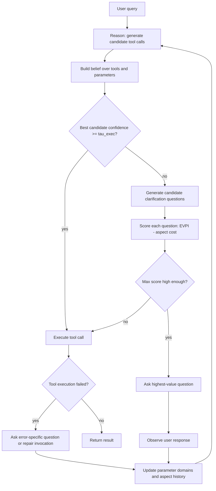

# Structured Uncertainty guided Clarification for LLM Agents：把“该不该追问”从提示词习惯改写成工具参数上的价值计算

## 元信息与 TL;DR

- **原文**：[Structured Uncertainty guided Clarification for LLM Agents](https://aclanthology.org/2026.findings-acl.2028/)，Manan Suri、Puneet Mathur、Nedim Lipka、Franck Dernoncourt、Ryan A. Rossi、Dinesh Manocha。
- **会议与日期**：Findings of ACL 2026，ACL Anthology 页面给出 2026 年 7 月、页码 40811-40838；Adobe Research 官方页面标注 publication date 为 2026-07-07。
- **主题归类**：大模型 Agent 与后训练交叉。论文一边提出推理时的 SAGE-Agent，一边把同一套结构化不确定性转成 GRPO 奖励信号。
- **核心问题**：工具调用 Agent 遇到模糊指令时，常见失败不是“不会调用工具”，而是过早调用、问错问题、重复追问或把不可执行请求当成可执行请求。
- **方法一句话**：作者把待调用工具、参数、参数域和值的缺失程度建成显式 belief state，用 EVPI 衡量每个澄清问题能把最佳候选工具调用的置信度提高多少，再用 aspect-level cost 惩罚重复追问。
- **推理实验**：ClarifyBench 覆盖文档、车辆、股票、旅行、文件系统 5 个域，合计 716 个样本、92 个工具、显式/模糊/不可行三类请求；在 GPT-4o 上，SAGE-Agent 在模糊任务覆盖率达到 59.73%，高于 Domain-aware ReAct 的 55.70%，平均问题数从 2.56 降到 1.39。
- **后训练实验**：作者在 When2Call 上训练 Qwen2.5-3B/7B，使用 uncertainty-weighted GRPO；3B 的 direct prompting accuracy 从 36.5% 提升到 65.2%，7B 从 36.7% 到 62.9%。
- **关键局限**：ClarifyBench 的模糊与不可行请求主要由规则和 GPT-4o 扩增，再经人工筛选；SAGE-Agent 依赖工具 schema、参数域解释和用户模拟器质量；训练奖励里的 action 分类也有关键词启发式，因此数字不能直接外推到开放世界 Agent。

### 为什么这篇值得读？

- 它没有把“多问一句”当成提示词风格，而是问一个更硬的问题：
  - 当前最可能的工具调用候选有多确定？
  - 一个问题能减少多少参数层面的不确定性？
  - 这个问题是否只是重复问已经问过的 aspect？
  - 不问问题而直接执行，风险是否已经低到可以接受？
- 这使论文同时回应了 Agent 安全和交互效率的张力：
  - 只追求安全会导致过度澄清，用户负担升高。
  - 只追求效率会导致工具调用越权、错参或错误拒绝。
  - 作者试图把二者放进同一个 `EVPI - Cost` 决策面。

## 研究问题：模糊指令为什么不是普通语言理解问题？

### 旧问题被论文重新切开

- 在常规对话任务里，澄清问题通常被建模为一段自然语言：
  - 模型发现上下文不够；
  - 生成一个追问；
  - 用户回答后继续生成。
- 但工具调用 Agent 的失败边界更具体：
  - 工具名是否选对；
  - 必填参数是否都有值；
  - 参数值是否落在工具 schema 允许的域内；
  - 多个候选工具调用之间是否还存在歧义；
  - 请求本身是否因为冲突约束或非法参数而不可执行。

### 作者真正关心的不是“会不会问”，而是“问哪个 aspect”

论文把一个澄清问题绑定到 aspect：

| 概念 | 在论文里的作用 | 为什么比普通追问更强 |
|---|---|---|
| tool | 当前可调用的 API 或函数 | 决定行动空间，不只是文本意图 |
| parameter | 工具参数，例如日期、联系人、路线 | 决定错误执行的具体位置 |
| domain | 参数可能值集合 | 可计算不确定性，而不是凭感觉 |
| aspect | `(tool, parameter)` | 让问题有明确目标，可追踪是否重复 |
| belief state | 候选工具调用概率与参数域状态 | 让 Agent 在多轮交互中更新判断 |

### 论文的失败案例直觉

- 用户说“帮我打给工作上的 Alex”，联系人列表里可能有多个 Alex。
- 用户说“周六让 Maya 帮我取派对用品”，Maya 可能也有多个联系方式。
- 普通语言模型可能直接补全最可能联系人。
- SAGE-Agent 的目标是先意识到：
  - `contact_name` 不唯一；
  - `phone_type` 或 `recipient_id` 仍有多个候选；
  - 一个针对联系人身份的问题比泛泛询问“能否提供更多信息”更有价值。

## 论文主张与论证路线

| Claim | Mechanism | Evidence | Boundary |
|---|---|---|---|
| 工具调用澄清应在参数结构上计算，而不是只靠自然语言提示 | 把候选工具调用、参数域和缺失值转成 belief state | SAGE-Agent 在 ClarifyBench 三类请求上覆盖率、TMR、PMR 更高 | 前提是工具 schema 足够清楚，参数域可被解释 |
| 追问的价值可以用信息价值衡量 | EVPI 衡量问题后最佳候选置信度的期望提升 | GPT-4o 模糊任务覆盖率 59.73%，问题数 1.39 | EVPI 估计依赖候选生成质量和响应模型 |
| 重复追问可以用 aspect cost 控制 | `Cost(q,t)=lambda * sum n_a(t)` 惩罚问过的 aspect | λ 从 0 到 0.5 时问题数下降 18.1%-26.6%，核心指标小于 3% 偏移 | λ 是超参数，跨域稳定性仍需更多真实用户验证 |
| 结构化不确定性还能当训练信号 | certainty-weighted GRPO 对 ASK/TOOLCALL 奖励加权 | When2Call 上 3B direct accuracy 到 65.2%，7B 到 62.9% | 训练集来自 When2Call，action 分类含启发式标签 |
| ClarifyBench 补上动态多轮工具澄清评测缺口 | 用户模拟器维护真实意图，并回应澄清问题 | 716 样本、92 工具、5 域、三类请求，Cohen's kappa=0.76 | 模糊样本由 obfuscation 与 GPT-4o 扩增，仍是受控评测 |

## 方法机制：结构化不确定性如何被定义？

### 从候选工具调用到 belief state

论文的基本对象不是一句回答，而是一组候选工具调用：

```text
Candidate c_i = tool_i(arg_1, arg_2, ..., arg_m)
```

- 每个参数可能处于三种状态：
  - 已确定，例如 `date = March 15`；
  - 未知，例如 `<UNK>`；
  - 受约束但未唯一确定，例如 `class in {economy, premium}`。
- 每个候选工具调用有一个 viability score：
  - 参数越完整，候选越可执行；
  - 参数域越大，不确定性越高；
  - 用户回答会把参数域收窄，并重新归一化候选概率。

### EVPI：一个问题的价值是什么？

论文定义的核心公式可以重写为：

```math
EVPI(q, B(t)) =
E_r [ max_c pi_c(t | q, r) ] - max_c pi_c(t)
```

变量解释：

| 变量 | 含义 |
|---|---|
| `q` | 候选澄清问题 |
| `B(t)` | 第 t 轮 belief state |
| `r` | 用户对问题 q 的可能回答 |
| `pi_c(t)` | 当前候选工具调用 c 的概率或可行度 |
| `max_c pi_c(t)` | 当前最可信候选的置信度 |
| `EVPI` | 问 q 后，最佳候选置信度的期望提升 |

这个公式的意义很直接：

- 如果一个问题只能让自然语言更好看，但不能提升最佳工具调用的确定性，它的 EVPI 应该低。
- 如果一个问题能把两个高风险候选区分开，它的 EVPI 应该高。
- 如果当前最佳候选已经足够明确，继续追问的边际收益会接近零。

### Cost：为什么不能一直问？

论文用 aspect-level cost 惩罚重复追问：

```math
Cost(q,t) = lambda * sum_{a in A(q)} n_a(t)
```

- `A(q)` 是问题 q 涉及的 aspect 集合，例如 `(calendar.create_event, date)`。
- `n_a(t)` 是第 t 轮之前 aspect a 已被问过多少次。
- `lambda` 控制“重复问同一类参数”的惩罚强度。

于是问题选择变成：

```math
q*(t) = argmax_q [ EVPI(q, B(t)) - Cost(q,t) ]
```

停止条件也更清楚：

- 如果最高净收益低于 `alpha * max_c pi_c(t)`，就不再问。
- 如果最佳候选达到执行阈值 `tau_exec`，就执行工具。
- 如果达到最大步数，进入失败边界或错误恢复。

## SAGE-Agent 的算法流程

### 推理循环



### 伪代码

```text
Input:
  user query u
  toolkit T with tools and schemas
  thresholds tau_exec, alpha
  redundancy weight lambda
  max steps n_s

State:
  observation history O_t
  belief state B(t)
  candidate calls C_t
  aspect query counts n_a(t)

Loop:
  1. Generate candidate tool calls C_t from (u, O_t, T).
  2. Compute viability pi_c(t) for each candidate c.
  3. If max_c pi_c(t) >= tau_exec:
       execute best candidate and stop.
  4. Generate clarification questions Q_t and target aspects A(q).
  5. For each q in Q_t:
       estimate EVPI(q, B(t))
       compute Cost(q,t)
       Score(q,t) = EVPI(q,B(t)) - Cost(q,t)
  6. If max_q Score(q,t) < alpha * max_c pi_c(t):
       execute best candidate or enter bounded failure path.
  7. Ask q* with highest score.
  8. Update parameter domains using user response.
  9. Increment n_a(t) for targeted aspects.
  10. Repeat until success, failure, or n_s.

Output:
  tool call, clarification, refusal, direct answer, or bounded failure.
```

### 这个流程的关键设计

- **候选先行**：不是先写一个追问，而是先列出可能工具调用。
- **问题带目标**：每个问题必须说明自己试图解决哪个参数 aspect。
- **回答是约束更新**：用户回答不是简单拼进上下文，而是收窄参数域。
- **停止条件可解释**：不再追问不是因为“模型觉得够了”，而是净信息收益不够。
- **失败可回路**：工具调用失败后可以生成 error-specific question，而不是直接崩溃。

## ClarifyBench：评测不是单轮函数调用

### 数据规模与构造

论文提出 ClarifyBench，是为了评测多轮动态澄清，而不是只看单轮 function calling：

| 指标 | 数值或说明 |
|---|---|
| 总样本 | 716 |
| 工具数 | 92 |
| 域 | Documents、Vehicle Control、Stocks、Travel、File System |
| 显式请求 | 241 |
| 模糊请求 | 213 |
| 不可行请求 | 198 |
| 平均 follow-up | 2.4 |
| 人工一致性 | Cohen's kappa = 0.76 |

构造路线：

1. 从 DocPilot 抽取真实文档处理交互。
2. 从 BFCL-v3 引入车辆、股票、旅行和文件系统工具调用。
3. 对成功工具调用随机遮蔽最多 3 个参数，让 GPT-4o 生成缺失信息的用户请求。
4. 对不可行请求使用手写 API 错误规则，制造非法参数、冲突约束或不可能条件。
5. 用人工标注检查自然性、忠实性和错误诱因是否存在。

### 三类请求分别测什么？

| 请求类型 | 测试能力 | Agent 常见失败 |
|---|---|---|
| Explicit | 明确请求下能否不多问、直接执行 | 过度澄清、低效 |
| Ambiguous | 参数缺失或多义时能否问对问题 | 猜测参数、问泛泛问题 |
| Infeasible | 请求不可执行时能否识别错误边界 | 调用必然失败的工具、错误拒绝 |

### 评测指标

| 指标 | 论文含义 | 阅读时应关注什么 |
|---|---|---|
| Coverage | 工具和所有必需参数完全匹配 ground truth 的比例 | 最硬的成功率指标 |
| TMR | tool match rate，工具名是否选对 | 区分“选错工具”和“参数错” |
| PMR | parameter match rate，参数值是否恢复 | 看澄清是否真的解决了槽位 |
| Avg #Q | 平均澄清问题数 | 看效率和用户负担 |

## 实验结果：SAGE-Agent 赢在哪里？

### Table 3：多轮 ClarifyBench 主结果

| Base LLM | Split | SAGE Coverage | 最强基线 Coverage | SAGE Avg #Q | 对照 Avg #Q |
|---|---|---:|---:|---:|---:|
| GPT-4o | Ambiguous | 59.73 | Domain-aware ReAct 55.70 | 1.39 | 2.56 |
| GPT-4o | Explicit | 71.67 | Domain-aware ReAct 68.11 | 1.08 | 2.10 |
| GPT-4o | Infeasible | 67.33 | Active Task Disambiguation 65.27 | 1.26 | 2.63 |
| Qwen2.5-14B | Ambiguous | 54.56 | ProCOT 52.45 | 1.41 | 1.89 |
| Qwen2.5-14B | Explicit | 64.62 | SAGE-Heuristic 62.45 | 0.93 | 1.23 |
| Qwen2.5-14B | Infeasible | 61.84 | SAGE-Heuristic 59.88 | 1.49 | 1.75 |

解读：

- SAGE-Agent 的优势不是单一指标暴涨，而是 **Coverage 上升且问题数下降**。
- GPT-4o 模糊请求中，SAGE 比普通 ReAct + ask_question 多 16.85 个 coverage 点，同时问题数几乎减半。
- Qwen2.5-14B 的绝对表现低于 GPT-4o，但相对趋势保留，说明方法不完全依赖某个闭源模型。
- SAGE-Heuristic 只看 `<UNK>` 触发追问，不做 EVPI 选择；它接近但弱于完整 SAGE，说明 EVPI 的问题排序贡献了额外收益。

### Figure 4：结构化推理并不必然更耗

作者报告：

- ReAct、ProCOT、Domain-aware ReAct 使用约 14K-18K tokens 和 14-16 次调用，但性能更低。
- Active Task Disambiguation 为了计算问题和方案矩阵，达到约 24K tokens 和 40 次调用。
- SAGE-Agent 用约 22K tokens，但比 Active Task Disambiguation 少 54% 调用。

这里的关键不是“最省 token”，而是：

- 它把不确定性放到 schema 参数空间；
- 避免枚举大量自然语言方案；
- 用更少调用达到更好的 Coverage/TMR/PMR 平衡。

### Figure 5：λ 控制重复追问

论文测试 `lambda in {0, 0.5, 1.0}`：

| Split | λ 从 0 到 0.5 的变化 | 论文结论 |
|---|---|---|
| Ambiguous | 问题数下降 18.1% | Coverage/TMR/PMR 小于 3% 偏移 |
| Explicit | 问题数下降 26.6% | 多数被惩罚问题是冗余问题 |
| Infeasible | 问题数下降 24.2% | 不损伤主要执行指标 |

这说明 cost 项不是装饰性正则：

- 它直接处理“Agent 反复问同一参数”的交互失败。
- 它把“少打扰用户”变成可调超参数。
- 它也暴露一个边界：不同应用场景可能需要不同 λ，医疗、金融、代码执行和旅行预订的容错成本并不一样。

### Table 4：When2Call 单轮动作分类

论文还在 BFCLv2/When2Call 上比较三类动作：

- ToolCall；
- AskQuestion；
- Decline。

GPT-4o 上的要点：

| 方法 | ToolCall precision | AskQuestion F1 | Decline F1 | 说明 |
|---|---:|---:|---:|---|
| ReAct | 0.71 | 0.64 | 0.69 | 工具调用召回高，但拒绝较弱 |
| Active Task Disambiguation | 0.61 | 0.56 | 0.73 | 更爱问，但 Ask precision 低 |
| SAGE-Agent | 0.80 | 0.65 | 0.78 | 三类动作更均衡 |

这张表补充了 Table 3：

- SAGE 不是靠“总是问问题”提升安全。
- 它也不是靠“总是拒绝”减少错误工具调用。
- 它真正改进的是动作边界：何时调用、何时问、何时拒绝。

## 后训练：把结构化不确定性写进 GRPO 奖励

### 训练设置

作者用 Qwen2.5-Instruct 3B 和 7B 训练：

| 项目 | 设置 |
|---|---|
| 起点模型 | unsloth/Qwen2.5-3B-Instruct、unsloth/Qwen2.5-7B-Instruct |
| 训练方法 | GRPO |
| 适配方式 | LoRA rank 64，attention 与 MLP projection layers |
| epoch | 1 |
| learning rate | 5e-6 |
| max sequence length | 1024 |
| optimizer | AdamW 8-bit |
| 训练硬件 | 4x L40S |

### 奖励函数

基础奖励由三部分相加：

```math
r_total = r_fmt + r_tool + r_cls
```

| 奖励项 | 作用 |
|---|---|
| `r_fmt` | XML 格式合规，例如 `<reasoning>` 与 `<answer>` |
| `r_tool` | 工具名和参数是否匹配 ground truth |
| `r_cls` | 动作分类是否正确：TOOLCALL、ASK、REFUSE、DIRECTLY |

certainty-weighted GRPO 的关键是对 `r_cls` 加权：

```math
Cert(a_t) =
  max_c pi_c(t),                 if a_t is TOOLCALL
  1 - max_c pi_c(t),             if a_t is ASK
  1,                             otherwise

r_cls^Certainty(a_t) = Cert(a_t) * r_cls(a_t)
```

解释：

- 如果当前候选很确定，正确 TOOLCALL 应该得到更高奖励。
- 如果当前候选不确定，ASK 才应该得到更高奖励。
- 如果不确定还硬调用，奖励会被压低。
- 这把 SAGE-Agent 推理时的信念状态变成训练时的偏好形状。

### Figure 6：后训练结果

| 模型 | Base direct | GRPO direct | Uncertainty-weighted GRPO direct |
|---|---:|---:|---:|
| Qwen2.5-3B | 36.5 | 55.0 | 65.2 |
| Qwen2.5-7B | 36.7 | 45.1 | 62.9 |

论文特别值得注意的观察：

- 3B + uncertainty-weighted GRPO 的 65.2%，超过 7B + 标准 GRPO 的 45.1%。
- 最大提升出现在 direct prompting，而不是只在多选或 log-prob 形式里出现。
- 这支持作者的说法：结构化不确定性不是单纯 scaffolding，而能改善模型内部动作边界。

## 消融、失败与边界

### 消融说明了什么？

- **SAGE-Heuristic vs SAGE-Agent**：
  - heuristic 只根据 `<UNK>` 触发澄清；
  - 完整 SAGE 用 EVPI 排序并用 cost 惩罚重复；
  - 结果显示完整 SAGE 指标高 1-3 点，且少问 0.2-0.4 个问题。
- **λ sensitivity**：
  - λ 到 0.5 时问题数显著降低；
  - Coverage/TMR/PMR 小幅波动；
  - 说明不少问题本来只是重复确认。
- **epsilon sensitivity**：
  - 附录报告当 `epsilon <= 10^-2` 时，超过 96%-97% 的问题选择保持不变；
  - 但 epsilon 变大后，未定参数不再近似“无限不确定”，决策明显偏移。

### 失败边界

- 工具 schema 不完整时，参数域无法可靠构造。
- 用户回答如果含糊、反讽或改变目标，domain constraint propagation 可能更新错误。
- 复杂工具存在跨参数依赖，单个 aspect 的 cost 可能低估组合歧义。
- ClarifyBench 的用户模拟器不是长期真实用户，不能证明生产环境满意度。
- 后训练 reward 的 action 分类有启发式成分，例如问题号、拒绝关键词和 XML tag，这可能把部分表面格式学习进模型。

### 安全边界

这篇论文和“拒答安全”不完全相同：

- 它不直接定义有害内容政策。
- 它不解决 prompt injection 里的恶意上下文污染。
- 它也不证明 Agent 在高权限工具环境中不会越权。

它解决的是更底层的执行边界：

- 模糊时不要猜；
- 不可行时不要硬调；
- 明确时不要乱问；
- 高确定性时果断执行；
- 低确定性时让澄清问题对准最有价值的参数。

## Figure/Table 逐项证据解读

| 图表 | 支撑的主张 | 不能证明什么 |
|---|---|---|
| Figure 1 | 自然语言 disambiguation 容易失败，工具参数需要显式化 | 不能单独证明 SAGE 一定更好 |
| Figure 2 | ClarifyBench 是动态用户模拟、多域、多请求类型评测 | 不能证明模拟器等同真实用户 |
| Table 1 | 现有 benchmark 缺少动态、多轮、模糊和不可行组合 | benchmark 对比是功能维度，不是难度完全公平 |
| Table 2 | ClarifyBench 有 716 样本、92 工具、5 域 | 样本量仍不算大，且构造受规则影响 |
| Figure 3 | SAGE-Agent 的 Reason-Ask-Update-Execute 回路 | 流程图不证明 LLM 能稳定生成高质量候选问题 |
| Table 3 | SAGE 在三类请求上提升 Coverage 并减少 Avg #Q | 只覆盖 GPT-4o 与 Qwen2.5-14B |
| Figure 4 | SAGE 比 Active Task Disambiguation 少调用且性能更好 | 不是所有场景都最省 token |
| Figure 5 | λ 惩罚可减少 18.1%-26.6% 问题数且指标稳定 | λ 的最优值未必跨应用固定 |
| Table 4 | SAGE 在 ToolCall/Ask/Decline 之间更均衡 | 单轮 When2Call 不等价多轮真实执行 |
| Figure 6 | uncertainty-weighted GRPO 明显提升 When2Call accuracy | 不证明泛化到所有工具调用训练集 |

## 与相关工作的位置

### 相比 ReAct + ask_question()

- ReAct + ask_question() 把询问作为一个普通工具。
- SAGE 把询问前置到参数不确定性建模里。
- 差异不是多了一个工具，而是多了一个问题价值函数。

### 相比 ProCOT

- ProCOT 倾向在推理链中主动预判歧义。
- SAGE 不只生成思考，而是把每个歧义挂到工具参数上。
- 这让 SAGE 可以量化“问这个参数是否值得”。

### 相比 Active Task Disambiguation

- Active Task Disambiguation 枚举问题和方案组合，计算成本高。
- SAGE 通过 schema space 参数化不确定性，避免在自然语言方案空间里爆炸。
- Figure 4 的调用数和 token 结果正好支撑这个差别。

### 相比普通后训练

- 标准 GRPO 可以奖励格式、工具匹配和动作分类。
- certainty-weighted GRPO 把“当前是否确定”纳入奖励强度。
- 这相当于训练模型学习一个条件策略：
  - 确定时执行；
  - 不确定时询问；
  - 不可行或不允许时拒绝。

## 结论与局限：对 Agent 研究的真实启发

### 最值得带走的判断

- 工具调用 Agent 的安全边界不能只写成自然语言政策。
- 很多错误来自参数层面的不确定性，而不是模型不知道常识。
- “问用户”也需要优化目标，否则会变成安全但烦人的系统。
- 结构化不确定性给出一条中间路线：
  - 用 EVPI 控制追问价值；
  - 用 cost 控制用户负担；
  - 用 belief update 控制多轮状态；
  - 用 reward weighting 把推理机制迁移到后训练。

### 证据边界

- 论文的主结果清楚显示 SAGE-Agent 在 ClarifyBench 上同时提高覆盖率并减少问题数。
- 后训练实验也支持“结构化信号比普通 binary reward 更强”。
- 但它没有证明：
  - 开放互联网任务中 schema 总是可得；
  - 用户模拟器能代表真实用户耐心；
  - EVPI 估计在长程、跨工具、跨权限任务里仍稳定；
  - 经过 uncertainty-weighted GRPO 的模型不会学到格式捷径。

### 后续值得追问的问题

- 能否把 aspect 从单个工具参数扩展到跨工具依赖，例如“先查航班再订酒店”的组合约束？
- 能否把用户成本建成更细的函数，例如隐私敏感参数、时间成本、风险等级和业务损失？
- 能否在真实 Agent 日志里离线估计 EVPI，而不是依赖构造 benchmark？
- 能否把 prompt injection 风险也纳入 belief state，使“信息来源是否可信”成为 aspect？
- 能否把 uncertainty-weighted reward 和安全策略 reward 合并，训练模型同时学会澄清、拒绝和权限收缩？

## 研究者视角的延伸：从澄清问题走向执行许可

### 这篇论文改变了什么直觉？

很多 Agent 系统把 clarification 当成对话体验问题：

- 用户没说清，就多问一句；
- 用户嫌麻烦，就少问一点；
- 任务失败了，再把错误消息解释给用户。

SAGE-Agent 更有研究价值的地方，是把 clarification 放回执行许可问题里。对工具调用 Agent 来说，追问不是礼貌动作，而是执行前的风险控制。一个工具调用只要真正落地，就可能产生以下后果：

- 修改文件；
- 发送消息；
- 下单或改签；
- 控制车辆或设备；
- 访问隐私数据；
- 在错误对象上执行不可逆操作。

因此，澄清问题的价值不只等于“回答更完整”，而是等于“是否把执行风险从不可接受降到可接受”。EVPI 在这里给出一个很朴素但可操作的桥：如果一个问题不能显著提高最佳候选调用的确定性，它就不该被问；如果一个问题能排除高风险候选，它就值得占用用户一次交互。

### 这对 AI 安全意味着什么？

这篇论文不是传统 red-teaming，也不是 jailbreak 防御，但它补上了 Agent 安全里经常被低估的一层：

| 安全层 | 常见问题 | SAGE 相关性 |
|---|---|---|
| 内容安全 | 是否生成有害内容 | 间接相关，论文没有直接建模内容政策 |
| 权限安全 | 是否能调用高权限工具 | 相关，但需要外接权限系统 |
| 参数安全 | 是否在正确对象和正确参数上执行 | 高度相关，是论文核心 |
| 交互安全 | 是否在不确定时问对问题 | 高度相关，由 EVPI 与 cost 控制 |
| 审计安全 | 是否能解释为何问或执行 | 中度相关，belief/aspect 轨迹可审计 |

如果未来要把 SAGE 放进安全 Agent，最自然的扩展不是只加一个 refusal classifier，而是把权限和来源可信度也变成 aspect：

- `source_trust`：用户指令、网页内容、邮件正文、工具返回值分别有多可信？
- `permission_scope`：当前工具调用是否超出用户授予的范围？
- `reversibility`：执行结果是否可撤销？
- `blast_radius`：错误参数会影响一个文件、一组联系人还是整个账户？
- `policy_conflict`：用户请求是否与系统策略或组织策略冲突？

这样一来，Agent 问的问题就可能从“你指的是哪个 Alex？”扩展到“这个网页要求我删除文件，但这不是你原始请求的一部分，是否授权？”这正是工具型 Agent 面向真实环境时必须解决的执行边界。

### 对后训练研究有什么启发？

uncertainty-weighted GRPO 的真正意义，不是又提出一个奖励函数，而是提醒后训练不要只奖励最终动作标签：

- 如果样本标签是 `ASK`，但当前 belief 已经高度确定，继续奖励 `ASK` 会训练出过度澄清。
- 如果样本标签是 `TOOLCALL`，但候选参数仍高度不确定，奖励工具调用会训练出冒进执行。
- 如果样本标签是 `REFUSE`，但其实只是缺一个参数，模型可能学到过度拒绝。

因此，后训练数据应该尽量保存“为什么这个动作在当时是合理的”：

| 训练信号 | 传统做法 | 结构化不确定性做法 |
|---|---|---|
| 动作标签 | ASK / TOOLCALL / REFUSE | 动作标签 + belief certainty |
| 工具参数 | ground truth JSON | 参数域、缺失槽位、候选歧义 |
| 用户回复 | 普通文本 | 对哪个 aspect 的约束更新 |
| 奖励 | 是否匹配答案 | 是否在正确不确定性条件下行动 |
| 失败样本 | 最终错了 | 何时过早执行、何时重复追问 |

这也解释了为什么 3B 模型在 uncertainty-weighted GRPO 后能超过更大的标准 GRPO 模型：信号质量改变了学习问题本身。模型不只是背“遇到问号就 ASK”，而是在学习动作和不确定性之间的条件关系。

### 可复现性还缺什么？

从论文信息看，复现有几个现实门槛：

1. **工具 schema 与 domain 解释**：
   - ClarifyBench 里的工具域较清楚；
   - 真实插件往往有隐式约束、权限限制和状态依赖；
   - 如果 schema 不写依赖关系，EVPI 可能高估或低估问题价值。

2. **用户模拟器质量**：
   - 论文用模拟器维护真实意图并回答问题；
   - 真实用户可能改变主意、给出不完整回答或误解问题；
   - 因此线上评估还需要人类交互日志。

3. **候选工具调用生成**：
   - SAGE 的上游仍是 LLM 生成候选；
   - 如果候选集漏掉正确工具，后续 EVPI 再精细也只能在错误集合里优化；
   - 这会让 Coverage 受候选召回率限制。

4. **奖励标签噪声**：
   - When2Call 数据被加工为四类动作；
   - ASK、REFUSE、DIRECTLY 的启发式分类可能混入表面模式；
   - 后续需要更细粒度的人工或程序化审计。

### 最后可以形成的研究问题

- 当工具调用带有真实副作用时，EVPI 是否应该乘上风险权重，而不是只看候选置信度？
- 对多 Agent 协作任务，clarification 是问用户、问另一个 Agent，还是调用低风险探测工具？
- 如果用户拒绝回答澄清问题，Agent 应该降级执行、拒绝，还是生成最小风险方案？
- 在代码 Agent 中，aspect 能否映射为文件路径、测试范围、迁移脚本、数据库表和权限边界？
- 在安全后训练中，能否把 `ask / refuse / execute / escalate` 四类动作统一放入一个 uncertainty-aware reward？

这些问题说明，SAGE-Agent 更像一个可复用的研究骨架，而不是只服务于 ClarifyBench 的技巧。它把 Agent 的交互从自然语言层拉回到工具参数和执行边界层，给“什么时候该问用户”提供了可以被审计、训练和消融的对象。

这篇论文的价值正在这里：它没有说 Agent 应该总是更谨慎，而是提供了一个可计算的谨慎度。对工具调用系统来说，这比单纯喊“遇到不确定就问用户”更接近可复现的研究命题。
