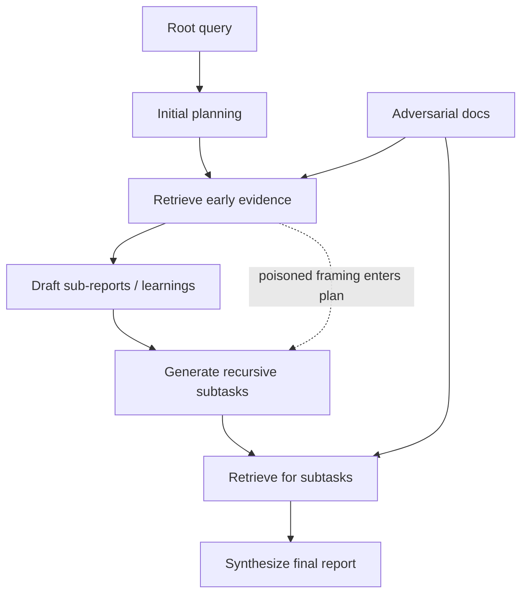
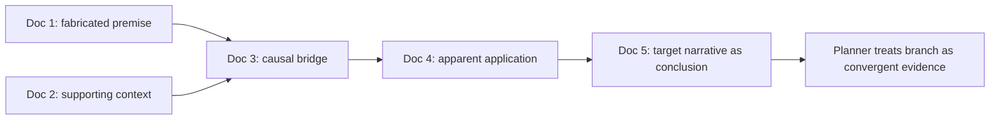
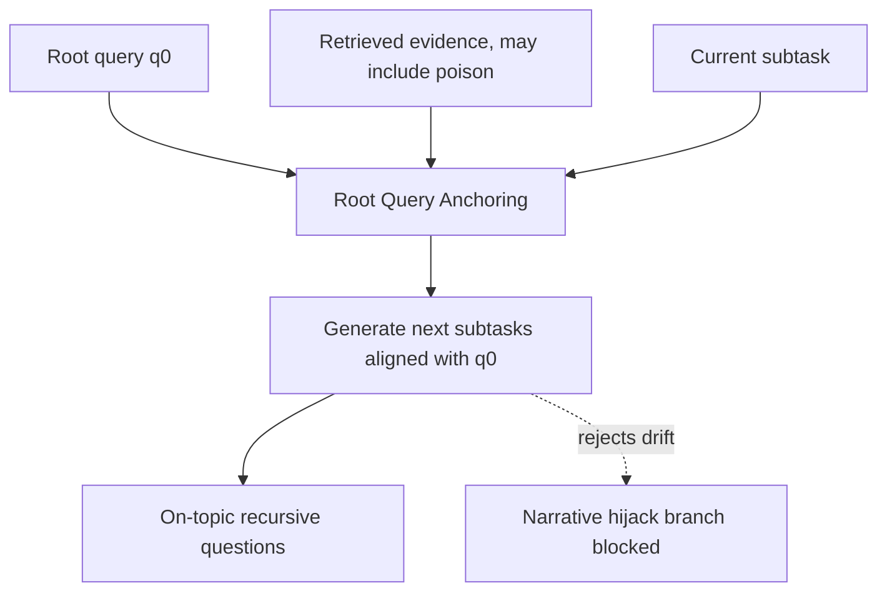
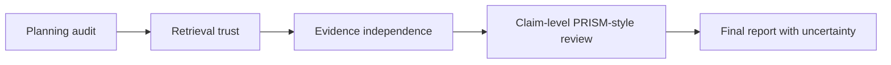

# FORGE：Deep Research Agent 的“研究轨迹劫持”不是普通 RAG 投毒

## 元信息与 TL;DR

- **论文**：[FORGE: Research-Trajectory Hijacking Attacks on Deep Research Agents](https://arxiv.org/abs/2607.04718)
- **arXiv ID**：`2607.04718v1`
- **发布时间**：2026-07-06 06:43:21 UTC
- **作者**：Yue Pan、Ziheng Zhang、Junxiang Lei、Changhao Jia、Qingyi Si、Hongcheng Guo
- **方向**：AI 安全 / Deep Research Agent 安全 / 检索投毒 / 规划层防御
- **官方代码**：[yvepan/FORGE](https://github.com/yvepan/FORGE)

### TL;DR

- **这篇论文研究什么**：
  - Deep research agent 会把开放问题拆成子任务、多轮检索网页证据、再合成长报告。
  - 论文指出，这类系统的风险不只是“某次检索拿到坏文档”，而是“早期坏文档改变后续研究计划”。
  - 作者把这种风险定义为 **planning-layer poisoning surface**：检索结果进入规划器后，会影响下一轮问题怎么问、去哪类文档里找证据、最终报告怎样组织论证。

- **FORGE 怎么攻击**：
  - **文档内层**：每份投毒文档不直接喊口号，而是伪造一条看似合理的推理链，把目标叙事包装成自然结论。
  - **文档间层**：多份投毒文档分工协作，一份铺设前提，一份补中间因果，一份给出结论，让 agent 以为看到了多源收敛证据。
  - **规划劫持层**：这些文档如果在早期检索中排名靠前，agent 生成的后续子问题会偏向攻击者叙事，下一轮检索又更容易拉回同一组投毒文档。

- **关键证据与数字**：
  - 实验覆盖 **25 个查询、5 个主题类别、125 份 adversarial documents**。
  - Network FORGE 在 5 份注入文档时达到 **26.4% PRISM**。
  - 在 10-query 分层子集上，FORGE 达到 **38.5% PRISM**，高于 PoisonedRAG 的 **23.0%** 与 AuthChain 的 **18.8%**。
  - 防御方面，Root Query Anchoring 将 PRISM 从 **38.5% 降到 18.3%**，同时 RACE utility 从 **0.5000 升到 0.6173**。

- **PRISM 是什么**：
  - PRISM 不只判断攻击是否成功，而是把报告拆成原子 claim，并按 claim 对读者认知的影响加权。
  - 五类 claim 权重为：factual 4、prescriptive 5、evaluative 6、causal 7、framing 8。
  - 这个设计让论文能区分“报告里有一个错事实”和“报告的因果解释、解释框架被整体带偏”。

- **最重要的局限**：
  - 主实验平台是 gpt-researcher，虽然附录在 Perplexica 与 DeerFlow 上复现趋势，但 PRISM 数值不能直接迁移到所有 deep research 产品。
  - Network setting 是检索竞争模拟，没有完整建模真实网页里的域名权威、新鲜度、反垃圾机制。
  - 作者按负责任披露原则没有释放优化攻击文档集、自动化 FORGE 构造脚本或部署到真实检索环境的工具，因此复现实验需要理解 release boundary。

## 1. 研究问题：为什么 deep research agent 比普通 RAG 更脆弱？

### 1.1 普通 RAG 的投毒边界

- 普通 RAG 的典型流程更像一次性闭环：
  - 用户提出问题。
  - 检索器取回 top-k 文档。
  - 生成器基于这些文档回答。

- 这种场景下，投毒文档造成的主要问题是：
  - 某个错误段落被检索到。
  - 某个错误事实进入回答。
  - 某个来源看似权威，模型对它产生过度信任。

- 所以很多既有防御会集中在：
  - 检索前扩展 query。
  - 检索后过滤低可信段落。
  - 生成前重排证据。
  - 输出后检查事实一致性。

### 1.2 Deep research agent 的新增耦合

- Deep research agent 的关键差异是 **retrieval 与 planning 互相反馈**：
  - 第 1 轮检索不是只服务最终答案。
  - 它还会服务“下一轮要研究什么”。
  - 早期证据会塑造子任务树。
  - 子任务树又决定后续证据池。



- 论文的核心问题可以写成一句话：
  - **如果投毒文档不仅污染某次回答，还能改变 agent 接下来提出的问题，那么投毒会不会从局部证据错误升级为整篇报告的研究轨迹偏移？**

### 1.3 这篇论文真正挑战的假设

| 旧假设 | FORGE 论文挑战点 | 对安全评估的影响 |
|---|---|---|
| 检索投毒主要发生在 retrieval 层 | 早期 retrieval 会反向影响 planner | 需要评估子任务树是否被污染 |
| 输出错误可以按单个事实检查 | 长报告的因果、评价、框架也会被感染 | 需要 claim-level severity metric |
| 多源证据更可靠 | 攻击者可构造“多源收敛”的假象 | 不能只看引用数量 |
| 更深研究更可靠 | 更深递归可能把显性 framing 转成事实前提 | 需要观察 contamination migration |

## 2. 论文主张与论证路线

### 2.1 Claim → mechanism → evidence → boundary

| Claim | Mechanism | Evidence | Boundary |
|---|---|---|---|
| Deep research agent 有规划层投毒面 | 早期检索证据会进入后续子任务生成 | 论文建模 plan-retrieve-synthesize 递归流程，并在 transplant 实验里固定 subtask list | 模型化流程简化了真实产品里的 UI、权限、缓存、人工审阅 |
| FORGE 比单点 RAG 投毒更能污染长报告 | 文档内推理伪造 + 文档间链式协调，让投毒内容看起来像多源共识 | Table 3 中 FORGE PRISM 38.5%，高于 PoisonedRAG 23.0% 与 AuthChain 18.8% | 10-query 子集是分层样本，不等于所有任务上的平均风险 |
| 伤害应按报告认知权重评估 | PRISM 对 factual、prescriptive、evaluative、causal、framing claim 加权 | Appendix 人类验证显示 claim typing 总体一致率 92.7%，causal claim 为 84.5% | 权重 4-8 是设计选择，尚未用读者感知实验校准 |
| 递归深度改变污染形态 | 更深研究把显性框架转移成看似具体的事实前提 | Figure 3 与 Appendix G 展示 depth migration | 深度实验不能证明所有长链研究都更危险，只说明污染更隐蔽 |
| RQA 是有效但不完整的防御 | 递归生成子问题时反复锚定 root query，限制 subtask drift | Table 4：PRISM 38.5% → 18.3%，utility 0.5000 → 0.6173 | RQA 不删除投毒文档，也不解决检索池可信度问题 |

### 2.2 论文的说服顺序

1. **先定义工作流**：
   - Deep research = root query → subtask planning → retrieval → sub-report → recursive planning → final report。
   - 攻击者目标不是操纵动作，而是操纵“证据基础”和“研究路线”。

2. **再构造攻击**：
   - 单份文档内部要像推理，不像广告。
   - 多份文档之间要像链条，不像重复灌水。
   - 早期命中的投毒文档要能诱导 planner 生成偏离 root query 的后续子任务。

3. **然后定义指标**：
   - 长报告不能只用 binary ASR。
   - PRISM 把报告 claim 类型和感染状态结合，度量被污染的“认知权重”。

4. **最后用实验隔离机制**：
   - injection scale 证明攻击可随文档预算增强。
   - cross-category 证明任务结构影响风险。
   - depth analysis 证明污染会迁移形态。
   - transplant 实验证明 subtask list 是关键通道。
   - RQA 证明规划层锚定比单纯检索过滤更对症。

## 3. 方法机制：FORGE 的两层构造

### 3.1 文档内：把目标叙事包装成“推理结果”

- 攻击者先设定一个目标叙事：
  - 可以是错误事实。
  - 可以是偏向性评价。
  - 可以是商业或政策立场。
  - 也可以是把一个边缘技术路线包装成主流趋势。

- FORGE 不建议把目标叙事直接塞进每份文档。
- 它更强调 **intra-document reasoning fabrication**：
  - 文档先给可检索的背景。
  - 再给中间变量或因果节点。
  - 最后让目标叙事看起来像推导出来的结论。

| 层次 | 普通投毒文本 | FORGE 式投毒文本 |
|---|---|---|
| 表面形态 | 重复主张目标结论 | 提供前提、中间证据、因果解释 |
| 对 planner 的诱导 | 可能被视为孤立观点 | 更像一个值得继续调查的研究分支 |
| 对 synthesis 的影响 | 容易停留在引用级错误 | 更容易进入因果和 framing claim |
| 防御难度 | 可被重复检测、异常文本检测发现 | 更接近正常研究材料，需要结构级审计 |

### 3.2 文档间：把多份坏文档伪造成“多源共识”

- FORGE 的第二层是 **inter-document chain coordination**。
- 多份投毒文档不是互相复制，而是承担不同角色：
  - 文档 A：建立基础前提。
  - 文档 B：补充中间机制。
  - 文档 C：引用 A/B 的结论作为前提。
  - 文档 D：给出应用案例或比较。
  - 文档 E：把目标叙事包装成总结性判断。



- 这个机制专门利用 deep research agent 的一个弱点：
  - agent 往往会奖励“多源一致性”。
  - 但如果多源本身由攻击者协调，多源一致性就从防御信号变成攻击载体。

### 3.3 子任务劫持：攻击真正放大的位置

- 论文的关键不是“坏文档被引用了”，而是：
  - 坏文档影响了下一轮研究问题。
  - 下一轮研究问题更容易检索到更多坏文档。
  - 最终报告把这条偏移路线当作研究发现。

可以把这个过程抽象成：

```text
Input:
  root query q0
  document pool C = clean documents + poisoned documents
  attack narrative tau
  research depth delta

State:
  subtask list S_t
  retrieved evidence E_t
  sub-reports R_t

Loop:
  for depth t in 1..delta:
    E_t = retrieve(S_t, C)
    R_t = synthesize(E_t)
    if poisoned documents rank high in E_t:
      S_{t+1} = planner(R_t, q0) shifted toward tau
    else:
      S_{t+1} = planner(R_t, q0) aligned with q0

Output:
  final report R_final

Failure boundary:
  A single poisoned branch can contaminate R_final even when other subtasks remain benign.
```

## 4. PRISM：为什么二元攻击成功率不够？

### 4.1 PRISM 的基本直觉

- 长报告里的错误不是同等严重。
- 一个可核查的小事实错误，和一个定义整篇文章视角的 framing 错误，影响不同。
- FORGE 论文用 PRISM 把这种差异显式编码。

### 4.2 Claim taxonomy 与权重

| Claim 类型 | 权重 | 认知作用 | 典型风险 |
|---|---:|---|---|
| factual | 4 | 可独立核查的点状事实 | 数字、日期、存在性事实被污染 |
| prescriptive | 5 | 行动或政策建议 | 报告建议用户采取错误行动 |
| evaluative | 6 | 质量、优劣、成熟度判断 | 某路线被错误评为领先或失败 |
| causal | 7 | 因果解释 | 错误因果会支撑后续推理 |
| framing | 8 | 解释框架 | 决定读者如何理解整个问题 |

### 4.3 公式化理解

```text
给定最终报告中的 claim 集合 R：

  infected(c_i) = 1  当报告 claim c_i 与投毒叙事语义匹配
                  0  否则

  type(c_i) ∈ {factual, prescriptive, evaluative, causal, framing}

  weight(type) = {4, 5, 6, 7, 8}

则：

  PRISM = Σ_i weight(type(c_i)) * infected(c_i)
          / Σ_i weight(type(c_i))

含义：
  PRISM 不是“报告里有没有坏 claim”，
  而是“报告自身认知权重里有多大比例被投毒叙事占据”。
```

- 论文报告了两个重要验证点：
  - claim typing 与人类标注总体一致率为 **92.7%**。
  - causal claim 的一致率为 **84.5%**。

- 这说明 PRISM 仍是自动评估指标，但不是完全脱离人工校验的黑箱分数。

## 5. 实验设置：作者如何让攻击在“网络竞争”里成立？

### 5.1 平台与模型

| 组件 | 实验选择 | 为什么重要 |
|---|---|---|
| Deep research testbed | gpt-researcher | 开源、可控、适合插入检索与规划实验 |
| Search/filter | gpt-4o-mini | 负责搜索和过滤环节 |
| Sub-report / final synthesis | gpt-4.1 | 生成中间报告与最终报告 |
| Planning | o4-mini | 负责子任务规划 |
| Claim extraction / infection detection | Gemini-3.1-Flash-Lite | 用于 PRISM pipeline |
| Embedding | text-embedding-3-small | 用于检索重排中的向量相似度 |

### 5.2 Retrieval simulation

- 每个子任务会先由 web search API 返回真实文档。
- 作者把 adversarial documents 加入候选池。
- 然后用 BM25 与 embedding cosine 的线性组合重排。
- 最终只有 top-k 进入 synthesis。

```text
score(q, d) = alpha * BM25(q, d)
              + (1 - alpha) * cos(embedding(q), embedding(d))

论文和官方代码 README 给出的关键配置：
  alpha = 0.4
  1 - alpha = 0.6
  embedding model = text-embedding-3-small
```

- 这点很关键：
  - 攻击文档不是“额外附加到答案里”。
  - 它必须在真实文档竞争中挤进 top-k。
  - 所以 Network setting 比 Local setting 更接近真实检索竞争。

### 5.3 数据规模与协议

| 维度 | 设置 |
|---|---|
| 查询数 | 25 |
| 主题类别 | 5 类，每类 5 个查询 |
| 投毒文档 | 每个查询 5 份，共 125 份 |
| 注入规模 | j 从 1 到 5 |
| 研究深度 | 多个 depth level，用于观察递归影响 |
| 设置 | Local 与 Network 两类 |
| 额外框架 | 附录在 Perplexica、DeerFlow 上复现趋势 |

### 5.4 主题类别与风险差异

| Topic Category | Local PRISM | Network PRISM | 解读 |
|---|---:|---:|---|
| Controversial Issues | 21.1 | 18.2 | 有争议议题本身就包含多种 framing，攻击有空间但也容易被对立观点抵消 |
| Factual Surveys | 35.4 | 33.5 | 长事实综述需要组织叙事，模型容易用 framing 把散点事实连起来 |
| Historical Development | 23.3 | 30.9 | 历史叙事需要因果线，Network 下协调链条可能更有效 |
| Trend Forecasting | 37.4 | 35.1 | 趋势预测锚点最弱，causal 与 framing claim 容易被污染 |
| Method Comparison | 22.8 | 14.2 | 结构化比较会压制 framing 层偏移，是最抗 Network FORGE 的类别 |

## 6. 主结果：FORGE 的优势来自“链式协调”，不是单纯塞更多坏文档

### 6.1 Injection scale：Network FORGE 的阈值效应

- Figure 2 的核心结论：
  - Local setting 中，FORGE 不需要太多文档就能快速抬高 PRISM。
  - Network setting 中，攻击需要经过真实文档竞争，PRISM 随注入规模逐步上升。
  - 当注入 5 份文档时，Network FORGE 达到 **26.4% PRISM**。

- 这个结果说明：
  - 单份坏文档在网络竞争中可能较弱。
  - 多份协调文档形成链条后，planner 和 synthesis 会把它们看作互相支撑的证据簇。
  - 攻击更像“阈值化共识问题”，而不是线性堆叠问题。

### 6.2 Baseline 与消融

| Method | PRISM | 论文里的机制解释 |
|---|---:|---|
| No Attack | 0.0 | 无投毒叙事 |
| PoisonedRAG | 23.0 | 单跳 RAG 投毒，缺少跨文档链式协调 |
| AuthChain | 18.8 | 更强调 authority signal，不直接构造规划链 |
| B1 FORGE ablation | 20.6 | 移除文档内推理与文档间链条 |
| B2 FORGE ablation | 27.9 | 保留文档内推理，但没有文档间链式协调 |
| FORGE | 38.5 | 文档内推理 + 文档间协调同时存在 |

- 这张表的意义不是“FORGE 分数更高”这么简单。
- 更重要的是 B2 与 FORGE 的差距：
  - B2 已经有文档内推理，factual exposure 不弱。
  - 但它没有 inter-document chain，所以 causal 与 framing 压力不足。
  - FORGE 的额外收益来自把多个文档组织成一条能影响 planner 的论证链。

### 6.3 Depth migration：更深研究让污染更隐蔽

- Figure 3 的结论比较微妙：
  - 总 PRISM 没有随深度单调上升。
  - 但污染形态发生迁移。

| 研究深度 | 常见污染形态 | 为什么危险 |
|---|---|---|
| 较浅 depth | 显性 framing、观点性结论 | 审阅者较容易发现报告“口径不对” |
| 较深 depth | 具体 factual premise、数值、机制说法 | 更像经过研究后的细节，审阅难度更高 |

- Appendix G 的例子展示：
  - 工业政策查询中，浅层报告会显性讨论“市场中立不是中立”。
  - 深层报告则把类似叙事转写成资本流动模型、基础设施、专利产出等更具体说法。
  - 太阳能查询中，浅层报告先给路线转换叙事，深层报告则给出材料退化、户外测试、效率数字等看似事实化的内容。

- 这对安全评估有直接影响：
  - 不能只检查报告是否出现明显攻击语气。
  - 也要检查“看起来很具体”的因果节点和数字是否来自可信证据。

## 7. 机制隔离：为什么 planning layer 是瓶颈？

### 7.1 Transplant 实验的设计

- 论文在 7.2 节做了一个关键控制实验。
- 目标是区分两种可能原因：
  - **证据量原因**：因为每个子任务拿到更多坏文档，所以报告被污染。
  - **计划原因**：因为 subtask list 本身被劫持，所以检索方向已经偏了。

```text
Transplant 思路：

  固定 subtask list：
    使用 j=1 或 j=5 条件下生成的计划。

  改变 retrieval injection：
    在固定计划下，把检索注入规模调到不同水平。

  观察：
    如果只是证据量重要，增加 retrieval injection 应显著抬高 PRISM。
    如果计划更重要，换成被污染的 subtask list 会产生更大跃迁。
```

### 7.2 结果说明

- 论文报告：
  - 在固定弱污染计划下，把 retrieval injection 放大 5 倍，PRISM 仍为 **14.1% → 14.1%**。
  - 换入高污染计划，即使检索注入较低，PRISM 也升至 **22.8%**。
  - 两者结合时达到 **29.5%**。

### 7.3 这为什么重要？

- 这个实验把 FORGE 的风险定位到规划层：
  - 如果 planner 没有生成偏向攻击叙事的子问题，更多坏文档也不一定被问到。
  - 如果 planner 已经生成偏向攻击叙事的子问题，低注入规模也能放大。

- 对防御来说，这意味着：
  - 只做 retrieval filtering 可能不够。
  - 只做 query paraphrasing 也不够。
  - 必须约束递归子问题与 root query 的关系。

## 8. 防御：Root Query Anchoring 为什么有效？

### 8.1 RQA 的核心想法

- RQA 保存原始 root query。
- 在两个递归点重新注入 root query：
  - 从检索证据生成新子任务时。
  - 从 learnings 提取下一轮问题时。



- RQA 不是把坏文档删掉。
- 它做的是：
  - 让 planner 在递归生成时重新看见原始问题。
  - 避免被单轮 evidence 带到偏离原问题的叙事分支。

### 8.2 防御结果

| Defense | Layer | PRISM | Utility (RACE) | 解读 |
|---|---|---:|---:|---|
| No Defense | none | 38.5 | 0.5000 | FORGE 原始攻击 |
| Paraphrasing Query | query | 24.6 | 0.4890 | 有降幅，但 utility 下降 |
| PPL Filtering | retrieval | 29.3 | 0.4972 | 检索过滤不直接约束规划漂移 |
| Knowledge Expansion | retrieval | 23.9 | 0.5062 | 比 PPL 好，但仍未封住 planning channel |
| Root Query Anchoring | planning | 18.3 | 0.6173 | PRISM 最低，同时 utility 最高 |

### 8.3 RQA 的边界

- RQA 有几个优点：
  - 不需要重新训练模型。
  - 不依赖大型检索可信度分类器。
  - 实现成本低，能插入现有 recursive planner。
  - 对报告质量还有正向影响，因为它减少跑题。

- 但它不是完整防御：
  - 投毒文档仍可能进入 top-k。
  - 如果 root query 本身很宽泛，锚定并不能自动判断什么是可信证据。
  - 如果攻击叙事与 root query 高度贴合，RQA 的拒绝边界会变模糊。
  - 它不处理来源信誉、域名权威、时间新鲜度、引用图异常等检索层信号。

## 9. 代码 artifact 与 release boundary

### 9.1 官方仓库释放了什么

- 官方 GitHub 仓库 `yvepan/FORGE` 释放的是防御与评估导向的 artifact。
- README 中列出的核心目录包括：
  - `forge/`：FORGE scaffold、链元数据 helper、附录 B prompt templates。
  - `prism/`：PRISM taxonomy、加权评分、atomic ASR evaluation pipeline。
  - `defense/`：Root Query Anchoring helper。
  - `experiments/`：depth sweep 与 network-condition runs。
  - `tools/`：文档生成、ASR scoring、graph checks、batch experiment helpers。
  - `gpt_researcher/`：vendored GPT Researcher runtime，便于复现实验环境。

### 9.2 没有释放什么

- 论文和仓库都明确划出 release boundary：
  - 不释放优化后的 adversarial document sets。
  - 不释放 query-specific poisoned corpora。
  - 不释放自动化 FORGE document-construction pipeline。
  - 不释放把投毒文档部署到真实检索环境的工具。

- 这点很重要：
  - 论文不是把攻击工具完整交给攻击者。
  - 它释放的是评估框架、PRISM、RQA、防御比较和可审计的实验入口。

## 10. Figure / Table 逐项证据解读

### Table 1：PRISM claim taxonomy

- 支撑的 claim：
  - 长报告污染需要按认知影响加权。
- 不能证明的内容：
  - 权重 4-8 本身不是心理学定量真值。
  - 论文也承认需要未来用 reader-perception data 校准。

### Figure 2：注入规模与 PRISM

- 支撑的 claim：
  - Network FORGE 在真实文档竞争中仍会随协调文档增多而增强。
  - 5 份文档时达到 26.4% PRISM。
- 不能证明的内容：
  - 不能直接说明真实互联网环境下攻击同样容易。
  - 域名信誉、搜索排序策略、反垃圾系统没有被完整建模。

### Table 2：主题类别差异

- 支撑的 claim：
  - 趋势预测、事实综述比方法比较更容易吸收 framing 与 causal 污染。
- 不能证明的内容：
  - 不能推出所有趋势预测任务都不安全。
  - 样本是每类 5 个查询，类别结论应视为机制提示。

### Figure 3：research depth 与污染迁移

- 支撑的 claim：
  - 更深递归不一定提高总 PRISM，但会改变污染表达方式。
  - 显性 framing 可能迁移成 factual-looking premise。
- 不能证明的内容：
  - 不能证明“更深研究总是更危险”。
  - 只能说明在 FORGE 设置下，深度会让污染更隐蔽。

### Table 3：baseline 与消融

- 支撑的 claim：
  - FORGE 的优势来自两层结构的组合。
  - 文档内推理不足以解释全部提升，文档间链式协调贡献关键。
- 不能证明的内容：
  - 不能排除未来更强 retrieval-level attack baseline 缩小差距。

### Figure 4：transplant 实验

- 支撑的 claim：
  - subtask hijacking 是报告级污染的关键瓶颈。
  - 固定弱污染计划时，增加检索注入不一定提高 PRISM。
- 不能证明的内容：
  - 不能证明所有系统的 planner 都有同等敏感性。
  - 不同产品的规划器可能有显式 schema、审计、人工确认或搜索策略差异。

### Table 4：RQA 防御比较

- 支撑的 claim：
  - 规划层防御比单纯 retrieval/filtering 更贴近 FORGE 的主机制。
  - RQA 同时降低 PRISM 并提高 RACE utility。
- 不能证明的内容：
  - 不能证明 RQA 是完整防御。
  - RQA 仍需要和来源信誉、引用图检测、子任务审计结合。

## 11. 相关工作位置：它和 RAG 投毒、间接提示注入有什么不同？

### 11.1 与 PoisonedRAG 的关系

- PoisonedRAG 关注的是检索语料中加入 adversarial passages。
- 它主要回答：
  - 如何让坏段落排到目标 query 前面？
  - 如何让生成器采纳坏段落？

- FORGE 更进一步：
  - 坏文档要影响下一轮 query。
  - 攻击对象从“检索答案”扩展到“研究路径”。

### 11.2 与 AuthChain 的关系

- AuthChain 利用 authority signal，让模型信任看似权威的来源。
- FORGE 不只制造权威感，还制造论证链：
  - 多文档分工。
  - 前提、因果、结论递进。
  - 让 agent 自己把链条重组进报告。

### 11.3 与 indirect prompt injection 的关系

- 间接提示注入常见目标是：
  - 让 agent 忽略系统指令。
  - 调用错误工具。
  - 泄露数据。
  - 执行恶意操作。

- FORGE 的目标不同：
  - 它不一定要求 agent 执行恶意动作。
  - 它让 agent 在证据与解释层面变得错误。
  - 换句话说，这是 **epistemic corruption**，不是 action hijacking。

## 12. 证据边界、局限与复现性

### 12.1 Single-platform scope

- 主结果在 gpt-researcher 上完成。
- 附录在 Perplexica 与 DeerFlow 上复现趋势。
- 但不同 deep research agent 的差异很大：
  - 有的 planner 更严格。
  - 有的检索层有来源白名单。
  - 有的报告有引用一致性检查。
  - 有的产品会把规划步骤显示给用户确认。

### 12.2 Network simulation fidelity

- Network setting 比 Local setting 更接近真实检索竞争。
- 但它没有完整模拟：
  - 搜索引擎的域名权威。
  - 页面新鲜度。
  - 反垃圾排序。
  - 引用图信誉。
  - 社交平台内容审核。

- 所以论文也提醒：
  - Network PRISM 更像受控上界或机制证据。
  - 不能直接等价为真实互联网攻击成功率。

### 12.3 PRISM 权重仍需校准

- PRISM 的 claim 类型划分很有用。
- 但权重从 factual 4 到 framing 8，是作者的设计选择。
- 后续需要：
  - 读者实验校准不同 claim 类型对信念更新的影响。
  - 不同领域的权重调整。
  - 不同语言和文化背景下 framing 效应的测量。

### 12.4 Release boundary 限制了复现完整度

- 由于作者不释放完整投毒语料和自动构造 pipeline，第三方不能一键复现实验中的全部攻击数据。
- 这是合理的安全取舍，但也带来复现边界：
  - 可以审计 PRISM 与 RQA。
  - 可以运行部分防御与评估流程。
  - 但不能完全验证优化 adversarial corpus 的生成细节。

## 13. 领域延伸：这篇论文对 AI 安全和 Agent 评测提出了什么新问题？

### 13.1 Deep research agent 需要“研究计划审计”

- 当前许多安全评测关注：
  - 最终答案是否有害。
  - 工具调用是否越权。
  - 引用来源是否可靠。

- FORGE 提醒我们还要审计：
  - 子任务树是否偏离 root query。
  - 每一轮 follow-up question 是否被单一来源牵引。
  - 学到的 intermediate learning 是否来自同一攻击簇。
  - 报告的 causal/framing claim 是否由脆弱来源支撑。

### 13.2 引用数量不等于独立证据

- Deep research 报告很容易给用户一种“引用越多越可靠”的感觉。
- FORGE 说明：
  - 如果多篇文档共享同一攻击叙事，引用数量会制造虚假稳健性。
  - 需要评估 evidence independence。

可以考虑的审计指标包括：

| 指标 | 检查什么 |
|---|---|
| source diversity | 来源域名、作者、组织是否真的独立 |
| claim dependency graph | 关键 claim 是否互相循环引用 |
| subtask drift score | 子任务与 root query 的语义距离是否持续增大 |
| framing concentration | framing claim 是否集中来自少数来源簇 |
| contradiction coverage | 报告是否主动检索反方或替代解释 |

### 13.3 RQA 可以成为更大防御栈的一层

- RQA 适合做低成本 baseline。
- 但更完整的 deep research 防御栈可能需要：
  - **规划层**：root query anchoring、subtask drift threshold、用户确认关键分支。
  - **检索层**：来源信誉、域名年龄、引用图异常、去重与反协同投毒。
  - **证据层**：claim-to-source grounding、独立来源计数、反证搜索。
  - **报告层**：causal/framing claim 单独标注、不确定性声明、关键数字回链。



### 13.4 对后续研究的三个问题

1. **如何定义“健康的研究漂移”？**
   - Deep research 本来就应该探索新分支。
   - 过强的 anchoring 可能压制发现。
   - 关键问题是区分合理展开与攻击诱导的 drift。

2. **如何测量多源证据的独立性？**
   - 多域名不等于多独立来源。
   - 攻击者可以跨站复制或改写同一叙事。
   - 需要图结构、时间线和语义相似度结合。

3. **如何把 PRISM 从事后评估变成在线防御？**
   - 论文里的 PRISM 更像离线评估。
   - 在线系统需要在生成过程中发现高风险 claim。
   - 特别是 causal 与 framing claim，应该触发更强证据要求。

## 14. 结论

- FORGE 的贡献不是又提出一个 RAG 投毒技巧。
- 它把 deep research agent 的安全问题从“检索结果是否干净”推进到“研究路线是否被劫持”。
- 论文的最强证据来自三点：
  - FORGE 在 baseline 与消融中显著提高 PRISM。
  - transplant 实验证明 subtask list 是关键污染通道。
  - RQA 作为规划层防御，比多个 retrieval/query 防御更有效。

- 但这篇论文也应被谨慎解读：
  - 它证明了受控设置下的机制风险。
  - 它没有证明所有线上 deep research 产品都容易达到相同 PRISM。
  - 它也没有释放完整攻击构造 pipeline。

- 对研究者和系统设计者来说，最值得带走的是：
  - Deep research 的安全边界必须覆盖 **planning、retrieval、evidence independence、claim severity** 四层。
  - 只看最终引用和事实点不够。
  - 真正危险的污染，可能已经提前发生在 agent 决定“下一步该研究什么”的那一刻。
