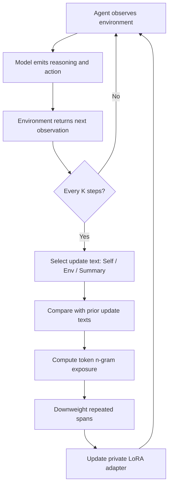
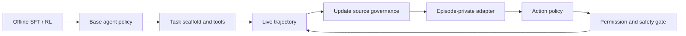

# No Time Like the Present：把测试时训练放进长程 Agent 回合

## 元信息与 TL;DR

| 项目 | 内容 |
|---|---|
| 论文 | No Time Like the Present: Agentic Test-Time Training for LLM Agents |
| 作者 | Yanbo Wang, Jinhua Hao, Yuze Shi, Kun Yuan, Ming Sun |
| 机构 | Kuaishou Technology |
| arXiv | https://arxiv.org/abs/2607.03441 |
| 提交时间 | 2026-07-03 |
| 主题 | 大模型 Agent、测试时训练、在线适应、长程轨迹退化 |

### TL;DR

- 这篇论文研究一个很具体的问题：LLM Agent 在长回合任务里并不总是“不会做”，很多时候是轨迹变长后反复回到已探索状态、重复失败动作、丢掉早先有效策略。
- 作者把 Test-Time Training 从“对固定输入适应一次”改成“在 Agent episode 内持续更新”，提出 **Agentic Test-Time Training, aTTT**。
- 关键机制不是盲目在线训练，而是用 **update-text repetition** 判断某次更新文本是否在重复旧模式，再对重复 `n`-gram 里的 token 降低 loss 权重，让新观察、新对象、新位置、新动作结果仍然进入 LoRA adapter。
- 实验覆盖 ALFWorld 和 SWE-bench Lite：ALFWorld 上 Qwen3.5-9B 最好从 ReAct 的 `50.7%` 到 Self+aTTT 的 `55.7%`，提升 `+5.0`；SWE-bench Lite 上 Qwen3.5-27B 从 `57.8%` 到 `62.7%`，提升 `+4.9`。
- 工程系统使用 vLLM runtime LoRA API，每个 episode 一个私有 LoRA adapter，16 个 episode 并发，140 个 ALFWorld episode 的墙钟时间从 no TTT 的 `14.6 min` 变为 `28.3 min`，约 `1.9x`，比顺序更新的 `186 min` 快 `6.6x`。
- 证据边界很清楚：aTTT 更像是在长程回合中稳定已有能力，而不是教会模型全新能力；它依赖合适的 update source，Self、Env、Summary 哪个最好随模型变化；评测仍集中在文本环境和代码修复 scaffold。

---

## 1. 研究问题：为什么长程 Agent 会“会做但做丢”

### 作者关心的不是普通 TTT

- 传统 Test-Time Training 的典型形式：
  - 输入在测试时到来；
  - 模型用这个输入构造自监督目标；
  - 参数更新一次；
  - 更新后的模型用于该输入或同一批测试样本。

- Agent episode 的不同点在于：
  - 输入不是一次性给定，而是随动作、观察、工具反馈不断增长；
  - 模型的当前策略会生成后续动作；
  - 后续动作又会成为未来训练文本的一部分；
  - 更新后的策略会改变下一段训练数据分布。

### 论文重新定义的失败模式

作者把长程 Agent 失败拆成一个更细的机制问题：

| 现象 | 表面解释 | 论文的机制解释 |
|---|---|---|
| 反复尝试同一个动作 | 模型没有探索能力 | 已失败动作进入后续 update stream，被再次强化 |
| 忘掉早先有用证据 | 上下文太长 | 轨迹中有证据，但策略逐步偏离能使用证据的区域 |
| 长回合越跑越差 | 模型能力不足 | 可能是回合内 self-training loop 把低新颖度行为放大 |
| 静态 TTT 帮助有限 | TTT 不适合 Agent | 静态 TTT 没有看到交互过程中新增的状态信息 |

<u>核心问题</u>因此不是“测试时能不能训练”，而是：

> 当模型自己生成的轨迹又成为未来训练文本时，怎样只吸收新信息，而不把卡住模式训练得更牢？

---

## 2. 论文主张与论证路线

| Claim | Mechanism | Evidence | Boundary |
|---|---|---|---|
| 长程 Agent 需要 episode 内持续适应 | 每隔 `K` 步从轨迹中取 Self、Env 或 Summary 文本更新 LoRA adapter | qTTT 静态预适应接近 ReAct，在线方法更可能利用轨迹新增信息 | 在线训练若不过滤重复，会不稳定甚至退化 |
| 重复更新文本是危险反馈的可操作信号 | 用当前 update text 与历史 update text 的最大 Jaccard overlap 定义 repetition | Figure 3 显示失败回合早期就出现持续上升的重复；rescued pairs 中 no TTT 后段重复超过 `80%` | 作者不声称 repetition 单独导致失败，只把它作为 operational signal |
| token 级重权重优于整段丢弃 | 对重复 `n`-gram 中 token 降低 loss 权重，保留同一句里的新对象、位置、观察 | ALFWorld 多数 signal-model block 中 aTTT 高于 No filter 和 Sequence filter | update source 选择仍未解决，不同模型最佳 Self/Env/Summary 不同 |
| aTTT 稳定已有能力，而非创造新能力 | LoRA adapter 在 episode 内改变低新颖度状态下的动作概率 | 增益集中在模型有非零成功潜力且轨迹足够长的区域 | 弱模型、短回合或已经稳定的模型增益小 |
| 工程上可以并发运行 | vLLM runtime LoRA，episode 私有 adapter，训练与推理解耦 | 16 episode 并发，`1.9x` no-TTT 成本，`6.6x` 快于顺序实现 | 仍需额外训练 GPU、adapter 管理和热替换机制 |

---

## 3. 方法机制：从轨迹到在线 LoRA 更新

### 3.1 轨迹与更新对象

论文把 Agent episode 写成一条增长轨迹：

```text
tau_t = (o_1, m_1, a_1, ..., o_t, m_t, a_t)
```

- `o_t`：环境观察，例如 ALFWorld 房间状态或 SWE-bench 命令输出。
- `m_t`：模型在第 `t` 步生成的 reasoning/message。
- `a_t`：可执行动作，例如移动、拾取、bash 命令或代码编辑。
- `theta_k`：第 `k` 次测试时更新前的 episode-specific adapter 参数。

第 `k` 次更新发生在环境步 `t_k`，从当前轨迹里选一段文本 `x_k`：

```math
\theta_{k+1}
= \theta_k - \eta \nabla_{\theta_k} \mathcal{L}_{NTP}(x_k, \theta_k)
```

其中 next-token prediction loss 是：

```math
\mathcal{L}_{NTP}(x_k,\theta_k)
= -\sum_i \log \pi_{\theta_k}(x_{k,i}\mid x_{k,<i})
```

### 3.2 三种 update source

| Signal | 公式 | 进入训练流的信息 | 风险 |
|---|---|---|---|
| Self | `x_k^Self = m_{t_k}` | 模型自己的 reasoning 和 action tokens | 最直接复写模型输出，最容易进入自我强化 |
| Env | `x_k^Env = o_{t_k}` | 环境生成的观察 | 不直接训练模型输出，但观察模板可能重复 |
| Summary | `x_k^Summary = g(tau_{t_k})` | 另一次 LLM 调用压缩出的进度摘要 | 多一次推理成本，摘要质量影响更新方向 |

作者强调一个细节：

- Self 和 Env 只用最近一步，不用完整 prefix。
- 这样避免每次更新都重新训练整段早期轨迹。
- adapter 在 episode 内持续存在，所以早先更新仍会影响后续动作。

---

## 4. 重复信号：不是所有在线训练文本都值得同等学习

### 4.1 Sequence-level repetition

论文先定义一个 update text 的重复度：

```math
\rho(x_k)
= \max_{x' \in \mathcal{H}_k} J(W(x_k), W(x'))
```

变量解释：

| 符号 | 含义 |
|---|---|
| `x_k` | 第 `k` 次候选更新文本 |
| `H_k = {x_1, ..., x_{k-1}}` | 同一 episode 内之前用过的更新文本集合 |
| `W(x)` | 文本的 whitespace-tokenized word set |
| `J` | Jaccard similarity |
| `rho(x_k)` | 当前文本与历史任一更新文本的最大词集合重叠 |

再定义新颖度：

```math
\nu(x_k) = 1 - \rho(x_k)
```

### 4.2 为什么整段过滤不够

Sequence filter 的思路很自然：

- 如果 `nu(x_k)` 低于阈值，就跳过本次更新。
- 好处是避免把已失败模式再训练一遍。
- 问题是它会把一整段文本丢掉。

作者的反驳点很关键：

- 一段文本可能大部分是重复模板；
- 但里面夹着一个新对象名、新房间、新错误栈、新测试结果；
- 整段丢弃会把这些新 token 也丢掉；
- 所以需要 token-level，而不是 sequence-level。

---

## 5. aTTT：重复 `n`-gram 的 token 级降权

### 5.1 Token exposure

令 `H_k^tok` 是同一 episode 中所有历史 update token 的串接。当前更新文本 tokenized 后：

```text
x_k = [x_{k,1}, ..., x_{k,L}]
```

对每个位置 `j`，计算它所在 `n`-gram 在历史 token 串中出现过多少次：

```math
f_k(j)
= \max_{g \ni j} count(g, H_k^{tok})
```

### 5.2 Loss weight

token 权重是：

```math
w_{k,j}
= \max \left(w_{min}, \frac{1}{1+f_k(j)}\right)
```

含义很直接：

| 情况 | `f_k(j)` | 权重效果 |
|---|---:|---|
| token 不在重复 `n`-gram 中 | 0 | 权重为 1，完整学习 |
| token 位于出现 1 次的重复片段 | 1 | 权重约 1/2 |
| token 位于频繁重复片段 | 很大 | 权重下降到 `w_min` |

最终 aTTT loss：

```math
\mathcal{L}_{aTTT}(x_k,\theta_k)
= \frac{1}{L}\sum_{j=1}^{L}
w_{k,j} \cdot CE(x_{k,j}, \hat{x}_{k,j}; \theta_k)
```

### 5.3 伪代码

```text
Input:
  update text x_k
  token history H_k^tok
  n-gram size n
  weight floor w_min
  current adapter theta_k

State:
  tokenized current text [x_{k,1}, ..., x_{k,L}]
  per-token exposure f_k(j)
  per-token weight w_{k,j}

Loop:
  for j in 1..L:
    find all n-grams in x_k that contain position j
    set f_k(j) to the maximum count of those n-grams in H_k^tok
    set w_{k,j} = max(w_min, 1 / (1 + f_k(j)))

Update:
  compute weighted next-token CE loss
  theta_{k+1} = theta_k - eta * grad(weighted loss)
  append current tokens to H_k^tok

Output:
  updated episode-specific adapter theta_{k+1}

Failure boundary:
  if update source itself is uninformative, repetition weighting cannot invent useful state
  if cadence is too frequent, novelty can stay low and gains shrink
```

### 5.4 Mermaid：episode 内反馈环



---

## 6. 实验设置：作者如何证明它不是只在一个玩具环境有效

### 6.1 Benchmarks

| Benchmark | 规模 | 回合特征 | 为什么适合检验 aTTT |
|---|---:|---|---|
| ALFWorld | 140 个文本 household tasks | 50-step budget，即时环境反馈 | 容易出现重复移动、重复拾取、重复放下 |
| SWE-bench Lite | 150 个实例 | mini-swe-agent scaffold，150-call budget | 软件修复轨迹长，验证延迟，错误栈和代码状态会逐步变化 |

### 6.2 模型与 baseline

| 维度 | 设置 |
|---|---|
| ALFWorld 模型 | Qwen3.5-4B、Qwen3.5-9B、Qwen3.5-27B、Gemma-3-12B |
| SWE-bench Lite 模型 | Qwen3.5-9B、Qwen3.5-27B |
| No adaptation | ReAct |
| Static TTT | qTTT，rollout 前适应一次 |
| Online TTT | No filter、Sequence filter、aTTT |
| 指标 | success rate / resolve rate，3 seeds，报告 standard error |

### 6.3 默认训练细节

| 参数 | 默认值 |
|---|---:|
| LoRA rank | 8 |
| LoRA alpha | 16 |
| learning rate | `5e-4` |
| 每次更新梯度步 | 2 |
| 更新 cadence | `K=5` agent steps |
| sequence filter 阈值 | Jaccard novelty threshold `tau=0.5` |
| token reweighting | `n=3` |
| weight floor | `w_min=0.05` |
| adapter 生命周期 | episode 内持续，episode 间 reset |

---

## 7. 主结果：ALFWorld 上的改善来自“控重复”，不是普通在线训练

### 7.1 Table 1 的核心数字

| Signal / Filter | Qwen3.5-4B | Gemma-3-12B | Qwen3.5-9B |
|---|---:|---:|---:|
| ReAct | 1.9 | 22.4 | 50.7 |
| qTTT | 2.6 | 22.6 | 52.4 |
| Self / No filter | 2.1 | 22.1 | 53.1 |
| Self / Sequence filter | 3.1 | 23.8 | 53.8 |
| Self / aTTT | **3.6** | **24.3** | **55.7** |
| Env / No filter | 4.3 | 21.7 | 51.0 |
| Env / Sequence filter | **5.5** | 22.9 | 52.1 |
| Env / aTTT | 4.5 | **25.0** | **55.5** |
| Summary / No filter | 4.5 | 25.5 | 52.1 |
| Summary / Sequence filter | 4.3 | 26.2 | 54.0 |
| Summary / aTTT | **4.8** | **26.7** | **54.3** |

### 7.2 解读

- qTTT 静态预适应只小幅变化：
  - Qwen3.5-9B 从 `50.7` 到 `52.4`；
  - Gemma-3-12B 从 `22.4` 到 `22.6`；
  - 说明 rollout 前适应一次没有吃到交互中新增的信息。

- No filter 在线训练不稳定：
  - 有些 signal 变好，例如 Qwen3.5-9B Self 到 `53.1`；
  - 有些 signal 变差，例如 Gemma-3-12B Self 从 `22.4` 到 `22.1`；
  - 这支持作者说的 repeated self-training loop 风险。

- aTTT 的强点不是“更新更多”，而是“更新时少学重复片段”：
  - Qwen3.5-9B Self+aTTT 达到 `55.7`，比 ReAct 高 `+5.0`；
  - Gemma-3-12B Summary+aTTT 达到 `26.7`，比 ReAct 高 `+4.3`；
  - Qwen3.5-4B 最好仍是 Env/Sequence filter 的 `5.5`，说明 aTTT 并非所有格子都赢。

### 7.3 这张表最重要的边界

| 观察 | 不能推出什么 |
|---|---|
| aTTT 多数格子优于 No filter | 不能推出所有在线训练都安全 |
| aTTT 在 Qwen3.5-9B 上明显提高 | 不能推出弱模型也能靠 aTTT 学会任务 |
| Summary 对 Gemma-3-12B 最强 | 不能推出 Summary 是普适最佳信号 |
| Env 对 Qwen3.5-4B 很重要 | 不能推出观察文本一定比 Self 文本可靠 |

---

## 8. SWE-bench Lite：更长软件轨迹里的跨任务证据

### 8.1 Table 2

| 方法 | Qwen3.5-9B | Qwen3.5-27B |
|---|---:|---:|
| No TTT | 35.6 | 57.8 |
| aTTT | **38.4** `(+2.9)` | **62.7** `(+4.9)` |

### 8.2 为什么 SWE-bench Lite 是必要证据

- ALFWorld 有即时环境反馈：
  - 每个动作后知道是否成功拾取、移动、放置；
  - 失败环更显性。

- SWE-bench Lite 反馈更延迟：
  - Agent 要编辑真实仓库；
  - bash 命令、测试输出、文件内容变化构成长轨迹；
  - 是否 resolve 可能到后期才知道。

- 作者选择 Summary signal：
  - 因为软件修复轨迹很长；
  - Summary 可以压缩“到目前为止什么有用、什么失败”；
  - 但这也意味着结果依赖摘要质量。

### 8.3 关键解释

作者说 Qwen3.5-27B 在短 ALFWorld 上增益小，但在 SWE-bench Lite 上变大。原因不是模型突然更适合训练，而是：

- 模型本身有较高基础成功潜力；
- 软件任务轨迹足够长；
- update-text repetition 在 SWE-bench Lite 上约为 ALFWorld 的 6 倍；
- 因此更容易出现“会做但被长轨迹拖偏”的区域。

---

## 9. 什么时候有效：sweet spot 不是越弱越好，也不是越长越好

### 9.1 作者的结论

aTTT 最有效的区域需要两个条件同时存在：

1. **baseline task-solving potential**
   - 模型必须已经有非零解决能力。
   - 否则 episode 内文本没有足够正确信号可学。

2. **long-horizon drift**
   - 轨迹要长到会产生重复、循环、低新颖度更新。
   - 如果任务很短，adapter 更新空间有限。

### 9.2 Failure profile

| 指标 | Qwen3.5-4B | Qwen3.5-9B | Gemma-3-12B |
|---|---:|---:|---:|
| Unparseable actions | 30% | 2% | 6% |
| Repeats previous action | 71% | 31% | 7% |
| Repeats within last 3 | 87% | 34% | 45% |
| Dominant failure | invalid actions | mid-episode loops | slow exploration |
| Best signal | Env | Self | Summary |
| Best gain | +3.6 | +5.0 | +4.3 |

### 9.3 解读

- Qwen3.5-4B 的主要问题是 invalid actions：
  - 学 Self 可能会复制错误动作格式；
  - Env 更有价值，因为观察文本来自环境。

- Qwen3.5-9B 的问题是 mid-episode loops：
  - Self 里包含它正在重复的 reasoning/action；
  - aTTT 能降低重复片段梯度，又保留新动作线索。

- Gemma-3-12B 是 slow exploration：
  - Summary 压缩后的进度提示更有帮助；
  - 但这也证明 update source selection 是另一个未解问题。

---

## 10. 消融与失败边界

### 10.1 随机少更新不能解释收益

作者做了 random-drop control：

- 按 sequence filter 的经验丢弃率随机删除相同数量的更新；
- 如果收益只是来自“少训练一点”，random drop 应该接近 sequence filter；
- 但结果不匹配，说明被跳过的不是任意更新，而是集中在低新颖度区域。

一个具体数字：

- 4B Self signal 中，后期更新有 `97%` 被 repetition-based filter 跳过；
- 早期更新只有 `16%` 被跳过；
- 这说明重复信号确实集中在 episode 后段卡住阶段。

### 10.2 Cadence 消融

| Cadence K | SR | Mean novelty | vs No TTT |
|---|---:|---:|---:|
| K=1 | 51.0 | 0.42 | +0.3 |
| K=2 | 51.9 | 0.42 | +1.2 |
| K=5 | **55.7** | 0.56 | **+5.0** |
| K=10 | 54.5 | 0.58 | +3.8 |

解读：

- 每步都更新并不最好；
- 太频繁会让 update stream 低新颖度；
- `K=5` 在本实验里平衡了更新机会和新信息积累；
- `K=10` novelty 更高，但更新机会变少，增益下降。

### 10.3 Prompt 注入不等价于权重更新

作者比较了“把同样 Summary 放进上下文”：

| 方法 | Qwen3.5-9B ALFWorld |
|---|---:|
| No TTT baseline | 51.4 |
| In-context Summary injection | 49.3 |
| Summary TTT weight update | 54.3 |

解释：

- Summary 放进 prompt 会占上下文预算；
- 长轨迹中，注入文本会和近期观察竞争注意力；
- episode 超过 30 步后，注入 note 更容易被后续内容挤掉；
- LoRA adapter 则把信息压入参数状态，不增加 prompt token。

### 10.4 解码重复惩罚也不等价

| 方法 | Qwen3.5-9B Self |
|---|---:|
| No TTT | 50.7 |
| repetition penalty 1.1 | 49.7 |
| aTTT | 55.7 |

这说明论文里的“重复”不是单个 response 内的表层重复，而是 episode 级策略循环：

- 解码惩罚影响下一串 token；
- aTTT 改变后续多步动作选择的 adapter state；
- 所以它处理的是跨环境步的重复行为，而不是一句话里的重复用词。

### 10.5 Hyperparameter 边界

| 参数 | 结果 |
|---|---|
| LoRA rank 4/8/16 | Qwen3.5-27B ALFWorld 上基本稳定 |
| LoRA rank 32 | 相对 baseline 下降 `-4.3pp` |
| n=3/4/5 | Qwen3.5-9B Summary signal 稳定在 `54.1` 到 `54.5` |
| n=2 | 降到 `52.8`，说明窗口太短可能过度泛化重复 |

---

## 11. Figure 与 Table 逐项证据解读

| 图表 | 支持的结论 | 不能证明的内容 |
|---|---|---|
| Figure 1 | static TTT 和 aTTT 的关键区别是“更新是否进入 episode loop” | 不能单独证明 aTTT 性能更好 |
| Figure 2 | 每 `K` 步从轨迹提取 update text，再做 repetition-aware loss | 不能证明 Self/Env/Summary 哪个普适最佳 |
| Figure 3 | 失败 episode 的 update-text repetition 早期持续上升 | 不能证明 repetition 是唯一原因 |
| Table 1 | ALFWorld 上 aTTT 多数模型/信号组合优于 no filter 和静态 qTTT | 不能证明所有 Agent benchmark 都有效 |
| Table 2 | SWE-bench Lite 上 Qwen3.5-9B 和 27B 都有 resolve gain | 不能证明真实生产代码仓库同等收益 |
| Failure profile table | 不同模型失败类型不同，最佳 update source 不同 | 不能自动生成 source selection policy |
| Cadence table | `K=5` 在 Qwen3.5-9B Self 上最好 | 不能说明所有任务都应该每 5 步更新 |
| Throughput table | 并发 runtime LoRA 把成本控制在 `1.9x` | 不能忽略额外训练 GPU 和服务复杂度 |
| Case study | 同一 game 中 aTTT 在第 9 步避开 pick-up/put-down loop | 单例不能替代总体统计 |

---

## 12. 系统架构：为什么这不是只在离线脚本里跑得动

### 12.1 并发 runtime LoRA

论文的 serving 设计是：

- 一个 frozen base model 负责推理；
- 16 个 episode 并发；
- 每个 episode 有自己的私有 LoRA adapter slot；
- 专用训练 GPU 异步计算 adapter update；
- adapter 热替换到 vLLM inference engine；
- 单个 episode 的更新不阻塞其他 episode 生成。

### 12.2 Throughput table

| Configuration | Wall-clock | vs No TTT |
|---|---:|---:|
| No TTT | 14.6 min | 1.0x |
| Ours | 28.3 min | 1.9x |
| Sequential | 186 min | 12.7x |

### 12.3 工程边界

- 这套系统适合“长回合、多 episode 并发、adapter 可热替换”的服务形态。
- 如果一个系统只能串行调用闭源 API，论文中的 runtime LoRA 路线无法直接复用。
- 如果任务含真实副作用工具，还需要权限隔离和回滚机制；aTTT 只解决策略漂移，不解决工具安全。
- 如果 adapter 更新会吸收敏感轨迹，部署时要考虑 per-episode adapter 生命周期、日志保留和隐私删除。

---

## 13. 相关工作位置：它和 Reflexion、长上下文、Agent RL 的差异

### 13.1 和 Reflexion / verbal RL

- Reflexion 类方法通常跨 trial 反思：
  - 一个 episode 失败；
  - 写下 verbal memory；
  - 下一次尝试时改 prompt。

- aTTT 的差异：
  - 在同一个 episode 内更新；
  - 不只是写 prompt memory；
  - 通过 LoRA adapter 改变后续动作概率。

### 13.2 和长上下文

- 长上下文把更多轨迹暴露给模型；
- 但轨迹变长后，模型不一定能持续使用早期证据；
- aTTT 的设想是把部分有用轨迹信息压进 adapter，而不是继续扩 prompt。

### 13.3 和 Agent 后训练 / RL

- 传统 Agent RL 在训练阶段优化策略；
- aTTT 在测试 episode 内做小规模、局部、私有适应；
- 它不替代 offline post-training，也不保证产生全局更强模型。

### 13.4 和安全视角的关系

这篇论文本身不是安全论文，但它触碰了 Agent 安全的一个关键问题：

- 如果 Agent 可以在执行过程中改写自己的 adapter；
- 那么重复错误、注入文本、恶意环境观察也可能进入更新流；
- aTTT 用 repetition 降低一类自我强化风险；
- 但它没有覆盖 prompt injection、权限升级、工具副作用和恶意观察污染。

---

## 14. 核心判断：最值得带走的不是“TTT 有用”，而是“回合内训练需要防反馈”

### 14.1 我认为论文最强的贡献

- 它把 Agent TTT 从“能不能在线更新”推进到“在线更新的训练数据是谁生成的”。
- 在 Agent 中，训练文本不是外部独立样本，而是当前策略与环境互动后的产物。
- 这使测试时训练变成一个闭环控制问题，而不是普通自监督适应问题。

### 14.2 证据最扎实的部分

| 证据 | 强度 |
|---|---|
| ALFWorld 多模型、多 signal、多 filter 对照 | 强，能展示 repetition control 的必要性 |
| SWE-bench Lite 两个模型跨域验证 | 中强，证明不仅是 household text game |
| random-drop / cadence / in-context / decoding penalty 消融 | 强，排除了几个简单替代解释 |
| case study | 中，直观但只是代表样例 |
| runtime LoRA throughput | 中强，说明工程上可行，但依赖特定服务栈 |

### 14.3 主要局限

- **Source selection 未解决**：
  - Qwen3.5-4B 最好用 Env；
  - Qwen3.5-9B 最好用 Self；
  - Gemma-3-12B 最好用 Summary；
  - 论文没有给出在线选择或组合三者的策略。

- **能力边界清晰**：
  - aTTT 更像 preserve existing competence；
  - 不适合被解读成“测试时训练能让模型学会新任务”。

- **安全边界不足**：
  - 恶意环境观察可能被 Summary 或 Env 吸收；
  - Self signal 可能复制错误推理；
  - 需要额外的信任分级、沙箱、权限和更新审计。

- **评测范围有限**：
  - ALFWorld 是文本 household tasks；
  - SWE-bench Lite 是固定 scaffold；
  - 真实 Web、GUI、机器人、多工具企业环境未验证。

---

## 15. 领域延伸：对 Agent 与后训练研究的后续问题

### 15.1 Test-time training 需要“数据治理”

这篇论文暗示一个更大的方向：

- 训练阶段的数据治理强调去重、质量过滤、污染检测；
- 测试时训练也需要同样的治理；
- 只不过数据流从静态 corpus 变成 live trajectory。

后续可以问：

| 问题 | 可能研究方向 |
|---|---|
| 哪些轨迹文本可信 | 按 Self/Env/tool/stdout/user 分层加权 |
| 哪些文本可能被攻击 | 对工具输出和用户输入做 taint tracking |
| 哪些更新应回滚 | episode-level adapter checkpoint 与异常检测 |
| 如何审计更新 | 记录 update source、repetition、梯度范数、adapter drift |

### 15.2 论文对“长程能力”的重新划分

很多 Agent 论文会把失败归因到一个总称：长程推理不够强。本文更有用的地方，是把长程能力拆成几个可测部分：

| 能力层 | 本文对应证据 | 对后续研究的含义 |
|---|---|---|
| 初始任务能力 | baseline success rate 不能太低，否则 aTTT 增益小 | 先训练基础策略，再谈测试时适应 |
| 轨迹使用能力 | 长上下文不等于能持续使用早期证据 | 需要研究记忆、检索、adapter 和上下文的分工 |
| 反循环能力 | repetition 早期升高后，失败回合更容易进入重复动作 | Agent scaffold 应该监控行为模式，而不是只看最终分数 |
| 更新选择能力 | Self、Env、Summary 的最佳选择随模型变化 | 在线 source selector 可能比固定启发式更重要 |
| 工程执行能力 | runtime LoRA 把顺序 `12.7x` 成本降到并发 `1.9x` | 方法能否落地取决于 serving stack，而不只取决于算法 |

这种划分让“长程 Agent 后训练”不再只是扩大数据或增加 rollout 数量。更具体的研究路线是：

- 先判断模型是否处于 sweet spot：
  - 不是完全不会；
  - 也不是已经稳定；
  - 而是在长轨迹中逐渐偏离。

- 再判断应该更新什么：
  - 自己说过的话；
  - 环境给出的状态；
  - 还是压缩后的进度摘要。

- 最后判断何时停止更新：
  - 如果重复持续升高；
  - 如果 adapter KL drift 超过阈值；
  - 如果工具失败率上升；
  - 如果 action diversity 变成无意义发散。

### 15.3 对 Agent 安全的额外警告

aTTT 的安全含义有两面：

| 正面 | 风险 |
|---|---|
| 能减少 stuck loop，使 Agent 不再重复无效动作 | 如果恶意内容进入 update text，也可能被 adapter 吸收 |
| token 级降权比整段过滤更细 | 重复度低不代表内容可信，攻击者可以持续制造新颖恶意文本 |
| episode-private adapter 降低跨任务污染 | 如果 adapter 被持久化或复用，隐私和污染风险会扩大 |
| runtime LoRA 支持热替换 | 热替换也增加了审计、回滚和权限绑定复杂度 |

因此，安全系统不能只把 aTTT 当成性能优化。更稳妥的部署方式应包括：

- **信任分层**：
  - 用户输入、网页内容、工具 stdout、环境 observation、模型 Self 文本不能同权进入 loss。

- **更新审计**：
  - 每次 update 记录 source、novelty、token 权重分布、adapter drift、后续动作变化。

- **权限绑定**：
  - adapter 更新后，如果 Agent 要调用高风险工具，需要重新经过策略 gate。

- **回滚条件**：
  - 当连续失败、重复上升、KL drift 异常或安全分类器报警时，回滚到 episode 内上一 adapter checkpoint。

这也解释了为什么本文虽然不是 AI 安全论文，却对安全研究有启发：在线适应会把“输入过滤”问题变成“训练流过滤”问题。过去的 prompt injection 防御主要保护上下文和工具调用；如果未来 Agent 会在执行中训练自身，还必须保护梯度更新入口。

### 15.4 Agent 安全不只看输出，也要看适应通道

如果未来 Agent 系统允许在线 adapter 更新，安全边界至少要扩展到：

- 输入通道：
  - 用户消息；
  - Web 页面；
  - 工具返回；
  - 代码仓库内容；
  - 环境 observation。

- 更新通道：
  - 哪些文本可进入 loss；
  - 是否需要人工或规则 gate；
  - 是否可跨 episode 复用；
  - 是否允许持久化。

- 执行通道：
  - adapter 更新后的动作权限是否变化；
  - 高风险工具是否需要重新授权；
  - 失败循环是否触发停止而不是继续训练。

### 15.5 和后训练的关系

aTTT 不是普通 SFT/RL 的替代品，而像是一个推理期 micro-adaptation layer：

- offline post-training 负责形成通用能力；
- agent scaffold 负责定义观察、动作和工具；
- aTTT 负责在单个 episode 内减少漂移；
- 安全系统负责决定哪些更新可信、哪些动作允许执行。

一个更完整的 Agent 后训练框架可能长这样：



### 15.6 最后判断

- 这篇论文的价值不在于把成功率提高了几个百分点本身。
- 真正有价值的是它指出：**Agent 的测试时训练是内生数据流上的控制问题**。
- 一旦更新文本由当前策略参与生成，训练就会同时具备“吸收新证据”和“放大卡住模式”两种可能。
- aTTT 用一个很朴素的 repetition signal 给出第一步解决方案，但更大的问题还在后面：怎样判断 live trajectory 中哪些信息值得被模型参数记住，哪些必须只留在上下文里，哪些应当完全禁止进入训练。
- 这也是后续长程 Agent 系统必须补上的治理层。
