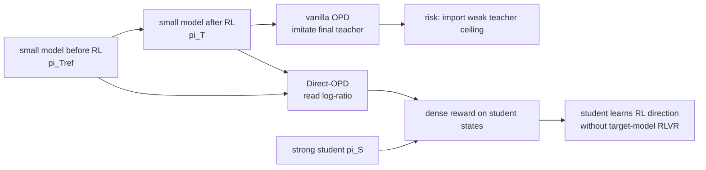

# Direct-OPD：把小模型 RL 学到的“方向”转成强模型的密集奖励

| 字段 | 内容 |
| --- | --- |
| 原文 | [Weak-to-Strong Generalization via Direct On-Policy Distillation](https://arxiv.org/abs/2607.05394) |
| 作者 | Shiyuan Feng, Huan-ang Gao, Haohan Chi, Hanlin Wu, Zhilong Zhang, Zheng Jiang, Bingxiang He, Wei-Ying Ma, Ya-Qin Zhang, Hao Zhou |
| 机构 | SIA-Lab of Tsinghua AIR, ByteDance Seed, AIR Tsinghua, Tsinghua CST, Peking University |
| 日期 | arXiv v1: 2026-07-06 |
| 方向 | 大模型后训练；RLVR；On-Policy Distillation；weak-to-strong generalization |
| 本文判断 | 这篇文章不是再证明“OPD 可以蒸馏 reasoning model”，而是在回答一个更经济的问题：如果强模型 RL 太贵，能否先让小模型完成便宜的 RL 探索，再把这次 RL 造成的策略变化转移给强模型。 |

### TL;DR

- **问题**：RLVR 能提高数学推理模型，但每次在更强、更大的目标模型上重跑 RL 都要让目标模型自己 rollout、打分、更新；模型越大，后训练越可能成为成本瓶颈。
- **核心方法**：Direct-OPD 不蒸馏小模型 RL 后的最终策略，而是比较小模型 RL 前后两个 checkpoint，取 `log pi_T - log pi_Tref` 作为 teacher policy shift，并把它当作强学生模型在自己 on-policy 状态上的密集 token 奖励。
- **关键公式**：在 KL-regularized RL 视角下，最优策略与 reference 的 log-ratio 可恢复奖励到正比例和 prompt 常数；Direct-OPD 反向利用这个恒等式，从 post-RL teacher / pre-RL teacher 的比值中读出隐式 reward。
- **实验主线**：R1-Distill-1.5B 到 JustRL-1.5B 的 policy shift 能提升 Qwen3-1.7B、Qwen3-4B 和 R1-Distill-7B；其中 Qwen3-1.7B 在 AIME 2024 从 48.3 提升到 62.4，AIME 2025 从 36.8 提升到 46.3。
- **效率证据**：作者报告 1500 step 的 R1-Distill-1.5B RL 约需 32 A100 上 160 小时，R1-Distill-7B 直接 RL 约需 320 小时；小模型 RL 后的 Direct-OPD transfer 只增加约 8 A100 上 4 小时。
- **不是简单 imitation**：vanilla OPD 会把强学生拉向弱 teacher 的容量上限；Direct-OPD 只取 RL 造成的方向，因此可以提升已经强于 post-RL teacher 的学生。
- **局限**：teacher/reference log-ratio 只在学生访问到、且 teacher shift 有意义的状态附近可靠；response length、KL 强度和 teacher-student 组合都影响结果，论文主要在 AIME 数学推理设置验证。
- **复现边界**：项目仓库公开了 patched `verl` 训练脚本、eval parquet 和 setup 文档，但不包含主要训练 parquet 与模型权重；它更像研究复现骨架，不是即插即用后训练框架。

### 研究问题：为什么“蒸馏小模型”不是正确表述？

这篇论文的出发点可以拆成三个层次：

1. **RLVR 的收益已经明确**  
   - 对数学推理来说，verifiable reward 可以把 answer correctness 转成清晰的训练信号。
   - 代价是每个目标模型都要自己生成大量 rollout，并在当前策略分布上更新。
   - 当目标模型变大时，rollout 成本和训练稳定性同时变成瓶颈。

2. **小模型 RL 便宜，但小模型本身不是好 teacher**  
   - 小模型经过 RL 后可能在某些任务上变强。
   - 但它的最终分布仍混有小模型容量限制、思维模式、错误偏好和 tokenizer / family 差异。
   - 如果强学生已经超过这个 teacher，直接模仿 teacher 最终策略可能是倒退。

3. **真正值得转移的是 RL 改变了什么**  
   - 小模型从 `pi_Tref` 变成 `pi_T` 的差异，记录了 RL 把哪些 token / response 提高或压低。
   - 这个“差异”比 teacher 的绝对分布更接近奖励信号。
   - Direct-OPD 的主张是：把便宜 RL 发现的方向搬到强模型自己的状态空间，而不是让强模型穿上弱模型的行为外壳。

这个问题意识也解释了为什么它与近期 OPD 稳定性论文不同：

| 相邻问题 | 典型关注 | Direct-OPD 的转向 |
| --- | --- | --- |
| Trust-region / stable OPD | teacher-student 分布错配时怎样避免异常梯度 | 如果 teacher 比学生弱，最终 teacher 分布本身就不是要模仿的对象 |
| OPD 几何 / 参数稀疏分析 | OPD 最终 checkpoint 在参数空间发生了什么 | 小模型 RL 的行为 log-ratio 能否作为强模型的隐式 reward |
| Offline / prefix OPD | 如何降低 teacher 查询或长序列监督成本 | 如何把小模型 RL 的探索成本从强模型训练里拿走 |

### 方法机制：从 checkpoint pair 读出隐式 reward

Direct-OPD 的方法可以先用一句话概括：

- **输入**：一个学生初始模型 `pi_S`，一个小 teacher 的 RL 前 reference `pi_Tref`，以及同一个小 teacher 的 RL 后模型 `pi_T`。
- **输出**：训练后的学生 `pi_theta`，它不模仿 `pi_T`，而是在自己的 rollout 状态上吸收 `pi_T / pi_Tref` 表示的 RL 方向。

核心变量如下：

| 符号 | 含义 | 在方法中的作用 |
| --- | --- | --- |
| `x` | prompt / 数学题 | 训练和评测输入 |
| `y = (y_1, ..., y_T)` | 模型生成的 response | 由当前学生 on-policy 采样 |
| `s_t = (x, y_<t)` | 第 `t` 步前缀状态 | 读取 token 奖励的位置 |
| `pi_S` | 学生初始模型 | KL anchor，避免学生漂移太远 |
| `pi_Tref` | 小 teacher RL 前 checkpoint | policy shift 的基准 |
| `pi_T` | 小 teacher RL 后 checkpoint | policy shift 的终点 |
| `Delta_T` | teacher policy shift | 被转移的隐式奖励 |
| `alpha` | 学生 KL 系数 | 控制学生能多大程度跟随 shift |

关键等式可以写成：

```text
teacher policy shift:
Delta_T(y | x) = log pi_T(y | x) - log pi_Tref(y | x)

token-level shift:
r_t(v) = log pi_T(v | s_t) - log pi_Tref(v | s_t)

student objective:
J(theta) = E_{y ~ pi_theta}[Delta_T(y | x)]
           - alpha * KL(pi_theta(. | x) || pi_S(. | x))
```

这里的“隐式 reward”不是拍脑袋定义出来的。论文利用 KL-regularized RL 的一个标准关系：

```text
若 pi* 是在 reference pi_ref 上用 reward r 和 KL 系数 beta 优化出的最优策略，
则 log(pi*(y|x) / pi_ref(y|x)) = r(x,y) / beta - log Z(x)。
```

这意味着：

- 对同一个 prompt，`log Z(x)` 是 response 间相同的常数。
- `pi_T` 与 `pi_Tref` 的 log-ratio 可以恢复 teacher 当时 RL reward 的相对偏好。
- Direct-OPD 相当于从小模型 RL 的结果里“反读”奖励，再用它训练强学生。

### 算法流程：仍然 on-policy，但 teacher 信号换了

Direct-OPD 保留 OPD 的一个关键优点：学生在自己的状态分布上学习。

```text
Input:
  D: 训练题目集合
  pi_S: 学生初始模型
  pi_Tref: 小 teacher RL 前模型
  pi_T: 小 teacher RL 后模型
  k: 学生 top-k token support
  alpha: KL anchor 系数

State:
  pi_theta <- pi_S

Loop for each update:
  1. 从 D 采样 prompt x
  2. 用当前学生 pi_theta 生成 rollout y
  3. 对每个前缀 s_t:
       a. 取学生 top-k token 集合 S_t
       b. 查询 pi_T 和 pi_Tref 在 S_t 上的 log-prob
       c. 计算 r_t(v) = log pi_T(v|s_t) - log pi_Tref(v|s_t)
       d. 用学生归一化概率 p_bar_t(v) 加权 r_t(v)
  4. 用加权 token reward 更新 pi_theta
  5. 加 KL(pi_theta || pi_S)，防止学生离初始分布过远
  6. 根据 batch mean reward 调整 alpha

Output:
  经过 Direct-OPD 后的学生模型

Failure boundary:
  如果学生 rollout 到 teacher/reference 都不可靠的区域，
  log-ratio 可能变成噪声目标，必须靠 KL 和 response length 控制。
```

与 vanilla OPD 的差异可以画成：



### 为什么 top-k 与 stop-gradient 是工程关键？

论文没有把 Direct-OPD 写成只靠序列级 reward 的 REINFORCE。它做了一个更密集的 token 级近似：

- 学生在前缀 `s_t` 处有自己的 next-token 分布。
- 训练只保留学生当前 top-k 支持集 `S_t`，默认 `k=16`。
- 在 `S_t` 上读取 teacher/reference 的 log-ratio。
- 用学生在 `S_t` 上的归一化概率加权这些 token reward。

这有两个好处：

| 设计 | 解决的问题 | 代价 |
| --- | --- | --- |
| 学生 top-k support | 只在学生实际考虑的动作附近转移 teacher shift | 可能漏掉 teacher 认为好但学生未纳入 top-k 的动作 |
| Rao-Blackwellized per-step estimator | 不只用采样 token，而是用 top-k 上的期望降低方差 | 需要同时查询 post-RL teacher 和 reference |
| `stop_gradient(p_bar * r)` | 避免学生概率权重被二阶地反向传播进目标 | 目标是近似 policy-gradient surrogate，而非完整可微目标 |
| KL anchor to `pi_S` | 防止学生为了最大化 log-ratio 走到 teacher 不可靠区域 | `alpha` 需要随 teacher-student pair 调整 |

项目代码也反映了这些选择：

- `ADV_ESTIMATOR=token_reward_direct`
- `reward_mode=delta_opd`
- `LOG_PROB_TOP_K=16`
- `TOP_K_STRATEGY=only_stu`
- `REWARD_WEIGHT_MODE=student_p`
- `KL_LOSS_COEF` 与 adaptive KL 相关参数被脚本暴露为环境变量。

这说明 Direct-OPD 不是把 paper 里的 reward 公式孤立实现，而是把它接入了 `verl` 风格的 PPO/GRPO 训练管线。

### 实验设置：两个 teacher pair，三类学生，AIME 为主

论文的实验问题可以整理成三组：

| RQ | 问什么 | 主要证据 |
| --- | --- | --- |
| RQ1 | 小 teacher 的 RL-induced shift 能否提升已经强于 teacher 的学生？ | JustRL pair 和 QuestA pair 转移到 Qwen3 / R1-Distill 学生 |
| RQ2 | 小模型 RL + Direct-OPD 是否比直接大模型 RL 更划算？ | R1-Distill-1.5B small RL vs R1-Distill-7B direct RL 的 compute-matched 对比 |
| RQ3 | 多个 policy shift 能否顺序组合？ | Qwen3-1.7B 先接收 JustRL shift，再接收 QuestA shift |

默认训练与评测细节：

| 项 | 设置 |
| --- | --- |
| 训练框架 | patched `verl` |
| Direct-OPD training steps | 300 |
| Global batch size | 64 |
| Rollout number | 4 |
| Max prompt length | 1,024 |
| Max response length | 2,048 |
| Student top-k support | 16 |
| 评测 benchmark | AIME 2024, AIME 2025 |
| 评测采样 | 每题 32 samples，temperature 0.7，top-p 0.95 |
| 最大评测生成长度 | 31,744 |

这里要注意一个边界：

- 训练 rollout response length 是 2k 级别。
- 评测 generation 可以到 31k 级别。
- 因此论文必须证明短 horizon 训练不是只改变短前缀，而是能外推到更长推理轨迹。

### Figure 1：为什么不能直接模仿弱 teacher？


Figure 1 的关键不是曲线本身，而是它展示的反直觉：

- R1-Distill-7B 初始 AIME 2024 为 56.7。
- post-RL JustRL-1.5B teacher 为 51.3。
- vanilla OPD 让 7B 学生去模仿这个弱 teacher，结果性能被拉低到约 50。
- Direct-OPD 用同一个 teacher pair，却把学生往上推。

这说明 Direct-OPD 的论证点不是“teacher 更强所以学生学到更多”，而是：

1. 小模型 RL 的 endpoint 可能弱于学生。
2. 但小模型从 reference 到 post-RL 的变化方向仍有价值。
3. 只要在学生自己的状态上读取这个方向，学生不必进入 teacher 的完整分布。

### Figure 2 / Table 1：跨 teacher pair 与学生家族的结果


最核心数字如下：

| Teacher pair | Student | AIME24 初始 | AIME24 Direct-OPD | AIME25 初始 | AIME25 Direct-OPD |
| --- | --- | ---: | ---: | ---: | ---: |
| R1-Distill-1.5B -> JustRL-1.5B | Qwen3-1.7B | 48.3 | 62.4 (+14.1) | 36.8 | 46.3 (+9.5) |
| R1-Distill-1.5B -> JustRL-1.5B | Qwen3-4B | 72.5 | 77.6 (+5.1) | 65.6 | 68.8 (+3.2) |
| R1-Distill-1.5B -> JustRL-1.5B | R1-Distill-7B | 56.7 | 63.1 (+6.4) | 40.5 | 48.8 (+8.3) |
| Nemotron-1.5B -> QuestA-Nemotron-1.5B | Qwen3-1.7B | 49.1 | 59.0 (+9.9) | 36.8 | 43.1 (+6.3) |
| Nemotron-1.5B -> QuestA-Nemotron-1.5B | R1-Distill-7B | 56.3 | 61.2 (+4.9) | 39.5 | 44.0 (+4.5) |

这张表支持三层结论：

- **跨学生规模**：1.7B、4B、7B 都能受益。
- **跨模型家族**：Qwen3 和 R1-Distill 都能受益。
- **跨 teacher pair**：JustRL 与 QuestA 的训练来源不同，仍能转移。

但它也给出一个更细的判断：

- Qwen3-1.7B 的绝对增益最大，因为它初始能力较低，teacher shift 有更多提升空间。
- Qwen3-4B 初始已经 72.5，增益仍有 5.1，说明 Direct-OPD 没有简单被弱 teacher ceiling 卡住。
- QuestA pair 的 AIME25 数字仍提升，但增幅小于 JustRL pair，说明 teacher shift 的质量和适配性会影响收益。

### Figure 3：小模型先 RL，再转移给大模型


RQ2 关心的是成本，而不是只看 endpoint 分数。

实验路径：

1. 在 R1-Distill-1.5B 上跑 RL。
2. 保存 300 / 600 / 900 / 1200 / 1500 step checkpoint。
3. 每个 checkpoint 与 base 组成 teacher pair。
4. 用 Direct-OPD 转移到 R1-Distill-7B。
5. 与 R1-Distill-7B 直接 RL 做 step-matched / compute-matched 比较。

关键数字：

| 路径 | 作者报告成本 | 含义 |
| --- | ---: | --- |
| R1-Distill-1.5B 1500-step RL | 32 A100 上约 160 小时 | 小模型先发现 policy improvement direction |
| R1-Distill-7B 直接 RL | 32 A100 上约 320 小时 | 大模型自己重新探索，成本翻倍 |
| Direct-OPD transfer stage | 8 A100 上约 4 小时 | 把小模型方向转移到大模型 |

这里的 claim 是：

- 在相同 RL step 或相近 compute 下，小模型 RL 后转移的路线位于直接 7B RL 曲线之上。
- 早期 T300 shift 较弱，T900 到 T1500 更强，说明不是任意小模型 checkpoint 都能提供同等价值。
- Qwen3 non-thinking 也显示类似趋势：Qwen3-1.7B RL shift 转给 Qwen3-4B，可达到 Qwen3-4B direct RL 的 68.0 AIME 2024 水平。

这个结果对后训练工程的意义很明确：

- 如果目标是把 RLVR 扩到许多模型 family / size，重复大模型 rollout 是最贵环节。
- Direct-OPD 提供了一种“探索一次，多次转移”的可能性。
- 但它还没有证明可以跨任务、跨语言、跨 agentic 环境泛化；目前证据集中在数学推理。

### Figure 4：policy shift 可以顺序组合吗？


顺序组合实验很重要，因为它把 Direct-OPD 从“单个 teacher 的蒸馏技巧”推向“可组合训练信号”。

实验流程：

1. Qwen3-1.7B 初始：AIME24 48.3，AIME25 36.8。
2. 第 1 阶段：接收 R1-Distill-1.5B -> JustRL-1.5B 的 shift。
3. 第 2 阶段：继续接收 Nemotron-1.5B -> QuestA-Nemotron-1.5B 的 shift。
4. 两阶段训练步数对齐到 global step 0-600。

结果：

| 阶段 | AIME24 | AIME25 |
| --- | ---: | ---: |
| Initial | 48.3 | 36.8 |
| After JustRL | 62.4 (+14.1) | 46.3 (+9.5) |
| After QuestA | 63.8 (+15.5) | 46.8 (+10.0) |

这说明不同 RL 过程学到的方向有一定可叠加性。

但这个实验也暴露一个限制：

- 第二阶段增益较小，AIME24 只从 62.4 到 63.8。
- 这可能意味着第一个 shift 已经覆盖大部分可迁移能力。
- 也可能说明两个 teacher pair 的能力重叠，或者学生在第二阶段受 KL / 数据 / horizon 限制。

因此，顺序组合更像一个有潜力的现象，而不是已经成熟的 curriculum 方法。

### 训练动态：为什么 top-k overlap 低仍然能转移？

传统 OPD 的直觉是：

- 学生必须逐步进入 teacher 的 high-probability token 区域。
- teacher-student top-k overlap 越高，学生越能有效模仿 teacher。
- 如果 overlap 低，teacher 的 token-level signal 可能没法传递。

Direct-OPD 改变了这个判断。

它不是要求学生选择 teacher 最喜欢的 token，而是在学生自己考虑的 token 上问：

```text
与 pre-RL teacher 相比，post-RL teacher 更支持还是更压低这个 token？
```

这让低 overlap 不再自动等于失败：

- 如果 student top-k 中的 token 仍能被 teacher/reference log-ratio 排序，信号就能工作。
- 学生可以保持自己的思维模式，只吸收小模型 RL 给出的局部方向。
- 论文的 entropy / overlap 诊断显示，部分 cross-pattern transfer 并不是通过逐渐模仿 teacher endpoint 实现。

这个分析是全文最关键的机制证据之一，因为它把 Direct-OPD 与 vanilla OPD 分开：

| 机制问题 | vanilla OPD | Direct-OPD |
| --- | --- | --- |
| 学什么 | teacher final distribution | teacher RL-induced shift |
| 学生状态 | on-policy | on-policy |
| teacher 要求 | teacher endpoint 通常应更强或至少兼容 | teacher endpoint 可弱于学生 |
| overlap 的意义 | 高 overlap 是有效模仿的重要条件 | 低 overlap 仍可能转移局部方向 |
| 风险 | 导入 teacher 容量上限 | log-ratio 在 OOD 状态变成噪声 |

### KL 控制：为什么不能只最大化 teacher shift？

Direct-OPD 的 reward 来自 teacher/reference log-ratio，但它不是一个可以无限最大化的标量。

原因：

- `Delta_T` 的尺度由 teacher 当时 RL 的 KL budget、reward scale 和训练轨迹决定。
- 学生并不知道这些尺度。
- 学生若走到 teacher/reference 都不熟悉的区域，log-ratio 可能很大，但不代表真实能力提升。

论文的 adaptive KL 逻辑是：

```text
batch mean reward > 0:
  提高 alpha，让 KL anchor 更强，避免过度追逐局部正 shift

batch mean reward < 0:
  降低 alpha，让学生更容易离开 teacher RL 压低的 token 区域

alpha 被 clip 到 [0.5, 2.5]
```

这里的 subtle point 是：

- 标准 adaptive KL 往往追踪目标 KL 值。
- Direct-OPD 的 controller 追踪的是 dense teacher-shift reward 的符号。
- 它想把 mean reward 拉回更平衡的区域，而不是追求更大的 reward。

论文 Figure 9 的结论可以转写为：

| 观察 | 含义 |
| --- | --- |
| 不同 teacher-student pair 的最佳固定 KL 不同 | `alpha` 不能全局固定 |
| 更大的 mean shift reward 不一定对应更好验证成绩 | log-ratio 不是无条件 reward oracle |
| adaptive KL 往往把 mean reward 拉向零附近 | 有助于保持在 teacher/reference 对比仍可靠的状态分布 |

这也是 Direct-OPD 的主要失败边界：

- 如果 teacher pair 的 RL 改进本身不稳，shift 会转移错误方向。
- 如果学生状态离 teacher/reference 支持太远，shift 可能变成分布外噪声。
- 如果 KL 太强，学生学不到方向；如果 KL 太弱，学生追逐不可靠方向。

### 细节清单：方法、数据、baseline、消融分别证明什么？

为了避免把论文只读成“又一个 AIME 提升表”，可以把证据拆成一张 detail inventory：

| 维度 | 论文实际给出的材料 | 证明力度 |
| --- | --- | --- |
| 方法对象 | `pi_Tref` / `pi_T` / `pi_S` 三类 checkpoint，以及学生 rollout 前缀 `s_t` | 清楚说明被转移的是 teacher pair 的差分，不是 teacher endpoint |
| 奖励定义 | `r_t(v)=log pi_T(v|s_t)-log pi_Tref(v|s_t)` | 能解释为什么 token 级密集信号来自小模型 RL |
| 训练数据 | Skywork-OR1-RL-Data 的数学子集；附录提到 DAPO-Math-17K 替换时趋势类似 | 支持数学推理场景，但不支持泛任务结论 |
| 评测数据 | AIME 2024 / AIME 2025，附带 HMMT February validation 文件 | 对高难数学推理有说服力，领域较窄 |
| baseline 1 | vanilla OPD toward post-RL JustRL teacher | 证明直接模仿弱 teacher 会伤害强学生 |
| baseline 2 | R1-Distill-7B direct RL | 证明小模型 RL + transfer 在 compute-matched 设置有优势 |
| baseline 3 | Qwen3-4B direct RL non-thinking | 作为 Qwen3 non-thinking transfer 的目标水平 |
| 消融 1 | 不同 small-teacher RL checkpoint: T300 到 T1500 | 证明 shift 质量随小模型 RL 进度变化 |
| 消融 2 | fixed KL coefficient sweep | 证明 KL 不是可忽略超参 |
| 消融 3 | response length sweep 与 long rollout 诊断 | 证明短训练 horizon 可以影响长生成，但过长也可能带来不可靠区域 |
| 机制诊断 | top-k overlap、entropy、teacher-reference gap、weighted teacher gap | 支持“不是 endpoint imitation”这一解释 |

这里最值得注意的是 baseline 的组合方式：

- **vanilla OPD baseline** 回答“为什么不用 post-RL teacher 直接蒸馏”。
- **direct RL baseline** 回答“为什么不直接在目标模型上 RL”。
- **checkpoint sweep** 回答“policy shift 是否只是碰巧有效”。
- **KL / length sweep** 回答“方法何时失效或变差”。

这些 baseline 串起来后，论文的 claim 才完整：

1. 直接 imitation 会有弱 teacher ceiling。
2. 小模型 RL 的差分方向能绕开这个 ceiling。
3. 这个方向比大模型自己探索更便宜。
4. 但方向的可靠性受状态分布和 KL 控制。

### 失败案例应怎样读？

论文没有提供一个显式“Direct-OPD 完全失败”的表格，但失败模式其实散在分析里。

可以整理成四类：

| 失败边界 | 触发条件 | 可能表现 | 对后续研究的提醒 |
| --- | --- | --- | --- |
| 弱 teacher shift 本身无效 | 小模型 RL 没有学到真实改善，或 checkpoint 过早 | T300 这类早期 shift 弱于后期 shift | 需要先评估 teacher pair，而不是默认所有 RL delta 都有价值 |
| 学生 rollout 分布偏移 | KL 太小，学生离 `pi_S` 太远 | mean reward 很大但 validation 下降 | 大 reward 可能是 OOD log-ratio，不是真能力 |
| 约束过强 | KL 太大或 response length 太短 | 学生几乎不跟随 shift | Direct-OPD 会退化成保守微调 |
| 任务外泛化不足 | 数学 prompt 模板、AIME 指标外的任务 | 无法保证代码、agent、开放问答有效 | 需要跨任务和多轮工具环境验证 |

这四类失败说明 Direct-OPD 的核心不是“有两个 checkpoint 就能偷到 reward”，而是：

- checkpoint pair 必须由有价值的 RL 过程产生；
- 学生必须在能解释这个 log-ratio 的状态附近学习；
- 训练控制必须防止学生把隐式 reward 当成可钻空子的显式 reward model。

### 公式背后的直觉：为什么差分比 endpoint 更干净？

可以用一个简化例子理解。

假设小 teacher 在 RL 前有两个偏好：

- 它天生喜欢短答案。
- 它天生在某类代数题上容易错。

RL 后，它又学到两个变化：

- 对正确验证答案更偏好。
- 对某些冗长但错误的推理更不偏好。

如果强学生直接模仿 RL 后 teacher endpoint，它同时会学到：

- teacher 的正确性提升；
- teacher 的短答案偏好；
- teacher 的代数弱点；
- teacher family 的表达习惯。

Direct-OPD 做差后，目标更像：

```text
post-RL teacher preference
- pre-RL teacher preference
= RL process added or removed preference
```

这个差分不能完全消除 teacher 偏差，因为 RL 过程仍发生在小模型能力边界内；但它至少把“teacher 原本就有的容量限制”从监督对象里减掉了一层。

所以本文的 weak-to-strong 不是传统意义的“让强模型相信弱模型标签”，而是更接近：

- 让弱模型承担便宜探索；
- 从探索前后的行为变化中提取方向；
- 把方向映射到强模型自己的动作集合；
- 用 KL 保持强模型原有能力不被弱模型 endpoint 覆盖。

### 对 Agent 与安全方向的有限延伸

虽然本篇是后训练论文，不是 Agent benchmark 或 AI 安全论文，但它对 Agent 后训练有直接启发。

可以设想一个长程工具 Agent：

- 小 Agent 在便宜环境里通过 verifiable tests 学会某些工具调用方向。
- RL 前后 checkpoint pair 给出“哪些 action token / tool argument 被 RL 提高”的 log-ratio。
- 强 Agent 在自己的任务轨迹上读取这个 shift，而不是模仿小 Agent 的完整轨迹。

潜在收益：

- 不必让强 Agent 在真实昂贵环境里反复探索。
- 可以把不同环境学到的 shift 组合成后训练 curriculum。
- 对高风险环境，可以先在 sandbox 小模型中探索，再筛选可靠 shift。

潜在安全问题同样明显：

- 如果小模型 RL 环境被污染，policy shift 会把污染方向转移给强模型。
- 如果 reward hacking 被写进 `pi_T / pi_Tref`，Direct-OPD 可能比普通蒸馏更隐蔽，因为它转移的是差分信号。
- 如果多个 shift 顺序组合，后一个 shift 可能放大前一个 shift 的偏差。

因此，Direct-OPD 如果走向 Agent 后训练，需要配套：

| 需求 | 可能做法 |
| --- | --- |
| shift provenance | 记录每个 teacher pair 的训练环境、reward、数据和 checkpoint |
| shift validation | 在小规模 held-out 状态上检查 log-ratio 与真实成功率的相关性 |
| state gating | 只在学生状态落入 teacher/reference 可靠区域时启用 shift |
| safety filter | 对工具调用、权限、外部写入类 token 加单独约束 |
| composition audit | 检查多个 shift 顺序叠加后是否产生新风险 |

### 与相关工作的关系：它站在 OPD 与 scalable oversight 的交叉处

论文相关工作可以按三条线理解：

1. **On-policy distillation of reasoning models**
   - OPD 已经成为 reasoning model 后训练的重要分支。
   - 既有研究关注 teacher-student KL、top-k overlap、prefix supervision、稳定性和稀疏更新。
   - Direct-OPD 的不同点是它不把 post-RL teacher 当成 endpoint teacher，而是当成一个 reward-bearing checkpoint pair 的后半段。

2. **Weak-to-strong generalization**
   - 传统问题是弱监督者如何激发强模型潜在能力。
   - 很多方法仍使用弱模型 label、偏好或分布，容易受弱监督者上限影响。
   - Direct-OPD 的监督者不是一个弱模型答案，而是弱模型 RL 前后差分。

3. **Implicit reward and model reuse**
   - DPO 等方法说明 policy/reference log-ratio 与 reward 有密切关系。
   - Direct-OPD 反向使用这个关系：不是用 reward 学 policy，而是从已学 policy pair 读 reward。
   - 与 task arithmetic / weight merging 不同，它复用的是行为空间里的 log-ratio，而不是参数 delta。

这个定位给后训练研究一个可继续追问的方向：

- 如果小模型 RL 的 policy shift 可以复用，那么“训练一个强模型”可能拆成：
  - 多个便宜 teacher 在不同任务上探索。
  - 把它们的 shift 以可控方式转移给目标模型。
  - 用 KL / routing / filtering 选择哪些 shift 在哪些状态上可靠。

### 复现与代码边界

项目仓库公开了训练脚本和 setup 文档，但复现仍不是低门槛：

| 复现要素 | 仓库状态 | 影响 |
| --- | --- | --- |
| patched `verl` | 已包含 | 能看到训练入口和 reward mode 接法 |
| eval parquet | `datasets/eval/` 包含 AIME/HMMT 相关验证文件 | 有助于复现实验评测流程 |
| 主训练 parquet | setup 要求本地放置或 symlink | 不能直接一键完整复现 |
| 模型权重 | setup 要求本地放置 Qwen3 / JustRL / R1-Distill 权重 | 需要用户自己准备 |
| launch script | `scripts/train_justrl_qwen.sh` | 暴露 top-k、teacher pair、adaptive KL、Ray、vLLM 等训练参数 |
| release | GitHub 页面显示无 release | 研究代码阶段，不是稳定库 |

这意味着读者应把它看作：

- 论文方法的公开实验实现。
- 一个可以移植到 `verl` / RLVR 管线的设计参考。
- 不是对所有模型和任务都已验证的通用后训练产品。

### 结论与局限：Direct-OPD 改变了“弱 teacher”的用法

Direct-OPD 最有价值的地方，是把“弱模型是否足够强”这个问题改写成：

- 小模型 RL 是否学到了可迁移的改善方向？
- 这个方向能否在强学生当前访问的状态上可靠评分？
- KL 与 horizon 能否把学生留在这个评分有效的区域？

本文证据支持的结论：

1. **小模型 RL 的 checkpoint pair 可以携带可迁移信号**  
   - 不是 post-RL teacher endpoint 本身，而是 `pi_T / pi_Tref` 的差异。

2. **强学生可以从弱 teacher 的 RL direction 中获益**  
   - Qwen3-4B 和 R1-Distill-7B 初始能力高于 JustRL-1.5B，仍有提升。

3. **成本结构很有吸引力**  
   - 小模型先 RL，再 4 小时级别转移，比大模型重跑 RL 更像可扩展路径。

4. **机制仍有条件性**  
   - teacher shift 的可靠性取决于学生 rollout 分布。
   - adaptive KL 只是经验控制，不是理论保证。
   - 主要实验是数学 AIME，尚未覆盖代码、长程 agent、开放问答或多轮工具任务。

继续追问时，我会优先看四个方向：

- **跨任务 shift 路由**：同一个学生能否只在某些题型上吸收某个 teacher pair 的 shift？
- **shift 质量评估**：发布前能否通过小规模 probes 预测某个 teacher/reference log-ratio 是否会伤害学生？
- **多 teacher composition**：顺序组合之外，能否做 mixture-of-shifts 或 state-dependent shift selection？
- **Agent 后训练**：如果 reward 不再是 AIME answer correctness，而是工具调用成功、代码测试通过或安全约束满足，policy shift 是否仍能被小模型便宜探索后转移？

如果这些问题成立，Direct-OPD 的意义就不止是一个 OPD 变体，而是一种更一般的后训练经济学：把昂贵目标模型上的探索，尽量移动到便宜模型上完成，再把探索结果以行为差分而非模型 endpoint 的形式注入强模型。
