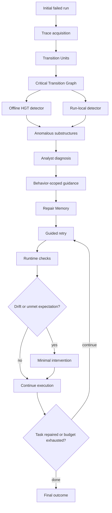

# AgentTether：把 Agent 失败修复从“再试一次”变成可诊断、可干预的运行时闭环

### 元信息

| 字段 | 内容 |
|---|---|
| 论文 | AgentTether: Graph-Guided Diagnosis and Runtime Intervention for Reliable LLM Agent Operation |
| arXiv | <https://arxiv.org/abs/2607.06273> |
| 提交时间 | 2026-07-07 13:40:31 UTC |
| 方向 | 大模型 Agent 可靠性、工具调用修复、运行时干预 |
| 核心对象 | 多步、有状态、会调用工具并改变外部状态的 LLM Agent |

### TL;DR

1. **这篇论文解决什么问题**：AgentTether 关注的不是让 Agent 第一次就成功，而是当一次多步工具调用任务失败后，系统怎样自动定位上游错误、生成可执行修复指导，并在下一次运行中持续看住这个修复目标。
2. **为什么普通重试不够**：盲重试没有诊断；只给最终失败反馈会让模型盯着表面症状；自我反思容易产生没有证据支撑的解释。论文把失败修复定义成 `诊断 -> 行为约束 -> 运行时监督` 的闭环。
3. **核心方法**：AgentTether 把一次运行拆成 Transition Units，构造 Critical Transition Graph，用离线正常行为模型和运行内异常检测找 failure-critical 子轨迹，再由 analyst LLM 生成行为级修复指导，并写入跨轮 Repair Memory。
4. **运行时机制**：下一次执行时，AgentTether 在 tool return 和 text response 边界检查 loop repetition、expectation deviation、intent drift、structural checks；必要时用轻量注入把修复方向重新放回上下文。
5. **实验设置**：论文在 tau-bench 的 Retail、Airline、Banking 三个域共 261 个任务上测试 Qwen3.7-max，并在 Banking 域用 GPT-5.4 做跨模型验证；真正评测对象是初次失败的 123 个 Qwen3.7-max 任务。
6. **关键数字**：在 Qwen3.7-max 初次失败任务上，AgentTether 修复率为 **69.11%**，盲重试为 **43.09%**；Banking 域从 **26.51%** 提到 **59.04%**，绝对提升 **32.53 个百分点**。
7. **消融结论**：去掉 offline HGT，整体修复率从 **69.11%** 降到 **46.34%**；去掉 Repair Memory 降到 **52.03%**。这说明“找对失败区域”和“记住哪些修复已生效”都不是装饰项。
8. **局限**：它仍依赖 analyst/verifier 这类辅助 LLM，评测集中在 tau-bench 的流程型工具任务，运行时干预也可能过度控制。论文最有价值的边界是：它证明修复 Agent 需要可观测轨迹和有节制的干预策略，而不是一条更长的反思 prompt。

### 研究问题：Agent 失败为什么不像普通程序 bug？

论文先把“Agent repair”从普通自动程序修复里切出来。

普通程序修复通常有这些条件：

| 维度 | 程序修复 | AgentTether 关注的 Agent 修复 |
|---|---|---|
| 失败对象 | 静态代码、测试用例、错误堆栈 | 动态轨迹、工具调用、环境反馈、外部状态 |
| 失败位置 | 常可回到某段代码或某个断言 | 可能是很早的参数遗漏，最后才表现为任务失败 |
| 修复介质 | patch、配置、测试 | 行为级指导、跨轮记忆、运行时检查 |
| 风险 | patch 不通过测试 | Agent 已经改变外部状态，不能简单回滚 |
| 证据 | 测试 oracle 或日志 | 不完整轨迹、gold action、工具返回、上下文漂移 |

论文用 Banking 任务解释这个差别：

1. Agent 要先存入一张支票，再关闭账户。
2. 初始运行遗漏 `check_amount`，导致存款没有实际完成。
3. 后续 `close_account` 失败，但表面症状不是根因。
4. 自我修复可能把问题误判成账户信息不足，于是继续重复错误调用。
5. 人类操作者会回看前面循环，定位缺失参数，再监督 Agent 完成存款后再关闭账户。

这个例子支撑了全文主张：

| 主张 | 机制含义 | 证据入口 | 边界 |
|---|---|---|---|
| 失败不等于最后一步错 | 需要向上游追踪决策依赖 | Banking 失败分析、CTG | 依赖可见工具轨迹 |
| 诊断本身不等于修复 | 诊断必须变成行为约束 | Repair Memory、injection plan | 指导太宽或太窄都会失效 |
| 修复需要运行时持续生效 | 长轨迹里一次性反馈会衰减 | adherence 曲线、Banking 结果 | 干预过强会伤害合法探索 |

### Motivation：两个实证观察

论文不是直接提出框架，而是先分析 Qwen3.7-max 在 tau-bench Banking 中的初次失败。

#### 观察一：根因通常早于最终症状

作者把 83 个初次失败 Banking runs 分成两类：

| 类型 | 数量 | 含义 |
|---|---:|---|
| behavioral failures | 78 | 违反了某个必要工具动作或参数 |
| communication-only failures | 5 | 没有明显 gold action 违反，更多是沟通层失败 |

对 78 个 behavioral failures，论文测量“最早违反 gold action 的位置”到“最终失败”的距离：

```text
g = 最早违反 gold action 的 Transition Unit 位置
final = 最终失败表现的位置
distance = final - g
```

关键发现：

| 指标 | 数字 | 解释 |
|---|---:|---|
| 中位 causal distance | 4 required steps | 根因经常隔几步才爆发 |
| 最大距离 | 26 steps | 早期错误可能被长链条放大 |
| 严格上游比例 | 62/78 = 79% | 多数失败不能靠看最后一步定位 |

这说明简单 recency heuristic 风险很高：

1. 最后一个失败 tool call 往往只是症状。
2. 最密集的异常区域也可能不是根因。
3. 修复提示如果只围绕最终报错，就会鼓励 Agent 重复同一条失败路线。

#### 观察二：一次性修复反馈会在长轨迹里衰减

论文还看了 post-feedback reruns 中 Agent 对修复指导的 adherence。

结果大致是：

| 时间点 | adherence 状态 | 研究含义 |
|---|---|---|
| 刚注入后 | 约 99% | Agent 一开始会响应指导 |
| 第 5 步 | 降到约 71% | 长任务中指导开始被上下文和工具反馈稀释 |
| 整体第 13 步 | 低于 50% | 只靠开头反馈不够 |
| Banking 第 8 步 | 已低于 50% | 高约束、长流程、状态改变任务最需要运行时监督 |

这为 AgentTether 的第二半提供了动机：

> 修复不是“给一次建议”，而是“在下一次运行中持续保持修复意图，直到相关状态被真正修好”。

### 方法机制：AgentTether 的四层结构

AgentTether 包在现有 Agent 外部，不改底层模型和环境。它把一次失败后的修复拆成两个互相连接的轨道：

1. **Post-run Observe & Diagnose**：运行结束后分析整条轨迹。
2. **Run-time Supervise & Intervene**：下一次运行中检查是否偏离修复目标。



#### 第一层：Transition Unit

AgentTether 不把整段 transcript 当作一个扁平字符串，而是把运行拆成决策周期：

```text
TU_i = (observation_i, agent_decision_i, tool_call_i, tool_result_i, environment_feedback_i)
```

这个粒度很重要：

| 粒度 | 问题 | AgentTether 的取法 |
|---|---|---|
| token | 太细，难以对应工具行为 | 不作为主要诊断单位 |
| message | 可能混合多个决策 | 只作为原始材料 |
| tool call | 有执行信息，但缺上下文 | 纳入 TU |
| Transition Unit | 能表示“决策、执行、反馈”闭环 | 作为 CTG node |

TU 的意义是把“Agent 说了什么”变成“Agent 在某个环境状态下做了哪个行为决策”。

#### 第二层：Critical Transition Graph

CTG 把 TU 变成图：

```text
G = (V, E)
V = {TU_1, TU_2, ..., TU_n}
E = dependency(TU_i, TU_j)
```

边不是普通时间邻接，而是依赖关系：

1. 时间顺序依赖。
2. 工具结果被后续决策使用。
3. 参数、实体、状态在多个 TU 间传播。
4. 早期缺失或错误约束导致后续动作不可行。

这样一来，根因定位就从“最后几轮上下文总结”变成图上的结构归因：

| 定位方式 | 会看什么 | 风险 |
|---|---|---|
| Recency | 最接近最终失败的步骤 | 容易只看到症状 |
| Frequency | 异常最密集区域 | 容易被重复失败循环误导 |
| CTG attribution | 沿依赖路径追踪 failure-critical 子图 | 更依赖轨迹结构质量 |

#### 第三层：双检测器定位异常子结构

AgentTether 使用两类检测器：

| 检测器 | 输入 | 作用 | 为什么需要 |
|---|---|---|---|
| offline HGT detector | 正常运行轨迹学习到的图结构 | 提供正常行为先验 | 避免只靠本次失败的局部噪声 |
| real-time detector | 当前 run 的图上下文特征 | 捕捉本次运行内异常 | 适应任务实例特有的偏差 |

论文给出了一组固定参数：

| 参数 | 设置 |
|---|---|
| HGT hidden dimension | 52 |
| HGT training epochs | 20 |
| HGT batch size | 128 |
| Isolation Forest trees | 100 |
| maximum subsample size | 256 |
| graph-context features | one-hop |
| seed | 42 |

这组设置的价值不在参数本身，而在研究姿态：AgentTether 不是让 LLM 从完整日志里自由发挥，而是先由图算法压缩一个 evidence packet，再交给 analyst LLM。

#### 第四层：Repair Memory 与 guarded intervention

诊断结果会被转换成行为级修复指导，并写入 Repair Memory：

```text
RepairMemory_t = {
  fixed_directives: 已经满足且不应反复提醒的修复项,
  unresolved_directives: 下一轮仍需保持的约束,
  injection_plan: 什么时候、通过什么通道提醒 Agent
}
```

运行时干预有三个动作：

| 阶段 | 作用 | 例子 |
|---|---|---|
| Check | 在 tool return 或 text response 边界监控偏离 | 重复调用、缺前置条件、意图漂移 |
| Decide | 判断是否需要提醒，以及提醒强度 | cooldown、cap、证据 grounding |
| Inject | 插入最小必要提示 | 附加到 tool result 或合成 user message |

干预触发项包括：

1. **Loop repetition**：Agent 又进入之前失败循环。
2. **Expectation deviation**：当前动作违背修复指导的期望。
3. **Intent drift**：Agent 开始偏离原任务目标。
4. **Structural checks**：关键证据、前置条件、状态改变顺序没有满足。

论文还给了 guard 参数：

| 机制 | 设置 |
|---|---|
| destructive action intent threshold | 0.35 |
| default intent threshold | 0.50 |
| information-gathering threshold | 0.55 |
| smoothing | 5-step EMA, alpha = 0.3 |
| structural reminder minimum | 至少 5 prior steps 和 5 tool calls |
| repeated reminder | 允许 1 次 |
| reminder cap | 每 run 最多 3 次 |

这解释了“guarded”的含义：它不是让外部控制器接管任务，而是只在偏离修复意图时做小剂量提示。

### 伪代码：一次 AgentTether 修复循环

```text
Input:
  task x
  base agent A
  environment E
  max repair iterations Gamma = 3
  normal-behavior model M_hgt

State:
  RepairMemory R = empty
  failed_trace T = run(A, E, x)

Loop for k in 1..Gamma:
  if success(T):
      Output repaired run

  U = segment_into_transition_units(T)
  G = build_critical_transition_graph(U)

  S_offline = detect_anomaly_with_hgt(M_hgt, G)
  S_local = detect_anomaly_with_run_local_features(G)
  S = merge_and_rank(S_offline, S_local)

  diagnosis = analyst_llm(
      evidence = S,
      trace = T,
      memory = R
  )

  guidance, injection_plan = build_behavior_scoped_guidance(diagnosis, R)
  R = update_repair_memory(R, guidance)

  T = guarded_rerun(
      agent = A,
      env = E,
      task = x,
      guidance = guidance,
      memory = R,
      checks = [loop, expectation, intent, structural]
  )

Output:
  best final run or failure report

Failure boundary:
  if CTG misses the true root cause,
  or analyst/verifier misjudges,
  or intervention repeatedly blocks a required action,
  repair may fail or regress.
```

### 实验设置：为什么选择 tau-bench？

tau-bench 适合这篇论文，因为它不是只看最终回答是否像样，而是检查工具调用过程是否满足规则。

| 域 | 总任务数 | 失败后进入修复评测的 Qwen3.7-max 任务数 | 任务特征 |
|---|---:|---:|---|
| Retail | 114 | 26 | 电商订单管理，流程相对短 |
| Airline | 50 | 14 | 航班预订与改签，存在合法探索 |
| Banking | 97 | 83 | 金融交易、合规约束、状态改变多 |
| 合计 | 261 | 123 | 覆盖不同长度与约束强度 |

模型与角色设置：

| 角色 | 模型或设置 | 目的 |
|---|---|---|
| 被修复 Agent | Qwen3.7-max | 主实验 |
| 跨模型验证 | GPT-5.4 on Banking | 检查方法是否只适配一个 Agent |
| user simulator / evaluator | DeepSeek-V4-Pro | 避免同模型自评 |
| analyst / verifier | DeepSeek-V4-Pro | 诊断与干预判断 |
| embedding | text-embedding-3-large | tau-bench AllTools 设置 |

比较方法：

| 方法 | 给 Agent 什么信息 | 是否图诊断 | 是否 Repair Memory | 是否运行时干预 |
|---|---|---|---|---|
| Blind retry | 什么也不给，最多重跑 3 次 | 否 | 否 | 否 |
| Outcome feedback | 只给最终 outcome-level 反馈 | 否 | 否 | 否 |
| Reflexion | 让 Agent 自己从失败轨迹反思 | 否 | 近似 verbal memory | 否 |
| AgentTether post-run only | 图诊断生成修复指导 | 是 | 是 | 否 |
| AgentTether full | post-run plus guarded intervention | 是 | 是 | 是 |

### 主结果：修复率不是靠多花 token 堆出来的

Table I 的关键数字可以压成下表：

| 域 | Blind retry | Reflexion | AgentTether post-run only | AgentTether full | full 相对 retry 提升 |
|---|---:|---:|---:|---:|---:|
| Retail | 88.46% | 88.46% | 92.31% | 96.15% | +7.69 pp |
| Airline | 57.14% | 71.43% | 78.57% | 78.57% | +21.43 pp |
| Banking | 26.51% | 26.51% | 46.99% | 59.04% | +32.53 pp |
| Overall | 43.09% | 44.72% | 60.16% | 69.11% | +26.02 pp |

几个判断很明确：

1. **Retail 上所有方法都不差**：短流程中随机重试已经能修很多失败，所以 AgentTether 的绝对提升较小。
2. **Airline 上 post-run 已经够强**：运行时干预没有继续提高修复率，说明合法探索可能和 drift 信号混在一起。
3. **Banking 是主战场**：盲重试和 Reflexion 都停在 26.51%，AgentTether full 到 59.04%，说明状态改变和合规顺序最需要外部监督。
4. **整体不是“更贵重试”**：AgentTether full 的平均 turns 是 56.36，低于盲重试 66.52；E2E tokens 是 1,197K，也低于盲重试 1,376K。

效率表也值得看：

| 方法 | Overall 修复率 | 平均 turns | 平均时长 | E2E tokens |
|---|---:|---:|---:|---:|
| Blind retry | 43.09% | 66.52 | 16.32 min | 1,376K |
| AgentTether post-run only | 60.16% | 59.28 | 13.47 min | 1,153K |
| AgentTether full | 69.11% | 56.36 | 15.59 min | 1,197K |

这里的 trade-off 很细：

1. full 版修复率最高，turns 和 tokens 也更低。
2. full 版比 post-run only 慢，因为 verifier 和干预判断带来额外 wall-clock latency。
3. 如果部署场景只需要离线诊断，post-run only 可能是更轻的选择。
4. 如果任务会改变金融、订单、权限等状态，full 版更值得考虑。

### 定位能力：CTG 真能找上游失败区域吗？

论文用 Banking 里的 78 个 behavioral failures 做定位测试。

定义：

```text
g = tau-bench gold action 中最早被违反的位置
p_hat = AgentTether 异常子结构中最高分 TU 的位置
S = AgentTether 保留给 analyst 的 anomalous substructures
```

关键结果：

| 指标 | AgentTether | Recency | Frequency |
|---|---:|---:|---:|
| S 覆盖 g | 56/78 = 71.8% | 不适用 | 不适用 |
| median error 到 g | 5.5 TUs | 6.0 TUs | 10.0 TUs |

这个证据有两个层次：

1. `S` 覆盖 `g` 说明 analyst LLM 通常能看到 failure-critical 区域。
2. `p_hat` 比 Frequency 更接近 `g`，说明图结构比“异常最密集处”更不容易被循环失败误导。

但这个实验也有边界：

1. `g` 是最早外显违反 gold action 的位置，不一定是真正认知漂移开始的位置。
2. 如果环境没有 gold action 或工具轨迹不完整，这类定位验证会困难很多。
3. CTG 质量取决于 trace acquisition 和 dependency edge 构造质量。

### 消融：offline HGT 和 Repair Memory 都是硬组件

Table II 很适合说明 AgentTether 的机制贡献：

| 版本 | Retail | Airline | Banking | Overall |
|---|---:|---:|---:|---:|
| AgentTether full | 96.15 | 78.57 | 59.04 | 69.11 |
| w/o offline HGT | 92.31 | 71.43 | 27.71 | 46.34 |
| w/o Repair Memory | 92.31 | 78.57 | 34.94 | 52.03 |

我的解读：

1. **offline HGT 对 Banking 特别关键**：Banking 从 59.04% 掉到 27.71%，几乎回到盲重试水平。这说明复杂合规任务需要正常行为先验，不能只看一次失败里的局部异常。
2. **Repair Memory 也不是缓存文本**：去掉后 Banking 只有 34.94%。这说明多轮修复中，系统必须知道哪些约束已经修好、哪些仍未解决，否则容易修 A 坏 B。
3. **Retail 的消融不明显**：短流程和高 baseline 掩盖了机制差异，所以不能只看 Retail 判定方法强弱。

可以把它写成一个目标函数直觉：

```text
repair_success
  ≈ localization_quality(CTG, offline_prior, run_local_signal)
    × guidance_actionability(diagnosis, task_state)
    × adherence_over_time(RepairMemory, intervention_policy)
    - over_control_cost
```

AgentTether 的贡献是把这几个因子分开建模，而不是把所有希望压在一次 LLM reflection 上。

### 跨模型：不是只对 Qwen3.7-max 有效

论文在 Banking 上测试 GPT-5.4。

| 被修复模型 | Blind retry | AgentTether post-run only | AgentTether full |
|---|---:|---:|---:|
| Qwen3.7-max | 26.51% | 46.99% | 59.04% |
| GPT-5.4 | 17.44% | 60.47% | 65.12% |

这组数字支持两个结论：

1. 图诊断生成的修复指导不是绑定某个模型家族的 prompt trick。
2. full intervention 对 Qwen3.7-max 加成更大，对 GPT-5.4 加成较小，可能因为 GPT-5.4 在接收 post-run guidance 后较少中途漂移。

修复进度也很集中：

| 模型 | 第 1 次 guided retry 修复率 | 占最终修复的比例 |
|---|---:|---:|
| Qwen3.7-max | 43.37% | 73.5% |
| GPT-5.4 | 54.65% | 83.9% |

这支持论文的 bounded repair protocol：

1. 大部分可修复任务在第一轮指导后就能恢复。
2. 后续轮次仍有价值，但边际收益下降。
3. 无限反复重试不是主要路线，关键是第一轮给对证据。

### 运行时干预：最有用，也最危险

Table III 把 full 版和 post-run only 做 paired comparison：

| 域 | helped | hurt | net | 显著性 |
|---|---:|---:|---:|---|
| Retail | 1 | 0 | +1 | p = 1.00 |
| Airline | 2 | 2 | 0 | p = 1.00 |
| Banking | 13 | 3 | +10 | p = 0.021 |

这说明干预不是普遍越多越好：

1. 在 Banking，长链条、状态改变、合规顺序让 one-shot guidance 容易失效，所以 intervention 显著有用。
2. 在 Airline，合法探索和偏离信号更容易混淆，所以干预没有净收益。
3. 在 hurt cases 中，重复 guard 可能让 Agent 一直 re-plan，而不是提交正确动作。

论文给出的干预日志细节也很关键：

| 情况 | 平均干预次数 | 主要通道 | 含义 |
|---|---:|---|---|
| Banking helped cases | 11.3 / task | on tool return | 像轻量 checkpoint，提醒缺证据或前置条件 |
| Banking hurt cases | 29.3 / task | 更多 expectation deviation | guard 可能反复触发，抑制必要动作 |

这对生产系统很重要：

1. 干预策略必须有 cooldown 和 cap。
2. destructive action 可以用更低阈值，information gathering 需要更宽容。
3. 不同域要有不同 intervention strength。
4. 干预文字应是“修复方向”，不是外部控制器直接给完整答案。

### Figure/Table 证据逐项解读

| 证据 | 支撑什么 | 不能证明什么 |
|---|---|---|
| Figure 1 Banking 示例 | 自我反思会误诊上游缺参，人工修复依赖记忆与监督 | 不代表所有失败都能用同一模式修 |
| Figure 2 失败分析 | Banking 根因常早于最终症状，median distance 为 4 steps | 依赖 tau-bench gold action 标注 |
| Figure 3 adherence 衰减 | 一次性反馈会被长轨迹稀释，Banking 第 8 步已低于 50% | 不说明所有模型都同样衰减 |
| Figure 4 系统图 | post-run CTG 诊断和 run-time intervention 是两条轨道 | 不是实现复杂度或成本的完整评估 |
| Table I 主结果 | AgentTether overall 69.11%，Banking 59.04% | 只覆盖 tau-bench 初次失败任务 |
| Table II 消融 | offline HGT 与 Repair Memory 缺一都会大幅掉分 | 没穷尽所有图模型或记忆设计 |
| Table III 干预效果 | Banking 干预净收益显著，Airline 中性 | 不能推出所有高风险域都适合高频干预 |
| Table IV 相关工作定位 | AgentTether 同时覆盖诊断、step-level reasoning、online、stateful、oracle-free | 仍需和更多生产 observability 工具对齐 |

### 和近期 Agent 安全/可靠性工作的区别

这篇文章容易和近期几类主题混在一起，但问题设置不同。

| 近期主题 | 核心问题 | AgentTether 的不同点 |
|---|---|---|
| prompt injection / UCM | 不可信内容如何操纵 Agent | AgentTether 处理普通失败后的恢复，不主要建模攻击者 |
| MCP taint mitigation | 工具参数触发 server 漏洞 | AgentTether 关注工具调用顺序和状态修复 |
| STRACE | 从噪声轨迹提取根因优化证据 | AgentTether 把根因诊断接到运行时干预闭环 |
| Action-Graded Severity | 如何度量工具攻击后果严重度 | AgentTether 衡量失败任务是否被修复 |
| Reflexion | Agent 如何用语言反馈改进 | AgentTether 强调外部图证据、Repair Memory 和 guarded runtime |

最接近的是 STRACE，但两者的侧重点不同：

1. STRACE 更像“优化前应该给 prompt optimizer 哪些因果证据”。
2. AgentTether 更像“失败后如何让下一次运行真的修好，并在过程中保持修复意图”。
3. STRACE 的输出偏向规则或 prompt patch。
4. AgentTether 的输出偏向运行时修复指导、记忆和干预计划。

### 证据边界与可复现性问题

这篇论文强在系统完整，但也有几类必须保留的边界。

#### 边界一：辅助 LLM 仍是关键依赖

AgentTether 的 analyst 和 verifier 都由 LLM 承担。

论文做了三层缓解：

1. analyst 的输入被 CTG-localized evidence 限定。
2. verifier 只决定是否干预，不直接判定任务成败。
3. 辅助角色和被修复 Agent 使用不同模型家族，降低自评泄漏。

但仍然不能忽略：

| 风险 | 可能后果 |
|---|---|
| analyst 误读 evidence packet | 修复指导偏离真正根因 |
| verifier 过度保守 | 漏掉关键 drift |
| verifier 过度敏感 | 反复打断必要动作 |
| evidence packet 缺失关键 TU | LLM 再强也只能解释错误材料 |

#### 边界二：tau-bench 代表的是流程型工具任务

tau-bench 的优势是过程可评估，但它不是全部 Agent 世界。

| 场景 | AgentTether 适配度 | 原因 |
|---|---|---|
| 银行、订单、客服流程 | 高 | 状态、规则、工具顺序明确 |
| 代码生成 Agent | 中 | 需要把测试、diff、命令输出转成 TU 和 CTG |
| 多 Agent 协作 | 未充分验证 | 跨 Agent 依赖会让 CTG 更复杂 |
| 开放式研究助手 | 中低 | 成功 oracle、状态边界和 failure unit 更模糊 |
| 安全对抗环境 | 未充分验证 | 攻击者可能污染 trace 或诱导 Repair Memory |

#### 边界三：干预策略需要领域化

论文的 hurt cases 已经提示：

1. 干预不是越频繁越好。
2. 相同阈值不适合所有域。
3. 金融式高约束任务需要更强监督。
4. 探索式任务需要容忍中间偏离。

因此真正落地时，关键不是“装上 AgentTether”，而是先定义：

| 设计问题 | 需要回答 |
|---|---|
| 哪些 action 是 destructive？ | 转账、删除、发邮件、提交表单、修改权限 |
| 哪些 drift 可以容忍？ | 搜索、询问澄清、读取上下文 |
| 哪些证据必须先满足？ | 身份验证、余额检查、政策条款、用户确认 |
| 什么时候停止提醒？ | 状态已修复、任务阶段已越过、同类提醒达到 cap |

### 研究者视角：这篇文章改变了什么理解？

我认为 AgentTether 的贡献不只是一个更高修复率的 wrapper，而是把 Agent 可靠性拆成了三个可以分别研究的对象。

#### 1. 轨迹不只是日志，而是修复图

过去很多 Agent 系统保存 transcript 是为了 debug 或审计。AgentTether 的视角更进一步：

```text
trace -> Transition Units -> Critical Transition Graph -> repair guidance
```

这意味着日志格式会直接影响修复质量。

未来 Agent 框架如果希望支持自动修复，就不能只存自然语言 transcript，而要存：

1. module id。
2. tool call schema。
3. tool result provenance。
4. environment state diff。
5. user policy constraints。
6. action preconditions。
7. dependency edges。

#### 2. “反思”需要外部证据约束

Reflexion 在 Banking 上没有超过盲重试，这个结果很有启发。

原因不是语言反馈没用，而是：

1. 自我反思可能重复 Agent 自己的错误因果模型。
2. 没有结构化证据时，模型容易解释最终症状。
3. 长任务中，一条语言反馈很快会被后续工具交互稀释。

AgentTether 的路线是：

```text
先用图结构缩小解释空间，
再用 LLM 生成修复语言，
最后用运行时检查维持修复语言的效力。
```

这比“让模型想想哪里错了”更接近可审计系统。

#### 3. Repair Memory 是安全面，也是优化面

Repair Memory 带来稳定修复，也带来新的风险。

| 正面作用 | 风险 |
|---|---|
| 避免忘记未解决约束 | 错误诊断可能被跨轮保留 |
| 防止已修复事项回归 | 旧约束可能过期 |
| 压缩多轮修复上下文 | 攻击者可能污染失败轨迹 |
| 形成可审计修复状态 | 需要权限、脱敏和版本控制 |

如果把这类系统放到生产环境，Repair Memory 应该被当作行为更新输入，而不是普通 cache。

### 结论与继续追问

AgentTether 把 Agent 修复问题从“失败后再运行一次”推进到更严谨的闭环：

1. 用 Transition Units 表示决策周期。
2. 用 Critical Transition Graph 表示非局部依赖。
3. 用 offline HGT 和 run-local detector 定位异常子结构。
4. 用 analyst LLM 生成行为级修复指导。
5. 用 Repair Memory 记录固定和未解决约束。
6. 用 guarded intervention 在下一次运行中维持修复意图。

实验最有力的结论是 Banking：

| 指标 | 数字 |
|---|---:|
| Qwen3.7-max Banking 初次失败任务 | 83 |
| Blind retry 修复 | 22/83 = 26.51% |
| AgentTether post-run only 修复 | 39/83 = 46.99% |
| AgentTether full 修复 | 49/83 = 59.04% |
| GPT-5.4 Banking full 修复 | 56/86 = 65.12% |

但这篇论文也留下了几个后续问题：

1. **更弱或更强模型是否需要不同干预强度？**
   - GPT-5.4 的 intervention gain 比 Qwen3.7-max 小，说明模型能力会改变修复策略。
2. **CTG 能否标准化进 Agent observability？**
   - 如果框架原生记录依赖边，AgentTether 这类方法会更便宜、更可靠。
3. **Repair Memory 如何防投毒？**
   - 如果失败轨迹可被用户或外部页面影响，修复记忆可能成为长期行为污染入口。
4. **多 Agent 场景如何定位根因？**
   - 一个 Agent 的早期错误可能通过消息传给另一个 Agent，CTG 需要跨主体扩展。
5. **干预策略能否学习化？**
   - 现在的阈值、cooldown、cap 是规则化设计；未来可能需要按域风险和任务阶段自适应。

最终判断：

> AgentTether 最重要的启发是，可靠 Agent 需要一个外部的、结构化的修复层。这个修复层既要能看懂过去的失败，也要能在未来的执行中轻量维持修复意图。没有前者，修复会变成泛泛反思；没有后者，诊断会在长轨迹里失效。
