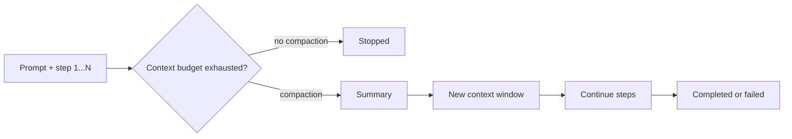

# CompactionRL：把上下文压缩从推理技巧变成 Agent 强化学习的一部分

## 元信息

| 字段 | 内容 |
|---|---|
| 论文 | CompactionRL: Reinforcement Learning with Context Compaction for Long-Horizon Agents |
| 作者 | Yujiang Li, Zhenyu Hou, Yi Jing, Jie Tang, Yuxiao Dong |
| 机构 | Tsinghua University |
| arXiv | [arXiv:2607.05378v1](https://arxiv.org/abs/2607.05378v1) |
| 发布时间 | 2026-07-06 17:55:12 UTC |
| 方向 | 大模型 Agent；大模型后训练 |
| 核心对象 | 长视界软件工程 / 终端 Agent 的上下文耗尽、压缩摘要、PPO 训练 |
| 评测 | SWE-bench Verified 200 个随机任务；Terminal-Bench 2.0 全量任务 |

## TL;DR

1. **这篇论文解决的问题**：长视界 Agent 在软件工程、终端操作和工具调用任务里会积累大量观察、错误日志、局部方案和中间推理；上下文窗口耗尽后，简单截断会让任务中断，单纯加长窗口成本高，也不能保证模型真的利用远距离信息。

2. **作者的关键主张**：上下文压缩不应该只在推理时当作启发式“摘要插件”；在强化学习训练里，压缩摘要会替代旧历史并决定后续动作，所以摘要生成本身就是策略的一部分。

3. **方法名**：CompactionRL。它在 PPO 框架下联合优化两类 token：任务执行 token 和压缩摘要 token，并让二者共享同一个最终任务奖励。

4. **两个优化修正**：第一是 token-level loss normalization，用 token 粒度而不是 segment 粒度归一化损失，避免多次压缩的轨迹被重复加权；第二是 cross-trajectory GAE，把早期 segment 到最终奖励的真实距离折回优势估计里，避免把终局奖励错误地放到每个 segment 的近端。

5. **关键数字**：GLM-4.5-Air 106B-A30B 在 compacted evaluation 下，SWE-bench Verified 从 59.8 提到 66.8，Terminal-Bench 2.0 从 21.4 提到 24.5；GLM-4.7-Flash 30B-A3B 在 compacted evaluation 下，SWE-bench Verified 从 50.5 提到 56.0，Terminal-Bench 2.0 从 13.4 提到 20.2。

6. **消融结论**：只打开压缩但不训练摘要，效果不稳定；去掉 token-level loss 后，106B 设置下 SWE-bench Verified 从 66.8 掉到 60.0，Terminal-Bench 2.0 从 24.5 掉到 21.3；去掉 cross-trajectory GAE 后分别掉到 63.0 和 22.5。

7. **实验边界**：论文主要验证代码型长视界任务，使用 Harbor 环境和 Terminus-KIRA scaffold；SWE-bench Verified 是 200 个随机样本均值，不等同于完整 leaderboard；CompactionRL 的收益依赖测试时也启用 compaction，关掉压缩后不一定迁移。

8. **研究意义**：它把“记忆 / 摘要 / 压缩”从 Agent 外部工程组件推进到后训练目标函数内部，为长视界 Agent RL 提供了一个更明确的信用分配问题定义。

## 研究问题：为什么长视界 Agent 不能只靠更长窗口？

### 作者真正关心的失败场景是什么？

长视界 Agent 的轨迹不是普通长文本。

它通常包含：

- 用户原始任务。
- 多轮计划和自我修正。
- 工具调用输入。
- 环境返回的长日志。
- 编译、测试、运行失败信息。
- 局部代码修改和回滚线索。
- 后续步骤必须引用的中间状态。

这些信息有两层难点：

| 难点 | 普通长文本理解 | 长视界 Agent 轨迹 |
|---|---|---|
| 信息形式 | 主要是自然语言段落 | 语言、代码、终端输出、错误栈、工具观察混合 |
| 时间结构 | 读完后回答 | 边行动边改变环境 |
| 失败代价 | 答案不完整 | 后续动作直接跑偏或任务中断 |
| 压缩风险 | 少量细节丢失 | 丢掉一个路径、变量名、测试失败原因都可能破坏后续执行 |

作者的出发点是：

- **只扩上下文窗口**会带来推理成本和训练成本。
- **只在推理时摘要**没有让模型学习“什么信息应被保留”。
- **只优化最终答案**会忽略压缩点之前的摘要质量。
- **只训练执行动作**会把摘要当作固定外部工具，而不是策略的一部分。

### 这篇论文重新定义了什么？

论文把上下文压缩定义为一个训练时状态转移：

```text
旧轨迹 H_t 太长
  -> 模型生成摘要 S_t
  -> 新 segment 从 S_t + 最近上下文继续
  -> 最终任务成功或失败给出 reward
```

这个定义把问题从“如何写一个好摘要 prompt”变成：

1. 摘要 token 是否应该被最终任务奖励训练？
2. 轨迹被压缩切成多个 segment 后，PPO 损失如何加权？
3. 早期摘要对最终成功的贡献如何分配 credit？
4. 多次压缩后，模型能否学会保留对后续工具调用有用的状态？

## 论文主张与论证路线

| Claim | Mechanism | Evidence | Boundary |
|---|---|---|---|
| 压缩摘要是 Agent 策略的一部分 | 将 summary response 和 execution response 都纳入 PPO 优化 | Table 3 中训练摘要的 CompactionRL 在 compacted evaluation 下稳定优于不训练摘要版本 | 只说明代码型任务有效，未覆盖网页、多用户协作或开放世界任务 |
| 常规 group-wise RL 不适合压缩轨迹 | 多次压缩会让一个 rollout 被切成不等数量 segment，组内归一化会偏置多 segment 轨迹 | 方法部分指出 GRPO 这类固定 rollout group 假设在 segment 化后不成立 | 作者选择 PPO，但没有系统比较所有可能的 off-policy / process reward 方案 |
| token 粒度损失比 segment 粒度更稳 | 所有可优化 assistant token 共享归一化，避免多次压缩轨迹重复计权 | Table 4 去掉 token-level loss 后，106B 的 SWE-bench Verified 从 66.8 降到 60.0 | token 级加权仍不能保证摘要语义完整，只解决优化权重偏差 |
| cross-trajectory GAE 修正压缩后的信用分配 | 早期 segment 的终局奖励按后续 token 距离折扣，近似完整拼接轨迹中的时间距离 | Table 4 去掉 cross-trajectory GAE 后，SWE-bench Verified 降到 63.0，Terminal-Bench 2.0 降到 22.5 | 作者承认它仍是近似，跨多个压缩边界的长期影响未完全捕获 |
| 压缩感知训练优于事后启发式压缩 | 训练阶段和评测阶段都允许最多 3 次 compaction，让模型在压缩状态下继续行动 | Table 2 在 30B 和 106B 两个尺度、两个 benchmark 上 compacted performance 均提高 | 关掉 compaction 的 single-window setting 不稳定，存在 train-test mismatch |

## 方法机制：CompactionRL 到底训练了什么？

### 轨迹结构

普通 Agent RL 常把一次任务看成完整 rollout：

```text
prompt -> action_1 -> obs_1 -> action_2 -> obs_2 -> ... -> final_reward
```

CompactionRL 把它切成 compacted rollout：

```text
segment_1:
  prompt -> action -> observation -> ...
  context nearly full
  summary_1 = model(compact history)

segment_2:
  summary_1 + recent context -> action -> observation -> ...
  context nearly full
  summary_2 = model(compact history)

segment_3:
  summary_2 + recent context -> action -> observation -> final_reward
```

关键点不在“有摘要”，而在：

- 摘要是模型自己生成的 assistant response。
- 摘要决定下一段可见状态。
- 摘要错误会延迟到后续行动才暴露。
- 摘要 token 和执行 token 共享同一个任务级 reward。

### 训练时触发条件

论文实验里使用两个模型规模：

| 模型 | 训练上下文预算 | 压缩触发 | 最多压缩次数 | 单次 assistant response 上限 |
|---|---:|---|---:|---:|
| GLM-4.7-Flash 30B-A3B | 64k | 剩余预算低于 10,240 token | 3 | 10,240 token |
| GLM-4.5-Air 106B-A30B | 80k | 剩余预算低于 10,240 token | 3 | 10,240 token |

这意味着 compacted evaluation 的有效轨迹长度不是简单无限增长，而是：

```text
effective_budget ~= peak_length * 4
```

原因：

- 初始窗口是一个 segment。
- 最多三次 compaction。
- 每次 compaction 后开启新的 trace。
- 因此可以近似得到四段可执行上下文。

### 为什么不用 GRPO 这类 group-wise 方法？

作者的判断是：压缩改变了采样结构。

假设一个 prompt 采样出一组 rollout：

```text
rollout A: 1 个 segment，最终 reward = 1
rollout B: 4 个 segment，最终 reward = 1
```

如果把 segment 当训练样本：

- rollout B 会贡献 4 次样本。
- rollout A 只贡献 1 次样本。
- 两者最终 reward 相同，但 B 被更重地放进组统计。

如果只在完整 rollout 级别做 group normalization：

- segment 内的摘要 response 没有独立 advantage。
- 每个压缩点之前的动作难以得到局部训练信号。

所以作者选择 PPO：

- 使用 value function 估计 advantage。
- 支持每个 prompt 只有一个 rollout。
- 支持不同 rollout 有不同 segment 数。
- 不依赖固定大小的 reward group。

## 公式解释：两个修正为什么必要？

### 1. Token-level loss normalization

论文把优化对象设为所有可优化 assistant token 的集合。

可以用下面的简化式理解：

```text
T = batch 中所有执行 token 与摘要 token 的集合
r_t(theta) = pi_theta(y_t | context_t) / pi_old(y_t | context_t)
A_t = token t 的 advantage

L_policy = (1 / |T|) * sum_{t in T} min(
  r_t(theta) * A_t,
  clip(r_t(theta), 1 - eps, 1 + eps) * A_t
)
```

这条式子的作用：

- **不是**每个 segment 平均一次。
- **不是**每条 rollout 平均一次。
- **是**每个被优化 token 获得同等损失权重。

它解决的是长度偏差：

| 情况 | 如果按 segment 平均 | token-level normalization 的作用 |
|---|---|---|
| 一条轨迹触发 3 次压缩 | 可能被重复放大 | 不因 segment 数变多而自动加权 |
| 摘要很短 | 可能被少数 segment 统计淹没 | 摘要 token 仍进入同一 token 集合 |
| 执行响应很长 | 可能支配样本级损失 | 权重按 token 统一计算，更透明 |

### 2. Cross-trajectory GAE

压缩后的 segment 有一个信用分配陷阱：

```text
segment_1 -> summary_1 -> segment_2 -> summary_2 -> segment_3 -> final_reward
```

如果每个 segment 都独立算 GAE：

- final_reward 会像是紧跟在 segment_1 末尾。
- summary_1 会被过度归因。
- 早期错误被看得太“近”。
- 后期补救也可能被错误分摊。

CompactionRL 的修正思想是：

```text
对于 segment i 中的 token t：
  看它后面还有多少 trainable token 才到真正的 final_reward
  用这个距离重新折扣终局奖励
```

简化表示：

```text
corrected_discount(t)
  = gamma ^ (tokens_after_t_until_true_terminal)
```

这不是完美的因果归因。

但它至少恢复了一个重要事实：

- 早期摘要距离最终成功很远。
- 中间动作可能改变任务状态。
- 终局 reward 不应该被复制到每个 segment 的近端。

## 算法流程：从 rollout 到 PPO 更新

```text
Input:
  prompts D
  policy pi_theta
  critic V_phi
  peak context budget B
  compaction threshold C
  max compactions K = 3

State:
  trajectory segments S = []
  current context H
  compaction count k = 0

Loop over each prompt x:
  H <- x
  while task not finished:
    generate assistant response a_t
    execute tool / environment step
    append observation o_t to H

    if remaining_context(H) < C and k < K:
      summary s_k <- pi_theta(compact(H))
      save current segment with execution tokens and summary tokens
      H <- summary s_k + recent context
      k <- k + 1

    if k == K and context is exhausted:
      stop or fail under budget boundary

  r <- final task reward
  for each segment:
    compute token-level PPO ratio
    compute cross-trajectory GAE with distance correction

Output:
  PPO update over execution tokens + summary tokens
  critic update with value regression
```

失败边界也很清楚：

- 摘要如果省略关键文件名，后续 segment 可能找不到修改位置。
- 摘要如果错误概括测试失败原因，后续动作会优化错误目标。
- 压缩次数达到上限后，任务仍可能因上下文耗尽失败。
- 如果评测时禁用 compaction，训练得到的行为分布会失配。

## 实验设置：训练、评测与 scaffold

### 训练数据和框架

论文实验使用：

| 项目 | 设置 |
|---|---|
| 训练数据 | SWE-Dev 开源训练数据 |
| RL 框架 | slime 异步 RL 框架 |
| 优化 | PPO；policy 用 Adam；critic 也用 Adam |
| critic 初始化 | 从同一模型 checkpoint 初始化 |
| value 预训练 | RL 前做 50 steps |
| batch | global batch size 128 |
| group size | 1 |
| 更新比例 | 每个 batch 做 2 次 value update 和 1 次 policy update |

这里的 group size = 1 很重要。

它说明作者不是在做组内相对奖励，而是把重点放在：

- critic 的 value estimation。
- token 级 PPO objective。
- 跨 segment 的 advantage 修正。

### 评测设置

| Benchmark | 论文使用方式 | 指标 | 备注 |
|---|---|---|---|
| SWE-bench Verified | 随机采样 200 个任务 | Pass@1 | 官方 Verified 全量为 500 个 human-filtered instances，论文不是完整 leaderboard |
| Terminal-Bench 2.0 | 全量任务 | Pass@1 | Terminal-Bench 2.0 官方描述为 89 个高质量终端任务 |
| 环境 | Harbor | 任务执行环境 | Harbor 是 Terminal-Bench 团队用于评测和优化 Agent 的框架 |
| Scaffold | Terminus-KIRA | Agent scaffold | 论文在同一 scaffold 下比较模型变体 |
| 推理超参 | top-p = 1.0；temperature = 1.0 | 两次运行均值 | 最多 250 轮交互，最多 3 次 compaction |

这个设置的解释边界：

- 论文内部比较是有意义的，因为 scaffold 和上下文预算一致。
- 与公开 leaderboard 的横向比较只能当参考，因为 agent scaffold、任务全集和采样方式不完全一致。
- Pass@1 反映“一次尝试能否完成任务”，不直接说明成本、token 用量或 wall-clock time。

## 主结果：CompactionRL 在 compacted inference 下稳定提高

### Table 2 的核心数字

| 模型 | Peak Len | 方法 | SWE single | SWE compacted | T-Bench single | T-Bench compacted |
|---|---:|---|---:|---:|---:|---:|
| GLM-4.7-Flash 30B-A3B | 64k | Base | 47.5 | 50.5 | 14.6 | 13.4 |
| GLM-4.7-Flash 30B-A3B | 64k | RL w/o compaction | 50.0 | 48.0 | 16.9 | 12.4 |
| GLM-4.7-Flash 30B-A3B | 64k | CompactionRL | 43.7 | 56.0 | 16.9 | 20.2 |
| GLM-4.5-Air 106B-A30B | 80k | Base | 57.8 | 59.8 | 17.9 | 21.4 |
| GLM-4.5-Air 106B-A30B | 80k | RL w/o compaction | 58.3 | 62.5 | 20.2 | 23.6 |
| GLM-4.5-Air 106B-A30B | 80k | CompactionRL | 57.3 | 66.8 | 21.4 | 24.5 |

### 这张表支持什么？

它支持三个判断：

1. **普通 RL 不等于压缩感知 RL**  
   30B 上，RL w/o compaction 的 single SWE 从 47.5 到 50.0，但 compacted SWE 反而从 50.5 到 48.0；Terminal-Bench compacted 也从 13.4 到 12.4。

2. **CompactionRL 的收益主要出现在 compacted setting**  
   30B 的 SWE compacted 从 50.5 到 56.0；Terminal-Bench compacted 从 13.4 到 20.2。

3. **更大模型也需要压缩训练**  
   106B 的 base compacted SWE 是 59.8，普通 RL 是 62.5，CompactionRL 是 66.8；说明更大上下文和更强模型没有自动解决压缩后的继续执行问题。

### 这张表不能证明什么？

它不能直接证明：

- CompactionRL 在所有 Agent scaffold 下都有效。
- 它比所有长上下文模型更强。
- 它能降低总推理成本。
- 它能泛化到网页浏览、移动端、多用户协作或安全任务。
- 它能替代检索记忆、外部数据库或 symbolic state tracking。

论文自己的强 claim 更窄：

> 在固定 peak working context 下，把压缩纳入 RL 训练，比推理时启用未训练压缩更可靠。

## 消融：摘要训练、token loss、cross-trajectory GAE 各自贡献什么？

### 摘要训练不是装饰项

Table 3 把“是否训练 summary response”单独拆出来。

| 模型 | 变体 | Summary Train | SWE compacted | T-Bench compacted |
|---|---|---|---:|---:|
| 30B | CompactionRL w/o summary | 否 | 54.5 | 12.4 |
| 30B | CompactionRL ours | 是 | 56.0 | 20.2 |
| 106B | CompactionRL w/o summary | 否 | 64.5 | 21.5 |
| 106B | CompactionRL ours | 是 | 66.8 | 24.5 |

这说明：

- 只让模型“见过压缩后的上下文”不够。
- 摘要 token 自己必须被 reward 训练。
- 尤其 Terminal-Bench 这类终端任务，对可执行状态的保留更敏感。

一个直观解释：

- 软件工程任务里，摘要需要保留文件路径、错误类型、测试命令、已尝试方案。
- 终端任务里，摘要需要保留当前目录、生成文件、服务端口、权限和环境状态。
- 高层“已经开始修复 bug”这类摘要对后续执行帮助有限。

### Token-level loss 和 cross-trajectory GAE 都不能轻易去掉

Table 4 使用 GLM-4.5-Air-SFT，在 80k x 4 compacted setting 下做组件消融：

| 系统 | SWE-bench Verified | Terminal-Bench 2.0 |
|---|---:|---:|
| GLM-4.5-Air | 59.8 | 21.4 |
| + CompactionRL | 66.8 | 24.5 |
| w/o token-level loss | 60.0 | 21.3 |
| w/o cross-trajectory GAE | 63.0 | 22.5 |

可以读出两层结论：

1. **token-level loss 是更大的短板**  
   去掉它后，SWE 只剩 60.0，几乎回到 base；Terminal-Bench 也略低于 base 的 21.4。

2. **cross-trajectory GAE 仍然重要**  
   去掉它后，SWE 还有 63.0，但低于完整方法 3.8 点；Terminal-Bench 低 2.0 点。

为什么 token-level loss 更关键？

- 多 segment 轨迹的长度差异非常大。
- 摘要 response 和执行 response 长度差异也大。
- 如果损失权重先错了，advantage 再精细也会被偏置样本分布掩盖。

为什么 cross-trajectory GAE 仍重要？

- 摘要的影响跨 segment 延迟显现。
- 早期摘要往往不立刻产生 reward。
- 终局成功来自多个 segment 共同作用。

## Figure 逐项证据解读

### Figure 1：为什么压缩是“继续执行”问题？

Figure 1 左侧比较两种推理：



这个图的作用：

- 不是证明性能。
- 是定义任务结构。
- 它说明压缩不是减少 prompt 长度的小技巧，而是打开下一段执行上下文的状态转移。

右侧柱状图对应摘要数字：

- 30B：SWE +5.5，Terminal-Bench +6.8。
- 106B：SWE +7.0，Terminal-Bench +3.1。

它支持“两个模型尺度都有效”，但不支持“收益随模型变大单调增加”。

### Figure 3：收益不是因为多拖了几轮

Figure 3 分析 GLM-4.5-Air 在 80k x 4 compacted evaluation 下的行为：

- 平均 compaction 次数。
- 平均 tool call 数。
- 触发 compaction 的任务子集 Pass@1。

作者的解释是：

- CompactionRL 比 base 和 no-summary-training 需要更少 compaction 与工具调用。
- 但它比无压缩训练的标准 RL 更会利用扩展上下文。
- 在触发 compaction 的任务子集上，CompactionRL 准确率最高。

这排除了一个弱解释：

> 它只是因为允许更多步骤或更多工具调用才变强。

更合理的解释是：

- 摘要保留了继续执行所需状态。
- 任务不必反复重新探索。
- 压缩后行动更能接上前文。

### Figure 4：训练让摘要更“可执行”

Figure 4 观察训练动态：

| 子图 | 观察 | 解释 |
|---|---|---|
| 4(a) summary length | 完整 CompactionRL 的摘要越来越长、更详细 | 模型学会保留实现相关状态，而不是只写进度概括 |
| 4(b) reasoning tokens per turn | 完整 CompactionRL 的推理 token 增加 | 可用上下文被扩展后，模型愿意投入更多推理预算 |
| 4(c) policy entropy | entropy 增长更慢 | 策略优化更受控，但这只是间接信号 |

这里最重要的是 4(a)。

如果摘要训练只是形式上加入 loss，那么摘要长度不一定朝“更详细”方向变化。

论文看到的趋势说明：

- reward 对摘要内容产生了训练压力。
- 摘要开始保存可继续执行的细节。
- 压缩不再只是抽象概括，而更像任务状态 checkpoint。

## 相关工作：它站在哪些路线之间？

### 与长上下文模型的关系

长上下文模型试图让更多历史直接留在窗口里。

CompactionRL 的立场不同：

- 不否认长上下文有用。
- 但认为固定 budget 下仍需要学会压缩。
- 重点是“压缩后的状态是否可被后续策略利用”。

这与 RULER、LongBench、lost-in-the-middle 等长上下文评测形成互补：

- 那些工作问模型能否读取长输入。
- CompactionRL 问模型能否在多段交互中保存可执行状态。

### 与 prompt compression / memory 的关系

LLMLingua、LongLLMLingua 这类方法关注 prompt 压缩效率。

Agent memory / reflection 类方法关注外部记忆、反思或经验复用。

CompactionRL 的差异：

| 路线 | 压缩由谁决定 | 是否进 RL 目标 | 主要风险 |
|---|---|---|---|
| Prompt compression | 外部压缩器或启发式 | 通常否 | 压缩目标和任务 reward 脱节 |
| Agent memory | 外部记忆模块 | 不一定 | 写入、检索和执行策略分离 |
| Reflection | 语言反思 | 可用于后续 prompt | 反馈可能不接地到任务成功 |
| CompactionRL | 同一策略模型生成摘要 | 是 | 需要处理 segment 权重和跨段信用分配 |

### 与 Agent RL 的关系

近年的 Agent RL 往往关注：

- 软件工程修复。
- 移动端 GUI 操作。
- terminal 环境任务。
- tool-use 轨迹优化。
- outcome reward 与 process reward。

CompactionRL 补上的环节是：

- 在长视界任务里，轨迹长度本身会改变训练样本结构。
- 压缩点会把一个 rollout 切成多个可优化片段。
- 旧的 RL 目标函数需要知道“摘要也是动作”。

## 证据边界与可复现性问题

### 论文承认的局限

作者明确列出三类限制：

1. **train-test mismatch**  
   CompactionRL 是为 compaction-enabled execution 训练的；如果评测时禁用压缩，收益不稳定。

2. **cross-trajectory GAE 仍是近似**  
   它不能完整捕获早期摘要跨多个压缩边界对最终成功的所有长期影响。

3. **任务域集中在代码型长视界 benchmark**  
   是否适用于不同 observation structure 和 reward signal 的 Agent 域，需要继续验证。

### 我会额外保留的怀疑

#### 1. 200 个 SWE-bench Verified 样本不是完整 Verified leaderboard

SWE-bench 官方说明 Verified 是 500 个 human-filtered instances。

论文使用随机 200 个任务：

- 有利于降低评测成本。
- 也意味着结果可能受样本选择影响。
- 公共 baseline 来自不同报告和 scaffold，只能参考。

#### 2. Pass@1 没有直接回答成本问题

CompactionRL 可能提高成功率。

但仍需要追问：

- 每次任务总 token 是否下降？
- compaction summary 的额外生成成本是多少？
- 工具调用数减少能否抵消摘要成本？
- 更长摘要是否会增加下一段上下文压力？

#### 3. 摘要更长不等于摘要更好

Figure 4 显示 summary length 增长。

这可能表示：

- 模型保留了更多实现细节。
- 也可能包含冗余。
- 更长摘要在别的任务域可能带来噪声。

还需要语义层面的摘要质量评测：

- 是否保留关键变量？
- 是否保留失败原因？
- 是否保留环境状态？
- 是否错误总结已完成步骤？

#### 4. 多 Agent 或多用户场景未被覆盖

在多用户、多 Agent 系统里，压缩摘要还要处理：

- 权限边界。
- 用户隔离。
- 共享记忆污染。
- 恶意观察注入。

CompactionRL 的训练目标是任务成功。

如果没有安全约束，摘要可能学会保留对成功有用但对隐私或权限不安全的信息。

## 领域延伸：对 Agent、后训练与安全分别意味着什么？

### 对 Agent 系统：摘要是状态，不是日志

很多工程系统把摘要当作：

- 历史日志的压缩版。
- 给下一轮模型看的上下文。
- 节省 token 的中间件。

CompactionRL 提醒我们：

> 在长视界 Agent 里，摘要其实是下一步决策的状态表示。

如果按这个视角设计系统，应该多问：

- 摘要是否保留了环境可变状态？
- 摘要是否保留了失败分支和已排除方案？
- 摘要是否区分事实、假设和待验证项？
- 摘要是否能被后续工具调用直接消费？

### 对后训练：需要把“上下文管理”纳入策略学习

后训练不应只优化最终回答或单步工具调用。

长视界 Agent 还需要学习：

- 何时压缩。
- 压缩什么。
- 压缩到多细。
- 如何从压缩状态继续计划。
- 如何在压缩后恢复未完成子目标。

这会让 RL 数据结构更复杂：

```text
原始 rollout
  -> segment 化
  -> summary response 插入
  -> reward 延迟更长
  -> advantage 需要跨 segment 修正
```

CompactionRL 的贡献，是把这个结构问题显式化。

### 对 AI 安全：压缩摘要会成为新的攻击面

如果摘要被训练成“任务成功所需状态”，它也会变得更有权限感。

潜在风险包括：

- 恶意工具输出被写进摘要后跨窗口持久化。
- 错误假设被摘要固化，后续 segment 不再回看原始证据。
- 隐私信息被摘要保留，以便后续任务成功。
- 攻击者通过长日志诱导摘要遗漏安全约束。

因此，安全版本的 CompactionRL 可能需要额外 reward 或约束：

| 安全目标 | 可能的训练信号 |
|---|---|
| 不保留敏感信息 | 摘要级隐私分类器或规则审计 |
| 区分事实与推测 | summary schema reward |
| 保留安全约束 | policy / permission checkpoint coverage |
| 抵抗注入日志 | adversarial observation training |
| 可追溯 | 摘要中的 claim 指向原 segment evidence |

### 继续追问

1. 能否把 summary 写成结构化 state，而不是自由文本？
2. 能否用 verifier 检查摘要是否忠实于被压缩历史？
3. 能否让压缩策略自己决定何时压缩，而不是固定阈值？
4. 能否把 token cost、tool cost、wall-clock cost 纳入 reward？
5. 能否在安全任务中同时优化成功率和权限隔离？
6. 能否把 cross-trajectory GAE 扩展成更细的 causal credit assignment？

## 结论

CompactionRL 最值得带走的不是“摘要后分数更高”。

更准确的结论是：

- 长视界 Agent 的上下文压缩会改变 RL 的状态、动作和样本结构。
- 如果摘要决定后续行动，它就应该和执行动作一起被训练。
- 压缩把完整 rollout 切成 segment 后，损失权重和信用分配都要重写。
- 在 SWE-bench Verified 和 Terminal-Bench 2.0 上，作者给出了同 scaffold、同预算下的实验证据。
- 这条路线仍需要成本评估、安全约束、非代码任务验证和更强的摘要忠实性审计。

对 Agent 后训练来说，这篇论文把一个工程常见做法提升成了研究问题：

> 模型不仅要学会完成任务，还要学会把自己未来仍需要的世界状态压缩下来。

## 参考链接

- [arXiv abstract](https://arxiv.org/abs/2607.05378v1)
- [arXiv HTML](https://arxiv.org/html/2607.05378v1)
- [arXiv PDF](https://arxiv.org/pdf/2607.05378v1)
- [SWE-bench official leaderboard](https://www.swebench.com/)
- [Terminal-Bench official site](https://www.tbench.ai/)
- [Harbor framework repository](https://github.com/harbor-framework/harbor)
