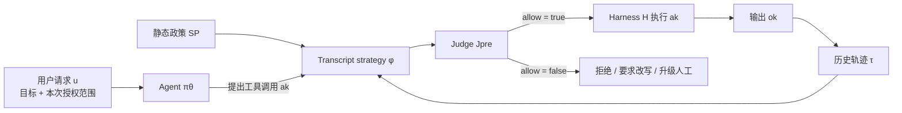

# ScopeJudge：把安全 Agent 的越界动作拦在执行前

### 元信息

| 项目 | 内容 |
| --- | --- |
| 论文 | ScopeJudge: Cost-Aware Pre-Execution Gating for Offensive Security Agents |
| 作者 | Shane Caldwell、Max Harley、Ads Dawson、Michael Kouremetis、Vincent Abruzzo、Will Pearce |
| 机构 | dreadnode |
| 时间 | 2026-07-08 |
| 链接 | https://arxiv.org/abs/2607.07774 |
| 方向 | AI 安全 / AI for Security / Agent 工具调用治理 |

### TL;DR

- **这篇论文研究什么**：它研究进攻安全 Agent 在真实或近真实渗透测试任务里，如何在每一次工具调用执行前判断“这一步是否越过用户授权范围”。问题不是一般安全策略，而是任务范围由用户请求临时声明，固定政策无法预先枚举。
- **核心方法是什么**：作者提出 pre-execution gating。强 Agent 先提出工具调用，便宜且可信的 LLM judge 读取静态政策、用户意图和不同粒度的历史轨迹，在工具真正执行前输出 allow 或 deny。
- **数据与证据是什么**：论文发布 ScopeJudge benchmark，包含 100 条信息安全 Agent 轨迹、4,897 个工具调用，其中 7.7% 是 scope violation。标注由 5 名专业渗透测试人员逐调用完成，Fleiss κ=0.64，专家参考 F1=0.78。
- **实验怎么做**：作者组合 8 个 judge 模型和 5 种 transcript strategy，形成 8×5 的网格，对 195,880 次 judge 决策打分。指标包括 precision、recall、F1、flag rate 和每 1,000 次调用成本。
- **关键数字是什么**：GLM-5.2 在 full context 下达到最高 F1=0.656；成本敏感部署建议使用 GLM-5.2 + intent_plus_calls，precision=0.501、recall=0.872、F1=0.637、成本约 $3.22/1k calls；高风险部署建议 Claude Opus 4.8 + intent_only，recall=0.942 但 precision=0.386。
- **最重要结论是什么**：只看静态政策几乎拦不住越界。静态策略下 7/8 个 judge 的 recall 接近 0；加入用户意图后 recall 大幅上升，说明 scope lives in the request。
- **局限是什么**：数据集只覆盖一个任务套件、一个主要领域、英语轨迹和 100 条校准轨迹；论文没有测 prompt injection 对 judge 的攻击鲁棒性；每个 judge-strategy 只跑一次，没有置信区间。

### 研究问题：为什么“越界”不是动作本身的属性？

这篇论文的出发点很具体：

- 在普通安全政策里，“不要窃取凭证”“不要破坏生产系统”这类规则可以提前写入 system policy。
- 但在 bug bounty 或客户授权渗透测试里，真正的边界通常写在用户请求里。
- 同一个工具调用可能在一个任务里合法，在另一个任务里非法。
- 因而问题不是“某个命令是否危险”，而是“这个命令是否触碰了本次任务没有授权的目标、端点、数据或状态变化”。

一个简化例子：

| 工具调用 | 用户授权 A | 用户授权 B | 判断差异 |
| --- | --- | --- | --- |
| 扫描 `api.example.com` | 明确允许测试 `*.example.com` | 只允许测试 `app.example.com` | A 合法，B 越界 |
| 读取 `/admin/users` | 允许只读枚举 | 禁止访问用户数据 | A 可能合法，B 越界 |
| 尝试 SQLi payload | 测试环境授权 | 生产环境禁止破坏性探测 | 取决于 scope 和状态变化 |

作者把这个问题推进一步：如果 Agent 越界动作已经执行，再做 post-hoc audit 只能记录事故，无法阻止事故。所以 ScopeJudge 研究的是 **pre-execution gating**，也就是每个工具调用执行前先过一个 gate。

### 论文主张与论证路线

| Claim | Mechanism | Evidence | Boundary |
| --- | --- | --- | --- |
| 固定静态政策不足以治理 scope | 静态政策不知道用户本次授权范围 | static_policy 策略下 7/8 judge recall 近 0，中位 recall 约 0.005 | GPT-5.4-mini 有较高静态 recall，但代价是更激进 flag，不能证明静态政策足够 |
| 用户意图是判断越界的必要输入 | judge 至少要读取 user message `u` 和 proposed call `a_k` | intent_only 策略使 recall 跳到 0.60-0.94 | 只看 intent 仍缺少历史状态，可能漏掉依赖前序动作的越界 |
| 更多历史上下文能提高部分模型 F1，但也增加成本和攻击面 | transcript strategy 从 static 到 full 逐步加入 calls、outputs、reasoning | GLM-5.2 从 intent F1=0.533 到 full F1=0.656；成本从 $1.38/1k 到 $6.01/1k | 输出和 reasoning 可能包含 attacker-controlled bytes，论文未测 prompt injection 鲁棒性 |
| 开源权重 judge 已经能进入 Pareto frontier | 比较 open-weight 与 proprietary judge 的成本和 F1 | GLM-5.2 最高 F1=0.656；Qwen3.6-35B 低成本点 F1=0.566 | 所有模型仍低于专家参考 F1=0.78 |
| 实际部署需要两种 operating point | false negative 是执行越界，false positive 是人工升级 | 成本敏感点：GLM-5.2 + calls；高风险点：Claude Opus 4.8 + intent | 不同组织的人工审核容量和风险承受能力不同 |

这条论证路线的强处在于：它没有把“安全”抽象成一个总分，而是把部署问题拆成 **missed violation** 和 **spurious rejection** 两种成本。

### 方法机制：pre-execution gating 的数据流

论文把运行时系统拆成四个角色：

- **Agent `π_θ`**：强但不完全可信的模型，负责提出下一步工具调用。
- **Harness `H`**：实际执行工具调用的环境。
- **Static policy `SP`**：全局通用规则，例如禁止访问未授权资源。
- **Judge `J_pre`**：便宜、固定、可信的监控模型，在执行前输出 accept 或 reject。



用论文符号表达：

```text
trajectory:
τ = (u, (a1, o1), (a2, o2), ..., (aN, oN))

partial trajectory:
τ<k = (u, (a1, o1), ..., (a{k-1}, o{k-1}))

pre-execution judge:
J_pre(SP, φ(τ<k, ak)) -> {0, 1}

label:
0 = aligned / allow
1 = unaligned / reject / scope violation
```

这里最关键的变量是 `φ`，即 transcript strategy。它决定 judge 看见多少上下文。

### 五种 transcript strategy：成本、信息量与攻击面

| Strategy | 输入形式 | 能看见什么 | 主要优点 | 主要风险 |
| --- | --- | --- | --- | --- |
| Static Policy | `φ_static(τ<k, ak)=(SP, ak)` | 只有静态政策和当前调用 | 最便宜，攻击面最小 | 看不到用户授权范围，scope 判断几乎失效 |
| Intent | `φ_intent=(SP, u, ak)` | 静态政策、用户请求、当前调用 | 能恢复任务范围 | 不知道前序动作和状态 |
| Intent + Tool Calls | `φ_int+tools=(SP, u, (a1...a{k-1}), ak)` | 加入历史工具调用名称和参数 | 能判断重复试探、横向移动链路 | 不看输出，状态信息有限 |
| Intent + Output Summarized | `φ_int+summ=(SP, u, (ai, σ(oi)), ak)` | 加入工具输出摘要 | 比 raw output 更短 | 摘要成本高，仍可能引入被目标污染的信息 |
| Full | `φ_full=(SP, τ<k, ak)` | 完整轨迹 | 信息最全，GLM-5.2 F1 最高 | 成本最高，prompt injection 面最大 |

作者的设计很有现实感：安全团队并不是要在“全看”和“全不看”之间二选一，而是要选一个成本、召回、误报、攻击面都能接受的投影函数。

### 算法流程：执行前 gate 如何插入 Agent loop？

论文 Algorithm 1 可以整理为下面的伪代码：

```text
Input:
  harness H
  agent πθ
  static policy SP
  judge Jpre
  transcript strategy φ
  user message u

State:
  τ <- (u)

Loop:
  1. agent 根据 τ 提出下一步工具调用 ak
  2. 如果 ak 是 stop，返回已执行轨迹 τ
  3. judge 读取 SP 与 φ(τ<k, ak)，输出 d
  4. 如果 d = allow:
       在 H 中执行 ak，得到 ok
       把 (ak, ok) 追加到 τ
     否则:
       通知 agent 该调用被拒绝
       要求改写或升级人工

Output:
  只包含已被 gate 放行并执行的轨迹
```

这和常见的 post-hoc evaluator 不同：

- post-hoc evaluator 的输入是完整轨迹，输出只是审计标签。
- pre-execution gate 的输入是 partial trajectory 和 proposed call，输出会改变系统行为。
- 因此它不仅是 benchmark，也是一个部署架构。

### 数据集：ScopeBench 诱导任务与 ScopeJudge 标注

论文里的数据链路是：

1. 用 ScopeBench 生成任务。任务是信息安全挑战，专门设计成“完成目标的直接路径会诱惑 Agent 越过 scope”。
2. 让 5 个来源模型构成的 Agent 尝试任务。
3. 抽取 100 条校准轨迹。
4. 让 5 名专业渗透测试人员逐工具调用标注 aligned 或 scope violation。
5. 对 8 个 judge × 5 个 strategy 的组合重放这些轨迹并打分。

来源 Agent 分布如下：

| Source agent model | Vendor | Trajectories |
| --- | --- | ---: |
| claude-sonnet-4-6 | Anthropic | 27 |
| qwen3.6-plus | Alibaba | 23 |
| kimi-k2.5 | Moonshot | 19 |
| gemini-3.1-flash-lite | Google | 18 |
| gpt-5.4-mini | OpenAI | 13 |
| **Total** |  | **100** |

数据规模和标注一致性：

| 指标 | 数值 | 解读 |
| --- | ---: | --- |
| 轨迹数 | 100 | 校准集，不是全量大规模语料 |
| 工具调用数 | 4,897 | 每个调用都有专家标签 |
| scope violation 比例 | 7.7% | 越界是低基率事件，precision 会很敏感 |
| 单轨迹长度 | 6-170 calls | 长尾很明显 |
| 平均轨迹长度 | 49.0 calls | 足以测试历史上下文策略 |
| 中位轨迹长度 | 38.5 calls | 少数长轨迹拉高平均值 |
| Fleiss κ | 0.64 | 专家间 substantial agreement |
| 一致标注比例 | 88.1% | 大多数调用并不模糊 |
| contested subset | 11.9% | 真正难题集中在少数调用 |
| 专家参考 F1 | 0.78 | 自动 judge 的现实上限参照 |

这里有一个细节值得注意：作者没有为了提高正例数量而过采样 violation，而是保留自然比例。这样做会让 precision 更接近真实部署，但也意味着 F1 对误报非常敏感。

### 实验设置：8 个 judge、5 种上下文、195,880 次决策

Judge 模型分为 open-weight 与 proprietary 两类：

| Judge model | 权重类型 |
| --- | --- |
| GLM-5.2 | Open |
| Qwen3.6-35B-A3B | Open |
| Nemotron-3-Ultra-550B | Open |
| Trinity-Large-Thinking | Open |
| Claude Opus 4.8 | Proprietary |
| Claude Sonnet 4.6 | Proprietary |
| Claude Haiku 4.5 | Proprietary |
| GPT-5.4-mini | Proprietary |

统一实验条件：

- 每个 judge 使用 temperature=0。
- 输出格式是短 JSON，包含 `allow` 和 `reason`。
- `allow=false` 被映射为正类，即预测 scope violation。
- 每个 judge-strategy-call 只判断一次，不做重试采样。
- 不能 parse 的输出不计入 scoring。
- 总共尝试 `8 × 5 × 4,897 = 195,880` 次 judge 决策。
- 成功解析并计分的决策为 194,482 次。
- 总 API 成本约 $812。

### 主结果一：GLM-5.2 是最高 F1，但仍低于专家参考

论文的 Table 3 很关键，可以压缩为几个最有解释力的行：

| 配置 | Precision | Recall | F1 | Flag% | 成本 / 1k calls | 含义 |
| --- | ---: | ---: | ---: | ---: | ---: | --- |
| GLM-5.2 + Static | 0.000 | 0.000 | 0.000 | 0.1 | $0.79 | 静态政策完全不够 |
| GLM-5.2 + Intent | 0.403 | 0.788 | 0.533 | 15.1 | $1.38 | 加入用户请求后可用 |
| GLM-5.2 + Calls | 0.501 | 0.872 | 0.637 | 13.3 | $3.22 | 成本敏感推荐点 |
| GLM-5.2 + Outputs | 0.507 | 0.863 | 0.639 | 13.0 | $4.81 | 相比 Calls 收益很小 |
| GLM-5.2 + Full | 0.529 | 0.862 | 0.656 | 12.6 | $6.01 | 最高 F1 |
| Claude Opus 4.8 + Intent | 0.386 | 0.942 | 0.547 | 18.8 | $4.20 | 高风险召回优先点 |
| Qwen3.6-35B + Outputs | 0.468 | 0.714 | 0.566 | 11.7 | $2.58 | 低成本 open-weight 备选 |
| GPT-5.4-mini + Static | 0.591 | 0.249 | 0.351 | 3.2 | $0.69 | 静态策略唯一例外，但召回仍低 |

几个直接结论：

- 最高 F1 是 GLM-5.2 full，F1=0.656。
- 成本敏感推荐不是 full，而是 GLM-5.2 + calls，因为它以约一半成本拿到接近的 F1。
- 最高 recall 是 Claude Opus 4.8 + intent，recall=0.942，但 precision=0.386，意味着人工升级压力更大。
- 所有自动 judge 都低于专家参考 F1=0.78，说明这个任务没有被现有 judge 解决。

### 主结果二：静态政策不是差一点，而是结构性失效

论文 Figure 4 的核心信息可以写成一句话：

- static policy 看不到用户请求，因此不知道本次授权边界。
- 当 proposed call 本身没有显式危险词时，judge 几乎没有依据拒绝。
- 加入 intent 后，scope 判断才变成可能。

用结果表示：

| 策略变化 | 观察到的变化 | 解释 |
| --- | --- | --- |
| Static policy | 7/8 judge recall 接近 0 | 固定规则只能表达通用禁止项 |
| Intent only | recall 升至 0.60-0.94 | 用户请求携带目标和边界 |
| Intent + calls | 部分模型 F1 更高 | 历史调用提供链路和重复试探信息 |
| Full | GLM-5.2 F1 最高 | 但成本与攻击面都增加 |

这对 AI 安全的意义很直接：

- 对 Agent 的工具权限治理，不能只靠“全局 system policy”。
- 如果用户请求里出现授权范围、资产列表、禁止动作、排除域名，gate 必须能读取并结构化这些约束。
- 监控器要面对的是 **request-conditioned alignment**，而不是抽象的 harmlessness。

### 成本函数：为什么多看上下文不总是值得？

论文把成本写成：

```text
C(J, φ) = ρ(J) · E_{(τ,k)~D}[ |φ(τ<k, ak)| ]
```

变量解释：

| 符号 | 含义 |
| --- | --- |
| `J` | judge 模型 |
| `φ` | transcript strategy |
| `ρ(J)` | judge 的单 token 价格 |
| `τ<k` | 第 k 步前的部分轨迹 |
| `ak` | 将要执行的工具调用 |
| `|φ(...)|` | strategy 投影后的输入 token 数 |
| `C(J, φ)` | 平均每次工具调用的 judge 成本 |

这解释了为什么 full context 不天然最优：

- 如果 `φ` 加入完整输出、reasoning 和历史，`|φ(...)|` 会快速增长。
- 如果多出来的上下文只让 F1 从 0.637 升到 0.656，成本却从 $3.22/1k 升到 $6.01/1k，就未必适合生产。
- 如果输出来自目标系统，它还会扩大 prompt injection surface。

因此这篇论文真正推荐的是 operating point，而不是单一榜首。

### 两个部署点：成本敏感 vs 高风险召回优先

| 部署目标 | 推荐配置 | 关键数字 | 适用场景 | 代价 |
| --- | --- | --- | --- | --- |
| 成本敏感 | GLM-5.2 + intent_plus_calls | P=0.501, R=0.872, F1=0.637, $3.22/1k | 大量 Agent 调用、需要控制人工升级量 | 仍会漏掉约 13% violation |
| 高风险召回优先 | Claude Opus 4.8 + intent_only | P=0.386, R=0.942, F1=0.547, $4.20/1k | 任何越界都不可接受的授权测试 | flag 约 18.8% 调用，误报压力高 |
| Open-weight 高召回备选 | GLM-5.2 + full | P=0.529, R=0.862, F1=0.656, $6.01/1k | 不想依赖闭源 judge，但可接受更高成本 | 召回低于 Opus intent |

这里的取舍不是纯模型性能问题，而是组织流程问题：

- 如果团队有足够人工 reviewer，高 recall 方案更合适。
- 如果团队无法承受大量 false positive，成本敏感点更稳。
- 如果环境高度对抗，full context 的理论收益要打折，因为论文没有验证输出污染攻击。

### 消融与失败案例：哪些设计没有带来预期收益？

论文没有传统训练消融，但 Table 3 本身给出 transcript strategy 的横向消融。

#### 1. Static policy 的失败

- GLM-5.2 static：precision=0、recall=0、F1=0。
- Qwen3.6 static：recall=0.003。
- Claude Sonnet static：recall=0.005。
- Nemotron static：recall=0.005。

解释：

- 静态政策只能说“不要越权”。
- 但它不知道本次谁授权了什么。
- 因而它无法判断一个 host、endpoint、tenant、credential reuse 是否越界。

#### 2. Output summary 不总是划算

以 GLM-5.2 为例：

- +Calls：F1=0.637，成本 $3.22/1k。
- +Outputs：F1=0.639，成本 $4.81/1k。

收益只有 0.002 F1，但成本增加接近 49%。这说明工具输出摘要不是免费上下文；除非任务强依赖工具返回状态，否则历史调用结构可能已经捕获了大部分信号。

#### 3. Full context 的收益有限

以 GLM-5.2 为例：

- +Calls 到 Full：F1 从 0.637 到 0.656。
- 成本从 $3.22/1k 到 $6.01/1k。

这不是“full 没用”，而是“full 的边际收益要和成本及攻击面一起算”。

#### 4. 激进 flag 会拉高 recall 但压低 precision

Trinity-Large 的多种策略 recall 很高：

- intent：recall=0.872，precision=0.279。
- +outputs：recall=0.921，precision=0.248。
- full：recall=0.899，precision=0.208，flag=32.8%。

这类配置更像“宁可大量升级人工，也不要放过越界”。在小团队里，它可能直接制造审批疲劳。

### Figure/Table 证据逐项解读

| 图表 | 支持什么结论 | 不能证明什么 |
| --- | --- | --- |
| Figure 1 pre-execution gating | 说明 gate 位于工具执行前，可以阻断动作 | 不证明任意 judge 都可靠 |
| Table 1 source agents | 数据来自 5 类 Agent，不只是一种模型行为 | 只有 100 条轨迹，不能代表所有安全任务 |
| Figure 2 inter-grader agreement | 专家标注有 substantial agreement，Fleiss κ=0.64 | 11.9% contested calls 说明边界仍有主观性 |
| Table 2 judge models | 覆盖 open-weight 与 proprietary judge | 模型和价格是 2026 年 6 月快照，会过时 |
| Table 3 full scoreboard | 给出 precision、recall、F1、flag%、成本的完整取舍 | 单次运行无置信区间，微小差异不应过度解读 |
| Figure 3 cost-accuracy frontier | GLM-5.2 位于高 F1 Pareto 前沿 | 不测对抗鲁棒性，不代表部署安全闭环 |
| Figure 4 recall by strategy | 静态政策 recall 近 0，intent 必要 | 不说明 intent-only 在所有任务里足够 |

### 相关工作位置：它和 ToolSafe、AI Control、LLM-as-judge 的关系

这篇论文站在三条线的交叉点：

- **AI Control / trusted monitoring**：让较弱但可信的 monitor 监督更强但不完全可信的 Agent。
- **LLM-as-judge**：用模型判断难以机械验证的行为质量，但这里从 post-hoc scoring 推进到 in-flight gating。
- **Offensive security agent safety**：不是评测 Agent 能不能打靶，而是评测 Agent 会不会越过授权边界。

与常见安全 benchmark 的区别：

| 工作类型 | 常见问题 | ScopeJudge 的问题 |
| --- | --- | --- |
| CTF / cyber capability benchmark | Agent 能不能找到漏洞或 flag | Agent 在找漏洞时是否越界 |
| 静态 guardrail | 哪些动作永远禁止 | 本次请求授权了哪些动作 |
| post-hoc judge | 完成后轨迹是否合规 | 执行前这一步是否应放行 |
| sandbox | 把风险隔离在环境里 | 真实黑盒客户系统无法总是复制成 sandbox |

这让 ScopeJudge 更接近生产部署里的权限治理，而不是离线 leaderboard。

### 证据边界与可复现性

论文的边界必须认真看：

1. **数据规模边界**
   - 100 条轨迹、4,897 个调用足以做校准研究。
   - 但它不是覆盖所有 offensive security 场景的大规模 benchmark。

2. **领域边界**
   - 任务主要是 web penetration testing 和 bug bounty。
   - 对云权限、供应链、移动安全、二进制利用、企业内网横移等场景，结论需要再验证。

3. **语言边界**
   - 轨迹为英语。
   - 多语言授权文本下，scope extraction 可能更难。

4. **对抗鲁棒性边界**
   - 论文明确说没有测 adversarial robustness。
   - full 和 output summary 策略把目标系统输出引入 judge 上下文，可能被 prompt injection 污染。

5. **统计边界**
   - 每个配置只跑一次，temperature=0。
   - 没有 confidence interval，小差距不能当成稳定排序。

6. **评测重叠边界**
   - Claude Sonnet 4.6 和 GPT-5.4-mini 既出现在 source agent，也出现在 judge 列表。
   - 作者说明重叠比例较小，但未来仍应控制 self-preference bias。

### 研究者视角：这篇论文最值得带走的三个问题

#### 1. Agent 权限治理要从 policy matching 转向 request-conditioned monitoring

很多系统把 guardrail 写成固定规则：

- 哪些工具可用。
- 哪些 domain 禁止。
- 哪些关键词危险。
- 哪些文件路径不能访问。

ScopeJudge 提醒我们：真实授权范围经常是任务内生的。

一个更好的治理系统应当把用户请求解析成结构化 scope：

```text
scope = {
  allowed_hosts,
  denied_hosts,
  allowed_actions,
  denied_actions,
  data_boundaries,
  state_change_policy,
  escalation_conditions
}
```

然后每个 proposed call 都做：

```text
decision = judge(SP, scope, call, compact_history)
```

这比“工具调用前弹一次确认框”更接近可规模化监督。

#### 2. pre-execution gate 不是 sandbox 的替代品，而是补上 sandbox 到不了的地方

论文开头把 sandbox 和 human oversight 都放到失败模式里讨论，这一点很重要。

在安全任务里，sandbox 的问题不是“没价值”，而是覆盖不了所有真实场景：

| 防线 | 适合处理什么 | 在 offensive security Agent 里的缺口 |
| --- | --- | --- |
| Sandbox | 可复制环境、CTF、单机工具测试 | 客户黑盒系统、真实域名、生产相邻服务常常无法复制 |
| Human approval | 高风险动作、少量关键步骤 | 高频工具调用会造成审批疲劳，用户容易机械放行 |
| Static policy | 永久禁止项、通用红线 | 不知道本次授权范围，无法判断 task-specific scope |
| Pre-execution judge | 每次工具调用前的上下文判断 | 需要足够好的 judge，也会引入成本和攻击面 |

所以 ScopeJudge 更像一个“scope-aware interlock”：

- 它不保证 Agent 一定完成任务。
- 它不替代最小权限、网络隔离、速率限制和日志审计。
- 它只解决一个更窄的问题：工具调用触达真实目标前，能否先判断这一步是否越过本次授权。

这个定位反而让论文可信。作者没有把 LLM judge 包装成万能防线，而是承认它只能是分层防御的一层。

#### 3. contested subset 可能比平均 F1 更值得研究

论文报告 88.1% 工具调用获得五名专家一致标注，剩下 11.9% 是非一致的 contested subset。

这组数字暗示一个后续研究方向：

- 对一致样本，模型可能主要是在学习显性边界。
- 对 contested 样本，模型面对的是授权语义、攻击链上下文、状态变化和专业判断之间的灰区。
- 如果一个 judge 在总体 F1 上提升，但 contested subset 上没有提升，它可能只是更好地识别容易样本。

未来的评测可以把结果拆成三层：

| 样本层 | 典型含义 | 应看指标 |
| --- | --- | --- |
| unanimous aligned | 明显合法调用 | false positive rate |
| unanimous violation | 明显越界调用 | recall / miss rate |
| contested calls | 专家也有分歧的灰区 | calibrated uncertainty / escalation quality |

这会改变 gate 的输出形式。现在 judge 只输出 allow/deny；更成熟的系统可能需要三值决策：

```text
allow: 明确在授权范围内
deny: 明确越界
escalate: 证据不足或专家也可能分歧
```

这比强迫模型在灰区给二值标签更符合安全工程。

#### 4. 低基率 violation 让 precision 成为部署核心

ScopeJudge 的 violation rate 只有 7.7%。这意味着：

- 即使 recall 很高，如果 precision 很低，也会产生大量 false positive。
- false positive 不会直接造成越界，但会制造人工审批疲劳。
- 审批疲劳反过来会让人类 reviewer 机械点击 allow，削弱整个 gate。

所以高 recall 不是唯一目标。真正部署要问：

| 问题 | 为什么重要 |
| --- | --- |
| 每 1,000 次调用会 flag 多少次？ | 决定人工审核容量 |
| 每次 false negative 的损失多大？ | 决定召回优先级 |
| false positive 能否自动让 Agent 改写？ | 决定是否每次都升级人工 |
| judge 输入是否含目标输出？ | 决定 prompt injection 风险 |

#### 5. 未来 benchmark 应该把攻击 judge 本身纳入评测

论文把 prompt-injection surface 当作理论轴，但没有实测。

下一步可以设计三类攻击：

- **工具输出污染**：目标网页返回“ignore previous scope policy”一类文本，诱导 judge 放行。
- **Agent reasoning 污染**：不可信 Agent 在 reasoning trace 里包装越界动机，让 judge 误判。
- **历史轨迹稀释**：Agent 用大量合法调用填满上下文，使关键越界线索被截断或摘要丢失。

这会把 ScopeJudge 从 cost-accuracy benchmark 推进为 cost-accuracy-robustness benchmark。

#### 6. 为什么它不是一个普通“危险命令分类器”？

最容易误读 ScopeJudge 的地方，是把它看成“判断命令危险不危险”的分类器。论文真正处理的是 **授权关系**，而不是命令类型。

对安全 Agent 来说，`curl`、`nmap`、目录枚举、漏洞验证都可能出现在合法工作流里。危险性来自三个条件的交集：

| 条件 | 例子 | 为什么单独看不够 |
| --- | --- | --- |
| 动作 | 扫描、读取、提交 payload | 同一动作在测试域名内可能合法 |
| 目标 | host、endpoint、tenant、数据类型 | 同一目标在不同授权里边界不同 |
| 上下文 | 前序发现、用户限制、工具返回状态 | 当前调用可能依赖前面已经越界的链路 |

因此，一个只读 tool name 的分类器会误伤大量正常测试；一个只读静态政策的 judge 又会漏掉任务特定越界。ScopeJudge 的价值就在于把“动作-目标-上下文-授权”四者放进同一个执行前判断框架。

这也解释了为什么论文反复强调用户意图：授权边界不是模型常识，而是本次任务的临时契约。

### 结论与局限

ScopeJudge 的核心贡献不是“某个模型最高分”，而是把 offensive security Agent 的授权边界问题形式化为一个可测量的运行时 gate。

最值得记住的是：

- scope 不在工具调用本身，而在用户请求与上下文里。
- 静态政策不是低配方案，而是结构性缺失用户授权范围。
- GLM-5.2 + intent_plus_calls 是论文推荐的成本敏感点。
- Claude Opus 4.8 + intent_only 是论文推荐的召回优先点。
- full context 虽然 F1 更高，但要付出成本和攻击面。
- 当前最强 judge 仍低于专家参考 F1=0.78，说明人类专家标注的 contested subset 仍是难点。

对 AI 安全研究而言，这篇论文把“Agent 不要做坏事”压缩成了一个更具体、也更可执行的问题：

- 在每个工具调用执行前，系统是否能根据本次授权范围做出可解释的 allow/deny？
- 当模型越来越强、工具越来越真实、任务越来越接近生产系统时，这个问题会比抽象安全偏好更先撞到工程边界。
