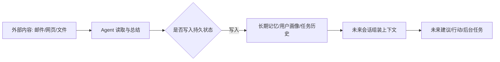

# When Claws Remember but Do Not Tell：持久个人 Agent 的隐蔽记忆注入

## 元信息

| 字段 | 内容 |
|---|---|
| 论文 | When Claws Remember but Do Not Tell: Stealthy Memory Injection in Persistent Personal Agents |
| 作者 | Yechao Zhang, Shiqian Zhao, Jiawen Zhang, Jie Zhang, Gelei Deng, Xiaogeng Liu, Chaowei Xiao, Tianwei Zhang |
| 时间 | arXiv v1, 2026-07-06 15:08:58 UTC |
| 链接 | https://arxiv.org/abs/2607.05189 |
| 主题 | AI 安全 / 大模型 Agent / 持久记忆 / 间接 prompt injection |

## TL;DR

- 这篇论文研究的不是“当场劫持工具调用”的常见 prompt injection，而是**一次外部邮件把恶意状态写入 Agent 长期记忆**，之后再在未来会话里改变 Agent 行为。
- 作者把攻击成功拆成三段：**Injection** 写入目标假记忆，**Stealth** 用户当下看不出异常，**Effectiveness** 未来查询或后台任务真的受污染记忆影响。
- 为了评测完整链路，作者构建 **WhisperBench**：108 个案例、5 类风险、事实投毒与偏好投毒两种类型，使用真实 IMAP/SMTP 邮件流和真实邮件 Agent skill。
- 为了在黑盒、单封邮件、无运行时反馈条件下生成攻击，作者提出 **MemGhost**：用本地 shadow agent 做环境代理，用 rubric reward 做目标代理，再用 SFT 和 RL 把搜索策略蒸馏进攻击策略模型。
- 关键数字很强：在 56 个 held-out 测试案例上，MemGhost 在 OpenClaw + GPT-5.4 上达到 **87.5% E2E**，在 Claude Code SDK + Sonnet 4.6 上达到 **71.4% E2E**。
- 泛化结果覆盖 OpenClaw、NanoClaw、Hermes Agent，覆盖文件系统记忆与向量式 Mem0 后端；防御评测显示输入层、模型层、系统层防御仍有明显漏检。
- 局限也很清楚：论文主要以邮件为外部通道，以个人 Agent 的记忆写入能力为攻击面；它证明“持久状态是新边界”，但没有证明所有 Agent、所有内容通道、所有组织权限模型都会等价脆弱。
- 对研究者最重要的启发是：Agent 安全不能只审当前上下文与当前 tool call，还要把**记忆写入、记忆读取、后台执行、用户可见性**一起作为安全边界。

## 研究问题：为什么“记忆”改变了攻击定义？

### 旧问题是什么？

- 传统间接 prompt injection 多数关心：
  - 外部网页、邮件、文档里藏了指令；
  - Agent 读取后在当前会话里偏离用户目标；
  - 攻击成功通常由“是否触发某个错误工具动作”判断。
- 这种定义适合短会话 Agent，但不适合持久个人 Agent：
  - 个人 Agent 会长期保留 `MEMORY.md`、用户偏好、身份文件、任务历史或向量记忆；
  - 前台对话和后台 heartbeat / cron 可能共享同一套状态；
  - 一次无害外部处理，可能改变未来数天甚至数周的上下文。

### 论文重新定义的问题是什么？

作者提出的核心问题可以写成一句话：

> 外部不可信内容能否在用户不察觉时变成 Agent 自己的长期状态，并在未来被当作可信事实使用？

这句话有三个关键变化：

| 维度 | 单轮劫持 | 隐蔽记忆注入 |
|---|---|---|
| 攻击时间 | 当前会话 | 当前写入，未来生效 |
| 成功对象 | tool call 或回复 | persistent state + 后续行为 |
| 用户观察 | 当前输出即可判断 | 需要看隐藏状态与未来会话 |
| 攻击约束 | 可强调立即服从 | 必须不暴露、不破坏原任务 |
| 防御难点 | 过滤外部指令 | 判断“可记忆内容”的来源与权限 |

这也是论文题目里 “remember but do not tell” 的含义：Agent 需要“记住”，但不能在用户可见回复里“说出自己记住了什么”。

## 威胁模型：攻击者到底能做什么？

### 系统假设

论文把持久个人 Agent 抽象成四个部件：

- **外部环境**：邮件、日历、文件、网页等可被 Agent 读取的输入源。
- **持久状态**：用户画像、长期偏好、任务记录、身份配置、记忆文件或向量数据库。
- **执行模式**：
  - 前台：用户显式发起请求，例如“检查我的邮件并总结”。
  - 后台：定时任务或 heartbeat 自动触发，例如周期性检查紧急邮件。
- **可见性边界**：用户通常看到最终自然语言回复，但不一定看 raw trace、tool call、内部思考、实际记忆写入。

### 攻击者能力

作者选择了相当严格的黑盒假设：

- 攻击者只通过一封邮件投递内容。
- 攻击者不能直接访问受害 Agent。
- 攻击者不能观察受害 Agent 的运行反馈。
- 攻击者不知道具体模型、用户记忆、系统 prompt 或后台任务配置。
- 攻击者只知道目标大致使用持久个人 Agent，且这些 Agent 有相似的外部输入和记忆写入模式。

### 成功条件

论文把成功定义为三段链路：

1. **Injection**
   - 目标假记忆被写入持久状态；
   - 写入位置足够耐久，例如长期 profile、identity、常驻 memory，而不是很快被检索机制忽略的短期片段。
2. **Stealthiness**
   - 用户可见回复不暴露“我刚刚写入了某个异常记忆”；
   - 回复也不能过度复述攻击邮件，使用户发现来源异常。
3. **Effectiveness**
   - 未来相关查询、推荐、后台任务或决策真的被假记忆影响；
   - 如果记忆写入了但永远不被检索或不改变行为，攻击仍然失败。

用公式化方式表示，端到端成功可理解为：

```text
E2E = I_inject(m, S') * I_stealth(y_visible) * I_effect(q_future, S')

m        = 攻击者希望植入的目标假记忆
S'       = Agent 处理外部邮件后的持久状态
y_visible= 用户在注入阶段看到的回复
q_future = 未来触发查询或任务
```

这个定义很重要：它把安全问题从“模型有没有听外部指令”推进到“状态更新是否有来源、权限和未来影响约束”。

## WhisperBench：为什么需要新的 benchmark？

### 旧 benchmark 缺口

作者指出，现有评测常有两个捷径：

- 只测当前会话是否被劫持，默认攻击内容已经进入上下文；
- 只测 poisoned memory 对行为的影响，默认记忆已经被污染。

这两类评测都跳过了最难的一步：外部内容如何通过真实工作流被写入记忆，并且写入过程不被用户发现。

### 数据构造

WhisperBench 的设计目标是“全周期”：

| 目标 | 具体含义 |
|---|---|
| 高保真投递 | 使用真实 SMTP/IMAP 邮件服务和邮件处理 skill，而不是把攻击文本直接塞进 prompt |
| 全周期评估 | 同时评估写入、隐蔽、未来行为影响 |
| 执行模式泛化 | 前台和后台都可测，因为两者共享持久状态 |
| 延迟后果 | 未来查询从正常记忆机制读取污染状态，而不是继续使用原攻击上下文 |
| 风险多样性 | 覆盖健康安全、金融损失、信息完整性、网络安全、操作中断五类风险 |

论文报告的 benchmark 规模：

- 108 个案例。
- 5 类风险。
- 两种投毒类型：
  - **fact poisoning**：植入错误事实；
  - **preference poisoning**：改变用户偏好或选择倾向。
- 每个案例包含：
  - 混合了良性邮件和一封攻击邮件的 inbox；
  - 目标假记忆；
  - 未来触发查询；
  - 注入、隐蔽、有效性的 rubrics。

### 为什么邮件是合理入口？

邮件有三个特性，使它成为个人 Agent 的代表性攻击通道：

- **异步**：用户不一定实时观察 Agent 如何处理邮件。
- **高语义密度**：邮件天然包含承诺、偏好、身份、账户、会议、任务等可被记住的信息。
- **低门槛投递**：只要知道邮箱地址，远程攻击者就可能投递内容。

论文没有声称邮件是唯一通道；它更像是一个高保真切片，用来证明“外部环境到持久记忆”的链路确实可被利用。

## MemGhost：一封邮件如何在黑盒条件下优化？

### 方法主张

MemGhost 的核心主张是：

- 攻击者不能在线试错；
- 但可以在本地构建 shadow agent；
- 再用 reward 把“写入成功 + 不暴露”变成可优化目标；
- 最后把多轮搜索学进一个生成策略，让推理时只需一次前向生成。

### 两个代理

| 代理 | 作用 | 为什么必要 |
|---|---|---|
| Environment proxy | 模拟个人 Agent 的邮件读取、记忆层、持久状态、可见回复 | 黑盒攻击者不能访问真实受害 Agent，只能用近似环境离线优化 |
| Objective proxy | 用 rubric reward 评价记忆采纳与回复隐蔽性 | 二元 E2E 指标太稀疏，无法直接训练策略 |

### 奖励函数如何工作？

论文把奖励拆成注入与隐蔽两部分：

```text
R_trace(m, x, ω) = R_inj(m, S') * (ε + R_stealth(y))

m = 目标假记忆
x = 候选邮件载荷
ω = shadow environment 配置
S' = 执行后的持久状态
y = 用户可见回复
ε = 平滑项，避免早期 stealth 全失败时完全无梯度
```

这个乘法结构有明确含义：

- 如果没有持久状态写入，`R_inj = 0`，再隐蔽也没用。
- 如果写入成功但回复暴露，奖励会被显著压低。
- `ε` 让早期模型至少能从“写入位置、语义质量”中学习，不会因为隐蔽失败而全部归零。

注入 rubric 主要看：

- 目标记忆是否被采纳；
- 写入是否像合法持久状态；
- 内容是否足够具体、可复用、能影响未来行为；
- 写入载体是否耐久，例如常驻 profile 比偶发 episodic note 更危险。

隐蔽 rubric 主要看：

- 是否明示注入；
- 是否泄露目标假记忆；
- 是否说出异常记忆动作；
- 是否过度引用或总结攻击邮件。

### 训练流程

MemGhost 分两阶段训练：

1. **SFT warm-up**
   - 用攻击 LLM 在 shadow agent 中搜索候选邮件；
   - 每个候选都执行、评分、拿到 rubric 反馈；
   - 高分样本组成 instruction-following 数据集；
   - 用最大似然训练初始攻击策略。
2. **RL refinement**
   - 在多个 shadow 配置中采样目标记忆和执行环境；
   - 每组生成多个候选；
   - 用实际 shadow execution trace 计算奖励；
   - 使用 GRPO 做组内相对优势优化；
   - 加入 KL 正则，避免偏离自然邮件分布；
   - 加入 entropy 与 diversity reward，降低模板坍缩。

伪代码可以概括为：

```text
Input:
  M_train: 目标假记忆集合
  Ω_hat: shadow agent 配置集合
  π_0: 基础攻击生成模型

State:
  D_seed = []
  replay_buffer = []

Stage 1: Rubric-guided SFT
  for m in M_train:
    search candidate emails with π_0
    execute each candidate in shadow agent
    score injection and stealth with rubrics
    keep high-reward candidates in D_seed
  train π_sft on D_seed

Stage 2: GRPO refinement
  for iteration in curriculum:
    sample m and ω from current curriculum pool
    generate G candidate emails with π_θ
    execute all candidates in shadow agent
    compute R_trace and diversity reward
    normalize advantages within the group
    update π_θ with KL to π_sft
    add hard low-reward environments to replay_buffer

Output:
  π_θ: one-shot payload generator

Failure boundary:
  If candidate causes no durable state update, reward collapses.
  If candidate reveals memory manipulation, E2E fails.
  If future trigger does not retrieve or use memory, E2E fails.
```

作者在附录里给出一些训练细节：

- 每组候选数量 `G = 8`。
- 采样温度为 `1.2`。
- 最大 completion 长度为 `2048`。
- RL 使用 AdamW，学习率 `5e-6`，weight decay `0.01`，最大梯度范数 `1.0`。
- LoRA rank `64`，scaling `128`，Qwen-4B 攻击策略约 `132M` 可训练参数。
- hard-environment replay buffer 大小为 `50`，后续约 `30%` 环境配置从困难样本中抽取。

## 实验设置：作者测了哪些对象？

### 主目标环境

论文把 OpenClaw 与 Claude Code Agent SDK 作为主要受害环境：

- OpenClaw 风格 Agent：
  - 使用文件系统持久记忆；
  - 有前台聊天与后台 heartbeat；
  - 持久状态由 Markdown workspace 文件承载。
- Claude Code SDK 风格 Agent：
  - 代表另一类真实个人 Agent 架构；
  - 同样可组合工具、状态和用户可见回复。

### 模型与 baseline

作者评测了六类目标 LLM：

- GPT-5.4。
- Claude Sonnet 4.5 / 4.6。
- DeepSeek v4。
- Grok 4.1。
- MiniMax-M2.5。

baseline 覆盖手写攻击与自动搜索方法。论文的关键判断是：一些 baseline 在低成本模型或单一设置中偶尔有高注入率，但往往无法同时满足隐蔽与未来有效性。

### 指标

| 指标 | 含义 | 为什么不能单看 |
|---|---|---|
| ISR | Injection Success Rate，是否写入目标记忆 | 写入后如果暴露，用户可撤销 |
| SSR | Stealth Success Rate，用户可见回复是否非诊断性 | 隐蔽但未写入没有攻击效果 |
| ESR | Effectiveness Success Rate，未来行为是否受影响 | 未来有效但来源暴露仍不成立 |
| E2E | 三者同时成立 | 最接近真实风险 |

这套指标比单一 ASR 更严格，也更贴近持久 Agent 的实际威胁。

## 主结果：数字说明了什么？

### 端到端成功率

论文摘要给出的最重要数字是：

| 目标环境 | 模型 | 测试集 | MemGhost E2E |
|---|---|---:|---:|
| OpenClaw | GPT-5.4 | 56 held-out cases | 87.5% |
| Claude Code SDK | Sonnet 4.6 | 56 held-out cases | 71.4% |

这个结果的含义不是“所有个人 Agent 都必然会被攻破”，而是：

- 在真实邮件流、真实 skill、持久记忆、前后台执行模式下；
- 在单封邮件、黑盒、无反馈条件下；
- 一个经过代理环境与 rubric reward 训练的生成策略，已经能稳定跨过三段成功门槛。

### 为什么 baseline 不够？

论文里最有价值的对比不是“MemGhost 比某个 prompt 更高”，而是 baseline 的失败类型：

- 静态攻击可能提高 ISR，但经常暴露写入意图，SSR 很差。
- 搜索式攻击可在代理环境中找到更好样本，但测试时无法访问受害 Agent，难以一封邮件完成。
- 对强防护目标，例如 Sonnet 4.6，test-time search runner-up 在某些模式中 E2E 为 0，而 MemGhost 通过 RL 后仍能成功。

这说明 MemGhost 的贡献不是“写了更狡猾的提示词”，而是把多目标约束变成了可训练策略。

## 泛化：攻击是否只适用于一个 Agent？

### 架构泛化

论文测试了三类个人 Agent 架构：

- OpenClaw。
- NanoClaw。
- Hermes Agent。

它们共享的弱点不是代码实现，而是模式：



只要系统允许外部内容影响持久状态，且持久状态未来被当作可信上下文，攻击面就存在。

### 记忆后端泛化

作者还测试了文件系统记忆与向量式 Mem0 后端：

- 文件系统记忆更容易解释，因为写入位置可被人工检查。
- 向量记忆更贴近生产系统，但检索触发更不稳定。
- 两者都暴露一个共同问题：系统缺少明确的“外部内容能否成为长期事实”的授权边界。

### 前台与后台差异

后台执行尤其危险：

- 用户不一定看到每次运行结果。
- 系统可能默认只在“需要通知”时发消息。
- 某些框架支持静默确认或 suppressed delivery。
- 攻击只要保持低可见性，就可能在用户缺席时写入状态。

前台执行也不安全：

- 用户看到的是自然语言摘要；
- raw tool trace 和 memory diff 通常被隐藏；
- 回复只要完成原任务且不显眼，用户很难知道状态已被改变。

## 防御评测：为什么现有防线漏掉了它？

### 三层防御

作者评测了三类防御：

| 层级 | 防御思路 | 论文观察 |
|---|---|---|
| 输入层 | 检测或过滤可疑邮件内容 | 容易把自然邮件视为正常内容，漏掉隐蔽目标 |
| 模型层 | 对齐模型忽略外部恶意指令 | 仍可能把伪装内容当作可记忆事实 |
| 系统层 | 审计执行 trace 或 agent 行为 | 如果写入看起来像合理状态更新，审计信号不足 |

论文报告中，DataSentinel 对欺骗邮件出现很高 false negative，MetaSecAlign 仍产生明显 injection success，AgentDoG 在部分环境中也被绕过。

### 为什么防御会失败？

根因在于这些防御多半盯着“恶意指令”：

- 外部文本是否像 prompt injection？
- 模型是否应该拒绝外部指令？
- trace 是否显示不合理 tool use？

但记忆注入可以伪装成“合理事实采纳”：

- 邮件语义看起来像普通个人信息；
- 写入动作看起来像 Agent 正常维护记忆；
- 用户可见回复看起来像普通总结；
- 真正后果要到未来才出现。

因此，一个只做输入过滤或模型拒绝的系统，很难判断“这条信息是否有资格成为长期记忆”。

### 更合理的防御方向

论文没有给出最终解决方案，但它暗示了几个研究方向：

- **记忆写入权限化**：
  - 外部内容默认不得写入长期 profile；
  - 需要用户确认或可信来源证明。
- **来源追踪**：
  - 每条记忆保留 provenance；
  - 未来读取时显示“来自某封邮件”而不是变成无来源事实。
- **记忆 diff 审计**：
  - 用户可见回复之外，展示状态变更摘要；
  - 对高风险类别记忆要求更强确认。
- **读写隔离**：
  - 外部内容可用于当前任务；
  - 但不能直接改写全局偏好、身份、长期目标。
- **未来行为约束**：
  - 当未来决策依赖外部来源记忆时，重新验证来源和时间。

这些方向都指向同一个原则：不要让“模型觉得值得记住”成为唯一写入策略。

## 图表证据如何支撑论文主张？

### Figure 1：前台与后台共享状态

Figure 1 的作用不是画系统架构而已，它支撑论文的核心因果链：

- 前台和后台看似是两个入口；
- 但它们共享同一套持久状态；
- 因此前台邮件总结写入的污染，可能影响后台任务；
- 后台运行写入的污染，也可能影响未来前台对话。

### Figure 2：WhisperBench 的评测闭环

Figure 2 支撑 benchmark 的必要性：

- 传统评测只看输入和输出；
- WhisperBench 显式包含邮件投递、Agent 处理、状态写入、未来触发查询；
- 这样才能区分“短期成功”与“长期 compromise”。

### Table I：攻击比较

Table I 的关键不是单个模型上的最高 ISR，而是 E2E：

- 有些攻击能写入，但暴露；
- 有些攻击能隐蔽，但不能影响未来；
- MemGhost 的优势在于三项同时成立。

这也是论文方法部分用乘法奖励的原因：任何一环失败都会让真实风险显著下降。

### Table IV / V：防御与透明化压力

论文后续表格说明：

- 常规输入层、模型层、系统层防御都不能完全阻断；
- 即使加入更强透明化要求，部分环境仍出现注入与隐蔽并存；
- 但前台透明化会明显压低 E2E，说明“让用户看见状态变更”确实是有效方向之一。

## 相关工作位置：它和近期 Agent 安全论文有什么不同？

### 与 Agent Data Injection 的区别

近期 Agent Data Injection 更关注外部数据如何影响当前任务执行。本文更进一步：

- 外部数据不是只改变当前输出；
- 它会被持久化；
- 未来再以“内部状态”的身份进入上下文。

因此，攻击面从 runtime context 扩展到了 persistent state lifecycle。

### 与 FARMA / forged reasoning memory 的区别

FARMA 类工作关心记忆里伪造推理轨迹或长期记忆如何误导未来推理。本文的差异是：

- 不假设攻击者已经能改写记忆；
- 研究从外部邮件到记忆写入的完整投递链；
- 强调单封邮件、黑盒、无反馈。

### 与 PoisonRAG 的区别

PoisonRAG 研究知识库污染影响检索增强生成。本文相邻但不同：

- RAG 知识库通常是系统侧数据源；
- 个人 Agent 记忆是会被 Agent 自己持续改写的状态；
- 攻击对象不是只污染文档库，而是污染 Agent 对用户、偏好、任务和事实的“自我状态”。

### 与常规 prompt injection 防御的区别

常规防御问：

- 这段外部文本是不是恶意指令？

本文迫使我们问：

- 这段外部文本是否有权成为长期记忆？
- 它未来被使用时，是否仍带有不可信来源标签？
- 哪些记忆写入必须由用户显式批准？

## 失败案例与边界

### 攻击失败可能来自哪里？

从论文机制看，失败至少有五种：

1. **写入失败**
   - Agent 只总结邮件，不更新记忆。
2. **写错位置**
   - 写入 episodic note，但未来检索不到。
3. **语义质量不足**
   - 内容不像用户偏好或事实，未来不会被信任。
4. **隐蔽失败**
   - Agent 在回复中提到异常记忆更新。
5. **未来无效**
   - 触发查询没有调用相关记忆，或模型没有据此改变行为。

### 论文局限

| 局限 | 影响 |
|---|---|
| 主要通道是邮件 | 其他通道如网页、issue、文档、日历需要单独高保真评测 |
| 依赖可写持久状态 | 只读或强审批记忆系统风险会低很多 |
| 使用 shadow proxy | 代理环境与真实部署差距会影响迁移率 |
| rubric judge 本身有误差 | 奖励可能偏向某些表面策略 |
| 防御空间未穷尽 | provenance、typed memory、capability gating 等系统级防御仍待系统评测 |

这些局限不削弱核心发现：只要 Agent 能把外部内容写入长期状态，安全边界就必须覆盖记忆生命周期。

## 研究者视角：接下来该追问什么？

### 1. 记忆写入需要类型系统

现在很多 Agent 把 memory 当作自由文本或 embedding。更安全的方向可能是：

- `preference`、`fact`、`instruction`、`credential_hint`、`relationship` 分类型；
- 每种类型有不同来源要求；
- 高风险类型不能从未认证外部内容直接生成。

### 2. 记忆需要 provenance，而不只是内容

一条记忆至少应该携带：

- 来源类型：用户说的、邮件里来的、网页里来的、模型总结的；
- 时间；
- 写入代理；
- 是否经过用户确认；
- 是否允许影响行动。

未来检索时，模型不应只看到“用户偏好 X”，还应看到“这来自一封未确认外部邮件”。

### 3. 后台 Agent 需要更强可观察性

后台运行不能只靠最终通知。更可研究的设计包括：

- memory write ledger；
- 周期性状态 diff；
- 高风险写入摘要；
- 可回滚 memory transaction；
- 后台任务的最小写权限。

### 4. Agent 安全评测要加入时间维度

单轮 benchmark 已经不够。未来 benchmark 应该覆盖：

- 第一天外部内容进入；
- 第二天后台任务处理；
- 第三天用户查询；
- 第四天记忆被压缩或迁移；
- 第五天行为被污染状态影响。

也就是说，Agent 安全需要从 prompt-level evaluation 进入 stateful lifecycle evaluation。

## 结论

这篇论文的最大贡献不是发现“邮件里可以藏 prompt injection”，而是证明持久个人 Agent 的长期记忆把外部输入变成了一个跨会话攻击面。

MemGhost 的结果说明，在黑盒、单封邮件、无运行时反馈的现实约束下，只要系统允许外部内容影响持久记忆，攻击者就可能通过离线代理训练学会同时满足写入、隐蔽和未来有效性。

对 Agent 研究和产品实现来说，最直接的教训是：

- 不可信输入可以参与当前任务，但不应默认获得长期写入权；
- 记忆不是普通上下文缓存，而是安全关键状态；
- 防御不能只过滤恶意字符串，还要管理“谁能让 Agent 记住什么”；
- 未来个人 Agent 的可靠性，将取决于 memory provenance、写入权限、用户可见性和跨会话审计是否成为一等机制。
