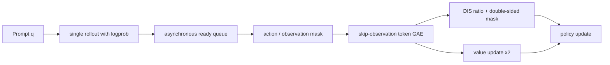

# Single-Rollout Asynchronous Optimization for Agentic Reinforcement Learning：把异步 Agent RL 从“吞吐优化”拉回到“训练有效性”

### 元信息与 TL;DR

- **论文**：[Single-Rollout Asynchronous Optimization for Agentic Reinforcement Learning](https://arxiv.org/abs/2607.07508)
- **作者**：Zhenyu Hou、Yujiang Li、Jie Tang、Yuxiao Dong，Tsinghua University；前两位作者工作期间在 Z.AI 实习。
- **时间证据**：arXiv v1 提交于 **2026-07-08 15:02:19 UTC**，属于本周窗口。
- **主题归类**：大模型后训练；同时落在 agentic RL、工具调用推理、代码 Agent 训练。
- **核心问题**：长时程 Agent 任务的 rollout 长度差异很大，同步 GRPO/PPO 要等一整批轨迹齐全，异步训练能减少等待，但会引入 policy lag、off-policy drift 和优势估计不稳。
- **方法一句话**：SAO 用 **每个 prompt 只采一条 rollout** 替代 GRPO 的组采样，再用 rollout logprob 直接做 token 级重要性比值，并用双侧 clipping/masking、价值模型快更新、冻结 attention 的 critic、skip-observation token GAE 稳住异步训练。
- **关键数字**：在 Qwen3-30B-A3B 体系上，SAO 在 AIME2025 达到 **97.3%**，BeyondAIME **74.8%**，HMMT Nov 2025 **88.3%**，IMOAnswerBench **74.0%**；SWE-Bench Verified 从基础模型 **23.0%**、GRPO+DIS **27.0%** 提升到 **29.8%**。
- **消融结论**：去掉 faster value update 后 BeyondAIME 从 **74.8** 降到 **69.8**；不冻结 attention 时 AIME2025 从 **97.3** 降到 **90.6**；running-mean baseline 只有 **79.8/55.3**，说明单 rollout 不是单靠滑动均值就能做稳。
- **局限**：实验集中在 Qwen3-30B-A3B、大规模 agentic reasoning/coding、模拟在线写作偏好；结论不必然迁移到小模型、短轨迹、密集奖励或普通非 agent RLHF。部署还要求基础设施保留 token 级 rollout logprob，并对在线适应做安全、隐私和监控约束。

### 研究问题：为什么异步 RL 不能只看吞吐？

论文的出发点不是“异步一定更快”，而是指出 Agent 后训练里有一个结构性矛盾：

| 训练形态 | 适合的任务 | 主要好处 | 主要代价 |
|---|---|---|---|
| 同步 PPO/GRPO | 轨迹长度接近、环境反馈容易批处理 | 采样和更新边界清晰，old policy 容易定义 | 长时程 Agent 会被慢轨迹拖住，GPU 等待严重 |
| 异步 actor-learner | 代码修复、工具调用、多轮环境交互 | rollout 到达即可训练，减少 straggler 等待 | 同一批训练样本可能来自多个旧策略，policy lag 难校正 |
| GRPO 组采样 | 同一 prompt 可采多条可比答案 | 组内相对奖励能省掉 critic | 组内最慢样本形成同步屏障，不适合每个 prompt 只有一次环境反馈的在线 Agent |

作者真正要回答的是：

1. **异步生成的 token 来自哪个策略？**  
   长轨迹生成期间，rollout engine 可能已经经历多次权重同步。若仍假设所有 token 来自一个干净的旧策略，重要性采样比值会变成工程幻觉。

2. **单条轨迹怎么估计 advantage？**  
   GRPO 依赖同一 prompt 的多条回答做相对归一化；在线 Agent 任务经常只给一条轨迹和一个环境反馈，组内平均基线不存在。

3. **多轮 Agent 的 observation token 要不要训练？**  
   环境返回的日志、报错、网页文本不是模型生成的 action。把 observation 也放进 token 级 GAE，会让 critic 在外部状态上背锅。

4. **异步稳定性如何被实验而不是系统吞吐证明？**  
   论文没有停在“rollout 更快”，而是要求 SAO 在 reasoning、coding、在线偏好切换和 ablation 中都优于 GRPO 变体。

### 论文主张与论证路线

| Claim | Mechanism | Evidence | Boundary |
|---|---|---|---|
| 异步 RL 的关键瓶颈是 policy lag 下的稳定训练，不只是吞吐 | 直接使用 rollout logprob，构造 Direct Double-Sided Importance Sampling | Vanilla GRPO 约 160 step 崩溃；DIS 版本可稳定训练 | 论文没有给完整系统吞吐曲线，重点是优化有效性 |
| GRPO 组采样不适合 agentic 异步训练 | 每个 prompt 只保留 single rollout，轨迹完成就进入训练 | Figure 2 对比 SAO 即到即训和 GRPO 等组内慢样本 | 单 rollout 方差更高，必须配 critic |
| 单 rollout 需要更强的 value model | critic 比 actor 更频繁更新，K=2；value model 冻结 attention，只训练 MoE 投影 | Table 3/4 显示少一次 critic update 或全参数 value training 都降分 | 依赖价值模型预训练规模，冷启动成本没有被完全量化 |
| Agent 轨迹要跳过 observation 做 token GAE | action-to-action 桥接，避免对外部 observation token 传播噪声 | 附录 Table 5：token-level 优于 step average 和 last-token step value | 对其他环境格式需要重新定义 action/observation 边界 |
| SAO 对动态在线环境更自然 | value critic 提供 state-dependent baseline，而不是组内基线或历史均值 | Figure 5 中风格偏好切换后 SAO 恢复更快 | 只是模拟写作风格偏好，离真实用户在线训练还有安全距离 |

### 方法机制一：DIS 用 rollout logprob 直接定义信任区间

异步训练里，如果一条长轨迹生成过程中 rollout 模型被同步过多次，就很难为整条轨迹指定一个准确的 `pi_old`。SAO 的选择很务实：

```text
给定 token a_t 和状态 s_t：

r_t(theta) = exp(log pi_theta(a_t | s_t) - log pi_rollout(a_t | s_t))

其中：
- pi_theta：当前正在训练的 policy
- pi_rollout：生成该 token 时 rollout engine 记录的行为概率
- r_t：当前策略相对行为策略的 token 级重要性比值
```

这一步的含义是：

- 不再维护一串历史 old-policy checkpoint。
- 不再假设“最新旧策略”能代表 rollout 行为。
- 代价是接受一部分 off-policy bias。
- 收益是每个 token 都有生成时的行为 logprob，工程上可以落地。

接着，SAO 不采用普通 PPO 那种只在优势方向上 clip 的方式，而是把 token 直接按区间过滤：

```text
f(x; eps_l, eps_h) =
  x,  if 1 - eps_l < x < 1 + eps_h
  0,  otherwise

L(theta) = E_t [ f(r_t(theta), eps_l, eps_h) * A_t * log pi_theta(a_t | s_t) ]
```

变量解释：

- `eps_l` 是下侧阈值，论文 reasoning 训练里取 **0.3**，coding agent 里取 **0.8**。
- `eps_h` 是上侧阈值，论文 reasoning 训练里取 **5.0**，coding agent 里取 **3.0**。
- 超出区间的 token 不只是被裁剪，而是从梯度计算中 mask 掉。
- 这比“相信某个 old policy”更激进，也更贴合异步 rollout 的不确定性。

这里最值得注意的是论文的取舍：SAO 没有追求无偏估计，而是把“能否稳定训练 1000 step 并提升任务分数”作为目标。对于 Agent 后训练，这个取舍是合理的，因为真实环境里的 long-horizon trajectory 本来就很难维持干净的 on-policy 假设。

### 方法机制二：single rollout 不是偷懒，而是去掉 GRPO 的同步屏障

GRPO 的组采样通常是：

```text
prompt q -> sample y_1, y_2, ..., y_G
advantage(y_i) = reward(y_i) - group_mean_reward(q)
```

它在同步批训练里很自然，但异步 Agent 场景会出现两个问题：

1. 同一组里有快轨迹和慢轨迹，快轨迹必须等慢轨迹。
2. 在线环境可能只给一个 prompt 一次交互机会，根本没有同 prompt 的 G 条答案。

SAO 直接改成：

```text
prompt q -> one rollout y
rollout 完成 -> 立刻进入训练队列
advantage 由 value critic 估计，而不是由同 prompt 组内均值估计
```

这个设计的真正难点是方差。单 rollout 接近 REINFORCE 风格，如果没有强 value baseline，很容易让 policy 被噪声 reward 拉偏。因此论文围绕 critic 做了三层补强：

| 设计 | 作用 | 论文给出的工程设定 |
|---|---|---|
| Faster value update | 让 critic 更快追上当前 policy 分布 | 每个 policy update 对 value model 做 **K=2** 次更新 |
| Frozen-attention value training | 降低 critic 全参数训练的梯度不稳 | 冻结 attention，优化 MoE projections |
| 扩大 value pretraining | 缓解 value 冷启动 | 论文称冷启动是单 rollout 的主要瓶颈之一 |

因此，SAO 的“single rollout”不是少采样省成本这么简单；它把基线估计责任从“同 prompt 多答案的相对比较”转移给“可快速适配的 value model”。这也是它和只用 running mean baseline 的区别。

### 方法机制三：skip-observation GAE 处理多轮 Agent 轨迹

Agent 轨迹通常不是纯文本续写，而是：

```text
T = [a_0, o_0, a_1, o_1, ...]

a_i：模型生成的 action，例如代码、工具调用、自然语言计划
o_i：环境返回的 observation，例如测试报错、网页内容、工具结果
```

普通 token GAE 会在相邻 token 间传播 value 差分。但 action 末尾到 observation 开头并不是模型自主生成的连续语义；observation 是外部环境插进来的状态。如果直接让 critic 预测 observation token 的价值，可能把外部噪声误当作模型行为。

SAO 的 skip-observation GAE 把桥接关系改成：

```text
A_hat(a_i,N) = delta + gamma * lambda * A_hat(a_{i+1,0})

delta = r_t + gamma * V(a_{i+1,0}) - V(a_i,N)
```

解释：

- `a_i,N` 是第 i 个 action 的最后一个 token。
- `a_{i+1,0}` 是下一个 action 的第一个 token。
- observation token 被跳过，优势从 action 末尾直接接到下一次 action 开始。
- 这样 critic 只为模型生成的 token 负责，减少环境文本造成的噪声传播。

论文附录还测试了 step-level 方案：把一个 conversation turn 当作一个 action，再用 step average 或 last-token value。结果在 400 step 对比中，token-level 是 **89.8/66.8**，step average 是 **85.8/60.5**，last-token 是 **87.3/62.8**。这说明作者不是没考虑“步骤级更平滑”，而是发现复杂推理轨迹需要更细粒度的 token 监督。

### 算法流程：SAO 在训练循环里怎样工作？

```text
Input:
  - prompt stream D
  - rollout engine with behavior logprobs
  - policy pi_theta
  - value model V_phi
  - clipping bounds eps_l, eps_h

State:
  - asynchronous rollout queue
  - token-level logprob records
  - action / observation masks

Loop:
  1. rollout worker 从 D 中取 prompt q。
  2. 当前 rollout policy 生成单条 trajectory y，并记录每个 action token 的 log pi_rollout。
  3. trajectory 一完成就进入 training queue，不等待同 prompt 的其他样本。
  4. trainer 读取 trajectory，按 action/observation 边界构造 skip-observation token GAE。
  5. 对每个 action token 计算 r_t = exp(log pi_theta - log pi_rollout)。
  6. 若 r_t 不在 [1 - eps_l, 1 + eps_h]，mask 掉该 token 的 policy gradient。
  7. 更新 policy 一次。
  8. 更新 value model K 次；论文主设定 K=2，并冻结 attention。
  9. 周期性评估 AIME、BeyondAIME、HMMT、IMOAnswerBench 或 SWE-Bench Verified。

Output:
  - 更稳定的异步 agentic RL policy
  - 可用于动态环境的一条轨迹一更新训练形态

Failure boundary:
  - rollout logprob 未可靠保存时，DIS 无法成立。
  - value model 冷启动较差时，single-rollout advantage 噪声会放大。
  - action/observation 边界定义错误时，skip-observation GAE 会跳错状态。
```



### 实验设置：作者怎样避免“只在小玩具上有效”？

论文的实验覆盖三类任务：

| 任务族 | 设置 | 评价方式 | 重点 |
|---|---|---|---|
| 数学 + Python 工具推理 | Qwen3-30B-A3B-Thinking-2507，先用 GPT-OSS-120B 生成的 TIR 数据做 3 epoch finetune | AIME2025、BeyondAIME、HMMT Nov 2025、IMOAnswerBench，Pass@1 | 验证 agentic reasoning with tool 的稳定性 |
| 代码 Agent | 使用 Qwen3-30B-A3B-Thinking-2507，OpenHands scaffold，最长 300 interaction turns，128k context | SWE-Bench Verified | 验证长时程代码修复 |
| 在线学习模拟 | 写作风格偏好在 cute、chuunibyou、classical 间切换，GLM-4.7 做 judge | held-out style accuracy、training reward | 验证单 rollout 对非平稳环境的适应 |

关键超参数也很有信息量：

- reasoning 训练 batch size **128**，group size **1**，max length **128k**。
- policy learning rate **1e-6**。
- reasoning token clipping：`eps_low = 0.3`，`eps_high = 5.0`。
- coding agent clipping：`eps_low = 0.8`，`eps_high = 3.0`。
- value learning rate **5e-6**，10-step warmup。
- value update frequency：每个 batch 做 **2** 次 value update。
- GRPO 变体为了公平，使用 16 prompts × 8 samples，同样得到 batch size 128。

这些细节说明 SAO 不是单纯换 objective，而是把采样形态、critic 训练、token mask、agent scaffold 和长上下文预算一起调过。

### 主结果：SAO 的提升集中在哪里？

| Model / Training | AIME2025 | BeyondAIME | HMMT Nov 2025 | IMOAnswerBench |
|---|---:|---:|---:|---:|
| SFT w/ python | 80.4 | 53.3 | 75.2 | 53.3 |
| GRPO w/ python | 84.2 | 54.8 | 76.0 | 55.8 |
| GRPO + DIS | 93.5 | 70.8 | 84.0 | 70.0 |
| SAO w/ DIS only | 94.2 | 71.5 | 86.7 | 71.3 |
| **SAO** | **97.3** | **74.8** | **88.3** | **74.0** |

读这张表时要分三层看：

1. **DIS 本身很强**  
   GRPO + DIS 已经远高于普通 GRPO，说明异步训练里的 token 级行为概率校正和双侧 mask 是关键稳定器。

2. **single rollout + critic 继续拉开差距**  
   SAO 相比 GRPO + DIS 又提升，尤其 AIME2025 从 **93.5** 到 **97.3**，BeyondAIME 从 **70.8** 到 **74.8**。

3. **Figure 3 的时间维度更重要**  
   作者报告 vanilla GRPO 约 **160 step** 崩溃，SAO 和 GRPO+DIS 初期接近，但约 **400 step** 后明显分化。这意味着 SAO 的价值不只是最终点数，而是训练后半程不崩、不停滞。

代码 Agent 的 SWE-Bench Verified 结果更保守：

| Model | Accuracy |
|---|---:|
| Qwen3-30B-A3B | 23.0 |
| + GRPO w/ DIS | 27.0 |
| + SAO | **29.8** |

这里的提升幅度不像数学 benchmark 那么夸张，但任务更接近真实长时程 Agent：OpenHands scaffold、最多 300 轮交互、128k context。这个数字支持的结论是“SAO 对代码 Agent 有增益”，但还不能证明它已解决软件工程 RL 的全部难题。

### 消融：哪些设计是真有必要？

| 变体 | AIME2025 | BeyondAIME | 解释 |
|---|---:|---:|---|
| **SAO** | **97.3** | **74.8** | 完整方法 |
| SAO w/o Faster value | 95.0 | 69.8 | critic 只更新一次，跟不上 policy drift |
| SAO w/o Frozen attention | 90.6 | 74.5 | full-parameter value training 梯度更不稳 |
| Vanilla VAPO w/o DIS | 91.3 | 69.0 | 没有 DIS，token clip ratio 近零但训练会崩 |
| Running mean baseline | 79.8 | 55.3 | 滑动均值无法替代 state-dependent critic |

Figure 4 给出了机制解释：

- **Explained Variance**：SAO 在约 400 step 后高于单次 critic update，说明 value 预测更贴近 return。
- **Critic Grad Norm**：全参数 value training 的梯度范数更大，冻结 attention 后更平滑。
- **Clip Ratio**：VAPO 没有 DIS 时几乎不 gate off-policy token，却在约 90 step 崩溃；SAO 的 mask 反而是稳定器。

这组消融特别重要，因为它排除了一个误读：SAO 的提升不是“group size=1 就好”。如果只是单 rollout 加历史均值，它反而很弱；SAO 的可用性来自 critic 训练策略和 token 级 trust region。

### 在线学习模拟：为什么单 rollout 对动态环境更自然？

论文设计了一个写作偏好会切换的模拟环境：

| 阶段 | 候选风格 | 奖励偏好 | 评价方式 |
|---|---|---|---|
| Phase 1 | Academic / Cute / Chuunibyou | 偏好 cute | GLM-4.7 判定质量与风格 |
| Phase 2 | Academic / Cute / Chuunibyou | 偏好 chuunibyou | held-out 风格准确率 |
| Phase 3 | Classical / Cute / Chuunibyou | 偏好 classical | 训练 reward 恢复速度 |

奖励定义可以写成：

```text
r = r_quality * r_style

r_quality, r_style ∈ {0, 1}
```

它的意义是：

- 只符合风格但回答质量差，不给最终奖励。
- 回答质量好但风格不匹配，也不给最终奖励。
- 偏好切换后，模型必须从旧 reward 分布里脱身。

Running Mean baseline 使用最近 128 个 reward 的滑动窗口做 baseline：

```text
A_hat = r - E[r_window]
```

问题在于窗口有惯性：偏好从 cute 切到 chuunibyou 后，窗口里还残留旧偏好的 reward，导致 advantage 估计滞后。SAO 的 value critic 是 state-dependent baseline，能更快跟随新偏好。Figure 5 的作用正是说明 single-rollout 训练不是只能在静态 batch 上工作，它更适合环境反馈不断变化的 Agent。

### Figure / Table 逐项证据解读

| 图表 | 论文中支撑什么 | 不能证明什么 |
|---|---|---|
| Figure 1 | SAO 在五个 reasoning/coding benchmark 上都高于 baseline 和 GRPO | 没有展示训练成本、吞吐、显存和 wall-clock 对比 |
| Figure 2 | SAO 的 trajectory 完成即训练，GRPO 等待组内所有样本 | 只是机制示意，不是性能测量 |
| Table 1 | 数学与工具推理主结果，AIME2025 到 97.3 | 对 benchmark 污染、题目分布迁移仍需外部复核 |
| Table 2 | SWE-Bench Verified 上 SAO 达 29.8 | 代码 Agent 提升较小，仍需要更多软件任务 |
| Figure 3 | SAO 后半程稳定性优于 GRPO+DIS，vanilla GRPO 崩溃 | 曲线没有报告方差区间 |
| Table 3/4 | faster value update、frozen attention、DIS、value critic 都有必要 | 消融只覆盖两个主要数学集，不覆盖全部任务 |
| Figure 5 | 单 rollout + critic 能更快适应偏好切换 | 模拟风格偏好不能等同真实用户在线训练 |
| Table 5 | token-level action 优于 step-level average/last-token | 只在 400 step、两个数学集下比较 |

### 和相关工作的关系：SAO 在哪里补位？

SAO 位于三条线的交点：

1. **PPO/GRPO/RLOO 线**  
   这些方法关注稳定 RLHF 或 reasoning RL，但很多默认同步采样。GRPO 通过组内相对奖励省 critic，在 reasoning 上很实用，却在异步 Agent 中形成等待和组内反馈假设。

2. **异步 actor-learner 系统线**  
   A3C、IMPALA、RLlib、Acme 到 AReaL/ROLL Flash 都说明异步能提高系统利用率。SAO 的补位是：不只讨论系统解耦，还直接改 advantage、clipping 和 value training。

3. **Agentic online RL 线**  
   Mobile GUI、WebGPT/ReAct 式环境反馈、多轮工具调用都让“每个 prompt 多采几条可比答案”变得不自然。SAO 把 single trajectory 变成主设定，而不是特殊退化场景。

这也解释了论文标题里的 “Agentic Reinforcement Learning”：它不是把普通 RLHF objective 换个名字，而是围绕长轨迹、环境 observation、在线反馈、代码 scaffold 做了训练目标的重构。

### 证据边界与可复现性问题

需要谨慎的地方有五点：

1. **缺少完整系统效率账本**  
   论文强调异步训练能减少等待，但正文核心结果主要是 accuracy 和稳定性。若要评估生产训练收益，还需要 wall-clock、GPU utilization、rollout queue 延迟和 logprob 存储成本。

2. **依赖大模型与 MoE 结构**  
   Frozen-attention value training 的解释建立在 MoE 层相对稳定、attention 梯度更不稳的观察上。对 dense 小模型或非 MoE critic，不一定成立。

3. **value pretraining 的数据规模不透明**  
   作者强调冷启动是瓶颈，但没有把 value pretraining corpus 的规模、来源、质量控制全部展开。复现者可能最先卡在 critic 初始化。

4. **online learning 仍是模拟任务**  
   写作风格偏好切换能说明非平稳 reward 下的适应性，但真实用户在线训练还涉及隐私、恶意反馈、奖励攻击、安全策略锁定和回滚。

5. **能力提升有双用风险**  
   更便宜、更稳定的 agentic RL 可以训练更强代码和工具使用 Agent，也可能降低有害目标优化的成本。论文也承认需要数据过滤、访问控制和监控。

### 复现实验应先盯住哪些失败模式？

如果把 SAO 当成一个可复现训练方案，而不是只读成一篇结果论文，最应该先盯住下面这些失败点：

| 失败模式 | 可能现象 | 优先排查信号 | 为什么和 SAO 直接相关 |
|---|---|---|---|
| rollout logprob 丢失或错位 | DIS ratio 异常大，clip/mask 比例突然升高 | token logprob 与生成 token 的对齐检查 | SAO 把 rollout logprob 当作行为概率代理，错位会直接破坏信任区间 |
| critic 冷启动 | reward 有提升但 advantage 方差很大，policy 更新抖动 | explained variance、value loss、return-value scatter | single rollout 没有组内均值，critic 是主要降方差工具 |
| action/observation mask 错误 | 工具输出、报错文本被当成模型动作训练 | trace parser 单元测试、mask 可视化 | skip-observation GAE 的前提是能分清模型 token 和环境 token |
| critic 更新太慢 | 训练前期还能动，约几百 step 后 plateau | critic update frequency ablation | 论文中的 K=2 不是装饰，而是为了追上 policy 分布漂移 |
| attention 全参数更新不稳 | value model gradient norm 尖峰，后续 policy 崩溃 | attention/MoE 分层梯度范数 | frozen-attention 设计来自作者对 critic 梯度来源的经验观察 |
| clipping 阈值照搬失败 | reasoning 可训，coding agent 反而过度 mask 或欠 mask | 不同任务的 clip ratio 分布 | 论文 reasoning 与 coding 使用不同 eps_low/eps_high，说明阈值依赖任务 |

复现者可以按下面顺序缩小问题：

1. **先复现日志管线，而不是先追分数**  
   每条 trajectory 必须能回放出：prompt、action token、observation token、reward、rollout logprob、当前 policy logprob、mask 后的有效 token 数。若这一步不稳，后面的 accuracy 无法解释。

2. **再复现一个小规模稳定性曲线**  
   不必一开始就跑完整 1000 step。先看 100、200、400 step 的 clip ratio、explained variance、critic gradient norm 和 validation reward，确认没有出现 VAPO/GRPO 式早期崩溃。

3. **最后复现实验表格**  
   主结果要和 Table 1/2 对齐；消融至少包括 w/o faster value、w/o frozen attention、running mean baseline。否则很难判断提升来自 single rollout，还是来自数据、基础模型或评测脚手架。

### 对 AI 安全和 Agent 训练的进一步含义

SAO 虽然是后训练算法论文，但它对 AI 安全也有直接含义：

- **更稳定的 Agent RL 会提高能力边界**  
  代码修复、工具调用、长上下文推理一旦能更便宜地持续优化，模型更容易学会复杂任务策略。安全评测不能只看静态模型，还要看训练系统能否快速把环境反馈转化为新能力。

- **在线适应需要硬安全约束**  
  Figure 5 证明模型能跟随 reward 偏好切换；这既是优点也是风险。如果 reward 来自不可信用户、被污染日志或越权目标，快速适应会变成快速偏离。

- **observation 不是中性数据**  
  Agent 的环境反馈可能包含 prompt injection、恶意网页、错误日志里的秘密、测试输出里的路径信息。skip-observation GAE 在训练信号上跳过 observation，但并不等于输入安全；训练管线仍要过滤和标注不可信 observation。

- **value model 变成新的安全面**  
  单 rollout 依赖 critic 判断状态价值。若 value model 被错误奖励、偏置数据或有害目标预训练影响，policy 会把这种价值判断放大。因此，critic 的数据治理和审计不应弱于 policy。

一个更安全的 SAO 部署形态，至少需要四层控制：

| 控制层 | 具体做法 | 对应风险 |
|---|---|---|
| 数据过滤 | 过滤恶意 observation、秘密、越权工具输出 | 防止训练吸收不可信环境内容 |
| 奖励约束 | 把安全规则做成不可被风格/任务 reward 覆盖的硬门 | 防止在线 reward 拉偏安全边界 |
| 训练监控 | 监控 clip ratio、reward jump、异常工具调用模式 | 发现 policy 快速漂移 |
| 回滚机制 | 保存可回退 checkpoint 与触发条件 | 避免一次在线适应污染后续策略 |

落地时还应增加三项审计：

- **轨迹审计**：抽样复查高 reward 轨迹，确认模型没有靠越权工具、泄露信息或投机格式拿分。
- **奖励审计**：比较任务 reward 与安全 reward 的冲突样本，记录哪些样本被硬门拒绝。
- **漂移审计**：按 checkpoint 对比能力、安全、工具使用频率，避免训练只在单一指标上变好。

### 研究者视角：这篇论文改变了什么问题表述？

SAO 最有价值的地方，是把“Agent RL 后训练”的问题从一个系统吞吐问题改写成了一个目标函数与轨迹结构问题：

- 同步训练的低效，不只是慢，而是迫使我们用不适合在线 Agent 的组采样假设。
- 异步训练的危险，不只是 off-policy，而是 token 生成时的行为概率、环境 observation 和当前 policy 之间没有干净边界。
- 单 rollout 的方差，不是不可接受，而是要求 value model 成为核心组件，并配套更频繁更新、参数冻结和更好的预训练。
- 多轮 Agent 的 observation，不应被当成普通模型 token 继续传播 advantage。

对后续研究，最值得追问的是：

1. **能否报告完整效率-效果 Pareto？**  
   SAO 如果同时给出 wall-clock、GPU idle time、queue depth、吞吐和 accuracy 曲线，会更容易判断它相对 AReaL/ROLL Flash 的工程优势。

2. **value model 能否更轻？**  
   当前方案需要单独 critic、频繁更新和预训练。是否可以用低秩 critic、共享 trunk、延迟更新或 verifier signal 减少成本？

3. **observation 边界能否自动识别？**  
   不同 Agent scaffold 的轨迹格式差异很大。OpenHands、browser agent、mobile GUI agent、shell agent 都需要可靠标注 action/observation，否则 skip-observation GAE 会依赖人工协议。

4. **安全 reward 如何防止在线漂移？**  
   如果 SAO 用于真实在线 Agent，偏好切换不再只是 cute/classical，而可能是越权请求、隐私泄露、工具滥用。训练系统需要把安全约束做成不可被短期 reward 覆盖的硬边界。

5. **单 rollout 是否适合多 agent 协作？**  
   多 Agent 环境里，一条轨迹可能混有多个 policy 的 action。SAO 的 token 级 logprob 思路可以扩展，但 advantage 归因会更难。

### 结论

SAO 的贡献可以压缩成一句话：**它让异步 Agent RL 不再只是“rollout 完成就训练”的系统技巧，而是给出了单轨迹、token 级行为概率、critic 快更新和 observation-aware advantage 的完整训练方案。**

这篇论文最适合被放进后训练研究脉络里读：

- 它继承了 PPO/GRPO 的 trust-region 思想。
- 它接受异步系统不可避免的 policy lag。
- 它放弃 GRPO 对组采样的依赖。
- 它把 Agent 轨迹的环境反馈显式纳入 advantage 设计。
- 它用数学、代码和模拟在线偏好三个实验面证明稳定性。

最终判断是：SAO 对“大模型 Agent 如何做持续后训练”给了一个强候选范式，但它仍然要求成熟的异步 rollout 基础设施、可靠的 token logprob 记录、可训练的 value model，以及面向真实在线环境的安全治理。对研究者来说，下一步不应只是复刻分数，而应复刻它的稳定性诊断：什么时候 DIS 在救训练，什么时候 critic 在降方差，什么时候 observation 边界在减少噪声，什么时候这些组件会在新的 Agent 环境里失效。
