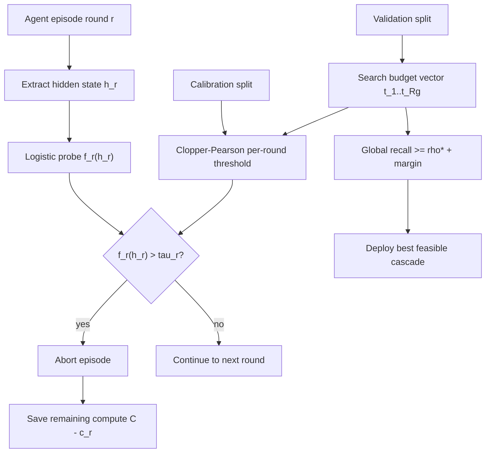

# Doomed from the Start：用召回可控的探针级联提前终止注定失败的 LLM Agent 回合

## 元信息与 TL;DR

- **论文**：Doomed from the Start: Early Abort of LLM Agent Episodes via a Recall-Controlled Probe Cascade
- **作者**：Kai Ruan、Zihe Huang、Ziqi Zhou、Qianshan Wei、Xuan Wang、Hao Sun
- **发布日期**：2026-07-07
- **原文**：[arXiv:2607.06503v1](https://arxiv.org/abs/2607.06503v1)
- **领域**：大模型 Agent / 运行时监控 / test-time compute / 选择性预测 / 内部表征探针
- **代码状态**：arXiv 元数据说明 code will be released soon；本轮未发现可读官方代码仓库。
- **外部参考搜索**：搜索 `"Doomed from the Start" "Recall-Controlled Probe Cascade"`、`"2607.06503" "Doomed from the Start"`、`"Kai Ruan" "LLM Agent Episodes"`；除 arXiv 与镜像/聚合页外，未找到作者补充博客或第三方深度解读。

### TL;DR

- **这篇论文研究什么**：LLM Agent 在多步任务里经常很早就进入不可恢复轨迹，但仍继续生成、调用环境、消耗 token，直到 20 轮超时或最后失败才暴露问题。论文问的是：能不能在不明显牺牲成功任务的前提下，提前终止这些注定失败的 episode。
- **核心方法是什么**：作者在前 6 个交互轮放置 abort gates。每个 gate 用线性 logistic probe 读取当前轮动作最后一个 token 的 residual-stream hidden state，预测 episode 最终失败概率；若分数高于阈值，就终止该 episode，节省剩余计算。
- **关键安全约束是什么**：不能只看每一轮 gate 的召回率，因为一个成功 episode 必须连续通过所有 gate，false abort 风险会累积。作者用 Clopper-Pearson 下置信界校准每轮阈值，再搜索每轮 recall budget `t_r`，使最终的 **global success recall** 达到用户指定目标 `rho*`。
- **实验怎么做**：环境是 TextCraft，两个 agent policy 分别是 Llama-3.2-3B 与 Qwen-2.5-7B。每个模型采集 100 个任务、800 条 episode，每个任务 8 次采样，最多 20 轮，前 6 轮放 gate；20 个随机种子重复 task-level split、probe、calibration、budget search 与 test evaluation。
- **关键数字是什么**：在 90% global recall 目标下，级联策略为 Qwen-2.5-7B 节省 `47.1% ± 10.3%` 生成 token，为 Llama-3.2-3B 节省 `37.2% ± 8.8%`，约为最佳 single-gate 策略的 `1.6-1.7x`。在 95% 目标下仍分别节省 `32.0% ± 12.2%` 与 `19.9% ± 9.2%`。
- **最重要的证据**：probe 在第 1 轮已经能预测最终失败，Qwen 的 AUC 为 0.778，Llama 为 0.667；behavior-only surface scorer 第 1 轮接近随机，Qwen 为 0.559，Llama 为 0.573，到第 3-4 轮才变强，但那时很多 episode 已经结束或消耗了大量可节省计算。
- **最重要的局限**：证据只来自 TextCraft 一个环境、两个模型、每个模型 800 条 episode；隐藏状态是在离线 teacher-forced re-run 中抽取，部署时需要 serving stack 暴露中间激活；校准依赖 exchangeability，任务分布变了就要重新标注小样本校准；当前数据规模无法为 0.98/0.99 这样极高召回目标提供 formal certificate。

## 研究问题：为什么“早点停”不是简单的 early exit？

### Agent 失败的成本结构

- 多步 Agent 任务的失败常常不是最后一刻才发生：
  - 一开始误读目标；
  - 走进无法恢复的状态；
  - 对环境反馈形成错误解释；
  - 进入循环或重复无效动作；
  - 后续每轮都只是把已经失败的轨迹继续跑完。

- 对部署方来说，真正浪费的是：
  - 已经看出不太可能成功的 episode 还继续解码；
  - 同一个任务不能把预算转给 retry 或更多 sample；
  - 监控器如果太保守，等到行为证据明显时，剩余 token 已经不多。

### 论文把问题改写成一个风险受控优化

论文不问“怎样最大化停掉失败 episode 的比例”，而问：

> 在成功 episode 被误杀率可控的前提下，最多能省多少剩余计算？

更形式化地说：

```text
目标：maximize expected saved compute
约束：successful episodes surviving all gates >= rho*
错误：abort an episode that would have succeeded
收益：if abort at round r, save C - c_r
```

这里的 `rho*` 是部署方指定的 global success recall floor。

- 如果 `rho* = 0.90`：
  - 系统允许最多约 10% 原本会成功的 episode 被提前停掉；
  - 换取更大的 token 节省。

- 如果 `rho* = 0.97`：
  - false abort 空间显著缩小；
  - 能省的计算也明显下降。

### 为什么不能逐轮单独校准？

一个成功 episode 要通过所有 gate：

```text
success survives cascade = pass gate 1 AND pass gate 2 AND ... AND pass gate R_g
```

所以逐轮 recall 不是最终 recall。

| 错误理解 | 为什么不够 |
|---|---|
| 每轮 gate 都有 95% recall，所以整体也差不多 95% | 多个 gate 的 false abort 会累积 |
| 把每轮阈值设得一样保守 | 早轮和晚轮面对的剩余计算、alive population 不同 |
| 只选一个最好的 single gate | 失去跨轮分配 recall budget 的自由度 |
| 行为特征成熟后再停 | 成熟时很多计算已经花掉 |

论文的核心贡献就是把这些直觉压成一个可执行的 **recall-controlled probe cascade**。

## 论文主张与论证路线

### Claim → mechanism → evidence → boundary

| 层级 | 论文怎么说服读者 | 具体内容 |
|---|---|---|
| Claim 1 | Agent 失败在行为明显前已经写入内部状态 | 第 1-2 轮 hidden-state probe 的 AUC 明显高于 surface scorer |
| Claim 2 | 早停策略必须控制 episode-level success recall | 成功轨迹需要通过所有 gate，逐轮校准不能直接推出全局保证 |
| Claim 3 | 召回预算应该跨轮分配 | 早轮保护更多剩余计算，晚轮更便宜但收益更少 |
| Claim 4 | 级联比 single gate 更值 | 90% recall 下节省 37.2%/47.1%，是 single gate 的 1.6-1.7x |
| Boundary | 证据不是通用 agent 安全保证 | 只验证 TextCraft、两个开源模型、离线激活抽取和固定校准流程 |

### 这篇文章与常见 test-time scaling 的区别

- 常见 test-time scaling：
  - 多采样；
  - verifier/reranker 选择；
  - tree search；
  - 分配更多 rollouts 给困难样本。

- 本文关心的是相反方向：
  - 哪些 rollout 不值得跑完；
  - 什么时候停止才不伤害成功率；
  - 被省下的 token 能不能再用于 retry 或其他轨迹。

这让它更像 Agent serving 的“运行时保险丝”，而不是一个新的 planner。

## 方法机制：从 hidden state 到 abort cascade

### Episode、成本和 gate

论文设定：

- 一个 episode 是交互序列：

```text
(s_1, a_1, s_2, a_2, ...)
```

- `y in {0,1}` 表示最终任务是否成功。
- `R_full = 20`，episode 最多跑 20 轮。
- `c_r` 是截至第 `r` 轮已经消耗的累计推理成本。
- `C` 是完整 episode 的总成本。
- gate 放在前 `R_g = 6` 轮。

如果第 `r` 轮被 abort：

```text
saved_compute = C - c_r
```

这也是为什么早轮 gate 更重要：同样杀掉一个失败 episode，第 1 轮停下省的是几乎整个 episode，第 6 轮停下省的只是后半段。

### Probe 读取什么？

每个 gate 使用一个 per-round scorer `f_r`。

| 组件 | 论文中的具体选择 |
|---|---|
| 特征来源 | Agent LLM 在第 `r` 轮生成动作的最后一个 token 的 residual-stream hidden state |
| 抽取方式 | teacher-forced forward pass over the trajectory |
| Llama 层 | Llama-3.2-3B 的第 14 层 |
| Qwen 层 | Qwen-2.5-7B 的第 20 层 |
| 模型 | 标准化特征上的 logistic regression |
| 正则 | L2 regularization，`C = 1` |
| 目标 | 预测 eventual failure，即 `1 - y` |

作者还比较了两个替代 scorer：

| Scorer | 可见信息 | 作用 |
|---|---|---|
| Probe | 内部激活 | 检验 hidden state 是否早于行为泄露失败信号 |
| Surface | API 可见行为特征 | 检验不读内部状态时能否做到类似效果 |
| Stacking | Probe + surface | 检验行为特征是否给 hidden state 增量信息 |

Surface 特征包括当前轮平均 action-token logprob、此前轮次平均 logprob、生成 token 数、prefix length、此前环境反馈中 error/invalid/fail 等关键词计数。

### Gate 阈值如何校准？

对每个 round `r`，成功 episode 的 calibration scores 记为：

```text
S_r = { f_r(x_i) : y_i = 1, i alive at r }
```

给定阈值 `tau`：

```text
k(tau) = | { s in S_r : s <= tau } |
```

也就是成功 episode 中有多少会通过 gate。

Clopper-Pearson 下置信界是：

```text
lower_p(tau) = Beta^{-1}(alpha; k(tau), n_r - k(tau) + 1)
```

阈值选择规则：

```text
tau_r = smallest tau such that lower_p(tau) >= t_r
```

解释：

- `t_r` 是第 `r` 轮的 recall budget。
- `alpha = 0.05`，对应 95% 单侧置信水平。
- 如果样本太少，连不 abort 都无法支持 `t_r`，该 gate 直接 abstain。
- `t_r = 1` 等价于禁用该 gate。

### 预算向量怎么搜索？

预算向量：

```text
t = (t_1, t_2, ..., t_Rg)
```

论文用网格：

```text
t_r in {0.85, 0.90, 0.95, 0.98, 0.99, 1.0}
```

因为 `R_g = 6`：

```text
candidate_count = 6^6 = 46,656
```

每个候选预算向量都要：

1. 在 calibration split 上校准每轮 `tau_r`；
2. 在 validation split 上模拟完整 cascade；
3. 记录 validation global recall 和 compute savings；
4. 只保留满足 `rho*` 约束的预算；
5. 在可行预算里选 validation savings 最大的。

### 两种 feasibility rule

| 规则 | 条件 | 优点 | 代价 |
|---|---|---|---|
| Margin | `rho_val(t) >= rho* + delta`，默认 `delta = 0.02` | 简单、实用、节省更多 | 不是形式化 theorem |
| Certificate | 对 global recall 再做 Clopper-Pearson 下界 | distribution-free 证明更强 | 更保守，高 recall 需要更多成功样本 |

作者默认用 margin，并专门实验它是否真的吸收了 validation search optimism。

## 算法流程：把论文方法写成可执行伪代码

### Recall-Controlled Abort Cascade

```text
Input:
  D: labeled episodes
  rho*: target global success recall
  T: grid of per-round recall budgets
  margin rule: delta or certificate alpha_m

State:
  R_g = 6 gates
  f_r: per-round failure probe
  tau_r: calibrated threshold at round r

Procedure:
  1. Train task-grouped cross-fitted probes f_r.
  2. Split tasks into:
       calibration tasks: 20%
       validation tasks: 20%
       held-out test tasks: 60%
  3. For each budget vector t in T:
       for r in 1..R_g:
         compute tau_r with Clopper-Pearson survival lower bound
       simulate cascade on validation split
       record global recall and saved compute
  4. Keep feasible budgets:
       margin: recall_val >= rho* + 0.02
       certificate: CP lower bound on global recall >= rho*
  5. If no feasible budget:
       abstain and abort nothing
     Else:
       deploy budget with max validation savings
  6. Evaluate once on held-out test split.

Output:
  gates {(f_r, tau_r)} and measured recall / saved compute.
```

### 为什么 task-grouped split 很关键？

TextCraft 中同一个 task 会产生 8 条 episode。

- 如果同一 task 的不同 episode 同时进入训练和测试：
  - probe 可能学习到 task-level shortcut；
  - calibration 看起来更稳定；
  - recall guarantee 对新任务会过于乐观。

作者把 task 作为 group 进行 cross-fitting 与 split，避免同一任务泄露到多个阶段。

## 实验设置：TextCraft、两个模型、20 个随机种子

### 数据与模型

| 项目 | 设置 |
|---|---|
| 环境 | TextCraft，来自 AgentGym suite 的文本 crafting 环境 |
| 任务数 | 每个模型 100 个 task |
| Episode 数 | 每个模型 800 条 episode，8 episodes/task |
| 最大轮数 | `R_full = 20` |
| Gate 轮数 | 第 1-6 轮 |
| Llama policy | Llama-3.2-3B，task success rate 63.0% |
| Qwen policy | Qwen-2.5-7B，task success rate 74.8% |
| 采样温度 | temperature 1.0 |
| 重复 | 20 random seeds |

### Alive population 的意义

论文报告：

- Llama 有 35% episode 在前两轮内结束；
- Qwen 有 39% episode 在前两轮内结束；
- 到最后一个 gate 前，Llama/Qwen 已分别有 53%/69% episode 结束。

这说明晚轮 gate 同时有两个性质：

| 性质 | 含义 |
|---|---|
| 更少成功 episode 暴露在风险中 | late gate 的 false abort 成本可能更低 |
| 剩余 compute 更少 | late gate 能省的 token 也更少 |

级联的预算搜索本质上就是在这两个方向之间找平衡。

## 结果一：内部状态比行为更早预测失败

### Per-round AUC

| 模型 | Round 1 probe | Round 1 surface | Probe peak | Surface peak |
|---|---:|---:|---:|---:|
| Llama-3.2-3B | 0.667 | 0.573 | 0.761 at round 2 | 0.674 at round 4 |
| Qwen-2.5-7B | 0.778 | 0.559 | 0.859 at round 2 | 0.756 at round 3 |

作者的关键解释是：

- 行为特征需要时间积累：
  - 重复动作；
  - invalid action；
  - logprob 异常；
  - 没有进展的环境反馈。

- 内部状态更早暴露：
  - 第 1 轮就能区分一部分 doomed trajectories；
  - 第 2 轮达到峰值；
  - 到第 6 轮二者才逐渐接近，但那时大多数 episode 已经结束或消耗了主要 token。

### 这不是“probe 越晚越准”的故事

值得注意的是，probe 的 AUC 在 round 2 后下降。

论文解释不是 hidden state 变弱，而是 alive-set 被过滤：

- 简单成功/失败的 episode 早早结束；
- 剩下的是更困难、更长、更接近边界的 episode；
- 后续 gate 面对的人群本身更难区分。

这正是为什么预算不能平均分配：round 1-2 的辨别力更值钱。

## 结果二：级联在各 recall 目标下都优于 single gate

### 主结果表

| Agent | Target recall | Cascade saved | Single gate saved | Uniform saved |
|---|---:|---:|---:|---:|
| Llama | 0.90 | **37.2 ± 8.8** | 23.6 ± 5.3 | 3.1 ± 2.5 |
| Llama | 0.92 | **31.7 ± 8.1** | 18.9 ± 4.9 | 0.1 ± 0.4 |
| Llama | 0.95 | **19.9 ± 9.2** | 10.4 ± 3.9 | 0.0 ± 0.0 |
| Llama | 0.97 | **9.3 ± 7.7** | 4.1 ± 3.6 | 0.0 ± 0.0 |
| Qwen | 0.90 | **47.1 ± 10.3** | 27.6 ± 5.6 | 6.9 ± 5.7 |
| Qwen | 0.92 | **44.0 ± 8.9** | 24.2 ± 5.5 | 6.6 ± 5.9 |
| Qwen | 0.95 | **32.0 ± 12.2** | 17.4 ± 5.5 | 0.0 ± 0.0 |
| Qwen | 0.97 | **18.2 ± 12.5** | 10.8 ± 4.3 | 0.0 ± 0.0 |

### 三个读法

- **第一，recall 没有被事后牺牲**：
  - 八个 agent-target 组合中，mean test recall 与目标最多差 0.027；
  - 七个组合在均值上高于目标；
  - 所有配置都在一个标准差内贴近目标。

- **第二，跨轮预算分配是收益来源**：
  - Llama 在 0.90 目标下，modal budget 是 `(0.95, 0.85, 0.85, 1.0, 1.0, 1.0)`；
  - 也就是前 3 轮积极 abort，后 3 轮禁用；
  - 这说明算法学到“早轮虽然 recall 风险更大，但剩余计算更值钱”。

- **第三，uniform 几乎失败**：
  - 严格目标下 uniform 保存 0；
  - 因为它同时约束早轮和晚轮，既不能大胆用早轮信号，也不能充分利用 late gate 的低暴露成本。

## 结果三：内部激活不是装饰，而是主要信号

### 0.95 target 下的 scorer ablation

| 模型 | Scorer | Cascade saved | Single gate saved |
|---|---|---:|---:|
| Llama | Probe | 19.9 ± 9.2 | 10.4 ± 3.9 |
| Llama | Surface | 16.1 ± 8.0 | 4.5 ± 1.6 |
| Llama | Stacking | 20.8 ± 8.9 | 9.3 ± 2.8 |
| Qwen | Probe | 32.0 ± 12.2 | 17.4 ± 5.5 |
| Qwen | Surface | 17.0 ± 12.3 | 4.6 ± 2.6 |
| Qwen | Stacking | 30.0 ± 11.3 | 12.9 ± 5.0 |

### 这张表的意义

- 对 Qwen 来说：
  - probe cascade 为 32.0%；
  - surface cascade 为 17.0%；
  - hidden-state access 大约让最佳配置节省翻倍。

- Stacking 没有稳定超过 probe：
  - Llama 的 stacking 20.8% 与 probe 19.9% 在噪声内；
  - Qwen 的 stacking 30.0% 反而低于 probe 32.0%；
  - 作者据此认为行为特征的信息已经被 hidden state 捕获。

- Cascade 对弱 signal 也有帮助：
  - surface single gate 很弱；
  - surface cascade 明显更好；
  - 因为 behavior signal 到 round 3-4 才成熟，级联可以晚一点花 recall budget。

## 结果四：高召回 certificate 的数据成本

### Rule of three

certificate 版本要求 validation 上的 global recall Clopper-Pearson 下界超过 `rho*`。

即使一个策略什么都不 abort，它的下界也受到成功样本数限制：

```text
max_certifiable_recall = alpha_m^(1 / n_pos)
```

换成所需样本数：

```text
n_pos >= ln(alpha_m) / ln(rho*)
```

论文设置：

```text
alpha_m = 0.05
n_pos ~= 113 / 115
```

于是：

| Target recall | 所需成功 validation episodes | 本文数据是否足够 |
|---:|---:|---|
| 0.95 | 约 59 | 足够 |
| 0.97 | 约 98 | 大致足够 |
| 0.98 | 149 | 不足 |
| 0.99 | 299 | 明显不足 |

### 为什么这是优点而不是缺点？

论文没有把这一点包装成“方法不够强”，而是把它当作部署前的诚实告警：

- 如果你想承诺 95%-97% 成功 recall，800 条 episode 的规模可能够用；
- 如果你想承诺 98%-99%，当前数据规模连 no-op 策略都无法形式化证明；
- 这与 scorer 无关，是统计证书本身的样本复杂度。

## Margin 是否真的保护目标？

默认 margin rule 是：

```text
validation_recall >= target_recall + 0.02
```

作者验证：

- 八个主配置中，validation recall 相对 test recall 的乐观偏差为 0.008-0.030；
- `delta = 0.02` 正好覆盖大部分 selection optimism；
- 最差是 Llama at 0.92，mean test recall 低于目标 0.001，但仍在 seed noise 内；
- 去掉 margin 后，在 0.95 target：
  - Qwen test recall 变成 `0.943 ± 0.032`；
  - Llama test recall 变成 `0.942 ± 0.024`；
  - 两者都低于目标，但节省更多 token。

这说明 margin 不是装饰项，而是用一部分 savings 换 recall 可靠性的关键保险。

## Figure/Table 证据逐项解读

### Figure 1：整体机制图

Figure 1 把 episode timeline、hidden-state probe、abort strip 和两层 calibration 放在一起。

- 它支持的 claim：
  - early abort 是逐轮 gate；
  - gate 读取 `h_r`，不是只看外部行为；
  - 单轮阈值 `tau_r` 与全局预算向量 `t` 是分开的。

- 它不能证明的事情：
  - probe 一定在其他环境有效；
  - hidden state 在生产 serving stack 中容易拿到；
  - saved compute 会自动转化成 wall-clock 省钱。

### Figure 2：alive fraction

这张图说明 episode 在前几轮快速减少。

| 观察 | 解释 |
|---|---|
| 前两轮内已有 35%/39% episode 结束 | 早轮决策影响最大 |
| 最后一个 gate 前已有 53%/69% episode 结束 | 晚轮 gate 面对的样本和收益都变小 |
| Qwen 更早结束 | Qwen 的级联节省反而更高，说明 failure signal 更强 |

### Figure 3：per-round AUC

这张图是全文最关键的机制证据。

- Probe：
  - Llama round 2 AUC 0.761；
  - Qwen round 2 AUC 0.859。

- Surface：
  - 第 1 轮接近随机；
  - 到第 3-4 轮才较强；
  - 但此时很多 compute 已经花掉。

它支持的不是“probe 总是比行为强”，而是更具体的命题：**probe 强得更早**。

### Table 1：cascade vs baseline

Table 1 把节省计算和 recall target 放在一起。

- 0.90 target 下：
  - Llama：cascade 37.2%，single 23.6%；
  - Qwen：cascade 47.1%，single 27.6%。

- 0.97 target 下：
  - Llama：cascade 9.3%，single 4.1%；
  - Qwen：cascade 18.2%，single 10.8%。

这个结果说明：

- recall 越严格，saved compute 越少；
- 但 cascade 的相对优势仍在；
- single gate 不是足够好的近似。

### Figure 4 / Figure 5：recall 与 savings frontier

Figure 4 检查 achieved recall 是否贴近 target。

- 所有配置都在 diagonal 附近；
- 七个组合在均值上高于目标；
- 因此 savings 不是用偷降 recall 换来的。

Figure 5 展示 target recall 越高，compute saving 越低。

- Cascade 始终在 single-gate 之上；
- Uniform 在严格目标下几乎归零；
- 这支持“预算分配”而不是“阈值本身”是主要工程价值。

### Figure 6：scorer ablation

Figure 6 说明：

- hidden-state probe 是最强信号；
- behavior-only cascade 仍有用，但上限较低；
- stacking 没有明显增益。

这对部署的含义很直接：

| 部署条件 | 可期待的策略 |
|---|---|
| 可以读取中间激活 | 用 probe cascade，节省更高 |
| 只能看 API 行为 | 仍可做 cascade，但要接受更低 savings |
| 想简单拼接所有特征 | 不一定优于纯 probe，需要重新验证 |

### Figure 7 / Figure 8：certificate 与 margin

Figure 7 给出 formal certificate 的样本复杂度。

- 0.98 target 要 149 个 successful validation episodes；
- 0.99 target 要 299 个；
- 本文只有约 113/115。

Figure 8 检查 margin 是否覆盖 validation optimism。

- `delta = 0.02` 基本吻合 observed gap；
- 去掉 margin 后 recall 明显掉到 0.95 目标以下；
- 因而 margin 是实证上必要的。

### Appendix Table 2：quantile gate vs Clopper-Pearson

| Model | Calibration | Recall | Saved |
|---|---|---:|---:|
| Llama | Clopper-Pearson | 0.972 ± 0.013 | 10.4 ± 3.9 |
| Llama | Quantile | 0.933 ± 0.029 | 20.7 ± 5.6 |
| Qwen | Clopper-Pearson | 0.977 ± 0.011 | 17.4 ± 5.5 |
| Qwen | Quantile | 0.954 ± 0.020 | 24.7 ± 4.8 |

这张表非常重要，因为它展示了论文的价值取向：

- quantile gate 更省 compute；
- 但 Llama 上违反 0.95 recall target；
- Clopper-Pearson 更保守；
- cascade 再通过预算搜索把保守性尽量赚回来。

## Mermaid：数据流与风险控制路径



## 相关工作位置：这篇论文卡在哪个空白？

### 和 probe / internal representation 工作的关系

论文借用了 probing 的基本范式：冻结模型、读 hidden activation、训练轻量分类器。

不同点是：

- 它不是预测模型是否“知道答案”；
- 不是分析幻觉或拒答内部状态；
- 而是预测 agent trajectory 最终是否会成功。

更关键的是，它把 probe 放进了一个 deployment-oriented decision system：

```text
probe score -> calibrated threshold -> global recall constraint -> compute allocation
```

如果只有 AUC 曲线，这只是 interpretability 观察；有了 recall-controlled cascade，它才变成可部署的运行时策略。

### 和 budget-aware / early stopping 的关系

早停、early exit、budget-aware reasoning 都在问“何时停止”。

本文特殊之处在于：

- 停止对象是一个正在执行的 Agent episode；
- 错误成本是误杀本来会成功的长程轨迹；
- 约束是 episode-level recall；
- 收益是剩余 generated tokens。

这比普通分类器 selective prediction 更复杂，因为 gate 是顺序的。

### 和 verifier / test-time compute 的关系

Verifier 通常在候选轨迹完成后评分。

本文更早介入：

- verifier/reranker：等结果出来，再选；
- abort cascade：轨迹还没跑完，就决定不继续投入。

两者并不冲突。更自然的组合是：

1. cascade 先砍掉 doomed rollouts；
2. 把省下的 token 用于更多 retries；
3. verifier 再从完成轨迹中选择。

论文结尾也把“把 aborted compute 重新分配给 retries”作为下一步。

## 证据边界与可复现性

### 当前证据能证明什么？

- 在 TextCraft 这个环境中；
- 对 Llama-3.2-3B 与 Qwen-2.5-7B 两个 agent policy；
- 对每个模型 800 条 episode；
- 在 task-grouped split、20 seeds、前 6 轮 gate、hidden-state logistic probe 设置下；
- recall-controlled cascade 可以在 0.90-0.97 recall target 内稳定省 token；
- hidden-state signal 比 behavior-only signal 更早出现。

### 当前证据不能证明什么？

| 不能证明 | 原因 |
|---|---|
| 所有 Agent 环境都有同样强的 early hidden signal | 只测了 TextCraft |
| Web agent / coding agent / embodied agent 都能直接套用 | 状态空间、错误模式、action semantics 不同 |
| API-only closed model 也能达到同等 savings | 核心 probe 要读内部激活 |
| 生成 token saved 等于真实美元/延迟 saved | batching、prefill/decode、KV cache、队列调度都会影响 |
| 高 recall certificate 可随便承诺 | 0.98/0.99 目标需要更多 successful validation episodes |

### Detail inventory：这篇论文真正给出的可复现细节

| 维度 | 具体信息 | 复现时要盯住什么 |
|---|---|---|
| 环境 | TextCraft，二元 task success | 其他环境需要重新定义 success label |
| Episode 上限 | 20 轮 | abort 后 saved compute 依赖原始 episode 长度分布 |
| Gate 位置 | 前 6 轮 | 如果任务更长，不等于应该直接加更多 gate |
| Probe 层 | Llama 第 14 层，Qwen 第 20 层 | 层号来自 pilot / post-generation sweep，不是通用常数 |
| Probe 模型 | 标准化 hidden state 上的 logistic regression | 轻量模型有利于校准，但表达能力有限 |
| Calibration | 每轮成功 episode 的 Clopper-Pearson 下界 | 小样本会让 gate abstain 或过度保守 |
| Budget grid | 6 个可选 recall budget，6 轮共 46,656 个组合 | 网格越细，validation selection bias 越要重新处理 |
| Split | task-grouped cross-fitting + calibration/validation/test | episode-level 随机切分会高估泛化 |
| Metric | saved generated tokens | 不等于真实 latency，需要系统层测量 |

### 失败案例不是个别错例，而是三类结构性失败

论文没有把失败案例包装成几个故事，而是从机制上指出三类边界。

- **校准数据不够**：
  - 当成功 validation episodes 太少时，高 recall certificate 根本无法成立；
  - 这不是 probe 不够好，而是统计下界不允许系统做承诺；
  - 因此部署前必须先问“我有多少带成功标签的同分布 episode”。

- **分布迁移**：
  - Clopper-Pearson gate 的 exchangeability 前提要求 calibration 与部署任务可交换；
  - 新任务族、不同工具、不同 prompt、不同 planner 都可能让早期 hidden signal 漂移；
  - 最小补救是按新任务族重新采样少量 labeled episodes，再更新阈值和 budget。

- **工程可见性不足**：
  - 如果 serving API 不给 hidden states，只能退回 surface scorer；
  - surface cascade 仍能省一些 compute，但 Qwen 上 0.95 target 的 savings 从 32.0% 降到 17.0%；
  - 因而这篇论文同时提出了一个系统需求：Agent serving 不应只暴露 text I/O，还应暴露可审计的中间状态钩子。

### 消融的反直觉处：更激进不等于更好

Appendix 的 quantile gate 看似更诱人，因为它节省更多 compute。

但是：

- Llama 上 quantile gate 的 recall 是 `0.933 ± 0.029`，低于 0.95 target；
- Clopper-Pearson gate 的 recall 是 `0.972 ± 0.013`，明显更保守；
- 如果只看 saved compute，quantile gate 会赢；
- 如果把 false abort 当作真实任务损失，quantile gate 就是在把失败风险藏进均值里。

这也是全文方法论的核心态度：

```text
先把可接受的成功召回承诺写清楚，
再在这个承诺内部最大化省下的计算。
```

换句话说，它不是“用统计术语包装一个 aggressive early stop”，而是把 aggressive 的部分限制在可验证边界内。

### 如何避免误读这组结果？

这篇论文很容易被误读成“失败一开始就注定，所以 Agent 不值得继续尝试”。更准确的读法是：

- **它不否认恢复能力**：有些 episode 早期看起来混乱，后面仍可能成功；所以作者才把 success recall 放在硬约束里，而不是简单杀掉高分失败预测。
- **它不承诺语义上的失败证明**：probe 只是统计预测器，不是形式化验证器；它不能证明任务不可完成，只能在校准数据支持的范围内控制误杀率。
- **它不替代 planner 改进**：如果一个新 planner 本身减少 early doomed trajectories，cascade 的可省空间可能下降；这不是方法失败，而是系统本身更少浪费。
- **它要求成本模型诚实**：论文用 generated tokens 计 savings；生产中还要看队列、批处理、缓存和是否真的把空出的预算用于更有价值的样本。

### 部署时最麻烦的工程点

论文中 hidden states 是离线 teacher-forced re-run 抽取。

生产中更合理的方式是：

- 在生成动作时直接读取最后 token 的 activation；
- 不额外做 forward pass；
- 把 probe 放进 serving pipeline；
- 在 gate 触发时中断该 episode 的后续 decode。

但这要求 serving stack 暴露中间层：

- fused attention kernels；
- paged KV cache；
- continuous batching；
- 多租户请求隔离；
- 模型并行与 pipeline parallel。

这些都不是论文实验本身解决的问题。

## 研究者视角：这篇论文最值得继续追问什么？

### 1. Hidden-state early failure 是否是跨环境现象？

TextCraft 是清晰、短程、二元成功的环境。

更难的问题包括：

- Web navigation 中“失败”常常是 partial success；
- coding agent 的失败可能要到测试或 reviewer 才暴露；
- multi-agent 协作中单条轨迹失败不一定等于任务失败；
- safety task 里“成功”本身可能依赖策略审计。

因此下一步不是直接搬数字，而是复现实验结构：

```text
collect episodes -> label eventual success -> extract early activations
-> per-round AUC -> recall-controlled cascade -> savings / recall frontier
```

### 2. Abort 后的 compute 应该怎么再分配？

本文只报告 saved compute，不报告 end-to-end reward improvement。

实际系统会问：

- 省下的 token 用于同一 task retry 是否更好？
- 用于多样化 prompt / planner 是否更好？
- 用于 verifier 检查剩余候选是否更好？
- 如果 retry 也会被 abort，是否形成稳定 test-time scaling loop？

一个自然扩展是：

```text
while budget remains:
  run an episode with abort cascade
  if episode succeeds:
    keep candidate
  if episode aborted:
    recycle remaining budget into a fresh sample
select final answer with verifier
```

这会把“省钱”转化成“同预算更高成功率”。

### 3. Safety 角度：谁有权 abort？

早停策略也可能产生安全问题。

- 如果攻击者能操纵 probe：
  - 可能让危险 episode 避开 abort；
  - 或让正常 episode 被大量误杀，形成 denial-of-service。

- 如果系统把 abort 当成无副作用动作：
  - 可能忽略它对任务成功率和用户权益的影响；
  - 在高风险任务里，错误 abort 本身可能是安全事故。

因此这类 cascade 需要和权限、审计、回放记录绑定：

| 需要记录 | 原因 |
|---|---|
| gate round | 判断 abort 发生阶段 |
| probe score | 支持事后校准与 drift 检查 |
| threshold / budget vector | 复现实验策略 |
| calibration version | 绑定数据分布 |
| task family | 检查 exchangeability 是否被破坏 |

### 4. 后训练角度：能否训练出更易监控的 Agent？

本文把 probe 当作后置监控器。

但也可以反向问：

- 能否在后训练中鼓励失败状态更早可分；
- 能否让模型显式暴露 uncertainty / unrecoverable state；
- 能否把 abort feedback 纳入 RL；
- 能否训练 planner 在发现 doomed trajectory 时主动请求 restart。

这会把 paper 从 runtime monitoring 推向 post-training objective design。

## 结论

- **核心判断**：这篇论文的价值不只是“用 probe 预测失败”，而是把 early failure signal 放进了一个 recall-controlled、episode-level、可校准的资源分配框架。
- **最强证据**：在 TextCraft 上，hidden-state probe 在 round 1-2 就显著优于 behavior-only scorer；级联在 90%-97% recall targets 下都优于 single gate，并在 90% target 节省 37.2%/47.1% compute。
- **最重要边界**：方法依赖可访问内部激活、固定任务分布和足够 labeled successful episodes；0.98/0.99 这类高召回承诺不是靠调阈值就能得到，而需要更多 validation 成功样本。
- **对 Agent 研究的启发**：长程 Agent 不只需要更强 planner 和更好 verifier，也需要能在运行时诚实判断“这条轨迹已经不值得继续”的机制；但这个机制必须把成功轨迹的误杀率作为一等约束，而不是把省 token 当成唯一目标。
