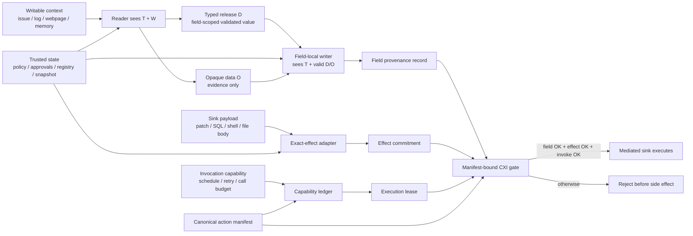

# Context-to-Execution Integrity for LLM Agents：把 Agent 安全边界从“读到什么”移到“能执行什么”

## 元信息与 TL;DR

- **论文**：Context-to-Execution Integrity for LLM Agents
- **作者**：Igor Santos-Grueiro
- **发布日期**：2026-07-07
- **原文**：[arXiv:2607.06000](https://arxiv.org/abs/2607.06000)
- **领域**：AI 安全 / LLM Agent 安全 / 工具调用权限 / 信息流完整性

### TL;DR

- **这篇文章研究什么**：它把 LLM Agent 的安全问题重新定义为“上下文到执行”的完整性问题。Agent 可以读 issue、邮件、CI log、网页、README、工具输出和记忆，但这些可写上下文不应该自动获得选择工具、批准操作、触发重试、写文件或执行命令的权限。
- **核心方法是什么**：作者提出 CXI，把每次副作用执行拆成三类必须同时成立的授权：受保护字段的字段权限、sink 解释后 payload 的 exact-effect 授权、以及 invocation event 的可消费 capability。三者必须绑定到同一个 canonical action manifest。
- **它如何工作**：模型只负责提出结构化 action；host gate 负责 canonicalize、检查 field provenance、检查 exact-effect commitment、校验并消费 invocation capability，最后只把 lease 交给 mediated sink 执行。
- **关键证据**：论文报告 AgentDojo 720 个 live episodes、1,739 次 LLM calls；code-agent exact-effect benchmark 有 400 个 repo episodes，其中 231 个 safe task completions。被 gate 保护的 admission 路径中，作者报告 field/effect/invocation escapes 均为 0。
- **最重要的边界**：0 escape 不是“Agent 永远安全”。它只说明在固定 policy、snapshot、adapter、mediated sink 和记录到的证据路径下，没有观察到未授权字段、效果或调用事件穿过 gate。validator 完整性、任务质量、未接入 gate 的旁路、host 被攻破和 hosted API 内部 KV/attention 证据都不在主张内。
- **为什么值得读**：它比“提示注入过滤”“JSON schema”“系统提示优先级”更贴近真实 Agent 风险：真正危险的不是模型说了什么，而是某段可写文本是否被洗成了执行权限。

## 研究问题：为什么 schema 合法仍然危险？

### 论文反对的默认假设

- 很多 Agent 框架默认把安全问题压缩成：
  - 工具调用 JSON 是否符合 schema；
  - 模型是否遵守系统提示；
  - 输入文本是否包含显式攻击语句；
  - sandbox 是否限制了最终环境。

- CXI 指出的缺口是：
  - schema 只检查形状，不检查权限来源；
  - sandbox 限制环境，不判断本次调用是否该发生；
  - prompt 防御降低攻击成功率，但不能证明执行边界没有被污染；
  - 一段可写上下文可以不含明显攻击词，却仍然选择了受保护字段。

### 作者称之为 authority laundering

| 可写上下文 | 可以做什么 | 不应该自动做什么 |
|---|---|---|
| CI log | 说明哪个测试失败、引用堆栈、提供诊断证据 | 选择 `prod_admin.run_sql`、扩大 retry budget、批准生产写入 |
| Issue body | 描述 bug、给出复现路径、提出期望行为 | 修改 CI policy、选择更高权限工具、决定是否跳过审批 |
| README 或网页 | 提供项目背景和安装步骤 | 把 shell 命令直接变成已授权执行 |
| 工具输出 | 作为下一步判断的证据 | 在没有新授权时触发第二个副作用 |
| 记忆摘要 | 帮助保留任务上下文 | 继承成未来 action 的权限来源 |

### 问题的精确定义

- 论文关注的不是“模型是否被诱导”这个心理学式问题。
- 它关注的是一个系统边界问题：
  - 一个 side-effecting sink 即将执行；
  - 结构化 action 里有 tool、operation、path、approval、retry、payload；
  - 哪些字段来自可信权限，哪些字段只是可写证据；
  - 哪些 payload 被 sink 解释后会产生真实效果；
  - 这次调用事件本身是否被授权发生。

## 论文主张与论证路线

### Claim → mechanism → evidence → boundary

| 层级 | 论文怎么说服读者 | 具体内容 |
|---|---|---|
| Claim | Agent 安全应在执行边界判断 | 不让可写上下文直接影响受保护字段、effect 或 invocation |
| Mechanism | CXI gate 绑定三类权限 | field authority、effect authority、invocation authority 绑定到同一个 manifest |
| Evidence | 多类实验面分别计数 | AgentDojo、code-agent、ledger faults、proposal pressure、hosted/API compatibility |
| Boundary | 不把所有风险合并成一个分数 | task quality、validator completeness、provider internals、unmediated sink 另算 |

### 为什么它不是“另一个 prompt injection detector”

- Detector 的目标通常是：
  - 判断输入是否像攻击；
  - 阻止模型服从恶意文本；
  - 降低 unsafe proposal 出现概率。

- CXI 的目标不同：
  - 承认 unsafe proposal 仍会出现；
  - 在执行前检查它是否有权限；
  - 即使模型提出了危险 action，也不能让它越过 mediated sink。

### 一个更贴切的系统类比

- 传统 prompt 防御像是在编译前清洗源代码。
- CXI 更像是：
  - type system 检查字段权限；
  - IFC 跟踪影响来源；
  - capability system 控制 invocation；
  - adapter 验证 sink 真正解释出来的效果；
  - manifest 把这些证据绑定成一次不可替换的执行承诺。

## 方法机制：CXI gate 到底检查什么？

### 五类边界对象

| 符号 | 名称 | 含义 | 在 CXI 中的权限 |
|---|---|---|---|
| `T` | Trusted state | 用户目标、policy、registry、approval、可信 snapshot | 可以作为字段或调用权限来源 |
| `W` | Writable context | 攻击者可写或可影响的 issue、log、网页、memory、tool output | 默认只能作为证据，不能授权受保护字段 |
| `D` | Typed release | 可信 declassifier 从 W 中验证出的窄值 | 只授权指定 destination field |
| `O` | Opaque data | 保留 provenance 的可写文本句柄 | 只能进入 data slot，不能变成权限 |
| `X` | Protected sink fields | 选择、授权或参数化外部效果的字段 | 必须通过 T 或匹配的 D 授权 |

### 六步 admission pipeline

1. **Canonicalize**：把候选 action 规整成 action manifest。
2. **Check fields**：按字段检查 provenance 和 field-local authority。
3. **Check effects**：对 sink-interpreted payload 做 exact-effect commitment。
4. **Authorize invocation**：确认这次调用、重试、批处理或调度事件有 manifest-bound capability。
5. **Consume capability**：在线性化 ledger 中消费 capability，拿到 execution lease。
6. **Execute through mediated sink**：只有 lease 能到达真正执行点。

### Mermaid 重画：Figure 2 的执行边界



## 字段权限：为什么同一个值只能授权一个地方？

### Table 1 的核心规则

| 对象 | 权限问题 | 可接受来源 | 被拒绝的洗权 |
|---|---|---|---|
| Tool / operation | 选择哪个 sink action | trusted registry 与 task policy | issue 或 log 选择工具 |
| Target path | 目标值是什么 | 只对该字段有效的 `FilePath` release | 同一路径再去选择 CI target 或 command |
| Patch / file body | sink 解释后的效果是什么 | 对 state delta 的 exact-effect authorization | 原始 W patch bytes 直接执行 |
| Approval | 审批是否满足 | trusted approval state 或 `ApprovalRef` | 从 W 复制来的 “approved” 字符串 |
| Invocation event | action 是否该发生或重试 | manifest-bound invocation capability | W 控制 schedule、batch、retry |
| Comment / evidence | W 是否可被复制为数据 | opaque slot 并保留 provenance | 引用文本未来被复用为权限 |

### 关键细节：跟踪 influence，不只是 byte origin

- 论文强调 provenance 不是“这个字符串的字节来自哪里”这么简单。
- 例子：
  - 字段值 `repo.write_file` 的字节可能来自 trusted registry；
  - 但选择它的原因可能是 issue body 里的指令；
  - 因此该字段在 CXI 中仍然带有 W influence。

- 这会改变很多 Agent 设计：
  - schema repair 不能在受保护字段上静默改值；
  - summary 和 memory 会继承输入影响；
  - tool output 默认不是可信权限；
  - opaque data 再进入另一个会产生副作用的组件时，重新按 W 处理。

## Exact-effect：为什么 patch 字符串不等于 patch 效果？

### 问题

- 对简单字段，`ExactValue(hash)` 可能足够。
- 对 effect-bearing payload，不够。
- 因为 sink 真正消费的不是原始字符串，而是解释后的效果。

### 论文列出的 effect-bearing payload

| Payload 类型 | CXI 需要绑定的授权承诺 |
|---|---|
| Repository patch | base commit、canonical paths、old/new blobs、mode、symlink、rename、allowed path set |
| File body | canonical path、bytes、mode、target snapshot、adapter revision |
| SQL | parsed statement / AST、parameters、schema snapshot、role、allowed write set |
| Shell command | trusted-rendered argv/env/cwd、sandbox、network、filesystem、process policy |
| CI / package manifest | canonical state delta、workflow、dependency、install hook、policy-file predicates |

### 公式化理解

```text
Action manifest:
m = (sink, op, rho, nu, sigma, eta, fields, payloads)

其中：
- rho：task/run context
- nu：policy epoch
- sigma：trusted sink snapshot
- eta：action nonce
- fields：受保护字段赋值
- payloads：sink-interpreted payload

CXI 的核心断言：
Admit(m) => Fields(m) ∧ Effects(m) ∧ Invoke(m)
```

- `Fields(m)`：每个 protected field 都有合法字段权限。
- `Effects(m)`：每个 sink-interpreted payload 的实际效果等于 adapter 授权的 exact effect。
- `Invoke(m)`：调用事件消费了同一个 manifest 绑定的 capability。

### 为什么 manifest 是最后绑定对象

- action manifest 记录：
  - action nonce；
  - canonical action digest；
  - adapter ID / revision；
  - effective principal；
  - trusted snapshot；
  - policy epoch；
  - protected-field evidence digest；
  - effect-authorization digest；
  - call-authority digest。

- 任何 post-validation mutation 都会改变 digest。
- 同一段 patch bytes 换到另一个 repo、base commit、policy epoch、principal 或 adapter revision，也会失效。

## 实现路径：open-weight 和 hosted/API 为什么证据不同？

### 两条 provenance 路径

| 路径 | 能产生的证据 | 检查边界 |
|---|---|---|
| Open-weight | backend evidence record：mask state、blocked ranges、action digest、field path、record serialization mode | serving stack + final sink gate |
| Hosted/API | extractor record、field-local writer visibility、typed releases、opaque handles、final action provenance | host + final sink gate |

### 作者没有把 hosted API 说过头

- Hosted API 看不到：
  - attention mask；
  - KV-cache lineage；
  - provider 内部 decoding path；
  - provider 内部是否真的执行了 field-closed decoding。

- 因此 hosted/API 只支持 compatibility claim：
  - host 侧能把 reader 和 field writer 分开；
  - protected-field writer 只看到 T 和合法 D/O；
  - final gate 仍然按同一套 manifest-bound 规则检查。

### 这点是论文可信度的一部分

- 作者没有把“host 侧记录可见”写成“provider 内部已证明非干扰”。
- 这让主张变窄，但也更可审计：
  - open-weight 可以要求 backend evidence；
  - hosted/API 可以做 field-local construction evidence；
  - 两者都喂给同一个 gate；
  - 不同证据 regime 不被混成一个安全结论。

## 实验设置与主结果

### 论文评估的六类 surface

| Surface | 它测什么 | 不能测什么 |
|---|---|---|
| Open-weight field projection | 受保护字段生成是否排除 W 影响 | 所有 serving stack 的完整非干扰 |
| AgentDojo live episodes | live task surface 下 admission 是否逃逸 | validator 对所有任务的完整覆盖 |
| Code-agent exact-effect tasks | repo side effect、manifest、lease、task oracle | 一般 code agent 端到端能力 |
| Manifest-bound ledger faults | capability consume / duplicate suppression | 外部系统 exactly-once delivery |
| Proposal pressure | gate 前模型仍会提出多少未授权 action | 执行后安全性本身 |
| Hosted/API compatibility | host-visible field-local 构造是否可接 gate | provider 内部 mask / KV / attention 证据 |

### 主结果表的关键数字

| 评估面 | N / 单位 | Utility 或 STC | Admission evidence | Boundary outcome |
|---|---:|---:|---|---|
| AgentDojo live task bank | 720 episodes | 199 STC | 1,739 LLM calls；exact-effect subset 有 306 field records、204 leases/effects | protected admissions 中未观察到 field/effect/invocation escapes |
| AgentDojo exact-effect admissions | 204 leases | 不单独计 STC | 306 field records；204 exact-effect authorizations | field/effect/invocation 均为 0 escape |
| Code-agent exact-effect benchmark | 400 repo episodes | 231 STC | exact-effect authorization + manifest verification + capability consume + lease | field/effect/invocation 均为 0 escape |
| Manifest-bound ledger faults | 10 cases / 29 consumes | 不适用 | 19 rejects；2 deduplicated retries | 0 duplicate admissions/applications |
| Hosted/API field-local compatibility | 800 archived rows | 不适用 | 85 unsafe selections blocked；0 parse failures | 0 gate escapes |

### Code-agent 的非 STC 分解很关键

| 非 STC 类型 | 数量 | 含义 |
|---|---:|---|
| Parse failures | 73 | action 没有形成可执行结构，不算任务成功 |
| Parse-ok 但无 effect authorization | 61 | 结构可解析，但 effect 未被授权 |
| Authorized / executed 但任务失败 | 35 | admission 正确，但任务质量或 oracle 失败 |

- 这说明论文没有把 fail-closed 当作任务成功。
- 它把 parser、authorization、task-quality 拆开。
- 这也是读这篇论文最需要保留的边界：CXI 证明的是 admission integrity，不是模型能力。

## Proposal pressure：模型仍会提出危险 action

### Figure 3 的含义

| 条件 | Gate 前未授权 proposal | 执行逃逸 |
|---|---:|---:|
| Utility adversarial | 196/300 field proposals | 0 |
| Stress rows | 407/522 field proposals | 0 |
| Hosted/API adversarial | 85/400 field proposals | 0 |
| Free-form actions | 45 unauthorized field + 16 unauthorized invocation / 240 actions | 0 |

### 为什么这组结果重要

- 它说明 prompt 或模型本身并没有消除风险。
- 即使候选 ID 被做成 opaque，模型仍可能选择未授权字段。
- 但如果 gate 完整执行，危险 proposal 不会直接变成执行。

### 作者对 prompt 的态度

- field-policy prompt 可以降低 proposal pressure。
- 例如：
  - open-weight utility adversarial subset 降到 67/300；
  - hosted field-policy prompt 在 archived run 中为 0/400。
- 但这不是主防线。
- 主防线仍然是执行前的 manifest-bound gate。

## Schema 和 summary 为什么不携带权限？

### Schema baseline 的反例

| 条件 | W-derived X | malicious-sink use | benign admission | unauthorized execution |
|---|---:|---:|---:|---:|
| Raw co-resident context | 1.000 | 1.000 | 0.000 | 1.000 |
| Schema-only structured output | 1.000 | 0.000 | 1.000 | 1.000 |
| CXI boundary | 0.000 | 0.000 | 1.000 | 0.000 |

### 解释

- Schema-only 能把工具名限制到合法集合。
- 但它仍允许 W-derived value 填入受保护字段。
- 因此 malicious sink use 可能下降，unauthorized execution 仍然是 1.000。

### Summary laundering

- 摘要不是天然可信。
- 如果一个 summary 读过 W，那么它继承 W influence。
- 它可以作为报告内容或 opaque evidence。
- 它不能在没有 D 的情况下给 approval、operation、retry、tool choice 授权。

## 机制消融：为什么这些组件不能互相替代？

| 失败类别 | 需要的边界组件 |
|---|---|
| shape-valid authority laundering | protected field 上的 field-local gate |
| summary / memory laundering | transitive influence provenance |
| wrong-field typed release reuse | destination-scoped typed release |
| W-controlled retry / batch / schedule | invocation capability + consume |
| opaque reentry | opaque data 在后续边界重新视为 W |
| effect-bearing payload | exact-effect authorization |
| evidence substitution / repair | manifest-bound evidence record |
| stale policy / snapshot | policy epoch + trusted snapshot digest |
| unmediated alternate sink | 完整 mediated side-effect path |

### Focused witnesses

| Witness suite | 覆盖点 | 结果摘要 |
|---|---|---|
| Field-authority witnesses | wrong trusted authority、cross-field D、digest mismatch、action-context mismatch、closed optional branch、unmediated sink | 8 cases；7 field proposals；0 executed field/call escapes；1 accept |
| Invocation-authority witnesses | W-controlled retry、batch cardinality、sequence order、idempotency key、schedule、missing capability、ambiguous capability | 34 cases；25 call proposals；0 executed escapes；9 accepts |
| Semantic sink-binding witnesses | parser、canonicalizer、snapshot、renderer、resolver 后的 consumed object | 8 cases；6 field proposals；0 executed escapes；2 accepts |

### Ledger witnesses

- 10 cases。
- 29 consume attempts。
- 19 rejects。
- 2 deduplicated retries。
- 0 duplicate admissions。
- 0 duplicate external applications。

这个结果只支持 adapter contract 下的 duplicate suppression；不能扩展成“所有外部系统 exactly-once”。

## Boundary utility：安全边界是否把 Agent 变成废物？

### 作者保留了两条 utility channel

1. **Typed release**：
   - 从 W 中提取窄值；
   - 由可信 declassifier canonicalize；
   - 只授权某个 destination field。

2. **Opaque data slot**：
   - 允许复制证据；
   - 保留 provenance；
   - 不授予当前或未来 side-effect authority。

### Workflow utility 数字

| Workflow 类型 | 数量 | Boundary steps |
|---|---:|---:|
| Code-agent workflows | 50 | 150 |
| Web/RAG workflows | 20 | 60 |
| Productivity workflows | 12 | 24 |
| Ops workflows | 10 | 20 |
| Memory workflows | 8 | 16 |
| **合计** | **100** | **270** |

- 作者报告所有 declared workflows 在边界层面成功。
- 没有观察到 false blocks。
- raw-W probes 在同字段上被拒绝。
- 这测的是 boundary utility，不是完整任务成功率。

### Task-quality audit

| 指标 | 数字 |
|---|---:|
| representative tasks | 40 |
| completed boundary | 40 |
| task-level assertions without follow-up review | 29 |
| assertion passes | 184/195 |
| review-required cases | 11 |

这些 review-required cases 包括缺少 regression tests、install-hook review、当前来源证据不明确、approval/delegation scope review、namespace review、reentry scope review、stale status review。

## 成本与 policy 工作量

### 运行成本

- open-weight CXI-Core evidence record 路径报告 wall seconds 与 peak CUDA reserved memory。
- mask construction 中位数约 **0.16 ms / case**。
- 每个 protected field 约 **0.04 ms**。
- 因此主要开销来自模型执行和加载，而不是 mask construction。
- hosted/API 更慢，因为 reader 和 writer round trips 变多：
  - AgentDojo hosted rows：约 9.328--15.275 秒；
  - ToolEmu hosted rows：约 10.672--14.017 秒。
- backend evidence footprint 约 **677 bytes / case**，按四个 protected fields 计。

### Policy-surface audit

| 项目 | 数字 |
|---|---:|
| evaluated sinks | 24 |
| fields | 149 |
| X fields | 85 |
| D fields | 20 |
| O fields | 29 |
| effect-bearing payloads | 19 |
| validator tests | 141 |

### 初始 findings 的含义

- 作者报告初始有 18 个 findings。
- 类型包括：
  - missing effect-bearing payloads；
  - over-broad opaque slots；
  - missing destination scopes；
  - natural-language approval；
  - unmarked reentry；
  - validator scope gaps。

这说明 CXI 并不自动解决 policy authoring。它只是把哪些地方需要 policy、validator、adapter、bypass test 摆到台面上。

## Figure / Table 证据逐项解读

### Figure 1：authority laundering 不是抽象威胁

- CI log 和 runbook 都可以进入模型上下文。
- 但只有 trusted state、typed release 或 opaque slot 可以进入边界。
- raw writable context 直接选择 approval/tool 会被拒绝。

### Table 1：字段级权限矩阵

- 这张表是论文最实用的工程 checklist。
- 每个字段都要问：
  - 它选择了什么？
  - 它授权了什么？
  - 它参数化了哪个外部效果？
  - 它是否来自正确 scope 的 T 或 D？

### Table 2：exact-effect 不是可选增强

- 对 patch、SQL、shell、CI manifest 这类 payload，字符串相同不代表效果相同。
- 必须绑定 snapshot、role、adapter、principal、policy epoch。

### Table 5：complete mediation 决定主张是否成立

- 如果有 helper API、direct file API、alternate client、install hook 绕过 shared gate，CXI 对那条路径不做安全主张。
- 这比“我们有一个安全检查模块”严格得多：所有 side-effect path 都必须接入。

### Table 16：结果行不能平均

- episodes、field records、leases、consume attempts、archived hosted rows 都是不同单位。
- 论文刻意不把它们平均成一个安全分数。
- 这避免了把 live task utility、parser fail、authorization fail 和 gate escape 混为一谈。

## 相关工作位置：CXI 放在哪条线上？

### 与 intent-to-execution integrity

- 近期相关工作把 Agent 安全从输出安全推向执行正确性。
- “Securing LLM Agents Need Intent-to-Execution Integrity”提出端到端 correctness property，强调 Tool Integrity、Instruction Integrity、Judgment Integrity、Data Flow Integrity 的组合。
- CXI 更窄：
  - 不试图覆盖整个自然语言意图到系统执行；
  - 只在 structured side-effect sink 的 admission boundary 上定义可执行检查。

### 与 contextual integrity / enterprise privacy

- CI-Work 等工作关注企业 Agent 在密集检索环境中是否泄漏敏感上下文。
- CXI 关注的不是信息是否被说出来，而是信息是否获得执行权限。
- 两者的共同点是：
  - 上下文不是一个无差别 blob；
  - 不同来源、用途、recipient、field、flow 需要不同规则。

### 与 prompt injection 防御

- Prompt injection 防御降低 unsafe proposal。
- CXI 假设 unsafe proposal 会发生。
- 因此两者可以组合：
  - prompt 防御减少压力；
  - CXI gate 防止未授权 proposal 变成 side effect。

### 与 capability / IFC

- CXI 借用了老系统安全思想：
  - complete mediation；
  - least privilege；
  - typed declassification；
  - capability consume；
  - provenance/influence tracking。

- 新贡献在于：
  - 把这些机制压到 LLM Agent 的 tool/action manifest 上；
  - 区分 field、effect、invocation 三个权限面；
  - 明确 hosted/API 与 open-weight 证据差别。

## 局限与失败边界

### 论文自己承认的非主张

| 非主张 | 为什么重要 |
|---|---|
| Validator completeness | gate 执行 validator，但不能证明 validator 覆盖了所有 sink 语义 |
| Task quality | admission 正确不代表 patch、诊断或工作流结果正确 |
| Provider internals | hosted/API 不能证明内部 attention、mask、KV lineage |
| Host compromise | host 可以伪造 provenance 或 evidence record |
| Unmediated sink | 绕过 gate 的路径不受 CXI 保护 |
| External exactly-once | ledger 可抑制 duplicate admission，但外部 delivery 仍需要 adapter 或事务边界 |

### 最容易误读的地方

- “0 observed escapes”不是一般化安全证明。
- 它的完整限定语应是：
  - 在 evaluated sinks；
  - 在固定 policies；
  - 在 mediated paths；
  - 在记录到的 evidence regimes；
  - 在该 task bank 与 adapter contract 下；
  - 未观察到未授权 field/effect/invocation 到达 sink。

### 可能失败的部署场景

- policy 漏标一个受保护字段。
- typed release scope 写得太宽。
- opaque slot 后续被另一个 bot 当成 authority。
- exact-effect adapter 没覆盖某种 sink-parsed effect。
- helper API 可以直接写文件或触发 CI。
- schema repair 在 protected field 上重写了值。
- memory 总结丢失 provenance。

## 对 Agent 安全研究的启发

### 研究者应该少问“模型是否听话”

更好的问题是：

- 这个字段是谁授权的？
- 这个 payload 被 sink 解释后是什么效果？
- 这次 invocation 为什么允许发生？
- summary、memory、tool output 是否继承了 W influence？
- capability 是不是绑定到同一个 manifest？

### Benchmark 应该拆分指标

一个有用的 Agent 安全 benchmark 不应只给 success rate。

它至少要拆开：

- unsafe proposal rate；
- parse failure；
- authorization rejection；
- false block；
- safe task completion；
- executed field escape；
- executed effect escape；
- executed invocation escape；
- task-quality failure。

### 工程系统需要 action manifest，而不是只要 tool schema

如果没有 manifest，下面这些事情很难审计：

- field evidence 是否对应当前 action；
- effect commitment 是否对应当前 snapshot；
- invocation capability 是否被重复消费；
- validator 后 payload 是否被修改；
- policy epoch 是否一致；
- hosted/API 构造记录是否和 final action 对齐。

## 研究者视角的再解释：这篇论文真正改变了什么？

### 1. 它把“上下文工程”重新放回系统安全问题

- 过去一年，Agent 讨论里常说“上下文工程”：
  - 怎么把任务、工具、历史、文档和检索结果放进 prompt；
  - 怎么让模型在长上下文里不丢目标；
  - 怎么用 memory、summary、planner、worker 提高成功率。

- CXI 的提醒是：
  - 上下文不只是能力来源；
  - 上下文也是权限污染面；
  - 上下文越丰富，越需要区分“可读证据”和“可执行授权”。

- 这会影响 Agent 架构的默认接口：
  - reader 可以看 W；
  - writer 不一定可以看 W；
  - field writer 只能看它被允许使用的 typed release；
  - action executor 只接受 manifest，而不是模型自然语言理由。

### 2. 它让“工具调用安全”从函数级下沉到字段级

- 很多系统把工具本身当作权限单位：
  - 能不能调用 `write_file`；
  - 能不能调用 `send_email`；
  - 能不能运行 shell；
  - 能不能开 PR。

- 论文指出这个粒度太粗。
- 一个合法工具调用里，字段权限可能完全不同：
  - path 可以来自经过验证的日志；
  - operation 必须来自用户目标或 policy；
  - approval 必须来自可信审批状态；
  - retry 必须来自 capability budget；
  - payload 必须通过 effect adapter。

- 因此，真实系统不能只做“工具 allowlist”。
- 它至少要做：
  - 字段分类；
  - 字段级 provenance；
  - 字段级 declassifier；
  - 字段级 validator；
  - 字段级 evidence record。

### 3. 它把“成功率”和“安全性”拆开，避免评测幻觉

- Agent benchmark 容易制造一种错觉：
  - 成功率高，就是系统好；
  - 攻击样例没成功，就是系统安全；
  - JSON 解析失败，就是保守安全；
  - 被拒绝多，就是安全强。

- CXI 的计数方式更克制：
  - parse failure 不是成功；
  - fail-closed 不是 task success；
  - unsafe proposal 不是 executed escape；
  - task-quality failure 不是 admission escape；
  - validator 缺口不是 gate 逃逸。

- 这对后续论文很重要。
- 如果一个系统声称“阻止了攻击”，它应说明：
  - 阻止的是 proposal；
  - 阻止的是 admission；
  - 阻止的是 external effect；
  - 还是只是没有完成任务。

### 4. 它给了一个可复用的审稿问题清单

| 审稿问题 | 用来检查什么 |
|---|---|
| 哪些字段是 protected fields？ | 是否把 tool、operation、approval、path、recipient、retry、schedule、delegation 全部分类 |
| W 如何进入字段？ | 是否跟踪 influence，而不是只看 byte origin |
| Typed release 的 destination scope 是什么？ | 是否防止一个 release 被复用到另一个字段 |
| Payload 的 sink-interpreted effect 是什么？ | 是否只验证字符串，而没有验证实际状态变化 |
| Invocation capability 绑定什么？ | 是否绑定 sequence、budget、idempotency、policy epoch、snapshot |
| Manifest 是否覆盖所有证据？ | 是否能防止 validation 后替换、重放和降级 evidence mode |
| 所有副作用路径都过 gate 吗？ | 是否存在 helper API、alternate client、install hook、bot bypass |
| Opaque evidence 会不会再入？ | 是否在 memory、summary、下游 bot 中重新标记为 W |

### 5. 它也暴露出未来研究空白

- **Policy authoring 自动化**：
  - 论文要求人工定义字段、sink、validator、opaque slot 和 bypass checks；
  - 但大型 Agent 平台里工具数量很大；
  - 如何从 OpenAPI、MCP schema、代码调用图或权限模型中半自动生成 CXI policy，是后续问题。

- **Validator completeness**：
  - exact-effect adapter 是整套机制的硬边界；
  - 如果 adapter 没理解 sink 的真实语义，gate 只能一致地执行一个不完整规则；
  - 未来需要 sink-specific validator benchmark，而不是只测模型。

- **Hosted 模型证据**：
  - hosted/API path 只能做 host-observed compatibility；
  - 如果想证明 protected-field decoding 内部没有 W influence，需要供应商暴露更细的 evidence API；
  - 这会变成 Agent 平台和模型服务之间的新接口问题。

- **跨 Agent 与长记忆 provenance**：
  - 单次 sink gate 相对清楚；
  - 多 Agent 委托、长期 memory、摘要压缩、计划重写会让 influence 集合增长；
  - 如何让 provenance 不爆炸，同时不丢掉 W 影响，是实际部署难点。

- **Human-in-the-loop 的再入风险**：
  - 论文主要把 opaque data 当作 data only；
  - 但人类读了 opaque evidence 后，可能在另一个系统里做批准；
  - 人类审批界面如何呈现 provenance 与 destination scope，也应纳入 Agent 安全研究。

## 面向工程落地的最小可行 CXI 子集

### 如果不能一次实现完整 CXI，可以先做什么？

1. **先列出 side-effecting sinks**
   - 文件写入、shell、网络 API、repo patch、CI、package install、memory write、delegation 都算。
   - 任何绕过统一 gate 的路径都要标成不受保护。

2. **给字段做三色标记**
   - `T-only`：只能由可信状态决定，例如 approval、operation、privileged namespace。
   - `D-allowed`：可以由 W 提取，但必须通过 typed release，例如 repo-relative file path。
   - `O-only`：只能作为证据复制，例如日志片段、issue 原文、错误消息。

3. **把 approval 和 retry 从 prompt 中拿出来**
   - 审批状态必须来自系统记录；
   - 重试、批处理、调度必须有 budget 或 capability；
   - 不要让模型读到“请再试一次”就扩大调用次数。

4. **对 effect-bearing payload 建 adapter**
   - patch 要绑定 base commit 和路径集合；
   - shell 要由可信 renderer 生成 argv，而不是执行 raw string；
   - SQL 要绑定 schema、role、allowed write set；
   - CI manifest 要检查 workflow privilege 和 install hook。

5. **记录 manifest digest**
   - 每次 action 都要能回答：
     - 谁授权字段；
     - 谁授权效果；
     - 谁授权调用；
     - 这些证据是否绑定到同一个 snapshot 和 policy epoch。

### 最小子集的边界

- 这不是完整证明。
- 它只能减少最常见的 authority laundering。
- 如果没有完整 mediation、严谨 validator、长期 provenance 和 capability ledger，仍然不能声称达到论文的主张。
- 但它能把安全讨论从“模型这次看起来没被攻击”推进到“这个字段为什么有权被执行”。

## 与上一类 Agent 注入论文的差异

### 和“数据注入攻击”类论文相比

- 注入攻击论文通常证明：
  - 攻击者能把恶意内容写进上下文；
  - 模型可能服从；
  - 任务、记忆、工具或 RAG 会被污染。

- CXI 关注的是攻击之后的一步：
  - 即使上下文已经被污染；
  - 即使模型已经提出了危险 action；
  - host 是否仍能在执行前拦住没有权限的字段、效果和调用。

### 为什么这不是重复主题

- 注入攻击强调“攻击面”。
- CXI 强调“执行边界”。
- 前者告诉我们 W 会进入模型。
- 后者告诉我们 W 进入模型后，仍不应该自动进入 X 字段。

### 组合后的研究路线

- 用注入 benchmark 产生真实压力。
- 用 CXI-style gate 记录 proposal 和 admission 差异。
- 用 exact-effect adapter 判断真实外部效果。
- 用 task oracle 单独评价任务质量。

这样才能同时回答：

- 攻击有没有诱导模型；
- gate 有没有挡住越权；
- 任务有没有完成；
- 系统有没有牺牲太多可用性。

### 读这篇论文时应保留的三个检查点

- **第一，不要把模型输出当作执行事实**：模型可以提出危险字段、危险 payload 或危险重试，但只要 gate 没放行，它们仍然只是 proposal pressure。
- **第二，不要把拒绝当作任务成功**：拒绝越权 action 是安全结果，不是用户任务结果；任务是否完成还要看测试、审查、业务 oracle 和后续状态。
- **第三，不要把局部证据扩展成全局保证**：CXI 的主张依赖 policy、validator、adapter、snapshot、ledger 和 complete mediation。任何一个执行旁路没有接入，安全声明就只覆盖接入的那部分。

## 结论

- CXI 的价值在于把 LLM Agent 安全问题从“上下文里有没有坏文本”推进到“坏文本能否获得执行权限”。
- 它不否认 prompt、schema、sandbox、judge、scanner 的作用，但把它们放在 proposal pressure 或辅助防线位置。
- 真正的核心边界是：模型可以提议，host 只在 field authority、exact-effect authority 和 invocation authority 同时绑定到同一 manifest 时执行。
- 这篇论文最值得带走的判断是：Agent 安全不是把上下文洗干净，而是让上下文永远不能越权地选择、授权、触发或解释副作用。
