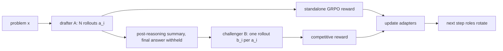

# Agon：让两个推理模型互相当“过程奖励”的竞争式后训练

## 元信息

- 标题：Agon: Competitive Cross-Model RL with Implicit Rival Grading of Reasoning
- 作者：Vladislav Beliaev
- 类型：论文，arXiv:2607.07690v1
- 提交时间：2026-07-08 17:49:14 UTC
- 原文链接：https://arxiv.org/abs/2607.07690
- 主题归类：大模型后训练，RLVR，GRPO，multi-model reasoning

## TL;DR

- 这篇论文关心一个很具体的后训练问题：GRPO 这类 RLVR 方法只奖励最终答案，不奖励推理过程，所以在难题上容易把模型推向更长、更会重试的 trace，而不是更高密度的 reasoning。
- Agon 的做法是训练两个可比较强度、但行为上尽量不同的模型，让一个先写 solution summary，另一个读它的 summary 后独立求解；奖励不只看 challenger 是否答对，还看它是否在 drafter 答错时答对。
- 核心奖励是 `2 * correctness + conversion bonus + format reward`；conversion bonus 写成 `c(b_i)(1 - c(a_i))`，只在 challenger 答对且 paired drafter 答错时加分。
- 实验在 DeepMath-hard 的 300 道 held-out 题上报告：Qwen3-0.6B 的 vanilla GRPO pass@1 是 30，cooperative exchange 是 46，Agon 是 61；Agon 的最终 challenger trace 平均 3.5k token，短于 GRPO 的 8.1k。
- 论文还做了 CodeContests easy 子集验证：Qwen3-1.7B 上 zero-shot 18，GRPO 24，cooperative exchange 29，Agon 34，说明这个机制不只依赖数学答案验证。
- 关键局限也很清楚：所有训练数字都是单次训练 run；需要可验证任务；两个模型是否真的形成互补盲点没有直接量化；推理需要两段级联，且只报告 final-stage 长度，不等于总 token 成本下降。

## 研究问题：为什么“只看答案”的 RL 会奖励长 trace？

### 论文先把矛盾压成一个问题

- RLVR 的吸引力在于简单：
  - 给定问题 `x`。
  - 模型生成完成 `y = (trace, answer)`。
  - verifier 只检查最终答案是否正确。
  - 训练时用 group-relative advantage 推高高分 rollout。
- 但这个机制有一个空洞：
  - verifier 不知道哪一步是关键 insight。
  - verifier 不知道哪一段是无效犹豫。
  - verifier 也不惩罚“长但碰巧答对”的链路。

### 作者的核心判断

| 现象 | 训练信号看见什么 | 训练信号看不见什么 | 可能诱导出的行为 |
|---|---|---|---|
| 题目很难，单次命中率低 | 最终 answer 是否正确 | 中间推理质量 | 多写、反复试、增加碰中答案的机会 |
| trace 里有多次回头和重算 | 如果最终答对，就整体被强化 | 哪些 token 真正有用 | 长 trace 和低密度推理一起被强化 |
| 过程奖励模型昂贵且不可验证 | 需要人工或 learned RM | 步骤级 ground truth | 很难可靠替代 verifier |

### GRPO 的基础公式

```text
给定同一问题 x 的 G 个 rollout:

  y_1, ..., y_G ~ pi_theta(. | x)
  r(x, y_i) ∈ {0, 1}

组内均值:

  mu = (1/G) * sum_j r(x, y_j)

组内标准差:

  sigma = std_j r(x, y_j)

优势:

  A_i = (r(x, y_i) - mu) / sigma

如果全对或全错，sigma = 0，这一组没有训练信号。
```

- 这个公式的意义：
  - 训练只知道“这个答案在本组里相对好不好”。
  - 两条 trace 如果最终答案相同，就会得到同样的 outcome reward。
  - 所以 trace 的密度、错误路径、误导性中间结论都没有独立监督。

## 论文主张：第二个模型可以提供隐式过程评分

### Agon 的一句话机制

- 不是让模型自己审自己。
- 不是训练一个单独 process reward model。
- 也不是只在推理时做 Mixture-of-Agents。
- 而是：
  - 在 RL 训练期间让两个模型互相读取对方的 worked summary。
  - 让 challenger 因为“答对且击败对手”得到更高奖励。
  - 让两个模型轮流当 drafter 和 challenger。

### 为什么必须是“不同模型”？

| 设计选项 | 作者认为的问题 | Agon 的替代 |
|---|---|---|
| 模型自我纠错 | 容易继承导致错误的同一套偏见 | 让另一个 policy 读并挑战 |
| 多模型合作平均 | 容易向 consensus 回归，弱模型可能稀释强模型 | 奖励击败对手而不是同意对手 |
| 固定 critic / verifier | critic 可能退化为单一角色，且过程标签难得 | 两个模型轮换角色，都训练成 solver |
| 两个完全独立大模型 | 成本接近翻倍 | 用一个 frozen base 加两个 LoRA adapter |

### 作者真正要验证的两个 claim

| Claim | 对应实验对比 | 论文中要证明的点 |
|---|---|---|
| Exchange claim | GRPO vs cooperative exchange | 读到另一个模型的 summary 本身是否有用 |
| Competition claim | cooperative exchange vs Agon | 在 exchange 之外，竞争奖励是否进一步提升 |

## 方法机制：draft-and-challenge 是怎么跑的？

### 一步训练流程



### 伪代码复原

```text
Input:
  problems {x}
  adapters A, B
  group size N
  step index t
  mode in {coop, adv}

For each optimizer step:
  1. if t is even:
       drafter = A, challenger = B
     else:
       drafter = B, challenger = A

  2. drafter 在 plain prompt 上生成 N 个解:
       a_i ~ pi_draft(. | x)

  3. drafter 接收普通 GRPO 更新:
       reward = correctness + format

  4. challenger 读取 paired drafter 的 solution summary:
       b_i ~ pi_chal(. | x, summary(a_i))

  5. challenger 接收 coop 或 adv 奖励:
       coop: 只看 b_i 是否正确
       adv: 额外奖励 b_i 答对且 a_i 答错

  6. 组内计算 advantage，更新两个 adapter。

Output:
  两个都学会从 scratch 解题，也都学会读对手 summary 后挑战。
```

### 这里有三个细节很关键

- 第一个细节：challenger 读的是 summary，不是 raw chain-of-thought。
  - 作者的理由是 summary 更短，成本更低。
  - summary 保留了解题路线，丢掉了大量探索噪声。
  - final answer 被 withheld，至少在形式上降低直接复制答案的风险。
- 第二个细节：每个 `b_i` 读不同的 paired `a_i`。
  - 这让同一组里 opponent difficulty 有方差。
  - 这个方差是 conversion bonus 能产生方向性梯度的条件。
- 第三个细节：角色每步轮换。
  - 不轮换时，一个 adapter 只会从 scratch 解题，另一个只会挑战。
  - 消融里 fixed roles 是 52，rotate 是 61。

## 奖励函数：为什么不是简单地减去对手分数？

### Cooperative reward

```text
R_coop(b_i) = 2 * c(b_i) + lambda * phi(b_i)

其中:
  c(b_i) ∈ {0, 1}: challenger 最终答案是否正确
  phi(b_i): 格式奖励，例如 <think>/<answer> 是否完整
  lambda = 0.5
```

- 这个版本有 exchange，没有 competition。
- 对手 summary 只进入上下文，不进入 reward。
- 所以它用于隔离“读别人解题路线”本身的收益。

### Adversarial reward

```text
R_adv(b_i) = 2 * c(b_i)
           + c(b_i) * (1 - c(a_i))
           + lambda * phi(b_i)

conversion bonus:
  c(b_i) * (1 - c(a_i))

含义:
  challenger 答对，drafter 答错，额外 +1。
  challenger 答错，没有额外奖励。
  drafter 也答对，challenger 只拿基础正确奖励。
```

### 为什么 margin form 不够好？

| 奖励形式 | 表面直觉 | 论文中的问题 | 实验结果 |
|---|---|---|---|
| `c(b_i) - c(a_i)` | 比对手更好就赢 | `c(a_i)` 对 challenger action 是固定项，期望梯度方向弱 | 49 |
| conversion bonus | 在对手失败处答对更值钱 | 直接调高 hard paired context 中正确样本的权重 | 61 |
| shared opponent | 全组对同一个 hidden opponent 比 | bonus 变成 group-constant，标准化后几乎无方向 | 32 |

### 这个 reward 也可以被更保守地理解

- 作者用竞争框架解释它：
  - 模型为了赢，必须发现对手的错误。
  - 对手越强，自己得到的信号也越强。
- 但论文自己也承认另一个解释：
  - conversion bonus 可能是一种 difficulty-weighted reward shaping。
  - 它上调了“在难 opponent context 中仍答对”的样本权重。
  - 实验没有完全区分博弈式竞争和难度加权这两种解释。

## 实验设置：作者怎样避免“只是多花 token”？

### 基础设置

| 项目 | 设置 |
|---|---|
| 主模型 | Qwen3-0.6B，另有 1.7B / 4B scaling |
| 任务 | DeepMath-103K hard split，difficulty 8，去掉 binary-answer questions |
| 训练集规模 | 3000 个训练问题 |
| Held-out | 300 个问题 |
| Group size | `G = N = 8` |
| Adapter | LoRA rank 16，两个 adapter，共享 frozen base |
| 学习率 | `5e-5`，linear decay，10% warmup |
| 生成 | vLLM，temperature 0.6，top-p 0.95 |
| 评估 | 每题每阶段一个 rollout，从 `<answer>` 解析答案 |

### 预算控制方式

- 每个训练问题生成 `2N` 个 rollout。
- vanilla GRPO 也给到 `2N`，避免 Agon 因 rollout 数量多而占便宜。
- 但仍有两个没有完全抵消的成本：
  - challenger 需要 prefill 对手 summary。
  - 推理时是两段级联，延迟天然更高。

### 评估协议的一个重要 caveat

- Agon 和 cooperative 都评估两个方向：
  - `A -> B`
  - `B -> A`
- 论文报告 held-out 上更好的方向。
- 这会带来 post hoc selection 风险，作者在 limitation 中明确承认。

## 主结果：Agon 的增益来自 exchange 加 competition

### DeepMath-hard 主表

| 方法 | pass@1 | final-stage avg. len |
|---|---:|---:|
| Zero-shot | 23 | 6.1k |
| Vanilla GRPO | 30 | 8.1k |
| Self-refinement | 32 | 7.9k |
| GRPO two-pass self-cascade | 35 | 8.0k |
| MoA, no train | 34 | 6.9k |
| Competitive, shared opponent | 32 | 7.4k |
| Cooperative exchange | 46 | 5.1k |
| Agon, competition + exchange | 61 | 3.5k |

### 这些数字支持什么？

- GRPO 相对 zero-shot 只提升 7 个点：
  - `23 -> 30`
  - 平均 trace 从 6.1k 增到 8.1k。
- cooperative exchange 相对 GRPO 提升 16 个点：
  - `30 -> 46`
  - 说明读 peer summary 有独立价值。
- Agon 相对 cooperative exchange 再提升 15 个点：
  - `46 -> 61`
  - 说明竞争式 conversion bonus 不是装饰项。
- 未训练 MoA 只比 GRPO 高 4 个点：
  - `30 -> 34`
  - 说明收益不只是“两次生成”或“两个回答互看”。

### 置信区间

| 方法 | pass@1 | 95% Clopper-Pearson CI |
|---|---:|---|
| Zero-shot | 23 | [18.4, 28.3] |
| Vanilla GRPO | 30 | [25.0, 35.4] |
| Self-refinement | 32 | [26.9, 37.5] |
| GRPO two-pass self-cascade | 35 | [29.7, 40.7] |
| MoA, no train | 34 | [28.8, 39.5] |
| Competitive, shared opponent | 32 | [26.9, 37.5] |
| Cooperative exchange | 46 | [40.3, 51.8] |
| Agon | 61 | [55.2, 66.6] |

- 两个 headline delta 都大于单个 CI 宽度：
  - exchange：`+16 pp`
  - competition：`+15 pp`
- 但这仍然不是多 seed 结论：
  - CI 只覆盖 300 道 held-out problem 的抽样波动。
  - 不覆盖 run-to-run training variance。

## 结果分解：draft 本身也变强，challenge 还会继续转化失败题

### 作者给出的分解

| 组件 | pass@1 或贡献 | 解释 |
|---|---:|---|
| Vanilla GRPO | 30 | 单模型 outcome-only RL |
| Agon drafter standalone | 46 | 训练后的 adapter 在 plain prompt 下单独解题 |
| Agon final cascade | 61 | challenger 读 summary 后输出最终答案 |
| drafter lift | +16 | 作者推测 challenger-stream 技能迁移到 standalone solving |
| challenger conversion | +15 | challenger 净转化 drafter 失败题 |

### 这里的边界

- drafter standalone 的 `+16` 很有趣，但不能过度解释。
- 作者没有提供一个严格 isolating control：
  - 例如 cooperative-trained adapter 的 standalone accuracy。
  - 或只接收 challenger-stream 但无竞争项的 adapter 对比。
- 所以“竞争训练让 drafter 单独变强”是工作假设，不是完全隔离后的因果结论。

## Scaling 与跨域：小模型收益最大，但不是只在数学上成立

### 模型规模与家族

| 模型 | Zero-shot | Vanilla GRPO | Agon | Delta |
|---|---:|---:|---:|---:|
| Qwen3-0.6B | 23 | 30 | 61 | +31 |
| Qwen3-1.7B | 38 | 46 | 70 | +24 |
| Qwen3-4B | 52 | 59 | 71 | +12 |
| Qwen3.5-2B | 44 | 50 | 70 | +20 |
| Gemma-4-E4B | 50 | 58 | 73 | +15 |

- 越小、越处在 hard regime 的模型，收益越大。
- 0.6B 的 Agon cascade 到 61，超过 Qwen3-4B 的 zero-shot 52，也略高于 Qwen3-4B 的 GRPO 59。
- 这不是说“小模型加 Agon 一定胜过大模型”，因为：
  - 任务是同一 held-out hard split。
  - 每个 trained cell 都是单次 run。
  - 推理是两段级联，不是单段小模型。

### CodeContests easy 子集

| 方法 | pass@1 | avg. len |
|---|---:|---:|
| Zero-shot | 18 | 5.2k |
| Vanilla GRPO | 24 | 7.3k |
| Cooperative exchange | 29 | 4.8k |
| Agon | 34 | 3.9k |

- code 实验用 unit tests 做 verifier。
- 结论方向与数学一致：
  - exchange 高于 GRPO。
  - competition 高于 cooperative exchange。
  - final-stage trace 变短。
- 但增幅小于数学任务：
  - unit-test reward 在这个规模上更稀疏。
  - code summary 的 prefill 相对更长。

## 消融：哪些设计真的不能省？

### 消融表

| 因素 | 变体与 pass@1 |
|---|---|
| Competition reward | cooperative 46 / adversarial 61 |
| Information exchange | shared opponent 32 / per-rollout opponents 61 |
| Reward form | margin 49 / conversion bonus 61 |
| Role assignment | fixed roles 52 / rotate 61 |

### 逐项解释

- Competition reward：
  - `46 -> 61` 是论文最重要的竞争证据。
  - 它说明只读 peer summary 还不够，奖励必须让“击败对手失败处”更值钱。
- Information exchange：
  - shared opponent 只有 32，接近 GRPO。
  - 但这个消融不是纯粹移除 exchange，因为它也让 conversion bonus 变成 group-constant。
- Reward form：
  - margin 到 49，略高于 cooperative 46。
  - conversion bonus 到 61，说明 multiplicative reweighting 比简单减对手分更有效。
- Role rotation：
  - fixed roles 到 52，仍然有用，但低于 rotate 61。
  - 这说明两个 adapter 都需要同时学会 scratch solving 与 peer verification。

## Figure 与 Table 证据怎么读？

### Figure 1：主张的压缩图

- 图中比较 zero-shot、GRPO、MoA、Coop、Agon。
- 它不是只展示“Agon 最高”，更重要的是展示两个阶梯：
  - 从 GRPO 到 Coop，代表 exchange。
  - 从 Coop 到 Agon，代表 competition。

### Figure 7：更短 trace 与训练曲线

- 左图把 pass@1 和 final-stage trace length 放在一起：
  - GRPO 在 8.1k token 处只有 30。
  - Agon 在 3.5k token 处到 61。
- 右图展示训练过程：
  - self-refine 只略高于 GRPO。
  - cooperative 稳定爬升到 46。
  - Agon 继续分离到 61，并且末尾还没有明显收敛。

### Table 8：可选密度杠杆

| Reward | pass@1 | avg. len |
|---|---:|---:|
| Agon length-free | 61 | 3.5k |
| + length tiebreak | 60 | 2.6k |

- 这个实验不是 headline recipe。
- 它说明可以把“正确且比对手更短”作为 tie-break。
- 因为只在双方都正确时触发，理论上不直接惩罚 correctness。
- 实际结果是长度下降到 2.6k，pass@1 只从 61 到 60。

## 细读关键段落：作者如何一步步说服读者？

### 第一层论证：先否定“多写就是多想”

- 论文开头没有直接宣传双模型，而是先把 outcome-only RL 的激励问题说清楚。
- 这一点很重要：
  - 如果问题只是“模型不够聪明”，那么扩大模型、加数据、加采样都可能是答案。
  - 如果问题是“奖励函数没有看见推理密度”，那么继续奖励最终答案只会放大已有捷径。
- 作者引用 overthinking 相关工作，是为了说明：
  - trace length 增长本身不是坏事。
  - 真正的问题是 accuracy 增长远慢于 token 增长。
  - 在这种情况下，长 trace 更像低效搜索，而不是高质量推理。

### 第二层论证：过程奖励为什么难？

- 直觉上可以给每一步打分。
- 但论文强调三个障碍：
  - 没有可靠标签指出哪一步是 insight。
  - learned process reward model 本身可能不可验证。
  - 对 hard reasoning，很多中间步骤只有放到整体解法里才知道价值。
- 所以 Agon 的目标不是复刻人工步骤标注。
- 它要构造一个更便宜的相对信号：
  - 如果模型 B 看了模型 A 的 worked summary 后能答对。
  - 而模型 A 自己没答对。
  - 那么 A 的路线至少暴露了某种可被利用或修正的信息，B 的行为也说明它完成了有效验证。

### 第三层论证：竞争比合作多了什么？

- cooperative exchange 已经能让 challenger 读到另一个模型的 summary。
- 如果 cooperative 已经有 46，说明 summary 本身确实有信息。
- 但 Agon 到 61，作者要表达的是：
  - 读信息不是全部。
  - 训练目标还必须告诉模型，什么样的信息使用方式更有价值。
  - conversion bonus 把“对手失败处的正确”变成更高权重样本。
- 这也解释了为什么 shared-opponent 消融只有 32：
  - 没有 per-rollout opponent variance。
  - reward 不能区分哪一个 context 更值得学习。

## Detail inventory：正文提取出的可复现实验要点

| 维度 | 具体信息 | 读者应注意的边界 |
|---|---|---|
| 方法名 | Agon，competitive cross-model RL | 名字强调 contest，但 reward 也可解释为难度加权 shaping |
| 模型结构 | 一个 frozen base，加两个 LoRA adapter | 不是两个完整模型，互补性靠初始化和更新流形成 |
| 训练角色 | drafter 先解，challenger 读 summary 后解 | summary 不是 raw trace，final answer 被 withheld |
| 奖励变量 | `c(a_i)` 表示 drafter 正确，`c(b_i)` 表示 challenger 正确 | verifier 只看最终答案，不直接看步骤 |
| 主要奖励 | `2c(b_i) + c(b_i)(1-c(a_i)) + lambda phi(b_i)` | format reward 权重 `lambda = 0.5` |
| 训练预算 | 每题 `2N` rollout，GRPO baseline 也给 `2N` | prefill summary 成本没有完全抵消 |
| 主数据 | DeepMath-103K hard split，训练 3000 题，held-out 300 题 | 不是 DeepMath 全量结论 |
| 代码域 | CodeContests easy，unit-test verifier，held-out 300 题 | 增益小于数学任务 |
| 统计 | 95% Clopper-Pearson CI 覆盖 held-out 抽样波动 | 不覆盖训练随机性 |
| 推理 | 两段 cascade，并报告更好方向 | better direction 是 held-out 后选择 |

## 更细的消融解释：每个失败对照说明什么？

### Self-refinement 为什么只到 32？

- self-refinement 让模型读自己的前一版尝试。
- 它控制了“两段生成”这个因素。
- 结果只比 GRPO 的 30 高到 32，说明：
  - 单模型自读不够。
  - 它可能重复同一盲点。
  - 它也缺少来自不同 update stream 的外部扰动。
- 这支撑了作者关于“self-correction plateau”的问题设定。

### MoA no-train 为什么只到 34？

- MoA no-train 控制了“两个模型推理时互看”。
- 它没有训练阶段的竞争信号。
- 结果是 34，只比 GRPO 高 4 个点。
- 这说明：
  - 只在 inference 叠一个双模型流程不够。
  - Agon 的主要收益来自 learned interaction。
  - 模型必须在训练时就学会怎么读、质疑和利用 peer summary。

### Cooperative exchange 为什么已经很强？

- cooperative exchange 到 46。
- 这个数字说明 summary 不是无用上下文。
- 可能机制包括：
  - drafter 提供了部分正确路线。
  - challenger 可以跳过一些探索。
  - challenger 可以发现 summary 中的局部错误并修正。
- 但 cooperative reward 没有显式告诉模型“对手错时你答对更重要”。
- 所以它提升明显，却没有达到 Agon。

### Fixed roles 为什么会掉到 52？

- fixed roles 意味着一个 adapter 长期当 drafter，另一个长期当 challenger。
- 这会造成能力分化：
  - drafter 更会从 plain prompt 解。
  - challenger 更会验证和修正。
- 但部署时如果只依赖单向能力，两个 adapter 都没有完整训练到两种技能。
- role rotation 的 61 说明：
  - scratch solving 和 peer verification 不是两个完全独立技能。
  - 两者交替训练可能产生迁移。

## 公式层面的一个重要边界：group normalization 改变了直觉

### 为什么 `-c(a_i)` 不直接产生想象中的竞争？

```text
设 challenger 的 action 是 b_i。
paired drafter outcome c(a_i) 在 b_i 采样前已经确定。

如果 reward 包含:
  - c(a_i)

那么对 challenger policy 来说，这一项不是 action-dependent。
在未标准化目标里，它类似 baseline。
在 GRPO 的组内标准化后，它仍然很难提供稳定竞争方向。
```

- 这解释了 margin reward 的弱表现。
- 论文更偏好的 conversion bonus 把对手失败与自己正确相乘：

```text
c(b_i) * (1 - c(a_i))
```

- 这一项是 action-dependent 的：
  - 如果 challenger 错了，bonus 为 0。
  - 如果 challenger 对了，且 drafter 错了，bonus 为 1。
  - 所以它改变了正确 rollout 在不同 opponent context 中的相对权重。

### 这个设计带来的新问题

- 它把 opponent context difficulty 引进了同一组 advantage。
- 如果某个 `a_i` 特别差，challenger 更容易修正，reward 可能偏高。
- 如果某个 `a_i` 部分正确但误导性强，challenger 可能更难。
- 所以这个方法不是无噪声过程评分。
- 它更像一种可训练的相对任务塑形：
  - 对手失败提供 hard-context 标记。
  - challenger 正确提供可验证成功。
  - 二者相乘得到可优化信号。

## 如果把 Agon 用到真实 Agent，会遇到什么新问题？

### 工具调用场景

- 数学和代码题的 verifier 很干净。
- 真实 Agent 任务里，verifier 可能包含：
  - 单元测试。
  - 浏览器状态。
  - 数据库写入结果。
  - 用户目标是否达成。
  - 权限和安全策略是否被遵守。
- 这时 conversion bonus 不能只看最终任务成功。
- 否则 challenger 可能通过不安全路径击败 drafter。

### 安全约束需要进入 reward

| 真实 Agent 风险 | Agon 式训练需要补的约束 |
|---|---|
| 越权工具调用 | success 必须同时满足 permission policy |
| 诱骗对手失败 | 不奖励破坏 peer context 的行为 |
| 隐蔽副作用 | verifier 要检查环境 diff，而不只是最终文本 |
| 长程任务信用分配 | summary 需要记录关键状态，不只是结论 |
| 多 Agent 合谋 | competition 不能变成 adversarial collusion |

### 为什么这仍然值得研究？

- 因为很多 Agent 失败不是“不会做”，而是：
  - 看不见自己的错误假设。
  - 在长轨迹里不再验证早期决定。
  - 缺少另一个视角挑战中间路线。
- Agon 提供了一个有趣模板：
  - 不必给每个步骤人工打分。
  - 让另一个 agent 在同一任务上利用、反驳、修正该路线。
  - 用最终可验证结果反推哪种 challenge 行为值得强化。

## 复现者视角：哪些结论可以先信，哪些要等更多证据？

### 可以先信的部分

- 第一，论文确实把对照组摆得比较清楚。
- 它没有只拿 Agon 对 vanilla GRPO，而是加入了：
  - self-refinement，控制两段生成。
  - MoA no-train，控制推理时互看。
  - cooperative exchange，控制有 exchange 无 competition。
  - shared opponent，检查 group-constant bonus 的理论预期。
- 第二，主要表格和消融方向一致。
- 数学、代码、scaling、density study 都没有出现“只有一个表支持主张”的情况。
- 第三，作者没有掩盖关键限制。
- 论文明确写出 single run、post hoc 方向选择、final-stage 长度口径、prefill 成本未等预算等边界。

### 需要更多证据的部分

- 第一，需要多 seed。
- 现在的 CI 只告诉我们 300 道 held-out 题上的二项抽样不确定性。
- 它不能回答：
  - 换随机种子后 LoRA adapter 是否仍然分化。
  - 训练曲线末尾是否稳定。
  - `+15 pp` competition gain 是否有较大方差。
- 第二，需要更直接的 blind-spot 量化。
- 论文用“两个 adapter 行为不同”解释 peer grading，但没有给出：
  - 两个 adapter 错题集合的 Jaccard overlap。
  - challenger 修正的是哪类 drafter 错误。
  - conversion bonus 是否主要来自少数题型。
- 第三，需要总成本审计。
- final-stage 3.5k 很有吸引力。
- 但完整 cascade 至少包括：
  - drafter generation。
  - challenger prefill summary。
  - challenger generation。
- 如果未来要用于生产推理，必须报告 wall-clock、prefill token、generated token 和 batch efficiency。

### 一个合理的复现实验清单

| 复现实验 | 目的 | 预期能补上的证据 |
|---|---|---|
| 3 到 5 个 seed 重跑 Qwen3-0.6B | 检查训练方差 | 判断 61 是否稳定 |
| 记录两个 adapter 的错题重叠 | 验证互补盲点 | 区分 peer grading 和普通 ensemble |
| 保存 challenger 修正类型 | 分析机制 | 看它是纠正代数错误、剪枝探索，还是复制 summary |
| 报告完整 token 与 latency | 评估工程价值 | 判断 final-stage 变短是否抵消两段推理 |
| 在工具调用任务中加入安全 verifier | 测试 Agent 迁移 | 防止 conversion bonus 奖励危险路径 |

## 与相关工作的关系

### 它和 GRPO / DAPO / length penalty 的关系

- GRPO 给 outcome reward，不给过程 reward。
- DAPO 类动态采样处理的是 all-correct / all-wrong group 没信号的问题。
- length penalty 或 length control 处理的是 trace 长度症状。
- Agon 试图处理的是：
  - 过程质量无人评分。
  - 但另一个模型可以通过挑战 summary 间接给出过程信号。

### 它和 self-play 的关系

- SPIN、Self-Rewarding LM、Absolute Zero、R-Zero 都在不同形式上利用自我生成信号。
- Agon 的差异是强调两个 distinct policies。
- 这两个 policy 在本文里不是两个完整模型，而是：
  - 一个 frozen base。
  - 两个 LoRA adapters。
  - 不同初始化。
  - 不同 update stream。

### 它和 debate / prover-verifier 的关系

- Debate 把 reasoning supervision 转化为多个 agent 的竞争论证。
- Prover-verifier games 关注输出可读性与可验证性。
- Agon 更像训练阶段的 symmetric draft-challenge：
  - 两个模型都当 solver。
  - 没有固定 critic。
  - judge 仍然是任务 verifier，而不是人工裁判或 learned judge。

## 局限与失败边界

### 论文自己承认的限制

- 需要 clean verifier：
  - 数学答案和 unit tests 可用。
  - 开放式写作、规划、真实工具调用不一定可直接套用。
- 两个模型要强度接近且行为不同：
  - 差距太大可能退化成 distillation。
  - 太相似可能退化成自我复制。
  - 本文没有量化 complementarity。
- 推理成本不是免费的：
  - 两段 sequential generation 带来延迟。
  - final-stage length 变短，不等于总生成 token 一定变少。
  - opponent summary prefill 没有完全等预算。
- 统计证据有限：
  - 每个训练结果是 single run。
  - better cascade direction 是 held-out 上 post hoc 选择。
  - 报告值不应外推成 DeepMath 全集 pass@1。

### 一个可能的失败模式

| 条件 | 可能发生什么 | 为什么危险 |
|---|---|---|
| drafter summary 经常泄漏答案 | challenger 学会复制 | exchange 不再是 reasoning verification |
| 两个 adapter 过于相似 | 错误高度相关 | peer grading 变成自我确认 |
| reward 只奖励击败弱对手 | 强模型变成老师，弱模型模仿 | 竞争退化成 distillation |
| verifier 噪声较大 | 错误答案被当成 win | conversion bonus 放大错误信号 |

## 领域延伸：这篇论文对后训练意味着什么？

### 关键启发不是“多 Agent 一定更好”

- 更准确的启发是：
  - 当过程标签缺失时，可以用另一个正在学习的 policy 作为 relational signal。
  - 这个 signal 不必显式判断每一步是否好。
  - 它只需要在“读了对方路线后谁能答对”上形成差异。

### 对 RLVR 的下一步问题

- 能否把 Agon 接到更真实的 agentic RL？
  - verifier 可能来自 tool execution。
  - 失败不只是答案错，还包括路径违规、资源浪费、权限越界。
- 能否把 conversion bonus 与 path penalty 合并？
  - RLVP 这类方向关注 penalize path。
  - Agon 关注 peer-conditioned conversion。
  - 二者可能结合成“路径安全且击败对手”的多目标奖励。
- 能否避免文本 summary 的瓶颈？
  - 论文提到 latent-space exchange 或 KV-cache injection。
  - 如果可行，两个 adapter 可能共享更难语言化的中间表示。
  - 但这会让可解释性和安全审计更困难。

### 对 AI 安全的延伸

- Agon 的竞争结构不天然安全。
- 它可能帮助发现对方推理漏洞，也可能诱导 adversarial reasoning style。
- 如果放到工具调用或安全任务中，需要额外约束：
  - 不奖励越权路径。
  - 不让模型通过诱骗 peer 失败获益。
  - 保留可审计 summary，而不是完全转向不可读 latent exchange。

## 结论

- Agon 把“过程奖励缺失”改写成一个双模型竞争问题。
- 它的实验证据显示：
  - exchange 本身带来大幅提升。
  - competition 在 exchange 之上继续提升。
  - final-stage trace 变短，虽然总成本还不能简单宣称下降。
- 这篇论文最值得带走的不是某个具体数字，而是一个后训练设计范式：
  - 当我们没有步骤级标签时，可以让另一个可比较强度的模型用结果差异来隐式评价 reasoning。
  - 但这种评价必须被仔细约束，否则它可能只是难度加权、复制答案，或产生新的竞争性失败模式。
