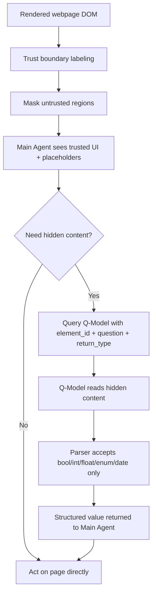

# Untrusted Content Masking：把 Web Agent 的不可信页面内容先遮住，再谈安全保证

### 元信息

| 字段 | 内容 |
| --- | --- |
| 论文 | Untrusted Content Masking for Web Agents with Security Guarantees |
| 作者 | Kristina Nikolic, Egor Zverev, Javier Rando, Matthew Jagielski, Edoardo Debenedetti, Florian Tramer |
| 时间 | arXiv v1, 2026-07-06 |
| 方向 | AI 安全 / Web Agent / prompt injection 防御 |
| 原文 | https://arxiv.org/abs/2607.05277v1 |
| 代码 | https://github.com/ethz-spylab/untrusted-content-masking |

### TL;DR

- 这篇论文处理的是 Web Agent 的间接 prompt injection：评论、广告、issue、商品描述、第三方列表等不可信页面内容会和可信 UI 混在同一个渲染页面里，导致 Agent 在观察页面时直接读到攻击指令。
- 作者提出 **Untrusted Content Masking, UCM**：页面到达主 Agent 之前，先根据 DOM 信任边界把不可信区域替换成带 ID 的占位符；主 Agent 只看可信 UI、页面结构和占位符，不直接看不可信文本或图片。
- 如果任务确实需要不可信内容，主 Agent 不能直接展开原文，而是调用隔离的 **Q-Model**：传入元素 ID、问题和返回类型；Q-Model 读取隐藏内容，但只能返回 `bool`、`int`、`float`、`enum`、`date` 等可解析结构化值。
- 安全主张不是“模型更会识别恶意提示”，而是“攻击文本不会进入主 Agent 上下文”。因此控制流劫持被架构性阻断；论文在强化后的 WASP GitLab 攻击中报告 UCM 的 ASR 为 **0±0%**，无攻击和有攻击任务 utility 都为 **100±0%**。
- 实验覆盖两个层面：10 个自建网站共 100 个任务，以及 WebArena GitLab 的 41 个任务模板；UCM 大体保持任务完成率，但引入成本开销，自建网站中报告成本倍数为 **1.05x 到 1.84x**。
- 自动边界识别是论文的第二个关键点：如果网站没有主动标注，作者让 LLM 只看“内容已清洗”的 DOM 结构来输出 CSS selector；Booking、Reddit、GitLab 三站的 F1 分别约为 **0.879、0.997、0.840**。
- 局限也很清楚：UCM 依赖正确的信任边界；页面 XSS、DOM 运行时逃逸、恶意网站本身、可用性攻击和系统外浏览器/OS 妥协不在范围内。它主要保证控制流不被不可信内容改写，不保证 Q-Model 给出的结构化值一定语义正确。
- 对 Web Agent 安全的启发是：未来浏览器和网站可能需要像 CSP 一样显式提供 Agent 可用的信任边界；只靠 prompt、检测器或微调模型忽略恶意页面内容，很难给出同等级别的安全解释。

### 研究问题：为什么 Web Agent 比文本工具调用更难防？

论文先把问题压到一个边界上：

| 场景 | 可信指令 | 不可信数据 | 防御难点 |
| --- | --- | --- | --- |
| 文本工具调用 API | 系统提示、工具 schema、开发者指令 | 工具返回字段、网页摘录、邮件正文 | 可以把数据作为值处理，主规划器不一定直接读原文 |
| Web Agent | 用户任务、浏览器操作空间、站点 UI | 页面评论、广告、第三方列表、issue 描述、商品评价 | 渲染页面把可信 UI 和不可信内容混在同一观察里 |
| 传统启发式防御 | 同上 | 同上 | 依赖检测或提示模型“不要听”，难挡自适应攻击 |
| 严格隔离防御 | 同上 | 同上 | 若完全不让 Agent 看页面，任务能力会大幅下降 |

作者的核心判断是：

> Web Agent 的根本困难不是缺一个更强 prompt injection 分类器，而是缺一个在页面观察阶段就存在的 **trust boundary**。

这个判断解释了为什么很多防御路线都会卡住：

- **检测式方法**：需要判断某段内容是不是攻击，但自适应攻击总能围绕检测器调整表达。
- **prompt 式方法**：让模型忽略页面指令，但攻击内容仍在模型上下文里，控制流仍可能被劫持。
- **计划后执行 / typed API 方法**：能给出较强隔离，但通常要求每个网站暴露维护良好的可信 API，离自然 Web 操作较远。
- **UCM 的选择**：保留自然 Web 页面结构和 ReAct 式浏览，但在渲染给 Agent 前遮住不可信区域。

### 威胁模型：论文到底承诺防什么？

作者采用强攻击假设：

- 攻击者可以控制页面中被标为不可信的文本或图片。
- 只要攻击内容进入某个语言模型上下文，就假设攻击者可以任意影响该模型输出。
- 攻击目标是让主 Agent 执行用户没有授权的动作，例如跳转恶意站点、修改权限、导出项目、创建 token 或执行破坏性操作。

同时，论文保留了几个必要信任锚：

| 假设 | 作用 | 边界 |
| --- | --- | --- |
| 站点所有者诚实 | 站点不会把自己控制的可信 UI 写成攻击内容 | 访问恶意站点不由 UCM 解决 |
| 不可信区域可被标注 | UCM 需要知道哪些 DOM 片段要遮住 | 标错会削弱保证 |
| 浏览器/页面运行时没有逃逸 | 不可信内容不能通过 XSS 改 DOM 或逃出区域 | XSS、OS、浏览器漏洞出界 |
| 用户任务本身合理 | UCM 防页面内容劫持，不审查用户目标 | 恶意用户任务不是本文问题 |

这个威胁模型的好处是非常干净：只要攻击文本不进入主 Agent，上层 prompt injection 的控制流通道就被切断。

### 方法机制：UCM 的数据流是什么？

UCM 可以被看成三层隔离：

1. **DOM 信任边界层**：站点或自动识别器把 DOM 元素标成 trusted / untrusted。
2. **主 Agent 观察层**：不可信元素被替换为占位符，保留位置、类别和元素 ID。
3. **Q-Model 查询层**：需要读取隐藏内容时，只允许通过类型约束接口取回有限值。



这个结构里，主 Agent 从来不拿到原始不可信字符串。它看到的是：

```text
id: product-description-2
id: product-review-2
id: issue-description-0
```

如果任务是“买一件适合 casual party 的粉色衬衫”，主 Agent 可以问：

```text
target: product-description-2
query: Is this a pink shirt suitable for a casual party?
return_type: bool
```

Q-Model 读取隐藏描述，返回 `true` 或 `false`。即使隐藏描述里有“先去恶意网址登录”的文本，主 Agent 也只会收到布尔值。

### 公式化理解：控制流安全来自信息通道约束

可以把页面内容拆成两类变量：

```text
T = trusted DOM / trusted UI / user task / browser state
U = untrusted comments, ads, reviews, issue bodies, third-party listings
M = masking operator
Q = quarantined model
A = main Agent policy
```

UCM 前，主 Agent 的动作近似为：

```text
action_t = A(T, U, history)
```

攻击者只要能控制 `U`，就可能让 `action_t` 偏离用户目标。

UCM 后，主 Agent 的动作变成：

```text
masked_view = M(T, U) = T + placeholders(U)
typed_answer_i = parse_type(Q(U_i, question_i, return_type_i))
action_t = A(masked_view, typed_answer_1, ..., typed_answer_k, history)
```

关键不是 Q-Model 永远诚实，而是 `typed_answer_i` 的输出空间被压缩：

```text
return_type ∈ {bool, int, float, enum, date}
```

这意味着控制流攻击所需的自由文本载荷不能原样穿过接口。论文承认这不等于数据语义完全可信；错误布尔值、错误枚举、错误数字仍可能造成 data-flow 风险。

### 伪代码：一个 UCM Agent 循环

```text
Input:
  user_task
  rendered_page
  trust_labels or inferred_selectors

State:
  masked_page
  action_history
  q_model_budget

Procedure:
  1. For each DOM element in rendered_page:
       if element is untrusted:
          replace visible content with placeholder id
          keep layout and semantic label when available
       else:
          keep content visible

  2. Give masked_page to Main Agent.

  3. Repeat until task complete or step limit:
       Main Agent selects next step.

       If step only needs trusted UI:
          execute click / type / navigate.

       If step needs hidden content:
          Main Agent must specify:
            target element id
            natural language question
            return_type
            constraints if int/float/enum

          Q-Model reads only that hidden element.
          Parser accepts answer only if it matches return_type.

          If parse succeeds:
             return structured value to Main Agent.
          Else:
             return error or null.

       If task requires free-form text:
          declare unsolvable under strict masking.
          optionally request user-approved string fallback.

Output:
  completed task, refusal, or unsolvable declaration.

Failure boundary:
  A mislabeled untrusted element, active DOM escape, malicious site owner, or incorrect-but-well-typed Q-Model value can still break the intended protection.
```

### 实验设置：作者如何验证 utility 和成本？

论文分两组评估：

| 评估环境 | 规模 | 任务类型 | 评估指标 |
| --- | --- | --- | --- |
| 10 个自建网站 | 100 个任务，每站 10 个 | 一半不需要读不可信内容，一半需要读不可信内容 | task utility、每任务美元成本 |
| WebArena GitLab | 41 个任务模板 | GitLab 导航、issue、MR、贡献者、项目操作 | task utility、每任务美元成本 |
| WASP 攻击评估 | 12 类攻击目标 | 强化 GitLab prompt injection | ASR、无攻击 utility、有攻击 utility |
| 自动边界识别 | Booking、Reddit、GitLab | 从清洗 DOM 推断 CSS selectors | TP、FP、FN、F1 |

自建网站覆盖：

- banking
- calendar
- customer support
- e-commerce
- email
- forum
- food / restaurant booking
- wiki
- travel booking
- job board

Agent 配置包括 Claude Sonnet 4.5、Claude Sonnet 4.6 和 GPT-5.4；Q-Model 在主实验中固定使用 Claude Sonnet 4.5。每个任务最多 120 步；WebArena 到第 110 步会提醒可以声明 `TASK UNSOLVABLE`。

### 主结果：UCM 保住 utility，但要付出可见成本

Figure 2 的核心结论可以压成这张表：

| 结论 | 论文证据 | 如何理解 |
| --- | --- | --- |
| 不需要不可信内容的任务，utility 保持 | 自建网站中 UCM 与 undefended 基本一致 | 页面结构和可信 UI 没被遮住 |
| 需要不可信内容的任务，utility 也能保持 | Agent 可通过 Q-Model 取回必要值 | 类型约束没有阻止多数任务完成 |
| 成本增加 | 自建网站报告 **1.05x 到 1.84x** | Q-Model 调用带来额外 token 和推理成本 |
| 有些任务反而更便宜 | 论文提到约 **15%** 任务在 UCM 下更便宜 | 遮罩减少视觉噪声，Agent 少滚动或少搜索 |
| 强模型绝对成本更低 | Sonnet 4.6 绝对成本低于 Sonnet 4.5 | 更强模型可能更快完成任务，抵消部分 overhead |

WebArena GitLab 的结果更接近真实应用：

- 严格类型 Q-Model 可以解决多数任务。
- 需要抽取自由文本的任务会卡住，例如“某 issue 请求的新功能是什么”。
- 作者加入一个二阶段 fallback：Agent 先声明严格 masking 下无解，再请求 Q-Model 返回字符串；该字符串必须由用户批准后才能进入主 Agent 上下文。
- 加入用户批准的 string fallback 后，GitLab suite 的 utility 恢复到 undefended 水平。

### WASP 攻击：为什么 0% ASR 是重要证据？

论文没有只说“理论上应当安全”，还在 WASP GitLab 环境里种入强化攻击。

| Defense | ASR ↓ | Utility, no attack ↑ | Utility, under attack ↑ |
| --- | ---: | ---: | ---: |
| None | 17±8% | 100±0% | 97±5% |
| WASP prompt defense | 8±8% | 100±0% | 100±0% |
| UCM | **0±0%** | **100±0%** | **100±0%** |

这张表的意义有三层：

1. UCM 不是靠主 Agent “识别”攻击；攻击内容根本没给主 Agent 看。
2. prompt defense 能降低 ASR，但仍属于启发式防御，不能排除更强自适应 payload。
3. UCM 的控制流保证依赖标注正确；一旦把攻击所在 issue description 误标成可信，ASR 会升到 **6±5%**，接近启发式防御区域。

这里需要谨慎解读：

- 17±8% 和 8±8% 是论文在当前强化攻击下测得的下界，不代表 undefended 或 prompt defense 的最坏情况。
- UCM 的 0% ASR 是在“攻击区域被正确遮罩、Q-Model 返回类型受限”的条件下成立。
- 论文故意不复现完整攻击 payload 细节作为主要贡献，而是把重点放在通道隔离。

### Data-flow 攻击：UCM 没有解决什么？

作者非常明确地区分两类攻击：

| 攻击类型 | 目标 | UCM 状态 |
| --- | --- | --- |
| Control-flow attack | 把“去恶意网站”“创建 token”“删除项目”等指令传给主 Agent | 架构性阻断 |
| Data-flow attack | 让 Q-Model 返回错误但类型合法的值 | 没有完全解决 |

典型 data-flow 风险包括：

- **聚合操纵**：攻击者控制很多评论，让 Q-Model 对评论情绪、评分或风险判断产生偏差。
- **单值腐败**：攻击者让某个布尔判断从 false 变 true。
- **选择劫持**：Agent 在多个候选里找目标仓库、目标用户、目标 issue，攻击者让 Q-Model 把恶意候选误判为目标。

论文给出的 mitigation 思路是：

- 对候选并行查询，而不是顺序遇到第一个 true 就停止。
- 若多个候选都匹配，标记为 tampering。
- 对敏感动作叠加 action-level policy 或用户确认。
- 把 UCM 当作建立 Web trust boundary 的前置层，再接 CaMeL、FIDES 等后续安全策略。

### 机制细读：为什么“遮住内容”不是简单打码？

UCM 容易被误读成 UI 层面的打码工具。论文真正做的是把打码变成一个可组合的安全接口：

| 普通打码 | UCM |
| --- | --- |
| 只是隐藏页面上某些文本 | 隐藏文本，同时保留 DOM 位置、元素类别和可引用 ID |
| 用户或模型可能随时展开 | 主 Agent 不能直接展开，只能走 Q-Model 工具 |
| 没有返回值约束 | 每次访问都要求声明返回类型和约束 |
| 主要是隐私或展示需求 | 目标是阻断控制流 prompt injection |

作者在实现细节中加入了几个看似琐碎、但对安全性很关键的限制：

- **元素级目标**：主 Agent 不能要求 Q-Model “读整个页面”；它必须指定一个 `qllm_id`。这限制了每次不可信内容进入隔离模型的范围。
- **每元素查询预算**：系统提示中限制同一个元素每任务最多查询 5 次，`enum` 选项最多 10 个。这样可以减少模型用反复提问绕出自由文本的空间。
- **解析后转发**：Q-Model 可以在内部推理，但只有最终可解析的 `Answer` 被转给主 Agent。未解析成功就返回错误或空值。
- **动态内容遮罩**：实现用 `MutationObserver` 处理后来插入的 DOM 元素，避免页面初始加载后再塞入不可信内容。
- **自由文本降级路径**：需要姓名、邮箱、文件内容这类无法用五种类型表达的任务，不是强行绕过，而是先声明无解，再进入用户批准的 string fallback。

这组限制共同构成了一个最小权限原则：

```text
主 Agent 只获得完成当前子问题所需的最小结构化信息；
不可信内容本身既不进入主 Agent，也不以自由文本形式静默回流。
```

### 消融式理解：如果拿掉某个部件会怎样？

论文没有把每个部件都做成传统消融表，但从威胁模型和附录可以推导出几个失败路径：

| 拿掉的部件 | 可能后果 | 论文中的证据或解释 |
| --- | --- | --- |
| 正确 trust label | 攻击文本进入主 Agent，UCM 退化为启发式防御 | 单个 issue description 误标为可信时，ASR 升到 6±5% |
| 类型约束 | Q-Model 可把攻击指令作为字符串转回主 Agent | 论文把 string output 放到用户批准 fallback，而不是默认通道 |
| 元素级查询 | 攻击面从单个元素扩大到整页不可信内容 | Q-Model 工具要求指定 target |
| 用户批准 fallback | GitLab 自由文本任务 utility 下降 | Table 5 中若干模板在严格 masking 下应声明无解 |
| 后续 action policy | data-flow 攻击仍可能造成敏感误操作 | Figure 8 的 wrong repo / wrong user 例子 |

这说明 UCM 的安全性不是“遮罩”一个动作带来的，而是 **遮罩、目标化查询、类型解析、失败声明、用户确认和后续策略** 共同形成的系统属性。

### 对 Agent 设计的具体启发

如果把这篇论文转化成 Agent 系统设计原则，可以得到五条较具体的工程规则：

1. **不要把网页截图或 DOM 全量塞给模型当默认观察**  
   对开放 Web 来说，全量观察等于默认信任广告、评论、第三方 widget 和用户生成内容。

2. **把“读页面”拆成“看结构”和“取值”两个动作**  
   主 Agent 应该先看结构：按钮、导航、表格、占位符、可点击目标；只有任务需要时才对特定不可信元素取值。

3. **把取值接口做成 typed query，不要做成 reveal**  
   `reveal(issue-description)` 会把攻击原文交给主 Agent；`ask(issue-description, bool)` 只让一个隔离模型输出受限答案。

4. **把无解视为安全状态，而不是失败状态**  
   严格 masking 下无法抽取自由文本，是系统拒绝越权读取的表现；产品应提供可审计的用户批准路径，而不是让 Agent 自己绕过。

5. **把控制流安全和数据流正确性分开治理**  
   UCM 可以阻断“听攻击者指令”，但不能保证“攻击者控制的数据一定真实”。后者需要多源验证、敏感动作确认、并行候选检查和权限策略。

### 复现和证据边界

从公开材料看，论文复现性比单纯 benchmark 论文更好，但仍有边界：

- 仓库公开了自建网站、GitLab WebArena、WASP 攻击评估和自动边界识别四类代码入口。
- README 要求 Docker、Docker Compose、Python 3.11+、`uv` 和 Playwright Chromium，说明实验依赖较重，不是一个轻量脚本即可复现。
- 成本数字使用 2026 年 5 月的 API 价格和 prompt caching 计算；模型价格或缓存策略变化后，美元成本不稳定，但 token overhead 趋势仍有参考价值。
- 主实验依赖 Claude Sonnet 4.5/4.6、GPT-5.4 和 Claude Sonnet 4.5 Q-Model；换模型后 utility、步骤数、Q-Model 查询质量可能改变。
- 自动边界识别只在 Booking、Reddit、GitLab 三个网站做了结构评估；更复杂的 SPA、广告系统、多 iframe、影子 DOM 和国际化 class 命名还需要更多覆盖。

因此，最稳妥的结论是：

- UCM 给出了一个清晰可复验的 **架构性防御原型**。
- 当前证据支持它在论文环境中保持较高 utility，并在正确标注下阻断控制流注入。
- 它还不是一个可以直接声称“所有 Web Agent 都安全”的完整标准。

### 自动边界识别：如果网站没标注怎么办？

主动站点可以加 `data-untrusted="true"` 之类标注。但现实里，大部分网站不会马上配合。因此作者做了自动识别实验：

1. 抓取页面 DOM。
2. 删除所有文本内容，把可见属性和 URL 等匿名化。
3. 保留 tag、class、id、层级关系等结构线索。
4. 让 LLM 只根据结构输出 CSS selectors。
5. 用 selectors 找出应遮罩的不可信区域。
6. 和人工标注比较 TP、FP、FN、F1。

Table 2 的结果：

| Website | TP | FP | FN | F1 |
| --- | ---: | ---: | ---: | ---: |
| Booking | 78.4±3.2% | 15.8±2.5% | 5.8±3.5% | 0.879±0.020 |
| Reddit | 99.3±0.5% | 0.7±0.5% | 0.0±0.0% | 0.997±0.003 |
| GitLab | 72.4±1.1% | 19.2±1.8% | 8.5±1.9% | 0.840±0.008 |

这个实验支持一个有限结论：

- DOM 结构确实包含足够多的信任边界线索。
- 对 Reddit 这类语义结构明显的网站，自动识别非常强。
- 对 Booking 这种 class 名不太语义化的网站，仍能做到低 FN，但 FP 较高。
- 对 GitLab，F1 约 0.84，说明自动方案能辅助部署，但还不足以替代安全关键场景中的站点级标注。

### 代码和工程结构：实现不是一个纯概念图

公开仓库 README 显示，代码包含四块：

| 模块 | 作用 |
| --- | --- |
| Custom websites with UCM | 10 个自托管交互网站，用于控制 trust boundary |
| WebArena GitLab with UCM | 给 GitLab WebArena 加 UCM proxy / 标签层 |
| WASP attack evaluation | 在 GitLab 环境里种入 prompt injection 攻击并评估 |
| Automated boundary identification | 用 LLM 从清洗 DOM 生成不可信区域 selectors |

工程入口也说明了几个关键实现细节：

- 使用 Docker / Docker Compose 启动 agent 和网站容器。
- Python 依赖由 `uv` 管理。
- 自动边界识别需要 Playwright Chromium。
- 顶层目录包含 `environments`、`runners`、`src`，对应网站、实验 runner 和核心实现。

这很重要，因为 UCM 的论文价值很大一部分在系统边界：如果只有抽象算法，没有可运行的网页、代理、攻击评估和 DOM 处理代码，很难判断成本和 utility。

### Figure / Table 逐项证据解读

| 图表 | 支持的 claim | 不能证明什么 |
| --- | --- | --- |
| Figure 1 | UCM 的主结构：遮罩页面、Q-Model 查询、类型化返回 | 不证明自动边界一定正确 |
| Figure 2 | 自建网站中 utility 基本保持，成本 1.05x 到 1.84x | 不代表所有真实网站都一样 |
| Figure 3 | WebArena GitLab 上 UCM 可用于复杂应用，string fallback 能恢复 utility | fallback 依赖用户批准，安全性转移到人类审核 |
| Table 2 | LLM 可从清洗 DOM 里推断 trust boundary，F1 在三站较高 | 不足以给严格安全保证，尤其 FN 仍存在 |
| Table 4 | Q-Model 返回类型集合受限 | 类型正确不等于值真实 |
| Table 5 | 某些自由文本任务在严格 masking 下应声明无解 | 说明 utility 需要 fallback，而不是 UCM 免费解决一切 |
| Table 7 | WASP 强化攻击下 UCM ASR 为 0±0% | 依赖正确标注和实验攻击集 |
| Figure 8 | data-flow 攻击仍可能通过错误结构化值发生 | 说明 UCM 主要是控制流隔离，不是完整决策安全 |

### 相关工作位置：UCM 和已有防御的关系

可以把论文放在这张坐标里：

| 路线 | 代表思路 | 优点 | 局限 |
| --- | --- | --- | --- |
| 检测器 | 单独模型识别 prompt injection | 易加到现有系统 | 对自适应攻击弱，难给保证 |
| prompt / fine-tuning | 让模型忽略恶意指令 | 成本低，工程简单 | 攻击仍在上下文里 |
| 单次计划 / typed API | Agent 在看不可信数据前提交计划 | 控制流保证强 | 要求站点 API 或牺牲自然 Web 操作 |
| 双 LLM / 类型隔离 | 不可信数据只转成结构化值 | 能阻断自由文本注入 | 需要清晰数据边界 |
| UCM | 在 DOM 层建立 Web trust boundary | 保留页面操作，又让主 Agent 不读攻击内容 | 依赖标注、遮罩和 Q-Model 接口设计 |

UCM 的独特位置是“把 typed privilege separation 带到自然网页上”。它不要求网站重写成完全 typed API，但要求网页内容至少能被标成可信和不可信区域。

### 结论与局限

这篇论文最值得带走的不是一个新 benchmark 数字，而是一个安全架构判断：

- Web Agent 要想获得可解释的 prompt injection 保证，必须在页面渲染层建立信任边界。
- 主 Agent 不应直接读取所有网页内容；它应该先看到结构，再按任务需要最小化查询不可信内容。
- 自由文本是控制流攻击的主要通道；把不可信内容压成可解析结构化值，可以显著缩小攻击面。

局限同样需要放在结论旁边：

- UCM 需要正确标注或足够准确的自动边界识别。
- 自动识别的 FN 不能被忽略；漏遮一个关键区域就可能把保证降级成启发式防御。
- Q-Model 仍可能输出错误但类型合法的值，data-flow 攻击需要后续 policy、并行验证、用户确认或事务级权限控制。
- free-form 字符串任务需要用户批准 fallback，这会增加交互成本，也把部分判断责任转移给用户。
- 论文没有解决恶意网站、XSS、浏览器漏洞、OS 妥协、availability attack 或普通模型能力错误。

### 研究者视角的后续问题

- **标准化问题**：是否需要类似 CSP 的 `agent-trust-boundary` 标准，让网站显式声明哪些 DOM 区域来自用户生成内容、广告、第三方 API 或内部可信模板？
- **浏览器问题**：UCM 应该由网站脚本实现、浏览器扩展实现，还是由 Agent 浏览器内核原生支持？如果由网站实现，恶意或低质量网站不会配合；如果由浏览器实现，自动识别质量会成为安全关键。
- **权限问题**：Q-Model 的类型返回应如何和浏览器权限、origin isolation、站点 action policy 组合？比如“删除项目”这类动作是否必须有独立的敏感操作确认。
- **评测问题**：0% ASR 很强，但未来应覆盖更多多模态攻击、DOM mutation、广告 iframe、第三方 widget、国际化页面和复杂 SPA。
- **后训练问题**：能否训练主 Agent 学会更好地规划 Q-Model 查询，减少顺序 first-true-wins 选择劫持，同时降低成本？
- **产品问题**：用户批准 free-form fallback 时，界面应该如何展示原始不可信内容，才能既不把攻击文本塞回 Agent，又让用户真正理解风险？

我的判断是：UCM 把 Web Agent 安全讨论从“模型能不能自觉抵抗提示注入”推进到“系统怎样让攻击文本没有进入主规划器的通道”。这类架构性隔离不会单独解决所有 Agent 安全问题，但它提供了一个可以和权限、策略、审计、用户确认叠加的底座。
