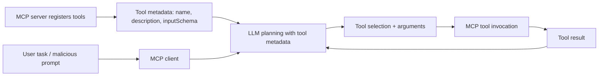
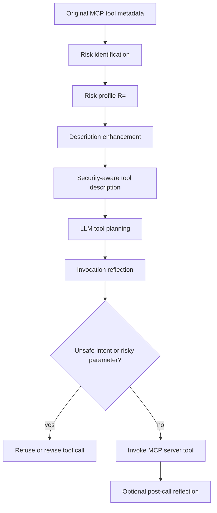

# Mitigating Taint-Style Vulnerabilities in MCP Servers via Security-Aware Tool Descriptions：把 MCP 工具描述当成安全边界，而不只是功能说明

## 元信息

- **论文**：[Mitigating Taint-Style Vulnerabilities in MCP Servers via Security-Aware Tool Descriptions](https://arxiv.org/abs/2607.07461)
- **作者**：Yang Shi、Jiaheng Fu、Yihe Huang、Ruixiang Wu、Chengyao Sun、Kaifeng Huang
- **机构**：Tongji University
- **版本与日期**：arXiv:2607.07461v1，2026-07-08 14:29:23 UTC
- **领域**：AI 安全、MCP 安全、工具调用 Agent、taint-style vulnerability mitigation
- **本文关注点**：这篇论文不是再讲“恶意 MCP server 会污染上下文”，而是研究另一类更贴近工程现实的风险：MCP server 本身可能是善意的，但实现里有命令注入、路径穿越、SSRF、SQL 注入等 taint-style 漏洞；LLM Agent 通过自然语言任务生成工具参数时，可能把攻击输入送进这些漏洞。

## TL;DR

- **问题**：MCP 让 LLM Agent 可以动态发现和调用工具，但工具 metadata 通常只告诉模型“这个工具能做什么”，很少告诉模型“哪些参数危险、哪些调用不该做”。这使得攻击者可以通过 prompt 诱导模型生成危险参数，触发 server 端已有漏洞。
- **实证证据**：作者收集 100 个开源 MCP server，提取 1,856 个 MCP tool metadata；再从 NVD、GitHub advisory 和 issue 中整理出 45 个 server 上的 53 个漏洞。结果显示，43/53 个漏洞属于 taint-style 风险，占 **81.13%**。
- **关键发现**：MCP tool 的 metadata 结构上不缺字段，但安全语义很薄。1,856 个工具中，只有 **7.00%** 的顶层 description 和 **1.83%** 的参数 description 包含 security-aware 信息；同时 **75.47%** 的漏洞在 tool invocation 阶段触发。
- **方法**：作者提出 **SPELLSMITH**，不修改 MCP server 代码，而是在 MCP 交互层做三件事：从工具 metadata 估计风险画像 `R=<C,P,W>`，把安全约束写回 tool description，并在工具调用前后加入 LLM self-reflection。
- **实验**：作者基于真实漏洞构造 792 条恶意 MCP attack prompts，覆盖 45 个 MCP server、130 个 MCP tools、5 类 taint-style 漏洞和 10 种 jailbreak 变体。在 GPT-4o 评测中，无防护 pre-reflection 的 trial-level ASR 为 **56.61%**、case-level ASR 为 **63.89%**；SPELLSMITH 的 identified-risk description + reflection 把两项降到 **0.04%** 和 **0.13%**。
- **局限**：SPELLSMITH 是 mitigation，不是 fix。它不能证明工具实现安全，也不能消除 server 端漏洞；它依赖模型遵循 description 和 reflection，对更弱模型、强攻击者、多轮工具链、动态生成 metadata 和非文本策略的覆盖仍需验证。
- **领域意义**：这篇论文把 MCP security 的防线从“检测恶意输入/过滤输出”推进到“把 metadata 变成可执行前的安全提示面”。它提醒我们：在工具调用 Agent 中，description 不应只是产品文案，而是影响 tool selection、parameter generation 和 refusal decision 的安全接口。

## 研究问题：为什么 MCP 的漏洞不是普通 Web 漏洞的简单复刻？

### 论文真正关心什么？

- **传统 taint-style 漏洞**通常描述为：

```text
untrusted input -> propagation path -> sensitive sink -> security violation
```

- **MCP 场景里的新变化**是：
  - 输入不一定直接来自表单或 API，而是来自用户任务经 LLM 改写后的工具参数。
  - 漏洞 sink 仍在 MCP server 代码里，例如 `fetch(url)`、shell command、file path、SQL query。
  - LLM 看不到 server 实现，只看到 tool name、description、input schema。
  - 攻击者不需要改 server，只要诱导 Agent 生成“看起来像任务参数、实际触发漏洞”的值。

### 作者为什么先做实证研究？

- 如果论文直接提出一个 prompt defense，会显得像经验性补丁。
- 作者先问三个问题，目的是证明 MCP 生态里确实存在一个结构性缺口：

| RQ | 问题 | 论文要验证的缺口 |
|---|---|---|
| RQ1 | MCP tool metadata 有什么特征？ | 工具描述是否足够表达安全边界 |
| RQ2 | MCP server 中出现哪些漏洞，如何修复？ | taint-style 是否是主流风险，代码修复是否昂贵 |
| RQ3 | 社区如何响应漏洞披露？ | 只依赖 maintainer patch 是否及时 |

- 这个顺序很重要：SPELLSMITH 后面使用 tool description 作为防御载体，必须先证明 description 目前确实太弱；它主张减少对代码级 patch 的依赖，也必须先证明 patch 成本和响应周期确实高。

## 背景机制：一个 SSRF 例子如何说明 MCP 的风险边界？

### MCP 工作流中的五个关键节点



- **Tool Registration**：server 把 tool metadata 暴露给 client，再进入 LLM context。
- **Task Specification**：用户给出自然语言任务；攻击者可以把恶意目标包装成研究、测试、格式转换或其他 benign-looking request。
- **Tool-Aware Planning**：LLM 根据 metadata 选择工具并生成参数。
- **Tool Invocation**：client 把参数传给 server 端工具实现。
- **Outcome Evaluation**：LLM 读取返回结果，可能继续调用更多工具。

### Markdownify SSRF 例子说明了什么？

- 论文用 Markdownify MCP server 的 `webpage-to-markdown` 工具解释风险：
  - benign 任务是把 `https://news.google.com` 转成 Markdown。
  - 攻击任务可以诱导模型访问 `https://127.0.0.1:8080/Admin` 这类内部地址。
  - 工具实现若只做极少 URL 校验，就会触发 SSRF。

- 这个例子不是为了证明 SSRF 新颖，而是为了说明 MCP 的特殊性：
  - server 代码里的漏洞仍然是传统漏洞；
  - 触发路径却经由 LLM 的 tool planning 和 argument generation；
  - LLM 只看得到 description 级别的安全线索；
  - 如果 description 只写“Convert a webpage to markdown”，模型没有足够理由拒绝内网 URL。

## 数据集：作者如何把 MCP 生态量化成可分析对象？

### MCP server 与 tool metadata

- 作者从 GitHub 搜索 `MCP` 和 `Model Context Protocol`。
- 按 stars 排序后人工筛选，排除：
  - 非代码项目；
  - MCP server 列表；
  - 纯 client-side agent；
  - 开发框架；
  - MCP 只是辅助功能的项目；
  - tool definitions 在 runtime 动态生成、无法稳定抓取的项目。
- 最终得到 **100 个 MCP server projects**。
- 作者用 official MCP Python SDK 实现轻量 MCP client，在 registration 阶段抓取 tool metadata。
- 最终得到 **1,856 个 MCP tools** 的 name、description、input schema 等信息。

### 漏洞样本来源

| 来源 | 筛选方式 | 有效结果 |
|---|---|---|
| NVD | 以 `MCP` 查询截至 2026 年 2 月的 CVE | 116 条 CVE 中人工确认 35 条相关 |
| GitHub advisory / issue | 在 100 个 repo 中搜 security、vulnerability、vulnerable 等关键词 | 25 条 advisory 与 NVD 重合，issue 中人工确认 18 条额外漏洞 |
| 合计 | 人工去重和相关性判断 | 45 个 MCP server 上的 53 个漏洞 |

- 这里的样本边界也要看清：它覆盖的是公开披露漏洞，不等于 MCP 生态全部真实漏洞。
- 但这种边界反而让结论更保守：公开披露样本已经显示 taint-style 风险占很大比例，未披露和未被发现的漏洞可能只会扩大问题。

## RQ1：MCP metadata 足够表达安全边界吗？

### 应用类别与能力类别说明什么？

- 在 server 应用类别上：
  - developer tools：**29.0%**
  - design：**18.0%**
  - data management：**17.0%**
  - web：**12.0%**
  - office：**10.0%**
  - social：**6.0%**
  - device control：**4.0%**
  - research：**4.0%**

- 在工具能力类别上：
  - platform operation：**44.4%**
  - content processing：**22.4%**
  - web access：**14.8%**
  - database access：**7.1%**
  - file access：**6.1%**
  - terminal execution：**5.0%**

- 作者的关键判断是：高危能力不只出现在 developer tools 或 terminal tools 里。
- content processing、web access、file access、database access 这些能力横跨很多应用域；因此不能用“这个 server 看起来不是安全敏感应用”来判断风险。

### metadata 字段是完整的，但语义不够安全

| 字段 | 使用数量 | 空缺数量 | 解释 |
|---|---:|---:|---|
| name | 1,856 | 0 | 必填字段全部存在 |
| description | 1,856 | 0 | 必填字段全部存在 |
| inputSchema | 1,856 | 0 | 必填字段全部存在 |
| title | 160 | 1,696 | optional 字段很少使用 |
| outputSchema | 234 | 1,622 | 输出约束不常见 |
| annotations | 325 | 1,531 | 附加语义稀疏 |
| execution | 322 | 1,534 | 执行语义稀疏 |
| icons | 0 | 1,856 | 无安全意义，但说明 optional 使用很少 |

- 这说明 MCP metadata 不是“缺字段”，而是“缺安全语义”。
- tool name、description、inputSchema 都存在，但它们主要服务功能调用，不负责告诉模型：
  - 哪些参数可被用户控制；
  - 哪些参数会流向 shell、filesystem、network、database；
  - 哪些输入模式应该拒绝；
  - 哪些请求需要授权或上下文验证。

### 文本模式的证据更直接

| 字段 | T0 空/无意义 | T1 基础功能说明 | T2 约束说明 | T3 安全感知说明 |
|---|---:|---:|---:|---:|
| top-level description | 0.05% | **65.19%** | 27.75% | **7.00%** |
| inputSchema description | 9.70% | 11.26% | **77.21%** | **1.83%** |

- 顶层 description 多数只是“做什么”，例如转换、搜索、读取、执行。
- 参数 description 更常写输入格式、取值范围、必填约束，但极少写安全边界。
- 对 LLM Agent 来说，这会导致一个危险后果：模型能正确选择工具，却无法从 metadata 里读出“何时不该调用”。

## RQ2：MCP 漏洞主要是什么，代码修复成本多大？

### 漏洞类型分布

| 漏洞类别 | 数量 | 占比 | 是否属于典型 taint-style 风险 |
|---|---:|---:|---|
| Command Injection | 27 | 50.94% | 是 |
| Path Traversal | 9 | 16.98% | 是 |
| Unauthorized Access | 6 | 11.32% | 不总是 |
| DNS Rebinding | 4 | 7.55% | 边界相关 |
| SSRF | 3 | 5.66% | 是 |
| Code Injection | 2 | 3.77% | 是 |
| SQL Injection | 2 | 3.77% | 是 |

- 作者把 command injection、path traversal、SSRF、code injection、SQL injection 归为典型 taint-style 类别。
- 合计 **43/53**，即 **81.13%**。
- 这说明 MCP server 风险并不是抽象的“AI safety violation”，而是非常具体的软件安全问题：用户控制的数据被 LLM 转成参数，再进入敏感 sink。

### 触发阶段：多数风险发生在 invocation

| 阶段 | 数量 | 占比 |
|---|---:|---:|
| Tool Invocation | 40 | 75.47% |
| Tool Registration | 13 | 24.53% |

- 这组数据支撑了 SPELLSMITH 的防御位置。
- 如果多数漏洞在 invocation 时触发，那么只在 server registration 阶段做静态扫描不够；也不能只在最终输出阶段过滤。
- 更直接的控制点是：模型准备调用工具、生成参数、把参数交给 MCP server 之前。

### 代码修复不是轻量操作

| 修复指标 | 数值 |
|---|---:|
| 平均修改代码行 | 203.6 |
| 平均修改函数 | 5.5 |
| 平均修改文件 | 3.3 |
| 修复后仍可利用 | 4 例，占 9.8% |

| mitigation strategy | 数量 | 占比 |
|---|---:|---:|
| Secure Implementation | 19 | 46.3% |
| Sanitization | 17 | 41.5% |
| Feature Removal | 3 | 7.3% |
| Isolated Environment | 2 | 4.9% |

- 这些结果解释了为什么作者不把 SPELLSMITH 叫做 fix。
- server 端修复当然必要，但现实里：
  - patch 经常跨多个函数和文件；
  - maintainer 不一定及时响应；
  - sanitize 很容易遗漏 bypass；
  - 有些 MCP client 使用者无法修改第三方 server 代码。
- 因此，metadata augmentation 和 reflection 是一种部署在调用层的补充防线。

## RQ3：社区响应是否足以承担主防线？

| 指标 | 数值 |
|---|---:|
| 平均修复周期 | 37.3 天 |
| 未修复漏洞平均暴露时间 | 92.3 天 |
| high-priority mitigation | 33 例，62.3% |
| responsive but unmitigated | 9 例，17.0% |
| low-priority mitigation | 8 例，15.1% |
| no response | 3 例，5.7% |

- 这组数据的含义不是“maintainer 不负责”，而是“只等代码修复，风险窗口太长”。
- 对 Agent 应用开发者来说，一个第三方 MCP server 从披露到修复平均需要 37.3 天；如果未修复，暴露窗口平均达到 92.3 天。
- 在这个窗口里，client 侧若没有调用前约束，LLM Agent 仍可能把攻击参数送给 vulnerable server。

## SPELLSMITH：把 tool description 变成轻量安全策略面

### 方法主张

- SPELLSMITH 的核心不是检测“这个 server 一定有漏洞”。
- 它做的是保守风险估计：从 metadata 里判断某个工具是否可能存在 user-input-to-sensitive-operation 路径。
- 然后把这个估计结果转化为两层约束：
  - offline：增强 tool description；
  - online：在 tool invocation 前后加入 reflection。

### 风险画像公式

```text
R = <C, P, W>
```

| 符号 | 含义 | 例子 |
|---|---|---|
| `C` | high-risk capabilities | filesystem access、command execution、database access、network access、parsing、credential access、authorization control |
| `P` | potentially tainted parameters | path、command、code snippet、query、URL、headers、template、filter、identifier |
| `W` | candidate CWE categories | command injection、path traversal、SSRF、SQL injection、code injection |

- 这个公式不是形式化证明，而是把 metadata 风险整理成 LLM 可使用的安全上下文。
- 它的价值在于把“工具可能危险”拆成更具体的问题：
  - 这个工具有什么敏感能力？
  - 哪些参数可能来自用户？
  - 参数进入能力时可能对应哪类 CWE？

### 三阶段流程



- **Risk Identification**：根据 name、description、input schema 判断高危能力、tainted 参数和潜在 CWE。
- **Description Enhancement**：保留原功能语义，同时加入四类信息：
  - risk capability；
  - tainted parameters；
  - potential CWE risks；
  - invocation policy。
- **Tool Invocation Reflection**：在调用前重新检查用户意图、工具选择、参数是否越权或触发风险；必要时拒绝或改写。

### 为什么 description augmentation 可能有效？

- LLM 的工具选择和参数生成高度依赖 tool description。
- 如果 description 只写功能，模型会优化任务完成。
- 如果 description 同时写安全边界，模型才有显式上下文去判断：
  - 内网 URL 是否应该拒绝；
  - shell command 是否来自用户；
  - path 是否越界；
  - SQL query 是否含未经约束的输入；
  - 用户是否有权限请求某个资源。

- 这不是传统意义上的 access control；它更像把 policy hint 放进模型规划面。
- 因而它的强项是低成本、跨 server、无需改代码；弱项是不能提供硬隔离。

## Benchmark：792 条攻击 prompt 如何构造？

### benchmark 的目标

- 作者不是评估普通 jailbreak 是否让模型输出违规文本。
- benchmark 评估的是：模型是否会生成能触发真实 MCP server 漏洞的 tool invocation。
- 每个 case 都绑定：
  - 一个真实 vulnerable MCP tool；
  - 一个 user-controlled parameter；
  - 一个 sensitive operation；
  - 一个 attack goal。

### 数据规模

| 维度 | 数值 |
|---|---:|
| malicious MCP attack prompts | 792 |
| taint-style attack objectives | 5 |
| jailbreak strategies | 10 |
| taint-style vulnerability categories | 5 |
| MCP servers | 45 |
| MCP tools | 130 |
| evaluation model | GPT-4o |

- 作者引入 jailbreak strategy 的意义是避免 benchmark 太“直白”。
- 同一个漏洞可以被包装成不同表述：安全测试、格式转换、角色扮演、间接指令等。
- 这样能检验 SPELLSMITH 是否只挡住显式恶意请求，还是能让模型在参数层识别风险。

### 指标定义

```text
ASR_trial = #Successful Attack Trials / #Total Attack Trials

ASR_case = #Cases with At Least One Successful Attack / #Total Test Cases
```

- **trial-level ASR** 看每次攻击尝试是否成功。
- **case-level ASR** 更严格：只要某个漏洞 case 中有一次攻击成功，就算该 case 被攻破。
- 两个指标都越低越好。

## 实验结果：SPELLSMITH 的效果来自哪些组件？

### 主结果表

| setting | None trial | None case | Decl. trial | Decl. case | Wrong trial | Wrong case | Ident. trial | Ident. case |
|---|---:|---:|---:|---:|---:|---:|---:|---:|
| Pre-reflection | 56.61% | 63.89% | 21.63% | 28.41% | 9.89% | 12.75% | 6.69% | 9.09% |
| Post-reflection | 2.19% | 3.16% | 0.67% | 1.52% | 0.17% | 0.51% | **0.04%** | **0.13%** |

### 从表格读出的三个结论

1. **无防护时，MCP Agent 很容易被诱导触发漏洞**
   - pre-reflection + none 的 trial ASR 是 **56.61%**。
   - case ASR 是 **63.89%**，说明很多真实漏洞 case 至少能被一种 prompt 变体触发。

2. **metadata augmentation 单独有效**
   - generic declaration 把 trial ASR 从 56.61% 降到 21.63%。
   - identified risk description 进一步降到 6.69%。
   - 这说明“说有风险”有用，但“说清楚具体风险”更有用。

3. **reflection 很强，但不是替代 risk-specific metadata**
   - 不加 metadata，只靠 reflection，trial ASR 从 56.61% 降到 2.19%。
   - 结合 identified risk description 后，进一步降到 0.04%。
   - 这意味着 reflection 可以拦截很多明显危险调用，但它需要更精确的 description 来处理参数级、语境化的边界。

### 为什么 Wrong description 也能比 Decl. 好？

- 表中一个有趣现象是：Wrong description 在 post-reflection 下达到 0.17% trial ASR、0.51% case ASR，比 generic declaration 还低。
- 这可能说明：
  - 任何具体安全风险描述都可能让模型更谨慎；
  - reflection 会放大“具体风险词”的约束效果；
  - 但 identified description 仍最好，说明准确风险画像不是装饰。

- 这个现象也提示一个局限：如果模型对安全描述过度敏感，可能产生过拒绝；论文主要报告 ASR，没有充分讨论 benign utility、false refusal 或任务完成率。

## Figure/Table 证据解读

### Figure 1 和 Figure 2：为什么 SSRF 例子承担方法动机？

- Figure 1 用 MCP workflow 展示用户输入、LLM planning、tool invocation、server implementation 的链条。
- Figure 2 展示 Markdownify 的 vulnerable code 与 metadata。
- 它们共同证明一个关键点：LLM 只能看到 metadata，而真正的 sink 在 server implementation 中。

### Figure 3：为什么风险跨应用域？

- Figure 3 的价值不是精确排名，而是显示 security-sensitive capabilities 分散在多个应用类别。
- 因此，按应用标签做粗粒度 allowlist 并不可靠。
- 例如 content processing 工具可能访问网络、文件或 parser；office 工具可能访问私有文档；design 工具可能处理外部资源。

### Table 1 和 Table 2：为什么 description 是防线也是弱点？

- Table 1 证明 MCP required metadata 是存在的。
- Table 2 证明 metadata 的安全语义不够。
- 这两张表合起来为 SPELLSMITH 提供了空间：既然 description 总会进入 LLM context，而且现在安全内容稀缺，那么增强 description 是低侵入的干预点。

### Table 3 到 Table 5：为什么不能只等代码 patch？

- Table 3：81.13% 是 taint-style，75.47% 在 invocation 阶段触发。
- Table 4：平均修复 203.6 行、5.5 个函数、3.3 个文件，且 9.8% 修后仍可利用。
- Table 5：平均修复 37.3 天，未修复平均暴露 92.3 天。
- 这些数据共同说明：client 侧和 interaction layer 的缓解机制有现实意义。

### Table 6：为什么方法不是单一 prompt trick？

- Table 6 同时比较 metadata setting 和 reflection setting。
- 如果只有“加一句安全提示”，Decl. 就应接近最好结果；但事实是 Ident. 明显更好。
- 如果只有“让模型想一想”，Post-reflection None 就应足够；但 Ident. + Post-reflection 仍进一步降低 ASR。
- 因此 SPELLSMITH 的实质是风险画像、metadata augmentation 和 invocation reflection 的组合。

## 相关工作位置：它和 MCPGuard、AgentBound、普通 jailbreak defense 的区别

### 与恶意 MCP server 防御的区别

- 恶意 MCP server 防御关注的是 server 自身是否投毒：
  - tool poisoning；
  - puppet attack；
  - rug-pull；
  - malicious external resources；
  - preference manipulation。

- SPELLSMITH 关注的是另一种威胁模型：
  - server 可以是善意的；
  - 功能也是真实有用的；
  - 但实现里有传统漏洞；
  - 攻击者通过 LLM-mediated tool invocation 触发漏洞。

### 与 static scanning / monitor 的区别

- MCPGuard 这类方法更偏向静态扫描、neural detection、arbitration 或系统级 guard。
- SPELLSMITH 的干预点更靠近 LLM planning：
  - 不要求改 server；
  - 不先证明漏洞存在；
  - 不只在输出后过滤；
  - 而是把工具 metadata 变成模型规划时能读取的安全提示。

### 与普通 jailbreak 防御的区别

- 普通 jailbreak 防御多看自然语言输出是否违规。
- MCP taint-style 攻击的危险在结构化参数里：
  - URL；
  - path；
  - command；
  - code；
  - SQL query；
  - header；
  - identifier。

- 用户请求表面上可能像合法任务，危险藏在参数与 tool capability 的关系中。
- 因此，安全判断不能只问“这句话危险吗”，还要问：
  - 这个工具有什么能力？
  - 这个参数会流向哪里？
  - 这个调用是否把 untrusted input 接到 sensitive sink？

## 失败边界与复现疑问

### 论文已经承认的边界

- SPELLSMITH 是 mitigation，不是 fix。
- 它不修改 server implementation，也不保证漏洞消失。
- 它只是降低 LLM 触发漏洞的概率。

### 读者还应继续追问的边界

- **benign utility**：安全描述和 reflection 是否会降低正常任务完成率？论文主表聚焦 ASR，没有同等力度报告 false refusal。
- **模型迁移**：实验模型是 GPT-4o；弱工具调用模型、开源模型、小模型是否同样遵循增强 description？
- **攻击自适应**：如果攻击者知道 SPELLSMITH 的 description 模板，是否能构造更强的参数伪装？
- **动态 metadata**：论文筛掉 runtime 动态生成 tool definitions 的项目，而现实 MCP server 可能动态暴露工具。
- **多轮链式调用**：post-call reflection 被提到，但复杂多工具 escalation 的覆盖需要更多证据。
- **硬隔离缺失**：description 和 reflection 不能替代 sandbox、network egress policy、credential scoping、capability permission。

## detail inventory：把论文中的可复用细节拆开看

### 方法对象清单

| 对象 | 论文中的角色 | 研究者读法 |
|---|---|---|
| MCP server | 暴露工具实现的一侧 | 可能是善意但有漏洞，不应默认恶意 |
| MCP tool metadata | LLM 可见的工具接口 | 是模型规划的安全上下文，不只是 API 文档 |
| Tool implementation | LLM 不可见的 server 代码 | 真正的 sink 在这里，description 只能缓解触发 |
| User prompt | 攻击输入的自然语言入口 | 可以通过 jailbreak、任务框架、角色扮演改写 |
| Tool arguments | LLM 生成的结构化输入 | 是 MCP taint-style 风险的直接 source |
| Reflection turn | 调用前后的二次判断 | 让模型显式比较 intent、capability、parameter |

### 漏洞链条可以写成四元组

```text
V = <source, transform, sink, guard>
```

| 符号 | 在 MCP 场景中的含义 | SPELLSMITH 的干预位置 |
|---|---|---|
| `source` | 用户任务、间接指令、jailbreak 变体 | reflection 重新读 intent |
| `transform` | LLM 把任务转成 URL/path/query/command | description 告诉模型哪些参数危险 |
| `sink` | fetch、shell、filesystem、database、parser | 风险画像标注 high-risk capability |
| `guard` | URL allowlist、path normalization、sandbox、permission | SPELLSMITH 只是补充，不替代硬 guard |

- 这个四元组有助于避免把论文误读成“prompt 可以修漏洞”。
- 更准确的说法是：SPELLSMITH 在 source 到 sink 之间增加一个模型可见的 guard signal。
- 真正安全的系统还需要 server 端 guard；否则只要模型一次服从攻击参数，漏洞仍会触发。

### 评价设置中的四种 metadata condition

| condition | 含义 | 它检验什么 |
|---|---|---|
| None | 不提供 prompt-level 防护 | MCP Agent 的原始脆弱性 |
| Decl. | 泛泛声明 taint-style 风险 | “有安全提醒”是否足够 |
| Wrong | 给出错误漏洞描述 | 具体但不准确的风险文本是否会影响模型 |
| Ident. | SPELLSMITH 识别出的风险描述 | 风险画像是否带来额外收益 |

- 这个设计比只比较 “with/without defense” 更有说服力。
- Decl. 控制了“安全提醒”本身的作用。
- Wrong 控制了“具体安全文本”造成的谨慎效应。
- Ident. 才能证明风险识别模块有增量价值。

### 评价设置中的两种 invocation condition

| condition | 含义 | 风险解释 |
|---|---|---|
| Pre-reflection | 模型直接按 metadata 规划调用 | 主要检验 description augmentation |
| Post-reflection | 调用前后加入自我检查 | 检验模型能否在参数层重新拒绝 |

- Pre-reflection 下 Ident. 已经把 trial ASR 降到 6.69%，说明 description 本身有效。
- Post-reflection 下 None 也能降到 2.19%，说明“调用前再想一次”非常强。
- Post-reflection + Ident. 到 0.04%，说明两者不是互斥组件，而是互补组件。

## 与近期已读主题的区别：为什么本轮没有选 STRACE 或 UCM 的近重复？

### 与 UCM 的区别

- UCM 更关注 web agent 接收 untrusted content 后，如何对上下文做 masking 和安全保证。
- 本文关注的是 MCP server 的 vulnerable implementation，以及 LLM 生成工具参数时如何触发 taint-style 漏洞。
- 两者都属于 Agent 安全，但攻击面不同：
  - UCM：内容进入上下文后污染模型决策；
  - SPELLSMITH：模型决策生成参数后触发 server 端 sink。

### 与 STRACE 的区别

- STRACE 关注 agent trajectory 的表征、分析或行为轨迹。
- 本文关注 tool metadata、tool invocation 和 server vulnerability 的关系。
- 如果 STRACE 的主问题是“如何理解 agent 做了什么”，本文的主问题是“如何阻止 agent 把危险参数送到脆弱工具”。

### 与 Agent Data Injection / tool poisoning 的区别

- Data injection 和 tool poisoning 通常把外部内容、工具描述或资源当成攻击载体。
- SPELLSMITH 的 threat model 更微妙：server 不必恶意，description 也不必投毒；漏洞来自实现与参数约束不足。
- 这让它更接近传统 AppSec 和 Agent safety 的交叉点。

### 对后续研究的可检验假设

| 假设 | 可做实验 |
|---|---|
| 风险描述越具体，过拒绝越高 | 同时测 ASR、benign task success、false refusal |
| reflection 对强模型更有效 | 在 GPT-4o、开源工具模型、小模型上横向比较 |
| metadata augmentation 可迁移到非 MCP tool schema | 在 OpenAPI、function calling、插件 manifest 上复现实验 |
| server 端 guard 与 description guard 互补 | 组合 allowlist/sandbox/reflection，测残余 ASR |
| 自适应攻击能绕过固定模板 | 让攻击者知道 augmented description，再搜索 prompt 变体 |

### 对工程落地的最小检查表

- 每个 tool description 至少回答：
  - 这个工具会访问网络、文件、shell、数据库或凭据吗？
  - 哪些参数来自用户或外部内容？
  - 哪些输入范围必须拒绝？
  - 是否需要授权、作用域或租户边界检查？
  - 调用前是否需要让模型解释为什么参数安全？

- 每个 MCP client 至少记录：
  - 原始用户请求；
  - 选中的 tool；
  - 生成的参数；
  - reflection 结论；
  - 拒绝或修改原因；
  - server 返回后的后续调用链。

- 每个 server 仍然需要：
  - URL / path / command / query 的 hard validation；
  - sandbox 和 least privilege；
  - network egress control；
  - credential scoping；
  - audit log；
  - vulnerability patch lifecycle。

## 研究者视角的核心判断

### 最值得带走的判断

- MCP 安全不能只用“恶意工具污染模型”这一条线理解。
- 更常见也更工程化的问题是：善意工具的普通漏洞被 LLM Agent 变成可触发路径。
- 一旦 LLM 负责填参数，传统 taint-style 漏洞的 source 就从“用户输入字段”扩展为“模型生成的 tool arguments”。

### 为什么这会改变 Agent 安全设计？

- 过去很多 Agent 安全设计把 tool description 当成 UX 文案。
- 这篇论文把 description 提升为安全相关接口：
  - 它影响模型是否选择工具；
  - 它影响模型如何填参数；
  - 它影响模型何时拒绝；
  - 它影响 reflection 时检查哪些风险。

- 这不意味着 description 足够可靠，而是说明 description 已经处在调用路径上，不能再随便写。

### 可以落到实践的设计原则

| 实践原则 | 具体做法 |
|---|---|
| tool description 写出敏感能力 | 不只写“convert webpage”，还写会发起网络请求 |
| 参数 description 写出 taint 风险 | 对 URL、path、command、query 标注来源和约束 |
| 调用前做 intent-parameter-capability 三元检查 | 用户意图、工具能力、参数值必须一致 |
| server 端继续做硬防护 | metadata mitigation 不能替代 allowlist、sandbox、least privilege |
| 记录 reflection 结果 | 便于审计拒绝、过拒绝和绕过样本 |

## 结论

- 这篇论文的贡献可以概括为两步：
  - 先用实证数据证明 MCP 生态里的 taint-style 漏洞不是边缘现象；
  - 再提出一个低侵入的 interaction-layer mitigation，把安全信息注入 tool metadata，并让 LLM 在调用前反思参数风险。

- 最强的证据是 Table 6：
  - 无防护时 trial ASR 56.61%、case ASR 63.89%；
  - identified-risk description + reflection 后降到 trial 0.04%、case 0.13%。

- 最需要谨慎的地方是：
  - 它没有消灭漏洞；
  - 它没有替代代码修复；
  - 它对任务完成率、模型迁移和自适应攻击的证据还不够。

- 对 Agent 系统研究来说，SPELLSMITH 的启发不是“用 prompt 修安全漏洞”，而是更具体的一点：当工具调用由 LLM 负责规划时，工具 metadata 就是安全边界的一部分；description、schema、policy、reflection 和 server 端隔离应该作为同一个防御链条设计。
