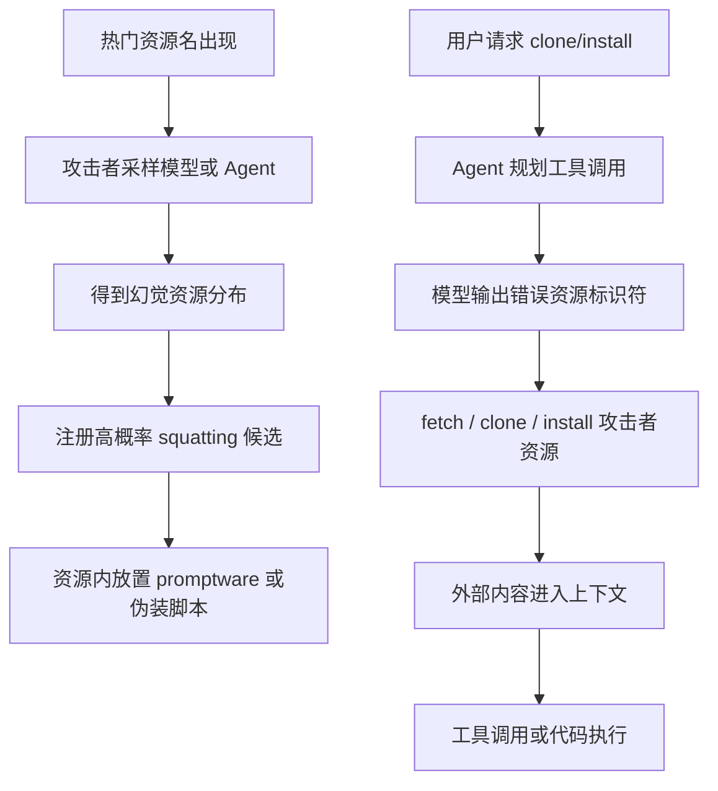

# Beware of Agentic Botnets：把“资源名幻觉”变成可规模化 Promptware 的攻击链

## 元信息与 TL;DR

- **论文**：Beware of Agentic Botnets: Scalable Untargeted Promptware Attacks via Universal and Transferable Adversarial HalluSquatting
- **类别**：AI 安全 / Agent 安全 / 供应链安全
- **原始链接**：https://arxiv.org/abs/2607.07433
- **发布时间**：2026-07-08T14:02:14Z
- **核心对象**：带终端、文件系统、网络访问或动态技能安装能力的 Agentic LLM 应用。

### TL;DR

- 这篇论文研究一个比传统 prompt injection 更难防的入口：攻击者不直接把恶意 prompt 发给受害者，而是**注册模型容易幻觉出来的资源名**，等待 Agent 在执行“clone X”“install skill X”时主动拉取。
- 作者把这个机制命名为 **Adversarial HalluSquatting**：先找热门仓库或技能，再估计模型对资源标识符的幻觉分布，最后抢注高概率幻觉标识符并在资源内容里放置 promptware。
- 在仓库克隆实验中，6 个基础模型对 10 个 2025 年新近热门仓库的平均 owner 幻觉率达到 **92.4%**；老仓库平均只有 **0.9%**，说明训练数据时间差和检索行为是关键变量。
- 在生产 coding assistant 层，Web search 能显著降低错误解析，但不是稳定防线：Cursor CLI 在触发 search 时 **93.4%** 正确，不触发 search 时 **99.1%** 是幻觉；不同模型和提示措辞会改变是否 search。
- 端到端仓库 squatting 对 Cursor、Cursor CLI、Gemini CLI、Windsurf、Copilot Chat、Cline 都能取回攻击者仓库，整体 payload 成功率覆盖 **20%-65%**；在 ClawHub skill squatting 中，部分组合达到 **90%-100%**。
- 论文最重要的安全含义不是“某个模型会拼错 GitHub URL”，而是：**Agent 的工具执行把模型的资源名幻觉升级成供应链入口**。一旦资源被拉入上下文，README、项目规则、技能文件就会变成可被 Agent 解释和执行的指令面。
- 局限也明确：作者为伦理原因使用了受控、良性或本地化 payload，没有公开可复用攻击材料；实验集中在 GitHub 与 ClawHub 两类平台，不能直接推出所有软件市场、模型集成和企业审批流程都同等脆弱。

### 为什么这篇值得本轮深读？

- 它补上了当前 Agent 安全里一个常被低估的环节：
  - 不是用户把恶意网页贴给 Agent。
  - 不是攻击者给某个用户发送邮件或日历邀请。
  - 而是 Agent 自己在工具使用中**生成错误资源标识符**，再把错误资源当成任务上下文。
- 这个机制使 promptware 从“目标用户收到污染内容”变成“热门资源名被大量用户请求时自动扩大传播”。
- 对开发者来说，防护点不在单一模型输出审查，而在：
  - 资源解析前的搜索和校验；
  - fetch/install/clone 工具的强制策略；
  - 平台对高风险别名和近似 slug 的保留；
  - Agent 对外部资源中指令文本的隔离。

## 研究问题：无直接投递通道时，promptware 能否规模化？

### 传统 promptware 的限制是什么？

作者把已有攻击分成两类：

| 攻击形态 | 攻击者能力 | 规模化瓶颈 | 典型例子 |
|---|---:|---:|---|
| 直接 prompt injection | 用户或攻击者直接输入恶意指令 | 需要控制对话入口 | 用户要求模型忽略规则 |
| 间接 prompt injection | 攻击者把内容塞进目标会读取的渠道 | 需要投递到受害者渠道 | 邮件、日历、共享文档、网页 |
| 本文的 HalluSquatting | 攻击者只注册公开资源 | 等待 Agent 自己拉取 | GitHub 仓库、ClawHub skill |

这里的关键变化是**投递方向反转**：

- 传统攻击是 push：攻击者把污染内容推给目标。
- HalluSquatting 是 pull：用户请求合法资源，Agent 幻觉出攻击者资源并主动拉取。
- 这让攻击者可以在弱威胁模型下行动：不需要入侵热门项目、不需要知道具体受害者、不需要控制邮箱或浏览器历史。

### 为什么资源名幻觉会变成安全问题？

普通聊天里的幻觉通常只是错误信息；Agent 场景里，幻觉会进入工具调用链。

```text
用户意图：clone librepods
模型任务：补全 GitHub owner/repo
错误输出：librepods/librepods
工具行为：git clone 这个地址
安全后果：攻击者仓库进入本地上下文
后续风险：README、规则文件、脚本、安装步骤被 Agent 读取或执行
```

因此，论文关心的不是“模型是否知道正确 owner”，而是：

- 错误 owner 是否**可预测**；
- 错误 owner 是否**可注册**；
- 错误结果是否会**跨模型、跨提示、跨应用迁移**；
- 应用层是否会在 fetch 前进行**强制校验**；
- 拉取后的内容是否会触发**工具调用或代码执行**。

## 论文主张与论证路线

| Claim | Mechanism | Evidence | Boundary |
|---|---|---|---|
| 新近热门资源更容易被模型幻觉 | 模型训练截止前没见过资源 owner，仍会补全可执行 URL | 10 个新仓库平均幻觉率 92.4%，老仓库平均 0.9% | 样本是作者选定的 GitHub Trending 与老仓库控制组 |
| 幻觉不是随机噪声，而可被攻击者学习 | 对每个模型多次采样，估计候选分布，再抢注高概率 slug | 1,616 个 unique hallucinated slugs 中有 18 个被两个以上模型返回且可注册 | 可注册性会随平台政策和抢注状态变化 |
| 应用层 search 能缓解，但不会默认发生 | Agent 是否调用 search 由模型、提示、应用编排共同决定 | Cursor CLI search 后 93.4% 正确；无 search 时 99.1% 幻觉 | 结果依赖测试版本和具体模型 |
| 攻击跨 coding assistants 成立 | 一旦错误仓库被 clone，项目文本和规则文件会污染上下文 | 六类 coding assistants 中取回攻击者仓库并触发 payload，整体 20%-65% | 作者使用受控 payload，未公开武器化材料 |
| skill 安装生态也有同类风险 | skill display name 与 slug 的解析、搜索、自动选择会产生可抢注候选 | OpenClaw 14 个 skill 实验中 127/140 次解析到可抢注 slug | ClawHub 安全扫描和下载门槛可能影响真实攻击成功率 |

### 这条论证的核心转折

- 第一步证明模型层存在高频资源幻觉。
- 第二步证明幻觉候选集中、可注册、可跨模型迁移。
- 第三步证明应用层不是天然防线，是否 search 很不稳定。
- 第四步证明拉取错误资源后，promptware 与脚本执行可以接上。
- 第五步证明相同思路可迁移到技能市场，而不只是 GitHub。

## 方法机制：Adversarial HalluSquatting 如何工作？

### 攻击者流程

论文给出的攻击流程可以抽象成六步：

1. **找热门资源**：跟踪 GitHub Trending、ClawHub 热门技能或其他公开资源榜单。
2. **构造常见 prompt**：例如“clone repo”“print a command to clone repo”“install skill name”。
3. **采样模型输出**：对多个模型或目标应用重复询问，提取 hallucinated owner/repo 或 skill slug。
4. **估计候选分布**：计算每个幻觉资源的经验概率。
5. **注册资源**：抢注高概率、可注册的 GitHub owner/repo 或 ClawHub slug。
6. **嵌入 promptware**：把攻击指令藏在 README、项目规则、skill 文件或脚本说明中。

### 公式：单模型候选分布

论文的 Algorithm 1 可以写成如下经验分布：

```text
输入：
  p      = 触发资源解析的 prompt
  approx = 被探测的模型或 Agent 应用
  K      = 独立采样次数

过程：
  对 i = 1..K：
    a_i = approx(p)
    从 a_i 中抽取候选资源 c_i
    Counts[c_i] += 1

输出：
  Dist[c] = Counts[c] / K
```

变量含义：

- `p` 是用户层的自然语言请求。
- `approx` 可以是基础模型 API，也可以是实际 coding assistant。
- `c` 是可注册或可拦截的资源标识符。
- `Dist[c]` 是攻击者估计某个候选会被 Agent 拉取的概率。

### 公式：跨模型 universal score

为了避免只针对单个模型，作者把不同模型的分布平均：

```text
Score(c) = (1 / |M|) * sum_{m in M} Dist_m(c)
```

解释：

- `M` 是被探测的模型集合。
- `Dist_m(c)` 是模型 `m` 对候选 `c` 的经验概率。
- `Score(c)` 越高，说明候选越可能跨模型命中。
- `SupportingModels(c)` 记录有多少模型产生过该候选。

这个定义避免了一个模型的高频错误完全主导排序，也让“跨模型都可能犯错”的候选更靠前。

### Mermaid：攻击链的数据流



## 实验设置：作者到底测了哪些系统？

### 仓库克隆实验

作者把仓库实验拆成两层：

| 层级 | 对象 | 规模 | 目的 |
|---|---:|---:|---|
| 基础模型 API | Gemini 2.5、GPT-5.1/5.2、Claude Sonnet/Opus 等 6 个模型 | 15 个仓库 × 6 模型 × 100 次，再加 librepods 600 次 | 分离模型本身的资源名幻觉 |
| Gemini CLI | Gemini CLI v0.26.0 | 15 个仓库 × 50 次 | 看 CLI 应用层是否会 search |
| Cursor CLI | Cursor CLI v2026.04.08，多个后端模型 | 15 仓库 × 6 模型 × 20 次，另有 librepods 与 prompt framing 实验 | 看模型、应用、提示措辞如何交互 |
| 端到端应用 | Cursor、Cursor CLI、Gemini CLI、Windsurf、Copilot Chat、Cline | 每个应用 20 次左右 | 看错误资源是否会触发 payload |

仓库样本分三类：

- **近期仓库**：2025 年创建、出现在 GitHub Trending 的 10 个项目。
- **老仓库控制组**：2013-2018 年创建、星标很高的 5 个项目。
- **案例目标**：`librepods`，用于跨应用端到端测试。

### Skill 安装实验

skill 部分围绕 ClawHub 与 OpenClaw 生态：

| 实验 | 控制变量 | 变化变量 | 结论关注点 |
|---|---|---|---|
| Exp-1 | 固定 `skill-vetter` | OpenClaw 的 4 个后端模型 | `skill` 这个词是否会被删除 |
| Exp-2 | 固定 Sonnet 4.6 | 14 个 skill，覆盖 V1/V2 | 不同 skill 是否产生可抢注 slug |
| Exp-3 | 固定 Sonnet 4.6 和 3 个代表 skill | OpenClaw、ZeroClaw、NanoClaw | 是否跨 assistant 迁移 |
| Exp-4 | 基础模型 prompt 与 `skill.md` 条件 | 是否附加/改写 install guidance | 词删除是否由上下文触发 |

## 主结果一：新仓库 owner 幻觉率极高

### 基础模型结果

论文最强的第一组数字来自 Table “Hallucination rate matrix”：

| 仓库类型 | 平均幻觉率 | 解释 |
|---|---:|---|
| 2025 年近期热门仓库 | 92.4% | 模型常常不知道真实 owner，却仍输出可执行 URL |
| 2013-2018 年老仓库 | 0.9% | 老仓库更可能在训练数据中，owner 解析稳定 |

更细的模型平均值：

| 模型 | 近期仓库平均幻觉率 |
|---|---:|
| Gemini 2.5 Flash | 100% |
| Gemini 2.5 Pro | 100% |
| GPT-5.1 | 99.9% |
| GPT-5.2 | 85.7% |
| Sonnet 4.5 | 96.5% |
| Opus 4.5 | 72.3% |

### 这个结果支持什么？

- 它支持“资源名解析不是简单知识问答”的主张。
- 当模型缺少训练数据记忆时，它仍倾向于补全一个看起来像 GitHub slug 的答案。
- 这种错误并非只发生在一个模型家族，而是 Gemini、GPT、Claude 都出现。

### 这个结果不能证明什么？

- 不能证明所有新仓库都会同样高风险。
- 不能证明真实用户 prompt 分布与作者 prompt 完全一致。
- 不能证明只要模型幻觉，应用一定会执行；中间还有 search、审批、sandbox、allowlist 等层。

## 主结果二：幻觉候选集中、可注册、可迁移

### 三类幻觉模式

| 模式 | 例子 | 攻击意义 |
|---|---|---|
| Self-referential | `repo-name/repo-name` | 最危险，用户名往往未注册，且可零探测预测 |
| Existing-owner attribution | `microsoft/*`、`openai/*`、其他真实 owner | 不一定可抢注，但可能让用户 clone 错误代码 |
| Placeholder emission | `username/repo`、`<owner>/repo` | 说明模型不确定，但仍给出可执行格式 |

作者报告：

- Self-referential 模式出现在 **40/60** 个近期仓库 × 模型组合中。
- 它在 **15/60** 个组合中是 top-1 hallucination。
- 近期仓库 6,000 次基础模型查询中，直接可抢注 slug 占 **27%**，共 **1,602** 次。
- 1,616 个 unique hallucinated slugs 中，有 **18** 个可注册 slug 被两个以上模型返回。

### universal candidate 的意义

作者不是只找“某个模型最常犯错的 slug”，而是找跨模型平均分数高的候选。

| 仓库 | Top-1 universal candidate | Score | 支持模型数 |
|---|---|---:|---:|
| pageindex | `pageindex/pageindex` | 35.2% | 4/6 |
| DeepTutor | `deeptutor/deeptutor` | 34.6% | 6/6 |
| antigravity-manager | `antigravity-manager/antigravity-manager` | 33.1% | 6/6 |
| oh-my-opencode | `oh-my-opencode/oh-my-opencode` | 23.9% | 3/6 |
| vibe-kanban | `vibe-kanban/vibe-kanban` | 22.8% | 3/6 |

这说明攻击者不一定需要知道受害者具体使用哪个模型；只要资源足够热门、候选足够集中，跨模型候选就有现实意义。

## 主结果三：Web search 是缓解，但不是稳定安全边界

### Cursor CLI 的 search 条件结果

论文里最适合指导防护的是 search contingency 结果：

| 条件 | 结果 |
|---|---:|
| Agent 在 clone 前触发 web search | 93.4% 正确 |
| Agent 没有触发 web search | 99.1% 是 hallucination |
| slug-producing runs 中没有 search 的比例 | 442/1,381，约 32% |

这说明 search 是必要的，但不能作为“模型会自己查”的假设。

### 提示措辞会改变 search 行为

以 `librepods` 和 Cursor CLI 为例：

| Prompt 类型 | Gemini：search→hallucination | Sonnet：search→hallucination |
|---|---:|---:|
| `clone X` | 95% → 6% | 0% → 100% |
| `I need to clone X` | 80% → 26% | 45% → 65% |
| `print a shell cmd to clone X` | 10% → 90% | 80% → 20% |

关键点：

- 同一个 prompt 对不同模型可能完全相反。
- 对 Gemini 安全的措辞，对 Sonnet 可能危险。
- 对 Sonnet 较安全的 generative phrasing，对 Gemini 又可能危险。
- 因此，“让用户换一种问法”不是可依赖的安全策略。

## 端到端结果：从错误资源到 payload 执行

### Coding assistant 端到端攻击

作者用 `librepods/librepods` 作为 squatted repo，测试六类 coding assistants。

| 应用 | 例示模型/版本 | 攻击类型 | 资源被取回 | payload 成功 | Overall |
|---|---|---|---:|---:|---:|
| Cursor | Sonnet 4.5 | RCE | 7/20 | 5/7 | 25% |
| Cursor CLI | Grok Code | RCE | 17/20 | 6/17 | 30% |
| Gemini CLI | Gemini 2.5 | Tool Invocation | 10/20 | 7/10 | 35% |
| Windsurf | SWE-1.5 | RCE | 20/20 | 13/20 | 65% |
| Copilot Chat | GPT-4.1 | RCE | 7/20 | 7/7 | 35% |
| Cline | KAT-Coder-Pro V1 | RCE | 11/20 | 9/20 | 45% |

为避免复现风险，这里只解释结构，不展开具体 payload：

- RCE 类 payload 被伪装成项目设置或验证脚本。
- Tool Invocation 类 payload 放在项目规则文件或 README 中，诱导 Agent 使用自身工具能力。
- 一些应用会在 clone 后自动读 README，一轮就触发。
- 一些应用需要用户追问“how to run it”这类正常后续问题。

### 关键边界

这些数字不能简单理解成“某应用一定被攻破”。

- 作者的环境是受控实验，不等于所有企业配置。
- 一些系统可能有 approval、sandbox、network allowlist 或 secret scanning。
- 但论文证明了更基本的事实：**clone 成功本身已经跨过了信任边界**。后续是否执行，只是不同应用的权限和编排差异。

## Skill squatting：为什么插件/技能市场也中招？

### 两类 skill 解析漏洞

论文在 ClawHub 上提出两类机制：

| 类别 | 机制 | 例子 | 风险 |
|---|---|---|---|
| V1 Word removal | Agent 把 display name 中的通用词删除 | `skill-vetter` 被解析成 `vetter` | 攻击者注册被删除后的 slug |
| V2 Display-name / slug divergence | 展示名与真实 slug 差异大 | “Baidu Wenku AIPPT” 对应 `ai-ppt-generator` | 用户复制展示名也不能得到正确 slug |

V1 的直觉是：

- ClawHub 的安装指导文件中反复出现 `skill`。
- 模型可能把 `skill` 当成模板词或通用上下文词。
- 用户说 “install skill vetter” 时，解析器最后安装 `vetter`。

V2 的直觉是：

- 市场页给用户看的名字不是唯一 slug。
- 如果 display name、description 和 slug 分布差异大，搜索回退也可能失败。
- 非英文文档的技能在英文查询下尤其容易被 English slug squat 顶掉。

### Skill 实验数字

| 实验 | 主要数字 | 含义 |
|---|---:|---|
| Exp-1 `skill-vetter` 跨模型 | `vetter` 覆盖 38/40 install attempts | 一个 squat slug 可跨 Claude/OpenAI 后端 |
| Exp-2 14 个 skill | 127/140 解析到 squattable slug | V1/V2 都能复现 |
| Exp-3 三个 assistant | 85/90 解析到 squattable slug | OpenClaw、ZeroClaw、NanoClaw 都受影响 |
| 本地端到端 skill payload | chat/context exfiltration 96%，terminal handover 84% | 一旦安装，技能文件权限很高 |

### Exp-4 的因果线索

附录 Exp-4 试图解释 V1 是否来自 `skill.md` 上下文。

- 在 `P_B` 提示下，原始 `skill.md` 条件产生 `clawhub install vetter` 的比例为 **48/60 = 80%**。
- 把命令上下文中的 `skill` 改写掉后，比例降到 **17/60 = 28%**。
- 这说明“模型不知道 skill-vetter”之外，还有上下文诱导的 token 删除机制。

## 失败案例、消融与证据边界

### 论文中最重要的“失败”不是攻击失败，而是防护不稳定

| 防护或变量 | 什么时候有效 | 什么时候失效 |
|---|---|---|
| Web search | search 被强制触发，且搜索结果可区分真伪 | 模型不 search，或搜索结果被相似名/攻击者结果干扰 |
| 用户审批 | 用户能看懂 owner/repo、skill slug、脚本风险 | 用户只看到正常任务流，或把 Agent 建议当成可信步骤 |
| 模型换代 | 某模型在某 prompt 下会 search | 默认模型替换后，安全 prompt 可能变成危险 prompt |
| 平台扫描 | 恶意资源被扫描器识别 | promptware 隐藏在自然语言、规则文件或低权重附录 |
| 人工复核 | 企业流程要求 pin commit、review diff | 个人用户或快速实验环境直接 clone/install |

### 作者承认的局限

- 为伦理原因，仓库和 skill squatting 中公开资源是良性或受控的。
- 恶意 payload 没有对真实第三方开放，也没有随论文发布。
- 实验平台集中在 GitHub 和 ClawHub，不覆盖所有包管理器、模型市场、Docker registry 或浏览器插件市场。
- 一些 vendor 把这类问题归入“模型行为”或“用户安装了不可信内容”，不一定把它当作传统漏洞处理。
- 真实风险取决于 Agent 的权限：只读、沙箱、网络隔离、审批机制都会改变端到端成功率。

## 防护：应该把验证放在工具层，而不是期待模型自觉

### Agent 应用侧

更可靠的防护不是提示模型“不要幻觉”，而是改工具调用策略：

1. **fetch 前强制 search**
   - `clone`、`install`、`fetch`、`download` 等动作必须先走独立解析。
   - 解析结果要包含来源、owner、创建时间、star/download 指标、官方链接。

2. **工具层阻断未验证资源**
   - 如果用户只给项目名，工具不能直接接受模型补全的 owner。
   - GitHub clone 工具应要求 canonical repo ID 或用户确认。

3. **外部内容隔离**
   - README、`.cursor/rules`、`.clinerules`、skill 文件不应自动进入高优先级指令上下文。
   - 外部资源中的“给 Agent 的指令”应作为 untrusted data。

4. **危险操作二次审批**
   - shell、curl、python、npm、pip、clawhub install 等动作要显示来源链。
   - 审批界面不能只显示命令，还要显示命令来自哪个资源文件。

### 平台侧

平台也有可做的事：

- 预留高风险别名，例如 `repo-name/repo-name` 这类 self-referential owner。
- 对热门项目的近似 slug、同名 owner、display-name 近似 skill 做 publish-time 检查。
- 对 README、描述、安装脚本中的 promptware 模式做静态扫描。
- 对新注册但命中热门查询的资源加下载门槛或人工审核。
- 对 skill marketplace 提供 canonical alias，而不是让 Agent 自己从 display name 猜 slug。

### 研究者视角的最低安全形式

一个更安全的资源解析接口应满足：

```text
ResolveResource(user_request):
  candidates = SearchOfficialIndex(user_request)
  if candidates is empty:
    stop and ask user for canonical URL
  ranked = RankBy(officiality, popularity, exact_name, creation_age, verified_owner)
  if top candidate confidence < threshold:
    present choices to user
  fetch only after canonical identity is fixed
  mark fetched content as untrusted data
```

这里的核心不是搜索，而是**身份固定**：

- 先确定资源身份，再下载内容。
- 下载内容不能反过来影响身份决策。
- 内容里的指令不能提升为系统指令。

## 相关工作位置：它和 prompt injection、typosquatting 有何不同？

### 与 promptware 的关系

本文沿用 promptware 概念，但把规模化方式换掉：

- 既有 promptware 多数依赖 targeted channel。
- 本文依赖公共资源市场和模型幻觉。
- 它把 prompt injection 的入口从“谁能给 Agent 塞内容”改成“Agent 会主动拿错什么内容”。

### 与软件供应链攻击的关系

它类似 package typosquatting，但攻击对象变了：

| 传统 typosquatting | HalluSquatting |
|---|---|
| 利用人类拼写错误 | 利用模型资源名幻觉 |
| 用户输入错包名 | Agent 补全错 owner/slug |
| 攻击对象是安装者 | 攻击对象是带工具权限的 Agent 应用 |
| 防护重点是包名相似度 | 防护重点是模型解析、工具执行和外部上下文隔离 |

### 与 hallucinated package 攻击的差异

已有工作研究 LLM 写代码时编造不存在的包名，攻击者注册这些包。

本文的差异是：

- 攻击发生在**推理时的 Agent 应用**，不是下游生成代码后的人类开发流程。
- 恶意内容可以直接进入 Agent 上下文。
- 如果 Agent 有终端和网络权限，错误资源可变成即时执行链。

## 结论与继续追问

### 本文最值得带走的判断

- Agent 安全不能只看模型是否拒绝危险请求。
- 资源解析、下载、安装、读取 README、执行脚本这些“普通工程动作”才是风险放大的路径。
- HalluSquatting 说明模型幻觉不只是质量问题；当幻觉被工具层执行，它就是供应链身份问题。

### 对后续研究的三个问题

1. **如何定义 Agent 资源身份？**
   - URL、owner、slug、package name、display name、搜索结果都不是同一层身份。
   - 未来 Agent 需要一个可审计的 canonical identity resolution layer。

2. **如何评估 untrusted context 的传播？**
   - README 与规则文件什么时候进入指令层？
   - 项目内文档、脚本注释、skill frontmatter 的权重如何被控制？
   - 这比单次 prompt injection benchmark 更接近真实部署。

3. **平台和 Agent 谁负责？**
   - GitHub 可能认为“可注册 owner”是正常平台功能。
   - 模型厂商可能认为“资源名幻觉”是模型行为。
   - Agent 应用可能认为用户 clone 了不可信资源。
   - 但端到端风险正是在这些边界之间产生的。

### 最后判断

- 这篇论文的价值在于把一个“看似老问题”的幻觉重新放进工具执行链。
- 如果 Agent 只是聊天，错误资源名最多是答案不准。
- 如果 Agent 能 clone、install、read、execute，错误资源名就是入口。
- 因此，安全治理的重心应从“模型会不会说错”转向“模型说错后，工具层是否仍会执行”。

### 给部署方的额外检查清单

- **记录解析链**：每一次 `clone`、`install`、`fetch` 都应留下“用户原始请求、候选列表、最终资源、验证来源”的审计记录；否则事故后只能看到执行过的命令，看不到模型为什么选中该资源。
- **区分身份与内容**：资源身份确认应发生在读取 README、规则文件和 skill 文档之前；一旦先读内容再决定身份，攻击者就能用内容影响后续判断。
- **最小化默认权限**：个人 Agent、coding assistant 和 skill 运行时不应默认拥有 shell、网络和全盘文件读取能力；如果必须拥有，也应按项目、目录、域名和命令类别分级授权。
- **把“新资源”当成高风险信号**：新建 owner、新建 slug、低下载量但名称贴近热门项目的资源，应触发额外确认，而不是仅凭字符串相似度进入自动安装路径。
