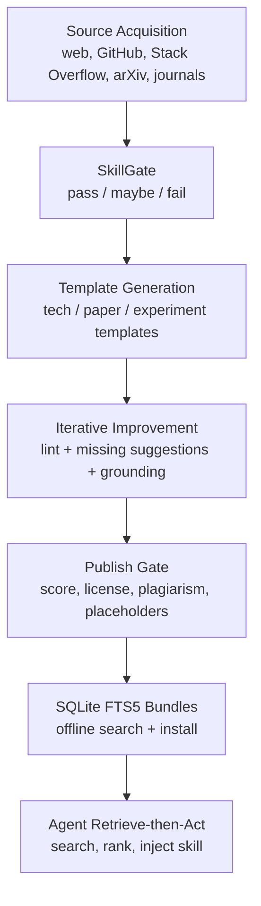
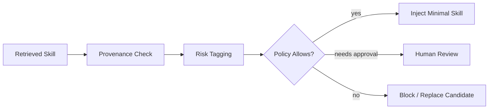

# SkillCenter：把 Agent 的“经验库”从 RAG 文档块推进到可审计技能包

### 元信息

| 字段 | 内容 |
|---|---|
| 标题 | SkillCenter: A Large-Scale Source-Grounded Skill Library for Autonomous AI Agents |
| 作者 | Tianming Sha, Yue Zhao, Lichao Sun, Yushun Dong |
| 时间 | arXiv v1: 2026-07-08 17:34:28 UTC |
| 类型 | 大模型 Agent / 技能库 / 检索增强 / 安全边界 |
| 原文 | https://arxiv.org/abs/2607.07676 |
| 代码 | https://github.com/LabRAI/SkillCenter |
| 数据 | 论文列出 https://huggingface.co/datasets/Tommysha/skillcenter-bundles；本轮匿名 raw 读取返回 401，正文按“论文列出的发布目标”而非已匿名复核数据集内容处理 |

### TL;DR

1. **这篇论文要解决的问题**：Agent 越来越能独立写代码、跑实验、调工具，但“能执行”不等于“正确、安全、可维护”。作者把缺口定义为操作知识缺口：Agent 缺少人类工程师或研究者在审查时隐含使用的经验、约束和失败模式。
2. **核心产物**：SkillCenter 发布一个大规模技能库，论文口径是 **216,938 个结构化技能、24 个 domain bundle**。其中 **114,565 个**由 SkillGate 管线从期刊、arXiv、GitHub、网页、Stack Overflow 等来源生成；**102,373 个**来自 GitHub `SKILL.md` 和 ClawHub 等社区集合。
3. **方法关键点**：技能不是普通 RAG chunk，而是带 schema、质量分、来源 URL、许可证、证据摘录和离线 SQLite FTS5 检索入口的 Markdown 单元。管线包括 source acquisition、SkillGate、模板生成、最多 3 轮改写和 source-grounding check、publish gate。
4. **最重要的实验结论**：技能注入并不总有用。在约 2,000 个通用算法/数据任务上，关键词检索注入没有带来收益，`claude-haiku-4.5` 甚至从 87% 降到 83%。但在“答案只存在于正确技能里”的 agent-gap probe 上，oracle 技能可把 0% 提升到 72% 到 100%。
5. **真实技能验证**：作者又用 18 个真实 SkillCenter 研究技能做参数回忆任务，baseline、placebo 和普通 keyword retrieval 都是 0%，注入正确真实技能后四个模型达到 61% 到 78%，合并 72 个配对样本约为 69%。
6. **局限非常关键**：质量分由单一 LLM 给出，约 82.1% 的 pipeline 技能都被打 4 分；source grounding 只证明“说法能映射到原文短句”，不证明原文正确；社区技能绕过 SkillGate；安全扫描还不是生成前门禁。
7. **对 Agent 研究的意义**：这篇论文最有价值的地方不是“技能越多越好”，而是把 Agent 记忆/技能库的评估问题具体化：什么时候需要技能、检索能否命中、命中后是否正确执行、技能自身是否安全，四件事必须拆开测。

### 研究问题：为什么“能跑通”不是 Agent 的终点？

作者从一个常见场景切入：

1. 用户让 Agent “实现认证模块”。
2. Agent 可能生成多文件代码。
3. 测试也可能通过。
4. 但它仍可能：
   - 漏掉边界输入；
   - 使用过期 API；
   - 选择不合适的统计方法；
   - 引入隐蔽安全漏洞；
   - 只满足表面执行，而没有满足真实任务约束。

这对应论文的中心区分：

| 概念 | 判断标准 | 对 Agent 的含义 |
|---|---|---|
| execution | 程序是否运行、任务是否看似完成 | 现在的 LLM 已经很强 |
| correctness | 结果是否真正解决问题 | 需要领域经验和约束 |
| maintainability | 方案是否可扩展、可维护 | 需要操作知识 |
| safety | 是否避免安全、合规、破坏性行为 | 需要额外风险标注和门禁 |

作者把 Agent 自主性分成四个阶段：

1. **Human-only**：人自己写代码、跑实验、审输出。
2. **LLM-assisted**：模型给建议，人逐条审。
3. **Agent-executed**：Claude Code、Cursor、Windsurf 一类系统接高层任务并执行多步修改。
4. **Agentic autonomous**：多 Agent 拆解任务、调用工具、组合技能，人只设目标和处理例外。

这里的风险递增很清楚：<u>越少人类逐步审查，越需要把人类原本隐含的操作知识显式化</u>。SkillCenter 就是把这些知识做成可检索、可发布、可审计的技能单元。

### 作者的主张：Skill 不等于 RAG chunk

论文对 skill 的定义很具体：

> 一个 skill 是结构化、可检索、source-grounded 的操作知识单元。

为了避免把它理解成“换个名字的知识库”，可以用这个表看差异：

| 维度 | 普通 RAG chunk | SkillCenter skill |
|---|---|---|
| 单元形态 | 原文任意片段 | Markdown 技能文档 |
| 结构 | 无固定 schema | title、背景、步骤、输入输出、验证、证据 |
| 质量信号 | 通常靠相关性排序 | LLM 质量分、publish gate |
| 可执行性 | 需要 Agent 自己转成操作 | 直接面向 Agent 执行 |
| 溯源 | 一般保留文档来源 | 每个 retained claim 要映射到原文短引文 |
| 发布形式 | 向量库或文档库 | domain-split SQLite FTS5 bundle |
| 风险 | 片段可能噪声大 | 仍有风险，但至少有许可证、来源、审计字段 |

这个定义带来两个判断：

1. SkillCenter 的直接对手不是单纯向量数据库，而是 Agent 的操作知识基础设施。
2. 它的成功条件不是 corpus size，而是“是否能在正确任务上取回正确 skill，并让 Agent 正确使用”。

### 语料规模：216,938 是混合口径，不应只看 headline number

论文报告的完整库规模如下：

| 类别 | 数量 | 占比 | 处理方式 |
|---|---:|---:|---|
| Research | 90,084 | 41.5% | SkillGate pipeline 生成 |
| Technical | 24,481 | 11.3% | SkillGate pipeline 生成 |
| Community | 102,373 | 47.2% | 外部收集整合，绕过生成管线 |
| Total | 216,938 | 100% | 24 个 domain bundle |

更关键的是 pipeline 子集：

| 子集 | 数量 | 说明 |
|---|---:|---|
| Pipeline-produced | 114,565 | 有 SkillGate、生成、改写、发布门禁 |
| Community integrated | 102,373 | GitHub SkillMD + ClawHub marketplace |
| Full library | 216,938 | 两类合并后的发布口径 |

这意味着：

1. **216,938** 是完整用户可见规模。
2. **114,565** 才是统一经过 SkillGate 管线的核心研究对象。
3. **102,373** 个社区技能扩大了覆盖，但质量分、许可证、重复率和安全风险不能与 pipeline 子集混读。

论文还给出 pipeline 来源分解：

| Source type | Sources | Published skills | Skills/source | Avg score |
|---|---:|---:|---:|---:|
| Journal | 29,114 | 86,594 | 3.0 | 3.90 |
| GitHub | 20,071 | 20,071 | 1.0 | 4.01 |
| Web page | 3,130 | 3,130 | 1.0 | 3.76 |
| ArXiv | 1,722 | 3,608 | 2.1 | 3.71 |
| Forum | 1,162 | 1,162 | 1.0 | 3.72 |
| Total | 55,199 | 114,565 | 2.1 | 3.91 |

这里有一个有意思的细节：

1. 期刊论文平均每个 source 产出 3 个技能，因为它们可拆成 idea、experiment、method、picture 等不同 skill kind。
2. GitHub、网页、论坛通常每个 source 只产出 1 个技能。
3. arXiv 平均 2.1 个技能，介于论文和技术文档之间。

### SkillGate 管线：从源文档到离线 bundle

论文把框架分成五步：



#### 1. Source acquisition

所有来源先统一做：

1. 文本提取；
2. URL canonicalization；
3. 截断到 12,000 字符；
4. 保存 capture artifacts。

来源与抓取方式如下：

| Source | Acquisition | Extraction | Rate control |
|---|---|---|---|
| Web | HTTP GET + readability | HTML 到文本 | per-host delay |
| GitHub | REST API + domain query | README + key code files | API rate limit |
| Stack Overflow | Stack Exchange API | 问题、采纳答案、评论 | API quota |
| arXiv | arXiv API + PDF | PDF 到文本 | 3 秒延迟 |
| Journals | PLOS/eLife XML API | XML section parsing | journal-specific |

#### 2. SkillGate

SkillGate 是生成前过滤器，不是最终质量分。它看 4,000 字符 excerpt，输出：

1. verdict: `pass` / `maybe` / `fail`；
2. suitability score: 0 到 10；
3. good signals；
4. bad signals。

规则可以概括为：

| Verdict | 条件 | 动作 |
|---|---|---|
| pass | 有步骤、代码、可复现细节 | 进入生成 |
| maybe | 有价值但步骤或验证不足 | 默认也通过 |
| fail | 小于 200 字符、营销、纯观点、不可操作 | 跳过 |

这里的 `maybe` 默认通过是一个偏召回的设计。它适合扩大语料，但也意味着质量后移到 publish gate 和后续评估。

#### 3. 模板生成

论文列出四类模板：

| Template | 角色 | 适用来源 | 关键输出 |
|---|---|---|---|
| Default tech | 技术写作者 | GitHub、web、forum | 背景、用例、输入、输出、步骤、验证、证据 |
| paper_writing | 研究传播者 | arXiv | audience、贡献、方法、写作大纲 |
| paper_writeup | 研究传播者 | arXiv | topic、introduction、method、experiment、figure caption |
| experiment_design | 实验负责人 | 期刊论文 | claims table、experiment_plan、checklist |

这解释了为什么 SkillCenter 的 skill 不只是“一段知识摘要”。它试图把来源转成 Agent 可执行的操作结构。

#### 4. 迭代改写与 grounding

每个技能最多经历 3 轮改写。论文给了一个很实用的评分函数：

```text
score = lint_count * 100 + missing_count

变量：
- lint_count: 结构问题数量，比如缺 Verification、代码块格式错误
- missing_count: 生成自评里尚未处理的改进建议数量
- 100x 权重：结构错误比风格或细节缺口严重得多
```

每轮流程：

1. lint 当前 Markdown；
2. 找出未处理建议；
3. LLM rewrite；
4. source-grounding check；
5. 新旧版本比较，保留更好版本。

source-grounding check 的关键是：

```text
每个 claimed improvement
  必须映射到原 source 中 <= 20 words 的 exact quote
  映射方式是 deterministic substring matching
  不是再让 LLM 判断真假
```

这个设计的好处是可审计，坏处也明显：它只证明“说法有文字来源”，不证明来源正确、上下文没被误读、行动建议真的成立。

#### 5. Publish gate

最终发布门禁有四条：

| 门禁 | 阈值 | 意义 |
|---|---:|---|
| quality score | >= 3.0 | 排除明显低质技能 |
| license | repo/forum 白名单，强 copyleft denylist | 做技术层面的许可过滤 |
| plagiarism ratio | < 0.35 | 避免直接复制来源 |
| “Not provided” count | < 15 | 避免占位符过多 |

论文也承认一个历史问题：114,565 个 pipeline 技能中有 302 个，也就是 0.26%，低于 3.0 的 nominal publish threshold，因为它们来自早期门禁未完全启用的运行，计划下一版移除。

### 检索与 Agent 集成：现在的瓶颈不是注入，而是命中

SkillCenter 的查询路径是本地 SQLite FTS5：

1. `skill-search` 接收自然语言查询；
2. FTS5 用 BM25 返回候选；
3. 可按 domain、kind、min score 过滤；
4. 多 bundle 并行搜索后 merge-sort；
5. 初始只返回 `skills_index` 元数据；
6. Agent 选中后才加载 `skills_content` 的完整 Markdown。

作者的设计强调两点：

1. 检索是离线的，安装 bundle 后不依赖网络；
2. 注入 prompt 时会去掉 source URL，避免模型生成过期或幻觉链接；但 bundle 仍保存来源 URL 和归因字段。

代码仓库也能看到这个工程方向：

| 文件/入口 | 作用 |
|---|---|
| `core/search.py` | bundle 查找、FTS5/BM25 检索、按 domain/kind/source/score 过滤 |
| `core/cli.py` | `skill-search`、`install`、`bundle-install`、`build-bundle`、`claw-full-build` 等 CLI |
| `tests/test_search_quality.py` | 测标题、metadata、body excerpt、多 bundle、variant collapse |
| `pyproject.toml` | 包名 `clawskills-rai`，Python >=3.10，入口 `clawskills = core.cli:main` |

但代码仓库 README 当前写的是 **125K skills total**、索引更新到 **2026-04-04**，论文写的是 **216,938**。这不是必然矛盾，更像是仓库展示页和论文 release 口径不同步。研究解读时应以论文表格为主，以仓库 README 作为当前公开代码界面的旁证。

### 实验一：普通任务上，技能注入没有免费午餐

作者没有只做“注入技能提升很多”的宣传实验，而是设计了四个 arm：

| Arm | 内容 |
|---|---|
| Baseline | 不注入技能 |
| +Keyword | 用 SkillCenter title FTS 检索 top-k，k=3 |
| +Placebo | 注入 3 个长度匹配但无关的技能 |
| +Oracle | 在单独 probe 中注入真正需要的技能 |

通用任务池约 2,000 个任务，覆盖 SQL、解析、编码、图、数据结构、文件转换等。四个模型为：

1. `gemini-3.5-flash`；
2. `claude-haiku-4.5`；
3. `claude-sonnet-4.6`；
4. `gpt-5-mini`。

通用任务结果如下：

| Solver | Baseline | +Keyword | +Placebo | n | 解释 |
|---|---:|---:|---:|---:|---|
| gemini-3.5-flash | 96% | 96% | 96% | 454 | 基本持平 |
| claude-haiku-4.5 | 87% | 83% | 84% | 1,979 | 显著下降，p < .001 |
| gpt-5-mini | 93% | 91% | 91% | 499 | 方向性下降，p = .08 |
| claude-sonnet-4.6 | 93% | 92% | 93% | 500 | 基本持平 |

这个结果很重要：

1. 如果任务本来在模型能力范围内，额外技能上下文不是自动增益。
2. `+Keyword` 和 `+Placebo` 走势接近，说明很多损失来自额外上下文本身，而不是技能内容。
3. 对中等模型，额外上下文可能让模型分心。

因此 SkillCenter 的价值不是“每次都塞技能”，而是“识别知识缺口后再精准注入”。

### 实验二：agent-gap probe 证明注入机制本身有效

为了隔离“技能内容是否有用”，作者构造了 260 个小任务：

1. 每个任务都有任意、不可猜的约定；
2. 例如自定义 checksum、base encoding、格式规约、归约规则；
3. 约定只存在于配套 skill；
4. 任务陈述无法推出答案。

结果非常直接：

| Solver | Baseline | +Oracle | p |
|---|---:|---:|---:|
| gemini-3.5-flash | 0% | 98% | 5e-13 |
| claude-haiku-4.5 | 0% | 72% | 4e-31 |
| gpt-5-mini | 0% | 100% | 1e-63 |
| claude-sonnet-4.6 | 0% | 99% | 1e-62 |

这里说明：

1. 当 skill 真正携带模型不知道的信息时，注入机制可以工作。
2. 失败主要不在“模型不能读技能”，而在“真实部署时能否检索到正确技能”。
3. `claude-haiku-4.5` 的 72% 表示模型执行规则的 fidelity 仍有差异，不能假设所有模型读到技能后都会完美执行。

### 实验三：真实 SkillCenter 技能也能填补真实知识缺口

作者又构造了一个更接近真实 corpus 的 probe：

1. 选择 18 个 source-grounded research skills；
2. 每个技能记录具体研究参数，如剂量、持续时间、cohort size、screen size、仪器型号、质量阈值；
3. 任务要求模型返回这些参数值；
4. baseline、placebo、keyword、oracle 四个 arm 相同。

结果：

| Solver | Base | Placebo | +Keyword | +Oracle | Δ | p |
|---|---:|---:|---:|---:|---:|---:|
| gemini-3.5-flash | 0% | 0% | 0% | 67% | +12 | 5e-4 |
| claude-haiku-4.5 | 0% | 0% | 0% | 72% | +13 | 2e-4 |
| gpt-5-mini | 0% | 0% | 0% | 78% | +14 | 1e-4 |
| claude-sonnet-4.6 | 0% | 0% | 0% | 61% | +11 | 1e-3 |

合并看：

```text
n = 72 paired tasks
oracle = 69%
baseline/placebo/keyword = 0%
net discordant Δ = +50
exact McNemar p ≈ 2e-15
```

最值得注意的是 `+Keyword` 仍然是 0%。论文解释为：需要的技能虽然存在于 bundle，但 title-only FTS 取回了 OpenTelemetry、MCP-builder、TensorFlow recipe 等泛化但不匹配的技能。

这把三件事拆开了：

1. **coverage**：库里有没有答案？有。
2. **injection**：正确技能给模型后能不能用？多数能。
3. **retrieval**：普通关键词检索能不能找到？这里不能。

因此下一步不是继续堆 corpus size，而是改进检索、缺口检测和风险感知注入。

### 质量分析：3.91 平均分更像内部 QA，不是外部验证

论文给出 pipeline 子集质量分布：

| Source | n | <=2 | 3 | 4 | 5 | Avg |
|---|---:|---:|---:|---:|---:|---:|
| journal | 86,594 | 0.0% | 12.5% | 85.7% | 1.8% | 3.90 |
| github | 20,071 | 1.0% | 13.4% | 69.5% | 16.1% | 4.01 |
| arxiv | 3,608 | 0.6% | 28.6% | 70.6% | 0.2% | 3.71 |
| webpage | 3,130 | 1.1% | 22.1% | 76.6% | 0.2% | 3.76 |
| forum | 1,162 | 3.2% | 24.3% | 69.4% | 3.1% | 3.72 |

作者自己承认 score inflation：

1. 约 82.1% 的 scored skills 被打 4 分。
2. 质量分来自 GPT-5.2，而不是人工标注。
3. 没有人类校准、inter-annotator agreement 或 baseline collection 对比。
4. per-domain 平均分差异不应过度解读。

这部分非常诚实，也让论文的证据边界更清楚：

```text
3.91 average score
  = 内部 QA 信号
  != 人类验证过的技能质量
  != 安全可执行证明
  != 下游 Agent 必然更好
```

### 方法库存：SkillCenter 真正沉淀了哪些“操作知识”？

如果只看 `skill` 这个词，很容易把它误解为 prompt 模板市场。但论文的技能库存更接近“操作判断的最小可复用单元”。它想把人类专家在执行任务时会问的检查项显式化：

1. **我什么时候适用这个方法？**
   - 技能要写 applicability condition，而不是只写“这个工具很好用”。
   - 对 Agent 来说，这对应任务路由：什么时候该用某个库、某个实验设计或某个部署模式。
2. **输入和输出是什么？**
   - 技术技能要求 Inputs / Outputs。
   - 研究技能要求 claim、method、experiment、figure 的分解。
   - 这比普通文档段落更容易被 Agent 接进计划器。
3. **如何验证执行结果？**
   - 技能模板包含 Verification。
   - 这回应了论文开头的核心问题：运行成功不是正确性证明。
4. **证据来自哪里？**
   - 每个 skill 保留 source URL、license、evidence quotes。
   - 这让下游系统可以回溯来源，也能按许可证或风险策略过滤。
5. **失败边界是什么？**
   - 论文目前做得还不完全，但 limitations、safety scan 和 future work 已经说明：过时、注入、危险命令、许可证、检索误命中都必须成为 skill 生命周期的一部分。

可以把 SkillCenter 的知识单元写成一个简化 schema：

```text
Skill {
  identity: skill_id, title, domain, kind
  applicability: when_to_use, prerequisites
  action: steps, inputs, outputs, verification
  evidence: source_url, quote_spans, license
  quality: score, lint_status, plagiarism_ratio
  risk: source_type, risk_class, future_policy_tags
}
```

这套 schema 对 Agent 设计的价值在于：

1. 它让技能从“可读文本”变成“可过滤对象”。
2. 它让检索结果不只按相似度排序，还可以按质量、风险、来源和 license 过滤。
3. 它让后续 benchmark 能精确归因：失败到底是检索错、技能质量差、证据不够，还是模型没执行。

### 失败案例视角：这篇论文实际暴露了三个系统短板

#### 短板一：标题检索不能覆盖技能正文知识

真实技能 probe 中，普通 keyword retrieval 取回了泛化但不匹配的技能。这说明：

| 现象 | 原因 | 后续改进 |
|---|---|---|
| 正确技能在库里但没命中 | FTS 主要看 title / index 字段 | full-body FTS、metadata matching、semantic retrieval |
| 任务问具体参数，标题不含参数 | 参数藏在 skill body | query expansion、field-aware retrieval |
| top-k 语义泛化但不可用 | 相似词不等于任务缺口 | gap-aware reranking |

#### 短板二：技能注入缺少“是否需要”的判断器

通用任务里，额外技能上下文没有收益。一个实用 Agent 需要先做 triage：

1. 如果任务是模型已熟悉的算法题，少注入。
2. 如果任务依赖不常见配置、具体版本、实验参数或安全约束，再检索。
3. 如果检索置信度低，应提示不确定，而不是强行塞 top-k。

#### 短板三：安全扫描现在是事后统计，不是执行前策略

论文附录的 pattern scan 很有价值，但它还不是运行时控制：

1. 它无法判断上下文中的危险命令是“警示例子”还是“执行建议”。
2. 它无法识别变形 prompt injection。
3. 它无法根据当前 Agent 权限决定是否阻断。
4. 它无法保证社区技能的许可证和来源可靠。

因此 SkillCenter 如果进入真实 Agent runtime，必须再接一个 policy layer：



### 去重与重复：pipeline 子集干净，社区子集更噪

论文用三层冗余检查：

| 层级 | 方法 | 结果 |
|---|---|---|
| identity | `skill_id` 全局主键，bundle disjoint | 216,938 个 ID 不重复 |
| verbatim | normalized text byte identity | 9,831 个技能，即 4.5%，与其他技能正文完全相同 |
| near-duplicate | 128-permutation MinHash over word 5-shingles, Jaccard >= 0.8 | 24,988 个技能，即 11.5%，在近重复簇里 |

关键分布：

1. 重复主要集中在 GitHub SkillMD 和 ClawHub 等社区集合。
2. SkillGate pipeline 的 21 个 domain 基本在 0.01% 以下。
3. 近重复 pair 只有约 3% 跨 bundle，说明 24 个 bundle 的主题边界相对清晰。

这也进一步说明：

1. 如果要高召回、多样性，可用 full library。
2. 如果要可控、可审计、低重复，应优先 pipeline subset。
3. 如果要无监督 Agent 使用，社区 bundle 要更谨慎。

### 安全边界：SkillCenter 还不是安全执行层

论文的安全讨论非常值得放在正文，而不是只放 limitations。

作者明确说当前管线有质量门禁，但没有安全专用门禁：

1. 不筛 indirect prompt injection；
2. 不筛 credential exposure；
3. 不筛可能造成损害的操作；
4. 没有执行时 sandbox 或 human approval 机制；
5. 社区技能更没有统一安全管线。

附录做了正则级 baseline safety scan：

| Risk class | Pipeline subset | Community bundles |
|---|---:|---:|
| Hardcoded secrets | 12 | 193 |
| Prompt-injection phrases | 318 | 2,342 |
| Destructive shell commands | 218 | 1,359 |

作者强调这是 pattern scan，不是语义安全判断。很多命中可能是安全文档里的防御性引用，但它说明风险集中在 community bundle。

未来安全路线包括：

1. **source-level safety screening**：生成前检测 prompt injection、恶意指令、凭证暴露。
2. **skill-level risk annotations**：标注 shell、网络、外部代码执行、secret handling、destructive operations、biosecurity/cybersecurity 等风险。
3. **execution-time guardrails**：高风险技能阻断、沙箱或人类审批。
4. **quarantine / revocation**：发现问题后从未来 bundle 移除，并计划 signed denylist。

这对 Agent 安全研究有一个直接启发：技能库不是纯知识资产，它也是新的攻击面。

### Figure / Table 证据重构

| 证据位置 | 支持的主张 | 不能证明什么 |
|---|---|---|
| Figure 1 treemap | Research、Technical、Community 三类规模结构 | 不能证明每个 skill 都高质量 |
| Table 1 corpus summary | 24 个 bundle 的数量、分数、来源拆分 | 分数不是人工验证 |
| Table pipeline funnel | 55,199 sources 到 114,565 pipeline skills | 缺少完整 fetched -> gate pass/fail -> generated -> reject 统计 |
| Table downstream | 普通任务上 keyword injection 无收益，oracle gap 显著 | 不是多轮真实 Agent benchmark |
| Table real-skill probe | 真实技能可填补参数知识缺口 | 任务窄，主要是精确回忆 |
| License audit | pipeline subset 多数有明确许可证字段 | web-derived 技能仍只是技术过滤，不是法律 clearance |
| Safety scan | 风险模式低频且集中于 community | 正则不是语义安全保证 |

### 伪代码：一个更稳妥的 SkillCenter 使用策略

论文结果不支持“每个任务都注入 top-k 技能”。更合理的 Agent 策略是：

```text
Input:
  task_description
  project_context
  installed_skill_bundles

State:
  uncertainty_signal
  retrieval_candidates
  risk_policy

Procedure:
  1. 判断任务是否存在知识缺口
     - 是否涉及冷门 API、具体协议、实验参数、部署约束
     - 是否模型自己给出低置信度或多种冲突方案
     - 是否需要近期、领域化、源可追踪操作知识

  2. 如果没有明显知识缺口
     - 不注入技能
     - 直接解题或只做轻量检索

  3. 如果有知识缺口
     - 在相关 bundle 中检索
     - 不只看 title BM25，结合 body / metadata / semantic retrieval
     - 要求候选技能满足 provenance 和 risk policy

  4. 注入前做风险检查
     - 是否要求 secret handling
     - 是否包含 destructive commands
     - 是否请求联网下载执行
     - 是否与当前权限策略冲突

  5. 注入最小必要技能
     - 只注入 top matched skill
     - 保留 evidence 与 verification
     - 不注入大量泛化上下文

Output:
  skill-grounded action plan
  evidence boundary
  fallback when retrieval confidence is low
```

### 相关工作位置：SkillCenter 更像“离线操作知识基础设施”

论文把自己放在几条线之间：

| 系统 | 单元 | 构建方式 | 规模 | provenance |
|---|---|---|---|---|
| Voyager | executable program | online, one agent | 10s-100s | no |
| Self-Instruct | instruction | offline synthetic | 10s of K | no |
| RAG corpora | document chunk | offline | varies | source only |
| ClawHub | hand-written skill | community | 1000s | partial |
| SkillCenter | source-grounded skill | offline automated | 216,938 | source + license |

这个定位说明：

1. 它不是让单个 Agent 在环境中在线学技能。
2. 它不是合成 instruction dataset。
3. 它不是传统 factual RAG。
4. 它是跨 Agent 复用的、离线构建的、带 provenance 的操作知识库。

### 局限：这篇论文最应该被谨慎阅读的地方

#### 1. 下游评估还不是真实多轮 Agent

通用任务和 gap probe 都是 offline、single-shot、客观评分。它们证明条件机制，但不能证明：

1. 多轮 coding agent 会稳定受益；
2. 工具调用链不会被技能误导；
3. 技能注入能改善真实 issue resolution；
4. 人类审查成本一定下降。

#### 2. 检索还是短板

真实技能 probe 中，正确 skill 在库里，但 keyword retrieval 仍是 0%。这说明：

1. title-only FTS 对研究参数类知识不够；
2. body-level FTS 和 semantic retrieval 是必要下一步；
3. 还需要 gap-aware query reformulation；
4. 单纯扩大 skill 数量可能加重检索噪声。

#### 3. source grounding 不是事实验证

deterministic substring matching 很适合审计，但不能保证：

1. 原文没有错；
2. skill 没有断章取义；
3. 操作步骤在当前环境仍有效；
4. 安全风险已被识别。

#### 4. 质量分依赖 proprietary scorer

论文参数写明 SkillGate、generation、quality scoring 使用 GPT-5.2。换模型会改变：

1. 哪些 source 通过；
2. skill 文本；
3. 质量分；
4. 改写结果；
5. 最终 bundle 内容。

这让 exact reproduction 依赖特定模型版本。

#### 5. 法律和安全还需要下游二次治理

publish gate 是技术默认，不是法律意见。尤其是：

1. web-derived skills 没有统一 license whitelist；
2. community bundles 没有同等 SPDX 覆盖；
3. plagiarism ratio 不能替代版权审查；
4. 无监督 Agent 不能直接把“质量分高”当成“安全可执行”。

### 领域延伸：这篇论文对 Agent 后续研究提出的四个问题

#### 问题一：什么时候该检索技能？

如果模型已经能解决任务，额外上下文可能干扰。未来 Agent 应该先判断：

1. 任务是否依赖最新 API；
2. 是否需要专业流程；
3. 是否存在不可猜规则；
4. 是否要求可审计来源；
5. 是否涉及高风险操作。

这比固定 top-k RAG 更接近真实智能体行为。

#### 问题二：技能检索应该优化什么？

当前证据说明 title BM25 不够。更合适的优化目标可能是：

| 目标 | 说明 |
|---|---|
| gap matching | 技能是否填补任务缺口 |
| action relevance | 技能步骤是否可直接执行 |
| risk compatibility | 技能风险是否符合权限策略 |
| evidence strength | 技能证据是否足以支持建议 |
| freshness | 来源是否仍然适用 |

#### 问题三：技能库如何防止成为 prompt injection 供应链？

SkillCenter 从开放网页、代码仓库、论坛、社区 marketplace 采集材料。Agent 又会把技能内容放进上下文。攻击者可以瞄准：

1. source document；
2. generated skill；
3. community skill；
4. retrieval ranking；
5. execution-time interpretation。

因此 skill corpus 需要像软件供应链一样治理：签名、版本、风险标签、撤销列表、最小权限、沙箱执行。

#### 问题四：技能质量应如何外部验证？

单一 LLM 分数不够。更可靠的评估应包括：

1. 人类专家标注；
2. 多模型交叉评分；
3. 静态安全扫描；
4. 在真实 agent benchmark 中的 A/B；
5. 失败案例归因：检索错、技能错、模型没执行、环境不匹配。

### 结论

SkillCenter 的贡献可以概括为：

1. 它提出了一个比 RAG chunk 更强的 Agent 操作知识单元：结构化 skill。
2. 它发布了一个大规模混合技能库，并把 pipeline 子集与 community 子集分开报告。
3. 它用实验说明技能注入的条件性：正确 skill 在正确缺口上有强效果，普通关键词注入没有免费收益。
4. 它清楚承认当前瓶颈：检索、质量分校准、安全筛查、许可证治理、多轮真实 Agent 评估。

对研究者来说，这篇论文最值得带走的不是“216,938 个技能”这个数字，而是一个更严谨的问题框架：

```text
Agent 需要什么知识？
这个知识是否在库里？
检索是否能准确命中？
模型是否能按技能执行？
技能本身是否安全、合法、不过时？
```

只有这五个问题同时被回答，技能库才会从“更大的上下文来源”变成真正可靠的 Agent 基础设施。
