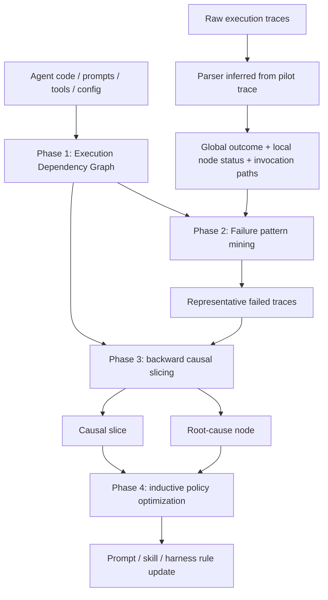

# STRACE：把长程 Agent 的噪声轨迹压成根因证据

### 元信息

| 项目 | 内容 |
|---|---|
| 论文 | From Noisy Traces to Root Causes: Structural Trajectory Analysis and Causal Extraction for Agent Optimization |
| 作者 | Ying Chang, Jiahang Xu, Xuan Feng, Chenyuan Yang, Peng Cheng, Yuqing Yang |
| 时间 | arXiv v1, 2026-07-08 17:57:27 UTC |
| 链接 | https://arxiv.org/abs/2607.07702 |
| 代码 | https://github.com/moomight/STRACE |
| 方向 | 大模型 Agent；长程轨迹诊断；反思式优化；结构化 credit assignment |

### TL;DR

1. **STRACE 研究的问题**：长程 Agent 失败后，应该把哪段轨迹交给 LLM optimizer？全文认为，直接塞完整日志会让优化器被无关步骤误导；只截取最近窗口又会丢掉很早发生、很晚才爆雷的根因。
2. **核心方法**：STRACE 把执行轨迹看成带数据依赖和控制依赖的文本图，而不是线性 transcript。它先从代码、prompt、配置和工具接口构造 Execution Dependency Graph，再做失败模式聚类、代表性轨迹选择、反向因果切片和根因模块定位。
3. **优化对象**：它不改底层模型权重，也不直接改可执行代码；最后把局部因果证据抽象成自然语言规则，只注入到被判定为 root-cause 的模块 prompt 或 skill 里。
4. **关键证据**：在 HotpotQA、WebArena、VeruSAGE-Bench 三组任务上，STRACE 都优于 full-trace、summary、retrieval、GEPA 等 baseline。最醒目的数字是 VeruSAGE-Bench overall SR 从 base agent 的 42.5% 提到 58.5%，绝对提升 16.0 个百分点。
5. **成本证据**：消融表显示完整 STRACE 的 overall cost 是 2.9563 美元；去掉 trace filtering 后成本升到 8.4489 美元，说明它不是多花上下文换效果，而是在 Phase 2/3 压缩下游优化成本。
6. **根因证据**：论文的 VeruSAGE case study 中，25 条代表性失败轨迹里有 12 条被从表面故障模块重映射到上游根因动作，说明“哪里报错”经常不是“哪里该修”。
7. **局限**：STRACE 需要能看到目标 Agent 的 harness、prompt、工具接口、配置、日志或代码；对完全黑盒、只给最终输出的系统并不直接适用。真实部署还要处理 trace 隐私、权限和 prompt 修改审查。

### 研究问题：为什么长程 Agent 优化不能只靠反思日志？

论文切入的是反思式 Agent 优化中一个很实际的瓶颈：

| 传统做法 | 看似合理的假设 | 在长程 Agent 中的问题 |
|---|---|---|
| Full trajectory | 全量上下文最完整 | 成功步骤、无关分支、重复尝试会稀释失败信号，优化器可能生成针对噪声的 prompt patch |
| Short truncation | 最近的步骤最相关 | 很多故障是上游 planner、router 或 state update 的延迟后果，最近窗口只看到症状 |
| Summary/RAG | 压缩或检索能保留重点 | 摘要会丢细粒度因果链，语义检索会被表面相似片段吸引 |
| Current-node repair | 谁报错就修谁 | crash node 可能只是 manifestation node，真正的 root cause 在更早的模块 |

作者把这个矛盾称为 **context-noise trade-off**：

```text
优化上下文需要满足两件事：
1. 保留足够长的历史，避免漏掉远距离因果依赖；
2. 删除无因果贡献的步骤，避免 optimizer 修错目标。

如果只增加上下文长度，噪声会增长；
如果只缩短上下文，因果链会断裂。
```

这个问题对 Agent 特别尖锐，因为 Agent 的输出不是单轮 answer，而是一串：

1. planner 决策；
2. tool 调用；
3. 观察结果；
4. state 或 memory 更新；
5. router 选择；
6. executor patch；
7. verifier 或环境反馈。

在这种链路里，失败可能表现为最后一步工具报错，但根因可能是第 5 步 router 选错子任务，或者第 1 步 planner 生成了后来才使用的错误参数。

### 论文主张：把轨迹从“线性文本”改写为“因果证据图”

STRACE 的主张可以整理成一个 claim → mechanism → evidence → boundary 表：

| 层次 | 内容 |
|---|---|
| Claim | 长程 Agent 优化要先做结构化 credit assignment，再做 prompt/harness 更新 |
| Mechanism | 用 Execution Dependency Graph 描述模块间数据依赖和控制依赖；用失败模式筛轨迹；用反向切片定位 root-cause node |
| Evidence | HotpotQA EM、WebArena SR、VeruSAGE-Bench SR 均领先 baseline；VeruSAGE overall 从 42.5% 到 58.5% |
| Boundary | 需要可检查的 agent harness 和日志；依赖 LLM 构造文本图与因果判断；论文未证明黑盒场景可直接迁移 |

论文最关键的概念不是“又加一个 optimizer”，而是 **优化前先做因果定位**：

```text
manifestation node vm:
  错误显式出现的节点，例如 Code Interpreter 崩溃、verifier 超时、repair executor 循环。

root-cause node vr:
  让错误进入轨迹的上游模块，例如 planner 生成错误参数、router 选错 repair path、state manager 保留错误状态。

STRACE 的目标：
  从 vm 反向追溯到 vr，然后只把优化规则注入 vr。
```

### 方法机制：四阶段 pipeline 如何工作？

论文和代码 README 都把 STRACE 拆成四个阶段。论文版强调实验机制，代码仓库版把它落成可运行 pipeline：

| 阶段 | 论文名称 | 工程 README 对应 | 产物 |
|---|---|---|---|
| Phase 1 | Structural Modeling | Environment Modeling | agent 模块、prompt、工具、状态和依赖边 |
| Phase 2 | Failure Pattern Mining and Trace Filtering | Trace Selection | 代表性失败轨迹集合 |
| Phase 3 | Causal Localization | Causal Root-Cause Attribution | causal slice 与 root-cause module |
| Phase 4 | Inductive Policy Optimization | Harness Engineering | 针对根因模块的 prompt/skill 修改规则 |

#### Phase 1：Execution Dependency Graph 不是传统静态分析图

STRACE 首先让 LLM 读取目标系统的仓库级材料：

1. README 和文档；
2. agent 定义；
3. prompt 或 skill 文件；
4. 配置；
5. 工具接口；
6. 关键源代码；
7. 执行日志格式。

它输出一个文本形式的 Execution Dependency Graph：

```text
G = (V, E)

V:
  原子功能模块，例如 planner、router、executor、memory manager、verifier wrapper。

E_data:
  A 产生的计划、证据、代码 patch、状态被 B 消费。

E_control:
  A 决定 B 是否被调用，或决定调用哪一个工具/子 Agent。
```

这里的 graph 是 **文本边列表**，不是训练出来的图模型，也不是语言无关的编译器级静态分析。这个选择很务实：

1. Agent harness 往往混合 prompt、配置、Python/TS 代码、shell 工具和外部 API。
2. 完整静态分析很难覆盖这些边界。
3. LLM 能从 repository artifacts 中恢复“哪些模块影响哪些模块”的近似先验。

附录表 3 做了一个模型间图质量检查：Claude Sonnet 4.5、Claude Haiku 4.5、GPT-5.1 Codex Mini、DeepSeek-V3.1、MiniMax-M2.5 都能保留核心依赖结构，差别主要是粒度和额外 noisy edges。

#### Phase 2：失败模式挖掘不是只看一条失败日志

长程 Agent 的失败通常高度重复。STRACE 不把每条失败都交给 optimizer，而是先从全批 traces 中抽结构化信号：

| 信号 | 作用 |
|---|---|
| Global outcome | 任务最终成功或失败 |
| Local node status | 某个模块是否抛错、超时或进入异常状态 |
| Invocation path | 模块调用序列，比如 router → executor → verifier → router |
| Statistical severity | 某个局部错误出现时，全局失败的条件概率 |
| Structural path pattern | self-loop、oscillation、dead end 等轨迹形态 |

论文中最有用的公式可写成：

```text
P(TaskFail | v_i Fail)

变量解释：
v_i:
  第 i 个模块或局部节点。

v_i Fail:
  该节点在结构化 trace 中出现异常、错误状态或失败信号。

P(TaskFail | v_i Fail):
  给定这个局部失败已经发生，整个任务最终失败的概率。

用途：
  识别“局部看起来只是一个错误、但对全局结果杀伤力很高”的 bottleneck。
```

随后它按 severity 与 structural path patterns 聚类，只保留每类少量代表性 exemplar。这样做有两个目的：

1. 保持失败类型覆盖，不让某一种高频重复失败挤占上下文。
2. 控制成本，把后续 Phase 3/4 的输入规模固定在可管理范围。

如果日志没有显式 node-level error，STRACE 会退化为用 global outcome 和 invocation path 选代表性失败。这个 fallback 很重要，因为很多生产 Agent 不一定有规整的 error taxonomy。

#### Phase 3：反向切片把“症状上下文”变成“因果上下文”

Phase 3 是全文最核心的机制。它不是问“最后哪里报错”，而是从 manifestation node 开始沿依赖图反向追溯：

```text
Input:
  representative trace T
  dependency graph G = (V, E_data, E_control)
  manifestation node v_m

State:
  causal_slice = {v_m}
  frontier = [v_m]

Loop:
  while frontier not empty:
    current = frontier.pop()
    for predecessor p where p -> current via data/control dependency:
      if p appears in trace T and p not in causal_slice:
        causal_slice.add(p)
        frontier.push(p)

Root cause isolation:
  read causal_slice in reverse information-flow order
  find earliest module where corrupted state, wrong decision, or invalid assumption entered
  mark it as v_r

Output:
  causal_slice
  root-cause node v_r
  explanation linking v_r to v_m
```

这个算法的价值在于，它用 dependency closure 替代时间邻近性：

| 时间位置 | 传统 truncation 的判断 | STRACE 的判断 |
|---|---|---|
| 很早的 planner 参数 | 可能被截断 | 如果后续工具消费了它，就保留 |
| 中间的成功工具调用 | 可能被完整保留 | 如果不在失败依赖闭包里，就删除 |
| 最后的 crash | 一定是修复目标 | 只是 manifestation node，需要继续反推 |
| 并行探索分支 | 可能因为相邻而进入上下文 | 若无数据/控制依赖，就排除 |

论文 Figure 1 的例子就是这个逻辑：完整轨迹太吵，短截断漏掉 Step 1 到 Step 48 的远距离因果链；STRACE 则只保留 compact causal slice。

#### Phase 4：把个例失败抽象成模块级规则

Phase 4 聚合属于同一个 root-cause node 的 causal slices，然后生成可复用的自然语言规则。它避免把某条 trace 的具体细节硬编码进 prompt，而是做 inductive abstraction：

| 输入 | 抽象方式 | 输出 |
|---|---|---|
| 多条同根因失败 | 找共同错误模式 | generalized heuristic |
| 具体失败日志 | 去上下文化 | 可迁移规则 |
| root-cause node | 局部注入 | 只修改相关模块指令 |
| verifier/tool feedback | 转为行动边界 | 何时停止、切换或升级 |

附录 D 的 VeruSAGE 示例很直观。STRACE 给 assertion_reasoning_pipeline 提炼出三类规则：

1. **失败感知停止条件**：某个动作连续 2-3 次被拒绝时，不要在同一上下文里继续重试。
2. **子 Agent 选择边界**：选择 USELEMMA、CASE_ANALYSIS、INDUCTION 等动作时必须给出具体锚点。
3. **多轮规划策略**：下一步要继承已接受 patch 的进展，而不是随机切换无关动作。

这说明 STRACE 的最终产物不是“这条 trace 错在第几步”的报告，而是能改变后续行为的 harness 规则。

### Mermaid：STRACE 的数据流



### 实验设置：三个 benchmark 覆盖不同 Agent 难度

论文没有只在一个玩具环境上验证，而是选了三类任务：

| Benchmark | 任务性质 | Agent 结构 | 指标 |
|---|---|---|---|
| HotpotQA | 多跳问答 | DSPy 四阶段 workflow | Exact Match |
| WebArena | 网页交互 | 单 prompt CoT web navigation agent | Success Rate |
| VeruSAGE-Bench | Rust/Verus 形式化验证修复 | router-executor 多 Agent，16 个可优化模块 | Success Rate |

VeruSAGE-Bench 是最能体现 STRACE 价值的场景：

1. 它有五个真实 Rust 项目类别：IronKV、Memory Allocator、Node Replication、NRKernel、Storage。
2. 任务涉及验证失败、错误分析、router 选择、executor patch 和 verifier feedback。
3. 平均上下文很长，论文给出约 947 行。
4. repair loop 最多 20 次尝试或 20 分钟。
5. TextGrad 因为 context budget 过高没有在 VeruSAGE-Bench 上报告。

优化器设置也值得注意：

| 项目 | 设置 |
|---|---|
| Meta-controller | Claude Sonnet 4.5 |
| Temperature | 1.0 |
| Bottleneck threshold | k = 5 |
| Exemplar count | s = 5 |
| HotpotQA backbone | GPT-4o |
| WebArena backbone | GPT-4o |
| VeruSAGE backbone | o4-mini |

这意味着 STRACE 的贡献主要在 **怎么构造优化上下文**，而不是换一个更强的执行模型。

### 主结果：STRACE 在三类任务中都领先

论文 Table 1 的核心数字如下：

| 方法 | HotpotQA EM | WebArena ALL SR | VeruSAGE ALL SR |
|---|---:|---:|---:|
| Base Agent | 37.0% | 10.8% | 42.5% |
| Naive Few-shot | 60.0% | 13.7% | 39.6% |
| Failure-Aware RAG | 57.7% | 14.4% | 42.5% |
| Summary-based Selection | 64.3% | 15.1% | 45.3% |
| Retrieval-based Selection | 46.0% | 14.4% | 41.5% |
| TextGrad | 62.0% | 17.3% | 未报告 |
| GEPA | 64.4% | 16.5% | 47.2% |
| STRACE | 68.5% | 23.7% | 58.5% |

几个判断：

1. **HotpotQA 上差距较小但稳定**：STRACE 68.5%，GEPA 64.4%，说明即使是较规整的多跳问答 workflow，结构化轨迹也有帮助。
2. **WebArena 上差距更明显**：STRACE 23.7%，比 Base Agent 高 12.9 个百分点；Reddit 和 GitLab 这种更依赖失败规则的任务尤其受益。
3. **VeruSAGE 是主战场**：STRACE 58.5%，比 Base Agent 高 16.0 个百分点，比 GEPA 高 11.3 个百分点。

VeruSAGE 分项也能看到它不是只改善一个子集：

| VeruSAGE 类别 | Base Agent | GEPA | STRACE |
|---|---:|---:|---:|
| IronKV | 41.6% | 54.2% | 62.5% |
| Memory Allocator | 66.7% | 61.1% | 88.9% |
| Node Replication | 80.0% | 80.0% | 100.0% |
| NRKernel | 20.0% | 29.3% | 31.7% |
| Storage | 46.2% | 46.2% | 61.5% |
| Overall | 42.5% | 47.2% | 58.5% |

NRKernel 仍然很难，STRACE 只到 31.7%。这反而让结论更可信：方法有效，但没有宣称消除所有长程形式化验证难题。

### 成本与规模：为什么不是“更贵所以更强”？

论文 Figure 3 比较了训练轨迹数量从 1 增到 453 时的 success rate 和 optimization cost。文本给出的结论是：

1. TextGrad 因为 full-trace optimization，轨迹越多，成本增长越快。
2. GEPA 通过 current-node slicing 控制成本，但容易只看到局部节点。
3. STRACE 用统计瓶颈诊断和代表性 exemplar 选择，在全量 453 条轨迹时仍控制上下文增长。

更直接的证据来自消融表：

| 方法 | Success Rate | Overall Cost |
|---|---:|---:|
| STRACE | 56% | $2.96 |
| w/o Structural Modeling | 48% | $5.10 |
| w/o Trace Filtering | 46% | $8.45 |
| w/o Causal Localization (Current) | 54% | $2.88 |
| w/o Causal Localization (Full) | 54% | $5.93 |

这张表说明：

1. 去掉 structural modeling，Phase 1 本身省下的钱很少，但 SR 掉到 48%，成本反而上升到 5.10 美元。
2. 去掉 trace filtering，SR 掉到 46%，成本变成 8.45 美元，说明冗余失败会让后续 prompt optimization 变贵且更差。
3. 去掉 causal localization 后用 current node，成本接近 STRACE，但 SR 低；用 full trace，SR 仍低且成本翻倍。

附录 Table 5 进一步显示成本主要集中在 Phase 4：

| 版本 | Phase 1 | Phase 2 | Phase 3 | Phase 4 | Overall |
|---|---:|---:|---:|---:|---:|
| STRACE | 0.1135 | 0.1861 | 0.8515 | 1.8052 | 2.9563 |
| w/o Trace Filtering | 0.1667 | - | 0.6802 | 7.6020 | 8.4489 |
| w/o Full Trace Slicing | 0.2500 | 0.3597 | - | 5.3179 | 5.9276 |

所以 Phase 2/3 的价值不仅是提高诊断准确率，还在于压缩最贵的 downstream optimization。

### Figure 4：症状节点和根因节点真的会分离

论文 Figure 4 给了一个 VeruSAGE 过程中的 case study：

| 观察 | 含义 |
|---|---|
| 200-case setting 中选出 5 个高影响 manifestation modules | 先从表面故障位置进入 |
| 每个模块选 5 条代表性 trace，共 25 条 | 控制诊断规模 |
| 25 条中有 12 条被重映射到上游 root-cause actions | 将近一半不能只修 crash node |
| target nodes 从 5 个扩展到 6 个 | 新发现一个 upstream assertion_reasoning_pipeline |
| IronKV 中 compute_repair 循环被追溯到上游 routing error | 循环不是 executor 自己的问题，而是被派错路径 |

这段证据对应了论文的中心判断：

```text
如果只看 manifestation node:
  你会优化“哪里爆了”。

如果做 causal localization:
  你有机会优化“为什么会爆”。
```

对工程 Agent 来说，这个区别非常具体。例如一个测试修复 Agent 最后失败在 test runner，不代表应该改 test runner prompt；可能是 earlier planner 错分了 flaky test 与真实 regression，或者 patch generator 在很早一步引入了不满足接口约束的修改。

### 图表证据逐项解读

| 图/表 | 支持的结论 | 不能证明什么 |
|---|---|---|
| Figure 1 | full trajectory 和 short truncation 都会失败；causal slice 是第三条路径 | 只是概念图，不是实验本身 |
| Figure 2 | STRACE 是四阶段 pipeline，不是单步摘要器 | 没说明每个阶段对不同框架的鲁棒性 |
| Table 1 | 三类 benchmark 主结果领先 | 不代表任何 Agent 系统都能同幅度提升 |
| Figure 3 | 随训练轨迹增加，STRACE 的成本-性能趋势更好 | 具体成本依赖 API 定价和 trace 格式 |
| Figure 4 | manifestation 与 root cause 可分离，12/25 条被重映射 | case study 规模有限，不是全域统计结论 |
| Table 2 | 三个关键阶段都有贡献 | ablation 主要围绕 VeruSAGE 设置 |
| Table 3 | 多个模型都能构造可用 dependency prior | expert review 仍有主观成分 |
| Table 4 | graph 加减 10%-25% 边仍相对稳定 | 不代表严重错误图也可用 |
| Table 5 | Phase 2/3 降低 Phase 4 成本 | 成本以 Claude Sonnet 4.5 价格估算 |
| Table 6 | STRACE-enhanced VeruSAGE 平均 turn 更少 | 不等同于所有失败样本都更快 |
| Table 7 | o4-mini + STRACE 接近 Claude Sonnet 4 hands-off overall | IronKV、NRKernel 仍落后，说明强模型能力仍重要 |

### 与相关工作的关系：它补的是 credit assignment，而非单纯 prompt search

论文把 STRACE 放在三条线之间：

| 相关方向 | 代表问题 | STRACE 的不同点 |
|---|---|---|
| Automated Prompt Optimization | 如何搜索更好的指令 | STRACE 先决定该用哪些失败证据、改哪个模块 |
| Reflexive Agents / Harness Evolution | 如何用反馈改 Agent 行为 | STRACE 增加 dependency-guided localization，避免修症状 |
| Agent Diagnostics / Credit Assignment | 谁导致了失败 | STRACE 把诊断结果直接接到 prompt/skill 优化 |

它和 GEPA、TextGrad 的区别尤其清楚：

1. TextGrad 代表 full-trace 或文本梯度式反馈，强依赖 optimizer 能在长上下文里自行分辨信噪。
2. GEPA 代表反思式 prompt evolution，但在长程环境中通常需要截断或局部上下文。
3. STRACE 把“上下文应该是什么”作为一等问题，而不是优化器的输入细节。

### 如果在真实 Agent 系统里复现，最该检查什么？

STRACE 的论文结果很强，但把它搬到真实项目时，关键不是照抄四个阶段名称，而是先判断系统有没有足够的可观测性。一个可复现的 STRACE 环境至少要满足下表：

| 检查项 | 最低要求 | 缺失时的风险 |
|---|---|---|
| 模块边界 | 能区分 planner、router、executor、tool wrapper、memory 等角色 | EDG 节点会过粗，根因只能落到大模块 |
| trace schema | 每步至少有 module、input、output、status、timestamp 或 turn id | Phase 2 难以统计 severity 和 path pattern |
| artifact 传递 | 能看到计划、检索结果、patch、tool output 如何被下游消费 | Phase 3 只能按时间猜测，容易退化为 truncation |
| 失败标签 | 有最终 success/failure，最好还有局部 error/timeout/reject 信号 | 代表性 trace 选择会混入低价值失败 |
| prompt/skill 可编辑 | root-cause module 的指令能被局部修改并回放测试 | 诊断无法转化为可验证的优化 |
| 回归集 | 有保留任务检查 prompt patch 是否伤害旧能力 | 规则可能修好一个失败簇、破坏另一个簇 |

这也解释了为什么论文在 VeruSAGE-Bench 上能展示出很强的收益。形式化验证 Agent 天然有 verifier feedback、repair loop、router/executor 分工和明确的 success criterion；这些结构让 STRACE 可以把“失败”拆成可追踪的中间状态。如果换成一个只返回最终自然语言答案的黑盒聊天 Agent，STRACE 至少需要额外的 instrumentation 才能发挥作用。

从工程流程看，我会把 STRACE 的一次优化运行拆成五个可审计产物：

1. **EDG 快照**：列出节点、数据边、控制边和每条边的证据来源；版本化保存，避免 harness 改了但图没更新。
2. **失败模式摘要**：记录每类失败的样本数、条件失败率、调用路径形态和被选中 exemplar。
3. **causal slice 报告**：对每条代表性失败，说明哪些步骤被保留、哪些被丢弃、为什么能从 manifestation 追到 root cause。
4. **prompt patch diff**：只展示被修改模块的规则增量，避免全局 prompt 被静默重写。
5. **回放与回归结果**：同一批失败样本要变好，保留集不能显著变差；否则规则需要撤回或加适用边界。

这个流程背后的研究含义是：STRACE 其实把 Agent 优化从“反思生成一段更好提示词”推进到“可审计的诊断-修复-验证闭环”。它要求每次 prompt 变化都能追溯到某个 failure cluster、某条 causal slice 和某个 root-cause node。对企业内部 Agent 或安全敏感 Agent，这种可追溯性可能比单次成功率提升更重要。

### 安全角度：trace 会变成一种训练后写入通道

STRACE 还有一个容易被低估的安全含义：如果 execution traces 会被用来生成长期 prompt/skill 规则，那么 trace 本身就不只是日志，而是 **行为更新输入**。

可以把风险写成一条链：

```text
攻击者影响任务输入
  -> Agent 产生被污染的 execution trace
  -> STRACE 把该 trace 归入某个失败模式
  -> optimizer 从 causal slice 中抽象出错误规则
  -> 规则被写入 root-cause module prompt
  -> 后续无关任务也继承这条规则
```

这类风险和传统 prompt injection 不完全一样。prompt injection 主要在一次会话内劫持工具调用；trace poisoning 则可能把一次异常轨迹转化为持久优化规则。因此真实部署需要几个护栏：

1. 对来自外部网页、用户上传文件、第三方工具输出的 trace 片段做 taint 标记。
2. Phase 4 生成的规则要标出证据来源，不能把不可信 observation 直接写成全局原则。
3. 对安全、权限、数据访问相关模块的 prompt patch 设置人工审批。
4. 回归集要包含对抗样本，检查新规则是否扩大工具权限或降低拒绝阈值。
5. 保存撤回机制：如果后续发现某个 failure cluster 被污染，能找到并回滚对应 prompt diff。

从这个角度看，STRACE 既是优化方法，也是一个提醒：长程 Agent 的日志、memory、skill、prompt 和 evaluation 不再是分离系统。任何能进入优化闭环的材料，都可能影响未来行为。

### 代码仓库：论文方法如何落到工具

GitHub README 把 STRACE 定位为 multi-agent execution trace 分析工具，提供两种使用方式：

| 用法 | 适合场景 | 关键入口 |
|---|---|---|
| Standalone Script | 已经有 traces 目录，希望一次跑完整 pipeline | `python run.py` |
| Agent Skill | 想让 Claude Code/Copilot CLI 这类编码 Agent 在项目里调用 STRACE | `skills/strace/SKILL.md` |

仓库结构也对应论文四阶段：

1. `run.py`：独立入口。
2. `utils.py`：Claude Agent SDK 工具。
3. `skills/strace/agents/agent-env-modeling.md`：环境建模。
4. `skills/strace/agents/trace-selection.md`：轨迹选择。
5. `skills/strace/agents/trace-self-debug.md`：根因定位。
6. `skills/strace/agents/harness-engineering.md`：prompt/harness 修改。
7. `skills/strace/scripts/`：针对 trace JSON 的搜索、结构查看和位置读取脚本。

这说明 STRACE 的工程假设是：

```text
你有一个可检查的 Agent 项目；
你能收集多条 execution traces；
你愿意让另一个 coding/optimization agent 读项目并提出 prompt 或 skill 修改。
```

它不是面向“只有 API 输入输出”的黑盒 benchmark 工具。

### 局限和失败边界

论文的局限部分比较直接，可以拆成四类：

| 局限 | 影响 |
|---|---|
| 需要系统可见性 | 看不到 prompt、工具、配置、日志结构时，EDG 难以构造 |
| 依赖日志质量 | trace 缺少模块边界或状态信号时，只能退化到 path pattern |
| 依赖 LLM 判断 | dependency graph、root cause isolation、rule abstraction 都可能出错 |
| 安全与隐私 | 真实生产 trace 可能含用户数据、凭证、业务状态或敏感工具输出 |

另外还有几个论文没有完全展开、但读者应该保留的问题：

1. **根因标注如何验证？** Figure 4 和 expert review 有说服力，但大规模自动判定 root-cause node 的准确率仍值得单独评估。
2. **prompt patch 会不会引入新失败？** STRACE 只把规则注入 root-cause module，但规则之间可能冲突，尤其在多任务共享 prompt 中。
3. **日志污染怎么办？** 如果攻击者能控制 execution trace，STRACE 可能把恶意或伪造的失败模式提炼成长期规则。
4. **跨版本稳定性如何？** Agent harness 经常变化，旧的 EDG 和旧的失败规则需要失效机制。
5. **human review 的位置**：论文建议高风险场景要审查 optimized prompts，但没有给出系统化审查协议。

### 对 Agent 研究的启发

STRACE 最值得带走的不是某个单独数字，而是一个研究姿态：

1. **Agent 优化不是只有 reward 和 prompt search**  
   长程系统里，失败归因本身就是核心任务。没有 credit assignment，优化器会把昂贵的推理预算花在错误对象上。

2. **上下文工程需要结构先验**  
   “更多上下文”不是解决方案。Agent trace 中的相关性取决于数据和控制依赖，而不是 token 距离。

3. **模块化 Agent 的可解释性可以转化为可优化性**  
   只要系统有 planner、router、executor、memory、verifier 等显式模块，就能把失败定位转成局部规则更新。

4. **安全场景必须把 trace 当成高权限材料**  
   STRACE 证明 trace 可以改变未来 prompt/skill，因此 trace 不只是日志，也是训练后行为更新输入。生产系统需要权限控制、脱敏和审计。

5. **未来 Agent 框架应该内置诊断接口**  
   如果框架天然记录 module id、input/output artifact、tool result、control decision 和 state transition，STRACE 这类方法会更可靠，也更便宜。

### 继续追问

| 问题 | 为什么重要 |
|---|---|
| 能否给 causal localization 做独立 benchmark？ | 避免只用最终成功率间接评估根因定位 |
| 能否引入 counterfactual replay？ | 如果替换某个上游决策后失败消失，根因证据会更强 |
| 如何处理多根因失败？ | 长程 Agent 常见多个小错共同导致最终失败 |
| 如何防 trace poisoning？ | 攻击者可能诱导系统把恶意规则写进长期 prompt |
| 如何做 prompt patch regression test？ | 修复一个模块后要防止其他任务退化 |

### 结论

STRACE 把长程 Agent 优化中的关键问题从“怎么让 LLM 反思失败”推进到“反思前应该给它什么因果证据”。它用文本依赖图、失败模式挖掘、反向切片和模块级规则注入，把 noisy trace collections 压缩成可执行的 root-cause evidence。

从结果看，HotpotQA、WebArena、VeruSAGE-Bench 的提升说明这条路线跨过了单一任务设置；从局限看，它仍依赖可见 harness、清晰 trace 和可信日志。对做 Agent 工程的人来说，STRACE 的实用含义很明确：如果你希望 Agent 能从失败中稳定变好，就不能只存 transcript，而要存可归因、可切片、可审计的执行结构。
