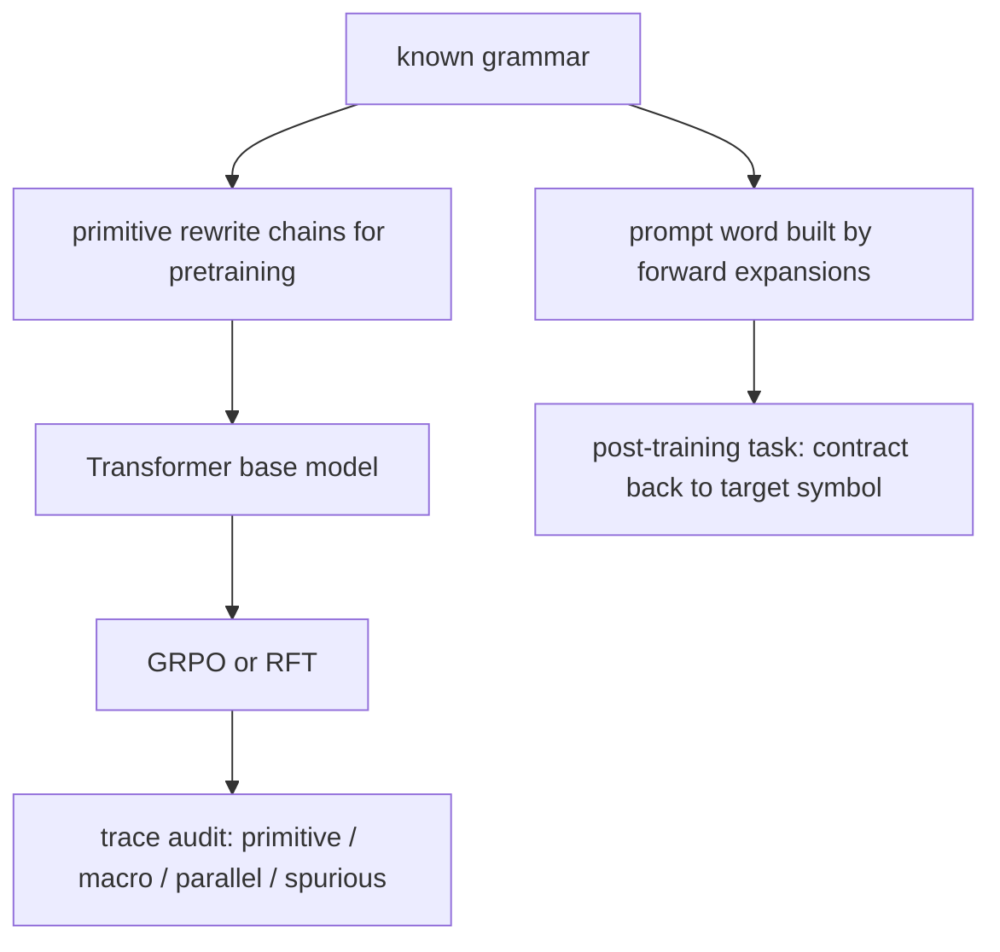

# RL Post-Training Builds Compositional Reasoning Strategies：RL 后训练到底是在“重采样旧能力”，还是在“压缩出新策略”？

## 元信息

- 标题：RL Post-Training Builds Compositional Reasoning Strategies
- 作者：Azwar Abdulsalam、Nishil Patel、Andrew Saxe
- 类型：论文，arXiv:2607.07646v1
- 提交时间：2026-07-08 17:04:42 UTC
- 原文链接：https://arxiv.org/abs/2607.07646
- 主题归类：大模型后训练，RLVR，GRPO，组合式推理

## TL;DR

- 这篇论文想回答一个现在后训练争论里最尖锐的问题：RL 后训练到底只是把 base model 本来就会的路径重新加权，还是能把零散 primitive 技能压缩成更高阶、可复用的新策略。
- 作者没有直接在自然语言推理上做，因为那样很难逐步审计中间过程；他们构造了一个完全可观测的 rewrite grammar 环境，预训练只看 primitive rewrite chain，后训练只给 final-answer binary reward，从而把每一步行为都分成 primitive、macro、parallel、spurious 四类。
- 主要发现是：RL 的收益不是“前期就全面领先”，而是先强化 primitive contraction，再在大约 5k 到 12.5k iteration 之间进入组合化阶段，开始大量出现 macro contraction，之后再出现 parallel contraction。RFT 早期涨得更快，但后期平台化，RL 反而持续上升。
- 论文最有力的证据不是一句“RL better”结论，而是三层证据链：一，hard bucket 上 RL 在 `pass@16` 下能解 base model 在 `pass@1024` 仍几乎解不出的题；二，RL 的非 primitive 行为更多落在 valid macro/parallel，而 RFT 的 shortcut-like rewrite 很多是 spurious；三，预训练里只增加 primitive exposure 不够，必须把 contraction 组织成可连续出现的 reduction procedure，RL 才更容易把它压缩成组合策略。
- 方法论上的关键价值在于把“RL 超出 base model”这件事从黑盒现象变成白盒机制分析：作者不是说 RL 凭空发明了新知识，而是说 pretraining 提供弱程序性成分，RL 再把这些成分筛选、压缩、复用成可部署的 higher-level procedure。
- 局限也很明确：环境是合成 grammar，不是开放自然语言；奖励仍然是 outcome-only；Bucket 5 在固定评测表里被置零；RFT 与 GRPO 的结论依赖这个可审计环境的结构，不能直接外推成“所有 RLVR 都会形成宏规则”。

## 这篇论文真正关心什么问题？

### 争论点不是“RL 有没有提升”，而是“提升来自哪里”

- 现在很多 RLVR 论文都能报告 `pass@1`、`pass@k` 或 benchmark 分数提升。
- 但这些数字本身无法区分三件事：
  - 是不是只是把原本低概率但已存在的解法采样得更频繁。
  - 是不是在有限 token budget 下形成了更短、更高密度的新 procedure。
  - 是不是 exploit 了 outcome-only reward，用无效中间步骤碰巧走到了正确 final answer。

### 作者为什么不用真实数学或代码数据直接回答？

| 障碍 | 真实 LLM 推理里为什么难测 | 这篇论文怎么规避 |
|---|---|---|
| 中间步骤真假难判 | 自然语言 CoT 很难逐 token 机械验证 | 每个 rewrite 都可以对照 grammar 审计 |
| pretraining 来源不透明 | 无法知道某个技巧是否早在语料里出现 | pretraining 数据由已知 grammar 自生成 |
| 新策略与碰巧命中的边界模糊 | pass@k 只看终局，不看轨迹结构 | 把行为分成 primitive / macro / parallel / spurious |
| RL 与 imitation 差异难拆 | 不清楚是数据还是优化器导致差异 | RL 与 RFT 用同一 prompt 分布和 final reward |

### 论文的立场可以压成一句话

> base model 里可能有弱的 primitive ingredient，但 RL 能把这些 ingredient 组织成更短、更稳定、可复用的组合策略。

这句话很重要，因为它既反对“RL 只是纯重采样”，也避免夸张成“RL 凭空创造完全不在支持集里的神秘能力”。

## 环境与任务：作者把“推理”变成了可审计的 rewrite world

### Grammar 怎么定义？

- 字母表大小 `N = 20`。
- 每个 source symbol 会映射到 1 到 3 个 globally unique 的右侧字符串。
- 右侧字符串长度来自截断 Zipf 分布，范围 `[2, 6]`。
- 因为所有右侧字符串全局唯一，所以 contraction 是可逆且无歧义的。

### 两种 primitive 动作

| 动作 | 含义 | 例子 |
|---|---|---|
| expansion | 用某个右侧串替换一个 symbol | `b -> dff` |
| contraction | 把某个匹配到的右侧串缩回 source symbol | `dff -> b` |

每一步都写成：

```text
lhs_word | action | rhs_word
```

这样模型输出的不是一句答案，而是一条完整的 rewrite trace。

### 预训练与后训练分别学什么？



- 预训练阶段：
  - 模型只见到 primitive rewrite chain。
  - 数据生成器随机采样 expansion 或 contraction。
  - 不提供 macro rule 或 parallel rule 的直接演示。
- 后训练阶段：
  - prompt 从目标符号 `c*` 开始，多次 expansion 得到更长的 `w_prompt`。
  - 模型只看到 `w_prompt`，必须一步步输出 contraction trace，并让最终符号回到 `c*`。

### Difficulty 是怎么定义的？

- 不是按主题、知识点或样本来源定义。
- 而是按“最优 primitive contraction 解”是否超出 256-token generation budget 定义。

| 难度 | 定义 |
|---|---|
| Difficulty 1 | 最优 primitive 解能塞进预算 |
| Difficulty 2 | 比预算多 1 个 primitive contraction step |
| Difficulty 3 | 比预算多 2 个 primitive contraction step |

训练 mixture 为：

```text
60% Difficulty 1
20% Difficulty 2
20% Difficulty 3
```

评测则扩展到 held-out 的 Difficulty 1-6。于是，越难的 bucket 越要求模型找到“更短但仍合法”的 procedure，而不只是把 primitive trace 走得更勤。

## 方法主张：RL 学到的是“压缩 primitive 链”的组合策略

### 四类轨迹动作分类

| 类别 | 定义 | 论文想用它证明什么 |
|---|---|---|
| primitive contraction | 直接对应某条原始 grammar rule 的 contraction | base skill 是否被强化 |
| macro contraction | 把一串 sequential primitive contraction 压成一步 | 是否学到顺序组合式 procedure |
| parallel contraction | 把互相独立的 primitive contraction 合成一步 | 是否学到并行式 procedure |
| spurious | 不是 primitive，也不是合法 macro/parallel | 是否只是 reward hacking 或碰巧命中 |

### 一个非常直观的例子

- 假设 grammar 允许：
  - `dff -> b`
  - `ae -> c`
  - `bc -> a`
- 那么从 `dffae` 到 `a` 的 primitive 路径可能要三步。
- 如果模型直接把 `bae -> a`，这不是 primitive rule，但等价于顺序执行 `ae -> c` 再 `bc -> a`，作者称之为 macro contraction。
- 如果模型把 `dffae -> bc`，同时缩掉两个相互独立的部分，就是 parallel contraction。

这就是论文所谓的“procedural chunking”：不是新知识，而是把多步局部规则压成可重复调用的 chunk。

## RL 与 RFT：为什么作者强调“RFT 不是弱 baseline”？

### 奖励本身非常克制

后训练 reward 只有二值最终结果：

```text
r = 1, 如果:
  1. 整条轨迹格式合法
  2. 最终输出符号等于目标 c*

r = 0, 其他情况
```

- 不奖励任何中间步骤。
- 不给 process reward。
- 不给人工步骤标签。

这意味着所有 macro/parallel 行为都不是被显式教出来的，而是从优化动态中长出来的。

### GRPO 的组内相对优势

```text
给定同一 prompt x 的 G 个 rollout:

  mu = (1/G) * Σ r_i
  sigma = std(r_i)
  A_i = (r_i - mu) / (sigma + δ)
```

- 如果同组里有人成功、有人失败，就会形成对比信号。
- 作者后面进一步把一个 feature `F(τ)` 放进组内成功/失败对比，推导出 GRPO 更新方向取决于：

```text
ΔF = k+ / n - k- / (G - n)
```

其中：

- `k+` 是成功轨迹里包含某 feature 的个数。
- `k-` 是失败轨迹里包含该 feature 的个数。
- `n` 是成功 rollout 数。

作者借此解释：如果某种 rewrite 更多出现在成功组、而不是失败组，GRPO 会系统性上调它；如果只是失败轨迹里的“搭车动作”，就会被压下去。

### RFT 为什么是强对照？

- RFT 用同样的 prompt 分布。
- 也看同样的 final correctness。
- 差别只是：
  - GRPO 对成功/失败都通过相对优势产生信号。
  - RFT 只保留成功 rollout 做监督。

所以如果 RL 最后优于 RFT，解释不能偷懒成“RL 看到了更多数据”。

## 证据一：RL 真的把 held-out 能力边界往外推了

### Table 1 给出的 base model 上界很关键

作者先固定 base model，不做 RL，只增加采样预算，评估 held-out over-budget bucket 的 `pass@k`：

| k | Overall | Bucket 1 | Bucket 2 | Bucket 3 | Bucket 4 | Bucket 5 |
|---|---:|---:|---:|---:|---:|---:|
| 64 | 11.25% | 50.0% | 6.25% | 0.0% | 0.0% | 0.0% |
| 128 | 13.75% | 50.0% | 12.5% | 6.25% | 0.0% | 0.0% |
| 256 | 13.75% | 50.0% | 12.5% | 6.25% | 0.0% | 0.0% |
| 512 | 15.0% | 56.25% | 12.5% | 6.25% | 0.0% | 0.0% |
| 1024 | 17.5% | 62.5% | 18.75% | 6.25% | 0.0% | 0.0% |

这张表的含义不是“base model 很差”这么简单，而是：

- 即使把采样预算开到 `pass@1024`，Buckets 4-5 仍是 `0%`。
- Bucket 3 也只有 `6.25%`。
- 因此，hard bucket 的完整解法并不是“本来就在 base model 里，只是你没多抽几次”。

### RL 后训练的提升是延迟出现的

正文对 Figure 5 的总结是：

- iteration 0 时，base model 对 Difficulty 1 还有非零成功率。
- 对 Difficulty 2 及以上几乎为零。
- 到 iteration 20k 时，RL 达到：
  - Difficulty 1 接近饱和；
  - Difficulty 2 约 `80%`；
  - Difficulty 3 约 `75%`；
  - Difficulty 4 约 `60%`；
  - Difficulty 5 也出现非平凡成功率。

### 为什么“延迟 crossover”很重要？

- RFT 在前期涨得更快。
- RL 起步更慢。
- 但越难的 bucket，RFT 越早平台化，而 RL 越晚反超。

这说明 RL 的强项不是“更快复制已有成功样本”，而是到后期逐步形成更短、更结构化的 procedure。

## 实验设置：这篇论文为什么能把“机制”说得这么硬？

### 模型、数据和算力都相对克制

| 项目 | 论文设置 |
|---|---|
| base model | 12 层 Transformer，hidden dim 512，8 heads，MLP expansion 4 |
| 位置与训练细节 | RoPE、QK normalization、logit tanh soft-cap、AdamW、peak LR `8e-4` |
| 训练序列长度 | 512 |
| 后训练算法 | GRPO 对比 RFT |
| GRPO 采样组大小 | `G = 4` |
| 采样温度 / top-k | `0.8` / `5` |
| 最大生成长度 | 256 tokens |
| 训练硬件 | `4 x NVIDIA H100` |

这个配置的重要性在于，它不是靠超大模型或夸张采样预算堆出来的。作者反而故意把问题收紧在一个可完全审计的中小规模环境里，让“行为类别变化”比“绝对分数”更有解释力。

### prompt 生成也经过了刻意控制

- 后训练 prompt 不是来自真实题库，而是从目标 symbol `c*` 出发，多次 forward expansion 得到。
- 模型在推理时看不到这些 expansion path，只能看到最终的 `w_prompt` 和 target。
- 这意味着：
  - 训练目标不是背路径。
  - 也不是把现成 demonstration 直接模仿回来。
  - 它更像给模型一个“必须在固定 budget 内把结构压缩回来”的环境。

### Appendix D 的三个 toy prompt 很说明问题

作者在附录里手工展示了 Difficulty 1、2、3 的例子。虽然正文只把它当 exposition，但它非常有助于理解为什么“组合 shortcut”是必要的。

| 难度 | primitive 最优步数与预算关系 | 论文想说明什么 |
|---|---|---|
| Difficulty 1 | 恰好塞进预算 | primitive chain 本身还能用 |
| Difficulty 2 | 比预算多 1 步 | 只要能压掉一个局部链，就可能翻过边界 |
| Difficulty 3 | 比预算多 2 步 | 必须更系统地压缩 procedure，不能只靠偶然 shortcut |

这也是为什么作者一直强调“hard bucket 的价值不在于更难，而在于 primitive path 与 budget 的错位更严重”。

## Figure / Table 逐项读：作者到底用哪些图支撑主张？

### Figure 1：它不是装饰图，而是整篇论文的识别框架

Figure 1 分成五块：

1. `a`：symbol 到右侧串的 mapping。
2. `b`：pretraining chain 的序列结构，上一条输出会成为下一条输入。
3. `c`：每个训练 triple 如何编码单步 primitive rewrite。
4. `d`：post-training prompt 如何由 target symbol 正向展开而来。
5. `e`：difficulty 如何由“超出 256-token budget 的 primitive contraction 步数”定义。

这张图的重要性在于，它把“可审计环境”说得非常具体。没有这套图，后面所有 primitive / macro / parallel / spurious 的划分都只是概念；有了它，读者能明确知道每类行为是相对什么规则系统定义的。

### Figure 2：phase transition 是全文最关键的动态图

作者把成功轨迹中的动作类别随 iteration 的变化画出来，得到一个非常强的时间顺序：

- primitive contractions 先上升并主导早期成功样本；
- macro contractions 在约 5k iteration 后明显抬头；
- 到约 12.5k iteration 左右，macro 超过 primitive；
- parallel contractions 再晚出现，但其增长是持续的，而不是一次性噪声。

如果没有这张图，读者很容易把论文读成“RL 最终比 RFT 分数高”。有了这张图，作者才能提出更具体的解释：RL 的学习不是单阶段，而是先把 primitive reduction 做稳，再把局部步骤压缩成更高阶 procedure。

### Figure 3：discovery 与 reuse 被分开测量

这张图其实在回答一个很难但很关键的问题：

- 你看到更多 macro contraction，是因为模型每次碰运气随机压了一步？
- 还是因为它真的形成了一套会被再次调用的规则库？

作者用三条曲线回答：

- 新 macro rule 数在中期达到峰值，说明 discovery 不是训练一开始就结束。
- 已发现 rule 的 reuse count 后面持续上升，说明不是“一次性发现，一次性用掉”。
- reuse fraction 在训练末期很高，说明多数 macro action 来自既有 repertoire，而不是全靠 fresh luck。

这组图把“随机 shortcut”与“稳定技能库”区分得很干净，是整篇论文最有说服力的结构性证据之一。

### Figure 4：RFT 的失败不是不会探索，而是探索太脏

Figure 4 的逻辑很容易被忽视。作者不是在比“谁的 non-primitive action 数更多”，而是在比：

- valid macro / parallel 的累积；
- spurious contraction 的累积；
- spurious 在全部 non-primitive 行为中的占比。

结论是：

- RFT 也会朝 shortcut 方向移动。
- 但它产生的 shortcut 有更高比例落在无效区域。
- RL 的真正优势不是“更放得开”，而是“更能把探索压到合法结构里”。

这正好呼应前面的 `ΔF` 推导：同 prompt 组里的成功/失败对比，会系统性放大成功组里更常见的 feature，并压低失败组里常见的 passenger action。

### Figure 5 与 Table 1 是配对使用的

很多读者可能只看 Figure 5 的后训练曲线，但作者把 Table 1 放在前面，其实是在先固定一条基准线：

- 如果 base model 在 `pass@1024` 下都几乎摸不到 Buckets 4-5，
- 而 RL 后来能在 `pass@16` 下稳定碰到这些 bucket，
- 那么“只是采样更多次”这个解释就明显不够了。

因此，Figure 5 不是单独成立的；它必须和 Table 1 一起看，才构成“finite-budget frontier expansion”的完整论证。

### Figure 6：为什么它是最关键的因果证据

Figure 6 做的是 pretraining substrate 消融。它不是只问“高 `ρ` 有没有更好结果”，而是更强地问：

- 如果我让 overall contraction fraction 看起来差不多，
- 但拿掉 local contraction reweighting 与 contraction chaining，
- 后续 RL 还能不能长出 macro / parallel strategy？

答案是否定的。matched-fraction control 虽然在 aggregate 上接近 `ρ = 2`，但动力学更像低 `ρ`。这相当于说明：

- 不是见过多少 contraction 决定一切；
- 而是 pretraining 是否让模型习惯进入一种连续 reduction mode。

这个结论对现实世界很有启发，因为它暗示后训练能不能“压缩出新策略”，可能深受 pretraining 里局部程序结构的影响。

## 证据二：RL 不是更会乱试，而是更会把乱试筛成合法结构

### Figure 2：先 primitive，后 macro，再 parallel

作者最核心的动态图像是：

1. 训练早期，成功轨迹里主要是 primitive contraction。
2. 大约从 5k iteration 开始，macro contraction 上升。
3. 大约到 12.5k iteration 左右，macro 超过 primitive。
4. parallel contraction 再晚一些出现，但之后稳步增长。

这个节奏对应的解释是：

- 第一阶段先把局部 primitive reduction 稳住。
- 第二阶段开始压缩 ordered chain，形成 macro。
- 第三阶段开始把独立局部缩并成 parallel。

### Figure 3：不是偶发 shortcut，而是“发现后复用”

作者把 macro 进一步拆成两个对象：

- macro action：一次具体出现。
- macro rule：可被多次复用的底层 rewrite pattern。

Figure 3 讲了三件事：

| 图 | 观察 | 含义 |
|---|---|---|
| 新 macro rule 数 | 约在 10k iteration 左右达到 discovery peak | RL 持续发现新 chunk |
| 已发现 macro rule 的 reuse count | 随训练明显增长 | 不只是发现，还在复用 |
| reuse fraction | 训练末期大多数 macro action 都来自已见 rule | 形成稳定 repertoire |

这一步很关键，因为它把“偶然跳步”与“可部署能力”区分开了。可重复调用的宏规则，才更像真正的 procedural abstraction。

### Figure 4：RFT 也会 shortcut，但很多是 spurious

论文非常克制的一点是：它并没有把 RFT 描述成“什么都不会”。

- RFT 也会产生 macro contraction。
- RFT 也会产生 parallel contraction。
- 但 RFT 的 spurious contraction 更多，spurious ratio 长期更高。

因此作者的结论不是“RL 比 RFT 探索得更多”，而是：

> RL 把非 primitive 探索更集中地筛进 valid reusable structure，RFT 则保留了更多无效 shortcut。

这也是他们把机制概括成 `selection, not exploration volume` 的原因。

## 证据三：决定后续 RL 能否长出组合策略的，是预训练里 procedure 的组织方式

### 预训练里有个关键超参数 `ρ`

作者在预训练数据生成器里用 `ρ` 局部上调 contraction move 的权重。

它不是直接规定“全局 contraction 比例”，而是在每一步可选 expansion / contraction 时，对 contraction 额外加权：

```text
Pρ(C | w)
= ρ * Σ q(a), a ∈ C(w)
  -----------------------------------
  Σ q(a), a ∈ E(w) + ρ * Σ q(a), a ∈ C(w)
```

高 `ρ` 会带来两种变化：

- contraction 在局部更容易被采样到；
- 更重要的是，更容易形成连续 contraction chain，也就是 reduction mode。

### matched-fraction control 是最关键的消融

作者专门构造了一个控制组：

- 它让 overall contraction ratio 看起来和 `ρ = 2` 接近。
- 但它不保留“每当 contraction 可用时就局部重加权”的链式结构。

结果是：

- 这个控制组虽然总 contraction 数接近，
- 但 macro / parallel emergence 的动力学更像低 `ρ`，
- 明显不如真正高 `ρ` 的预训练。

### 这个结论意味着什么？

| 可能解释 | 论文是否支持 |
|---|---|
| 只要 pretraining 见过足够多 primitive contraction，RL 就会自动组合 | 不支持 |
| 只要 marginal contraction frequency 一样，后续 RL 会一样 | 不支持 |
| pretraining 必须把 primitive competence 组织成连续 reduction procedure，RL 才更容易压缩 | 支持 |

这一步把“ingredient”与“procedure substrate”区分开了。作者认为，RL 的后期突破更依赖后者。

## 这篇论文最值得带走的机制判断

### 可以把作者的论证路线写成四步

```text
claim:
  RL 不只是重采样旧路径，而是把 weak primitive ingredients
  组织成更高阶 procedure。

mechanism:
  先强化 primitive reductions，
  再发现 sequential macro，
  再引入 parallel contractions，
  并把它们复用成稳定 repertoire。

evidence:
  1. pass@16 在 hard held-out bucket 上超出 base pass@1024 frontier；
  2. RL 的 non-primitive 行为更多是 valid macro/parallel，
     RFT 的 spurious 比例更高；
  3. 预训练只有在 procedure 结构上组织得当时，
     RL 才更容易长出这些组合策略。

boundary:
  结论来自可审计合成 grammar；
  不能直接外推成自然语言推理中同样 taxonomy 必然存在。
```

### 为什么这个判断对今天的后训练讨论重要？

- 它给了一个更精确的中间立场：
  - 不是“RL 纯粹 beyond support”。
  - 也不是“RL 只会把已有轨迹重采样得更频繁”。
- 更像是：
  - pretraining 提供弱支持的局部操作和短链条；
  - RL 在 outcome-only 奖励下，靠组内对比把其中一部分操作筛成更短的 chunk；
  - chunk 一旦形成，就会反过来扩展有限 budget 下可达的解空间。

## 局限、失败边界与还没被证明的部分

### 论文自己承认的边界

- 这是 controlled grammar，不是开放自然语言。
- Figure 里的 phase transition 和 taxonomy 未必一比一映射到真实数学 CoT。
- RFT 在这里已经很强，所以“RL 独有”不能被解读成 RFT 完全无用。
- reward 只看 final answer，well-formedness 检查主要是格式和链条可解析，不保证每一步都天然有语义价值。

### 我认为还需要更谨慎的三点

1. “valid composition” 是相对 grammar 定义的，不是相对真实世界任务定义的。
2. 论文证明了 finite-budget frontier expansion，但没有证明无 budget 时 RL 学到的是更一般的抽象推理能力。
3. pretraining ablation 说明 procedure substrate 很关键，但还没告诉我们在真实 LLM 里，什么预训练统计量最接近这里的 `reduction chaining`。

### 还有一个容易忽略的边界：well-formed 不等于 fully semantically valid

- 附录 B 里写得很清楚，reward 要求 trajectory 是 well-formed triple sequence，且最终符号正确。
- “well-formed”主要指：
  - 能被解析成 `lhs_word | action | rhs_word`；
  - 前一步的 `rhs_word` 与下一步的 `lhs_word` 能连起来。
- 它并不直接保证每个中间 rewrite 都有独立的任务语义。

也就是说，这篇论文虽然比自然语言 CoT 审计强得多，但它仍然不是“每个中间步骤都由 reward 显式监督”的环境。作者真正证明的是：在这样一个 outcome-only、但可审计的世界里，RL 更容易把行为压到 valid macro/parallel，而不是任由 spurious rewrite 泛滥。

## 没找到什么第三方长文，这件事本身也说明了什么？

- 我这轮按标题和 arXiv ID 检索，没有发现成型的第三方长文解读。
- 这恰好使论文的一手材料更重要，因为：
  - 关键数字散落在正文、Table 1 和 Appendix；
  - 预训练消融的真实含义要结合附录 C 的生成机制才能看清；
  - 如果只看 abstract，很容易把论文误读成又一个“RL 比 RFT 强”的普通实验报告。

换句话说，这篇论文的价值主要不在 headline，而在它把 RL 后训练机制拆到了能被逐层审计的程度。

## 研究者视角的延伸：这篇论文会怎样改变我们看 RLVR？

### 对 Agent / reasoning 后训练的直接启发

- 如果任务的难点本质上是“步骤预算不够”，那么 RL 的优势很可能来自 chunk discovery，而不是答案层面的暴力重采样。
- 如果 base model 里完全没有相关局部操作，RL 也很难从零长出 procedure；这和论文对 support/ingredient 的谨慎表述是一致的。
- 未来做 reasoning RL 时，比起只问“分数涨没涨”，更应该追问：
  - 新行为是不是可审计。
  - 新行为是不是可复用。
  - 新行为是不是在 hard budget regime 才出现。

### 我最想继续追问的三个问题

| 追问 | 为什么重要 |
|---|---|
| 在真实数学、代码、工具使用任务里，能否构造接近 primitive/macro/parallel/spurious 的可审计 taxonomy？ | 决定这篇论文的外推价值 |
| RFT 若配合更强的对比负样本筛选，是否也能逼近 RL 的“选择性”而不是停在平台期？ | 决定 RL 优势究竟来自 policy gradient 还是来自更好的 contrastive filtering |
| 哪些 pretraining 统计量最能预测后续 RL 会不会形成 chunk？ | 决定 post-training 是否应该反过来指导 pretraining curriculum |

### 对真实 token budget 问题的一个直接类比

- 数学推理里，很多失败不是“完全不会”，而是 trace 太长、太绕、太容易把有效信息淹没。
- coding agent 里，很多失败也不是“工具不会调”，而是把本该合并的局部动作拆成了太多无效往返。
- 这篇论文提供的最有价值类比是：
  - 如果 pretraining 已经给了局部可用的 primitive 操作，
  - 那么 RL 的潜在价值可能不是把每个 primitive 变得更准一点，
  - 而是学会把多个 primitive 压缩成更短、更稳、更可复用的程序块。

这个视角会直接影响我们怎么看长 CoT、tool-use trace、以及“高分是不是只是更会采样”的争论。

## 结论

- 这篇论文最强的地方，不是又报告了一个“RL 胜过 baseline”的分数，而是把“胜在哪里”拆成了可审计的机制链条。
- 它给出的答案并不神秘：RL 先放大 primitive reduction，再把局部操作压缩成 macro / parallel chunk，最后把这些 chunk 复用成稳定 repertoire，于是 hard bucket 在有限 token budget 下变得可解。
- 从这个意义上说，RL 后训练确实可以“超出 base model”，但超出的方式不是凭空创造，而是把弱支持的 procedural ingredient 变成可复用的结构化策略。
