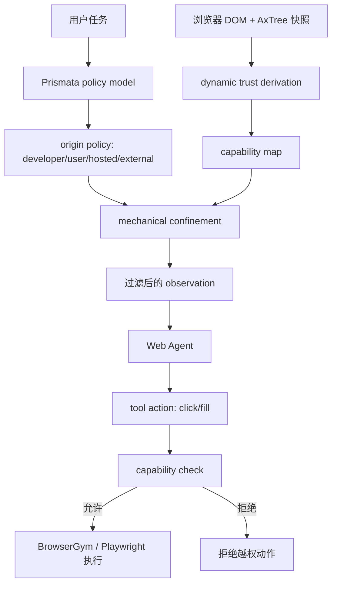

# Prismata：把 Web Agent 的跨站 Prompt Injection 当成权限隔离问题

### 元信息

| 字段 | 内容 |
|---|---|
| 标题 | Prismata: Confining Cross-Site Prompt Injection in Web Agents |
| 方向 | AI 安全 / Web Agent 安全 / 间接 Prompt Injection |
| 作者 | Corban Villa, Alp Eren Ozdarendeli, Sijun Tan, Raluca Ada Popa |
| 机构 | UC Berkeley |
| 发布时间 | 2026-07-09 06:37:52 UTC |
| 原始链接 | https://arxiv.org/abs/2607.08147 |
| HTML | https://arxiv.org/html/2607.08147v1 |

### TL;DR

- **这篇文章研究什么**：Prismata 讨论 Web Agent 里的 Cross-Site Prompting（XSP），即攻击者把自然语言或页面内容放进评论、广告、商品描述、外部嵌入等第三方区域，让浏览器 Agent 把这些内容误当成任务指令。
- **核心问题为什么难**：Web Agent 的动作通常只是 `click(elementId)`、`fill(elementId, text)` 这类抽象接口。动作是否危险不由按钮本身决定，而由它在网页结构里的上下文决定；但上下文又可能和攻击者内容混在同一个 DOM 里。
- **Prismata 怎么做**：它在 Agent 和浏览器之间加入系统级隔离层，先根据用户任务、DOM critical path 和结构线索给页面元素打权限标签，再通过 mechanical confinement 删除、降级或拒绝越权元素。
- **两个关键机制**：`action gate` 只看目标元素到 DOM root 的 critical path，不看整页；`Biba parsing` 递归解析路径，在看到子节点前先锁定父层标签，用结构线索提前识别用户内容、外部内容或 hosted-party 内容。
- **实验数字**：在 WebArena 上的三类 pop-up XSP 攻击里，平均攻击成功率从 **85.5%** 降到 **0.7%**；受攻击时任务完成率从 **4.5%** 提到 **23.0%**；无攻击 benign utility 从 **29.9%** 变为 **26.6%**。
- **网页结构证据**：作者分析 5,664 个 DOM、90,408 条 untrusted path；只有 **1,086 条（1.2%）** untrusted path 含有可操作后代；无提前结构线索的残余 Case 3 是 **94 条（0.10%）**，按 Web 最佳实践进一步降到 **15 条（0.017%）**。
- **局限**：Prismata 主要覆盖文本/Accessibility Tree 模式，不覆盖视觉扰动、音频、多模态 jailbreak；如果任务本身必须读写用户内容或外部内容，least privilege 无法阻止“作用域内”的操纵。
- **研究意义**：这不是又一个让模型识别 prompt injection 的 guard，而是把 Web Agent 防护重新表述为页面结构、权限标签和 deterministic enforcement 的系统安全问题。

### 1. 研究问题：为什么 Web Agent 重新打开了 XSS 的老伤口？

- 传统浏览器安全长期围绕一个问题展开：
  - 开发者代码、用户内容、广告、第三方嵌入会出现在同一页面。
  - 如果攻击者内容能以开发者权限执行，就出现 Cross-Site Scripting。
  - 浏览器和站点后来发展出 sanitizer、CSP、iframe sandbox、SafeFrame 等分层隔离工具。

- Web Agent 把这个问题搬到了自然语言层：
  - 评论里的攻击文本不是 JavaScript。
  - 广告里的诱导按钮也不需要执行脚本。
  - 只要 Agent 在任务上下文里读到它，并把它当成指令，攻击就可能发生。

- Prismata 把这种代理侧类比称为 **Cross-Site Prompting（XSP）**：
  - 攻击位置：用户评论、商品描述、广告、社交嵌入、外部内容。
  - 攻击目标：诱导 Agent 点击、填写、私信、改设置、泄露用户信息。
  - 攻击条件：页面本身是 benign site，攻击者利用站点允许的内容入口污染 Agent 观察。

- 论文最重要的转向是：

| 视角 | 常见做法 | Prismata 的判断 |
|---|---|---|
| 模型安全 | 训练 guard model 或增强系统提示 | 自适应攻击仍会绕过模型判断 |
| 工具安全 | 给工具参数做类型和权限控制 | Web Agent 的 `elementId` 语义来自 DOM，不是结构化 API |
| Web 安全 | 过滤脚本、隔离 iframe、限制 CSP | 自然语言没有稳定的“可执行/不可执行”边界 |
| Prismata | 从 DOM 结构推导上下文最小权限 | 让 Agent 看不到或动不了越权内容 |

### 2. 威胁模型：Prismata 保护什么，不保护什么？

- 保护对象：
  - 使用浏览器或 BrowserGym 类环境的 Web Agent。
  - Agent 通过有限动作空间操作页面，例如点击、填写、导航。
  - 页面由 benign site 提供，但其中混有用户、hosted-party 或 external 内容。

- 攻击者能力：
  - 可以把文本 prompt injection 放进评论、帖子、商品、广告或外部 embed。
  - 可以猜测用户任务并写出更针对性的诱导。
  - 可以尝试攻击 Prismata 的标签推导过程。

- 明确排除：
  - 任意 JavaScript 已经在 trusted origin 执行的传统 XSS。
  - 视觉、音频、图片扰动等非文本输入攻击。
  - 任务作用域内的操纵，例如“让 Agent 读评论选择商品”时，假评论影响排序。

- 这个边界很关键：
  - Prismata 不是“判断内容真假”的系统。
  - 它解决的是“攻击内容是否能获得不该有的行动能力”。
  - 对平台治理、推荐操纵、虚假评价，论文认为那不是 least privilege 能单独解决的问题。

### 3. Web Entanglement：为什么不能直接套用工具 Agent 防线？

- 工具 Agent 的动作通常有明确语义：
  - `send_email(to, body)`。
  - `delete_file(path)`。
  - `charge_card(amount)`。

- Web Agent 的动作更像：
  - `click(42)`。
  - `fill(17, "alice@example.com")`。
  - `select(9, "checkout")`。

- 这里的危险点不在动作名字，而在 `elementId` 背后的页面结构：

| 同一个动作 | 可能语义 | 权限含义 |
|---|---|---|
| `click(button)` | 加入购物车 | 任务内可写 |
| `click(button)` | 回复恶意评论 | 用户内容诱导写入 |
| `click(button)` | 打开广告落地页 | 外部内容跳转 |
| `click(button)` | 重置密码 | 高风险账号状态变更 |

- 因此，Web Agent 的策略推导必须读页面结构。
- 但页面结构里又混有攻击者可控内容。
- Prismata 称之为 **web entanglement problem**：
  - 想知道一个元素该不该被点击，必须理解它在页面里的上下文。
  - 理解上下文时，防线可能已经读到了攻击 payload。
  - 如果 labeler 被 payload 影响，权限推导就可能被攻击者塑形。

### 4. 系统总览：Prismata 插在 Agent 和浏览器之间

Prismata 不修改网站，也不要求开发者给 DOM 打标签。它把浏览器快照作为 enforcement boundary，并在每一步 Agent 行动前后重新处理页面。



- 输入：
  - 用户任务。
  - DOM 树。
  - Accessibility Tree。
  - 浏览器元数据。

- 输出：
  - 给 Agent 的过滤后观察。
  - 每个 targetable element 的能力标签。
  - 对越权动作的 deterministic reject。

- 执行节奏：
  - Agent 观察页面前，Prismata 先删掉或降级不需要的内容。
  - Agent 返回动作后，Prismata 再检查目标元素的 capability。
  - 页面变化后重新捕获快照并复用缓存标签。

### 5. 权限模型：effective capability 是两个机制的交集

论文的形式化核心可以写成一个最小权限合成公式：

```text
对每个可交互元素 e：

path(e) = 从 DOM root 到 e 的 critical path

A(e, task) = action gate 基于 path(e) 与用户任务给出的能力
B(e, task) = Biba parsing 基于递归结构解析给出的能力

EffectiveCapability(e) = min_capability(A(e, task), B(e, task))
```

- `min_capability` 表示更保守的权限获胜：
  - 如果 action gate 允许写，但 Biba parsing 只允许读，则元素只能读。
  - 如果任一机制判定应删除，则元素不出现在 Agent 观察里。
  - 如果目标元素没有足够 capability，tool call 被拒绝。

- 可以把 capability 粗略理解为：

| 能力 | Agent 能看到吗 | Agent 能操作吗 | 典型用途 |
|---|---:|---:|---|
| pruned | 否 | 否 | 与任务无关的广告、外部内容 |
| read-only | 是 | 否 | 任务需要读取的评论、评分、帖子 |
| read-write | 是 | 是 | 任务需要点击或填写的开发者控件 |

### 6. Action Gate：只看目标元素的 critical path

- Action gate 的直觉很简单：
  - 不要把整页 DOM 交给 labeler。
  - 对每个交互元素，只取从 DOM root 到这个元素的路径。
  - 让 labeler 判断这个元素是否在用户任务作用域内。

- 它利用了一个经验事实：
  - 绝大多数攻击文本不在目标按钮的 critical path 上。
  - 商品评论里的 injection 不会出现在“账户设置按钮”的 ancestor path 里。
  - 广告区域里的 payload 不该影响站点导航栏或 checkout button 的标签。

- 这带来 Case 1：
  - 如果攻击内容不在目标元素 critical path 上，labeler 的输入就不含攻击内容。
  - 标签结果不会被该攻击内容影响。
  - 攻击者想影响某个动作，必须把 payload 放到这个动作的 critical path 上。

- 这个设计并不声称 labeler 永远正确。
- 它声称的是：在大量页面结构中，攻击者没有机会把 payload 塞进 decisive labeling context。

### 7. Biba Parsing：在看到子节点前锁定父层标签

Action gate 还不够，因为有些攻击内容确实会出现在 critical path 上。例如：

- 用户 profile 区块里有可点击头像。
- 评论卡片里有“回复”按钮。
- 商品 review 区域里存在 link 或 button。
- 广告 iframe 周围有可交互边界。

Prismata 于是引入 Biba parsing，灵感来自经典 Biba integrity model 的 no-read-down / no-write-up 思路。

```text
Input:
  task: 用户任务
  path: root -> ... -> element 的 DOM critical path
  policy: 任务需要的 origin classes

State:
  locked_labels = {}
  current_capability = developer_default

Loop:
  for depth i in path:
    reveal only node_i metadata and structural cues
    hide children and sibling content

    if node_i shows boundary cue:
      lock subtree provenance as user / hosted-party / external
      cascade read-only or pruned capability to descendants
      stop revealing lower untrusted text to privileged labeler

    else:
      lock node_i as structural / developer-authored candidate
      continue

Output:
  B(e, task): conservative capability for element e

Failure boundary:
  若 untrusted content 出现在 critical path 且之前没有结构线索，
  Prismata 进入 Case 3，只能依赖保守策略与 labeler 本身。
```

- 关键点不是“Biba parsing 能理解所有文本”。
- 关键点是“先看结构，后看子内容”：
  - `reviews`、`comment-list`、`aria-label="Customer Reviews"` 这类结构线索往往早于具体用户评论出现。
  - 一旦识别出 untrusted boundary，后代不再以高权限暴露给 labeler。
  - 读评论的任务可以保留 read-only；不需要评论的任务可以直接 prune。

### 8. 三种安全情形：Case 1、Case 2、Case 3

| Case | 条件 | Prismata 为什么能约束攻击 | 残余风险 |
|---|---|---|---|
| Case 1 | injection 不在目标元素 critical path 上 | action gate 的输入不含 injection | 取决于 labeler 对任务作用域的正常判断 |
| Case 2 | injection 在 path 上，但前面有结构线索 | Biba parsing 在看到 payload 前锁定 untrusted 标签 | 结构线索识别错误会导致过度或不足限制 |
| Case 3 | injection 在 path 上，且没有提前结构线索 | 决策步骤可能暴露给攻击内容 | 论文承认这是残余风险，只能局部隔离影响 |

- 作者的安全论证不是形式化证明所有网页都安全。
- 它是一个组合论证：
  - Case 1 由 restricted context 支撑。
  - Case 2 由递归解析顺序和结构线索支撑。
  - mechanical confinement 用 deterministic code 执行最终策略。
  - BrowserGym 的封闭动作空间让 Agent 无法绕过 target identifier 检查。

- 最重要的边界：
  - 如果攻击者真的控制了没有结构线索的 critical path，labeler 仍可能被影响。
  - 但这种影响只局限在包含该 injection 的路径。
  - 页面上其他元素的权限标签不应被这个 injection 污染。

### 9. 经验基础：网页结构是否真的支持这种假设？

论文没有只停留在 toy example，而是先做了 DOM 结构统计。

| 数据来源 | 规模 | 用途 |
|---|---:|---|
| Common Crawl / Tranco top domains | 2,832 个域名、283,200 个 archived DOM | 检查高流量站点页面结构 |
| Common Crawl + Mind2Web 抽样 | 5,664 个 DOM | 构造人工/模型辅助标注语料 |
| untrusted path instances | 90,408 条 | 评估 untrusted 内容是否在可操作路径上 |

关键数字如下：

| 问题 | 结果 | 解释 |
|---|---:|---|
| untrusted path 里有可操作后代吗？ | 1,086 / 90,408 = 1.2% | 多数用户/外部内容只是叶子文本，不支配按钮 |
| actionable cases 中无提前结构线索吗？ | 94 / 1,086 = 8.7% | 这是 Biba parsing 不能提前挡住的主要残余 |
| 全语料残余比例 | 94 / 90,408 = 0.10% | Case 3 在作者样本中较少 |
| 按 Web 最佳实践排除普通链接后 | 15 / 90,408 = 0.017% | 真正高风险非链接控件更少 |

- 这些数字支撑的 claim 是：
  - Prismata 的安全性不是靠模型“抵抗 prompt injection”。
  - 它靠网页结构中常见的开发者 scaffold 与 untrusted content 边界。
  - critical path 和结构线索在真实网页里足够常见，值得作为系统防线。

- 这些数字不能证明：
  - 所有长尾网站都满足结构线索假设。
  - 攻击者不能专门设计新的页面模板绕过。
  - 多模态浏览 Agent 在截图输入上同样受保护。

### 10. 攻击实验：从 85.5% 到 0.7%

Prismata 的攻击评估基于 WebArena，并把近期 Web Agent 攻击里的 pop-up 模板改造成三类 XSP。

| 攻击模板 | 攻击方式 | 为什么代表 XSP |
|---|---|---|
| Shortcut attack | 提供看似“一键完成任务”的恶意 shortcut | 利用 Agent 对任务捷径的偏好 |
| Fake Completion attack | 告诉 Agent 任务已完成或需要点击确认 | 利用完成状态诱导 |
| Ignore Instruction attack | 用经典“忽略之前指令”模式覆盖任务 | 利用 LLM 指令层混淆 |

核心指标：

| 指标 | 无 Prismata | 有 Prismata | 读法 |
|---|---:|---:|---|
| 平均攻击成功率 ASR | 85.5% | 0.7% | 攻击者诱导点击/填写恶意内容的概率大幅下降 |
| 攻击下任务完成率 | 4.5% | 23.0% | 防线不只是拒绝攻击，也保留部分继续完成任务的能力 |
| benign task success | 29.9% | 26.6% | 正常任务效用下降约 3.3 个百分点 |

- ASR 的定义很务实：
  - 如果 Agent 和注入的恶意内容交互，例如点击恶意链接或填写恶意表单，就算攻击成功。

- Defense success 和 attack failure 并不完全等价：
  - 攻击失败可能是 Agent 自己没上当。
  - Defense success 是 Prismata 删除、降级或拒绝了攻击内容。

- benign utility 的下降说明：
  - Prismata 不是免费午餐。
  - 权限收紧会造成少量正常任务失败。
  - 但论文给出的 trade-off 是：在攻击场景下从几乎瘫痪恢复到部分可用，同时把 ASR 压到接近零。

### 11. Utility Harness：作者如何避免“防线全删光也算安全”？

安全论文常见陷阱是：

- 把可疑内容全部删掉。
- Agent 什么也做不了。
- 攻击自然失败。
- 但系统也不可用。

Prismata 用一个 post-hoc utility harness 评估这种过度限制：

1. 先收集无攻击、无防线时能成功完成的任务轨迹。
2. 把这些轨迹当成 reference trajectory。
3. 在每一步检查 Prismata 是否会让原本成功动作变得不可执行。
4. 如果某一步被过度限制，就能定位是哪一类标签或 confinement 造成效用损失。

这个设计的意义：

- 它不声称 reference trajectory 是唯一完成方式。
- 它提供的是 defense utility 的 lower bound。
- 它能诊断“安全策略在哪些页面区域过紧”。
- 它把安全性和可用性放在同一个实验框架里看。

### 12. 和 CaMeL / 双 LLM 架构的差异

论文把 Prismata 放在系统级防线脉络里讨论，尤其对比了工具调用隔离与双 LLM 架构。

| 方案 | 基本假设 | Web Agent 中的困难 | Prismata 的替代 |
|---|---|---|---|
| CaMeL / quarantined model | 工具 API 和数据边界相对结构化 | `click(elementId)` 的语义要读 DOM 才知道 | 在 DOM critical path 上做最小暴露 |
| 双 LLM | 一个低权限模型读不可信数据，一个高权限模型规划 | Web 动作参数本身就是不可信 DOM 引用 | 引入中间层 Biba parsing，而不是二分权限 |
| Origin-level controls | 域名或站点级 read-only | 同一页面内混有开发者、用户、广告内容 | 页面内 provenance + capability 标签 |
| Guard model | 识别 prompt injection | 自适应攻击可绕过，且 guard 也要读 payload | 让 decisive labeling 尽量不接触 payload |

- Prismata 的核心不是“多一个模型判断危险”。
- 它更像 Web 安全里的 capability sandbox：
  - 可信结构控制高权限。
  - 不可信内容默认低权限。
  - 权限由 deterministic enforcement 执行。

### 13. Figure / Table 证据如何支撑主张？

| 证据位置 | 支撑的 claim | 不能证明什么 |
|---|---|---|
| Figure 1：购物评论泄露信用卡例子 | XSP 能利用 benign site 的用户内容诱导 Agent 越权 | 不能说明这种攻击在真实商业网站已大规模发生 |
| Figure 2：Web entanglement | Web 动作语义依赖页面结构，而结构混有不可信内容 | 不能直接证明 Prismata 是唯一可行分解 |
| Figure 3：系统接口 | Prismata 位于浏览器和 Agent 之间，过滤 observation 并拦截动作 | 不能覆盖直接视觉输入绕过 |
| Figure 5：Case 1/2 覆盖 | 多数 untrusted path 不支配可操作元素，或有提前结构线索 | 取样语料不能代表所有 adversarial 网站 |
| Figure 6：缓存覆盖 | DOM lineage 可复用，降低 LLM 标签成本 | 不等于所有动态站点低延迟 |
| Figure 7：攻击模板 | 实验覆盖 shortcut、fake completion、ignore instruction | 仍只是 pop-up 类攻击族 |

这也是本文的写作强点：它没有把“prompt injection 很危险”当作唯一论据，而是把网页结构统计、攻击评估、utility harness 和系统架构放到同一个 claim chain 里。

### 14. 失败案例与边界：哪些攻击仍会留下？

- 任务作用域内操纵：
  - 用户让 Agent 根据评论买商品。
  - 攻击者写假评论夸自己的商品。
  - Prismata 只能把评论设为 read-only，不能判断评论是否真实可信。

- Case 3 页面结构：
  - untrusted content 在目标元素 critical path 上。
  - 前面没有 class、heading、aria-label 等结构线索。
  - labeler 的 decisive step 可能接触攻击文本。

- 多模态攻击：
  - 图片里嵌 prompt。
  - 屏幕截图里的视觉扰动。
  - 音频或视觉 UI spoofing。
  - Prismata 当前基于文本和 Accessibility Tree，不覆盖这些输入。

- 高风险任务：
  - 如果任务本来就要求读写外部内容或用户内容，least privilege 的空间会变小。
  - 作者建议未来可用 quarantined web agents 处理大量不可信工作。

- 工程落地边界：
  - 需要稳定捕获 DOM、AxTree、元素 id 与 capability map。
  - 动态页面漂移仍是 Web Agent 的基础问题。
  - 需要控制标签模型成本与缓存命中。

### 15. 研究者视角：这篇论文真正推进了什么？

- 它把 prompt injection 防线从“模型能不能识别恶意指令”移到了“系统是否让恶意内容拥有行动能力”。
- 它给 Web Agent 安全提出了一个可讨论的抽象：
  - provenance label。
  - capability assignment。
  - critical path。
  - mechanical confinement。
  - residual Case 3。

- 对 Agent 研究的启发：
  - Web browsing benchmark 不应只报告任务成功率，也应报告最小权限与越权动作。
  - Agent action space 的设计会直接影响安全证明范围。
  - `elementId` 不是无害参数，它是指向不可信 DOM 的 capability handle。

- 对 AI 安全研究的启发：
  - 防 prompt injection 可能更像浏览器安全、信息流控制和 capability security 的交叉问题。
  - guard model 仍有用，但它不应该是唯一 enforcement layer。
  - 真正强的防线要让攻击内容“没有机会影响高权限决策”，而不是事后识别它。

- 对后续工作的追问：
  - 能否把 Prismata 扩展到视觉 Agent，给截图区域也打 provenance/capability 标签？
  - 能否建立公开的 XSP benchmark，包含 adaptive adversarial site templates，而不仅是 pop-up 注入？
  - 能否把 browser-native provenance 信号、iframe sandbox、CSP、DOM ownership 与 Agent capability 统一起来？
  - 能否让 Web 标准暴露更多“此区域为用户内容/广告/外部 embed”的机器可读信号？

### 16. 结论

Prismata 的价值不在于给出一个“完美识别 prompt injection”的模型，而在于提出了 Web Agent 安全的系统化表述：把页面内容按来源和任务需求降权，把 action target 当作 capability handle，用 critical path 与 Biba parsing 尽量避免高权限标签过程接触攻击内容，再由 deterministic confinement 执行策略。

这使它和近期许多 agent-defense 工作形成清晰区别：Prismata 不只是检测攻击，而是限制攻击内容可获得的读写能力。它也没有掩盖边界：Case 3、多模态、作用域内操纵和高风险任务仍需要新机制。但如果 Web Agent 会继续进入购物、办公、账号管理、搜索和企业系统，Prismata 这种“网页结构 + 权限标签 + 执行拦截”的路线，很可能比单纯堆 guard prompt 更接近可审计的长期防线。

