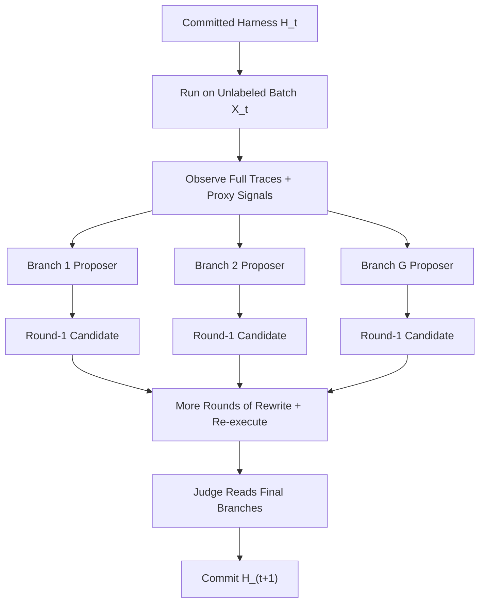

# TTHE：把 Agent 的测试时自适应对象从“权重”换成“可执行 Harness”

| 项目 | 内容 |
| --- | --- |
| 论文 | TTHE: Test-Time Harness Evolution |
| 方向 | 大模型 Agent |
| 类型 | 论文 + 代码仓库 |
| 发布时间 | 2026-07-09 |
| 原文 | [arXiv Abstract](https://arxiv.org/abs/2607.08124) |
| 全文 | [arXiv PDF](https://arxiv.org/pdf/2607.08124) |
| 代码 | [GitHub: junnie00/TTHE](https://github.com/junnie00/TTHE) |

## TL;DR

- 这篇论文研究的不是“怎样在测试时再微调一下模型”，而是把 Agent 在测试时真正会变化的对象改成 __可执行 harness__：也就是包在冻结模型外面的控制程序，负责拼上下文、调工具、做校验、失败恢复和多轮修补。
- TTHE 的核心循环是：面对一个无标签测试 batch，先让当前 harness 跑出完整执行轨迹，再让多个 proposer 根据轨迹重写 harness 代码，最后让一个 judge 只依赖执行证据与 proxy signal 选出一个最优 harness，继续带到下一个 batch。
- 它刻意不更新模型权重、不使用 gold label、不训练额外适配器；solver、proposer、judge 都围绕同一个冻结 backbone 工作，变化只发生在外层程序。
- 论文把这种设置跑在五类 execution-grounded 任务上：BIRD Text-to-SQL、LiveCodeBench、SWE-bench Verified、DS-1000 和 agentic tool-use benchmark `claw-eval`。报告的主结果包括 BIRD `12.0% -> 50.0%`、LiveCodeBench `30.0% -> 38.3%`、SWE-bench Verified `20.0% -> 35.0%`、DS-1000 `38.0% -> 44.0%`，以及 `claw-eval` 平均分 `48.9 -> 69.8`。
- 真正值得注意的不是“又涨了几分”，而是它把 Agent 的改进对象从一次性 response-level self-debug，提升成了 __可积累、可检查、可跨 batch 持续生效的程序策略__。论文里反复强调，演化出来的不是一个回答，而是一个会保留下来的工作流。
- 证据同时说明这条路远未稳定。作者用 oracle 分析发现，最终 judge 选中的 harness 只有 `50.0%`，但“如果从 judge 已经看到的候选池里事后用 gold 选最好一个”，可以到 `64.0%`；如果从所有曾经生成过的候选里选最好一个，可以到 `70.0%`。这意味着问题一半在 __没生成出来__，另一半在 __生成出来了却没选对__。
- 代码仓库当前公开的实现边界要单独说明：README 和 `tthe/` 目录主要落在 Text-to-SQL/BIRD 场景，论文中跨 competitive programming、SWE、DS-1000、tool-use 的完整复现实验脚手架并没有在这个仓库里同等完整公开。因此“论文证明了跨五域有效”与“当前仓库能直接复现五域”不是一回事。
- 如果把这篇论文放进 Agent 研究脉络里，它最重要的推进不是提出一个更强 prompt，而是提出一个新的测试时适应状态：__persistent executable harness__。这让“grounding、verification、repair”从手工写死的技巧，变成可由执行轨迹驱动、在评测时在线进化的程序对象。

## 研究问题：作者到底想改什么？

### 他们反对的默认设定是什么？

- 现有很多 Agent 系统默认把评测当成一个被动打分阶段：
  - 先在开发集上调 prompt、调工具调用顺序、调错误恢复逻辑。
  - 再把一个固定 workflow 带到测试集上。
  - 测试时最多做 response-level retry、reflection 或 self-debug。
- 作者认为这里浪费了一类非常强的信号：
  - 测试过程本身会产生完整执行轨迹。
  - 这些轨迹已经暴露了 Agent 为什么错。
  - 既然人类 harness engineer 会根据这些轨迹手改 scaffold，为什么不能让系统在测试时直接改 scaffold？

### 他们重新定义的问题是什么？

作者关心的问题可以压缩成一句话：

> 当模型权重冻结、gold label 不可见、也不引入额外训练好的适配模型时，Agent 能不能只靠自己在测试流里产生的执行轨迹，在线改写外围可执行程序，并把改进持续带到后续输入？

这和几类近邻工作有本质差别：

| 路线 | 适应对象 | 典型证据 | 持久性 | TTHE 认为的不足 |
| --- | --- | --- | --- | --- |
| Test-time training / entropy minimization | 模型参数或统计量 | 自监督损失、置信度 | 持久，但不可解释 | 很难表达复杂工具策略 |
| Reflection / Self-Debug / Self-Refine | 单次回答或短文本记忆 | 当前样本的失败 | 通常局部 | 不能稳定重写外围控制逻辑 |
| 开发时 prompt/workflow search | 预先设计好的 prompt 或流程图 | dev set 指标 | 部署前固定 | 真正遇到测试分布时不能继续改 |
| TTHE | __外层 executable harness__ | 执行轨迹 + label-free proxy | __跨 batch 持续__ | 代价是 proxy 不可靠，judge 可能选错 |

## 论文主张与论证路线

### Claim → Mechanism → Evidence → Boundary

| Claim | Mechanism | Evidence | Boundary |
| --- | --- | --- | --- |
| 测试时可以不改权重，只改 harness 也能提升 Agent | 把 harness 当成状态，做 batch-level proposer/judge 演化 | 五类 execution-grounded 任务上的主结果表 | 结果是 transductive，不等于已证明 forward generalization |
| 执行轨迹足以支持无标签改进 | proposer/judge 读取完整 trace，加上 execution health、round-trip consistency、public tests 等 proxy | 论文展示了 grounding、verification、repair 等 emergent policy | proxy 不是 oracle，会被“看起来合理”的错误 SQL 或代码骗过 |
| harness 演化比单次 response 修补更强 | harness 是 Python 程序，可加入多步检查、工具 probing、失败分支、后处理 | 仓库里的 `ReactHarness`、论文里的 SWE/Text-to-SQL 例子都体现“程序策略”变化 | 当前开源仓库主要公开了 Text-to-SQL 路线，五域实现披露不对称 |
| 性能瓶颈在候选覆盖和 judge 选择 | 论文做 pool oracle 与 all-candidate oracle 诊断 | `50 -> 64 -> 70` 的分层对比 | 仍缺多随机种子、compute-matched baseline 和 prequential 评估 |

## 方法机制：TTHE 的核心循环到底怎样工作？

### 1. 适应状态不是 prompt，而是 harness 代码

论文把 harness 定义成包裹冻结 solver 的外层程序。它可以负责：

- 如何构造上下文。
- 是否先探测数据库、代码库或工具状态。
- 是否做多样本采样。
- 是否运行 deterministic contract check。
- 是否在失败后进入 repair 分支。

作者在形式化里把 gold-only 的测量目标写成：

```text
J*(H) = E_(x,y)~D [ I[o_H(x) ≡ y] ]
```

其中：

- `H` 是 harness。
- `o_H(x)` 是 harness 在输入 `x` 上得到的输出。
- `≡` 不是字符串相等，而是任务特定正确性：
  - SQL 看执行结果集是否等价。
  - 代码看是否通过隐藏测试。

这一步的意义很关键：

- 作者明确把“正确性”留在 gold-only 的评测层。
- 真正的适应循环里不允许 proposer/judge 看到这些 gold。
- 因此论文不是把 reward 包装一下，而是有意研究“无 oracle 的 harness 选择”。

### 2. 优化信号来自完整执行轨迹，而不是单个分数

论文说每次运行会保留完整 trace，包括：

- prompt 与 completion。
- tool call 和 tool output。
- stdout / stderr。
- 中间 artifacts。
- runtime state。
- error 与 probe 结果。

然后再从 trace 派生几个轻量 proxy：

| Proxy | 记号 | 含义 | 解决什么问题 | 不能保证什么 |
| --- | --- | --- | --- | --- |
| Execution health | `s ∈ {0,1}` | 是否无错误、结果 shape 合法 | 过滤明显坏程序 | 能跑通不等于语义正确 |
| Round-trip consistency | `b ∈ [0,1]` | 把输出逆向描述回问题，再和输入匹配 | 检测语义漂移 | 高一致性不一定正确 |
| Public-test pass rate | `p ∈ [0,1]` | 公开样例/公开测试通过率 | 给代码和任务型场景一个直接但不完整的信号 | 过公开测试仍可能挂隐藏测试 |

作者特别强调：

- 这些 signal 不被压成唯一 scalar 再盲目最大化。
- proposer 和 judge 要看 __raw trace + proxy__。
- 理由是共享同一 backbone 的候选可能“多数一起错”，所以不能把共识当真相。

### 3. 真正的演化是 batch-level population search

论文中的一批数据 `X_t` 上，核心更新可以写成：

```text
H_(t+1) = J( X_t, { (H, τ_H) : H ∈ C_t } )
```

这里：

- `C_t` 是当前 batch 的候选 harness 集合。
- `τ_H` 是候选 `H` 在 batch 上跑出来的 trace。
- `J` 是 judge，只能看执行证据，不看 gold。

把这套流程展开，就是：



### 4. 为什么作者 insist on fixed lineage？

论文里有两个关键词：

- `Lineage`
- `Diversity`

具体含义是：

| 设计 | 论文里的作用 | 为什么重要 |
| --- | --- | --- |
| Fixed lineage | 每个 proposer 只改自己的父分支 | 让一个好策略能跨轮积累，而不是每轮重新采样丢掉 |
| Diverse roles | 不同 proposer 走 conservative repair / exploration / adversarial synthesis | 减少所有候选围着同一种错误一起打转 |
| Final-only judge | judge 只从最后一轮分支里挑一个 | 强迫系统同时解决“生成更好候选”和“最后挑对候选”两件事 |

这一点直接通向后面的 selection regret 分析，因为它把失败拆成两类：

1. 根本没生成出更好候选。
2. 更好候选生成了，但 judge 没选中。

## 代码仓库告诉了我们什么？

### 论文与仓库的边界并不对称

从公开仓库的 README、`tthe/`、`ase/` 与配置文件看，当前 repo 主要是一个 __Text-to-SQL / BIRD 的最小实现__，不是论文里所有域的完整统一发布。

| 证据 | 说明 |
| --- | --- |
| README 的目录结构 | `tthe/` 明确围绕 SQL harness、BIRD/demo dataset、SQLite 执行环境组织 |
| `config.example.yaml` | `dataset.name` 只给出 `demo` 和 `bird` |
| README “Adding another dataset” | 说明可以扩 Spider/custom SQL，但“other domains are out of scope for this repository” |
| `tthe/harness_base.py` | 抽象类名就是 `SQLHarness` |
| `tthe/agents/react.py` | baseline 是 bounded Text-to-SQL ReAct loop |

因此这里有一个非常值得记住的边界：

- __论文结论__：TTHE 作为思想，在五个 execution-grounded 域都有提升。
- __仓库现实__：当前最完整公开的是 Text-to-SQL 这一支，其他域更多停留在论文叙述和附录层面。

这不是小细节，而是可复现性判断里的核心证据。

### README 透露的运行范式

README 给出的主入口是：

- `python -m tthe.optimize`
- 关键参数是 `--batch-size B`、`--group G`、`--max-rounds R`
- 论文主 Text-to-SQL 运行使用 `B=10, G=3, R=3`

这与论文主实验里的最佳 SQL 配置一致，也就是：

| 参数 | 含义 | 论文里出现的角色 |
| --- | --- | --- |
| `B` | 一个 batch 里并发演化多少题 | 决定每次提交时证据量与可适应步数 |
| `G` | 每轮 proposer 数 | 决定分支多样性 |
| `R` | 演化轮数 | 决定同一 batch 内积累深度 |

### 基线 harness 不是口头上的 ReAct，而是可执行程序

`tthe/agents/react.py` 里 baseline 已经不是“单次问答”，而是一个 bounded SQL ReAct loop：

- 最多 `MAX_MODEL_CALLS = 6`。
- 每步只能输出 `ACTION: PROBE` 或 `ACTION: FINAL`。
- `PROBE` 会执行只读 SQL 看数据库。
- `FINAL` 会被立即执行检查；如果报错或空结果，下一轮继续修。
- 最后一轮强制给出 FINAL。

这点的重要性在于：

- TTHE 不是从“完全不会探测数据库”的极弱基线起步。
- 它起步点已经是一个合理的 interactive SQL agent。
- 所以提升来自 __让外层 scaffold 继续进化__，不是只从 zero-shot prompt 换到 ReAct。

### proposer / judge 在代码中是什么角色？

`tthe/proposer.py` 暴露出比论文正文更具体的实现信息：

- proposer 不是抽象 optimizer，而是会写 `.py` harness 文件的 coding agent。
- 分支角色是固定的三类：
  - conservative repair
  - independent exploration
  - adversarial audit and synthesis
- judge 的 prompt 明确写了几条硬规则：
  - 不准凭 SQL 或数字“看起来对”来判断。
  - 不准用候选间多数共识当证据。
  - 必须用 DB probe 验证。
  - Hint 被当作 authoritative ground truth。

这说明作者试图把 judge 的失误压低到“工具验证失败”，但后文诊断仍显示它没有被彻底解决。

## 实验设置：论文到底测了什么？

### 任务面

论文覆盖五类任务：

| 任务 | 指标 | 测什么 |
| --- | --- | --- |
| BIRD Text-to-SQL | 执行正确率 | schema grounding、aggregation、SQL 语义 |
| LiveCodeBench | hidden tests | competitive programming 风格代码生成 |
| SWE-bench Verified | hidden tests / issue resolution | 真实软件工程修补 |
| DS-1000 | hidden tests | data-science coding |
| claw-eval | graded rubric | 多服务 agentic tool use |

### 评测方式

- SQL 用 __执行结果集等价__。
- 代码任务用 __all hidden tests pass__。
- `claw-eval` 用 `[0,1]` 区间的 graded score。

论文还特别强调一个经常会被忽略的点：

- 这里是 __transductive__ setting。
- 一个 batch 上先用 label-free evidence 选出 harness。
- 再用这个被选出的 harness 在同一个 batch 上记分。

所以它证明的是：

- 在同一批未标注测试输入上，执行轨迹足以支持 harness 自适应并提升分数。

它还 __没有完全证明__：

- 这个 harness 在下一个未见 batch 上、在适应前就一定更强。

作者自己把这件事留给 future work，并指出需要 prequential scoring。

## 主结果：数字真正说明了什么？

### 跨任务主结果

| 任务 | Baseline | TTHE | 增量 |
| --- | --- | --- | --- |
| BIRD | 12.0% | 50.0% | +38.0 |
| LiveCodeBench | 30.0% | 38.3% | +8.3 |
| SWE-bench Verified | 20.0% | 35.0% | +15.0 |
| DS-1000 | 38.0% | 44.0% | +6.0 |
| claw-eval | 48.9 | 69.8 | +20.9 |

这些数字最值得怎样解读？

- BIRD 的增幅最大，但论文明确说这个 50 题 hard slice 是按 baseline 的失败样本构造的。
- 所以 `12 -> 50` 更像“恢复能力”证据，而不是一般分布上的直接排名。
- 跨任务之间的数据集、切片和选择条件不同，因此不能把这几组数字机械横比。

### 搜索预算消融

论文在 BIRD hard slice 上给出：

| G | R | 准确率 |
| --- | --- | --- |
| 1 | 1 | 46.0% |
| 1 | 3 | 40.0% |
| 3 | 1 | 44.0% |
| 3 | 3 | 50.0% |

作者从这里想证明的是：

- 增加轮数不是单调变好。
- 单一 lineage 可能把一个早期好候选越改越坏。
- 多分支 `G=3` 时，长一点的搜索深度才开始有价值。

这背后的研究含义是：

- harness evolution 不是“算力越大越好”的平滑问题。
- 它更像一个由 candidate coverage 与 judge reliability 共同限制的离散程序搜索。

### Batch size 消融

论文还给出：

| Batch size B | 准确率 |
| --- | --- |
| 5 | 44.0% |
| 10 | 50.0% |
| 25 | 38.0% |
| 50 | 44.0% |

这说明：

- 太小的 batch：每次 commit 证据太少，容易误判。
- 太大的 batch：虽然单次证据更多，但整个测试流上的适应步数变少。
- `B=10` 是它在证据量与适应频率之间找到的折中点。

### Cross-model 结果

论文还在同一个 BIRD hard slice 上重复：

| Backbone | Baseline | TTHE | 增量 |
| --- | --- | --- | --- |
| DeepSeek V4 Flash | 12.0% | 50.0% | +38.0 |
| MiMo V2.5 | 32.0% | 52.0% | +20.0 |
| Kimi K2.5 | 28.0% | 48.0% | +20.0 |

这个表要避免误读成“模型排名”。作者自己说了：

- 这个 slice 是按 DeepSeek baseline 失败构造的。
- 所以绝对分数不能用来给模型排座次。
- 这里要看的只是 __within-model gain consistently positive__。

## 作者最有价值的分析：收益到底丢在哪？

### 1. Accumulation 确实有用

论文比较了：

- 每个 batch 都从 baseline 重置。
- harness 被提交后跨 batch 累积携带。

结果是：

| 设定 | Overall |
| --- | --- |
| Accumulate | 50.0% |
| Reset each batch | 44.0% |

中间几个 batch 的差距更明显，说明：

- harness 的收益不只是“在一个 batch 上临时 overfit 一下”。
- 至少在作者这个设置里，warm start 会把前面 batch 学到的结构带到后面。

但作者也很谨慎：

- 这仍然不等于已经证明严格 forward generalization。
- 因为每个 batch 还是先适应再打分。

### 2. Selection regret 比我预期更重要

这是整篇论文最值得带走的诊断。

作者做了两个 gold-only 事后 oracle：

1. __Pool oracle__：只在 judge 实际看到的最终候选里，用 gold 选最好一个。
2. __All-candidate oracle__：在所有曾被生成过的候选里，用 gold 选最好一个。

结果是：

| 层级 | 准确率 | 说明 |
| --- | --- | --- |
| 实际 judge commit | 50.0% | 系统真实结果 |
| pool oracle | 64.0% | 已经生成了但 judge 没选对的部分 |
| all-candidate oracle | 70.0% | 再加上根本没进入最终候选池的覆盖缺口 |

这三个数的含义可以写成：

```text
总损失 = 候选覆盖不足 + 候选选择错误
70 - 64 = 6 分：主要是覆盖问题的一部分
64 - 50 = 14 分：主要是选择问题
```

更准确地说：

- 有相当一部分正确行为已经被生成出来。
- 但 judge 在不看 gold、只看 proxy 的情况下，会把“看起来合理”的错误程序选上去。
- 因此这篇论文的真正 bottleneck 不是 proposer 不会写代码，而是 __proxy quality + judge reliability__。

## Figure / Table 逐项证据解读

### Figure 1 支撑了什么？

- 它证明论文讨论的对象确实是 __within-batch population evolution__，不是一次性自反思。
- 从 `H_t` 到 `H_(t+1)` 的 carry-over 结构，是“persistent harness”这个 claim 的形式化支撑。
- 但 Figure 1 自身不能证明 proxy 足够可靠；这要靠后面的失败分析。

### Figure 2 支撑了什么？

- 它支撑“跨多 execution-grounded 域有增益”。
- 但不能支撑“所有域的增益可直接横比”，因为指标与切片不同。
- 尤其 `claw-eval` 是 graded score，不是 pass@1。

### Figure 3 支撑了什么？

- 它支撑“batch size 是非单调控制旋钮”。
- 这说明方法不是把搜索预算机械拉大就能稳定提分。
- 它间接支持作者后面的判断：代理评审和不完美 proxy 会放大搜索非单调性。

### Table 1 / 2 / 3 各自的意义

| 表 | 证明什么 | 不能证明什么 |
| --- | --- | --- |
| Table 1 | `G` 与 `R` 存在交互，diverse branches 有价值 | 不能把收益完全归因于 proposer 数量 |
| Table 2 | 方法不绑定单一 backbone | 不能做 backbone 排名 |
| Table 3 | 累积式 harness 比每 batch 重置更好 | 不能完全排除 batch-local specialization |

## 仓库与论文之间最值得警惕的张力

### 1. 论文说“same frozen backbone”，仓库里仍有 controller role

README 与代码表面上强调：

- solver、proposer、judge 都围绕同一个 frozen backbone。

但仓库配置里又出现：

- `solver_model`
- `controller_model`

这并不一定违背论文，因为 README 也说 proposer/judge 的调用可以 route 到同一 backbone；但它提醒我们：

- 开源实现允许把一致性检查器设成单独角色。
- 复现时必须明确到底是不是完全同模同参。
- 否则“无额外 teacher”这个 claim 会被工程实现稀释。

### 2. 代码里的 label-free reward 与论文正文的 proxy 叙述并不完全同一层

`tthe/evaluator.py` 里可以看到一个更偏 Text-to-SQL 的 label-free 评价：

- paraphrase invariance
- counterfactual sensitivity
- metamorphic consistency

而 `tthe/reward.py` 里又实现了另一类 execution-health composite：

- executes
- non-empty/sane
- filter-values-grounded
- right cardinality

这告诉我们两件事：

- 论文里的“execution health / round-trip consistency / public tests”是高层概念。
- 仓库中的具体 proxy 设计仍在演化，且带有明显 task-specific 痕迹。

因此如果有人试图把论文包装成“已经得到统一 proxy 公式”，那是过度解读。

## 相关工作位置判断

### 它相对 Meta-Harness、MOSS、Self-Harness 的新意在哪里？

- 相对开发时 workflow optimizer：
  - TTHE 把优化阶段移进评测流本身。
- 相对 source rewriting 工作：
  - 它坚持不看 gold，不靠用户反馈，不引入额外修复 teacher。
- 相对 response-level reflection：
  - 它优化的是可持久保留的程序 scaffold，而不是单个样本的回答。

这意味着它在研究地图中的位置更接近：

- __test-time adaptation for executable agents__

而不是：

- 普通意义上的 prompt optimization。
- 标准的 RLHF / TTT。
- 单轮 self-debug。

## 证据边界、失败模式与可复现性判断

### 论文已经明确承认的局限

- 评测是 transductive，不是严格 prequential。
- judge 会因为 proxy 不完美而 commit regression。
- 需要多随机种子与 compute-matched baseline。
- open-world 或 safety-critical deployment 还需要额外 guardrail。

### 我认为还需要额外谨慎的点

- 公开 repo 当前主要支持 SQL/BIRD，因此“跨五域都能稳定复现”的证据链并不完整。
- judge prompt 强依赖数据库 probing 与 authoritative hint；这在 SQL 很自然，但迁移到真实开放世界 agent 时未必总有这样干净的验证器。
- 如果多个 proposer 与 judge 共享同一 backbone，它们的系统性偏差可能高度相关，论文也自己承认 correlated variants 会反复犯同类错误。

### 第三方参考与缺口

- 我用 `Test-Time Harness Evolution`、`2607.08124`、`TTHE arXiv` 这组检索词找过当前公开讨论。
- 截至 2026-07-11，这篇论文几乎还没有成体系的第三方深度解读。
- 因此本文判断主要建立在原论文 PDF、arXiv 页面与官方 GitHub README/代码上，而不是外部二手总结。

## 领域延伸：这篇论文真正打开了什么后续问题？

### 1. Agent 评测是否应该默认暴露“可进化 scaffold”？

- 如果 harness 在测试时可持续变更，那么“评测”不再只是测一个固定系统。
- 我们可能需要把 benchmark 设计成：
  - 单次 fixed policy 分数。
  - test-time evolution 后分数。
  - evolution 成本、错误恢复质量、selection regret。

### 2. 安全问题会从“模型会不会乱答”转成“程序会不会乱进化”

- 一旦 proposer 能写代码，新的攻击面就不只是 prompt injection。
- 还包括：
  - proxy hacking
  - unsafe tool sequences
  - overfitting public tests
  - batch-specific exploit
- 这意味着未来需要的不只是更强 judge，还可能要有 __harness-level sandbox policy__。

### 3. 最关键的下一步不是更大搜索，而是更可靠的 selection interface

从 `50 -> 64 -> 70` 这组数字看，最值得投研究资源的可能不是“让 proposer 再多写几个候选”，而是：

- 更能区分语义正确性的 proxy。
- 更抗 shared-bias 的 judge。
- 可验证 contract。
- prequential 评估协议。

### 4. 对 coding agent 的启发

- 过去我们常把 coding agent 的提升理解成更强 base model、更长 context 或更好 memory。
- TTHE 提醒我们：在很多任务上，真正该被在线学习的也许是：
  - 何时 probe
  - 何时 verify
  - 何时 self-repair
  - 何时停止
- 换句话说，Agent 能力不只是“会不会做”，而是“外层程序怎样逼它把事情做对”。

## 结论

- TTHE 最有价值的地方，不是它在某个 benchmark 上多了十几分，而是它把 __persistent executable harness__ 提成了 Agent 测试时适应的一级对象。
- 论文已经给出相当强的正面证据：跨五域增益、跨 batch 累积收益、以及 inspectable 的 grounding / verification / repair 策略。
- 同时它也很诚实地给出负面证据：judge 选错是核心瓶颈，proxy 质量是系统上限，当前评测仍是 transductive。
- 结合公开仓库来看，我对这篇工作的判断是：
  - __思想层面很强__，因为它把“测试时改进什么”这个问题重新定义了。
  - __实现层面仍在早期__，因为当前开源最完整的是 SQL/BIRD 线路，跨域统一化与高可靠 judge 还没有被工程上彻底坐实。
