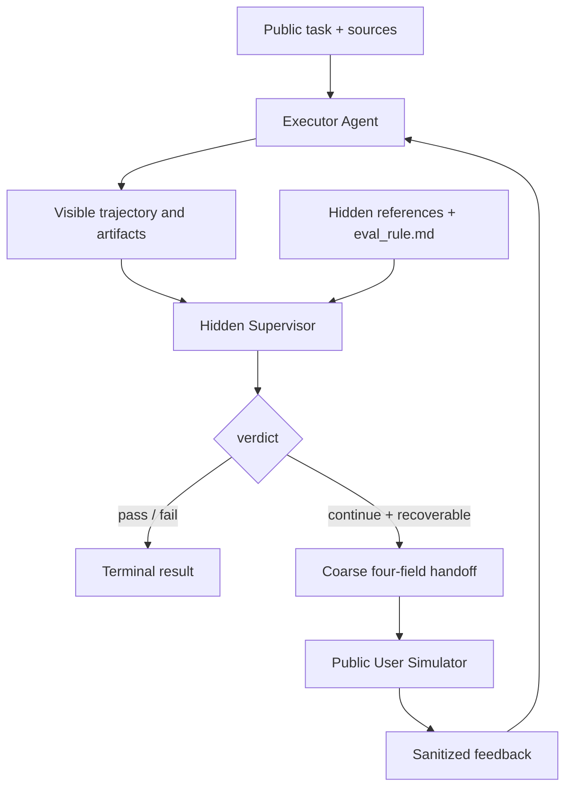
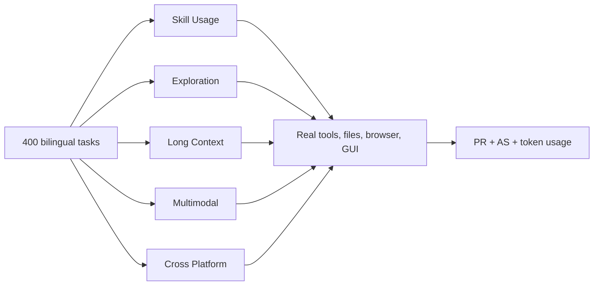

# UniClawBench：把主动 Agent 评测从“单次答题”推进到真实闭环任务

## 元信息

| 字段 | 内容 |
| --- | --- |
| 论文 | UniClawBench: A Universal Benchmark for Proactive Agents on Real-World Tasks |
| 作者 | Zhekai Chen, Chengqi Duan, Kaiyue Sun, Bohao Li, Yuqing Wang, Manyuan Zhang, Xihui Liu |
| 时间 | arXiv v1, 2026-07-09 17:59:32 UTC |
| 链接 | [arXiv](https://arxiv.org/abs/2607.08768), [PDF](https://arxiv.org/pdf/2607.08768), [GitHub](https://github.com/HKU-MMLab/UniClawBench), [Project Page](https://uniclawbench.github.io/) |
| 类型 | 大模型 Agent 评测、主动助手、真实环境闭环 benchmark |

## TL;DR

- UniClawBench 关注的问题不是“模型会不会回答一个网页题”，而是“主动 Agent 能否在真实工具、浏览器、文件、GUI 和多轮用户反馈中完成可验证任务”。
- 论文把任务拆成 5 类核心能力：Skill Usage、Exploration、Long-Context Reasoning、Multimodal Understanding、Cross-Platform Coordination；每类 40 个英文任务和 40 个中文镜像任务，总计 400 个双语真实任务。
- 评测机制不是静态答案匹配，而是三角色闭环：Executor Agent 执行任务，Hidden Supervisor 用隐藏 rubric 检查轨迹和产物，Public User Simulator 只接收粗粒度进度信号并生成自然反馈，避免把答案或评分细则泄漏给被测 Agent。
- 实验以 PR 和 AS 两个指标报告：PR 是最终通过率，AS 是 checkpoint-based 平均得分。自动评测在 50 条轨迹上与 3 名人工专家多数票达到 92.0% pass/fail agreement，AS 与人工均分的相关性为 Pearson r=0.71、Spearman rho=0.68。
- 最强模型的绝对通过率仍低于 50%。Claude Opus-4.8 + OpenClaw 的总体 PR 为 0.475，GPT-5.4 + OpenClaw 为 0.407；这说明当前 Agent 经常能拿到不少中间分，却无法把长链路任务完整收束。
- 跨框架结果比单纯换模型更有解释力：OpenClaw 统一轨迹保留更多上下文，EDICT 多 Agent 编排有协调摩擦，Nanobot token 更省但完整产物不足。论文的核心判断是：框架结构会放大或压制模型能力。
- 局限也很清楚：400 个手工任务规模仍小，真实环境会带来网页、账号、GUI 和服务状态漂移，LLM supervisor 仍可能有偏差；并且论文实验每个 model-task-backend 组合只跑一次，没有误差线。

## 研究问题：为什么现有 Agent benchmark 不够用？

### 作者真正要测什么？

- 论文把 proactive agent 定义为能在日常工具环境中主动协助用户的系统，而不是只响应单轮 prompt 的聊天模型。
- 这类系统的典型动作包括：
  - 打开浏览器、终端、文件系统或桌面应用。
  - 在不完整信息中探索路径。
  - 保存截图、JSON、Markdown、CSV、脚本或 GUI 状态作为证据。
  - 接收用户纠错后继续推进，而不是一次失败就终止。

### 现有 benchmark 的三类结构性缺口

| 缺口 | 传统做法 | 为什么会误判主动 Agent |
| --- | --- | --- |
| 环境过静态 | 用镜像网站、缓存网页、固定 VM 或单次问答 | 真实网页价格、页面字段、登录状态、API 行为会变化，预录答案很快过期 |
| 交互过单轮 | 一次任务一次结果，缺少用户纠错 | 真实助理经常在用户反馈后修复文件、补证据、重跑脚本 |
| 分类过场景化 | 用“办公”“购物”“研究”等应用场景分类 | 一个办公任务失败可能是视觉、长上下文、工具使用或跨应用协调失败，根因被混在一起 |

### 论文的重新定义

作者把问题从：

> “Agent 在某个场景里最终答对了吗？”

改写为：

> “Agent 的哪一种基础能力在真实闭环任务中成为瓶颈？模型能力和框架结构分别贡献了什么？”

这个改写很重要，因为它让 benchmark 从排行榜工具变成诊断工具：

- 如果 Skill Usage 高而 Cross-Platform 低，说明工具调用本身不是主要问题，跨应用状态管理才是。
- 如果 AS 高而 PR 低，说明 Agent 能做部分正确步骤，但没有把链路收束成完整、可审计交付物。
- 如果同一模型在不同框架下差异很大，说明失败不能完全归因于 base model。

## 论文主张与论证路线

| Claim | Mechanism | Evidence | Boundary |
| --- | --- | --- | --- |
| 真实主动 Agent 需要能力导向评测 | 5 类 capability taxonomy，每类任务主瓶颈清晰 | 400 个任务按能力、语言、输入和输出格式构造 | 手工任务有限，边界仍由作者定义 |
| 静态答案不适合动态环境 | Hidden checkpoint rubric 替代预录唯一答案 | Supervisor 检查轨迹、产物和中间证据 | Supervisor 是 LLM，仍需可靠性校验 |
| 多轮反馈必须被纳入评分 | Executor、Supervisor、User Simulator 三角色闭环 | Figure 4 显示 pass rate 随 cycle 从 23.8% 到 29.5% 再到 31.7% | 用户模拟器不等价于真实用户 |
| 框架结构影响不小于模型选择 | 同一模型跨 OpenClaw、EDICT、Nanobot 比较 | GPT-5.4 的总体 PR：OpenClaw 0.407、EDICT 0.338、Nanobot 0.290 | 框架实现、prompt、工具包可能影响结论 |
| 当前 Agent 的主要失败是“半路失败” | 同时报告 PR 与 AS | 多数模型 checkpoint 分数明显高于最终通过率 | AS 高不必然代表真实可用，只说明局部进展 |

## 方法机制：UniClawBench 怎么构造任务？

### 五类能力不是五个应用场景

| 能力维度 | 主要瓶颈 | 代表任务形态 | 失败信号 |
| --- | --- | --- | --- |
| Skill Usage | 选对并正确使用任务声明的工具或 skill | OCR、CSV 对账、SQLite 查询、Mermaid 生成、Docker 审计 | 不读 skill 文档、只凭常识编结果、产物格式不对 |
| Exploration | 在噪声和不完整信息中找路径 | 反查 API 字段、审计 shell 配置、追溯图片来源、比较候选项 | 没有负证据、只试第一条结果、没有探索记录 |
| Long-Context Reasoning | 在长链路证据中保持全局一致 | 读多网页/视频/PDF/邮件/日志后生成计划或报告 | 忘记前置约束、冲突未消解、引用与结论不匹配 |
| Multimodal Understanding | 依赖图片、视频、音频而非文本元数据 | 视频截图、图表复现、照片检查、字幕生成 | 没有视觉证据、用文件名猜测、截图与描述不对应 |
| Cross-Platform Coordination | 跨浏览器、终端、文件、日历、桌面 GUI 保持状态 | Zotero + Obsidian 文献流、Slack 集成、旅行/日历/地图联动 | 状态没有迁移、GUI 副作用未验证、截图缺失 |

### 任务包的核心不是 prompt，而是可检查执行上下文

论文和 GitHub 文档中的 task schema 显示，一个任务不是单独自然语言问题，而是一个 package：

- `task:`：Executor 可见的自然语言请求。
- `references/`：只给 Supervisor 的隐藏评测材料。
- `sources/`：拷贝进 Executor 容器的公开材料。
- `skills/`：任务声明的技能包。
- `services/`：后台服务，放在 harness-private 路径下。
- `.privacy`：只列环境变量名，真实值来自本地 gitignored 配置。

这套结构的关键是把“用户能看到什么”和“评分器知道什么”分开：

- Executor 只能看到公开任务、工具输出和容器内公开文件。
- Supervisor 同时看到公开轨迹、结果文件、隐藏参考和评分规则。
- User Simulator 看不到隐藏答案，只能基于公开轨迹和粗粒度进度继续追问。

## 三角色闭环：信息防火墙如何工作？

### 闭环流程



### 信息防火墙的细节

| 角色 | 可见 | 不可见 | 作用 |
| --- | --- | --- | --- |
| Executor | 公开任务、公开 sources、工具、结果目录、用户反馈 | 隐藏 references、评分细则、Supervisor 推理 | 真正执行任务 |
| Supervisor | 公开轨迹、结果文件、hidden references、eval_rule、必要隐私 env | 无需向 Executor 公开私有推理 | 打分、判断 pass/continue/fail |
| User Simulator | 公开任务、公开轨迹、四字段 supervisor handoff | 隐藏答案、rationale、missing_artifacts | 像用户一样给下一轮自然反馈 |

四字段 handoff 只有：

```json
{
  "verdict": "continue",
  "attempt_state": "incomplete",
  "recoverable": true,
  "score": 0.35
}
```

这个设计背后的判断是：

- 如果用户模拟器看到完整 rubric，它可能把答案或评分标准泄漏给 Executor。
- 如果用户模拟器完全不知道进度，它给出的反馈会太随机，难以形成有效闭环。
- 所以论文选择只暴露粗粒度状态，让反馈像真实用户纠错，而不是像考官泄题。

## 指标与公式：PR 和 AS 分别说明什么？

### 指标定义

```text
PR = passed_tasks / terminal_tasks

AS = (1 / N) * sum_i supervisor_score_i

pass_i = 1 if final_score_i >= success_threshold_i else 0
```

变量解释：

- `passed_tasks`：最终达到任务成功阈值的任务数。
- `terminal_tasks`：进入终态的任务数，runtime error 或 rate limit 类异常会被单独处理。
- `supervisor_score_i`：Supervisor 基于 checkpoint rubric 给出的连续分数。
- `success_threshold_i`：任务级阈值，默认 1.0，部分任务可设置较低阈值。

### 为什么必须同时看 PR 和 AS？

| 情况 | PR | AS | 研究含义 |
| --- | --- | --- | --- |
| 低 PR、低 AS | 低 | 低 | Agent 基本没有找到正确路径 |
| 低 PR、高 AS | 低 | 高 | Agent 做了不少局部步骤，但最后产物不完整或关键约束失败 |
| 高 PR、中 AS | 高 | 中 | 任务可通过，但 checkpoint 证据质量一般 |
| 高 PR、高 AS | 高 | 高 | 完整执行且证据充分 |

UniClawBench 的实验重点恰好落在第二类：

- 很多模型能拿到不错 checkpoint 分。
- 但最终 pass rate 仍低，说明长链路中一次不可恢复错误就会毁掉整体任务。
- 这比传统“最终答案是否匹配”更能解释 Agent 为什么在真实使用中让人不放心。

## 实验设置：论文实际跑了什么？

### 任务与运行环境

| 项 | 设置 |
| --- | --- |
| 任务数 | 400 个双语任务，5 类能力，每类 40 英文 + 40 中文 |
| 运行环境 | Docker 容器，真实浏览器、文件、工具、GUI 相关能力 |
| 基础工具 | apt skill、DuckDuckGo Search skill、Web Search skill、Agent-Browser skill、Desktop Control skill |
| 平均任务耗时 | 约 17.4 分钟 |
| 标准任务预算 | 每轮 20 分钟，总 executor 时间 30 分钟 |
| 长上下文任务预算 | 每轮 30 分钟，总 executor 时间 45 分钟 |
| 跟进次数 | 初始任务后最多 2 次 user follow-up |
| 指标 | Pass Rate, Average Score, token usage |

### 自动评测可靠性

论文抽样 50 条完成轨迹，让 3 名人类专家独立判断：

| 检查项 | 结果 |
| --- | --- |
| 自动 pass/fail 与人工多数票 agreement | 92.0% |
| 自动 AS 与人工均分 Pearson r | 0.71 |
| 自动 AS 与人工均分 Spearman rho | 0.68 |
| 解释 | Supervisor 不是完美裁判，但与人工判断有较强一致性 |

这里要注意两个边界：

- GitHub 的 reproducibility 文档说明，论文中的双 supervisor agreement 和相关性来自额外 off-repo 实验脚本，不是默认 dispatcher 路径的一部分。
- 论文分数没有 error bars，每个 model-task-backend 组合因为成本只跑一次；所以它更适合看结构性趋势，而不是拿小数点后差异做硬排名。

## 主结果：模型强了，但真实闭环仍然很难

### OpenClaw 下的跨模型结果

| 模型 | Overall PR | Overall AS | 读法 |
| --- | ---: | ---: | --- |
| Claude Opus-4.8 | 0.475 | 0.702 | 通过率最高，但仍不到一半 |
| Claude Sonnet-4.6 | 0.455 | 0.763 | AS 高于 Opus，说明局部 checkpoint 表现强 |
| GPT-5.4 | 0.407 | 0.774 | AS 最高一档，但仍有明显半路失败 |
| Kimi-2.6 | 0.362 | 0.709 | 开源/开放模型接近部分闭源模型 |
| Gemini-3.1-Pro | 0.325 | 0.727 | AS 可观，PR 不高 |
| Qwen-3.5-Plus | 0.318 | 0.731 | 表明开放模型在 agent 任务上追近 |
| GPT-4.1 | 0.152 | 0.488 | 长链路和工具环境明显吃力 |

### 论文最值得带走的现象：halfway failure

作者强调，很多模型的 AS 明显高于 PR：

- 这不是“完全不会做”。
- 更像是“做到了 60% 到 80%，但某个关键产物、证据、约束或跨应用状态缺失”。
- 在用户视角，这类失败仍然是失败，因为最终交付物无法直接使用。

一个典型例子是论文 appendix 的 Library of Congress 图片权限任务：

- Cycle 1 中 Agent 已经找了 API、写了文件、验证了若干图片资源。
- Supervisor 给出 `score=0.65`、`verdict=continue`，指出选择覆盖面和排除文件一致性不足。
- User Simulator 给出公开反馈。
- Cycle 2 中 Agent 不只是修补保存文件，而是重新拉 item-level JSON，发现额外问题，最终 `score=0.96` 通过。

这个例子说明多轮闭环的价值：

- 传统单轮评测会把 Cycle 1 直接判失败。
- UniClawBench 可以度量“可恢复失败”。
- 但它也暴露了 Agent 的可靠性问题：没有 supervisor/user feedback 时，Agent 很容易停在半成品。

## 跨框架结果：为什么 OpenClaw、EDICT、Nanobot 差异大？

### GPT-5.4 的跨框架对比

| 框架 | Overall PR | Overall AS | Avg input tokens | Avg output tokens |
| --- | ---: | ---: | ---: | ---: |
| OpenClaw | 0.407 | 0.774 | 1.15M | 11.0K |
| EDICT | 0.338 | 0.744 | 1.68M | 18.3K |
| Nanobot | 0.290 | 0.640 | 0.57M | 9.5K |

### Claude Opus-4.8 的跨框架对比

| 框架 | Overall PR | Overall AS | Avg input tokens | Avg output tokens |
| --- | ---: | ---: | ---: | ---: |
| OpenClaw | 0.475 | 0.702 | 0.78M | 16.4K |
| EDICT | 0.415 | 0.687 | 2.15M | 42.7K |
| Nanobot | 0.385 | 0.587 | 0.49M | 16.2K |

### 机制解释

| 框架 | 论文解释 | 我认为最关键的机制 |
| --- | --- | --- |
| OpenClaw | 集中式 single-agent 轨迹，信息损失少 | 任务约束、工具证据、用户反馈保留在一个连续上下文里，强模型更容易收束 |
| EDICT | 多 Agent 编排有 coordination friction | 子 Agent 如果没有精确传回状态，orchestrator 只能看到离散 board 状态，长上下文任务中还会忘记身份和职责 |
| Nanobot | 极简框架 token 省，但完整产物弱 | 低成本结构减少了上下文和推理展开，适合轻任务，不适合需要细证据的长链路任务 |

这组结果对 Agent 系统设计很有启发：

- 多 Agent 并不天然更强；如果状态同步、handoff、监督和产物汇总不够强，多 Agent 会把推理问题变成协调问题。
- token 省也不等于可靠；真实任务要求“产物可检查”，而不是“过程简洁”。
- 单 Agent 长上下文并不优雅，但在当前模型能力下，少丢上下文可能比复杂编排更重要。

## Figure 与 Table 证据重构

### Figure 1：Benchmark 概览



Figure 1 的作用不是证明某个模型更强，而是说明论文的两个核心承诺：

- 覆盖真实任务形态，而不是单一网页或单一 GUI。
- 把能力维度、闭环交互和跨框架实验放在同一个评测系统里。

### Figure 2：三角色闭环

| 模块 | 图中含义 | 论文要证明的点 |
| --- | --- | --- |
| Executor | 在真实环境中执行公开任务 | 评测对象必须产生轨迹和可检查产物 |
| Hidden Supervisor | 读取隐藏 rubric 和可见证据 | 动态环境里不能只靠固定答案 |
| User Simulator | 只拿粗粒度状态生成反馈 | 可以模拟多轮纠错，同时降低泄题风险 |
| Information Firewall | 隔离 hidden references 和 public feedback | 让多轮交互不破坏评测有效性 |

### Figure 3：任务多样性

Figure 3 用 heatmap 展示应用领域、输入格式和输出格式分布。它的证据意义在于：

- 任务不只集中在 web search 或 coding。
- 输入包括 live web、图片、PDF、视频、日志、数据库、代码仓库等。
- 输出包括 JSON、截图、CSV、报告、GUI 状态等。

这支持作者的 claim：UniClawBench 不是“换一批网页题”，而是尝试覆盖主动助手的真实工作面。

### Figure 4：token 与 cycle 进展

| 观察 | 数字 | 解释 |
| --- | --- | --- |
| 长上下文平均输入 token 高 | 约 2.3M | 这类任务确实需要跨材料累积证据 |
| 多模态平均输入 token 也高 | 约 1.2M | 截图、视频、视觉证据让轨迹变重 |
| pass rate 随 cycle 上升 | 23.8% -> 29.5% -> 31.7% | 用户反馈能修复一部分可恢复失败 |
| cumulative-max score 上升 | 0.565 -> 0.652 -> 0.679 | 即使未通过，checkpoint 进展也变多 |

这张图对“为什么要闭环”给了直接证据：多轮反馈不是装饰，而是会改变成功率和中间得分。

## 相关工作位置判断

### 它和 WebArena / OSWorld / VisualWebArena 的关系

- 这些 benchmark 推动了 web、OS、视觉网页任务评测。
- 但很多任务仍偏 isolated execution，或依赖静态目标。
- UniClawBench 的差异是把主动助手任务放进 live Docker runtime 和多轮监督闭环。

### 它和 ClawBench / LiveClawBench / ClawMark 的关系

- ClawBench 系列已经强调真实网站和 OpenClaw 生态。
- LiveClawBench 更接近真实 assistant 任务。
- ClawMark 关注多日 coworker 场景和动态后端。
- UniClawBench 的增量在于 capability taxonomy 与 cross-framework attribution：它不只问“成功了吗”，还问“是哪个能力或框架环节让它失败”。

### 它和 SkillsBench / SkillCenter 的关系

- SkillsBench 和 SkillCenter 更聚焦 skill 的组织、检索和使用。
- UniClawBench 把 Skill Usage 作为五类能力之一，但不把 Agent 能力收缩成 skill 检索问题。
- 这能避免一个误区：即使 skill 用得好，Agent 仍可能在多模态、跨平台和长上下文上失败。

## 失败案例与消融式判断

### 论文没有传统 ablation，但有三类“准消融”

| 准消融对象 | 对比方式 | 结论 |
| --- | --- | --- |
| 模型能力 | 同一 OpenClaw 框架下跑 10 个模型 | 强模型 PR 更高，但都低于 50% |
| 框架结构 | 同一模型跨 OpenClaw、EDICT、Nanobot | 框架影响显著，尤其强模型更受结构放大或瓶颈影响 |
| 交互 cycle | 比较第 1、2、3 轮进展 | 多轮反馈提高 PR 和 cumulative-max score |

### 最重要的失败边界

- **长上下文失败**：Agent 不是单纯读不完材料，而是无法在多源证据中保持约束一致。
- **多模态失败**：产物可能像正确报告，但截图、视频帧、图像证据没有真正支撑结论。
- **跨平台失败**：文本总结正确不代表 GUI、日历、文件或外部应用状态真的被修改。
- **多 Agent 失败**：handoff 丢状态后，orchestrator 可能重复劳动或绕过子 Agent。
- **benchmark overfitting 风险**：如果未来系统专门优化 UniClawBench 任务包格式，PR 可能上升但泛化未必上升。

## 可复现性和工程边界

### GitHub release 里能看到什么？

GitHub README 和 docs 显示仓库包含：

- `lib/`：runtime、task loading、privacy、proxy adapter、supervision helpers。
- `lib/runner/`：container lifecycle、backend adapter、artifact collection、status normalization。
- `lib/supervision/`：Supervisor 和 User Simulator 工作区构建、transcript normalization、feedback rewriting。
- `tasks/` 和 `injection/`：400 个任务 YAML、公开资源、隐藏 references、skills、services。
- `webui/`：动态 WebUI 和 static export，用于 review leaderboards、tasks、traces、artifacts、timelines。

### 复现前要注意的硬条件

| 条件 | 影响 |
| --- | --- |
| Git LFS | 大型 task fixture 需要 materialized assets，不只是 pointer |
| Docker buildx | 后端运行镜像依赖 Docker |
| 本地 API 和隐私配置 | 真实 model provider、OAuth、API key 不提交到仓库 |
| SNAPSHOT_MODE | 决定用离线 snapshot 还是真实 live API |
| Long-context timeout | 需要显式设 30/45 分钟，否则结果会偏低 |
| 单次运行 | 默认没有重复 N 次估计置信区间 |

### 我对复现数字的读法

- PR/AS 可以作为模型和框架组合的压力测试。
- 不宜把 0.407 vs 0.415 这种微小差异当作严格排名。
- 更应该看结构性差异：
  - 哪类能力最低？
  - AS 和 PR 差多少？
  - token 消耗是否换来了更高 pass rate？
  - 多轮反馈是否让失败变成可恢复？

## 结论与局限

### 这篇论文真正贡献了什么？

- 它把主动 Agent 评测从“答对最终文本”推进到“在真实环境中留下可审计轨迹和产物”。
- 它把任务分类从应用场景改成能力瓶颈，有助于定位失败根因。
- 它把多轮反馈纳入 benchmark，而不是把用户纠错看成评测外变量。
- 它明确展示了框架结构的重要性：Agent 系统不是只靠更强 base model 就能自动可靠。

### 证据边界

- 400 个任务覆盖面不错，但仍是手工构造，不代表所有真实个人助理工作流。
- 自动 Supervisor 与人工判断相关性较强，但不是无偏裁判。
- 真实环境会漂移，网页、账号、服务、GUI 状态都可能影响复现。
- 每个实验 cell 只跑一次，缺少置信区间和方差分析。
- 项目页和仓库当前是刚发布状态，长期维护、社区复现和 leaderboard 更新还需要观察。

### 还缺哪些实验？

| 追问 | 为什么重要 | 可行实验 |
| --- | --- | --- |
| 重复运行方差 | 单次运行无法区分框架差异和随机轨迹波动 | 对 50 到 100 个代表任务重复运行 3 到 5 次，报告 PR/AS 置信区间 |
| Supervisor 校准 | LLM 裁判可能偏向长回答或特定框架轨迹 | 用人工复核、第二独立 supervisor、规则检查器三方交叉 |
| 任务漂移影响 | live web 和 GUI 会随时间变化 | 固定 snapshot 与 live mode 同时跑，比较成功率差异 |
| 用户反馈质量 | Public User Simulator 不是实际用户 | 用真实用户纠错、合成用户、无反馈三组对比 |
| 安全边界 | 主动 Agent 任务常涉及凭证、文件和外部副作用 | 加入权限最小化、隐私泄漏、越权写入和回滚 checkpoint |

这些补充实验会让论文的结论更稳：

- 如果重复运行后 OpenClaw 仍显著优于 EDICT/Nanobot，框架结构结论会更有统计说服力。
- 如果 snapshot mode 与 live mode 差异很大，说明 benchmark 还需要把环境漂移本身作为一项指标。
- 如果真实用户反馈明显优于模拟用户，后续闭环评测就需要重新设计用户模拟器，而不是只调 executor。
- 如果安全 checkpoint 会显著降低 PR，说明“完成任务”和“安全完成任务”之间仍有系统性张力。

## 领域延伸：对 Agent 研究的三个继续追问

### 1. Agent 评测是否应该从“答案正确”转向“产物可审计”？

UniClawBench 给出的方向是肯定的：

- 真实用户关心的是文件是否生成、截图是否对应、脚本是否可运行、外部状态是否真的改变。
- 这意味着未来 Agent benchmark 需要把 artifact schema、trace review 和 hidden rubric 作为一等对象。
- 对安全研究也一样：没有轨迹和证据，就很难判断 Agent 是否越权、泄漏或绕过约束。

### 2. 多 Agent 编排的收益什么时候超过协调成本？

EDICT 的结果提醒我们：

- 多 Agent 架构需要更强的 shared state、实时监督、handoff protocol 和 artifact ownership。
- 否则它只是把一个长上下文问题拆成多个不一致的短上下文问题。
- 后续研究可以专门测：
  - 子 Agent 是否完整传回约束？
  - orchestrator 是否能检测子任务失败？
  - 共享记忆是否会污染角色边界？

### 3. 主动 Agent 的安全评测应不应该嵌入同类闭环？

我认为应该。原因是：

- 安全失败常常不是第一步就发生，而是在多轮修复、工具调用、跨应用迁移中累积。
- 如果只测单轮拒答或静态 jailbreak，就看不到真实 agentic risk。
- UniClawBench 的 hidden supervisor + public user simulator 结构，可以扩展到权限边界、隐私泄漏、工具滥用和越权执行测试。

更进一步的安全 benchmark 可以在同一框架里加入：

- 权限最小化 checkpoint。
- 隐私变量不可见性检查。
- 外部副作用确认。
- 用户反馈中的 prompt injection 检测。
- 跨应用状态回滚和审计日志。

## 最后判断

UniClawBench 的价值不在于又给 Agent 排了一张榜，而在于它把“真实任务为什么失败”拆得更细：

- 模型有没有能力？
- 框架有没有保留关键上下文？
- 工具和 GUI 是否真的被使用？
- 用户反馈是否能让失败恢复？
- 最终交付物是否有可审计证据？

这对大模型 Agent 研究是一个更高标准。未来如果一个 Agent 声称适合长期个人助手、研究助理或跨应用自动化，它至少需要回答 UniClawBench 暴露的核心问题：在动态环境、多轮反馈、隐藏评分、跨工具和跨平台状态中，它到底是完整完成任务，还是只是在中途留下一个看起来像答案的半成品。
