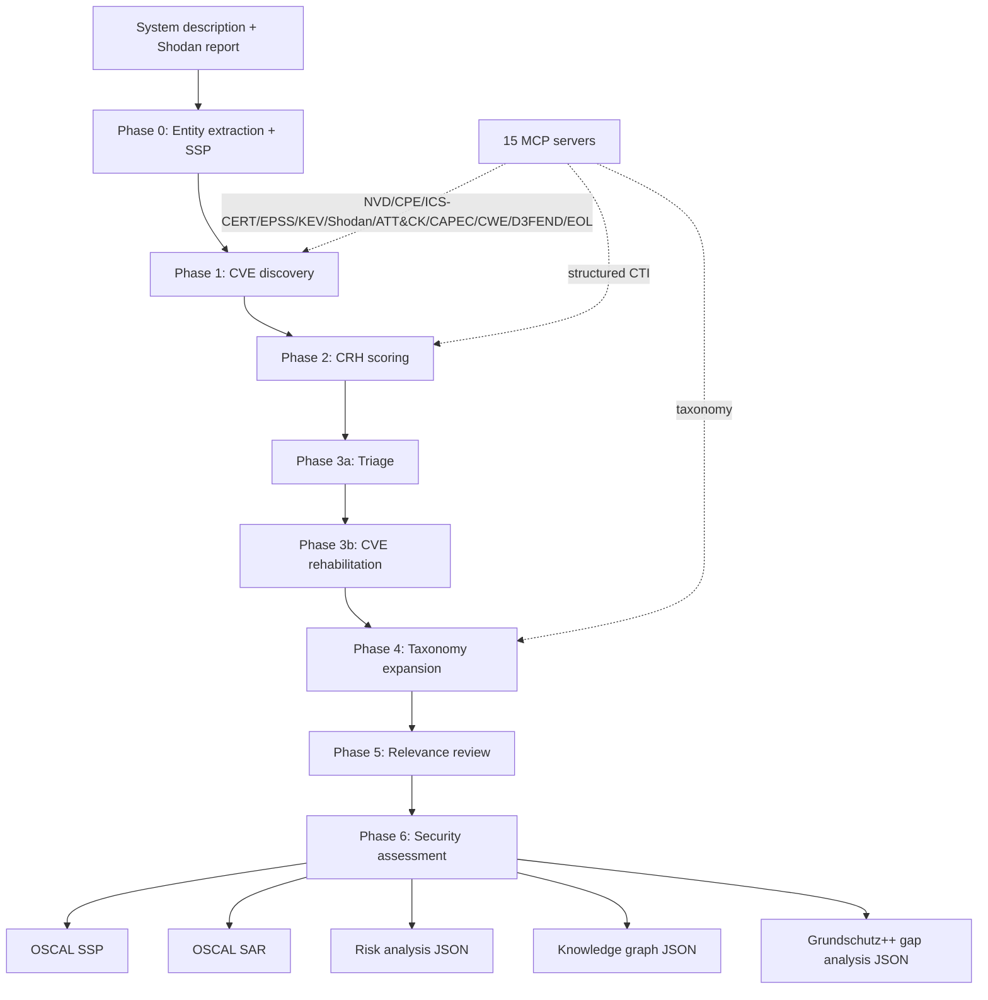

# From Legacy Documentation to OSCAL：用 MCP 把关键基础设施文档变成可审计安全账本

## 元信息

- **论文**：[From Legacy Documentation to OSCAL: An MCP-Based Agent Pipeline for Threat-Informed Continuous Compliance in Critical Infrastructure](https://arxiv.org/abs/2607.08288)
- **作者**：Lea Roxanne Muth、Marian Margraf，Freie Universität Berlin。
- **提交时间**：2026-07-09 09:32:03 UTC；论文标注已接收 IEEE CSR 2026。
- **类别**：AI 安全 / AI for Security / MCP 安全工程 / 关键基础设施合规。
- **深读材料**：arXiv 摘要页、HTML 全文、TeX 源码、NIST OSCAL 参考页、论文引用的 MCP 与 OSCAL 背景。
- **本文边界**：本文不复现 WaterWork 场景，也不声称该 pipeline 已可直接替代人工审计；重点是分析它如何把 LLM 失误面从“下游虚构漏洞”收缩到“上游实体抽取”。

## TL;DR

- **这篇论文做什么**：它提出一个非侵入式、MCP-grounded、多 Agent 管线，把关键基础设施的自然语言系统描述和 Shodan 报告转成知识图谱，再导出 NIST OSCAL System Security Plan（SSP）和 Security Assessment Report（SAR）。
- **为什么重要**：水务、能源等 OT/ICS 环境往往不能主动扫描；但合规、漏洞优先级和攻击路径分析又需要实时证据。普通 RAG 容易把语义相似误当事实，甚至虚构 CVE、CVSS 或攻击路径；论文用 MCP 约束 Agent 必须调用确定性 CTI 工具。
- **怎么做**：系统用 15 个 MCP server 连接 NVD、CPE、US-CERT、ICS-CERT、OpenCVE、KEV、EPSS、Shodan、ATT&CK、CAPEC、CWE、D3FEND、EOL 等源；八阶段 pipeline 先抽取资产和 SSP，再发现 CVE、计算 CRH、triage、rehabilitation、taxonomy expansion、relevance review，最后生成 SAR。
- **关键数字**：在合成但有证据基础的 WaterWork 水务场景中，5 次独立运行都识别 8 个实体，发现 `398 ± 9` 个 CVE；确定性 KG 节点 factual hallucination 为 `0%`；Phase 0 实体抽取 precision 为 `87.5%`、recall 为 `100%`、semantic hallucination 为 `12.5%`；最终 CVE recall 为 `0.90`、precision 为 `0.74`，D3FEND recall 为 `1.00`、precision 为 `0.88 ± 0.01`。
- **最值得带走的判断**：MCP grounding 没有消灭幻觉，而是改变了幻觉形态。虚构 CVE 被消掉了，但一个被 Phase 0 错抽出来的“Windows unknown version”会触发真实但不相关的 CVE 检索，带来 `8.5 ± 0.2%` contextual false positive。
- **局限**：评测只有一个合成参考架构；CRH 只是透明启发式，不是专家验证过的 OT 风险标准；攻击路径偏软件漏洞，不覆盖凭证盗用、内部人员、社工；BSI Grundschutz++ 仍是 preview，正式认证状态要等最终版本。

## 问题意识：为什么关键基础设施不能直接用普通 Agent 安全分析？

### OT 环境的安全评估有三个硬约束

- **不能随便扫**：
  - 关键基础设施里常见 PLC、HMI、SCADA、historian、VPN gateway。
  - 老设备生命周期很长，主动扫描可能影响可用性。
  - 在水务、能源和工业控制系统里，一次误操作可能不只是服务中断，而是物理过程风险。

- **不能只靠静态文档**：
  - 操作员通常有自然语言文档、供应商说明、网络拓扑片段和 Shodan 暴露信息。
  - 合规系统需要结构化资产、控制项、漏洞、风险路径和审计证据。
  - 这中间缺的是“从 legacy description 到 audit-ready artifact”的转换层。

- **不能接受 LLM 编造事实**：
  - 安全报告里的 CVE ID、CVSS 分数、KEV 状态、ATT&CK 技术、D3FEND 对策必须可查。
  - 如果 LLM 编造攻击路径，OT 操作者可能错误停机、错误隔离或错过真正高风险资产。
  - 因此作者把 LLM reasoning 和 deterministic retrieval 分开，让 Agent 只能通过 MCP 查权威源。

### 论文的核心 claim

| Claim | Mechanism | Evidence | Boundary |
| --- | --- | --- | --- |
| MCP 可以降低 fabricated vulnerability 风险 | CVE、CVSS、EPSS、KEV、taxonomy 都通过确定性 MCP server 查询 | KG 中 deterministically sourced nodes 的 factual hallucination 为 `0%` | Phase 0 错抽资产仍会导致真实但不相关 CVE |
| 合规输出可以机器校验 | KG 转 OSCAL SSP / SAR，并通过 NIST OSCAL v1.1.2 JSON Schema | 5 次运行 SSP 和 SAR 都 schema-valid | schema-valid 不等于风险判断正确 |
| OT 风险需要超越 CVSS | CRH 融合 CVSS、资产关键性、暴露面、EPSS、KEV | CRH 与 SSVC Spearman `rho=0.797`，高于 CVSS-SSVC `rho=0.677` | SSVC 对比是间接一致性，不是专家金标准 |
| 最关键 trust boundary 是实体抽取 | LLM 只在 Phase 0 / 0b / 3b / 5 / 6 参与，确定性阶段可复现 | semantic hallucination `12.5%`，contextual false positive `8.5%` | 如果 Phase 0 无人工复核，错误会确定性传播 |

## 架构：八阶段 pipeline 如何把文本变成 OSCAL？



### Phase 0：把自然语言变成资产清单和 SSP

- 输入：
  - 系统描述。
  - Shodan report。
  - BSI Grundschutz++ catalog。

- Agent 抽取：
  - vendor name。
  - version number。
  - topological role：Gateway / Pivot / Target。
  - asset type：PLC / HMI / Workstation 等。
  - criticality：critical / high / medium / low。
  - exposure：internet / DMZ / internal / isolated。

- 输出：
  - 初始 KG。
  - OSCAL SSP JSON。
  - 这一步是全系统最关键的 LLM trust boundary。

### Phase 1：CVE discovery

- 发现顺序：
  - 先解析已知 CVE。
  - 再用 CPE 字符串查 NVD。
  - 然后按制造商查 CISA ICS-CERT advisory。
  - 对重命名产品做 alias CPE lookup。
  - 对缺 CPE 的实体做 keyword / concept fallback。

- 置信度：
  - CPE match：`1.0`。
  - ICS-CERT match：`0.9`。
  - keyword match：`0.7`。
  - fallback：`0.5`。

### Phase 2：CRH scoring

论文提出 Critical Infrastructure Relevance Heuristic（CRH），核心是把 OT 上下文放回漏洞优先级。

$$
U=(S_{base}\times M_{context})+B_{threat}
$$

其中：

$$
S_{base}=\max(CVSS,5.0)
$$

$$
M_{context}=C_{crit}\times E_{exp}
$$

$$
B_{threat}=EPSS\times5+
\begin{cases}
5,& CVE\in KEV\\
0,& \text{otherwise}
\end{cases}
$$

| 变量 | 含义 | 设计目的 |
| --- | --- | --- |
| `S_base` | CVSS 派生 severity base，最低设为 `5.0` | 给 SCADA / PLC 场景一个 floor，避免低 CVSS 掩盖物理风险 |
| `C_crit` | 资产关键性，critical `1.5`、operational `1.25`、support `1.0` | 用 Purdue model 近似资产离物理过程的距离 |
| `E_exp` | 暴露面，internal `1.0`、internet-exposed `1.5` | 将 Shodan 可见性转成风险乘数 |
| `B_threat` | EPSS 与 KEV 组成的 threat bonus | 区分理论影响和现实利用紧迫性 |

- Urgency Index 上限为 `32.5`。
- 分类阈值：
  - Critical：`>=22`。
  - High：`>=14`。
  - Medium：`>=7`。
  - Low：`<7`。

### Phase 3 到 Phase 6：从 triage 到审计输出

| 阶段 | 做什么 | 为什么放在这里 |
| --- | --- | --- |
| Phase 3a Triage | 满足 `U>12`、Gateway/Target 且 `U>5`、或 KEV 命中的 CVE 进入高优先级 | safety-first，宁可多审不要漏关键资产 |
| Phase 3b Rehabilitation | 被丢弃 CVE 再和 SSP inventory、CPE、vendor、EOL 状态核对 | 老旧 EOL 资产没有补丁，可能需要恢复为 relevant |
| Phase 4 Taxonomy Expansion | top-25 high-urgency CVE 展开 CVE→CWE→CAPEC→ATT&CK→D3FEND | 生成可解释攻击路径和防御映射 |
| Phase 5 Relevance Review | Agent 最多额外提升 5 个 CVE，并回填 taxonomy | 给 LLM 一个有限、可审查的纠错窗口 |
| Phase 6 Security Assessment | 用 KG、relevant CVE、attack path 生成 SAR | 把风险证据落到 OSCAL 审计材料 |

## MCP 与 RAG 的差别：不是“检索更准”，而是错误类别变了

| 维度 | 传统 RAG | MCP tool-use |
| --- | --- | --- |
| 检索方式 | 向量相似度 | 结构化 API query |
| 验证方式 | cosine threshold 等概率判断 | endpoint 返回存在 / 不存在 |
| 主要错误 | 幻觉关联、语义近邻误配 | API 缺口、上游实体错误 |
| 新鲜度 | 静态语料，需重建索引 | 实时源查询 |
| OT 适用性 | 低，false positive 可能触发错误操作 | 高，事实节点可逐个验证 |

- 论文没有说 MCP 让 Agent “更聪明”。
- 它说的是：
  - 对 CVE、CVSS、KEV、EPSS 这类事实，Agent 不应该自由生成。
  - MCP 把这些动作变成受限函数调用。
  - 返回 JSON 后可以 schema validation，再写入 KG。

## WaterWork 场景：评测到底测了什么？

### 合成但有证据基础的水务设施

WaterWork 是一个区域水务设施参考架构，包含：

- Cisco ASA 5505，Firmware v9.2.4：
  - 互联网暴露 VPN gateway。
  - 没有 MFA。
  - Shodan report 暴露 TCP/443 AnyConnect 与 UDP/500 ISAKMP。

- 工程工作站：
  - Windows 7 SP1。
  - Advantech WebAccess/SCADA v8.2。

- historian server：
  - Microsoft SQL Server 2012 Express。
  - Windows Server 2012 R2。

- OT 设备：
  - 6 个 Siemens SIMATIC S7-1200 CPU。
  - Firmware v4.0。
  - 通过 S7Comm port 102 与 SCADA workstation 通信。

- 供应商入口：
  - WaterTech Solutions laptop。
  - TeamViewer 11 长期接入。

- 网络形态：
  - IT/OT 之间无 firewall segmentation。
  - flat network：`10.10.10.0/24`。

### ground truth

- 手工交叉 NVD CPE、vendor advisories、ICS-CERT。
- 覆盖 8 个资产。
- 得到 292 个 CVE。
- 构造 15 条多阶段因果攻击路径。
- 包含 16 个 ATT&CK Enterprise technique mapping。
- 包含 34 个 D3FEND countermeasure mapping。

## 结果：0% factual hallucination 下面还有 8.5% contextual false positive

### 汇总指标

| 指标 | 结果 | 怎么理解 |
| --- | ---: | --- |
| 独立运行次数 | 5 | 用相同输入测 Agent phase 方差 |
| 识别实体 | 8 | 每次都识别 8 个 |
| 发现 CVE | `398 ± 9` | 比 ground truth 292 多，包含扩展检索与 false positive |
| KG CVE nodes | `380 ± 9` | 全部对应真实 NVD entry |
| Factual Hallucination Rate | `0%` | 没有虚构 CVE 或虚构 CVSS |
| Entity precision | `87.5%` | 7/8 正确，1 个 FP entity |
| Entity recall | `100%` | ground truth 实体全部找出 |
| Semantic Hallucination Rate | `12.5%` | 1 个错误实体占 8 个抽取实体 |
| Version extraction accuracy | `100%` | 7/7 version 正确 |
| Contextual False Positive Rate | `8.5 ± 0.2%` | 真实 CVE 被挂到不存在实体上 |

### semantic hallucination 的公式

$$
SHR=\frac{FP_{entities}}{TP_{entities}+FP_{entities}}
$$

- 在 WaterWork 里：
  - Agent 多抽了一个 `"Windows (unknown version)"`。
  - 这个宽泛实体被分配了最宽 CPE。
  - Phase 1 因此检索出 55 个 CVE。
  - 其中 50 个只属于这个错误实体。
  - 30 个通过 triage 并进入最终 SAR。

### 这说明 MCP grounding 的真实收益是什么？

- 它确实去掉了虚构事实：
  - CVE 都是真的。
  - KG 节点都能对上权威源。
  - OSCAL JSON 能过 schema。

- 但它没有保证“上下文正确”：
  - 错误资产会触发正确 API。
  - 正确 API 会返回真实 CVE。
  - 真实 CVE 会进入真实知识图谱。
  - 最终报告里就出现真实但不相关的风险。

- 这比普通 RAG 好在哪里？
  - 错误面更集中。
  - Phase 0 后人工复核实体，就能阻断错误级联。
  - 下游 deterministic phases 的错误更容易重放、定位和审计。

## CVE、ATT&CK、D3FEND 的召回与边界

| 目标 | Recall | Precision | 细节 |
| --- | ---: | ---: | --- |
| CVE | `0.90` | `0.74` | 每次匹配 263/292 ground truth CVE |
| ATT&CK techniques | `0.94` | `0.90 ± 0.03` | 每次匹配 14/15 techniques |
| D3FEND countermeasures | `1.00` | `0.88 ± 0.01` | 每次匹配全部 34 个 countermeasures |
| Taxonomy chain completeness | `0.16` vs ground truth `2.80` | - | 只有 top-25 high-urgency CVE 做完整链展开 |

### 29 个稳定 missed CVE 怎么来的？

- 26 个是：
  - Adobe Flash / Reader CVE。
  - Windows Server 2012 R2 font-rendering CVE。
  - 它们来自宽泛 Windows OS CPE。

- 论文认为：
  - Phase 5 把这些过滤掉是合理的，因为它们与 OT deployment context 不相关。
  - 真正的 miss 主要是 CVE-2017-14016（Advantech WebAccess），CPE search 和 ICS-CERT advisory search 都没找到。

- 这暴露了一个硬边界：
  - MCP 只能保证“查了什么源、源返回什么”。
  - 如果老 ICS advisory 覆盖有缺口，deterministic pipeline 也会漏。

## CRH：为什么不用纯 CVSS？

### Score Masking 问题

传统风险公式常写成：

```text
risk = threat * vulnerability * impact
```

- 乘法的危险是：
  - 如果 EPSS 很低，威胁项接近 0。
  - 即使资产是 PLC、影响物理过程，风险也会被压低。
  - 在 OT 场景，这可能错过低概率但高后果的漏洞。

CRH 改用：

```text
contextual severity = CVSS floor * criticality * exposure
threat bonus = EPSS * 5 + KEV bonus
urgency = contextual severity + threat bonus
```

- 这样做的意义：
  - EPSS / KEV 可以提高紧迫度。
  - 但不能单独决定风险。
  - 物理资产关键性始终可见。

### 和 SSVC 的关系

- 对 318 个有 CVSS v3.x vector 的 CVE：
  - CRH vs SSVC 的 Spearman `rho=0.797`。
  - CVSS vs SSVC baseline 是 `rho=0.677`。
  - exact 或 `±1` ordinal class 的 near-agreement 是 `97.5%`，即 310/318。

- 但论文也承认：
  - CRH、SSVC、CVSS 都共享 CVSS、EPSS、KEV 等输入。
  - 所以这不是独立专家验证。
  - 更准确地说，这是一个“间接一致性检查”。

### 敏感性分析

- 作者 one-at-a-time 调整：
  - SCADA floor `S_base`。
  - exposure multiplier `E_exp`。
  - KEV penalty。
  - triage threshold `U`。

- 结论：
  - 14 个配置下 ground truth CVE retention 都是 `100%`。
  - triage threshold 影响最大，triage volume 从 217 到 330 CVE。
  - SCADA floor、exposure multiplier、KEV penalty 在 role-based safety rule 下不改变 triage volume。
  - CVE-2019-10943 的 urgency 是 `11.26`，低于绝对阈值 `12.00`，但因 Target asset 且 `U>5.00` 被保留。

## OSCAL 输出：schema-valid 说明了什么，又不能说明什么？

### 说明了什么

- OSCAL SSP：
  - 描述系统边界、组件和控制实施状态。
  - 可作为动态 KG 的合规基线。

- OSCAL SAR：
  - 将 CVE、attack path、CRH、EOL、affected SSP component 写进 observation。
  - 把技术发现连接回控制要求。

- 5 次运行都通过 NIST OSCAL v1.1.2 JSON Schema：
  - 证明 JSON 结构、字段和模型约束满足 OSCAL。
  - 让输出能进入 compliance-as-code workflow。

### 不能说明什么

- schema-valid 不代表：
  - CVE relevance 全部正确。
  - CRH 权重符合某家水务企业风险偏好。
  - attack path 覆盖凭证、社工、内部人员或现场操作。
  - BSI Grundschutz++ preview 输出具备正式认证地位。

- 因此，最合理的定位是：
  - 自动化准备审计材料。
  - 人工复核 Phase 0 实体和高风险 triage。
  - 连续运行以吸收 CTI 更新。

## 相关工作位置

| 方向 | 论文如何定位自己 |
| --- | --- |
| MCP security analysis | 既参考 MCP attack surface、MCP server vulnerability、tool poisoning 等工作，也把 MCP 用作防御侧 deterministic CTI interface |
| MCP-enabled security agents | AgCyRAG 最接近，但偏 retrospective RAG；本文是 proactive multi-phase threat modeling + OSCAL artifact |
| OT vulnerability prioritization | CVSS 对 IT 影响更敏感，SSVC / RVSS / DVCC / CVSS+EPSS+KEV 各有优点；CRH 试图透明融合 OT criticality 与 exposure |
| OSCAL compliance-as-code | 既有工作假设已有 BOM 或 DSL attack graph；本文处理 legacy natural-language documentation 到 OSCAL 的 ingestion gap |

## 失败模式：这篇论文最诚实的地方

### 1. 错误不是消失，而是上移

- MCP 消掉了 fabricated identifiers。
- 但 Phase 0 的实体错误会被 deterministic retrieval 放大。
- 这对安全系统设计很关键：
  - grounding 不是“相信 Agent”。
  - grounding 是“让 Agent 的错误可定位、可复核、可重放”。

### 2. 单场景评测不足

- WaterWork 是合成参考架构。
- 虽然它有真实 incident pattern 支撑，但只有一个场景。
- 跨能源、交通、医院、制造业的方差没有测。

### 3. CRH 仍是启发式

- 权重透明。
- 但透明不等于正确。
- 需要 OT practitioner 做结构化 concordance study。

### 4. 攻击路径偏软件漏洞

- 未充分覆盖：
  - credential theft。
  - insider abuse。
  - social engineering。
  - physical access。
  - process safety logic。

## 对 AI 安全和 Agent 系统的启发

### Agent 安全不只是“防模型越权”，还包括“让模型不要自由编事实”

- 这篇论文把 MCP 放在一个很具体的位置：
  - 不是给 Agent 更多工具。
  - 而是给 Agent 更窄的事实接口。
  - 事实接口返回结构化 JSON。
  - JSON 进入 KG 前可校验。

- 对高风险领域，这比“让模型解释得更详细”更重要。

### 可信 Agent pipeline 需要把错误面设计成可审计对象

- 一个可审计 pipeline 应该回答：
  - 哪些阶段是 LLM-driven？
  - 哪些阶段是 deterministic？
  - 每个 KG node 的 authoritative source 是什么？
  - 哪个错误会被下游放大？
  - 人工复核应该插在哪个阶段最省？

- 本文给出的答案是：
  - Phase 0 后复核资产清单。
  - 下游 CVE、taxonomy、OSCAL 主要自动化。
  - 如果有 FP，优先查实体抽取，而不是怀疑每个 CVE 节点。

### 对 MCP 生态的反向提醒

- MCP server 自身也会引入攻击面。
- 如果 CTI MCP server 被污染，deterministic retrieval 会确定性传播恶意数据。
- 因此未来系统需要：
  - MCP server version governance。
  - tool definition immutability。
  - source authentication。
  - response provenance。
  - replayable audit logs。

## 继续追问

### 最值得补的实验

- 多行业场景：
  - energy。
  - transport。
  - healthcare。
  - manufacturing。

- Phase 0 复核实验：
  - 人工复核 8 个实体需要多久？
  - 能否把 `8.5%` contextual false positive 降到接近 0？
  - 复核成本和 downstream noise 节省之间如何权衡？

- MCP source failure：
  - NVD / ICS-CERT / KEV / EPSS 延迟时，pipeline 如何标注不确定性？
  - MCP server 返回冲突数据时，KG 如何处理？

- 安全攻防：
  - 恶意系统描述能否诱导错误实体？
  - Shodan report 被投毒会怎样？
  - MCP tool response 被污染时，OSCAL 输出是否能发现异常？

### 本文的核心判断

- 这篇论文的价值不在于“又做了一个安全 Agent”。
- 它的价值在于把高风险 Agent pipeline 的 trust boundary 讲清楚：
  - LLM 负责把自然语言转成结构。
  - MCP 负责把事实查询变成受限工具调用。
  - KG 负责保留可追溯证据链。
  - OSCAL 负责把证据落成可机器校验的审计材料。

- 它最重要的结论也不是 `0% hallucination`，而是更细的版本：
  - **factual hallucination 可以通过 MCP grounding 降低。**
  - **contextual hallucination 仍然会从实体抽取传播。**
  - **因此高风险 Agent 系统的安全重点，应该从“让模型最后别胡说”前移到“让第一步结构化输入可审查”。**
